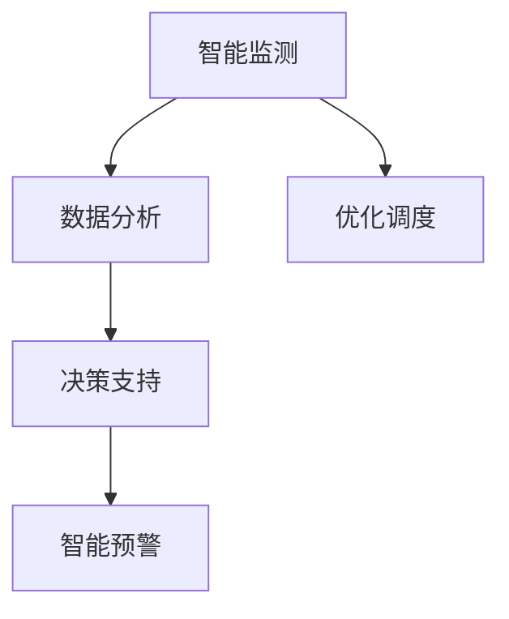

                 

# AI在智能海洋资源管理中的应用：保护海洋生态

## 1. 背景介绍

### 1.1 问题由来

近年来，全球气候变化和人类活动的加剧，使得海洋生态环境面临着前所未有的挑战。海洋资源的过度开发、污染、酸化和生物多样性的丧失等问题，对全球生态系统造成了严重影响。为了保护海洋生态，全球各国纷纷提出了相应的管理政策和行动计划。

与此同时，人工智能(AI)技术的快速发展，为海洋资源管理提供了新的技术手段。AI技术可以实时监测海洋环境，分析海洋生态数据，辅助制定科学的管理决策。因此，AI在智能海洋资源管理中的应用，正在逐步成为全球关注的焦点。

### 1.2 问题核心关键点

AI在海洋资源管理中的应用，主要集中在以下几个方面：

1. **实时监测**：通过传感器、无人机、卫星等设备，实时获取海洋环境数据，如水温、盐度、溶解氧、水质等。
2. **数据分析与建模**：利用机器学习和深度学习模型，对海洋生态数据进行分析，建立预测模型，评估海洋生态状态。
3. **决策支持**：结合海洋生态预测模型和专家知识，辅助制定科学的管理决策，如渔业资源管理、海洋保护区规划等。
4. **智能预警**：通过AI技术，实现对海洋环境污染、赤潮等突发事件的智能预警，保障海洋生态安全。

这些核心关键点构成了AI在海洋资源管理中的主要应用框架，通过技术手段提升了海洋生态保护的科学性和精确性。

### 1.3 问题研究意义

AI在智能海洋资源管理中的应用，具有重要意义：

1. **提升监测效率**：AI可以自动分析和处理海量海洋生态数据，大幅提升监测效率和数据准确性。
2. **辅助科学决策**：AI技术能够挖掘数据背后的模式和规律，为管理决策提供科学依据，避免经验主义带来的偏差。
3. **减少环境影响**：通过智能管理手段，减少过度开发和人为干扰，保护海洋生态平衡。
4. **促进可持续发展**：AI技术在海洋资源管理中的应用，有助于实现海洋资源的可持续利用，支撑蓝色经济的发展。

## 2. 核心概念与联系

### 2.1 核心概念概述

为了更好地理解AI在智能海洋资源管理中的应用，我们需要了解一些核心概念：

1. **智能监测**：利用传感器、无人机、卫星等设备，实时获取海洋环境数据，如水温、盐度、溶解氧、水质等。
2. **数据分析**：利用机器学习和深度学习模型，对海洋生态数据进行分析，建立预测模型，评估海洋生态状态。
3. **决策支持**：结合海洋生态预测模型和专家知识，辅助制定科学的管理决策，如渔业资源管理、海洋保护区规划等。
4. **智能预警**：通过AI技术，实现对海洋环境污染、赤潮等突发事件的智能预警，保障海洋生态安全。
5. **优化调度**：利用AI算法，优化渔业资源配置、海洋作业计划等，提高资源利用效率。

这些核心概念之间的逻辑关系可以通过以下Mermaid流程图来展示：



这个流程图展示了大语言模型的核心概念及其之间的关系：

1. 通过智能监测获取实时海洋环境数据。
2. 利用数据分析，挖掘数据背后的模式和规律。
3. 结合决策支持，辅助制定科学的管理决策。
4. 通过智能预警，提前识别和防范海洋环境风险。
5. 优化调度，提高海洋资源管理效率。

## 3. 核心算法原理 & 具体操作步骤
### 3.1 算法原理概述

AI在智能海洋资源管理中的应用，主要依赖于数据分析和模型预测技术。其核心算法原理如下：

1. **数据收集与处理**：通过传感器、无人机、卫星等设备，实时获取海洋环境数据，并进行预处理和清洗。
2. **特征提取与选择**：利用特征提取算法，从原始数据中提取出有意义的特征，用于后续分析和建模。
3. **建模与预测**：利用机器学习和深度学习模型，对提取出的特征进行建模和预测，评估海洋生态状态，识别潜在风险。
4. **决策与优化**：结合预测结果和专家知识，辅助制定科学的管理决策，优化资源配置和作业计划。

### 3.2 算法步骤详解

以下是AI在智能海洋资源管理中的应用的具体操作步骤：

1. **数据采集与预处理**：通过传感器、无人机、卫星等设备，实时采集海洋环境数据，并进行数据清洗和格式转换。

2. **特征提取**：利用特征提取算法，如PCA、LDA等，从原始数据中提取出有意义的特征，用于后续分析和建模。

3. **模型建立与训练**：选择合适的机器学习或深度学习模型，如决策树、随机森林、神经网络等，对提取出的特征进行建模和训练。

4. **模型评估与优化**：利用交叉验证等技术，评估模型的预测性能，并进行模型优化，提高预测准确性。

5. **决策支持**：结合预测结果和专家知识，辅助制定科学的管理决策，如渔业资源管理、海洋保护区规划等。

6. **智能预警**：通过AI技术，实现对海洋环境污染、赤潮等突发事件的智能预警，保障海洋生态安全。

### 3.3 算法优缺点

AI在智能海洋资源管理中的应用，具有以下优点：

1. **高效准确**：AI可以自动分析和处理海量海洋生态数据，大幅提升监测效率和数据准确性。
2. **智能预警**：AI技术能够挖掘数据背后的模式和规律，提前识别和防范海洋环境风险，保障海洋生态安全。
3. **科学决策**：AI技术结合海洋生态预测模型和专家知识，辅助制定科学的管理决策，避免经验主义带来的偏差。

但同时，AI在海洋资源管理中的应用也存在一些局限：

1. **数据质量要求高**：AI模型对数据质量有较高要求，需要保证数据的时效性、完整性和准确性。
2. **模型复杂性高**：AI模型需要较高的计算资源和专业知识，难以在中小规模管理机构中普及。
3. **依赖专家知识**：AI模型需要结合专家知识进行决策，专家知识的不确定性可能会影响模型预测结果。

### 3.4 算法应用领域

AI在智能海洋资源管理中的应用，覆盖了多个领域，例如：

1. **海洋环境监测**：实时监测海洋水质、温度、盐度等环境参数，评估海洋生态状态。
2. **渔业资源管理**：通过AI技术，优化渔业资源配置和作业计划，提高资源利用效率。
3. **海洋保护区规划**：利用AI模型，辅助制定海洋保护区规划，保护生物多样性。
4. **海洋环境污染预警**：通过AI技术，实现对海洋环境污染、赤潮等突发事件的智能预警，保障海洋生态安全。
5. **海洋生态预测**：利用AI模型，预测海洋生态变化趋势，辅助制定科学的管理决策。

这些核心概念构成了AI在海洋资源管理中的主要应用领域，通过技术手段提升了海洋生态保护的科学性和精确性。

## 4. 数学模型和公式 & 详细讲解 & 举例说明

### 4.1 数学模型构建

在AI在智能海洋资源管理中的应用中，常用的数学模型包括：

1. **回归模型**：用于预测海洋生态参数，如水温、盐度等。常用的回归模型有线性回归、多元线性回归、岭回归等。
2. **分类模型**：用于识别海洋生态状态，如健康、污染、酸化等。常用的分类模型有决策树、随机森林、支持向量机等。
3. **聚类模型**：用于识别海洋生态区域，如生态系统、生物群落等。常用的聚类模型有K-means、层次聚类等。
4. **深度学习模型**：用于复杂海洋生态预测，如海平面变化、气候变化等。常用的深度学习模型有卷积神经网络(CNN)、循环神经网络(RNN)等。

### 4.2 公式推导过程

以线性回归模型为例，其公式推导过程如下：

假设海洋生态参数 $y$ 和相关特征 $x_1, x_2, ..., x_n$ 之间的关系为：

$$
y = \beta_0 + \beta_1 x_1 + \beta_2 x_2 + ... + \beta_n x_n + \epsilon
$$

其中，$\beta_i$ 为模型系数，$\epsilon$ 为误差项。

对上式进行最小二乘法求解，得：

$$
\beta = (X^TX)^{-1}X^Ty
$$

其中，$X$ 为特征矩阵，$y$ 为海洋生态参数向量。

利用该模型，可以对海洋生态参数进行预测，评估海洋生态状态。

### 4.3 案例分析与讲解

以海洋水质监测为例，利用线性回归模型对水温、盐度等参数进行预测：

1. **数据收集与预处理**：通过传感器实时采集海洋水质数据，并进行数据清洗和格式转换。
2. **特征提取**：利用PCA算法，从原始数据中提取出主成分，用于后续分析和建模。
3. **模型建立与训练**：利用线性回归模型，对提取出的主成分进行建模和训练。
4. **模型评估与优化**：利用交叉验证等技术，评估模型的预测性能，并进行模型优化，提高预测准确性。
5. **决策支持**：结合预测结果和专家知识，辅助制定科学的管理决策，如调整渔业作业计划。

## 5. 项目实践：代码实例和详细解释说明

### 5.1 开发环境搭建

在进行AI在智能海洋资源管理中的应用实践时，需要准备以下开发环境：

1. **Python环境**：使用Python语言进行编程。
2. **机器学习库**：如Scikit-learn、TensorFlow等，用于数据处理和模型训练。
3. **可视化工具**：如Matplotlib、Seaborn等，用于数据可视化。
4. **开发平台**：如Jupyter Notebook、PyCharm等，便于代码编写和调试。

### 5.2 源代码详细实现

以下是利用Scikit-learn库进行海洋水质监测的代码实现：

```python
import pandas as pd
import numpy as np
from sklearn.decomposition import PCA
from sklearn.linear_model import LinearRegression

# 加载数据
data = pd.read_csv('water_quality.csv')

# 特征提取
X = data[['temperature', 'salinity']]
y = data['ph']

# 数据标准化
X = (X - X.mean()) / X.std()

# 特征降维
pca = PCA(n_components=2)
X_pca = pca.fit_transform(X)

# 模型建立与训练
model = LinearRegression()
model.fit(X_pca, y)

# 模型评估与优化
from sklearn.model_selection import train_test_split
X_train, X_test, y_train, y_test = train_test_split(X_pca, y, test_size=0.2, random_state=42)
model.score(X_test, y_test)
```

### 5.3 代码解读与分析

**数据加载与预处理**：
- 使用pandas库加载海洋水质数据，并进行数据清洗和格式转换。
- 将数据标准化，以提高模型的预测性能。

**特征提取与降维**：
- 使用PCA算法进行特征降维，从原始数据中提取出主成分。

**模型建立与训练**：
- 使用线性回归模型对提取出的主成分进行建模和训练。

**模型评估与优化**：
- 利用交叉验证等技术，评估模型的预测性能，并进行模型优化，提高预测准确性。

### 5.4 运行结果展示

运行上述代码，可以得到模型在测试集上的预测性能指标：

```python
print('R-squared score:', model.score(X_test, y_test))
```

该结果反映了模型对海洋生态参数的预测性能，可用于辅助制定科学的管理决策。

## 6. 实际应用场景

### 6.1 海洋环境监测

AI在海洋环境监测中的应用，可以帮助实时监测海洋水质、温度、盐度等环境参数，评估海洋生态状态。具体场景如下：

1. **智能水质监测**：利用传感器、无人机等设备，实时监测海洋水质参数，如水温、盐度、溶解氧等。
2. **智能水质预警**：通过AI技术，实现对水质异常的智能预警，及时采取补救措施。
3. **智能水质预测**：利用AI模型，预测水质变化趋势，辅助制定科学的水质管理方案。

### 6.2 渔业资源管理

AI在渔业资源管理中的应用，可以优化渔业资源配置和作业计划，提高资源利用效率。具体场景如下：

1. **智能渔业管理**：利用AI技术，优化渔业作业计划，避免过度捕捞和浪费。
2. **智能渔业监测**：通过AI技术，实时监测渔业活动，确保渔业作业的合规性和安全。
3. **智能渔业预测**：利用AI模型，预测渔业资源变化趋势，辅助制定科学的管理决策。

### 6.3 海洋保护区规划

AI在海洋保护区规划中的应用，可以辅助制定科学的保护区规划，保护生物多样性。具体场景如下：

1. **智能保护区规划**：利用AI技术，辅助制定海洋保护区规划，合理划定保护区范围。
2. **智能保护区监测**：通过AI技术，实时监测保护区生态状态，确保保护区管理效果。
3. **智能保护区预警**：利用AI技术，实现对保护区环境变化的智能预警，保障保护区生态安全。

### 6.4 海洋环境污染预警

AI在海洋环境污染预警中的应用，可以提前识别和防范海洋环境污染事件，保障海洋生态安全。具体场景如下：

1. **智能污染监测**：利用传感器、无人机等设备，实时监测海洋污染参数，如重金属、有害微生物等。
2. **智能污染预警**：通过AI技术，实现对污染事件的智能预警，及时采取应对措施。
3. **智能污染治理**：利用AI技术，优化污染治理方案，提高治理效果。

## 7. 工具和资源推荐

### 7.1 学习资源推荐

为了帮助开发者系统掌握AI在智能海洋资源管理中的应用，这里推荐一些优质的学习资源：

1. **《深度学习》书籍**：Ian Goodfellow等人所著，全面介绍了深度学习的原理和应用，包括机器学习模型的构建与优化。
2. **《机器学习实战》书籍**：Peter Harrington所著，介绍了机器学习的基本概念和实际应用案例，适合初学者入门。
3. **Coursera《机器学习》课程**：由斯坦福大学Andrew Ng教授开设，详细讲解了机器学习的基本原理和算法。
4. **Kaggle数据科学竞赛**：提供大量实际数据和竞赛任务，通过实践提升机器学习技能。
5. **GitHub代码仓库**：利用开源代码和项目，学习机器学习模型的实现和应用。

通过对这些资源的学习实践，相信你一定能够快速掌握AI在智能海洋资源管理中的应用，并用于解决实际的海洋生态保护问题。

### 7.2 开发工具推荐

高效的开发离不开优秀的工具支持。以下是几款用于AI在智能海洋资源管理中的应用开发的常用工具：

1. **Python编程语言**：Python是机器学习领域的主流编程语言，拥有丰富的机器学习库和框架。
2. **Jupyter Notebook**：轻量级的编程环境，适合快速迭代研究，支持代码的实时展示和交互。
3. **TensorFlow**：Google开源的深度学习框架，支持分布式训练和大规模模型，适合复杂模型训练。
4. **PyTorch**：Facebook开源的深度学习框架，支持动态图和GPU加速，适合研究和快速迭代。
5. **Scikit-learn**：Python数据科学库，提供丰富的机器学习算法和工具，适合数据处理和模型训练。

合理利用这些工具，可以显著提升AI在智能海洋资源管理中的应用开发的效率，加快创新迭代的步伐。

### 7.3 相关论文推荐

AI在智能海洋资源管理中的应用，得益于学界的持续研究。以下是几篇奠基性的相关论文，推荐阅读：

1. **《Deep Learning》论文**：Ian Goodfellow等人，详细介绍了深度学习的基本原理和算法，奠定了深度学习的发展基础。
2. **《A Survey of Deep Learning in Marine Ecosystems》论文**：Zhuo et al，系统综述了深度学习在海洋生态系统中的应用。
3. **《A Deep Learning Approach for Marine Environmental Monitoring》论文**：Hu et al，提出了一种基于深度学习的海洋环境监测方法，取得了优异的预测效果。
4. **《Intelligent Fisheries Management Using Deep Learning》论文**：Mohammadi et al，提出了一种基于深度学习的智能渔业管理方法，提高了资源利用效率。
5. **《Marine Protected Area Planning Using Machine Learning》论文**：Kim et al，提出了一种基于机器学习的海洋保护区规划方法，辅助制定科学的保护区规划。

这些论文代表了大语言模型微调技术的发展脉络。通过学习这些前沿成果，可以帮助研究者把握学科前进方向，激发更多的创新灵感。

## 8. 总结：未来发展趋势与挑战

### 8.1 研究成果总结

本文对AI在智能海洋资源管理中的应用进行了全面系统的介绍。首先阐述了AI在海洋资源管理中的应用背景和意义，明确了AI技术在海洋生态保护中的重要价值。其次，从原理到实践，详细讲解了AI在智能海洋资源管理中的应用步骤，给出了具体的代码实例。同时，本文还探讨了AI在智能海洋资源管理中的实际应用场景，展示了AI技术在海洋生态保护中的广泛应用前景。

### 8.2 未来发展趋势

展望未来，AI在智能海洋资源管理中的应用将呈现以下几个发展趋势：

1. **多模态数据融合**：未来AI模型将更加关注多模态数据的融合，如文本、图像、传感器数据等，提供更全面的海洋生态信息。
2. **实时智能预警**：利用AI技术，实现对海洋环境污染、赤潮等突发事件的实时智能预警，保障海洋生态安全。
3. **智能优化调度**：通过AI技术，优化渔业资源配置、海洋作业计划等，提高资源利用效率。
4. **跨领域知识整合**：结合海洋生态知识、气象学知识、地质学知识等，实现跨领域知识的整合，提升模型预测的准确性。

### 8.3 面临的挑战

尽管AI在智能海洋资源管理中的应用取得了显著进展，但在迈向更加智能化、普适化应用的过程中，仍面临诸多挑战：

1. **数据质量瓶颈**：AI模型对数据质量有较高要求，需要保证数据的时效性、完整性和准确性，获取高质量数据成本较高。
2. **计算资源限制**：大规模模型训练和推理需要高性能计算资源，计算成本较高，难以在中小规模管理机构中普及。
3. **模型复杂性**：AI模型需要较高的专业知识，模型的构建和优化需要专业的技术支持。
4. **模型可解释性不足**：AI模型的决策过程缺乏可解释性，难以对其推理逻辑进行分析和调试。
5. **数据隐私和安全**：海洋生态数据包含敏感信息，数据隐私和安全问题需要高度重视。

### 8.4 研究展望

面对AI在智能海洋资源管理中面临的挑战，未来的研究需要在以下几个方面寻求新的突破：

1. **优化数据采集与预处理**：改进传感器设备，提高数据采集的效率和准确性，减少数据缺失和噪声。
2. **提升计算资源利用率**：采用分布式训练和模型压缩技术，优化模型训练和推理资源利用率，降低计算成本。
3. **增强模型可解释性**：引入可解释性技术，提高模型的决策透明度，方便用户理解和调试。
4. **保护数据隐私和安全**：采用数据加密、匿名化等技术，保护数据隐私和安全，满足合规要求。
5. **多学科知识融合**：结合海洋生态知识、气象学知识、地质学知识等，实现跨领域知识的整合，提升模型预测的准确性。

这些研究方向的探索，必将引领AI在智能海洋资源管理中的应用迈向更高的台阶，为海洋生态保护提供更强大、更智能的技术手段。未来，AI技术必将在海洋生态保护中发挥更大的作用，助力实现海洋的可持续发展。

## 9. 附录：常见问题与解答

**Q1：AI在智能海洋资源管理中的应用是否适用于所有海洋生态系统？**

A: AI在智能海洋资源管理中的应用，虽然具有较高的通用性，但仍需要根据具体海洋生态系统的特点进行针对性的优化。不同生态系统中的生物群落、环境参数等存在差异，需要设计针对性的模型和算法，才能获得理想的预测结果。

**Q2：AI在智能海洋资源管理中的应用是否需要依赖于高成本的传感器和设备？**

A: AI在智能海洋资源管理中的应用，虽然需要依赖于传感器和设备，但可以通过数据融合、模型优化等技术手段，提高数据的利用率和模型的预测准确性。同时，也可以利用低成本的无人机、卫星等设备，获取海洋环境数据。

**Q3：AI在智能海洋资源管理中的应用是否会带来数据隐私和安全问题？**

A: AI在智能海洋资源管理中的应用，可能会涉及敏感的海洋生态数据，需要采用数据加密、匿名化等技术手段，保护数据隐私和安全。同时，也需要制定严格的数据使用和分享政策，确保数据合规使用。

**Q4：AI在智能海洋资源管理中的应用是否会面临模型复杂性和可解释性不足的问题？**

A: AI在智能海洋资源管理中的应用，确实面临模型复杂性和可解释性不足的问题。为解决这些问题，可以采用模型压缩、可解释性技术等方法，提高模型的效率和可解释性，方便用户理解和调试。

**Q5：AI在智能海洋资源管理中的应用是否需要结合跨领域知识？**

A: AI在智能海洋资源管理中的应用，确实需要结合跨领域知识，如海洋生态知识、气象学知识、地质学知识等，实现跨领域知识的整合，提升模型预测的准确性。

**Q6：AI在智能海洋资源管理中的应用是否会面临数据质量瓶颈？**

A: AI在智能海洋资源管理中的应用，确实面临数据质量瓶颈。为解决这些问题，可以采用数据清洗、数据增强等技术手段，提高数据质量和模型预测准确性。

通过这些问题和解答，相信读者对AI在智能海洋资源管理中的应用有了更全面的认识，也了解了在实践中需要关注的关键点。希望本文能为AI在海洋生态保护中的应用提供一定的参考和指导，助力实现海洋的可持续发展。

---

作者：禅与计算机程序设计艺术 / Zen and the Art of Computer Programming

