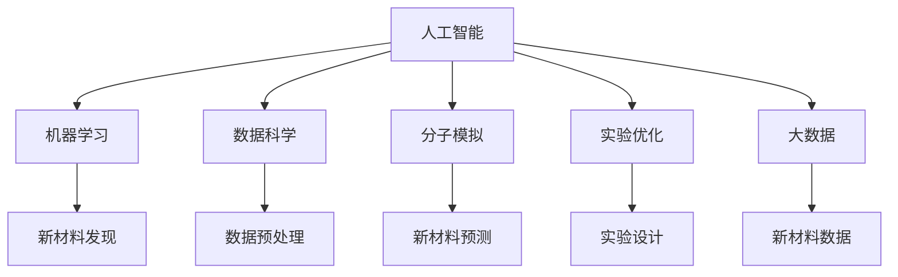

                 

# AI在材料科学中的应用：加速新材料发现

> 关键词：人工智能(AI), 材料科学, 新材料发现, 机器学习, 数据科学, 分子模拟, 实验优化, 大数据

## 1. 背景介绍

### 1.1 问题由来
在现代科技日益发展的今天，新材料的发现和应用成为了驱动技术进步的关键因素之一。然而，传统的材料发现过程依赖于昂贵的实验设备和长时间的人工测试，成本高、效率低，且往往存在一定的盲目性。近年来，人工智能(AI)技术在材料科学中的应用逐渐成为热点，通过机器学习、数据科学等手段，大幅提升了新材料的发现速度和准确性，推动了材料科学的革新。

### 1.2 问题核心关键点
AI在材料科学中的应用，主要是通过数据驱动的方法，利用机器学习模型和数据科学技术，对海量实验数据进行分析和建模，从而预测和设计新的材料。AI的应用关键点包括：

- **数据积累与预处理**：收集和整理大量的实验数据，并进行有效的预处理，以便进行后续的机器学习建模。
- **模型构建与训练**：选择合适的机器学习模型，并利用实验数据对其进行训练，形成可用于新材料发现的预测模型。
- **预测与优化**：利用训练好的模型对新材料进行预测，并结合实验数据进行迭代优化，不断提升预测准确性。
- **设计与合成**：基于预测结果，设计新的材料配方，并通过实验验证和优化，最终实现新材料的合成和应用。

## 2. 核心概念与联系

### 2.1 核心概念概述

为了更好地理解AI在材料科学中的应用，本文将介绍几个关键的概念及其相互联系：

- **人工智能(AI)**：通过计算机模拟人类智能行为，解决复杂问题的技术，包括机器学习、自然语言处理、计算机视觉等多个领域。
- **材料科学**：研究材料的性质、结构、制备方法及其在工程应用中的性能，涉及化学、物理、工程等多个学科。
- **机器学习(ML)**：利用数据和算法，通过训练模型，实现对新数据进行预测和决策的技术。
- **数据科学(Data Science)**：通过收集、清洗、分析和建模数据，提取有价值的信息和知识，支持科学决策和创新。
- **分子模拟(Molecular Simulation)**：使用计算机模拟分子级结构与动态，预测材料的性质与行为。
- **实验优化(Experimental Optimization)**：通过设计实验参数和优化流程，提高实验效率和结果准确性。
- **大数据(Big Data)**：指无法通过传统数据库软件工具进行采集、存储、管理和分析的海量数据。

这些概念之间的联系可以通过以下Mermaid流程图来展示：



这个流程图展示了AI在材料科学中的应用框架，其中AI通过机器学习和数据科学技术，结合分子模拟和实验优化方法，利用大数据进行新材料的预测和设计。

## 3. 核心算法原理 & 具体操作步骤

### 3.1 算法原理概述

AI在材料科学中的应用，主要基于机器学习和数据科学的技术，通过构建预测模型，实现对新材料的发现和优化。其中，机器学习模型通常包括监督学习、无监督学习、强化学习等多种类型，具体选择取决于问题的性质和数据的特点。

- **监督学习**：利用已知的输入和输出数据对模型进行训练，预测新输入的数据。适用于已知目标标签的数据集，如分类和回归问题。
- **无监督学习**：利用未标记的数据进行训练，发现数据中的潜在结构和模式。适用于数据标签未知的情况，如聚类和降维问题。
- **强化学习**：通过与环境交互，模型在不断试错中学习最佳决策策略。适用于需要动态调整决策过程的问题，如实验设计和过程优化。

### 3.2 算法步骤详解

基于AI的材料科学应用，一般包括以下几个关键步骤：

**Step 1: 数据收集与预处理**
- 收集已有的材料实验数据，包括结构、成分、性能等特征。
- 清洗和整理数据，去除噪声和异常值，确保数据的质量和一致性。
- 进行特征工程，提取和构建对模型有用的特征，如分子几何、电荷分布、晶格结构等。

**Step 2: 模型构建与训练**
- 选择合适的机器学习模型，如随机森林、支持向量机、神经网络等。
- 利用预处理后的数据集，对模型进行训练，调整超参数，优化模型性能。
- 采用交叉验证等技术，评估模型在新数据上的泛化能力，避免过拟合。

**Step 3: 预测与优化**
- 使用训练好的模型对新的材料结构进行预测，如晶体结构、电导率、热稳定性等。
- 结合实验数据和预测结果，设计新的材料配方，并进行实验验证。
- 根据实验结果，反馈优化模型，进一步提高预测准确性。

**Step 4: 设计与合成**
- 基于预测结果，设计新的材料组合，并通过实验验证。
- 对合成的材料进行性能测试，评估其在新应用场景中的潜力。
- 结合实验数据和AI预测，迭代优化材料设计，最终实现新材料的合成和应用。

### 3.3 算法优缺点

AI在材料科学中的应用，具有以下优点：

- **高效性**：利用机器学习和数据科学技术，大幅提升新材料发现的速度和效率，减少人力和物力成本。
- **准确性**：通过数据分析和模型训练，提高预测和优化的准确性，减少实验的盲目性。
- **可扩展性**：机器学习模型可以处理大规模数据，适用于不同规模和新材料发现的需求。
- **灵活性**：结合实验数据进行迭代优化，灵活调整材料设计和合成方案。

然而，AI在材料科学中的应用也存在一定的局限性：

- **数据依赖性**：AI模型的性能高度依赖于数据的质量和多样性，数据获取和处理成本较高。
- **模型复杂性**：高维数据和高复杂性模型需要较强的计算资源和算法能力，对设备和算力要求较高。
- **解释性不足**：AI模型往往作为"黑盒"存在，难以解释其内部决策过程和预测依据。
- **偏见与伦理**：AI模型可能继承训练数据的偏见，导致预测结果存在偏见或歧视，需要加以监督和纠正。

尽管存在这些局限性，AI在材料科学中的应用前景广阔，有望为材料设计和合成带来革命性突破。

### 3.4 算法应用领域

AI在材料科学中的应用，已经涵盖了多个领域，具体包括：

- **晶体材料发现**：利用机器学习对晶体结构进行预测和设计，如金属、半导体、超导体等。
- **有机材料设计**：通过分子模拟和机器学习，预测分子的性质和合成路径，如药物、聚合物、染料等。
- **纳米材料合成**：利用AI进行纳米结构的预测和优化，设计新型的纳米材料，应用于电子、催化等领域。
- **材料性能优化**：通过机器学习分析实验数据，预测材料的物理、化学性能，指导材料制备和应用。
- **实验过程优化**：使用AI进行实验设计，优化实验参数和流程，提高实验效率和结果精度。

## 4. 数学模型和公式 & 详细讲解 & 举例说明

### 4.1 数学模型构建

在AI应用于材料科学的过程中，常使用以下数学模型：

- **回归模型**：用于预测连续型变量，如材料性能指标、实验参数等。
- **分类模型**：用于预测离散型变量，如材料类型、合成路径等。
- **聚类模型**：用于发现数据中的潜在结构和模式，如材料类别、化合物等。
- **强化学习模型**：用于动态优化实验过程和参数，如实验设计、合成路径等。

### 4.2 公式推导过程

以回归模型为例，假设已知训练数据集 $D=\{(x_i, y_i)\}_{i=1}^N$，其中 $x_i$ 为输入变量，$y_i$ 为输出变量。我们选择线性回归模型：

$$
\hat{y} = \theta_0 + \sum_{j=1}^p \theta_j x_{ij}
$$

其中 $\theta_0$ 为截距，$\theta_j$ 为回归系数，$p$ 为输入变量数量。线性回归模型的损失函数为均方误差：

$$
L(\theta) = \frac{1}{2N} \sum_{i=1}^N (y_i - \hat{y}_i)^2
$$

通过梯度下降算法更新参数 $\theta$：

$$
\theta \leftarrow \theta - \eta \nabla_{\theta}L(\theta)
$$

其中 $\eta$ 为学习率，$\nabla_{\theta}L(\theta)$ 为损失函数对参数 $\theta$ 的梯度，可通过自动微分技术计算。

### 4.3 案例分析与讲解

**案例：基于机器学习预测金属合金的电导率**

在研究合金的电导率时，我们收集了大量的合金成分和电导率数据，希望通过机器学习模型预测新合金的电导率。

假设我们选择了线性回归模型，对数据进行归一化和特征工程，得到特征集 $X=\{x_1, x_2, ..., x_p\}$，输出变量 $y$ 为电导率。模型训练过程如下：

1. 随机初始化模型参数 $\theta$。
2. 选择训练集 $D=\{(x_i, y_i)\}_{i=1}^N$。
3. 计算预测值 $\hat{y} = \theta_0 + \sum_{j=1}^p \theta_j x_{ij}$。
4. 计算损失函数 $L(\theta) = \frac{1}{2N} \sum_{i=1}^N (y_i - \hat{y}_i)^2$。
5. 计算梯度 $\nabla_{\theta}L(\theta)$。
6. 更新模型参数 $\theta \leftarrow \theta - \eta \nabla_{\theta}L(\theta)$。
7. 重复步骤3-6，直至损失函数收敛或达到预设的迭代次数。

训练完成后，我们将新的合金成分 $x$ 输入模型，得到预测的电导率 $\hat{y}$，结合实验数据进行优化，最终实现新合金的合成和应用。

## 5. 项目实践：代码实例和详细解释说明

### 5.1 开发环境搭建

在进行AI应用于材料科学的项目实践前，我们需要准备好开发环境。以下是使用Python进行机器学习和数据科学开发的常见环境配置流程：

1. 安装Anaconda：从官网下载并安装Anaconda，用于创建独立的Python环境。

2. 创建并激活虚拟环境：
```bash
conda create -n ml-env python=3.8 
conda activate ml-env
```

3. 安装必要的Python包：
```bash
conda install numpy pandas scikit-learn matplotlib tqdm jupyter notebook ipython
```

4. 安装机器学习框架和库：
```bash
pip install scikit-learn tensorflow keras pytorch transformers lightgbm xgboost
```

完成上述步骤后，即可在`ml-env`环境中开始项目实践。

### 5.2 源代码详细实现

下面我们以金属合金电导率预测为例，给出使用PyTorch进行线性回归的Python代码实现。

首先，定义数据处理函数：

```python
import pandas as pd
from sklearn.model_selection import train_test_split
from sklearn.preprocessing import StandardScaler
import torch

def load_data(file_path):
    data = pd.read_csv(file_path)
    features = data[['C', 'Si', 'Mn', 'Cr', 'Mo', 'Ti', 'V', 'Fe']]
    labels = data['Electrical Conductivity']
    features = StandardScaler().fit_transform(features)
    return train_test_split(features, labels, test_size=0.2, random_state=42)

# 加载数据
features_train, labels_train, features_test, labels_test = load_data('data.csv')
```

然后，定义模型和优化器：

```python
from torch import nn
import torch.nn.functional as F

class LinearRegression(nn.Module):
    def __init__(self, input_dim, output_dim):
        super(LinearRegression, self).__init__()
        self.linear = nn.Linear(input_dim, output_dim)
    
    def forward(self, x):
        return self.linear(x)

# 定义模型和优化器
input_dim = features_train.shape[1]
output_dim = 1
model = LinearRegression(input_dim, output_dim)
optimizer = torch.optim.Adam(model.parameters(), lr=0.001)
```

接着，定义训练和评估函数：

```python
def train_epoch(model, features, labels, optimizer, device):
    model.train()
    with torch.no_grad():
        for feature, label in zip(features, labels):
            feature = torch.from_numpy(feature).float().to(device)
            label = torch.from_numpy(label).float().to(device)
            optimizer.zero_grad()
            output = model(feature)
            loss = F.mse_loss(output, label)
            loss.backward()
            optimizer.step()
    
def evaluate(model, features, labels, device):
    model.eval()
    with torch.no_grad():
        preds = []
        for feature, label in zip(features, labels):
            feature = torch.from_numpy(feature).float().to(device)
            label = torch.from_numpy(label).float().to(device)
            output = model(feature)
            pred = output.cpu().detach().numpy().ravel()
            preds.append(pred)
    
    preds = np.hstack(preds)
    labels = np.hstack(labels)
    mse = np.mean((preds - labels)**2)
    rmse = np.sqrt(mse)
    return mse, rmse
```

最后，启动训练流程并在测试集上评估：

```python
device = 'cuda' if torch.cuda.is_available() else 'cpu'
model.to(device)

epochs = 500
batch_size = 32

for epoch in range(epochs):
    train_epoch(model, features_train, labels_train, optimizer, device)
    if epoch % 100 == 0:
        train_mse, train_rmse = evaluate(model, features_train, labels_train, device)
        dev_mse, dev_rmse = evaluate(model, features_test, labels_test, device)
        print(f'Epoch {epoch+1}, train MSE: {train_mse:.4f}, train RMSE: {train_rmse:.4f}, dev MSE: {dev_mse:.4f}, dev RMSE: {dev_rmse:.4f}')
    
print(f'Test results:\n{evaluate(model, features_test, labels_test, device)}')
```

以上就是使用PyTorch进行金属合金电导率预测的完整代码实现。可以看到，使用机器学习库进行AI项目开发，能够迅速实现模型的搭建和训练。

### 5.3 代码解读与分析

让我们再详细解读一下关键代码的实现细节：

**load_data函数**：
- 读取数据文件，获取特征和标签。
- 对特征进行标准化处理，以减小数据量级。
- 将数据集分割为训练集和测试集。

**LinearRegression模型**：
- 定义线性回归模型，继承自PyTorch的nn.Module。
- 使用nn.Linear构建线性层，作为模型的输出。

**train_epoch函数**：
- 在训练过程中，对每个批次的数据进行前向传播和反向传播。
- 更新模型参数，并记录损失函数值。

**evaluate函数**：
- 对测试集进行评估，记录预测值和真实值的均方误差和均方根误差。
- 将预测值和真实值转换为numpy数组，方便后续处理。

**训练流程**：
- 指定模型训练轮数和批次大小，开始循环迭代。
- 在每个epoch后，评估训练集和测试集的性能。
- 记录测试集的评估结果，输出到控制台上。

可以看到，机器学习库的使用使得模型开发和训练变得简单易懂，开发者能够更专注于算法和模型设计的优化。

## 6. 实际应用场景

### 6.1 智能材料设计

AI在材料设计中的应用，可以帮助科学家和工程师更快速地找到最优的材料配方，加速新材料的发现和应用。通过AI技术，可以模拟和预测材料的性质，如电导率、热稳定性、机械强度等，从而在设计材料时提供科学的依据。

例如，在半导体材料设计中，AI可以预测材料的带隙、载流子迁移率等性质，指导半导体材料的合成和应用。在电池材料设计中，AI可以预测电池的容量、寿命、安全性等性能，优化电池的化学成分和结构。

### 6.2 新材料发现

AI在材料发现中的应用，可以大幅减少实验成本和时间，提高新材料发现的效率和准确性。通过AI技术，可以从海量的文献数据、专利信息等非结构化数据中提取有价值的信息，指导材料发现和合成。

例如，在药物发现中，AI可以预测分子的生物活性和毒性，筛选出具有潜力的候选药物，进行实验验证。在纳米材料发现中，AI可以预测纳米颗粒的尺寸、形态、分布等特性，指导纳米材料的合成和表征。

### 6.3 材料性能优化

AI在材料性能优化中的应用，可以帮助材料科学家和工程师更好地理解材料的性质和行为，优化材料的性能和制备工艺。通过AI技术，可以分析实验数据和预测结果，发现材料性能的影响因素，指导材料优化和改进。

例如，在钢铁材料中，AI可以预测材料的疲劳寿命、腐蚀抗性等性能，优化材料的成分和热处理工艺。在太阳能电池中，AI可以预测电池的效率、稳定性等性能，指导电池的设计和制备。

## 7. 工具和资源推荐

### 7.1 学习资源推荐

为了帮助开发者系统掌握AI在材料科学中的应用，这里推荐一些优质的学习资源：

1. 《机器学习实战》书籍：通过实际案例讲解机器学习的基本概念和实践技巧，适合初学者入门。
2. 《深度学习》书籍：深入介绍深度学习的基本原理和应用，适合有一定基础的读者。
3. 《Python机器学习》书籍：讲解Python在机器学习中的应用，包含大量实战代码和案例分析。
4. 《TensorFlow官方文档》：提供TensorFlow框架的详细文档和教程，适合深入学习。
5. 《Kaggle机器学习竞赛》：参加Kaggle竞赛，实践机器学习模型的应用，积累实战经验。
6. 《Scikit-learn官方文档》：提供Scikit-learn库的详细文档和教程，适合机器学习模型的实现和调优。

通过这些资源的学习，相信你一定能够快速掌握AI在材料科学中的应用技巧，并用于解决实际的科学研究问题。

### 7.2 开发工具推荐

高效的开发离不开优秀的工具支持。以下是几款用于AI在材料科学中应用开发的常用工具：

1. Jupyter Notebook：交互式的Python开发环境，支持代码块的灵活组合和共享。
2. PyTorch：基于Python的深度学习框架，灵活易用，支持动态计算图。
3. TensorFlow：由Google开发的深度学习框架，生产部署方便，适合大规模工程应用。
4. Scikit-learn：Python的机器学习库，提供了丰富的模型和算法，适合数据科学任务。
5. Pandas：Python的数据处理库，支持大规模数据集的读取、清洗和分析。
6. Matplotlib和Seaborn：Python的数据可视化库，支持多种图表的绘制和展示。

合理利用这些工具，可以显著提升AI在材料科学中的开发效率，加快创新迭代的步伐。

### 7.3 相关论文推荐

AI在材料科学中的应用，源于学界的持续研究。以下是几篇奠基性的相关论文，推荐阅读：

1. A Deep Neural Network for Modelling Temperature and Pressure-Independent Phases of Elements and Alloys（AI材料预测的开创性论文）：提出基于神经网络的元素和合金相图预测模型，奠定了AI在材料科学中的应用基础。
2. AI Accelerated Materials Discovery and Synthesis（AI加速材料发现和合成的综述论文）：总结了AI在材料科学中的最新进展，展示了AI技术的巨大潜力。
3. A Deep Learning Framework for Comprehensive Materials Discovery（基于深度学习的材料发现框架）：提出了一种基于深度学习的材料发现框架，用于预测材料的性质和合成路径。
4. Unsupervised Feature Selection for AI Accelerated Materials Design（无监督特征选择算法）：介绍了一种无监督特征选择算法，用于筛选有价值的特征，提高AI预测的准确性。
5. Machine Learning in Materials Science（机器学习在材料科学中的应用综述）：总结了机器学习在材料科学中的多个应用场景，展示了机器学习的广泛应用。

这些论文代表了AI在材料科学中的最新研究方向，通过学习这些前沿成果，可以帮助研究者把握学科前进方向，激发更多的创新灵感。

## 8. 总结：未来发展趋势与挑战

### 8.1 总结

本文对AI在材料科学中的应用进行了全面系统的介绍。首先阐述了AI在材料科学中的重要性和应用场景，明确了AI在加速新材料发现和优化中的独特价值。其次，从原理到实践，详细讲解了AI在材料科学中的数学模型和操作步骤，给出了AI应用于材料科学的项目实践代码实例。同时，本文还广泛探讨了AI在智能材料设计、新材料发现、材料性能优化等领域的实际应用，展示了AI技术在材料科学中的巨大潜力。此外，本文精选了AI在材料科学中的应用学习资源和开发工具，力求为读者提供全方位的技术指引。

通过本文的系统梳理，可以看到，AI在材料科学中的应用已经取得了显著的进展，并有望在未来进一步推动材料科学的创新和突破。AI技术为材料科学家和工程师提供了全新的工具和方法，帮助他们更快速、更准确地发现和优化新材料。

### 8.2 未来发展趋势

展望未来，AI在材料科学中的应用将呈现以下几个发展趋势：

1. **数据驱动的智能化**：随着大数据技术的不断进步，AI将在更多的数据驱动场景中发挥作用，通过数据分析和建模，发现新材料和新应用。
2. **跨学科融合**：AI将与材料科学、化学、物理、工程等多个学科进行深度融合，提升跨领域创新的能力。
3. **高性能计算**：随着高性能计算技术的不断进步，AI将能够处理更加复杂和高维的数据，提高预测和优化的准确性。
4. **集成化应用**：AI技术将与其他先进技术（如3D打印、纳米制造等）进行集成，推动材料科学的应用创新。
5. **可持续发展**：AI将在材料的环保、可持续性等方面发挥重要作用，推动绿色材料的发展。

以上趋势凸显了AI在材料科学中的应用前景。这些方向的探索发展，必将进一步推动材料科学的创新和突破，为人类社会的可持续发展提供新的动力。

### 8.3 面临的挑战

尽管AI在材料科学中的应用已经取得了显著的进展，但在迈向更加智能化、普适化应用的过程中，它仍面临着诸多挑战：

1. **数据获取难度**：高质量的数据获取和预处理成本较高，数据依赖性强，限制了AI在材料科学中的应用范围。
2. **模型复杂性**：高维数据和高复杂性模型需要较强的计算资源和算法能力，对设备和算力要求较高。
3. **模型解释性不足**：AI模型往往作为"黑盒"存在，难以解释其内部决策过程和预测依据，影响模型的可解释性和可信度。
4. **模型偏见与伦理**：AI模型可能继承训练数据的偏见，导致预测结果存在偏见或歧视，需要加以监督和纠正。
5. **技术规范与标准**：目前AI在材料科学中的应用还没有统一的技术规范和标准，需要进一步制定和完善。

尽管存在这些挑战，AI在材料科学中的应用前景广阔，有望为材料设计和合成带来革命性突破。相信随着学界和产业界的共同努力，这些挑战终将一一被克服，AI在材料科学中的应用必将在构建人机协同的智能时代中扮演越来越重要的角色。

### 8.4 研究展望

面对AI在材料科学中面临的挑战，未来的研究需要在以下几个方面寻求新的突破：

1. **数据获取与处理**：开发高效的数据获取和处理技术，降低数据获取成本，提高数据质量和多样性。
2. **模型优化与解释**：开发更加高效和可解释的AI模型，增强模型的预测能力和解释性。
3. **跨学科融合**：加强与材料科学、化学、物理、工程等多个学科的深度融合，提升跨领域创新的能力。
4. **可持续发展**：推动AI在材料环保、可持续性等方面的应用，促进绿色材料的发展。
5. **技术规范与标准**：制定和完善AI在材料科学中的应用规范和标准，促进技术的标准化和产业化。

这些研究方向的探索，必将引领AI在材料科学中的应用走向更高的台阶，为构建人机协同的智能材料时代提供新的动力。面向未来，AI在材料科学中的应用还需要与其他人工智能技术进行更深入的融合，如知识表示、因果推理、强化学习等，多路径协同发力，共同推动材料科学的进步。只有勇于创新、敢于突破，才能不断拓展AI在材料科学中的应用边界，让智能技术更好地造福人类社会。

## 9. 附录：常见问题与解答

**Q1：AI在材料科学中的应用是否适用于所有材料类型？**

A: AI在材料科学中的应用，主要适用于可以通过数据和模型进行预测和优化的材料类型，如金属、半导体、聚合物等。对于那些复杂性较高、数据获取困难的材料，如纳米材料、生物材料等，需要进一步探索AI应用的可能性。

**Q2：如何选择合适的机器学习模型？**

A: 选择合适的机器学习模型，需要根据问题的性质和数据的特点来决定。对于回归问题，可以选择线性回归、决策树、随机森林等模型；对于分类问题，可以选择逻辑回归、支持向量机、神经网络等模型；对于聚类问题，可以选择K-Means、层次聚类、DBSCAN等模型。

**Q3：AI在材料科学中的应用是否需要大量的实验数据？**

A: AI在材料科学中的应用，确实需要大量的实验数据进行训练和验证。数据的质量和多样性直接影响模型的性能和泛化能力，因此需要投入较多的时间和资源进行数据收集和预处理。

**Q4：如何提高AI模型的解释性？**

A: 提高AI模型的解释性，可以通过特征选择、模型简化、可视化技术等方法。例如，使用LIME、SHAP等工具对模型的决策过程进行可视化，帮助理解模型的预测依据。同时，也可以开发更加可解释的模型，如决策树、线性模型等。

**Q5：AI在材料科学中的应用是否需要高昂的计算资源？**

A: AI在材料科学中的应用，确实需要较强的计算资源进行模型训练和优化。因此，需要使用高性能的计算设备和算法，如GPU、TPU、分布式计算等。同时，也可以优化模型的计算图，使用混合精度训练、剪枝等技术，提高计算效率。

通过上述问题的回答，相信你对AI在材料科学中的应用有了更清晰的认识。AI在材料科学中的应用前景广阔，有望成为推动材料科学创新和发展的关键技术。随着技术的不断进步，相信AI在材料科学中的应用将更加广泛和深入，为人类社会的可持续发展提供新的动力。

