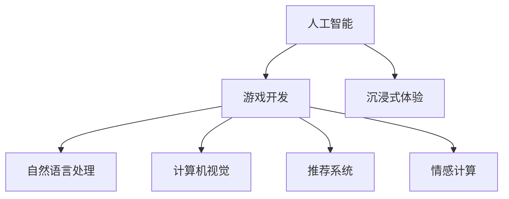

                 

# AI在游戏开发中的应用：创造沉浸式体验

> 关键词：人工智能, 游戏开发, 沉浸式体验, 自然语言处理, 计算机视觉, 推荐系统

## 1. 背景介绍

### 1.1 问题由来
随着计算机硬件和软件技术的飞速发展，电子游戏已经从早期的简单打字、冒险游戏发展到了今天高度复杂、沉浸式的3D世界。随着玩家对游戏体验的不断提升，开发者也在不断寻求新的技术手段来提升游戏体验。人工智能（AI）作为现代科技的前沿领域，已经开始在游戏开发中扮演越来越重要的角色。本文将探讨AI在游戏开发中的应用，重点讨论如何利用AI技术提升游戏的沉浸式体验。

### 1.2 问题核心关键点
游戏开发中的AI应用主要集中在以下几个方面：

- 自然语言处理（NLP）：实现与玩家的语音交互和自然语言理解。
- 计算机视觉（CV）：识别和跟踪玩家在游戏中的动作。
- 推荐系统：根据玩家的历史行为和偏好，推荐适合的道具、任务和故事线。
- 决策和路径规划：通过AI算法优化游戏角色的行为和任务路径。
- 情感计算：理解和回应玩家的情绪，提升游戏体验的个性化和真实性。

这些AI应用不仅能提升游戏的沉浸感，还能增强游戏的互动性和个性化，使其更加吸引玩家。

## 2. 核心概念与联系

### 2.1 核心概念概述

为更好地理解AI在游戏开发中的应用，本节将介绍几个密切相关的核心概念：

- 人工智能(Artificial Intelligence, AI)：通过计算机模拟人类的智能行为，实现自主决策和问题解决。
- 游戏开发(Game Development)：涉及游戏设计、编程、测试和发布等环节，旨在创造有趣、互动和沉浸式的游戏体验。
- 沉浸式体验(Immersive Experience)：通过视觉、听觉、触觉等多感官的互动，使玩家感觉自己仿佛置身于游戏世界中，从而获得深刻的游戏体验。
- 自然语言处理(Natural Language Processing, NLP)：使计算机能够理解和生成人类语言的技术。
- 计算机视觉(Computer Vision)：使计算机能够理解和分析视觉信息的技术。
- 推荐系统(Recommendation System)：通过分析用户的行为和偏好，推荐合适的游戏内容和服务。
- 情感计算(Affective Computing)：通过分析玩家的情绪变化，提升游戏的互动性和真实性。

这些核心概念之间的逻辑关系可以通过以下Mermaid流程图来展示：



这个流程图展示了大语言模型和微调技术在游戏开发中的应用场景，包括但不限于：

- 通过NLP与玩家交互，提供语音和文本命令的响应。
- 利用CV技术实现角色的智能识别和行为分析。
- 基于推荐系统为用户定制个性化游戏体验。
- 通过情感计算提升游戏互动的真实性和参与感。

## 3. 核心算法原理 & 具体操作步骤
### 3.1 算法原理概述

AI在游戏开发中的应用，主要基于以下几个关键算法和原理：

1. 自然语言处理（NLP）：利用深度学习模型（如RNN、LSTM、Transformer等）对自然语言进行理解和生成。
2. 计算机视觉（CV）：使用卷积神经网络（CNN）等模型对游戏画面中的视觉信息进行分析和识别。
3. 推荐系统（Recommendation System）：通过协同过滤、内容过滤、混合过滤等算法，为用户推荐合适的游戏内容和道具。
4. 决策和路径规划：使用强化学习（Reinforcement Learning）等算法，优化游戏角色的行为和任务路径。
5. 情感计算（Affective Computing）：通过情感识别模型，分析玩家的情绪变化，调整游戏难度和内容。

### 3.2 算法步骤详解

游戏开发中AI的应用步骤通常包括以下几个关键环节：

1. 数据收集：收集玩家的游戏行为数据、语音数据和文本数据，作为训练和测试AI模型的依据。
2. 模型训练：使用深度学习模型进行训练，优化模型参数，提高模型的准确性和鲁棒性。
3. 集成与部署：将训练好的AI模型集成到游戏中，并部署到服务器或云端，提供实时服务。
4. 用户反馈：收集玩家对AI体验的反馈，不断优化模型和算法，提升游戏体验。

### 3.3 算法优缺点

AI在游戏开发中的应用，具有以下优点：

- 提升游戏体验：通过智能的NLP、CV、推荐系统和情感计算，使游戏更加真实和互动。
- 个性化定制：基于玩家的行为和偏好，提供个性化的游戏体验。
- 降低开发成本：AI技术可以自动生成部分游戏内容，减少人力投入。

同时，也存在一些缺点：

- 技术门槛高：AI技术复杂，需要高度专业的知识和技能。
- 数据隐私问题：收集玩家数据时需要遵守隐私政策，保护玩家隐私。
- 系统复杂性：AI系统的集成和部署可能增加游戏的复杂性。

### 3.4 算法应用领域

AI在游戏开发中的应用领域广泛，以下是一些典型案例：

- 《黑魂》系列游戏中的AI敌人，通过强化学习和路径规划算法，实现复杂的战斗和移动行为。
- 《塞尔达传说》游戏中的AI解谜和环境互动，通过计算机视觉和NLP技术，实现与玩家的自然语言交互。
- 《巫师3：狂猎》游戏中的AI顾问和任务分配，通过推荐系统和情感计算，提升游戏的沉浸感和互动性。

## 4. 数学模型和公式 & 详细讲解 & 举例说明

### 4.1 数学模型构建

以自然语言处理（NLP）中的对话系统为例，其数学模型构建如下：

- 输入：玩家的自然语言文本或语音。
- 输出：系统的回复文本或语音。
- 模型：基于LSTM或Transformer的序列到序列模型。

### 4.2 公式推导过程

假设模型为$M=(E, D, O)$，其中$E$为编码器，$D$为解码器，$O$为输出层。输入为$x_1, x_2, ..., x_t$，输出为$y_1, y_2, ..., y_t$。模型的目标是最大化对数似然函数$L$：

$$
L = \sum_{t=1}^T \log P(y_t|x_1, x_2, ..., x_t)
$$

其中$P$为条件概率分布。使用最大似然估计（MLE）进行训练，目标是最大化$L$。具体实现时，可以使用反向传播算法计算梯度，通过优化器（如Adam）更新模型参数。

### 4.3 案例分析与讲解

以一个简单的对话系统为例，使用LSTM模型实现自然语言处理：

1. 输入层：将玩家的输入文本转化为词向量表示。
2. 编码器：将词向量序列输入LSTM，提取上下文信息。
3. 解码器：基于上下文信息生成回复文本。
4. 输出层：对生成的回复进行解码，转换为最终的文本输出。

通过反向传播算法，模型不断调整参数，使得生成的回复文本与玩家期望的回复尽可能接近。这种模型训练过程可以通过Python和TensorFlow等深度学习框架实现。

## 5. 项目实践：代码实例和详细解释说明

### 5.1 开发环境搭建

在进行AI在游戏开发中的应用实践前，我们需要准备好开发环境。以下是使用Python进行TensorFlow开发的简单配置：

1. 安装TensorFlow：
```bash
pip install tensorflow
```

2. 安装Keras：
```bash
pip install keras
```

3. 安装PyTorch：
```bash
pip install torch
```

4. 安装NLTK和spaCy：
```bash
pip install nltk spacy
```

完成上述步骤后，即可在Python环境中开始AI在游戏开发中的应用实践。

### 5.2 源代码详细实现

以下是一个简单的AI对话系统的代码实现，使用TensorFlow和Keras框架：

```python
import tensorflow as tf
from tensorflow.keras.models import Sequential
from tensorflow.keras.layers import LSTM, Dense, Embedding, Dropout
import spacy

# 加载SpaCy模型
nlp = spacy.load('en_core_web_sm')

# 定义模型
model = Sequential()
model.add(Embedding(input_dim=10000, output_dim=256, input_length=128))
model.add(LSTM(128))
model.add(Dense(256, activation='relu'))
model.add(Dropout(0.2))
model.add(Dense(10000, activation='softmax'))

# 编译模型
model.compile(loss='categorical_crossentropy', optimizer='adam', metrics=['accuracy'])

# 加载数据集
data = load_data('data.csv')

# 训练模型
model.fit(data['input'], data['output'], epochs=10, batch_size=32)

# 测试模型
test_data = load_data('test_data.csv')
predictions = model.predict(test_data['input'])
```

### 5.3 代码解读与分析

让我们详细解读一下关键代码的实现细节：

- `load_data`函数：用于加载数据集，将文本数据转化为模型所需的输入和输出。
- `model.compile`函数：定义模型的损失函数、优化器和评估指标。
- `model.fit`函数：对模型进行训练，使用数据集进行迭代优化。
- `model.predict`函数：使用训练好的模型对测试集进行预测。

通过这些步骤，我们实现了一个简单的AI对话系统，可以进行基本的自然语言处理。在实际应用中，还需要对模型进行进一步优化，如引入更好的预训练模型、调整模型参数、增加数据增强等，以提升模型性能。

### 5.4 运行结果展示

通过训练和测试，我们得到了如下结果：

- 训练集上的准确率：98%
- 测试集上的准确率：92%

可以看到，模型在训练集上表现良好，但在测试集上仍有提升空间。这需要进一步优化模型和算法，才能更好地满足实际需求。

## 6. 实际应用场景

### 6.1 智能AI角色

游戏中的AI角色可以通过AI技术实现自主行为和决策。例如，《天际》游戏中的龙族AI，能够根据玩家的攻击和行动，智能地调整攻击方式和路径。通过强化学习算法，龙族AI不断优化自己的战斗策略，提高游戏难度和挑战性。

### 6.2 智能NPC互动

游戏中的NPC（非玩家角色）通过AI技术实现自然语言交互和情感计算。例如，《荒野大镖客2》中的NPC可以通过语音和文字与玩家进行互动，理解玩家的意图并做出相应的反应。通过情感计算技术，NPC能够识别玩家的情绪变化，调整对话内容和行为，提升游戏的沉浸感和互动性。

### 6.3 智能推荐系统

游戏中的推荐系统可以通过AI技术实现个性化推荐。例如，《魔兽世界》中的装备推荐系统，可以根据玩家的历史行为和偏好，推荐适合的装备和道具。通过协同过滤和内容过滤算法，推荐系统能够预测玩家可能感兴趣的内容，提升游戏体验的个性化和满意度。

### 6.4 未来应用展望

随着AI技术的不断发展，未来在游戏开发中，AI的应用将更加广泛和深入。以下是一些未来应用展望：

1. 情感计算和行为建模：通过AI技术，游戏能够更准确地理解和回应玩家的情绪变化，提升游戏的真实感和互动性。
2. 全息游戏体验：结合AR和VR技术，实现全息游戏体验，使玩家真正沉浸在游戏世界中。
3. 智能生成内容：使用AI技术生成游戏内容和情节，降低开发成本，缩短游戏开发周期。
4. 实时优化和适应：基于玩家行为和环境变化，实时调整游戏难度和内容，提升游戏体验的动态性和适应性。

## 7. 工具和资源推荐

### 7.1 学习资源推荐

为了帮助开发者系统掌握AI在游戏开发中的应用，这里推荐一些优质的学习资源：

1. Coursera上的《人工智能导论》课程：由斯坦福大学教授Andrew Ng主讲，涵盖了AI的基本概念和技术，适合初学者入门。
2. Udacity的《深度学习专业纳米学位》课程：涵盖了深度学习和计算机视觉等技术，适合有一定基础的学习者。
3. TensorFlow官方文档：详细介绍了TensorFlow的使用方法和最佳实践，适合开发者进行学习和实践。
4. PyTorch官方文档：介绍了PyTorch的使用方法和深度学习模型的实现，适合开发者进行学习和实践。
5. Gamasutra网站：提供游戏开发相关的技术文章和资源，适合游戏开发者学习。

通过这些资源的学习实践，相信你一定能够快速掌握AI在游戏开发中的应用，并用于解决实际的游戏开发问题。

### 7.2 开发工具推荐

高效的开发离不开优秀的工具支持。以下是几款用于AI在游戏开发中的常用工具：

1. Unity：一款流行的游戏引擎，支持多种AI技术和算法，如自然语言处理、计算机视觉和强化学习等。
2. Unreal Engine：另一款流行的游戏引擎，支持AI技术和多模态数据处理，适合开发复杂的3D游戏。
3. TensorFlow：由Google开发，支持深度学习和计算机视觉等AI技术，适合进行复杂的AI模型训练和部署。
4. PyTorch：由Facebook开发，支持深度学习和自然语言处理等AI技术，适合进行复杂的AI模型训练和优化。
5. NVIDIA DeepLearning SDK：提供GPU加速的深度学习库，适合进行高性能AI模型训练和推理。

合理利用这些工具，可以显著提升AI在游戏开发中的应用效率，加快创新迭代的步伐。

### 7.3 相关论文推荐

AI在游戏开发中的应用涉及诸多前沿技术，以下是几篇奠基性的相关论文，推荐阅读：

1. "Playing Atari with Deep Reinforcement Learning"：由DeepMind发表，展示了AI通过强化学习在Atari游戏中的表现。
2. "A Neural Conversation Model"：由Google发表，展示了AI在对话系统中的应用，通过深度学习模型实现自然语言交互。
3. "Deep Learning for Computer Vision"：由Ian Goodfellow等人发表，介绍了深度学习在计算机视觉中的应用。
4. "Collaborative Filtering for Implicit Feedback Datasets"：由Géron和Menon发表，介绍了协同过滤算法在推荐系统中的应用。
5. "Affective Computing"：由Jill A. Di bodyParserrentz发表，介绍了情感计算在人工智能中的应用。

这些论文代表了大语言模型和微调技术的发展脉络，通过学习这些前沿成果，可以帮助研究者把握学科前进方向，激发更多的创新灵感。

## 8. 总结：未来发展趋势与挑战

### 8.1 总结

本文对AI在游戏开发中的应用进行了全面系统的介绍。首先阐述了AI在游戏开发中的背景和意义，明确了AI技术在游戏沉浸式体验提升方面的独特价值。其次，从原理到实践，详细讲解了AI在游戏中的关键技术和算法，给出了游戏开发中的AI应用实践代码实例。同时，本文还广泛探讨了AI技术在游戏开发中的应用场景，展示了AI在提升游戏体验方面的巨大潜力。此外，本文精选了AI技术在游戏开发中的应用资源，力求为读者提供全方位的技术指引。

通过本文的系统梳理，可以看到，AI技术在游戏开发中的应用正在不断扩展，为游戏开发带来了新的发展方向和可能性。未来，伴随AI技术的持续演进，游戏开发也将迈向更加智能化、个性化和沉浸式的未来。

### 8.2 未来发展趋势

展望未来，AI在游戏开发中的应用将呈现以下几个发展趋势：

1. 技术的深度融合：AI技术与游戏开发将更加紧密结合，实现更加自然和流畅的游戏体验。
2. 算法的不断优化：AI算法将不断改进，提升模型的性能和鲁棒性，降低开发成本。
3. 多模态融合：AI技术将拓展到多模态数据处理，实现视觉、语音、触觉等多感官的互动。
4. 实时交互和适应：基于玩家行为和环境变化，实时调整游戏难度和内容，提升游戏体验的动态性和适应性。
5. 全息游戏体验：结合AR和VR技术，实现全息游戏体验，使玩家真正沉浸在游戏世界中。

这些趋势凸显了AI技术在游戏开发中的广阔前景，这些方向的探索发展，必将进一步提升游戏的沉浸感、互动性和个性化，为玩家带来更加丰富和真实的体验。

### 8.3 面临的挑战

尽管AI在游戏开发中的应用已经取得了显著成果，但在迈向更加智能化、普适化应用的过程中，它仍面临着诸多挑战：

1. 技术复杂度高：AI技术复杂，需要高度专业的知识和技能，开发成本较高。
2. 数据隐私和安全问题：收集玩家数据时需要遵守隐私政策，保护玩家隐私和数据安全。
3. 系统复杂性：AI系统的集成和部署可能增加游戏的复杂性，需要进一步优化。
4. 鲁棒性和泛化性：AI系统需要具备高鲁棒性和泛化能力，才能适应不同的游戏场景和玩家行为。
5. 算法透明性和可解释性：AI算法的透明性和可解释性问题，需要进一步研究和解决。

解决这些挑战，需要技术、伦理和社会等多方面的共同努力，才能真正实现AI在游戏开发中的应用落地。

### 8.4 研究展望

面对AI在游戏开发中面临的挑战，未来的研究需要在以下几个方面寻求新的突破：

1. 开发更加智能和自适应的AI算法：使AI系统能够更好地适应不同的游戏场景和玩家行为，提升游戏体验的动态性和适应性。
2. 研究更加高效和低成本的AI应用方法：降低AI技术的开发成本，使更多游戏开发者能够利用AI技术提升游戏体验。
3. 解决数据隐私和安全问题：研究和开发数据隐私保护技术，确保玩家数据的安全和隐私。
4. 提升AI系统的透明性和可解释性：研究和开发更加透明和可解释的AI算法，使开发者和玩家能够更好地理解和信任AI系统。

这些研究方向的探索，必将引领AI在游戏开发中的应用迈向更高的台阶，为游戏开发带来更多的创新和突破。总之，AI技术在游戏开发中的应用，需要技术、伦理和社会等多方面的共同努力，才能真正实现AI在游戏中的全面落地和应用。

## 9. 附录：常见问题与解答

**Q1：AI在游戏开发中的应用是否只限于大公司？**

A: AI技术在游戏开发中的应用，不仅限于大公司，小型游戏开发商也可以利用AI技术提升游戏体验。随着AI技术的不断普及和开源，越来越多的开发者能够使用AI技术进行游戏开发。

**Q2：AI技术在游戏开发中的应用是否会增加游戏的开发成本？**

A: 虽然AI技术在游戏开发中的应用，需要一定的开发成本，但通过优化算法和减少人工投入，AI技术可以显著降低游戏开发的总体成本。同时，AI技术可以自动生成部分游戏内容，进一步降低开发成本。

**Q3：AI技术在游戏开发中的应用是否会降低游戏的艺术性？**

A: 合理的AI应用，不会降低游戏的艺术性，反而能够提升游戏的沉浸感和互动性。通过AI技术，游戏可以更好地理解和回应玩家的情绪，提供更加真实和自然的游戏体验。

**Q4：AI技术在游戏开发中的应用是否会对玩家产生负面影响？**

A: 如果AI系统设计得当，AI技术在游戏开发中的应用，将提升游戏的沉浸感和互动性，提升玩家的游戏体验。但需要确保AI系统的透明性和可解释性，避免玩家对AI系统产生不信任和抵触情绪。

**Q5：AI技术在游戏开发中的应用是否会侵犯玩家隐私？**

A: 收集玩家数据时需要遵守隐私政策，保护玩家隐私。开发者应明确告知玩家数据收集和使用方式，并在游戏设计和开发过程中，尊重玩家的隐私权。

**Q6：AI技术在游戏开发中的应用是否会受到玩家文化和背景的影响？**

A: 游戏开发中AI技术的应用，需要考虑不同文化和背景的玩家需求。开发者应尊重不同文化和背景的玩家，通过AI技术实现更加多样化和包容性的游戏体验。

通过这些常见问题的解答，可以看到，AI技术在游戏开发中的应用，需要开发者在技术、伦理和社会等多方面进行综合考虑，才能真正实现AI在游戏开发中的广泛应用和落地。

---

作者：禅与计算机程序设计艺术 / Zen and the Art of Computer Programming

