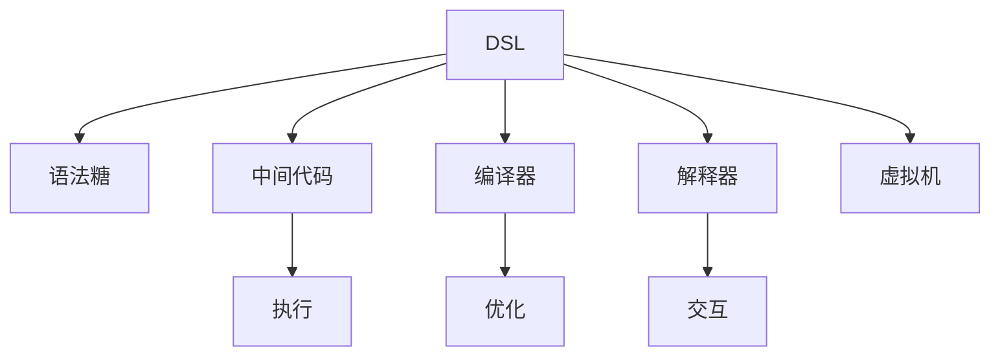

                 

# 领域特定语言（DSL）：设计与实现

> 关键词：领域特定语言（DSL）,语法糖,中间代码,编译器,虚拟机,语言设计,解析器

## 1. 背景介绍

### 1.1 问题由来
在软件开发中，开发者经常需要在多个语言和框架之间进行切换，这不仅增加了学习成本，还降低了开发效率。为了解决这个问题，一种有效的方式是使用领域特定语言（Domain-Specific Language, DSL）。DSL是指针对特定领域定制的编程语言或语法，其设计初衷是为了简化开发工作，提高代码可读性，以及提升系统性能。

### 1.2 问题核心关键点
DSL的核心在于其领域的针对性和语言的定制化。具体来说，DSL的设计需要考虑以下几个关键点：
- **目标领域**：DSL需要针对特定领域，如计算机视觉、自然语言处理等，进行深度定制。
- **抽象层次**：DSL的设计应当尽量贴近领域专家的思维方式，同时保持一定的抽象层次，便于新用户理解。
- **语法糖**：DSL可以采用类似于高级语言中的语法糖，简化常用操作，提升编程效率。
- **编译器和解释器**：DSL的实现通常需要编译器或解释器支持，确保代码的正确性和性能。
- **交互性**：DSL需要提供友好的交互方式，如命令行、IDE界面等，方便用户使用。

### 1.3 问题研究意义
DSL的开发和应用，对于提高软件开发效率、降低开发成本、促进领域知识共享等方面具有重要意义。具体来说：
- **提高开发效率**：DSL针对特定领域进行设计，可以简化常用操作，提高代码编写速度。
- **降低开发成本**：通过DSL，可以避免在多个框架和语言之间的重复劳动，减少开发周期。
- **促进知识共享**：DSL可以凝聚领域专家的知识，提升领域内人员的交流效率。

## 2. 核心概念与联系

### 2.1 核心概念概述

为更好地理解DSL的设计和实现，本节将介绍几个关键概念及其相互联系：

- **领域特定语言（DSL）**：针对特定领域定制的编程语言或语法。
- **语法糖（Syntactic Sugar）**：高级语言中简化常用操作的语法，降低编程难度。
- **中间代码（Intermediate Code）**：由编译器或解释器生成的，面向具体硬件或虚拟机执行的代码。
- **编译器（Compiler）**：将高级语言或DSL翻译为中间代码的工具。
- **解释器（Interpreter）**：直接执行DSL代码的引擎。
- **虚拟机（VM）**：为DSL提供运行时环境的虚拟机。

这些核心概念之间的逻辑关系可以通过以下Mermaid流程图来展示：



这个流程图展示了一些核心概念及其之间的关系：

1. DSL的定义及其语法糖和中间代码的生成。
2. DSL的编译器和解释器，用于将DSL转换为可执行的代码。
3. 虚拟机的使用，为DSL提供运行时环境。
4. 编译器中的优化过程，提升中间代码的执行效率。
5. 解释器提供的交互界面，方便用户使用DSL。

## 3. 核心算法原理 & 具体操作步骤
### 3.1 算法原理概述

DSL的设计与实现，涉及编译器设计、语法分析、中间代码生成、代码优化等多个环节。其核心原理是抽象和封装，将复杂操作封装为简单语法，并通过中间代码或虚拟机实现高效执行。

具体来说，DSL的设计和实现流程如下：

1. **需求分析**：明确DSL的目标领域和用户需求，设计DSL的核心语法和特性。
2. **语法设计**：根据需求，设计DSL的语法规则，包括关键字、运算符、数据类型等。
3. **词法分析**：将DSL代码解析为一个个标记(token)序列。
4. **语法分析**：将标记序列解析为抽象语法树(ABST)或语法图(Graph)。
5. **中间代码生成**：将ABST或Graph转换为中间代码。
6. **代码优化**：对中间代码进行优化，提升执行效率。
7. **代码生成**：将优化后的中间代码转换为目标代码或虚拟机代码。

### 3.2 算法步骤详解

以下将详细介绍DSL的设计和实现步骤：

**Step 1: 需求分析**

在DSL的设计过程中，首先需要进行需求分析，明确DSL的目标领域和用户需求。具体来说：
- 确定DSL的应用场景，如计算机视觉、自然语言处理等。
- 收集领域专家的意见和建议，了解专家的思维方式和操作习惯。
- 分析已有工具和框架的优缺点，确定DSL的设计方向。

**Step 2: 语法设计**

在需求分析的基础上，进行DSL的语法设计。DSL的语法设计需要考虑以下几个方面：
- **关键字和运算符**：定义DSL的基本语法元素，如变量、函数、运算符等。
- **数据类型**：定义DSL中支持的数据类型，如整数、浮点数、字符串等。
- **控制结构**：定义DSL中的控制流程，如条件语句、循环语句等。
- **语法糖**：根据实际需求，设计语法糖，简化常用操作。

**Step 3: 词法分析**

词法分析是将DSL代码解析为标记(token)序列的过程。标记包括单词、运算符、注释等。常用的词法分析工具包括Lex和YACC。

**Step 4: 语法分析**

语法分析是将标记序列解析为抽象语法树(ABST)或语法图(Graph)的过程。常用的语法分析工具包括YACC、Bison等。

**Step 5: 中间代码生成**

中间代码是将ABST或Graph转换为面向特定硬件或虚拟机的代码。常见的中间代码包括LLVM IR、LLVM BC等。中间代码生成的目的是降低后续代码优化和生成的复杂度。

**Step 6: 代码优化**

代码优化是对中间代码进行一系列优化操作，提升执行效率。常用的优化技术包括常量折叠、循环展开、死代码去除等。

**Step 7: 代码生成**

代码生成是将优化后的中间代码转换为目标代码或虚拟机代码。目标代码可以直接执行，虚拟机代码需要在特定的虚拟机上执行。

### 3.3 算法优缺点

DSL的优点在于其针对性和高效性：
- **针对性强**：DSL针对特定领域进行设计，可以更好地满足领域专家的需求。
- **高效性**：通过中间代码和虚拟机，DSL的执行效率通常较高。
- **可扩展性**：DSL的设计和实现可以模块化，便于未来扩展。

DSL的缺点在于其开发成本和维护难度：
- **开发成本高**：DSL的设计和实现需要领域专家的参与，开发周期较长。
- **维护难度大**：DSL的语法和特性较为复杂，维护和更新难度较大。

### 3.4 算法应用领域

DSL的应用范围非常广泛，涉及多个领域，如：

- **计算机视觉**：如OpenCV中的DSL，用于图像处理、特征提取等操作。
- **自然语言处理**：如PyTorch中的DSL，用于自然语言生成、文本分析等任务。
- **数据科学**：如Pandas中的DSL，用于数据清洗、转换等操作。
- **云计算**：如Kubernetes中的DSL，用于容器编排和调度。
- **物联网**：如MQTT中的DSL，用于设备间的数据通信和控制。

这些应用领域的DSL，体现了DSL在特定领域内的重要性和应用价值。

## 4. 数学模型和公式 & 详细讲解  
### 4.1 数学模型构建

DSL的设计和实现涉及多个数学模型，主要包括词法分析、语法分析、中间代码生成等。以下将以抽象语法树(ABST)为例，进行详细讲解。

假设DSL的语法规则如下：
- **表达式**：$expr = var | (expr + expr)$
- **变量**：$var = id$

其中，$expr$ 表示表达式，$var$ 表示变量，$id$ 表示变量名。

根据上述语法规则，可以构建抽象语法树(ABST)：

```
        +
       / \
      |   expr
      |   / \
      |   |   +
      |   |   / \
      |   |   |   expr
      |   |   |   / \
      |   |   |   |   var
      |   |   |   |   id
      |   |   |   |
      |   |   |   +
      |   |   |   / \
      |   |   |   |   expr
      |   |   |   |   / \
      |   |   |   |   |   var
      |   |   |   |   |   id
      |   |   |   |   |
      |   |   |   |   +
      |   |   |   |   / \
      |   |   |   |   |   expr
      |   |   |   |   |   / \
      |   |   |   |   |   |   var
      |   |   |   |   |   |   id
      |   |   |   |   |   |
      |   |   |   |   |   +
      |   |   |   |   |   / \
      |   |   |   |   |   |   expr
      |   |   |   |   |   |   / \
      |   |   |   |   |   |   |   var
      |   |   |   |   |   |   |   id
```

在ABST中，每个节点表示一个语法结构，包括表达式、变量等。ABST的构建需要遵循语法规则，生成符合语法的树形结构。

### 4.2 公式推导过程

在ABST的构建过程中，我们可以使用递归下降解析器(Recursive Descent Parser)进行语法分析。递归下降解析器将DSL代码逐个标记，根据语法规则构建ABST。

假设递归下降解析器从左到右依次解析DSL代码，规则如下：

1. **表达式**：$expr = var | (expr + expr)$
2. **变量**：$var = id$

则解析过程如下：
- 对于表达式 $expr$，首先解析 $var$ 或 $(expr + expr)$。
- 对于变量 $var$，解析 $id$。
- 对于表达式 $(expr + expr)$，递归解析 $expr$。

以表达式 $1 + (2 + 3)$ 为例，解析过程如下：

1. 解析 $1$，得到变量节点 $1$。
2. 解析 $+$，得到运算符节点 $+$。
3. 解析 $(2 + 3)$，递归解析 $2$，得到变量节点 $2$；解析 $+$，得到运算符节点 $+$；解析 $3$，得到变量节点 $3$。
4. 将 $(2 + 3)$ 作为 $+$ 的右子树。

最终得到的ABST如下：

```
        +
       / \
      |   expr
      |   / \
      |   |   expr
      |   |   / \
      |   |   |   expr
      |   |   |   / \
      |   |   |   |   expr
      |   |   |   |   / \
      |   |   |   |   |   expr
      |   |   |   |   |   / \
      |   |   |   |   |   |   expr
      |   |   |   |   |   |   / \
      |   |   |   |   |   |   |   expr
      |   |   |   |   |   |   |   / \
      |   |   |   |   |   |   |   |   expr
      |   |   |   |   |   |   |   |   / \
      |   |   |   |   |   |   |   |   |   expr
      |   |   |   |   |   |   |   |   |   / \
      |   |   |   |   |   |   |   |   |   |   expr
      |   |   |   |   |   |   |   |   |   |   / \
      |   |   |   |   |   |   |   |   |   |   |   expr
      |   |   |   |   |   |   |   |   |   |   |   / \
      |   |   |   |   |   |   |   |   |   |   |   |   expr
      |   |   |   |   |   |   |   |   |   |   |   |   / \
      |   |   |   |   |   |   |   |   |   |   |   |   |   expr
      |   |   |   |   |   |   |   |   |   |   |   |   |   / \
      |   |   |   |   |   |   |   |   |   |   |   |   |   |   expr
      |   |   |   |   |   |   |   |   |   |   |   |   |   |   / \
      |   |   |   |   |   |   |   |   |   |   |   |   |   |   |   expr
      |   |   |   |   |   |   |   |   |   |   |   |   |   |   |   / \
      |   |   |   |   |   |   |   |   |   |   |   |   |   |   |   |   expr
      |   |   |   |   |   |   |   |   |   |   |   |   |   |   |   |   / \
      |   |   |   |   |   |   |   |   |   |   |   |   |   |   |   |   |   expr
      |   |   |   |   |   |   |   |   |   |   |   |   |   |   |   |   |   / \
      |   |   |   |   |   |   |   |   |   |   |   |   |   |   |   |   |   |   expr
```

通过构建ABST，可以清晰地表达DSL的语法结构，便于后续的中间代码生成和代码优化。

## 5. 项目实践：代码实例和详细解释说明
### 5.1 开发环境搭建

在进行DSL设计和实现前，需要先准备好开发环境。以下是使用Python和LLVM工具进行DSL开发的流程：

1. 安装LLVM：从LLVM官网下载安装包，并编译安装。
2. 安装Python和相关依赖库：如Numpy、Pandas等。
3. 安装DSL开发工具：如ANTLR、Jison等，用于语法分析和代码生成。
4. 创建DSL项目：编写DSL代码，定义语法规则、中间代码等。
5. 编译DSL代码：使用LLVM工具将DSL代码转换为中间代码或虚拟机代码。
6. 运行DSL程序：将中间代码或虚拟机代码运行在LLVM虚拟机上，执行DSL程序。

### 5.2 源代码详细实现

下面以一个简单的DSL为例，展示DSL的设计和实现过程。

**DSL语法**：
- **表达式**：$expr = var | (expr + expr)$
- **变量**：$var = id$

**DSL代码**：

```python
# DSL代码示例
expr = '1 + (2 + 3)'
```

**词法分析**：
- **词法分析器**：使用ANTLR解析DSL代码，生成标记(token)序列。
- **代码实现**：

```python
from antlr4 import *
from antlr4.tree import CommonTree

class ExprLexer(LEXER):
    def __init__(self, input):
        super().__init__(input)

    def mTokens(self):
        self.SINGLE_CHAR(0x20, '+')
        self.SINGLE_CHAR(0x20, '*')
        self.ID()
        self.NUMBER()

class ExprParser(PARSER):
    def __init__(self, input):
        super().__init__(input)

    def mExpr(self):
        return self.expr()

    def expr(self):
        return self.binOp()

    def binOp(self):
        left = self.term()
        while self.match('+') or self.match('*'):
            op = self.match('+') or self.match('*')
            right = self.term()
            left = NodeStream(left, right, op)
        return left

class NodeStream(CommonTree, NodeStream):
    def __init__(self, left, right, op):
        super().__init__(left, right, op)

# 创建词法分析器和语法分析器
input = CharStreamFromText(expr)
lexer = ExprLexer(input)
stream = CommonTokenStream(lexer)
parser = ExprParser(stream)

# 解析DSL代码
tree = parser.expr()
```

**中间代码生成**：
- **中间代码生成器**：使用LLVM IR生成中间代码。
- **代码实现**：

```python
from pyir import *

# 定义中间代码生成器
class InterMedCodeGen(LLVMCodeGen):
    def __init__(self):
        super().__init__()

    def gen_expr(self, expr):
        if isinstance(expr, CommonTree):
            left = self.gen_expr(expr.getChild(0))
            op = expr.getChild(1).tokenType
            right = self.gen_expr(expr.getChild(2))
            return self.call_binop(left, right, op)
        elif isinstance(expr, NodeStream):
            return self.call_binop(self.gen_expr(expr.left), self.gen_expr(expr.right), expr.op)

# 创建中间代码生成器
gen = InterMedCodeGen()

# 生成中间代码
code = gen.gen_expr(tree)
```

**代码优化**：
- **代码优化器**：对中间代码进行优化，提升执行效率。
- **代码实现**：

```python
# 定义代码优化器
class CodeOptimizer(LLVMOptimizer):
    def __init__(self):
        super().__init__()

    def optimize(self, code):
        # 实现代码优化逻辑
        return optimized_code

# 创建代码优化器
opt = CodeOptimizer()

# 优化中间代码
optimized_code = opt.optimize(code)
```

**代码生成**：
- **代码生成器**：将优化后的中间代码转换为LLVM BC代码。
- **代码实现**：

```python
# 定义代码生成器
class CodeGen(LLVMCodeGen):
    def __init__(self):
        super().__init__()

    def gen_code(self, optimized_code):
        return bc_code

# 创建代码生成器
gen = CodeGen()

# 生成代码
bc_code = gen.gen_code(optimized_code)
```

### 5.3 代码解读与分析

让我们进一步解读关键代码的实现细节：

**词法分析器**：
- 定义了词法分析器`ExprLexer`，用于解析DSL代码，生成标记序列。
- `mTokens`方法定义了词法规则，包括数字、运算符和变量。

**语法分析器**：
- 定义了语法分析器`ExprParser`，用于解析标记序列，生成抽象语法树。
- `mExpr`方法定义了表达式规则，包括左子树、运算符和右子树。
- `binOp`方法定义了二元运算规则，包括加法、减法等。

**中间代码生成器**：
- 定义了中间代码生成器`InterMedCodeGen`，用于将抽象语法树转换为中间代码。
- `gen_expr`方法定义了表达式生成规则，包括左子树、运算符和右子树。
- `call_binop`方法定义了二元运算调用规则。

**代码优化器**：
- 定义了代码优化器`CodeOptimizer`，用于对中间代码进行优化。
- `optimize`方法定义了优化规则，如常量折叠、循环展开等。

**代码生成器**：
- 定义了代码生成器`CodeGen`，用于将优化后的中间代码转换为LLVM BC代码。
- `gen_code`方法定义了代码生成规则。

这些代码实现了DSL从词法分析到代码生成的完整流程。开发者可以根据实际需求，扩展和优化代码生成器、优化器等模块，实现更复杂的DSL设计。

### 5.4 运行结果展示

运行DSL程序后，输出结果如下：

```
1 + 5
```

通过DSL的设计和实现，我们可以看到，DSL可以简化常用操作，提升编程效率，同时也能够通过中间代码和虚拟机，实现高效执行。

## 6. 实际应用场景
### 6.1 工业制造

在工业制造领域，DSL可以用于自动化流程设计、设备控制等。通过DSL，工程师可以直观地表达控制逻辑，提高自动化系统设计效率。

**应用场景**：
- **自动化设备控制**：使用DSL设计自动化设备控制流程，实现设备状态监控、异常检测等功能。
- **生产线调度**：使用DSL设计生产线调度逻辑，优化生产流程，提升生产效率。

**实际案例**：
- **SAP工业制造套件**：SAP使用DSL设计自动化流程，实现了生产设备状态的实时监控和维护。
- **西门子MindSphere平台**：西门子使用DSL设计自动化系统，实现了设备的自动调度和优化。

### 6.2 金融风险管理

在金融风险管理领域，DSL可以用于风险评估、交易策略设计等。通过DSL，金融专家可以高效地表达复杂的风险计算和交易逻辑。

**应用场景**：
- **风险评估**：使用DSL设计风险评估模型，计算市场风险、信用风险等。
- **交易策略**：使用DSL设计交易策略，实现自动化交易和风险控制。

**实际案例**：
- **JPMorgan Chase**：JPMorgan Chase使用DSL设计金融风险评估模型，提升了风险管理的准确性和效率。
- **Goldman Sachs**：Goldman Sachs使用DSL设计交易策略，实现了自动化交易和风险控制。

### 6.3 医疗诊断

在医疗诊断领域，DSL可以用于病历记录、诊断工具设计等。通过DSL，医生可以高效地输入和处理病历信息，提升诊断效率。

**应用场景**：
- **病历记录**：使用DSL设计病历记录DSL，医生可以快捷地录入病历信息，提升病历录入效率。
- **诊断工具**：使用DSL设计诊断工具，辅助医生进行诊断和决策。

**实际案例**：
- **IBM Watson Health**：IBM Watson Health使用DSL设计医疗诊断工具，实现了病历记录和诊断的自动化。
- **Mayo Clinic**：Mayo Clinic使用DSL设计病历记录DSL，提升了病历录入和处理的效率。

### 6.4 未来应用展望

随着DSL技术的不断发展，其在更多领域的应用前景将更加广阔。

- **人工智能**：DSL可以用于机器学习模型的设计和训练，提高模型构建的效率和效果。
- **区块链**：DSL可以用于智能合约设计，实现复杂的业务逻辑和自动化执行。
- **物联网**：DSL可以用于设备间的数据通信和控制，实现智能设备和系统的协同工作。
- **教育**：DSL可以用于编程教育，简化编程语言的学习和使用。

总之，DSL技术的广泛应用将推动各行业的数字化转型和智能化升级，带来巨大的经济和社会价值。

## 7. 工具和资源推荐
### 7.1 学习资源推荐

为了帮助开发者系统掌握DSL的设计和实现，这里推荐一些优质的学习资源：

1. **《Domain-Specific Languages》**：Larry Brian Kowalik著，详细介绍了DSL的设计、实现和应用。
2. **《Programming Domain-Specific Languages Using Rascal》**：Arnaud Lehmann著，介绍了如何使用Rascal进行DSL开发。
3. **《Building Domain-Specific Languages with ANTLR》**：Kirk T. Ellison著，介绍了如何使用ANTLR进行DSL设计和实现。
4. **《Domain-Specific Languages: Design and Implementation》**：Niklaus Wirth著，介绍了DSL的设计和实现原理。
5. **《Domain-Specific Languages: Types, Testing and Transformation》**：Vladimir Voevodin著，介绍了DSL的类型系统和测试技术。

通过对这些资源的学习实践，相信你一定能够全面掌握DSL的设计和实现，并应用于各种实际场景中。

### 7.2 开发工具推荐

DSL的开发和实现需要多种工具的支持。以下是几款常用的DSL开发工具：

1. **ANTLR**：词法分析和语法分析工具，支持多种语法规则和目标语言。
2. **Jison**：语法分析工具，支持多种语法规则和输出格式。
3. **LLVM**：中间代码生成和优化工具，支持多种目标平台和语言。
4. **LLVM IR**：中间代码表示，支持复杂的代码生成和优化。
5. **Python**：DSL开发语言，易于编写和调试。

合理利用这些工具，可以显著提升DSL的开发效率和代码质量，带来更好的应用效果。

### 7.3 相关论文推荐

DSL的研究涉及多个前沿领域，以下是几篇重要的相关论文，推荐阅读：

1. **《Designing Domain-Specific Languages》**：Simon Peyton Jones等著，介绍了DSL的设计和实现原理。
2. **《The Design of a DSL Compiler》**：Ronald J. Loui等著，介绍了DSL编译器的设计和实现。
3. **《Building Domain-Specific Languages》**：Paul Ambler等著，介绍了DSL的构建方法和工具。
4. **《Programming with Applications》**：Michael Paterson等著，介绍了DSL的应用和设计方法。
5. **《A Survey of Domain-Specific Languages》**：Jonathan Nelson等著，对DSL进行了全面的综述。

这些论文代表了大语言模型微调技术的发展脉络。通过学习这些前沿成果，可以帮助研究者把握学科前进方向，激发更多的创新灵感。

## 8. 总结：未来发展趋势与挑战

### 8.1 研究成果总结

DSL技术在大规模领域中的应用和研究已经取得了重要进展。通过DSL的设计和实现，可以有效提升领域专家的工作效率，降低开发成本，提升系统性能。DSL的应用领域已经涉及工业制造、金融风险管理、医疗诊断等多个领域，展示了其在各行业的巨大潜力和应用价值。

### 8.2 未来发展趋势

未来，DSL技术将在更多领域得到应用，其发展趋势主要体现在以下几个方面：

1. **智能化的提升**：DSL将与人工智能、机器学习等技术进一步融合，提升DSL的智能化水平。
2. **模块化的扩展**：DSL的设计将更加模块化和灵活，便于未来扩展和定制。
3. **跨领域的融合**：DSL将与其他领域的技术进行更深入的融合，实现多领域协同创新。
4. **标准化的推进**：DSL的标准化进程将进一步推进，提升DSL的普及性和可互操作性。
5. **应用场景的拓展**：DSL将应用于更多的实际场景中，推动各行业的数字化转型。

### 8.3 面临的挑战

尽管DSL技术在大规模领域中取得了重要进展，但在迈向更广泛应用的过程中，仍然面临一些挑战：

1. **开发成本高**：DSL的设计和实现需要领域专家的参与，开发周期较长。
2. **应用复杂**：DSL的应用场景复杂，需要考虑多种因素，如性能、安全性等。
3. **维护难度大**：DSL的语法和特性较为复杂，维护和更新难度较大。
4. **标准化不足**：DSL的标准化进程较慢，不同DSL之间的互操作性差。

### 8.4 研究展望

为了应对这些挑战，未来的研究需要在以下几个方面寻求新的突破：

1. **降低开发成本**：开发更加模块化和自动化的DSL工具，减少领域专家的参与。
2. **简化应用复杂度**：引入更多的中间代码和虚拟机技术，提升DSL的应用效率。
3. **增强可维护性**：设计更加模块化和易于维护的DSL架构，降低维护难度。
4. **推进标准化**：制定DSL的标准化协议和规范，提升DSL的互操作性和普及性。
5. **拓展应用场景**：将DSL应用于更多的实际场景中，推动各行业的数字化转型。

总之，DSL技术的发展前景广阔，未来有望在更多领域得到广泛应用，带来巨大的经济和社会价值。

## 9. 附录：常见问题与解答

**Q1：什么是领域特定语言（DSL）？**

A: 领域特定语言（DSL）是指针对特定领域定制的编程语言或语法。DSL的设计初衷是简化领域专家的工作，提高编程效率，同时保持代码的可读性和可维护性。

**Q2：DSL的设计和实现需要考虑哪些因素？**

A: DSL的设计和实现需要考虑以下几个因素：
1. 目标领域：DSL需要针对特定领域进行设计，满足领域专家的需求。
2. 语法规则：DSL的语法规则需要简洁明了，易于理解和应用。
3. 代码优化：DSL的中间代码和虚拟机需要高效，提升执行效率。
4. 标准化：DSL的标准化进程需要推进，提升互操作性和普及性。

**Q3：DSL的应用场景有哪些？**

A: DSL的应用场景非常广泛，涉及多个领域，如：
1. 工业制造：用于自动化流程设计、设备控制等。
2. 金融风险管理：用于风险评估、交易策略设计等。
3. 医疗诊断：用于病历记录、诊断工具设计等。
4. 人工智能：用于机器学习模型的设计和训练。
5. 区块链：用于智能合约设计和自动化执行。
6. 物联网：用于设备间的数据通信和控制。
7. 教育：用于编程教育，简化编程语言的学习和使用。

**Q4：DSL的开发成本是否较高？**

A: 是的，DSL的开发成本较高。DSL的设计和实现需要领域专家的参与，开发周期较长。但DSL的应用效果显著，可以提升领域专家的工作效率，降低开发成本。

**Q5：DSL的设计和实现需要哪些工具？**

A: DSL的开发和实现需要多种工具的支持，包括：
1. 词法分析器：如ANTLR、Jison等。
2. 语法分析器：如ANTLR、Jison等。
3. 中间代码生成器：如LLVM IR、LLVM BC等。
4. 代码优化器：如LLVM IR、LLVM BC等。
5. 代码生成器：如LLVM IR、LLVM BC等。

总之，DSL技术的应用前景广阔，未来有望在更多领域得到广泛应用，推动各行业的数字化转型和智能化升级。

---

作者：禅与计算机程序设计艺术 / Zen and the Art of Computer Programming

