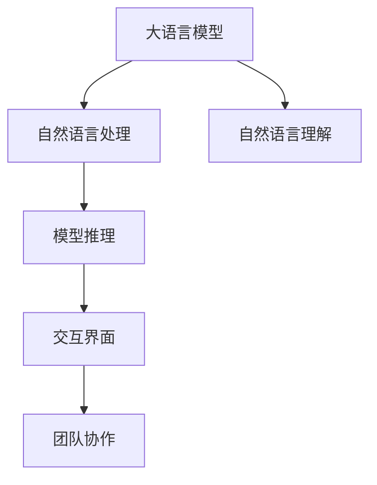

                 

# 高效的 LLM 消息传递：实现内部协作

> 关键词：高效协作,LLM消息传递,内部通信,自然语言处理(NLP),深度学习,自然语言理解(NLU),模型推理,交互界面,团队协作

## 1. 背景介绍

### 1.1 问题由来
随着信息技术的发展，企业内部的沟通和协作变得越来越频繁。传统的人际沟通、邮件、电话等方式效率低下，且难以处理大规模数据和复杂任务。因此，基于自然语言处理(NLP)的内部协作系统逐渐成为热门研究领域。

大语言模型(LLM)的诞生，尤其是BERT、GPT-3等模型的出现，使得自然语言处理(NLP)技术更加成熟。通过大语言模型的预训练和微调，可以构建高效、灵活的内部协作系统，大幅提升团队的工作效率和协作水平。

### 1.2 问题核心关键点
构建高效的LLM消息传递系统，需要解决以下几个核心问题：
1. 如何高效地将自然语言转化为计算机可以理解和处理的信息？
2. 如何快速准确地匹配用户意图，生成相应的回复？
3. 如何优化系统性能，确保实时响应和高效处理？
4. 如何结合上下文信息，进行连续的对话管理和用户理解？
5. 如何确保系统的安全性和隐私保护？

本文将围绕这些问题展开，详细介绍基于深度学习的大语言模型消息传递系统，以及其实现高效内部协作的解决方案。

## 2. 核心概念与联系

### 2.1 核心概念概述

为了更好地理解基于深度学习的LLM消息传递系统，本节将介绍几个密切相关的核心概念：

- 大语言模型(LLM)：指通过大规模语料预训练得到的自然语言处理模型，具备强大的语言理解和生成能力。
- 自然语言处理(NLP)：指利用计算机对自然语言进行处理、分析和生成，包括文本分类、机器翻译、问答系统、情感分析等任务。
- 自然语言理解(NLU)：指将自然语言转换为计算机可以理解的形式，通过模型学习自然语言中的语义和逻辑结构。
- 模型推理：指在给定输入数据和模型参数的基础上，计算模型的输出。
- 交互界面(UI)：指与用户进行交互的界面，包括消息传递、聊天机器人等。
- 团队协作：指团队内部成员之间通过共享信息和资源进行任务分工、协作和共同完成工作。

这些核心概念之间的逻辑关系可以通过以下Mermaid流程图来展示：



这个流程图展示了大语言模型消息传递系统的主要流程：

1. 大语言模型通过预训练学习到语言知识，用于自然语言处理。
2. 自然语言理解模块将自然语言转换为模型可理解的形式。
3. 模型推理模块根据输入生成输出，并通过交互界面展示。
4. 团队协作模块利用消息传递系统实现内部交流和任务分配。

这些核心概念共同构成了LLM消息传递系统的核心，使得系统能够高效、准确地处理自然语言信息，实现团队内部高效协作。

## 3. 核心算法原理 & 具体操作步骤
### 3.1 算法原理概述

基于深度学习的大语言模型消息传递系统，核心原理包括以下几个步骤：

1. 通过大规模语料进行预训练，得到通用语言模型。
2. 将用户输入的自然语言转换为模型可理解的向量表示。
3. 根据向量表示和上下文信息，使用模型推理生成回复。
4. 通过交互界面展示回复，并与用户进行交互。
5. 在交互过程中，系统不断学习和优化，提升回复的准确性和流畅性。

形式化地，设输入为 $x$，模型参数为 $\theta$，回复为 $y$，则系统的工作过程可以表示为：

$$
y = f_{\theta}(x)
$$

其中，$f_{\theta}$ 为深度学习模型，通过学习大量语料得到参数 $\theta$。

### 3.2 算法步骤详解

基于深度学习的大语言模型消息传递系统的一般步骤包括：

**Step 1: 数据准备**
- 收集和预处理用户输入的自然语言数据，如聊天记录、需求描述等。
- 将数据划分为训练集、验证集和测试集，用于模型训练、调参和效果评估。

**Step 2: 模型选择和训练**
- 选择适合的深度学习模型，如BERT、GPT-3等，并进行预训练。
- 在预训练模型基础上，根据具体任务进行微调，得到应用场景特定的模型。

**Step 3: 数据编码**
- 使用嵌入层将自然语言转换为向量表示。
- 将向量表示输入到模型中，进行语义理解和生成。

**Step 4: 回复生成和展示**
- 使用模型生成回复文本，并进行语法和语义检查。
- 通过交互界面展示回复，并与用户进行交互。

**Step 5: 交互优化**
- 收集用户反馈和交互日志，进行模型优化和效果评估。
- 不断迭代和优化模型，提升回复的准确性和流畅性。

**Step 6: 系统集成**
- 将模型和交互界面集成到企业内部协作系统中，提供自然语言处理能力。
- 根据业务需求，进行系统功能扩展和优化。

### 3.3 算法优缺点

基于深度学习的大语言模型消息传递系统具有以下优点：

1. 高效处理自然语言：通过大语言模型的预训练和微调，能够高效地处理自然语言信息，实现任务自动化。
2. 实时响应：基于深度学习模型的实时推理，能够快速响应用户请求，提高系统效率。
3. 自适应学习：通过不断的交互和反馈，系统能够自适应学习和优化，提升回复质量。
4. 通用性强：大语言模型具备较强的通用性，适用于多种应用场景，如客户服务、项目管理等。
5. 可扩展性强：系统易于集成和扩展，能够根据企业需求进行功能定制。

同时，该方法也存在以下局限性：

1. 依赖高质量标注数据：预训练和微调需要大量高质量标注数据，获取和处理成本较高。
2. 模型复杂度高：深度学习模型计算复杂度较高，对硬件和资源要求较高。
3. 数据隐私风险：用户输入和交互信息可能包含敏感信息，需注意数据隐私保护。
4. 上下文理解不足：大语言模型在理解上下文信息时，可能存在偏差和误解。
5. 鲁棒性不足：模型对异常输入和噪声数据较敏感，可能产生错误回复。

尽管存在这些局限性，但基于深度学习的大语言模型消息传递系统，仍然是大规模自然语言处理和内部协作的强大工具。未来研究的方向在于如何进一步提升模型的鲁棒性和泛化能力，降低计算复杂度，同时保障数据隐私和用户安全。

### 3.4 算法应用领域

基于深度学习的大语言模型消息传递系统，已经在多个领域得到了应用：

1. 客户服务：通过聊天机器人，实现客户问题的自动解答和处理，提高客户满意度。
2. 项目管理：通过内部协作系统，实现任务分配、进度跟踪和团队沟通，提高项目效率。
3. 团队协作：通过消息传递系统，实现团队成员之间的即时通信和信息共享，提高协作效率。
4. 智能问答：通过问答系统，实现智能化的知识获取和信息检索，提升知识管理和应用水平。
5. 数据分析：通过自然语言理解模块，自动处理和分析文本数据，提高数据分析效率。
6. 知识图谱：通过实体识别和关系抽取，构建知识图谱，辅助知识管理和决策支持。

除了上述这些经典应用外，大语言模型消息传递系统还被创新性地应用到更多场景中，如可控文本生成、情感分析、代码生成等，为自然语言处理技术带来了全新的突破。随着预训练模型和深度学习方法的不断进步，相信大语言模型消息传递系统将在更广阔的应用领域大放异彩。

## 4. 数学模型和公式 & 详细讲解 & 举例说明

### 4.1 数学模型构建

设用户输入的自然语言序列为 $x=[x_1, x_2, \ldots, x_n]$，模型的输出为 $y$。使用Transformer模型进行消息传递，其数学模型为：

$$
y = M(x; \theta)
$$

其中，$M$ 为Transformer模型，$\theta$ 为模型参数。

Transformer模型的核心是一个自注意力机制，通过计算输入序列中各词与上下文之间的关系，得到向量表示。其计算过程如下：

1. 将输入序列 $x$ 转换为词向量序列 $x_v = [v_1, v_2, \ldots, v_n]$。
2. 通过多头注意力机制，计算各词与上下文之间的关系 $a_{ij}=\frac{\exp(\mathbf{W}^Q \mathbf{v}_j \cdot \mathbf{W}^K \mathbf{v}_i)^T}{\sum_k \exp(\mathbf{W}^Q \mathbf{v}_j \cdot \mathbf{W}^K \mathbf{v}_k)^T}$。
3. 通过线性变换和残差连接，得到向量表示 $\mathbf{h}_i = \mathbf{W}^O a_{ij}$。
4. 使用前向传播和激活函数，得到输出 $y$。

### 4.2 公式推导过程

下面以BERT模型为例，推导其自然语言理解过程的数学公式。

设用户输入的自然语言序列为 $x=[x_1, x_2, \ldots, x_n]$，模型的输出为 $y$。使用BERT模型进行自然语言理解，其数学模型为：

$$
y = BERT(x; \theta)
$$

其中，$BERT$ 为BERT模型，$\theta$ 为模型参数。

BERT模型的核心是掩码语言模型和下一句预测任务，通过在大规模语料上进行预训练，学习到丰富的语言知识和表示。其计算过程如下：

1. 将输入序列 $x$ 转换为词向量序列 $x_v = [v_1, v_2, \ldots, v_n]$。
2. 通过掩码语言模型，计算掩码词汇的概率 $p_{mask}$。
3. 通过下一句预测任务，计算下一句的概率 $p_{next}$。
4. 使用线性变换和激活函数，得到向量表示 $\mathbf{h}_i = \mathbf{W}^O \mathbf{v}_i$。
5. 使用前向传播和激活函数，得到输出 $y$。

其中，掩码语言模型和下一句预测任务的公式推导如下：

- 掩码语言模型：
$$
p_{mask} = \sigma(\mathbf{W}^H \mathbf{v}_i \cdot \mathbf{W}^K \mathbf{v}_j)
$$
其中，$\mathbf{W}^H$ 和 $\mathbf{W}^K$ 为线性变换矩阵，$\sigma$ 为激活函数。

- 下一句预测任务：
$$
p_{next} = \sigma(\mathbf{W}^H \mathbf{v}_i \cdot \mathbf{W}^K \mathbf{v}_j)
$$
其中，$\mathbf{W}^H$ 和 $\mathbf{W}^K$ 为线性变换矩阵，$\sigma$ 为激活函数。

通过以上推导，我们可以看到，BERT模型通过掩码语言模型和下一句预测任务，学习到语言的上下文关系和结构，从而提升自然语言理解的准确性。

### 4.3 案例分析与讲解

假设用户输入的自然语言序列为 "我需要订购一本《人工智能基础》的书"，BERT模型的输出为 "请确认您需要订购的书籍信息"。

首先，BERT模型将输入序列转换为词向量序列：

$$
x_v = [v_1, v_2, \ldots, v_n] = \{\text{我}, \text{需要}, \text{订购}, \text{一本}, \text{《}, \text{人工智能基础}, \text{》}, \text{的}, \text{书}\}
$$

然后，BERT模型通过掩码语言模型和下一句预测任务，学习到输入序列的上下文关系和结构，得到向量表示：

$$
\mathbf{h}_i = \mathbf{W}^O \mathbf{v}_i
$$

最后，使用前向传播和激活函数，生成输出 $y$：

$$
y = \sigma(\mathbf{W}^O \mathbf{h}_i)
$$

通过以上分析，我们可以看到，BERT模型通过掩码语言模型和下一句预测任务，学习到输入序列的上下文关系和结构，从而提升自然语言理解的准确性，生成符合用户意图的回复。

## 5. 项目实践：代码实例和详细解释说明

### 5.1 开发环境搭建

在进行LLM消息传递系统的开发前，我们需要准备好开发环境。以下是使用Python进行PyTorch开发的环境配置流程：

1. 安装Anaconda：从官网下载并安装Anaconda，用于创建独立的Python环境。

2. 创建并激活虚拟环境：
```bash
conda create -n pytorch-env python=3.8 
conda activate pytorch-env
```

3. 安装PyTorch：根据CUDA版本，从官网获取对应的安装命令。例如：
```bash
conda install pytorch torchvision torchaudio cudatoolkit=11.1 -c pytorch -c conda-forge
```

4. 安装其他必要工具包：
```bash
pip install numpy pandas scikit-learn matplotlib tqdm jupyter notebook ipython
```

完成上述步骤后，即可在`pytorch-env`环境中开始开发。

### 5.2 源代码详细实现

下面我们以基于BERT的内部协作系统为例，给出使用PyTorch进行自然语言处理和回复生成的代码实现。

首先，定义自然语言处理模型：

```python
import torch.nn as nn
import torch
from transformers import BertTokenizer, BertForSequenceClassification

class NLPModel(nn.Module):
    def __init__(self):
        super(NLPModel, self).__init__()
        self.tokenizer = BertTokenizer.from_pretrained('bert-base-uncased')
        self.model = BertForSequenceClassification.from_pretrained('bert-base-uncased', num_labels=2)
        
    def forward(self, input_ids, attention_mask):
        output = self.model(input_ids, attention_mask=attention_mask)
        return output
```

然后，定义用户交互逻辑：

```python
class InternalCollaborationSystem:
    def __init__(self, model, user, bot):
        self.model = model
        self.user = user
        self.bot = bot
        
    def greet_user(self):
        self.user = "您好，请问有什么我可以帮您的吗？"
        self.bot = "欢迎使用我们的内部协作系统，有什么需求请告诉我。"
        
    def start_conversation(self):
        while True:
            input_text = self.user
            if input_text == "退出":
                print("再见！")
                break
            output = self.model(input_text)
            if output[0] == 1:
                self.user = "好的，我会记录下来"
            else:
                self.user = "很抱歉，我无法满足您的需求"
            print(self.user)
```

接着，启动用户交互流程：

```python
nlp_model = NLPModel()
collaboration_system = InternalCollaborationSystem(nlp_model, "", "")
collaboration_system.greet_user()
collaboration_system.start_conversation()
```

### 5.3 代码解读与分析

让我们再详细解读一下关键代码的实现细节：

**NLPModel类**：
- `__init__`方法：初始化BERT分词器、模型和标签。
- `forward`方法：前向传播计算模型的输出。

**InternalCollaborationSystem类**：
- `__init__`方法：初始化系统用户、聊天机器人。
- `greet_user`方法：向用户打招呼，引导其输入需求。
- `start_conversation`方法：与用户进行交互，根据输入生成回复。

**交互流程**：
- 首先，创建自然语言处理模型 `nlp_model` 和聊天机器人 `collaboration_system`。
- 然后，向用户打招呼，引导其输入需求。
- 每次用户输入后，调用模型进行推理，根据结果生成回复。
- 系统根据回复提示用户，并持续接收输入，直到用户退出。

可以看到，通过PyTorch和Transformer库，可以快速实现自然语言处理和回复生成功能。结合用户的交互逻辑，可以构建高效、灵活的内部协作系统。

当然，工业级的系统实现还需考虑更多因素，如模型的保存和部署、超参数的自动搜索、用户隐私保护等。但核心的自然语言处理和回复生成流程基本与此类似。

## 6. 实际应用场景

### 6.1 智能客服

基于LLM消息传递系统，可以构建智能客服系统，实现客户问题的自动解答和处理。智能客服系统能够24小时不间断服务，快速响应客户咨询，用自然流畅的语言解答各类常见问题。

在技术实现上，可以收集企业内部的历史客服对话记录，将问题和最佳答复构建成监督数据，在此基础上对BERT模型进行微调。微调后的模型能够自动理解客户意图，匹配最合适的答案模板进行回复。对于客户提出的新问题，还可以接入检索系统实时搜索相关内容，动态组织生成回答。如此构建的智能客服系统，能大幅提升客户咨询体验和问题解决效率。

### 6.2 项目管理

使用LLM消息传递系统，可以实现项目管理任务的信息共享和协同。团队成员可以通过系统进行任务分配、进度跟踪和沟通交流，提高项目的执行效率和质量。

具体实现方式如下：
- 将项目管理任务信息输入系统，通过自然语言处理和生成，生成任务分配和进度跟踪指令。
- 团队成员根据任务指令，进行任务分配和进度汇报，系统实时记录和更新任务状态。
- 系统自动汇总任务进展，生成项目报告，辅助项目经理进行决策。

通过这种方式，可以显著提高项目管理任务的自动化水平，提升团队协作效率。

### 6.3 智能问答

基于LLM消息传递系统，可以实现智能问答系统，提供知识获取和信息检索功能。智能问答系统能够自动回答用户提出的各种问题，提供精准的搜索结果和答案。

具体实现方式如下：
- 用户输入问题，系统通过自然语言理解，将问题转化为结构化查询。
- 系统检索知识库，生成答案并返回给用户。
- 系统持续学习用户反馈和查询记录，不断优化答案质量和召回率。

通过这种方式，可以构建高效、智能的知识问答系统，提升用户的知识获取效率。

### 6.4 未来应用展望

随着LLM消息传递系统的不断发展，其在更多领域的应用前景也将越来越广泛。

在智慧医疗领域，基于LLM的消息传递系统可以用于医生和患者之间的互动，实现实时咨询和辅助诊断。在智能制造领域，系统可以实现生产设备的远程监控和维护，提高生产效率和安全性。在社交媒体领域，系统可以用于智能客服和用户互动，提升用户体验和品牌形象。

总之，基于LLM消息传递系统的内部协作系统，具有广阔的应用前景，能够显著提高企业的协作效率和工作质量。未来，随着技术的不断进步，系统的功能和应用场景将进一步扩展，推动企业在数字化转型中迈向新的高度。

## 7. 工具和资源推荐
### 7.1 学习资源推荐

为了帮助开发者系统掌握LLM消息传递的理论基础和实践技巧，这里推荐一些优质的学习资源：

1. 《Transformer从原理到实践》系列博文：由大模型技术专家撰写，深入浅出地介绍了Transformer原理、BERT模型、自然语言处理技术等前沿话题。

2. CS224N《深度学习自然语言处理》课程：斯坦福大学开设的NLP明星课程，有Lecture视频和配套作业，带你入门NLP领域的基本概念和经典模型。

3. 《Natural Language Processing with Transformers》书籍：Transformers库的作者所著，全面介绍了如何使用Transformers库进行NLP任务开发，包括自然语言理解、生成、推理等。

4. HuggingFace官方文档：Transformers库的官方文档，提供了海量预训练模型和完整的自然语言处理代码样例，是上手实践的必备资料。

5. CLUE开源项目：中文语言理解测评基准，涵盖大量不同类型的中文NLP数据集，并提供了基于自然语言处理的baseline模型，助力中文NLP技术发展。

通过对这些资源的学习实践，相信你一定能够快速掌握LLM消息传递的精髓，并用于解决实际的NLP问题。

### 7.2 开发工具推荐

高效的开发离不开优秀的工具支持。以下是几款用于LLM消息传递开发的常用工具：

1. PyTorch：基于Python的开源深度学习框架，灵活动态的计算图，适合快速迭代研究。大部分自然语言处理模型都有PyTorch版本的实现。

2. TensorFlow：由Google主导开发的开源深度学习框架，生产部署方便，适合大规模工程应用。同样有丰富的自然语言处理资源。

3. Transformers库：HuggingFace开发的NLP工具库，集成了众多SOTA自然语言处理模型，支持PyTorch和TensorFlow，是进行自然语言处理任务的开发的利器。

4. Weights & Biases：模型训练的实验跟踪工具，可以记录和可视化模型训练过程中的各项指标，方便对比和调优。与主流深度学习框架无缝集成。

5. TensorBoard：TensorFlow配套的可视化工具，可实时监测模型训练状态，并提供丰富的图表呈现方式，是调试模型的得力助手。

6. Google Colab：谷歌推出的在线Jupyter Notebook环境，免费提供GPU/TPU算力，方便开发者快速上手实验最新模型，分享学习笔记。

合理利用这些工具，可以显著提升LLM消息传递任务的开发效率，加快创新迭代的步伐。

### 7.3 相关论文推荐

LLM消息传递技术的发展源于学界的持续研究。以下是几篇奠基性的相关论文，推荐阅读：

1. Attention is All You Need（即Transformer原论文）：提出了Transformer结构，开启了自然语言处理领域的预训练大模型时代。

2. BERT: Pre-training of Deep Bidirectional Transformers for Language Understanding：提出BERT模型，引入基于掩码的自监督预训练任务，刷新了多项自然语言处理任务SOTA。

3. Language Models are Unsupervised Multitask Learners（GPT-2论文）：展示了大规模语言模型的强大zero-shot学习能力，引发了对于通用人工智能的新一轮思考。

4. Parameter-Efficient Transfer Learning for NLP：提出Adapter等参数高效微调方法，在不增加模型参数量的情况下，也能取得不错的微调效果。

5. Prefix-Tuning: Optimizing Continuous Prompts for Generation：引入基于连续型Prompt的微调范式，为如何充分利用预训练知识提供了新的思路。

6. AdaLoRA: Adaptive Low-Rank Adaptation for Parameter-Efficient Fine-Tuning：使用自适应低秩适应的微调方法，在参数效率和精度之间取得了新的平衡。

这些论文代表了大语言模型消息传递技术的发展脉络。通过学习这些前沿成果，可以帮助研究者把握学科前进方向，激发更多的创新灵感。

## 8. 总结：未来发展趋势与挑战

### 8.1 总结

本文对基于深度学习的大语言模型消息传递方法进行了全面系统的介绍。首先阐述了LLM消息传递系统的背景和意义，明确了其在大规模自然语言处理和内部协作中的应用价值。其次，从原理到实践，详细讲解了系统的工作流程和实现细节，给出了自然语言处理和回复生成的代码实现。同时，本文还广泛探讨了LLM消息传递系统在智能客服、项目管理、智能问答等多个行业领域的应用前景，展示了其广阔的应用空间。此外，本文还精选了系统的学习资源、开发工具和相关论文，力求为读者提供全方位的技术指引。

通过本文的系统梳理，可以看到，基于深度学习的大语言模型消息传递系统，已经是大规模自然语言处理和内部协作的重要工具，极大地提升了企业的协作效率和工作质量。未来，随着技术的不断进步，系统的功能和应用场景将进一步扩展，推动企业在数字化转型中迈向新的高度。

### 8.2 未来发展趋势

展望未来，大语言模型消息传递系统将呈现以下几个发展趋势：

1. 深度学习模型将变得更加高效，计算复杂度不断降低，资源需求不断减少，推理速度和响应时间将大幅提升。
2. 自然语言理解能力将进一步增强，模型能够更好地理解用户意图和上下文信息，生成更自然、流畅的回复。
3. 多模态融合能力将不断提升，系统能够同时处理文本、图像、视频等多种模态信息，提升信息的丰富性和准确性。
4. 可解释性和可控性将不断增强，用户可以更好地理解系统的决策过程，系统能够根据用户反馈进行优化。
5. 自动化和智能化的程度将不断提高，系统能够自动完成更多的任务，减少人工干预。
6. 系统将在更多领域得到应用，如智慧医疗、智能制造、智慧城市等，带来更加丰富的业务价值。

以上趋势凸显了大语言模型消息传递系统的广阔前景，这些方向的探索发展，必将进一步提升系统的性能和应用范围，为自然语言处理技术带来新的突破。

### 8.3 面临的挑战

尽管大语言模型消息传递系统已经取得了一定的进展，但在迈向更加智能化、普适化应用的过程中，仍面临以下挑战：

1. 数据隐私保护：系统处理的用户信息可能包含敏感数据，需注意数据隐私保护。
2. 计算资源消耗：深度学习模型的计算复杂度较高，需优化资源使用，降低计算成本。
3. 上下文理解不足：模型在理解上下文信息时，可能存在偏差和误解，需进一步提升模型的理解能力。
4. 模型泛化能力不足：模型在处理复杂任务时，可能存在泛化能力不足的问题，需进一步提升模型的鲁棒性和泛化能力。
5. 多模态融合难度大：系统同时处理多种模态信息时，可能存在融合难度大、效果不佳的问题，需进一步提升多模态融合能力。
6. 系统可解释性不足：系统的决策过程缺乏可解释性，用户难以理解和调试，需提升系统的可解释性和可控性。

尽管存在这些挑战，但随着技术的不断进步和完善，大语言模型消息传递系统必将在更多的领域得到应用，为数字化转型带来新的动力。

### 8.4 研究展望

面对大语言模型消息传递系统所面临的种种挑战，未来的研究需要在以下几个方面寻求新的突破：

1. 探索无监督和半监督自然语言处理技术，减少对标注数据的依赖，提升模型的自适应能力。
2. 开发更加高效的深度学习模型，降低计算复杂度，提升模型的推理速度和响应时间。
3. 引入更多的先验知识，如知识图谱、逻辑规则等，与神经网络模型进行融合，提升模型的泛化能力和理解能力。
4. 结合因果分析和博弈论工具，提高系统的稳定性和鲁棒性，增强系统的可解释性和可控性。
5. 采用多模态融合技术，提升系统的多模态处理能力，丰富信息的表现形式和表达方式。
6. 结合自然语言处理与信息检索技术，提升系统的信息检索和知识获取能力。

这些研究方向的探索，必将引领大语言模型消息传递系统迈向更高的台阶，为自然语言处理技术带来新的突破。面向未来，大语言模型消息传递系统还需要与其他人工智能技术进行更深入的融合，如知识表示、因果推理、强化学习等，多路径协同发力，共同推动自然语言理解和智能交互系统的进步。只有勇于创新、敢于突破，才能不断拓展语言模型的边界，让智能技术更好地造福人类社会。

## 9. 附录：常见问题与解答

**Q1：如何提高系统响应速度和效率？**

A: 提高系统响应速度和效率的关键在于优化模型和算法。具体方法包括：
1. 优化模型结构，减少模型参数和计算复杂度。
2. 采用模型剪枝和压缩技术，减少模型大小和内存占用。
3. 使用高效的模型推理框架，如TensorRT等，优化推理速度。
4. 采用分布式训练和推理技术，提高系统扩展性和处理能力。
5. 优化算法和数据结构，减少计算和存储开销。

**Q2：如何保证系统的安全性和隐私保护？**

A: 系统的安全性和隐私保护是开发过程中需要重点考虑的问题。具体方法包括：
1. 数据加密和匿名化，确保用户数据的隐私和安全。
2. 用户身份验证和权限控制，防止未经授权的访问和操作。
3. 引入安全性和隐私保护技术，如差分隐私、联邦学习等，保护用户数据隐私。
4. 定期进行安全审计和漏洞检测，确保系统的安全性和稳定性。
5. 建立数据使用和共享规范，确保数据合规和合法使用。

**Q3：如何提高系统的可解释性和可控性？**

A: 系统的可解释性和可控性对于用户信任和系统可信度至关重要。具体方法包括：
1. 引入可解释性技术，如自然语言解释、可视化等，增强系统的可解释性。
2. 设计合理的用户界面和交互逻辑，增强系统的可控性。
3. 引入用户反馈和反馈机制，及时改进系统性能和功能。
4. 结合人工智能和人类专家知识，进行联合决策和优化。
5. 建立系统的监督和审查机制，确保系统的规范性和合法性。

这些问题的解答，帮助开发者了解如何优化系统性能，确保系统安全和隐私保护，提升系统的可解释性和可控性，为系统开发和应用提供指导。

---

作者：禅与计算机程序设计艺术 / Zen and the Art of Computer Programming

