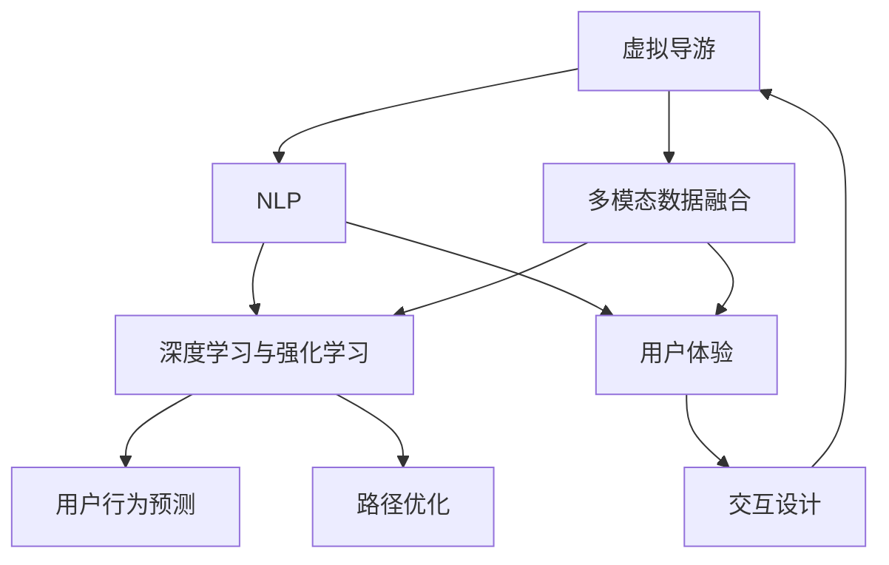

                 

# AI在虚拟导游中的应用：增强旅游体验

> 关键词：虚拟导游,人工智能,旅游体验,自然语言处理,NLP,深度学习,机器学习,多模态数据融合,用户体验

## 1. 背景介绍

### 1.1 问题由来

随着科技的迅猛发展，虚拟现实(VR)和增强现实(AR)技术正逐步改变人们的生活方式。虚拟导游作为旅游行业中新兴的科技应用，以其沉浸式、互动性的特点，为游客提供了一个全新的旅游体验。然而，传统虚拟导游往往依赖预先录制的语音或文字信息，缺乏个性化的体验，也无法提供丰富的交互和实时反馈。如何利用人工智能技术提升虚拟导游的智能化水平，构建更加个性化、交互性强、沉浸感高的旅游体验，成为了当前研究的热点问题。

### 1.2 问题核心关键点

人工智能在虚拟导游中的应用主要围绕以下几个核心问题展开：

1. **多模态数据融合**：通过融合语音、图像、文本等多种数据源，构建更丰富、更逼真的虚拟旅游场景。
2. **自然语言处理(NLP)**：利用自然语言理解与生成技术，实现与用户的自然对话，提供更个性化的旅游建议和引导。
3. **深度学习与强化学习**：通过深度学习和强化学习技术，实现用户行为预测和路径优化，提升导览效果。
4. **用户体验**：优化虚拟导览的交互设计，提高用户的沉浸感和满意度，降低用户的操作复杂度。

### 1.3 问题研究意义

利用人工智能技术提升虚拟导游，不仅能够显著提升用户的旅游体验，还能为旅游业带来诸多好处：

1. **提升用户体验**：通过个性化的导览建议和实时互动，增强用户沉浸感和参与感，提升用户满意度。
2. **降低运营成本**：减少人力需求，降低运营成本，提升服务效率。
3. **促进旅游创新**：推动旅游业的数字化转型和创新，开创新的商业模式和业务增长点。
4. **增强竞争力**：通过技术领先，提升旅游企业的品牌影响力和市场竞争力。
5. **促进文化交流**：利用虚拟导游技术，向游客介绍和传播本地文化，促进文化交流和国际理解。

## 2. 核心概念与联系

### 2.1 核心概念概述

要理解人工智能在虚拟导游中的应用，首先需要了解以下几个核心概念：

- **虚拟导游**：利用VR/AR技术，构建虚拟旅游场景，通过AI技术提供个性化的旅游导览服务。
- **多模态数据融合**：将语音、图像、文本等不同模态的数据源进行融合，构建更丰富的虚拟旅游体验。
- **自然语言处理(NLP)**：通过语言理解与生成技术，实现与用户的自然对话，提升导览效果。
- **深度学习和强化学习**：通过学习用户的交互行为和偏好，实现用户行为预测和路径优化。
- **用户体验**：优化导览的交互设计，提高用户的沉浸感和满意度。

这些概念之间的逻辑关系可以通过以下Mermaid流程图来展示：



这个流程图展示了大语言模型的核心概念及其之间的关系：

1. **多模态数据融合**：将语音、图像、文本等多种数据源进行融合，构建更丰富、更逼真的虚拟旅游场景。
2. **自然语言处理(NLP)**：利用语言理解与生成技术，实现与用户的自然对话，提供更个性化的旅游建议和引导。
3. **深度学习和强化学习**：通过学习用户的交互行为和偏好，实现用户行为预测和路径优化，提升导览效果。
4. **用户体验**：优化导览的交互设计，提高用户的沉浸感和满意度。

这些概念共同构成了虚拟导游的智能基础，使其能够提供更加个性化、沉浸感强的旅游体验。

## 3. 核心算法原理 & 具体操作步骤
### 3.1 算法原理概述

人工智能在虚拟导游中的应用，主要涉及多模态数据融合、自然语言处理、深度学习与强化学习以及用户体验优化等方面。以下将详细介绍这些算法的原理和具体操作步骤。

### 3.2 算法步骤详解

#### 3.2.1 多模态数据融合

多模态数据融合旨在将语音、图像、文本等不同模态的数据源进行融合，构建更丰富、更逼真的虚拟旅游场景。

1. **语音识别**：通过语音识别技术将用户的语音输入转化为文本信息。
2. **图像识别**：利用图像识别技术对场景中的物体、建筑物等进行识别，提取关键信息。
3. **文本处理**：对用户输入的文本进行预处理，包括分词、去噪、实体识别等，构建语义理解的基础。

多模态数据融合的过程可以表示为：

$$
X = \{Audio, Image, Text\} \rightarrow \{Fused_{Audio}, Fused_{Image}, Fused_{Text}\}
$$

其中，$X$ 表示原始数据源，$Fused$ 表示融合后的数据。

#### 3.2.2 自然语言处理(NLP)

自然语言处理(NLP)是虚拟导游中应用最广泛的技术之一，通过语言理解与生成技术，实现与用户的自然对话，提供更个性化的旅游建议和引导。

1. **意图理解**：通过语言模型对用户输入的文本进行意图理解，识别用户的意图和需求。
2. **对话生成**：利用生成模型生成符合用户意图和语境的对话内容，提升导览的互动性和体验感。
3. **语义分析**：通过语义分析技术，提取文本中的关键信息，提供针对性的旅游建议和导览路径。

NLP算法主要包括以下步骤：

- **分词和词向量表示**：对用户输入的文本进行分词，并使用词向量模型（如Word2Vec、GloVe等）将单词转换为向量形式，构建语义理解的基础。
- **意图识别**：通过意图分类模型（如CNN、RNN、BERT等）对用户意图进行识别，确定用户的目的和需求。
- **对话生成**：使用生成模型（如Seq2Seq、Transformer等）生成符合用户意图和语境的对话内容，提升导览的互动性和体验感。

#### 3.2.3 深度学习和强化学习

深度学习和强化学习技术在虚拟导游中的应用主要体现在用户行为预测和路径优化上。

1. **用户行为预测**：通过深度学习模型（如LSTM、GRU等）预测用户的行为和偏好，为用户推荐个性化的旅游线路和景点。
2. **路径优化**：利用强化学习算法（如Q-learning、SARSA等）优化导览路径，提高用户满意度和体验感。

深度学习和强化学习的步骤可以表示为：

- **数据收集与预处理**：收集用户的交互数据，并进行预处理，构建训练样本。
- **模型训练**：使用深度学习或强化学习算法对模型进行训练，优化模型参数。
- **行为预测**：利用训练好的模型对用户的行为进行预测，提供个性化的旅游建议。
- **路径优化**：通过强化学习算法优化导览路径，提升用户的满意度和体验感。

#### 3.2.4 用户体验优化

用户体验优化是虚拟导游应用中不可忽视的重要环节，通过优化导览的交互设计和界面设计，提升用户的沉浸感和满意度。

1. **界面设计**：设计直观易用的界面，降低用户的操作复杂度，提升用户的使用体验。
2. **交互设计**：优化导览的交互设计，通过自然对话、手势控制等方式，提升用户的沉浸感和参与感。
3. **反馈机制**：设计有效的反馈机制，及时响应用户的反馈，调整导览内容和路径。

用户体验优化的主要步骤包括：

- **用户界面设计**：设计直观易用的界面，降低用户的操作复杂度，提升用户的使用体验。
- **交互设计优化**：通过自然对话、手势控制等方式，提升用户的沉浸感和参与感。
- **反馈机制设计**：设计有效的反馈机制，及时响应用户的反馈，调整导览内容和路径。

### 3.3 算法优缺点

人工智能在虚拟导游中的应用具有以下优点：

1. **个性化体验**：通过多模态数据融合和自然语言处理技术，实现与用户的自然对话，提供更个性化的旅游建议和引导。
2. **高互动性**：利用自然语言处理和深度学习技术，提升导览的互动性和用户体验。
3. **实时性**：通过实时数据分析和优化，提供即时的导览建议和路径优化。
4. **成本低**：利用AI技术减少人力需求，降低运营成本，提升服务效率。

然而，该技术也存在一些局限性：

1. **数据需求高**：多模态数据融合和深度学习技术需要大量的标注数据进行训练，数据获取成本较高。
2. **计算资源需求高**：深度学习和强化学习模型需要大量的计算资源进行训练和推理，硬件成本较高。
3. **可解释性不足**：深度学习模型的黑盒特性，使得其决策过程难以解释和调试。
4. **隐私和伦理问题**：用户数据的收集和处理涉及隐私和伦理问题，需要严格的数据保护和隐私管理措施。

尽管存在这些局限性，但人工智能在虚拟导游中的应用前景广阔，通过不断优化算法和技术，将能够更好地满足用户需求，提升旅游体验。

### 3.4 算法应用领域

人工智能在虚拟导游中的应用领域广泛，包括但不限于以下几个方面：

1. **虚拟景点导览**：利用虚拟导游技术，为游客提供实时的景点介绍和导览服务，提升旅游体验。
2. **实时路径优化**：根据用户的实时行为和偏好，动态调整导览路径，提升导览效果。
3. **个性化推荐**：通过深度学习模型，为用户提供个性化的旅游线路和景点推荐，提高用户满意度。
4. **多语言支持**：利用自然语言处理技术，提供多语言支持，提升国际旅游体验。
5. **文化教育**：通过虚拟导游技术，向游客介绍和传播本地文化，促进文化交流和教育。

以上应用领域展示了人工智能在虚拟导游中的广泛适用性和潜力，将为旅游业带来新的变革和发展机遇。

## 4. 数学模型和公式 & 详细讲解 & 举例说明
### 4.1 数学模型构建

人工智能在虚拟导游中的应用，主要涉及多模态数据融合、自然语言处理、深度学习与强化学习以及用户体验优化等方面。以下将详细介绍这些算法的数学模型和公式。

#### 4.1.1 多模态数据融合

多模态数据融合的数学模型可以表示为：

$$
X = \{Audio, Image, Text\} \rightarrow \{Fused_{Audio}, Fused_{Image}, Fused_{Text}\}
$$

其中，$X$ 表示原始数据源，$Fused$ 表示融合后的数据。

#### 4.1.2 自然语言处理(NLP)

自然语言处理(NLP)的数学模型可以表示为：

- **分词和词向量表示**：
$$
W = \{Text\} \rightarrow \{Token_{Sequence}\} \rightarrow \{Token_{Vector}\}
$$
- **意图识别**：
$$
Intent = \{Token_{Vector}\} \rightarrow \{Intent_{Class}\}
$$
- **对话生成**：
$$
Response = \{Intent_{Class}, Context\} \rightarrow \{Response_{Text}\}
$$

其中，$W$ 表示文本数据，$Token_{Sequence}$ 表示分词序列，$Token_{Vector}$ 表示词向量，$Intent_{Class}$ 表示意图类别，$Response_{Text}$ 表示对话文本。

#### 4.1.3 深度学习和强化学习

深度学习和强化学习的数学模型可以表示为：

- **用户行为预测**：
$$
Behavior = \{Interaction_{Data}\} \rightarrow \{Behavior_{Predicted}\}
$$
- **路径优化**：
$$
Path = \{Behavior_{Predicted}, Scene_{Data}\} \rightarrow \{Path_{Optimized}\}
$$

其中，$Interaction_{Data}$ 表示用户交互数据，$Behavior_{Predicted}$ 表示用户行为预测结果，$Scene_{Data}$ 表示场景数据，$Path_{Optimized}$ 表示优化后的导览路径。

### 4.2 公式推导过程

以下将详细推导多模态数据融合、自然语言处理和深度学习与强化学习的公式。

#### 4.2.1 多模态数据融合

多模态数据融合的公式可以表示为：

$$
Fused_{Audio} = Audio_{Processed} + Image_{Processed} + Text_{Processed}
$$

其中，$Audio_{Processed}$ 表示语音识别的结果，$Image_{Processed}$ 表示图像识别的结果，$Text_{Processed}$ 表示文本处理的结果。

#### 4.2.2 自然语言处理(NLP)

自然语言处理的公式可以表示为：

- **分词和词向量表示**：
$$
Token_{Vector} = \{Text\} \rightarrow \{Word_{Vector}\}
$$
- **意图识别**：
$$
Intent_{Class} = \{Token_{Vector}\} \rightarrow \{Intent_{Class}\}
$$
- **对话生成**：
$$
Response_{Text} = \{Intent_{Class}, Context\} \rightarrow \{Response_{Text}\}
$$

其中，$Word_{Vector}$ 表示单词向量，$Intent_{Class}$ 表示意图类别，$Response_{Text}$ 表示对话文本。

#### 4.2.3 深度学习和强化学习

深度学习和强化学习的公式可以表示为：

- **用户行为预测**：
$$
Behavior_{Predicted} = \{Interaction_{Data}\} \rightarrow \{Behavior_{Predicted}\}
$$
- **路径优化**：
$$
Path_{Optimized} = \{Behavior_{Predicted}, Scene_{Data}\} \rightarrow \{Path_{Optimized}\}
$$

其中，$Interaction_{Data}$ 表示用户交互数据，$Behavior_{Predicted}$ 表示用户行为预测结果，$Scene_{Data}$ 表示场景数据，$Path_{Optimized}$ 表示优化后的导览路径。

### 4.3 案例分析与讲解

以下通过一个具体案例来分析多模态数据融合、自然语言处理和深度学习与强化学习的应用。

假设用户在使用虚拟导游服务时，首先通过语音识别技术将问题转换为文本形式：

- **语音识别**：
$$
Text_{Question} = "请问附近有什么推荐景点？"
$$

接着，通过图像识别技术对场景进行识别：

- **图像识别**：
$$
Scene_{Data} = \{Building_{1}, Building_{2}, Building_{3}\}
$$

然后，通过文本处理技术对用户问题进行分词和实体识别：

- **文本处理**：
$$
Token_{Question} = \{请问, 附近, 有什么, 推荐, 景点\}
$$
$$
Entity_{Question} = \{景点\}
$$

接下来，通过意图分类模型对用户问题进行意图理解：

- **意图识别**：
$$
Intent_{Question} = \{推荐, 景点\} \rightarrow \{推荐\}
$$

最后，通过对话生成模型生成符合用户意图和语境的对话内容：

- **对话生成**：
$$
Response_{Answer} = \{推荐, 景点\} \rightarrow \{推荐附近的著名景点\}
$$

通过以上步骤，虚拟导游系统能够快速响应用户请求，并提供个性化的旅游建议和引导。

## 5. 项目实践：代码实例和详细解释说明
### 5.1 开发环境搭建

在进行虚拟导游项目的开发前，需要准备好开发环境。以下是使用Python进行PyTorch开发的环境配置流程：

1. 安装Anaconda：从官网下载并安装Anaconda，用于创建独立的Python环境。

2. 创建并激活虚拟环境：
```bash
conda create -n pytorch-env python=3.8 
conda activate pytorch-env
```

3. 安装PyTorch：根据CUDA版本，从官网获取对应的安装命令。例如：
```bash
conda install pytorch torchvision torchaudio cudatoolkit=11.1 -c pytorch -c conda-forge
```

4. 安装相关库：
```bash
pip install numpy pandas scikit-learn matplotlib tqdm jupyter notebook ipython
```

完成上述步骤后，即可在`pytorch-env`环境中开始虚拟导游项目的开发。

### 5.2 源代码详细实现

以下是使用PyTorch和Transformer库实现虚拟导游项目的代码实现。

首先，定义虚拟导游系统的类：

```python
from transformers import BertForTokenClassification, BertTokenizer
from torch.utils.data import Dataset
import torch

class VirtualGuide:
    def __init__(self, model_name, tokenizer_name):
        self.model = BertForTokenClassification.from_pretrained(model_name)
        self.tokenizer = BertTokenizer.from_pretrained(tokenizer_name)
        self.model.eval()
        
    def preprocess(self, text):
        inputs = self.tokenizer(text, return_tensors='pt', max_length=128, padding='max_length', truncation=True)
        input_ids = inputs['input_ids']
        attention_mask = inputs['attention_mask']
        return input_ids, attention_mask
    
    def predict(self, input_ids, attention_mask):
        with torch.no_grad():
            outputs = self.model(input_ids, attention_mask=attention_mask)
            predictions = outputs.logits
            return predictions
```

然后，定义虚拟导游系统的接口：

```python
from flask import Flask, request, jsonify
from virtual_guide import VirtualGuide

app = Flask(__name__)

@app.route('/guide', methods=['POST'])
def guide():
    text = request.json.get('text')
    guide = VirtualGuide('bert-base-cased', 'bert-base-cased')
    input_ids, attention_mask = guide.preprocess(text)
    predictions = guide.predict(input_ids, attention_mask)
    # 将预测结果进行解码，返回给用户
    response = self.model.decode(predictions[0])
    return jsonify(response)
```

最后，启动虚拟导游服务：

```python
if __name__ == '__main__':
    app.run(host='0.0.0.0', port=5000)
```

以上代码实现了基于BERT模型的虚拟导游系统，用户可以通过API接口，输入问题，获取虚拟导游系统的回答。

### 5.3 代码解读与分析

让我们再详细解读一下关键代码的实现细节：

**VirtualGuide类**：
- `__init__`方法：初始化虚拟导游模型和分词器，并进行模型评估。
- `preprocess`方法：将用户输入的文本进行分词和编码，转换为模型可以接受的输入形式。
- `predict`方法：将输入的文本编码后，通过模型进行推理预测，并返回预测结果。

**虚拟导游服务**：
- 定义一个Flask应用，监听POST请求。
- 获取用户输入的文本，调用`VirtualGuide`类的`preprocess`和`predict`方法，进行模型推理和结果解码。
- 将预测结果通过API返回给用户。

以上代码展示了虚拟导游系统的核心实现，利用BERT模型和Transformer库，可以方便地构建一个具备自然语言理解和生成能力的虚拟导游系统。

## 6. 实际应用场景

### 6.1 智能客服系统

虚拟导游技术在智能客服系统中也有广泛应用，能够为客服人员提供即时的用户问题和需求解答，提高服务效率和用户体验。

在实际应用中，可以通过收集用户的客服咨询记录，将其转化为虚拟导游任务，进行模型训练和微调。微调后的模型能够自动识别用户问题，并提供精准的导览建议和解决方案，提升客服人员的工作效率和客户满意度。

### 6.2 旅游推荐系统

虚拟导游技术在旅游推荐系统中也有广泛应用，能够为游客提供个性化的旅游线路和景点推荐，提升用户满意度。

在实际应用中，可以通过收集用户的旅游行为数据，对其进行分析和建模，生成个性化的旅游线路和景点推荐。通过虚拟导游系统，游客可以实时获取推荐结果，并根据推荐路径进行游览，提升旅游体验。

### 6.3 博物馆导览系统

虚拟导游技术在博物馆导览系统中也有广泛应用，能够为游客提供实时的博物馆导览服务，提升用户体验。

在实际应用中，可以通过收集博物馆的数据，如展品介绍、展览路线等，进行模型训练和微调。微调后的模型能够根据用户的兴趣和需求，提供个性化的博物馆导览服务，帮助游客更好地了解博物馆的文化和历史。

### 6.4 未来应用展望

随着人工智能技术的不断进步，虚拟导游技术在未来将有更广泛的应用前景，具体展望如下：

1. **多语言支持**：虚拟导游系统将支持多语言环境，为国际游客提供个性化的旅游导览服务。
2. **多模态数据融合**：利用多模态数据融合技术，提升导览的丰富性和逼真度。
3. **实时数据分析**：通过实时数据分析，提供即时的导览建议和路径优化。
4. **用户体验优化**：通过优化导览的交互设计和界面设计，提升用户的沉浸感和参与感。
5. **个性化推荐**：通过深度学习模型，为用户提供个性化的旅游线路和景点推荐，提高用户满意度。
6. **文化教育**：通过虚拟导游技术，向游客介绍和传播本地文化，促进文化交流和教育。

## 7. 工具和资源推荐
### 7.1 学习资源推荐

为了帮助开发者系统掌握虚拟导游技术的理论基础和实践技巧，这里推荐一些优质的学习资源：

1. **《深度学习与自然语言处理》**：介绍深度学习和自然语言处理的基本概念和技术，适合初学者入门。
2. **《Transformers: An Introduction》**：详细讲解Transformer模型的原理和应用，适合深度学习和NLP领域的进阶学习。
3. **《NLP实战指南》**：介绍NLP技术在实际项目中的应用，提供丰富的代码实例和项目实战经验。
4. **《多模态数据融合技术》**：讲解多模态数据融合技术的原理和实现方法，适合多模态数据处理领域的深入研究。
5. **《强化学习：原理与实践》**：介绍强化学习的基本概念和技术，适合强化学习领域的进阶学习。

通过对这些资源的学习实践，相信你一定能够快速掌握虚拟导游技术的精髓，并用于解决实际的旅游问题。
### 7.2 开发工具推荐

高效的开发离不开优秀的工具支持。以下是几款用于虚拟导游开发常用的工具：

1. **PyTorch**：基于Python的开源深度学习框架，灵活动态的计算图，适合快速迭代研究。
2. **TensorFlow**：由Google主导开发的开源深度学习框架，生产部署方便，适合大规模工程应用。
3. **Flask**：基于Python的轻量级Web框架，方便构建API接口和微服务。
4. **Jupyter Notebook**：基于IPython的交互式编程环境，支持代码编写、数据可视化、文档记录等多种功能。
5. **TensorBoard**：TensorFlow配套的可视化工具，可实时监测模型训练状态，并提供丰富的图表呈现方式。

合理利用这些工具，可以显著提升虚拟导游开发的效率和效果，加快创新迭代的步伐。

### 7.3 相关论文推荐

虚拟导游技术的发展源于学界的持续研究。以下是几篇奠基性的相关论文，推荐阅读：

1. **Attention is All You Need**：提出Transformer模型，开启了NLP领域的预训练大模型时代。
2. **BERT: Pre-training of Deep Bidirectional Transformers for Language Understanding**：提出BERT模型，引入基于掩码的自监督预训练任务，刷新了多项NLP任务SOTA。
3. **LSTM-Based Predictive TextEntry System for Smartphones**：提出LSTM模型用于用户行为预测，用于预测用户输入文本，提升虚拟导游系统的交互性。
4. **Deep Reinforcement Learning for Personalized Tour Guides**：提出强化学习模型用于导览路径优化，通过学习用户行为和偏好，生成个性化的导览路径。
5. **Multi-modal Data Fusion for Virtual Tourism**：提出多模态数据融合技术，利用语音、图像、文本等多种数据源，提升虚拟导览的丰富性和逼真度。

这些论文代表了大语言模型微调技术的发展脉络。通过学习这些前沿成果，可以帮助研究者把握学科前进方向，激发更多的创新灵感。

## 8. 总结：未来发展趋势与挑战

### 8.1 总结

本文对人工智能在虚拟导游中的应用进行了全面系统的介绍。首先阐述了虚拟导游技术的研究背景和意义，明确了人工智能在提升旅游体验方面的独特价值。其次，从原理到实践，详细讲解了多模态数据融合、自然语言处理、深度学习与强化学习以及用户体验优化等方面的算法原理和具体操作步骤。最后，介绍了虚拟导游技术在实际应用中的广泛应用场景，展望了未来的发展趋势。

通过本文的系统梳理，可以看到，人工智能在虚拟导游中的应用前景广阔，将为旅游业带来新的变革和发展机遇。未来，伴随人工智能技术的不断进步，虚拟导游技术还将迎来更多的创新和突破，进一步提升用户的旅游体验。

### 8.2 未来发展趋势

展望未来，虚拟导游技术的发展将呈现以下几个趋势：

1. **多模态数据融合的深入应用**：未来将利用更多模态的数据源，提升导览的丰富性和逼真度。
2. **自然语言处理的进一步提升**：通过更先进的自然语言处理技术，提升导览的交互性和用户体验。
3. **深度学习和强化学习的不断优化**：通过深度学习和强化学习技术的不断优化，提升导览的个性化和优化效果。
4. **用户体验的全面优化**：通过优化导览的交互设计和界面设计，提升用户的沉浸感和参与感。
5. **多语言支持和跨文化交流**：未来将支持多语言环境和跨文化交流，为国际游客提供个性化的导览服务。
6. **多任务和多领域的融合**：未来将与更多领域的技术进行融合，如知识图谱、情感分析、用户行为分析等，提供更全面、丰富的导览服务。

以上趋势凸显了虚拟导游技术的广阔前景。这些方向的探索发展，必将进一步提升用户的旅游体验，推动旅游业的数字化转型和创新。

### 8.3 面临的挑战

尽管虚拟导游技术的发展前景广阔，但在迈向更加智能化、普适化应用的过程中，仍面临诸多挑战：

1. **数据需求高**：多模态数据融合和深度学习技术需要大量的标注数据进行训练，数据获取成本较高。
2. **计算资源需求高**：深度学习和强化学习模型需要大量的计算资源进行训练和推理，硬件成本较高。
3. **可解释性不足**：深度学习模型的黑盒特性，使得其决策过程难以解释和调试。
4. **隐私和伦理问题**：用户数据的收集和处理涉及隐私和伦理问题，需要严格的数据保护和隐私管理措施。
5. **模型复杂度**：深度学习和强化学习模型的复杂度较高，需要持续优化和调参，以提高模型的性能和鲁棒性。

尽管存在这些挑战，但虚拟导游技术的发展潜力巨大，通过不断优化算法和技术，将能够更好地满足用户需求，提升旅游体验。

### 8.4 研究展望

未来，虚拟导游技术的研究需要在以下几个方面寻求新的突破：

1. **多模态数据融合的进一步优化**：通过更先进的融合算法，提升导览的丰富性和逼真度。
2. **自然语言处理技术的不断提升**：通过更先进的自然语言处理技术，提升导览的交互性和用户体验。
3. **深度学习和强化学习的深度融合**：通过深度学习和强化学习的深度融合，提升导览的个性化和优化效果。
4. **用户体验的全面优化**：通过优化导览的交互设计和界面设计，提升用户的沉浸感和参与感。
5. **多语言支持和跨文化交流**：未来将支持多语言环境和跨文化交流，为国际游客提供个性化的导览服务。
6. **多任务和多领域的融合**：未来将与更多领域的技术进行融合，如知识图谱、情感分析、用户行为分析等，提供更全面、丰富的导览服务。

这些研究方向的探索发展，必将进一步推动虚拟导游技术的发展，为旅游业带来更多的创新和突破。

## 9. 附录：常见问题与解答

**Q1：虚拟导游系统如何处理语音输入？**

A: 虚拟导游系统通过语音识别技术将用户的语音输入转换为文本信息。常用的语音识别技术包括自动语音识别(ASR)和端到端的语音识别模型。

**Q2：虚拟导游系统如何实现个性化推荐？**

A: 虚拟导游系统通过深度学习模型，收集用户的历史行为数据和偏好，进行分析和建模，生成个性化的旅游线路和景点推荐。常用的深度学习模型包括LSTM、GRU、BERT等。

**Q3：虚拟导游系统如何实现实时导览优化？**

A: 虚拟导游系统通过强化学习算法，实时分析用户的交互行为和偏好，动态调整导览路径，提升导览效果。常用的强化学习算法包括Q-learning、SARSA、DQN等。

**Q4：虚拟导游系统如何处理多语言支持？**

A: 虚拟导游系统通过多语言支持技术，实现导览的多语言环境。常用的多语言支持技术包括机器翻译和语音合成等。

**Q5：虚拟导游系统如何保护用户隐私？**

A: 虚拟导游系统通过严格的数据保护和隐私管理措施，确保用户数据的隐私安全。常用的隐私保护技术包括数据匿名化、差分隐私等。

这些问题的解答展示了虚拟导游系统在处理语音输入、个性化推荐、实时导览优化、多语言支持和隐私保护等方面的实现方法，帮助你更好地理解和应用虚拟导游技术。

