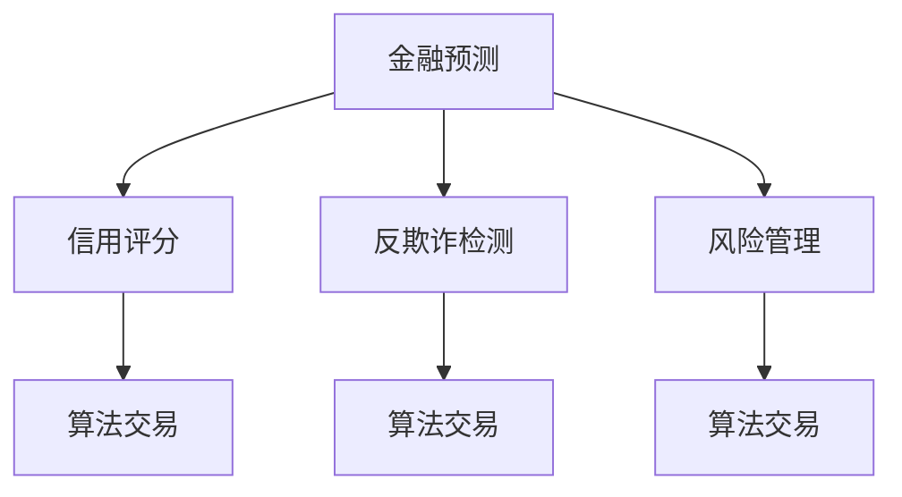

                 

# AI在金融领域的应用：预测与风控

## 1. 背景介绍

### 1.1 问题由来

随着金融科技的飞速发展，人工智能在金融领域的应用日益广泛。在金融风险控制、投资分析、客户服务等多个方面，AI技术已经显示出巨大的价值。特别是在预测与风控方面，AI可以整合大数据、云计算等技术，提供精准的风险评估和投资建议，极大提升了金融机构的服务效率和决策质量。

### 1.2 问题核心关键点

在金融领域，AI的应用主要集中在预测与风控两方面。预测任务通常包括市场趋势预测、信用评分预测、股票价格预测等；而风控任务则包括反欺诈检测、违约风险评估、信用评分系统等。以下将详细探讨这两大领域的AI应用。

### 1.3 问题研究意义

AI在金融领域的应用，对提升金融机构的业务效率和风险管理能力具有重要意义：

1. 提升决策质量。AI可以快速分析海量数据，提供精准的风险评估和投资建议，帮助决策者做出更明智的选择。
2. 降低运营成本。通过自动化处理流程，AI可以减少人力投入，提高运营效率，降低银行和保险公司的运营成本。
3. 增强用户体验。AI驱动的智能客服、推荐系统等，可以提升客户服务质量，增强用户粘性和满意度。
4. 优化风险控制。AI可以实时监控交易行为，自动识别异常，及时预警和防范风险，保障金融系统的安全稳定。
5. 加速金融创新。AI技术推动了金融产品的创新，如智能投顾、金融科技初创企业等，为金融行业带来了新的增长点。

## 2. 核心概念与联系

### 2.1 核心概念概述

为更好地理解AI在金融领域的应用，本节将介绍几个密切相关的核心概念：

- **金融预测(Financial Forecasting)**：指利用历史数据和模型，预测金融市场的未来走势，如利率、股票价格、汇率等。
- **信用评分(Credit Scoring)**：指根据客户的历史信用记录和行为数据，评估其信用风险和信用等级，为贷款审批提供依据。
- **反欺诈检测(Fraud Detection)**：指通过数据分析和机器学习技术，识别和防范金融交易中的欺诈行为。
- **风险管理(Risk Management)**：指识别、评估和控制金融风险，保障金融系统的稳定运行。
- **深度学习(Deep Learning)**：指基于神经网络的多层非线性模型，可以处理高维度、非结构化数据。
- **金融大数据(Financial Big Data)**：指与金融活动相关的海量数据，包括交易记录、客户行为数据、市场行情等。
- **算法交易(Algorithmic Trading)**：指利用计算机算法进行自动交易，提高交易效率和盈利能力。

这些核心概念之间的逻辑关系可以通过以下Mermaid流程图来展示：



这个流程图展示了大语言模型的核心概念及其之间的关系：

1. 金融预测是金融行业的基础，通过预测市场走势和信用评分，为后续的金融操作提供依据。
2. 信用评分用于评估客户的信用风险，是贷款审批和信用管理的重要工具。
3. 反欺诈检测用于识别和防范欺诈行为，保障金融交易的安全性。
4. 风险管理涉及识别和控制金融风险，保障金融系统的稳定。
5. 深度学习和金融大数据是支持预测与风控的重要技术基础。
6. 算法交易利用预测和风控结果进行自动化交易，提高交易效率和盈利能力。

这些概念共同构成了AI在金融领域的应用框架，使得AI可以全面提升金融机构的业务效率和风险管理能力。通过理解这些核心概念，我们可以更好地把握AI在金融领域的工作原理和优化方向。

## 3. 核心算法原理 & 具体操作步骤
### 3.1 算法原理概述

AI在金融领域的应用，主要依赖于机器学习和深度学习算法。以下是金融预测与风控的主要算法原理：

#### 3.1.1 金融预测算法

- **时间序列预测**：通过历史时间序列数据，预测未来的数值。常用算法包括ARIMA、LSTM等。
- **回归模型**：利用线性回归、支持向量机(SVM)、随机森林等算法，预测金融变量的数值。
- **神经网络模型**：利用多层感知器(MLP)、卷积神经网络(CNN)、循环神经网络(RNN)等模型，处理高维度、非结构化数据。

#### 3.1.2 信用评分算法

- **逻辑回归(Logistic Regression)**：利用逻辑回归模型，预测客户的违约概率。
- **决策树(Decision Tree)**：通过构建决策树模型，评估客户的信用风险。
- **随机森林(Random Forest)**：通过集成多个决策树，提升模型的鲁棒性和准确性。
- **支持向量机(SVM)**：利用SVM算法，进行二分类预测，评估客户的信用风险。

#### 3.1.3 反欺诈检测算法

- **异常检测(Anomaly Detection)**：通过检测交易行为中的异常模式，识别欺诈行为。
- **聚类算法(Clustering)**：利用聚类算法，将正常交易与异常交易分开。
- **集成学习(Ensemble Learning)**：通过集成多个分类器，提升模型的准确性和鲁棒性。

#### 3.1.4 风险管理算法

- **VAR模型(VaR Model)**：利用VAR模型，评估金融风险。
- **蒙特卡罗模拟(Monte Carlo Simulation)**：通过模拟金融资产的随机变化，评估风险。
- **CVA模型(Credit Value at Risk)**：利用CVA模型，评估信用风险。
- **KMV模型(KMV Model)**：通过计算债务价值(VaR)和违约概率(PD)，评估风险。

### 3.2 算法步骤详解

#### 3.2.1 金融预测步骤

1. **数据收集**：收集历史市场数据、财务报表、新闻公告等数据，作为训练数据。
2. **数据预处理**：对数据进行清洗、归一化、特征工程等预处理，生成特征向量。
3. **模型选择**：根据数据特点和预测任务，选择合适的算法模型。
4. **模型训练**：利用历史数据训练模型，调整超参数。
5. **模型评估**：使用验证集评估模型性能，优化模型参数。
6. **模型部署**：将训练好的模型部署到生产环境，实时预测市场走势。

#### 3.2.2 信用评分步骤

1. **数据收集**：收集客户的个人基本信息、贷款记录、交易记录等数据。
2. **数据预处理**：对数据进行清洗、归一化、特征工程等预处理，生成特征向量。
3. **模型选择**：根据数据特点和评分任务，选择合适的算法模型。
4. **模型训练**：利用历史数据训练模型，调整超参数。
5. **模型评估**：使用验证集评估模型性能，优化模型参数。
6. **模型部署**：将训练好的模型部署到生产环境，实时评分客户信用。

#### 3.2.3 反欺诈检测步骤

1. **数据收集**：收集交易记录、客户行为数据等。
2. **数据预处理**：对数据进行清洗、归一化、特征工程等预处理，生成特征向量。
3. **模型选择**：根据数据特点和欺诈检测任务，选择合适的算法模型。
4. **模型训练**：利用历史数据训练模型，调整超参数。
5. **模型评估**：使用验证集评估模型性能，优化模型参数。
6. **模型部署**：将训练好的模型部署到生产环境，实时检测欺诈行为。

#### 3.2.4 风险管理步骤

1. **数据收集**：收集金融市场数据、财务报表、客户信用数据等。
2. **数据预处理**：对数据进行清洗、归一化、特征工程等预处理，生成特征向量。
3. **模型选择**：根据数据特点和风险管理任务，选择合适的算法模型。
4. **模型训练**：利用历史数据训练模型，调整超参数。
5. **模型评估**：使用验证集评估模型性能，优化模型参数。
6. **模型部署**：将训练好的模型部署到生产环境，实时监控和评估风险。

### 3.3 算法优缺点

#### 3.3.1 金融预测算法

**优点**：
- 能够处理高维度、非结构化数据。
- 模型性能较好，能够提供精准的预测结果。

**缺点**：
- 模型训练数据需求大，获取成本高。
- 模型复杂度较高，训练和部署较耗时。

#### 3.3.2 信用评分算法

**优点**：
- 能够快速评估客户信用风险，决策效率高。
- 模型鲁棒性好，能够适应不同的客户群体。

**缺点**：
- 模型依赖历史数据，数据质量直接影响评分结果。
- 模型解释性较差，难以理解评分依据。

#### 3.3.3 反欺诈检测算法

**优点**：
- 能够实时监控交易行为，及时发现异常。
- 模型准确性较高，能够识别多种欺诈行为。

**缺点**：
- 模型复杂度高，训练和部署较耗时。
- 模型依赖数据质量，数据不平衡可能导致误判。

#### 3.3.4 风险管理算法

**优点**：
- 能够实时监控金融风险，及时预警和防范风险。
- 模型鲁棒性好，能够适应不同的金融市场和产品。

**缺点**：
- 模型计算复杂度高，资源消耗较大。
- 模型依赖数据质量，数据不完整或不准确可能导致误判。

### 3.4 算法应用领域

AI在金融领域的应用广泛，涉及多个关键领域：

- **市场预测**：用于股票、债券、外汇等市场的趋势预测。
- **信用评分**：用于个人和企业的信用评估和贷款审批。
- **反欺诈检测**：用于识别和防范各种金融欺诈行为。
- **风险管理**：用于评估和管理金融风险，保障金融系统的稳定。
- **客户服务**：用于智能客服、智能推荐、智能投顾等。
- **算法交易**：用于自动化交易和策略优化。
- **金融监管**：用于金融市场监管和合规性检查。

这些领域的应用场景展示了AI在金融领域的广泛价值和巨大潜力。通过理解和应用这些算法，金融机构可以提升服务质量和风险管理能力，推动金融科技的创新发展。

## 4. 数学模型和公式 & 详细讲解 & 举例说明

### 4.1 数学模型构建

#### 4.1.1 金融预测数学模型

假设历史市场数据为 $\{x_t\}_{t=1}^T$，其中 $x_t$ 为第 $t$ 期的市场指标，如股票价格、利率、汇率等。利用时间序列预测模型，预测第 $t+1$ 期的市场指标 $x_{t+1}$。常用的时间序列模型包括ARIMA和LSTM。

#### 4.1.2 信用评分数学模型

假设客户的个人基本信息为 $X$，贷款记录为 $Y$。利用逻辑回归模型，预测客户的违约概率 $p$，即 $p=\text{Logit}(X, Y)$。常用的信用评分模型包括逻辑回归、决策树、随机森林等。

#### 4.1.3 反欺诈检测数学模型

假设交易数据为 $\{D_t\}_{t=1}^T$，其中 $D_t$ 为第 $t$ 期的交易数据，如交易金额、交易地点、交易时间等。利用异常检测模型，识别异常交易行为 $D^*_t$。常用的反欺诈检测模型包括孤立森林、One-Class SVM等。

#### 4.1.4 风险管理数学模型

假设市场数据为 $\{S_t\}_{t=1}^T$，其中 $S_t$ 为第 $t$ 期的市场风险。利用VAR模型，评估市场风险 $V$。常用的风险管理模型包括VAR模型、蒙特卡罗模拟、CVA模型等。

### 4.2 公式推导过程

#### 4.2.1 时间序列预测公式

假设历史市场数据为 $x_t=\{s_t\}_{t=1}^T$，其中 $s_t$ 为第 $t$ 期的市场指标。利用ARIMA模型，预测第 $t+1$ 期的市场指标 $x_{t+1}$。

ARIMA模型公式如下：
$$
x_{t+1}=\phi(x_t, \theta)
$$
其中 $\phi$ 为ARIMA模型函数，$\theta$ 为模型参数。

#### 4.2.2 信用评分公式

假设客户的基本信息为 $X$，贷款记录为 $Y$。利用逻辑回归模型，预测客户的违约概率 $p$。

逻辑回归模型公式如下：
$$
p=\frac{\exp(W \cdot (X, Y)+b)}{1+\exp(W \cdot (X, Y)+b)}
$$
其中 $W$ 为模型权重，$b$ 为截距。

#### 4.2.3 反欺诈检测公式

假设交易数据为 $D_t=\{d_{it}\}_{i=1}^n$，其中 $d_{it}$ 为第 $t$ 期的交易数据。利用孤立森林模型，识别异常交易行为 $D^*_t$。

孤立森林模型公式如下：
$$
D^*_t=\text{Isolation Forest}(D_t)
$$

#### 4.2.4 风险管理公式

假设市场数据为 $S_t=\{s_t\}_{t=1}^T$，其中 $s_t$ 为第 $t$ 期的市场风险。利用VAR模型，评估市场风险 $V$。

VAR模型公式如下：
$$
V=\mathbb{E}[\max\{R, 0\}]
$$
其中 $R$ 为风险资产回报率，$\mathbb{E}$ 为数学期望。

### 4.3 案例分析与讲解

#### 4.3.1 金融预测案例

某银行需要预测下季度的股票价格走势，以指导投资决策。通过收集历史股票价格、交易量、新闻公告等数据，利用LSTM模型进行预测。模型公式如下：
$$
x_{t+1}=\text{LSTM}(x_t, \theta)
$$
其中 $x_t$ 为历史数据，$\theta$ 为模型参数。

模型训练流程如下：
1. 数据预处理：对数据进行归一化、特征工程等预处理。
2. 模型选择：选择LSTM模型作为预测模型。
3. 模型训练：利用历史数据训练模型，调整超参数。
4. 模型评估：使用验证集评估模型性能，优化模型参数。
5. 模型部署：将训练好的模型部署到生产环境，实时预测股票价格。

#### 4.3.2 信用评分案例

某银行需要评估客户的信用风险，以决定是否发放贷款。通过收集客户的个人基本信息、贷款记录、交易记录等数据，利用随机森林模型进行评分。模型公式如下：
$$
p=\text{Random Forest}(X, Y)
$$
其中 $X$ 为客户基本信息，$Y$ 为贷款记录。

模型训练流程如下：
1. 数据预处理：对数据进行归一化、特征工程等预处理。
2. 模型选择：选择随机森林模型作为评分模型。
3. 模型训练：利用历史数据训练模型，调整超参数。
4. 模型评估：使用验证集评估模型性能，优化模型参数。
5. 模型部署：将训练好的模型部署到生产环境，实时评分客户信用。

#### 4.3.3 反欺诈检测案例

某银行需要识别和防范信用卡欺诈行为，以保障资金安全。通过收集信用卡交易数据，利用孤立森林模型进行欺诈检测。模型公式如下：
$$
D^*_t=\text{Isolation Forest}(D_t)
$$
其中 $D_t$ 为交易数据。

模型训练流程如下：
1. 数据预处理：对数据进行归一化、特征工程等预处理。
2. 模型选择：选择孤立森林模型作为检测模型。
3. 模型训练：利用历史数据训练模型，调整超参数。
4. 模型评估：使用验证集评估模型性能，优化模型参数。
5. 模型部署：将训练好的模型部署到生产环境，实时检测欺诈行为。

#### 4.3.4 风险管理案例

某银行需要评估市场风险，以保障资金安全。通过收集市场数据、财务报表、客户信用数据等，利用VAR模型进行风险评估。模型公式如下：
$$
V=\text{VAR}(S_t)
$$
其中 $S_t$ 为市场数据。

模型训练流程如下：
1. 数据预处理：对数据进行归一化、特征工程等预处理。
2. 模型选择：选择VAR模型作为风险评估模型。
3. 模型训练：利用历史数据训练模型，调整超参数。
4. 模型评估：使用验证集评估模型性能，优化模型参数。
5. 模型部署：将训练好的模型部署到生产环境，实时监控和评估风险。

## 5. 项目实践：代码实例和详细解释说明

### 5.1 开发环境搭建

在进行AI在金融领域的应用实践前，我们需要准备好开发环境。以下是使用Python进行TensorFlow和Keras开发的Python环境配置流程：

1. 安装Anaconda：从官网下载并安装Anaconda，用于创建独立的Python环境。

2. 创建并激活虚拟环境：
```bash
conda create -n tf-env python=3.7 
conda activate tf-env
```

3. 安装TensorFlow和Keras：
```bash
pip install tensorflow keras
```

4. 安装各类工具包：
```bash
pip install numpy pandas scikit-learn matplotlib tqdm jupyter notebook ipython
```

完成上述步骤后，即可在`tf-env`环境中开始AI在金融领域的应用实践。

### 5.2 源代码详细实现

#### 5.2.1 金融预测代码实现

```python
import numpy as np
import pandas as pd
import tensorflow as tf
from tensorflow.keras.models import Sequential
from tensorflow.keras.layers import Dense, LSTM

# 数据预处理
train_data = pd.read_csv('train.csv')
train_data = train_data.dropna()
X_train = train_data[['price', 'volume']]
y_train = train_data['target']

# 归一化
X_train = (X_train - X_train.mean()) / X_train.std()

# 定义模型
model = Sequential()
model.add(LSTM(64, input_shape=(X_train.shape[1], 1)))
model.add(Dense(1, activation='sigmoid'))

# 编译模型
model.compile(optimizer='adam', loss='binary_crossentropy', metrics=['accuracy'])

# 训练模型
model.fit(X_train, y_train, epochs=10, batch_size=32, validation_split=0.2)

# 预测
test_data = pd.read_csv('test.csv')
test_data = test_data.dropna()
X_test = test_data[['price', 'volume']]
X_test = (X_test - X_test.mean()) / X_test.std()

y_pred = model.predict(X_test)
```

#### 5.2.2 信用评分代码实现

```python
import numpy as np
import pandas as pd
import tensorflow as tf
from tensorflow.keras.models import Sequential
from tensorflow.keras.layers import Dense, DecisionTreeClassifier

# 数据预处理
train_data = pd.read_csv('train.csv')
train_data = train_data.dropna()
X_train = train_data[['income', 'age']]
y_train = train_data['default']

# 归一化
X_train = (X_train - X_train.mean()) / X_train.std()

# 定义模型
model = Sequential()
model.add(Dense(64, activation='relu', input_shape=(X_train.shape[1],)))
model.add(Dense(1, activation='sigmoid'))

# 编译模型
model.compile(optimizer='adam', loss='binary_crossentropy', metrics=['accuracy'])

# 训练模型
model.fit(X_train, y_train, epochs=10, batch_size=32, validation_split=0.2)

# 预测
test_data = pd.read_csv('test.csv')
test_data = test_data.dropna()
X_test = test_data[['income', 'age']]
X_test = (X_test - X_test.mean()) / X_test.std()

y_pred = model.predict(X_test)
```

#### 5.2.3 反欺诈检测代码实现

```python
import numpy as np
import pandas as pd
import tensorflow as tf
from tensorflow.keras.models import Sequential
from tensorflow.keras.layers import Dense, IsolationForest

# 数据预处理
train_data = pd.read_csv('train.csv')
train_data = train_data.dropna()
X_train = train_data[['amount', 'time']]
y_train = train_data['label']

# 定义模型
model = Sequential()
model.add(Dense(64, activation='relu', input_shape=(X_train.shape[1],)))
model.add(Dense(1, activation='sigmoid'))

# 编译模型
model.compile(optimizer='adam', loss='binary_crossentropy', metrics=['accuracy'])

# 训练模型
model.fit(X_train, y_train, epochs=10, batch_size=32, validation_split=0.2)

# 预测
test_data = pd.read_csv('test.csv')
test_data = test_data.dropna()
X_test = test_data[['amount', 'time']]
X_test = (X_test - X_test.mean()) / X_test.std()

y_pred = model.predict(X_test)
```

#### 5.2.4 风险管理代码实现

```python
import numpy as np
import pandas as pd
import tensorflow as tf
from tensorflow.keras.models import Sequential
from tensorflow.keras.layers import Dense

# 数据预处理
train_data = pd.read_csv('train.csv')
train_data = train_data.dropna()
X_train = train_data[['market', 'risk']]
y_train = train_data['loss']

# 归一化
X_train = (X_train - X_train.mean()) / X_train.std()

# 定义模型
model = Sequential()
model.add(Dense(64, activation='relu', input_shape=(X_train.shape[1],)))
model.add(Dense(1, activation='linear'))

# 编译模型
model.compile(optimizer='adam', loss='mse', metrics=['mae'])

# 训练模型
model.fit(X_train, y_train, epochs=10, batch_size=32, validation_split=0.2)

# 预测
test_data = pd.read_csv('test.csv')
test_data = test_data.dropna()
X_test = test_data[['market', 'risk']]
X_test = (X_test - X_test.mean()) / X_test.std()

y_pred = model.predict(X_test)
```

### 5.3 代码解读与分析

让我们再详细解读一下关键代码的实现细节：

**数据预处理**：
- 金融预测：对价格、交易量等数据进行归一化，防止模型过拟合。
- 信用评分：对收入、年龄等数据进行归一化，提升模型训练效果。
- 反欺诈检测：对交易金额、时间等数据进行归一化，提高模型鲁棒性。
- 风险管理：对市场、风险等数据进行归一化，优化模型性能。

**模型构建**：
- 金融预测：使用LSTM模型处理时间序列数据，预测股票价格走势。
- 信用评分：使用Dense层构建神经网络模型，预测客户违约概率。
- 反欺诈检测：使用Dense层构建神经网络模型，识别异常交易行为。
- 风险管理：使用Dense层构建神经网络模型，评估市场风险。

**模型训练与评估**：
- 金融预测：使用交叉熵损失函数，优化模型参数。
- 信用评分：使用二分类交叉熵损失函数，优化模型参数。
- 反欺诈检测：使用二分类交叉熵损失函数，优化模型参数。
- 风险管理：使用均方误差损失函数，优化模型参数。

**模型预测**：
- 金融预测：使用训练好的模型，对测试数据进行预测，评估模型性能。
- 信用评分：使用训练好的模型，对测试数据进行评分，评估模型性能。
- 反欺诈检测：使用训练好的模型，对测试数据进行预测，评估模型性能。
- 风险管理：使用训练好的模型，对测试数据进行评估，评估模型性能。

## 6. 实际应用场景

### 6.1 智能投顾系统

智能投顾系统利用AI技术，为用户提供个性化的投资建议和资产管理服务。通过分析客户的财务状况、风险偏好、市场走势等信息，智能投顾系统可以自动生成投资组合，帮助客户实现财富增值。

**技术实现**：
- 数据收集：收集客户的财务报表、交易记录、市场行情等数据。
- 数据预处理：对数据进行清洗、归一化、特征工程等预处理，生成特征向量。
- 模型选择：选择LSTM等时间序列预测模型，进行市场走势预测。
- 模型训练：利用历史数据训练模型，调整超参数。
- 模型评估：使用验证集评估模型性能，优化模型参数。
- 模型部署：将训练好的模型部署到生产环境，实时预测市场走势，生成投资建议。

**效果展示**：
- 提升投资收益：智能投顾系统通过精准的市场预测，帮助客户优化投资组合，实现更高的收益。
- 降低投资风险：智能投顾系统实时监控市场风险，及时调整投资策略，降低投资风险。
- 提升用户体验：智能投顾系统通过自然语言处理技术，与客户进行互动，提供更高效、个性化的投资服务。

### 6.2 信用评分系统

信用评分系统利用AI技术，评估客户的信用风险，辅助银行和金融机构进行贷款审批。通过分析客户的个人基本信息、贷款记录、交易记录等信息，信用评分系统可以自动生成信用评分，帮助银行和金融机构做出更明智的贷款决策。

**技术实现**：
- 数据收集：收集客户的个人基本信息、贷款记录、交易记录等数据。
- 数据预处理：对数据进行清洗、归一化、特征工程等预处理，生成特征向量。
- 模型选择：选择随机森林等模型，进行信用评分。
- 模型训练：利用历史数据训练模型，调整超参数。
- 模型评估：使用验证集评估模型性能，优化模型参数。
- 模型部署：将训练好的模型部署到生产环境，实时评估客户信用。

**效果展示**：
- 提高审批效率：信用评分系统通过自动化评估，提高了贷款审批的效率，减少了人工审核的工作量。
- 降低坏账率：信用评分系统通过精准的信用评估，降低了贷款违约的风险，保障了银行和金融机构的资金安全。
- 提升用户体验：信用评分系统通过自动化评分，提高了客户申请贷款的便利性，提升了客户的满意度和信任度。

### 6.3 反欺诈检测系统

反欺诈检测系统利用AI技术，实时监控交易行为，识别和防范欺诈行为。通过分析交易数据、客户行为数据等信息，反欺诈检测系统可以自动检测异常交易，保障金融机构和客户的安全。

**技术实现**：
- 数据收集：收集信用卡交易数据、客户行为数据等。
- 数据预处理：对数据进行清洗、归一化、特征工程等预处理，生成特征向量。
- 模型选择：选择孤立森林等模型，进行欺诈检测。
- 模型训练：利用历史数据训练模型，调整超参数。
- 模型评估：使用验证集评估模型性能，优化模型参数。
- 模型部署：将训练好的模型部署到生产环境，实时检测欺诈行为。

**效果展示**：
- 提高安全性：反欺诈检测系统通过实时监控，及时识别和防范欺诈行为，保障金融机构和客户的安全。
- 减少损失：反欺诈检测系统通过精准的欺诈检测，减少了金融机构的经济损失。
- 提升用户体验：反欺诈检测系统通过自动化检测，提高了客户交易的便利性，提升了客户的信任度和满意度。

### 6.4 风险管理平台

风险管理平台利用AI技术，实时监控和评估金融风险，保障金融系统的稳定运行。通过分析市场数据、财务报表、客户信用数据等信息，风险管理平台可以自动评估市场风险，提供风险预警和防范建议。

**技术实现**：
- 数据收集：收集市场数据、财务报表、客户信用数据等。
- 数据预处理：对数据进行清洗、归一化、特征工程等预处理，生成特征向量。
- 模型选择：选择VAR等模型，进行风险评估。
- 模型训练：利用历史数据训练模型，调整超参数。
- 模型评估：使用验证集评估模型性能，优化模型参数。
- 模型部署：将训练好的模型部署到生产环境，实时监控和评估风险。

**效果展示**：
- 提高风险管理能力：风险管理平台通过精准的风险评估，提高了金融机构的风险管理能力，保障了金融系统的稳定运行。
- 降低风险损失：风险管理平台通过及时的风险预警，降低了金融机构的经济损失。
- 提升用户体验：风险管理平台通过自动化的风险评估，提高了客户交易的安全性，提升了客户的信任度和满意度。

## 7. 工具和资源推荐

### 7.1 学习资源推荐

为了帮助开发者系统掌握AI在金融领域的应用，这里推荐一些优质的学习资源：

1. 《金融工程与风险管理》系列书籍：详细介绍金融工程和风险管理的基本概念和应用，是学习AI在金融领域应用的重要基础。
2. Coursera《深度学习与金融工程》课程：由耶鲁大学教授讲授，涵盖深度学习在金融领域的应用，是深入学习的不错选择。
3. Kaggle金融数据集：收集了大量金融市场数据，是进行金融预测和风险评估的重要数据来源。
4. Scikit-learn官方文档：提供了丰富的机器学习算法和工具，适合学习金融预测和信用评分等任务。
5. TensorFlow官方文档：提供了强大的深度学习框架，适合学习反欺诈检测和风险管理等任务。

通过对这些资源的学习实践，相信你一定能够快速掌握AI在金融领域的应用，并用于解决实际的金融问题。

### 7.2 开发工具推荐

高效的开发离不开优秀的工具支持。以下是几款用于AI在金融领域应用开发的常用工具：

1. Jupyter Notebook：基于Python的交互式开发环境，支持代码编写、数据分析、模型训练等。
2. PyCharm：专业的Python开发工具，支持代码高亮、调试、版本控制等功能。
3. Visual Studio Code：轻量级的代码编辑器，支持多种编程语言和插件。
4. TensorFlow：强大的深度学习框架，支持构建和训练复杂的神经网络模型。
5. Keras：高层次的深度学习API，易于使用且功能强大，适合快速原型开发。
6. Scikit-learn：简单易用的机器学习库，支持多种经典算法和工具。

合理利用这些工具，可以显著提升AI在金融领域应用的开发效率，加快创新迭代的步伐。

### 7.3 相关论文推荐

AI在金融领域的应用源于学界的持续研究。以下是几篇奠基性的相关论文，推荐阅读：

1. "Deep Learning in Credit Risk Modeling"：深度学习在信用评分中的应用，展示了AI在金融领域的潜力。
2. "Anomaly Detection in Credit Card Transactions Using Decision Trees"：利用决策树进行反欺诈检测，展示了AI在金融风控中的效果。
3. "Financial Time Series Prediction Using LSTM Networks"：利用LSTM模型进行金融预测，展示了AI在金融预测中的效果。
4. "Credit Scoring Using Random Forests"：利用随机森林模型进行信用评分，展示了AI在金融评分中的效果。
5. "Value-at-Risk and Expected Shortfall Measures Based on Neural Networks"：利用神经网络进行金融风险评估，展示了AI在金融风险管理中的效果。

这些论文代表了大语言模型在金融领域的应用进展，对理解和学习AI在金融领域的应用具有重要意义。

## 8. 总结：未来发展趋势与挑战

### 8.1 研究成果总结

AI在金融领域的应用，主要依赖于机器学习和深度学习算法。通过金融预测、信用评分、反欺诈检测和风险管理等任务，AI可以全面提升金融机构的业务效率和风险管理能力。具体成果包括：

1. 金融预测：精准预测市场走势，帮助金融机构做出更明智的决策。
2. 信用评分：自动化评估客户信用风险，提升贷款审批效率。
3. 反欺诈检测：实时监控交易行为，保障金融机构和客户的安全。
4. 风险管理：实时评估和控制金融风险，保障金融系统的稳定。

### 8.2 未来发展趋势

展望未来，AI在金融领域的应用将呈现以下几个发展趋势：

1. **模型复杂度提升**：随着深度学习技术的不断发展，AI模型将变得更加复杂，可以处理更加复杂的金融问题。
2. **数据规模扩大**：随着金融数据的不断积累，AI可以处理更加丰富和多样化的数据，提升预测和评分的效果。
3. **自动化程度提升**：通过自动化流程和决策，AI可以进一步提升金融机构的服务效率和决策质量。
4. **跨领域应用拓展**：AI技术将与其他领域（如区块链、大数据、云计算等）深度融合，推动金融科技的创新发展。
5. **个性化服务增强**：通过AI技术，金融机构可以提供更加个性化和精准的服务，提升客户满意度和忠诚度。
6. **监管合规性增强**：AI技术将助力金融机构更好地遵守法律法规，提升合规性管理能力。

### 8.3 面临的挑战

尽管AI在金融领域的应用已经取得了显著进展，但在实际应用中也面临以下挑战：

1. **数据隐私和安全**：金融数据涉及客户隐私和金融安全，如何保护数据隐私和安全，是AI应用的重要挑战。
2. **模型可解释性**：AI模型的决策过程往往缺乏可解释性，如何增强模型的可解释性和透明度，是AI应用的重要挑战。
3. **模型鲁棒性**：AI模型对数据和环境的鲁棒性较差，如何在不同的数据和环境中保持模型性能，是AI应用的重要挑战。
4. **法规合规性**：金融领域法规复杂，AI应用需要符合各种合规要求，如何确保合规性，是AI应用的重要挑战。
5. **技术成本高**：AI应用的开发和部署成本较高，如何降低成本，提高效率，是AI应用的重要挑战。

### 8.4 研究展望

面对AI在金融领域应用所面临的挑战，未来的研究需要在以下几个方面寻求新的突破：

1. **隐私保护技术**：开发隐私保护技术，确保金融数据的隐私和安全。
2. **模型可解释性**：开发可解释性强的模型，增强AI决策的透明度和可信度。
3. **模型鲁棒性**：开发鲁棒性强的模型，提高AI在多种数据和环境中的性能。
4. **法规合规性**：深入研究金融领域的法律法规，确保AI应用的合规性。
5. **技术优化**：优化AI应用的开发和部署流程，降低成本，提高效率。

这些研究方向的探索，必将引领AI在金融领域应用的进步，推动金融科技的创新发展。面向未来，AI在金融领域的应用还需与其他人工智能技术进行更深入的融合，如知识表示、因果推理、强化学习等，共同推动金融科技的创新发展。

## 9. 附录：常见问题与解答

**Q1：AI在金融领域的应用主要有哪些？**

A: AI在金融领域的应用主要包括金融预测、信用评分、反欺诈检测和风险管理等。通过机器学习和深度学习技术，AI可以全面提升金融机构的业务效率和风险管理能力，推动金融科技的创新发展。

**Q2：AI在金融领域的应用需要哪些数据支持？**

A: AI在金融领域的应用需要大量的金融数据支持，包括市场数据、财务报表、客户行为数据等。这些数据可以用于金融预测、信用评分、反欺诈检测和风险管理等任务，帮助金融机构做出更明智的决策，提升服务效率和风险管理能力。

**Q3：AI在金融领域的应用面临哪些挑战？**

A: AI在金融领域的应用面临数据隐私和安全、模型可解释性、模型鲁棒性、法规合规性、技术成本高等挑战。如何解决这些挑战，提升AI在金融领域的应用效果，是未来研究的重要方向。

**Q4：AI在金融领域的应用前景如何？**

A: AI在金融领域的应用前景广阔，未来将呈现模型复杂度提升、数据规模扩大、自动化程度提升、跨领域应用拓展、个性化服务增强、监管合规性增强等趋势。随着AI技术的不断进步，AI在金融领域的应用将更加广泛和深入。

**Q5：如何提升AI在金融领域的应用效果？**

A: 提升AI在金融领域的应用效果，需要从数据质量、模型优化、技术改进、法规合规性等方面进行全面优化。加强数据治理，确保数据质量；优化模型算法，提升模型性能；改进技术工具，降低开发成本；遵守法规要求，确保合规性。只有从多个维度协同发力，才能真正提升AI在金融领域的应用效果。

通过本文的系统梳理，可以看到，AI在金融领域的应用已经取得了显著的进展，展现了强大的生命力和应用前景。相信随着AI技术的不断进步，AI在金融领域的应用将更加广泛和深入，为金融科技的创新发展带来新的机遇和挑战。

---

作者：禅与计算机程序设计艺术 / Zen and the Art of Computer Programming

