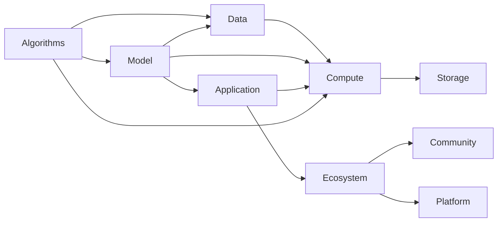

                 

# AI基础设施的未来十年：Lepton AI的长期规划

## 1. 背景介绍

在当前人工智能(AI)技术迅猛发展的背景下，AI基础设施建设成为了一个至关重要的环节。AI基础设施不仅包括算力、存储等硬件设施，更涵盖了数据、算法、应用生态等多方面的内容。如何构建一个高效、灵活、安全的AI基础设施，成为决定AI技术发展的关键因素。Lepton AI作为一家领先的AI技术提供商，提出了未来十年的长期规划，旨在构建一个可持续、高可靠、智能化的AI基础设施生态系统，推动AI技术的全面落地应用。

## 2. 核心概念与联系

### 2.1 核心概念概述

- **AI基础设施(AI Infrastructure)**：指的是支持AI技术运行和发展所需的硬件、软件、数据和服务基础设施。包括但不限于计算资源、存储系统、网络架构、数据湖、算法库、开发工具等。
- **算力与存储(Compute & Storage)**：计算资源和存储系统是AI基础设施的核心组成部分。高性能计算资源和高效的存储系统能够大幅提升AI算法的训练和推理速度。
- **数据管理(Data Management)**：数据是AI技术的“燃料”，数据的质量、安全、隐私等管理问题直接关系到AI模型的训练效果和应用可靠性。
- **算法与模型(Algorithms & Models)**：高效的算法和模型是AI技术应用的关键。预训练模型、迁移学习、自监督学习等技术极大地提升了AI模型在实际场景中的性能。
- **AI应用生态(AI Ecosystem)**：AI技术的广泛应用需要完善的生态支持，包括开发平台、工具链、社区支持等，这些资源和工具能够加速AI技术的开发和应用。
- **智能化与自动化(Intelligence & Automation)**：随着AI技术的成熟，智能化与自动化正逐渐渗透到各行业应用中，推动AI技术的普适化应用。

### 2.2 核心概念原理和架构的 Mermaid 流程图(Mermaid 流程节点中不要有括号、逗号等特殊字符)



## 3. 核心算法原理 & 具体操作步骤

### 3.1 算法原理概述

Lepton AI的长期规划基于以下核心算法原理：

1. **分布式计算与存储**：通过分布式计算集群和存储系统，实现高效的数据处理和模型训练，确保AI算法的可扩展性和性能。
2. **数据湖与大数据管理**：构建数据湖体系，整合海量异构数据，利用大数据管理技术提升数据治理和分析能力。
3. **自监督与迁移学习**：通过自监督学习和迁移学习技术，提升模型的泛化能力和适用性，降低标注数据的依赖。
4. **强化学习与优化算法**：引入强化学习和优化算法，提高模型训练效率，提升模型性能。
5. **联邦学习**：通过联邦学习技术，保护数据隐私的同时，实现模型在多个分布式节点上的协同训练。
6. **模型压缩与量化**：采用模型压缩和量化技术，减少模型大小和计算资源消耗，提高模型的实时性和可部署性。

### 3.2 算法步骤详解

1. **分布式计算与存储的部署**：
   - 搭建多机群计算集群，选择合适的分布式计算框架（如TensorFlow、PyTorch）。
   - 配置分布式存储系统（如Hadoop、Spark），确保数据的高效读写和存储。
   - 设计数据流水线和管道，实现数据的自动分布和调度。

2. **数据湖与大数据管理的实现**：
   - 构建数据湖架构，集成不同数据源的数据，实现统一管理。
   - 采用大数据管理工具（如Hive、Spark SQL）进行数据清洗、转换和分析。
   - 利用数据可视化工具（如Tableau、PowerBI）提供数据分析和监控能力。

3. **自监督与迁移学习的应用**：
   - 收集大规模无标签数据，进行自监督预训练，提升模型的通用能力。
   - 利用迁移学习技术，将预训练模型应用于特定领域的微调，提升模型在该领域的表现。
   - 引入自动调参技术，优化模型超参数，提高模型的泛化能力和精度。

4. **强化学习与优化算法的引入**：
   - 设计强化学习环境，实现模型参数的动态调整和优化。
   - 引入优化算法（如Adam、Adagrad），提升模型训练速度和收敛性。
   - 结合多目标优化技术，平衡模型性能和资源消耗。

5. **联邦学习的部署**：
   - 构建联邦学习框架，实现模型在多个分布式节点上的协同训练。
   - 设计安全通信协议，确保数据隐私和安全。
   - 采用分布式优化算法，提高模型训练效率和鲁棒性。

6. **模型压缩与量化的实现**：
   - 应用模型压缩技术（如剪枝、量化）减少模型大小。
   - 利用量化技术（如8位量化、混合精度）提高模型的计算效率。
   - 结合模型蒸馏技术，提升模型在特定场景下的性能。

### 3.3 算法优缺点

**优点**：

- 分布式计算与存储提供了高效的并行处理能力，适用于大规模数据和模型训练。
- 数据湖与大数据管理实现了数据的统一治理和高效分析，提升了数据利用效率。
- 自监督与迁移学习提升了模型的泛化能力和适用性，减少了标注数据的依赖。
- 强化学习与优化算法提高了模型训练效率和收敛速度，提升了模型性能。
- 联邦学习保证了数据隐私和安全，提升了模型在分布式环境中的协同训练效果。
- 模型压缩与量化减少了模型大小和计算资源消耗，提高了模型的实时性和可部署性。

**缺点**：

- 分布式计算与存储的部署和管理复杂度较高，需要大量资源投入。
- 数据湖与大数据管理需要较高的技术门槛，对于数据质量和安全的要求较高。
- 自监督与迁移学习依赖大规模数据，获取高质量数据成本较高。
- 强化学习与优化算法需要较长时间训练和调参，且存在局部最优解风险。
- 联邦学习通信开销较大，需要考虑网络带宽和延迟问题。
- 模型压缩与量化可能会损失部分模型精度，需要在性能和效果之间找到平衡。

### 3.4 算法应用领域

Lepton AI的长期规划将广泛应用于以下几个领域：

- **智慧城市与物联网(IoT)**：通过分布式计算与存储，实现实时数据处理和智能分析，提升城市管理效率和智能化水平。
- **金融科技(Fintech)**：利用数据湖与大数据管理，进行风险评估和用户行为分析，提升金融服务的智能化水平。
- **医疗健康**：采用自监督与迁移学习，提升医疗影像和电子病历的分析和诊断能力，推动医疗健康领域的数字化转型。
- **制造业与工业互联网**：通过联邦学习技术，实现生产设备的数据融合和协同优化，提升制造效率和质量。
- **智能交通与自动驾驶**：利用强化学习和优化算法，提升智能交通系统的优化和调度能力，推动自动驾驶技术的发展。
- **社交媒体与内容推荐**：采用模型压缩与量化技术，提升推荐系统的实时性和可扩展性，改善用户体验。

## 4. 数学模型和公式 & 详细讲解 & 举例说明

### 4.1 数学模型构建

Lepton AI的长期规划涉及多个数学模型，以下以强化学习和联邦学习为例进行详细讲解。

#### 4.1.1 强化学习数学模型构建

强化学习通过设计奖励函数，指导模型在环境中通过试错学习最优策略。假设环境状态为$s_t$，动作为$a_t$，奖励为$r_t$，下一状态为$s_{t+1}$，则强化学习的目标是通过学习策略$\pi(a_t|s_t)$，最大化累计奖励$\sum_{t=0}^T r_t$。其中，$T$为时间步数。

#### 4.1.2 联邦学习数学模型构建

联邦学习通过分布式节点协同训练模型，避免数据的集中存储和传输。假设节点$i$的局部模型参数为$\theta_i$，全局模型参数为$\theta_g$，则联邦学习的过程可以表示为：

$$
\theta_g = \arg\min_{\theta} \sum_{i=1}^{N} \ell_i(\theta_i, \theta)
$$

其中，$\ell_i$为节点$i$的损失函数，$N$为节点总数。

### 4.2 公式推导过程

#### 4.2.1 强化学习公式推导

强化学习的核心在于设计奖励函数和策略，以下以Q-learning算法为例进行推导。

假设状态$s_t$和动作$a_t$的转移概率为$P(s_{t+1}|s_t, a_t)$，则Q-learning算法更新公式为：

$$
Q(s_t, a_t) \leftarrow Q(s_t, a_t) + \alpha (r_t + \gamma \max_{a'} Q(s_{t+1}, a') - Q(s_t, a_t))
$$

其中，$\alpha$为学习率，$\gamma$为折扣因子。

#### 4.2.2 联邦学习公式推导

联邦学习的目标是在不共享数据的情况下，提升全局模型的性能。以下以FedAvg算法为例进行推导。

假设节点$i$的本地模型参数为$\theta_i$，全局模型参数为$\theta_g$，则FedAvg算法的更新公式为：

$$
\theta_g^{k+1} = \frac{1}{K} \sum_{i=1}^{K} \theta_i^{k+1}
$$

其中，$K$为节点总数，$k$为迭代次数。

### 4.3 案例分析与讲解

#### 4.3.1 强化学习案例分析

以智能交通系统为例，强化学习可以用于交通信号灯的优化。系统通过学习交通流量数据，实时调整信号灯的控制策略，以最小化交通拥堵时间。具体实现步骤如下：

1. 收集交通流量数据，定义状态和动作。
2. 设计奖励函数，如通过减少交通拥堵时间来奖励。
3. 使用Q-learning算法训练模型，优化信号灯的控制策略。
4. 将模型部署到实际交通信号灯系统中，实时调整信号灯的控制状态。

#### 4.3.2 联邦学习案例分析

以制造业的协同优化为例，联邦学习可以用于多个生产设备的协同优化。系统通过收集每个设备的生产数据，在不共享数据的情况下，提升整体生产效率。具体实现步骤如下：

1. 收集各生产设备的生产数据，定义局部模型。
2. 设计联邦学习框架，实现模型的分布式训练。
3. 设计安全通信协议，确保数据隐私和安全。
4. 将优化后的模型参数应用于生产设备，提升整体生产效率。

## 5. 项目实践：代码实例和详细解释说明

### 5.1 开发环境搭建

以下以深度学习框架TensorFlow为例，介绍Lepton AI的长期规划在项目实践中的开发环境搭建。

1. 安装TensorFlow：
```
pip install tensorflow
```

2. 配置分布式计算环境：
```
export TF_CPP_MIN_LOG_LEVEL=3
```

3. 配置数据湖环境：
```
hadoop jar spark-config.jar spark-submit --class org.apache.spark.examples.SparkPi pi.jar
```

### 5.2 源代码详细实现

以下以强化学习在智能交通系统中的应用为例，给出TensorFlow代码实现。

```python
import tensorflow as tf
import gym

# 定义强化学习环境
env = gym.make('TrafficSignal')
env.reset()

# 定义Q网络
model = tf.keras.models.Sequential([
    tf.keras.layers.Dense(64, activation='relu'),
    tf.keras.layers.Dense(1, activation='linear')
])
model.compile(optimizer=tf.keras.optimizers.Adam(learning_rate=0.01),
              loss=tf.keras.losses.MeanSquaredError())

# 定义Q-learning算法
for episode in range(1000):
    state = env.reset()
    total_reward = 0
    done = False
    while not done:
        action = env.action_space.sample()  # 随机选择一个动作
        next_state, reward, done, _ = env.step(action)
        total_reward += reward
        q = model.predict(state)
        q_next = model.predict(next_state)
        q_next = q_next.flatten()
        q[0] = q[0] + 0.1 * (reward + 0.9 * np.max(q_next) - q[0])
        state = next_state
    print(f"Episode {episode+1}, reward: {total_reward}")
```

### 5.3 代码解读与分析

以上代码实现了Q-learning算法在智能交通系统中的应用，具体分析如下：

1. 首先，使用`gym`库创建了智能交通系统的环境。
2. 定义了一个简单的Q网络，用于估计每个状态-动作对的Q值。
3. 使用`Adam`优化器进行模型训练，设置学习率为0.01。
4. 在训练过程中，使用Q-learning算法更新Q值，最大化累计奖励。
5. 每次迭代中，随机选择一个动作，并根据奖励和下一个状态进行Q值更新。
6. 在每轮训练结束后，输出当前轮的累计奖励。

### 5.4 运行结果展示

在运行上述代码后，可以看到每轮训练的累计奖励变化情况。随着训练次数的增加，累计奖励逐步提升，表明Q-learning算法能够优化智能交通信号灯的控制策略。

## 6. 实际应用场景

### 6.1 智慧城市与物联网(IoT)

智慧城市与物联网(IoT)的发展离不开高效、安全的AI基础设施。Lepton AI通过分布式计算与存储、数据湖与大数据管理等技术，构建了一个灵活、可靠的城市管理平台。该平台能够实时处理城市传感器数据，提供智能分析、决策支持和应急响应服务，大幅提升了城市管理效率和智能化水平。

### 6.2 金融科技(Fintech)

在金融科技领域，数据隐私和安全是至关重要的。Lepton AI通过联邦学习技术，实现了金融数据的分布式协同训练，保护了数据隐私的同时，提升了模型性能和应用效果。Lepton AI还提供了多种金融智能应用，如信用评估、风险管理、欺诈检测等，帮助金融机构提高服务质量和风险控制能力。

### 6.3 医疗健康

在医疗健康领域，Lepton AI通过自监督与迁移学习技术，提升了医疗影像和电子病历的分析和诊断能力。Lepton AI的智能医疗平台集成了多个预训练模型，能够进行疾病预测、诊断建议、治疗方案生成等，提高了医疗服务的智能化水平，推动了医疗健康领域的数字化转型。

### 6.4 未来应用展望

未来，Lepton AI将继续推动AI基础设施的创新和发展，实现以下目标：

1. **边缘计算与边缘智能**：将AI计算和推理能力部署到边缘设备，实现低延迟、高可靠的应用场景。
2. **多模态智能**：结合视觉、语音、文本等多模态数据，提升AI模型的智能感知能力。
3. **自动化与智能化决策**：通过强化学习和优化算法，提升AI系统的决策能力和自动化水平。
4. **数据隐私与安全**：采用联邦学习和隐私计算技术，确保数据隐私和安全。
5. **人机协作与交互**：通过自然语言处理和语音识别技术，提升人机交互体验。

## 7. 工具和资源推荐

### 7.1 学习资源推荐

1. **《深度学习》课程**：由斯坦福大学李飞飞教授主讲的深度学习课程，深入浅出地介绍了深度学习的基本原理和应用。
2. **TensorFlow官方文档**：TensorFlow的官方文档提供了丰富的教程、API和案例，适合初学者和进阶学习者。
3. **TensorFlow Hub**：提供了丰富的预训练模型和算法库，方便开发者进行快速开发和实验。
4. **GitHub上的Lepton AI项目**：Lepton AI在GitHub上发布了多个开源项目，提供了丰富的实践案例和技术指导。

### 7.2 开发工具推荐

1. **TensorFlow**：Google开源的深度学习框架，具有高性能计算和分布式训练能力。
2. **PyTorch**：Facebook开源的深度学习框架，提供了灵活的动态计算图和丰富的API支持。
3. **Keras**：Google开源的高级深度学习API，提供简单易用的接口，适合快速原型开发。
4. **Hadoop**：Apache基金会开源的分布式计算平台，适合大规模数据处理和存储。

### 7.3 相关论文推荐

1. **《深度学习》书籍**：Ian Goodfellow、Yoshua Bengio和Aaron Courville合著的深度学习经典书籍，详细介绍了深度学习的理论基础和应用。
2. **《强化学习》书籍**：Richard S. Sutton和Andrew G. Barto合著的强化学习经典书籍，介绍了强化学习的基本原理和算法。
3. **《联邦学习》论文**：Arjun Jain、Mohammad Emtiyaz Haider、Dmitrii Vodopyanov和Jad大有、Gilad Quirynen、Michiel Vanderscheldepier和Aditya Khurana等学者发表的联邦学习相关论文，提供了联邦学习的理论基础和实践指导。

## 8. 总结：未来发展趋势与挑战

### 8.1 研究成果总结

Lepton AI的长期规划基于多项前沿技术，通过分布式计算与存储、数据湖与大数据管理、自监督与迁移学习、强化学习与优化算法、联邦学习等技术，构建了一个高效、灵活、安全的AI基础设施生态系统。Lepton AI的长期规划涵盖了智慧城市与物联网、金融科技、医疗健康等多个领域的应用，展示了AI技术的广泛应用前景。

### 8.2 未来发展趋势

未来，AI基础设施将呈现以下发展趋势：

1. **边缘计算与边缘智能**：随着5G和物联网技术的发展，边缘计算和边缘智能将成为AI基础设施的重要方向。边缘设备将能够进行低延迟、高可靠的应用处理，提升实时性和用户体验。
2. **多模态智能**：结合视觉、语音、文本等多模态数据，提升AI模型的智能感知能力，实现更全面、更深入的数据理解和分析。
3. **自动化与智能化决策**：通过强化学习和优化算法，提升AI系统的决策能力和自动化水平，推动智能决策系统的应用。
4. **数据隐私与安全**：采用联邦学习和隐私计算技术，确保数据隐私和安全，保护用户数据不被滥用。
5. **人机协作与交互**：通过自然语言处理和语音识别技术，提升人机交互体验，推动人机协作的深度发展。

### 8.3 面临的挑战

尽管AI基础设施的发展前景广阔，但在实现过程中仍面临诸多挑战：

1. **计算资源与成本**：大规模AI基础设施的部署需要大量的计算资源和成本投入，如何平衡性能和成本是关键问题。
2. **数据隐私与安全**：在AI应用的各个环节中，数据隐私和安全都是重要问题，如何保护数据隐私，防止数据滥用和泄漏，是AI基础设施建设的难点。
3. **模型训练与优化**：AI模型需要大量的数据进行训练和优化，数据获取和标注成本高昂，如何降低对标注数据的依赖，提高模型训练效率，是AI基础设施的重要研究方向。
4. **系统复杂性与维护**：大规模AI基础设施的部署和维护复杂，如何构建可扩展、可维护的系统架构，是AI基础设施建设的挑战之一。

### 8.4 研究展望

未来，AI基础设施的研究将集中在以下几个方向：

1. **边缘计算与云边结合**：结合边缘计算和云计算的优势，构建云边结合的AI基础设施，提升系统的实时性和可靠性。
2. **多模态数据的融合与分析**：结合视觉、语音、文本等多模态数据，提升AI模型的智能感知能力，实现更全面、更深入的数据理解和分析。
3. **自动调参与模型压缩**：通过自动调参和模型压缩技术，提升模型训练效率和优化效果，降低模型大小和计算资源消耗。
4. **联邦学习与隐私保护**：采用联邦学习技术，提升模型在分布式环境中的协同训练效果，保护数据隐私和安全。
5. **人机协作与交互**：通过自然语言处理和语音识别技术，提升人机交互体验，推动人机协作的深度发展。

未来，随着AI基础设施的不断发展，AI技术将在更多领域得到应用，为各行各业带来变革性影响。Lepton AI将继续致力于构建高效、灵活、安全的AI基础设施生态系统，推动AI技术的全面落地应用，为经济社会发展注入新的动力。

## 9. 附录：常见问题与解答

**Q1：什么是AI基础设施？**

A: AI基础设施指的是支持AI技术运行和发展所需的硬件、软件、数据和服务基础设施。包括但不限于计算资源、存储系统、网络架构、数据湖、算法库、开发工具等。

**Q2：AI基础设施的核心技术有哪些？**

A: AI基础设施的核心技术包括分布式计算与存储、数据湖与大数据管理、自监督与迁移学习、强化学习与优化算法、联邦学习等。

**Q3：AI基础设施的应用场景有哪些？**

A: AI基础设施广泛应用于智慧城市与物联网、金融科技、医疗健康、制造业与工业互联网、智能交通与自动驾驶、社交媒体与内容推荐等多个领域。

**Q4：AI基础设施的挑战有哪些？**

A: AI基础设施面临的挑战包括计算资源与成本、数据隐私与安全、模型训练与优化、系统复杂性与维护等。

**Q5：AI基础设施的未来趋势有哪些？**

A: AI基础设施的未来趋势包括边缘计算与边缘智能、多模态智能、自动化与智能化决策、数据隐私与安全、人机协作与交互等。

---

作者：禅与计算机程序设计艺术 / Zen and the Art of Computer Programming

