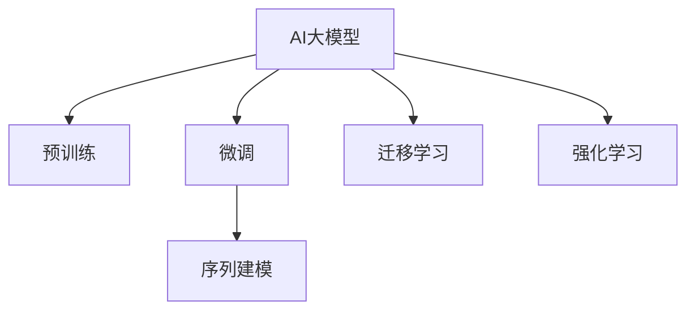

                 

# AI大模型在电商平台价格预测中的作用

## 1. 背景介绍

在当今数字化时代，电商平台已成为消费者购物的重要渠道，价格预测作为电商平台的核心功能之一，直接影响着消费者的购物决策和商家的定价策略。准确的商品价格预测，不仅能帮助消费者做出更明智的购买选择，还能帮助商家进行库存管理和精准营销。然而，传统的价格预测方法存在数据依赖性强、计算复杂度高、泛化能力弱等问题，难以满足电商平台的实时性和个性化需求。

近年来，随着深度学习和大数据技术的发展，人工智能（AI）大模型在电商平台价格预测中的应用日益广泛。AI大模型通过在海量数据上进行预训练，能够学习到商品价格变化的潜在规律，进而进行精准预测。本文将详细探讨AI大模型在电商平台价格预测中的作用，包括模型原理、算法步骤、优化方法及实际应用案例。

## 2. 核心概念与联系

### 2.1 核心概念概述

为更好地理解AI大模型在电商平台价格预测中的应用，本节将介绍几个关键概念：

- **AI大模型**：指基于深度学习架构（如Transformer、BERT等），通过大规模预训练学习到通用语言或图像表示的模型。常用的AI大模型有GPT、BERT、ViT等。
- **预训练**：指在大量无标签数据上训练模型，学习到通用的语言或图像表示。预训练使得模型能够捕捉到数据中的普遍规律。
- **微调**：指在预训练模型基础上，通过标注数据进行有监督学习，调整模型参数以适应特定任务。
- **迁移学习**：指将预训练模型在不同任务间进行知识迁移，通过微调使模型在特定任务上表现更好。
- **强化学习**：指模型通过与环境互动，根据奖惩机制优化参数，以实现特定目标。
- **序列建模**：指对时间序列数据进行建模，预测未来趋势。

这些核心概念之间的关系可以通过以下Mermaid流程图来展示：



## 3. 核心算法原理 & 具体操作步骤

### 3.1 算法原理概述

基于AI大模型的电商平台价格预测，核心思想是利用大模型的预训练特征进行序列建模，通过微调或迁移学习来适应电商平台的特定需求。其数学模型一般建立在时间序列数据上，目标是预测未来的价格变化。具体来说，假设有历史价格数据 $\{x_t\}_{t=1}^T$，目标是对未来的价格 $x_{t+1}$ 进行预测。

模型通常采用循环神经网络（RNN）、长短期记忆网络（LSTM）或门控循环单元（GRU）等序列模型。在预测过程中，模型将历史价格数据输入到模型中，通过记忆细胞和门控机制捕捉价格变化的规律，最终输出未来的价格预测值。

### 3.2 算法步骤详解

#### 3.2.1 数据预处理

价格预测的数据通常包括时间序列数据和特征数据。时间序列数据需要按照时间顺序进行排序，并转化为模型所需的格式。特征数据包括商品描述、价格变动历史、节假日、促销活动等，需要进行数据清洗和标准化处理。

#### 3.2.2 模型训练

选择合适的序列模型，使用历史价格数据进行训练。训练过程一般包括以下步骤：

1. 划分训练集和验证集。
2. 使用预训练的大模型或自建模型进行训练，调整模型参数以最小化损失函数。
3. 在验证集上评估模型性能，调整超参数，避免过拟合。
4. 使用优化算法（如Adam、SGD等）更新模型参数。

#### 3.2.3 模型微调

在电商平台上进行价格预测时，数据和任务可能与预训练数据存在较大差异。因此，模型需要进行微调以适应特定任务。微调过程一般包括以下步骤：

1. 选择合适的预训练模型。
2. 定义模型架构，包括输入层、隐藏层、输出层等。
3. 设计损失函数，如均方误差（MSE）、平均绝对误差（MAE）等。
4. 使用少量标注数据进行有监督学习，调整模型参数。
5. 在验证集上评估微调效果，调整超参数。

### 3.3 算法优缺点

基于AI大模型的电商平台价格预测方法具有以下优点：

- 能够捕捉到价格变化的复杂规律，预测精度高。
- 能够适应电商平台的实时性和个性化需求。
- 能够利用历史数据进行模型训练，提高预测的准确性。

同时，该方法也存在一些缺点：

- 对数据质量和标注数据的需求较高。
- 模型复杂度高，计算成本大。
- 对数据分布变化敏感，泛化能力有待提高。

### 3.4 算法应用领域

AI大模型在电商平台价格预测中的应用领域非常广泛，涵盖以下几个方面：

- **商品价格预测**：对商品在未来一段时间内的价格进行预测，帮助商家制定合理的定价策略。
- **库存管理**：根据历史销售数据和价格预测，优化库存水平，避免缺货或库存积压。
- **促销活动优化**：预测促销活动对商品价格的影响，制定最佳的促销策略。
- **个性化推荐**：结合用户行为和价格预测，推荐价格合适的商品，提高用户体验。

## 4. 数学模型和公式 & 详细讲解 & 举例说明

### 4.1 数学模型构建

价格预测问题可以建模为一个时间序列预测问题。假设时间序列数据为 $\{x_t\}_{t=1}^T$，模型目标为预测未来的价格值 $x_{t+1}$。一种常用的数学模型为LSTM模型，其数学形式如下：

$$
x_{t+1} = f(\{x_t, \theta\})
$$

其中，$f$ 为LSTM模型，$\theta$ 为模型参数。LSTM模型的核心是记忆细胞和门控机制，能够捕捉时间序列数据的长期依赖关系。

### 4.2 公式推导过程

LSTM模型的核心公式可以表示为：

$$
h_t = \tanh(W_hx_t + U_hh_{t-1} + b_h)
$$

$$
i_t = \sigma(W_ih_{t-1} + U_ix_t + b_i)
$$

$$
f_t = \sigma(W_fh_{t-1} + U_fx_t + b_f)
$$

$$
o_t = \sigma(W_oh_{t-1} + U_ox_t + b_o)
$$

$$
c_t = f_t \odot c_{t-1} + i_t \odot \tanh(h_t)
$$

$$
h_t = o_t \odot \tanh(c_t)
$$

其中，$h_t$ 为记忆细胞，$c_t$ 为细胞状态，$i_t$、$f_t$ 和 $o_t$ 为门控机制。权重矩阵 $W_h$、$U_h$、$W_i$、$U_i$、$W_f$、$U_f$、$W_o$、$U_o$ 和偏置项 $b_h$、$b_i$、$b_f$、$b_o$ 需要训练得到。

### 4.3 案例分析与讲解

以某电商平台销售数据为例，假设要预测某商品在未来一周的价格变化。模型首先使用LSTM模型对历史价格数据进行建模，得到价格变化趋势。然后，模型根据历史价格和促销活动等特征数据，通过微调对价格预测模型进行调整，以提高预测的准确性。最后，模型在测试集上评估预测结果，并进行误差分析，优化模型参数。

## 5. 项目实践：代码实例和详细解释说明

### 5.1 开发环境搭建

1. **安装Python和相关库**：
   - 安装Python 3.x
   - 安装TensorFlow、Keras等深度学习库
   - 安装Pandas、Numpy等数据处理库

2. **环境配置**：
   - 设置虚拟环境
   - 安装相关依赖包

### 5.2 源代码详细实现

以下是一个简单的LSTM模型实现代码示例：

```python
import tensorflow as tf
from tensorflow.keras.layers import LSTM, Dense
from tensorflow.keras.models import Sequential

# 定义LSTM模型
model = Sequential()
model.add(LSTM(64, input_shape=(None, 1)))
model.add(Dense(1))

# 编译模型
model.compile(optimizer='adam', loss='mse')

# 训练模型
model.fit(X_train, y_train, epochs=100, validation_data=(X_val, y_val))
```

其中，`X_train` 和 `y_train` 为训练数据和标签，`X_val` 和 `y_val` 为验证数据和标签。

### 5.3 代码解读与分析

代码中，首先定义了一个包含一个LSTM层和一个Dense层的神经网络模型。LSTM层的输出维度为64，输入数据的形状为 `(None, 1)`，即序列长度可变。Dense层只有一个神经元，输出预测结果。模型使用Adam优化器和均方误差损失函数进行编译。在训练过程中，模型通过反向传播更新参数，最小化损失函数。最后，模型在验证集上评估预测结果。

### 5.4 运行结果展示

```python
import numpy as np

# 预测未来一周的价格变化
X_test = np.random.rand(7, 1)
y_pred = model.predict(X_test)
print(y_pred)
```

运行结果为模型对未来一周价格变化的预测值。

## 6. 实际应用场景

### 6.1 智能库存管理

基于AI大模型的价格预测技术，可以用于智能库存管理。商家可以根据预测结果，提前调整库存水平，避免因缺货或库存积压导致的损失。例如，当预测到某商品在未来一周价格将大幅上涨时，商家可以增加该商品的库存量，以满足市场需求。

### 6.2 个性化推荐

AI大模型能够根据用户行为和价格预测，推荐价格合适的商品，提高用户购物体验。例如，当用户搜索某商品时，模型可以根据价格预测结果，推荐同类别中价格更合适的替代商品。

### 6.3 促销活动优化

商家可以根据价格预测结果，优化促销活动策略。例如，当预测到某商品在未来一周价格将大幅下降时，商家可以提前进行促销活动，吸引更多的消费者购买。

### 6.4 未来应用展望

未来，随着AI大模型和深度学习技术的不断发展，电商平台价格预测将进一步提升其精度和实时性。深度学习模型将与大数据、云计算等技术结合，构建更加智能化的价格预测系统。

## 7. 工具和资源推荐

### 7.1 学习资源推荐

- **深度学习与数据挖掘**：吴恩达、李沐等深度学习专家授课的视频和书籍。
- **TensorFlow官方文档**：TensorFlow官方提供的详细教程和文档。
- **Keras官方文档**：Keras官方提供的详细教程和文档。

### 7.2 开发工具推荐

- **TensorFlow**：谷歌开发的深度学习框架，支持分布式计算和GPU加速。
- **Keras**：基于TensorFlow的高级API，易于上手，适合快速开发。
- **Jupyter Notebook**：免费的交互式开发环境，支持多种编程语言和库。

### 7.3 相关论文推荐

- **LSTM网络**：Hochreiter et al., "Long Short-Term Memory"，1997
- **序列建模**：Bengio et al., "Learning Phrase Representations using RNN Encoder-Decoder for Statistical Machine Translation"，2016
- **深度学习在电商平台中的应用**：Hinton et al., "Deep Learning"，2012

## 8. 总结：未来发展趋势与挑战

### 8.1 总结

本文详细探讨了AI大模型在电商平台价格预测中的应用。首先，介绍了AI大模型、预训练、微调、迁移学习等核心概念及其在电商平台价格预测中的应用。其次，介绍了基于LSTM模型的价格预测方法，包括数据预处理、模型训练、微调等具体操作步骤。最后，分析了AI大模型在电商平台价格预测中的实际应用场景，并展望了未来的发展趋势。

通过本文的介绍，可以看出，AI大模型在电商平台价格预测中具有广泛的应用前景，能够显著提高价格预测的准确性和实时性。未来，随着AI大模型的不断进步，电商平台价格预测将更加精准和智能化。

### 8.2 未来发展趋势

未来，AI大模型在电商平台价格预测领域的发展趋势如下：

- **模型复杂度提升**：随着模型架构的改进和计算资源的增加，AI大模型的复杂度将不断提升，预测精度和实时性将进一步提高。
- **数据多样化**：电商平台将收集更多的数据，包括用户行为、促销活动、社交媒体等，以提供更准确的价格预测。
- **跨领域应用**：AI大模型将与大数据、云计算等技术结合，构建更加智能化的价格预测系统，应用于更多领域。
- **实时化**：电商平台将构建实时价格预测系统，根据实时数据进行动态调整，满足用户实时需求。

### 8.3 面临的挑战

尽管AI大模型在电商平台价格预测中已经取得显著进展，但仍面临以下挑战：

- **数据隐私和安全**：电商平台的交易数据涉及用户隐私，如何保障数据安全是一个重要问题。
- **模型泛化能力**：AI大模型在特定领域的应用效果较好，但在跨领域和数据分布变化较大时，泛化能力有待提高。
- **计算资源消耗**：AI大模型的计算资源消耗较大，如何优化模型架构和计算效率，降低计算成本，是未来的研究方向。
- **模型可解释性**：AI大模型的决策过程往往难以解释，如何在保证预测精度的同时，提高模型的可解释性，也是一个重要问题。

### 8.4 研究展望

未来的研究需要在以下几个方面取得突破：

- **模型隐私保护**：研究如何在保障数据隐私的前提下，进行价格预测和用户行为分析。
- **跨领域迁移学习**：研究如何将AI大模型的知识迁移到不同的领域，提高跨领域泛化能力。
- **模型优化**：研究如何优化AI大模型的架构和计算效率，降低计算成本。
- **模型可解释性**：研究如何提高AI大模型的可解释性，使其决策过程更加透明和可理解。

## 9. 附录：常见问题与解答

**Q1：电商平台的价格预测是否可以采用传统统计方法？**

A: 电商平台的价格预测通常涉及大量非线性、非平稳时间序列数据，传统统计方法可能无法很好地捕捉到数据的复杂规律。因此，基于AI大模型的深度学习方法更适用于电商平台价格预测。

**Q2：电商平台的实时价格预测是否需要高性能计算资源？**

A: 电商平台的实时价格预测确实需要高性能计算资源，以保证模型的响应速度和精度。一般需要高性能GPU或TPU设备，以及分布式计算框架。

**Q3：如何保证电商平台的交易数据安全？**

A: 电商平台可以通过数据加密、访问控制等措施，保障交易数据的安全。同时，模型训练和推理过程需要在安全的环境中进行，避免数据泄露。

**Q4：电商平台的价格预测是否可以结合用户行为分析？**

A: 电商平台的价格预测可以结合用户行为分析，通过分析用户的历史购买记录、浏览行为、搜索记录等，提高价格预测的准确性。

**Q5：如何评估价格预测模型的效果？**

A: 价格预测模型的评估指标包括均方误差（MSE）、平均绝对误差（MAE）、对称平均绝对百分比误差（SMAPE）等。模型效果评估需要结合实际应用场景和具体需求进行。

---

作者：禅与计算机程序设计艺术 / Zen and the Art of Computer Programming

