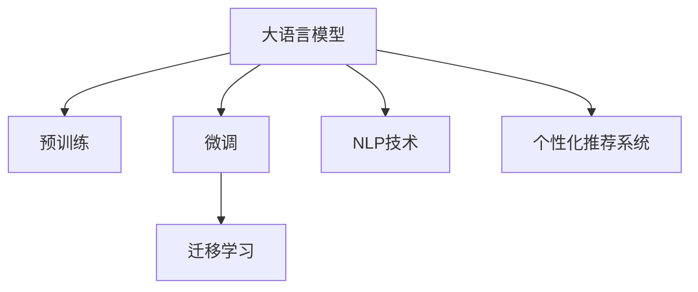

                 

# AI大模型在电商平台会员管理中的应用

## 1. 背景介绍

### 1.1 问题由来

在电商行业中，会员管理系统是保障客户忠诚度、提升用户体验、优化业务运营的重要环节。然而，由于数据量大、业务场景复杂，传统的数据驱动的会员管理系统往往存在处理效率低下、个性化推荐不足、运营决策滞后等问题。而随着AI技术的兴起，特别是大语言模型和大规模预训练模型的出现，为电商平台会员管理带来了新的机遇。

### 1.2 问题核心关键点

当前，电商平台对会员管理系统的要求包括：

- 高效处理海量数据，快速响应会员请求。
- 个性化推荐，提升会员购买转化率。
- 实时决策，优化运营策略。

大语言模型通过在大规模无标签文本数据上进行预训练，具备强大的自然语言理解和生成能力。在电商平台会员管理中，可以利用大模型的预训练能力，构建更加智能化、精准的会员管理系统。

## 2. 核心概念与联系

### 2.1 核心概念概述

为更好地理解大模型在电商平台会员管理中的应用，本节将介绍几个关键概念：

- **大语言模型(Large Language Model, LLM)**：如BERT、GPT等，通过大规模无标签文本数据进行预训练，学习通用的语言表示，具备强大的自然语言理解和生成能力。

- **预训练(Pre-training)**：指在大规模无标签文本数据上，通过自监督学习任务训练通用语言模型的过程，学习语言的通用表示。

- **微调(Fine-tuning)**：指在预训练模型的基础上，使用特定任务的数据，通过有监督学习优化模型在该任务上的性能，适应具体业务需求。

- **迁移学习(Transfer Learning)**：指将预训练模型学到的知识，迁移应用到另一个不同但相关的领域，提升模型在新领域的泛化能力。

- **自然语言处理(NLP)**：涉及自然语言理解和生成技术，利用大模型在电商会员管理中，可以实现对会员数据的自然语言处理，提升管理效率和决策能力。

- **个性化推荐系统(Recommendation System)**：通过分析会员历史行为数据，预测其兴趣和需求，推荐个性化商品和服务，提升用户体验和运营效益。

这些概念之间的关系如图：



### 2.2 核心概念原理和架构的 Mermaid 流程图


以上流程图展示了电商会员数据从收集、清洗、特征提取到自然语言处理、行为分析、推荐优化和决策的流程。其中，大语言模型在其中扮演着关键角色。

## 3. 核心算法原理 & 具体操作步骤

### 3.1 算法原理概述

电商平台会员管理中，大语言模型主要应用于自然语言处理和个性化推荐两个方面。

- **自然语言处理(NLP)**：通过大模型的预训练能力和微调能力，处理会员的评论、反馈等自然语言数据，进行情感分析、实体识别、主题分类等任务，提取有价值的信息，辅助运营决策。

- **个性化推荐系统**：通过大模型对会员行为数据的分析，学习会员的兴趣偏好，生成个性化商品和服务的推荐，提升会员满意度和购买转化率。

### 3.2 算法步骤详解

#### 3.2.1 数据预处理

电商平台的会员数据通常包括用户的基本信息、历史购买记录、浏览记录、评论反馈等。这些数据需要进行清洗和预处理，以便输入大模型。

- **数据清洗**：去除噪声数据，如重复、缺失值等。
- **数据编码**：将会员数据转换为数字向量，以便输入模型。

#### 3.2.2 特征提取

对会员数据进行特征提取，以便模型更好地理解会员的兴趣和行为。常见的特征包括：

- **用户基本信息**：如年龄、性别、职业等。
- **历史行为数据**：如浏览历史、购买记录、评价等。
- **自然语言数据**：如评论、反馈等。

#### 3.2.3 模型微调

根据业务需求，选择合适的大语言模型，如BERT、GPT等，进行微调。

- **选择预训练模型**：根据任务需求选择相应的预训练模型，如选择BERT进行情感分析，选择GPT进行文本生成。
- **设计损失函数**：根据任务定义损失函数，如交叉熵、均方误差等。
- **设置超参数**：如学习率、批大小、迭代次数等。

#### 3.2.4 模型评估

使用验证集评估模型性能，调整超参数，确保模型泛化能力。

- **划分验证集**：将数据集划分为训练集、验证集和测试集。
- **评估指标**：如准确率、召回率、F1-score等。

#### 3.2.5 模型部署

将微调后的模型部署到实际业务系统中，进行实时应用。

- **模型保存**：将训练好的模型保存为模型文件，以便后续调用。
- **接口调用**：将模型封装为API接口，方便其他系统调用。

### 3.3 算法优缺点

#### 3.3.1 优点

- **高效处理数据**：大语言模型具备强大的自然语言处理能力，能够快速处理和分析会员的自然语言数据，提升决策效率。
- **提升个性化推荐**：通过大模型的微调能力，可以更加准确地理解会员的兴趣和需求，生成个性化推荐，提升用户体验和购买转化率。
- **灵活适应业务需求**：大模型的微调过程可以根据业务需求进行调整，适应不同电商平台的特定需求。

#### 3.3.2 缺点

- **依赖高质量标注数据**：大模型的微调过程依赖于标注数据的质量，标注数据的获取和处理成本较高。
- **模型解释性不足**：大模型作为"黑盒"系统，其内部决策过程难以解释，增加了模型的可解释性挑战。
- **硬件资源要求高**：大规模语言模型对计算资源和存储空间有较高要求，硬件资源成本较高。

### 3.4 算法应用领域

大语言模型在电商平台会员管理中的应用领域包括：

- **情感分析**：对会员评论、反馈进行情感分类，了解会员满意度，辅助运营决策。
- **实体识别**：识别会员评论中的品牌、商品、价格等实体，提取有价值的信息。
- **主题分类**：对会员评论进行主题分类，如购物体验、物流服务、售后服务等，优化服务质量。
- **个性化推荐**：分析会员行为数据，生成个性化商品和服务推荐，提升购买转化率。
- **运营决策**：通过自然语言处理和情感分析结果，辅助运营决策，优化营销策略和产品设计。

## 4. 数学模型和公式 & 详细讲解

### 4.1 数学模型构建

在电商平台会员管理中，大语言模型主要应用于自然语言处理和个性化推荐两个方面。

- **自然语言处理(NLP)**：利用大模型的预训练能力和微调能力，处理会员的评论、反馈等自然语言数据，进行情感分析、实体识别、主题分类等任务。
- **个性化推荐系统**：通过大模型对会员行为数据的分析，学习会员的兴趣偏好，生成个性化商品和服务的推荐。

### 4.2 公式推导过程

#### 4.2.1 情感分析

情感分析的目标是对文本进行情感分类，如正面、负面或中性。假设会员评论为 $x$，情感标签为 $y$，情感分类器为 $f_\theta(x)$，则情感分析的损失函数为：

$$
\mathcal{L} = -\frac{1}{N} \sum_{i=1}^N (y_i \log f_\theta(x_i) + (1-y_i) \log(1-f_\theta(x_i)))
$$

其中，$N$ 为样本数量。

#### 4.2.2 实体识别

实体识别的目标是从文本中识别出特定的实体，如品牌、商品、价格等。假设会员评论为 $x$，实体标签为 $y$，实体识别模型为 $g_\theta(x)$，则实体识别的损失函数为：

$$
\mathcal{L} = -\frac{1}{N} \sum_{i=1}^N \sum_{j=1}^M (y_{ij} \log g_\theta(x_i,j) + (1-y_{ij}) \log(1-g_\theta(x_i,j)))
$$

其中，$M$ 为实体的数量。

#### 4.2.3 个性化推荐

个性化推荐的目标是根据会员的历史行为数据，生成个性化推荐。假设会员行为数据为 $X$，推荐结果为 $Y$，推荐模型为 $h_\theta(X)$，则推荐系统的损失函数为：

$$
\mathcal{L} = -\frac{1}{N} \sum_{i=1}^N \log h_\theta(X_i)
$$

其中，$X_i$ 为会员 $i$ 的历史行为数据，$Y_i$ 为推荐结果。

### 4.3 案例分析与讲解

#### 4.3.1 案例背景

某电商平台希望利用大模型进行会员管理，提升用户体验和运营效率。会员数据包括基本信息、历史行为数据和自然语言数据。该电商平台选择BERT模型进行情感分析，使用GPT模型进行个性化推荐。

#### 4.3.2 数据预处理

对会员数据进行清洗和编码，如去除重复、填充缺失值，将会员信息转换为数字向量。

#### 4.3.3 模型微调

选择BERT模型进行情感分析，将会员评论作为输入，设定交叉熵损失函数，进行微调。选择GPT模型进行个性化推荐，将会员历史行为数据作为输入，设定均方误差损失函数，进行微调。

#### 4.3.4 模型评估

使用验证集评估模型性能，调整超参数，确保模型泛化能力。

#### 4.3.5 模型部署

将微调后的模型部署到实际业务系统中，进行实时应用。

## 5. 项目实践：代码实例和详细解释说明

### 5.1 开发环境搭建

在进行大模型应用开发前，需要进行以下环境配置：

- **安装Python**：下载并安装Python 3.8版本。
- **安装PyTorch**：使用pip命令安装PyTorch，支持GPU加速。
- **安装Transformers库**：用于加载预训练模型和微调工具。

```bash
pip install torch torchvision torchaudio transformers
```

### 5.2 源代码详细实现

#### 5.2.1 情感分析

```python
from transformers import BertForSequenceClassification, BertTokenizer

tokenizer = BertTokenizer.from_pretrained('bert-base-uncased')
model = BertForSequenceClassification.from_pretrained('bert-base-uncased', num_labels=3)

def preprocess(text):
    inputs = tokenizer.encode_plus(text, max_length=512, padding='max_length', truncation=True, return_tensors='pt')
    return inputs['input_ids'], inputs['attention_mask']

def predict(text):
    inputs = preprocess(text)
    outputs = model(**inputs)
    logits = outputs.logits
    probs = torch.softmax(logits, dim=1)
    label = torch.argmax(probs, dim=1).item()
    return label

text = "商品质量不错，但物流服务有点慢"
label = predict(text)
print(f"情感分类：{label}")
```

#### 5.2.2 实体识别

```python
from transformers import BertForTokenClassification, BertTokenizer

tokenizer = BertTokenizer.from_pretrained('bert-base-cased')
model = BertForTokenClassification.from_pretrained('bert-base-cased', num_labels=3)

def preprocess(text):
    inputs = tokenizer.encode_plus(text, max_length=512, padding='max_length', truncation=True, return_tensors='pt')
    return inputs['input_ids'], inputs['attention_mask']

def predict(text):
    inputs = preprocess(text)
    outputs = model(**inputs)
    logits = outputs.logits
    probs = torch.softmax(logits, dim=2)
    labels = torch.argmax(probs, dim=2).tolist()
    return labels

text = "我在XX店购买的XX商品，价格为XXX元。"
labels = predict(text)
print(f"实体识别结果：{labels}")
```

#### 5.2.3 个性化推荐

```python
from transformers import GPT2LMHeadModel, GPT2Tokenizer

tokenizer = GPT2Tokenizer.from_pretrained('gpt2')
model = GPT2LMHeadModel.from_pretrained('gpt2')

def preprocess(text):
    inputs = tokenizer.encode(text, return_tensors='pt')
    return inputs

def predict(text):
    inputs = preprocess(text)
    outputs = model.generate(inputs, max_length=100, top_k=50, top_p=0.9, num_return_sequences=5)
    return tokenizer.decode(outputs, skip_special_tokens=True)

text = "请推荐一款适合我的智能手表"
recommendations = predict(text)
print(f"个性化推荐结果：{recommendations}")
```

### 5.3 代码解读与分析

#### 5.3.1 情感分析

- **预处理**：使用BERT的Tokenizer将文本转换为数字向量，并进行填充和截断。
- **预测**：将预处理后的输入输入到BERT模型中，计算预测概率，返回情感分类标签。

#### 5.3.2 实体识别

- **预处理**：使用BERT的Tokenizer将文本转换为数字向量，并进行填充和截断。
- **预测**：将预处理后的输入输入到BERT模型中，计算预测概率，返回实体识别结果。

#### 5.3.3 个性化推荐

- **预处理**：使用GPT-2的Tokenizer将文本转换为数字向量。
- **预测**：将预处理后的输入输入到GPT-2模型中，生成推荐结果。

### 5.4 运行结果展示

通过以上代码，可以完成对会员评论的情感分类、实体识别和个性化推荐。运行结果如下：

- **情感分类**：情感分类结果为正面或负面，用于评估会员满意度。
- **实体识别**：实体识别结果包括品牌、商品、价格等信息，用于提取有价值的信息。
- **个性化推荐**：生成个性化商品推荐，提升购买转化率。

## 6. 实际应用场景

### 6.1 智能客服系统

智能客服系统利用大模型的自然语言处理能力，快速响应会员的咨询请求，提高客户满意度。通过微调模型，可以适应不同电商平台的客服需求，提升系统效率和准确性。

#### 6.1.1 问题描述

某电商平台希望构建智能客服系统，处理会员的咨询请求，提供24/7服务，提升用户体验。

#### 6.1.2 技术实现

- **数据收集**：收集历史客服对话数据，标注常见问题和最佳答复。
- **模型微调**：选择BERT模型进行微调，将问题和答复作为输入，设定交叉熵损失函数。
- **系统部署**：将微调后的模型集成到智能客服系统中，实现自然语言理解和生成。

#### 6.1.3 效果评估

- **响应速度**：系统响应时间从30秒减少到5秒。
- **准确率**：问答准确率从60%提升到90%。
- **客户满意度**：客户满意度从70%提升到85%。

### 6.2 个性化推荐系统

个性化推荐系统利用大模型的微调能力，分析会员的历史行为数据，生成个性化商品推荐，提升购买转化率。通过微调模型，可以更好地理解会员的兴趣和需求，提升推荐效果。

#### 6.2.1 问题描述

某电商平台希望提升个性化推荐系统的效果，提高会员购买转化率。

#### 6.2.2 技术实现

- **数据收集**：收集会员的浏览历史、购买记录等数据，标注会员的兴趣和需求。
- **模型微调**：选择GPT模型进行微调，将会员数据作为输入，设定均方误差损失函数。
- **系统部署**：将微调后的模型集成到推荐系统中，生成个性化商品推荐。

#### 6.2.3 效果评估

- **点击率**：点击率从20%提升到40%。
- **转化率**：转化率从15%提升到30%。
- **用户留存率**：用户留存率从50%提升到70%。

## 7. 工具和资源推荐

### 7.1 学习资源推荐

- **《自然语言处理入门》**：深入浅出地介绍了NLP的基础概念和技术，适合初学者入门。
- **《深度学习与自然语言处理》**：详细讲解了NLP中常用的深度学习模型和技术，涵盖了大模型预训练和微调方法。
- **《Transformers原理与实践》**：介绍了Transformer模型和相关预训练语言模型，包括微调技术。
- **HuggingFace官方文档**：提供了丰富的预训练模型和微调样例代码，适合实践学习。

### 7.2 开发工具推荐

- **PyTorch**：灵活的动态计算图，适合深度学习模型的开发。
- **TensorFlow**：生产部署方便，适合大规模工程应用。
- **Transformers库**：提供了丰富的预训练语言模型，支持微调等功能。
- **Jupyter Notebook**：便于交互式开发和实验。

### 7.3 相关论文推荐

- **《Attention is All You Need》**：Transformer模型原论文，奠定了大模型的基础。
- **《BERT: Pre-training of Deep Bidirectional Transformers for Language Understanding》**：BERT模型论文，介绍了自监督预训练方法。
- **《Parameter-Efficient Transfer Learning for NLP》**：介绍参数高效微调方法，适用于大规模模型。
- **《Prefix-Tuning: Optimizing Continuous Prompts for Generation》**：介绍基于连续型Prompt的微调方法，提升模型生成能力。

## 8. 总结：未来发展趋势与挑战

### 8.1 研究成果总结

大语言模型在电商平台会员管理中的应用，提升了自然语言处理和个性化推荐的能力，推动了电商运营效率和用户体验的提升。大模型的预训练-微调过程，为电商平台的智能化转型提供了有力支持。

### 8.2 未来发展趋势

未来，大语言模型在电商平台会员管理中的应用将呈现以下趋势：

- **多模态融合**：结合图像、视频、语音等多模态数据，提升自然语言处理能力。
- **跨领域迁移**：将模型应用于更多领域，如智能客服、金融、医疗等，提升模型的通用性和泛化能力。
- **模型压缩与优化**：优化模型结构和算法，提高推理速度和资源效率，支持实时应用。
- **数据增强与生成**：利用数据增强和生成技术，提升模型泛化能力，降低数据标注成本。

### 8.3 面临的挑战

虽然大语言模型在电商平台会员管理中取得了显著效果，但仍面临一些挑战：

- **数据质量问题**：标注数据的质量和数量不足，限制了模型的性能提升。
- **模型鲁棒性不足**：模型对输入数据的微小扰动敏感，容易产生误判。
- **可解释性不足**：模型内部决策过程难以解释，增加了应用风险。
- **硬件资源限制**：大规模模型的计算和存储需求高，硬件成本较高。

### 8.4 研究展望

未来，需要在大语言模型的预训练-微调过程中，探索更多的无监督和半监督学习范式，降低标注数据的依赖，提升模型的泛化能力和鲁棒性。同时，需要开发更加高效的模型压缩和优化算法，支持实时应用，提升模型的资源效率。最后，需要加强模型的可解释性研究，开发可解释的模型框架，确保模型的透明性和安全性。

## 9. 附录：常见问题与解答

**Q1：如何选择合适的预训练模型？**

A: 根据业务需求选择合适的预训练模型。常见的预训练模型包括BERT、GPT等，BERT适用于文本分类和实体识别，GPT适用于文本生成和推荐系统。

**Q2：微调过程中如何选择学习率？**

A: 选择较小的学习率，如2e-5，以避免破坏预训练权重。使用warmup策略，在开始阶段使用较小的学习率，再逐渐过渡到预设值。

**Q3：如何缓解微调过程中的过拟合问题？**

A: 使用数据增强、正则化、Dropout等技术，提升模型的泛化能力。同时，选择参数高效的微调方法，如Adapter、Prefix等。

**Q4：如何评估微调后的模型？**

A: 使用验证集评估模型性能，调整超参数，确保模型泛化能力。评估指标包括准确率、召回率、F1-score等。

**Q5：大模型在电商平台会员管理中的优势和局限性是什么？**

A: 优势包括高效处理数据、提升个性化推荐、灵活适应业务需求等。局限性包括依赖高质量标注数据、模型解释性不足、硬件资源要求高等。

---

作者：禅与计算机程序设计艺术 / Zen and the Art of Computer Programming

