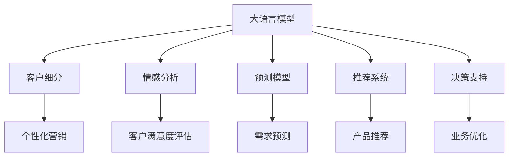

                 

# AI大模型在电商平台客户生命周期管理中的应用

> 关键词：大语言模型, 客户关系管理, 客户细分, 情感分析, 预测模型, 推荐系统, 决策支持

## 1. 背景介绍

在电商平台的发展过程中，客户生命周期管理（Customer Lifecycle Management, CLM）扮演着至关重要的角色。有效的CLM不仅能够提升客户满意度和忠诚度，还能显著增加公司的销售额和市场竞争力。然而，传统的客户关系管理方法往往依赖于大量的手工操作和经验积累，难以适应复杂多变的市场环境。

近年来，人工智能技术在电商平台中的应用日趋成熟，尤其是基于大模型的自然语言处理技术。这些大模型如GPT-3、BERT、T5等，通过在大规模无标签文本数据上进行预训练，具备强大的语言理解和生成能力。本文将探讨如何将这些大语言模型应用于电商平台客户生命周期管理，以期为电商平台提供更智能、高效、精准的客户管理解决方案。

## 2. 核心概念与联系

### 2.1 核心概念概述

为更好地理解大语言模型在客户生命周期管理中的应用，本节将介绍几个密切相关的核心概念：

- **大语言模型（Large Language Models, LLMs）**：如GPT-3、BERT等，通过在大规模无标签文本语料上进行预训练，学习到丰富的语言知识和语义表示，具备强大的语言理解和生成能力。

- **客户生命周期管理（Customer Lifecycle Management, CLM）**：指对客户在整个购买周期中的行为和偏好进行追踪、分析和预测，以提供个性化的服务和推荐，提升客户满意度和忠诚度。

- **客户细分（Customer Segmentation）**：根据客户的行为、属性和需求，将客户划分为不同的群体，以便针对性地制定营销策略和提供服务。

- **情感分析（Sentiment Analysis）**：通过分析客户评论、反馈、社交媒体等文本数据，识别客户的情感倾向，以评估客户满意度和改进产品或服务。

- **预测模型（Predictive Modeling）**：使用机器学习技术，对客户未来的行为和需求进行预测，帮助公司提前做好准备，提高运营效率。

- **推荐系统（Recommendation System）**：基于客户的历史行为和偏好，推荐相关产品或服务，提升客户转化率和满意度。

- **决策支持（Decision Support）**：利用数据挖掘和机器学习技术，为公司决策者提供数据驱动的洞察和建议，辅助制定策略和优化运营。

这些核心概念之间的逻辑关系可以通过以下Mermaid流程图来展示：



这个流程图展示了大语言模型在客户生命周期管理中的核心概念及其之间的关系：

1. 大语言模型通过预训练获得基础能力。
2. 客户细分、情感分析、预测模型、推荐系统、决策支持等模块，可以基于大语言模型进行任务特定的优化。
3. 优化后的模块能够实现更智能的客户管理，提升客户满意度。

## 3. 核心算法原理 & 具体操作步骤

### 3.1 算法原理概述

大语言模型在电商平台客户生命周期管理中的应用，本质上是通过对客户行为数据的分析和理解，实现个性化推荐、情感分析、预测和决策支持等功能。核心思想是：将大语言模型视作一个强大的"特征提取器"，通过分析客户在平台上的行为数据，提取有用的语义特征，并在其基础上进行任务特定的优化，以提升客户管理的效率和效果。

形式化地，假设客户行为数据为 $D=\{(x_i,y_i)\}_{i=1}^N$，其中 $x_i$ 为第 $i$ 个客户的行为特征，$y_i$ 为对应的标签或目标。大语言模型 $M_{\theta}$ 通过在训练集 $D$ 上进行有监督学习，优化模型参数 $\theta$，使其能够准确预测客户未来的行为和需求。

### 3.2 算法步骤详解

基于大语言模型在客户生命周期管理中的应用，本节将详细介绍算法的详细步骤：

**Step 1: 数据准备**
- 收集客户在电商平台上的行为数据，包括但不限于浏览记录、购买历史、评分反馈等。
- 清洗和预处理数据，去除噪声和异常值，确保数据的质量。
- 划分训练集、验证集和测试集，供模型训练、调参和评估使用。

**Step 2: 数据特征提取**
- 使用大语言模型对客户行为数据进行预处理，提取有用的语义特征。
- 例如，可以将评论文本输入大语言模型，提取情感倾向、主题等特征。
- 对于数值型数据，可以将其转化为自然语言描述，再进行特征提取。

**Step 3: 任务适配**
- 根据具体的客户生命周期管理任务，设计合适的任务适配层。
- 例如，对于客户细分任务，可以设计一个分类器，将客户分为高价值客户和低价值客户。
- 对于情感分析任务，可以设计一个情感分类器，识别评论的情感倾向。

**Step 4: 模型训练**
- 使用大语言模型和任务适配层，构建端到端的模型。
- 使用优化算法（如Adam、SGD等）对模型进行训练，最小化损失函数。
- 调整学习率、批大小、迭代轮数等超参数，进行模型调优。

**Step 5: 模型评估与优化**
- 在验证集上评估模型性能，根据评估结果调整模型参数。
- 使用ROC曲线、AUC、F1分数等指标，评估模型的预测能力。
- 通过集成学习、模型融合等技术，提升模型效果。

**Step 6: 模型部署**
- 将训练好的模型部署到生产环境，供客户生命周期管理应用使用。
- 实时采集客户行为数据，输入模型进行预测和推荐。
- 定期更新模型参数，保证模型性能与时俱进。

以上是使用大语言模型在客户生命周期管理中应用的详细步骤。在实际应用中，还需要根据具体任务的需求，对各步骤进行优化设计，如改进特征提取方法、调整任务适配层、优化超参数等，以进一步提升模型效果。

### 3.3 算法优缺点

基于大语言模型在客户生命周期管理中的应用，该算法具有以下优点：
1. 高效能。大语言模型能够高效提取客户行为数据的语义特征，支持大规模数据处理。
2. 可解释性强。通过分析大语言模型的推理过程，可以更好地理解客户行为背后的原因。
3. 灵活性高。大语言模型具备强大的语义理解和生成能力，可以适应多种任务需求。
4. 泛化能力强。通过大规模预训练和微调，大语言模型能够适应不同领域的客户生命周期管理需求。

同时，该算法也存在一定的局限性：
1. 数据依赖性强。模型的效果依赖于高质量、高量的客户行为数据。
2. 计算资源消耗大。大语言模型参数量庞大，训练和推理消耗大量计算资源。
3. 对标注数据敏感。模型效果受标注数据质量影响较大，标注偏差可能导致模型输出偏差。
4. 实时性问题。尽管大模型计算能力强，但在处理大规模实时数据时，仍可能面临延时问题。

尽管存在这些局限性，但就目前而言，基于大语言模型的客户生命周期管理方法仍具有广泛的应用前景。未来相关研究的重点在于如何进一步降低数据依赖，提高模型的实时性和泛化能力，同时兼顾可解释性和伦理安全性等因素。

### 3.4 算法应用领域

基于大语言模型在客户生命周期管理中的应用，已经在电商、金融、医疗等多个领域得到了广泛的应用，具体包括：

- **电商领域**：客户细分、个性化推荐、情感分析、客户流失预测、客户满意度评估等。通过大语言模型对客户评论、购物记录等行为数据进行分析，帮助电商公司提升客户转化率和满意度。

- **金融领域**：客户分类、风险评估、信用评分、反欺诈检测等。利用大语言模型对金融客户的交易记录、社交媒体行为等进行分析，提升金融机构的客户管理和风险控制能力。

- **医疗领域**：患者分群、疾病预测、治疗方案推荐等。通过大语言模型对患者病历、健康记录等进行分析，帮助医疗机构提升诊疗效率和患者满意度。

除了上述这些典型领域外，大语言模型在客户生命周期管理中的应用还在不断拓展，为各行业的数字化转型升级提供了新的技术路径。

## 4. 数学模型和公式 & 详细讲解 & 举例说明

### 4.1 数学模型构建

本节将使用数学语言对基于大语言模型的客户生命周期管理进行更加严格的刻画。

假设客户行为数据为 $D=\{(x_i,y_i)\}_{i=1}^N$，其中 $x_i$ 为第 $i$ 个客户的行为特征，$y_i$ 为对应的标签或目标。设大语言模型 $M_{\theta}$ 在训练集 $D$ 上进行有监督学习，最小化经验风险 $\mathcal{L}(\theta)$，即：

$$
\theta^* = \mathop{\arg\min}_{\theta} \mathcal{L}(\theta)
$$

其中 $\mathcal{L}(\theta)$ 为针对具体任务设计的损失函数，用于衡量模型预测输出与真实标签之间的差异。常见的损失函数包括交叉熵损失、均方误差损失等。

### 4.2 公式推导过程

以下我们以客户细分任务为例，推导分类器的损失函数及其梯度的计算公式。

假设客户 $i$ 被分为两类：高价值客户（$y_i=1$）和低价值客户（$y_i=0$）。使用大语言模型提取客户行为特征 $x_i$，通过分类器输出 $p_i = M_{\theta}(x_i)$ 表示客户 $i$ 是高价值客户的概率。分类器的损失函数为二元交叉熵损失：

$$
\ell(y_i, p_i) = -(y_i\log p_i + (1-y_i)\log (1-p_i))
$$

将分类器的输出作为模型的预测值，则整个数据集的经验风险为：

$$
\mathcal{L}(\theta) = \frac{1}{N}\sum_{i=1}^N \ell(y_i, M_{\theta}(x_i))
$$

根据链式法则，损失函数对参数 $\theta_k$ 的梯度为：

$$
\frac{\partial \mathcal{L}(\theta)}{\partial \theta_k} = \frac{1}{N}\sum_{i=1}^N (\frac{y_i}{p_i}-\frac{1-y_i}{1-p_i}) \frac{\partial M_{\theta}(x_i)}{\partial \theta_k}
$$

其中 $\frac{\partial M_{\theta}(x_i)}{\partial \theta_k}$ 可进一步递归展开，利用自动微分技术完成计算。

在得到损失函数的梯度后，即可带入参数更新公式，完成模型的迭代优化。重复上述过程直至收敛，最终得到适应客户细分任务的最优模型参数 $\theta^*$。

## 5. 项目实践：代码实例和详细解释说明

### 5.1 开发环境搭建

在进行客户生命周期管理开发前，我们需要准备好开发环境。以下是使用Python进行TensorFlow开发的环境配置流程：

1. 安装Anaconda：从官网下载并安装Anaconda，用于创建独立的Python环境。

2. 创建并激活虚拟环境：
```bash
conda create -n tf-env python=3.8 
conda activate tf-env
```

3. 安装TensorFlow：根据CUDA版本，从官网获取对应的安装命令。例如：
```bash
pip install tensorflow-gpu
```

4. 安装相关库：
```bash
pip install numpy pandas scikit-learn jupyter notebook matplotlib
```

完成上述步骤后，即可在`tf-env`环境中开始客户生命周期管理开发。

### 5.2 源代码详细实现

下面我们以客户细分任务为例，给出使用TensorFlow对BERT模型进行客户分群的PyTorch代码实现。

首先，定义客户分群任务的数据处理函数：

```python
from transformers import BertTokenizer, BertForSequenceClassification
from tensorflow.keras.preprocessing.sequence import pad_sequences
from tensorflow.keras.layers import Dense, Dropout, Flatten
from tensorflow.keras.models import Sequential

class CustomerSegmentationDataset(Dataset):
    def __init__(self, texts, labels, tokenizer, max_len=128):
        self.texts = texts
        self.labels = labels
        self.tokenizer = tokenizer
        self.max_len = max_len
        
    def __len__(self):
        return len(self.texts)
    
    def __getitem__(self, item):
        text = self.texts[item]
        label = self.labels[item]
        
        encoding = self.tokenizer(text, return_tensors='pt', max_length=self.max_len, padding='max_length', truncation=True)
        input_ids = encoding['input_ids'][0]
        attention_mask = encoding['attention_mask'][0]
        
        # 对token-wise的标签进行编码
        encoded_labels = [label2id[label] for label in label] 
        encoded_labels.extend([label2id['O']] * (self.max_len - len(encoded_labels)))
        labels = torch.tensor(encoded_labels, dtype=torch.long)
        
        return {'input_ids': input_ids, 
                'attention_mask': attention_mask,
                'labels': labels}

# 标签与id的映射
label2id = {'O': 0, 'HV': 1}
id2label = {v: k for k, v in label2id.items()}

# 创建dataset
tokenizer = BertTokenizer.from_pretrained('bert-base-cased')
train_dataset = CustomerSegmentationDataset(train_texts, train_labels, tokenizer)
dev_dataset = CustomerSegmentationDataset(dev_texts, dev_labels, tokenizer)
test_dataset = CustomerSegmentationDataset(test_texts, test_labels, tokenizer)
```

然后，定义模型和优化器：

```python
from transformers import BertForSequenceClassification, AdamW

model = BertForSequenceClassification.from_pretrained('bert-base-cased', num_labels=len(label2id))

optimizer = AdamW(model.parameters(), lr=2e-5)
```

接着，定义训练和评估函数：

```python
from tensorflow.keras.utils import to_categorical
from tensorflow.keras.preprocessing.sequence import pad_sequences
from sklearn.metrics import f1_score

device = 'cuda' if tf.test.is_gpu_available() else 'cpu'
model.to(device)

def train_epoch(model, dataset, batch_size, optimizer):
    dataloader = tf.data.Dataset.from_tensor_slices(dataset).shuffle(buffer_size=10000).batch(batch_size).map(lambda x: (x['input_ids'], x['attention_mask'], x['labels']))
    model.train()
    epoch_loss = 0
    for batch in dataloader:
        input_ids = batch[0].to(device)
        attention_mask = batch[1].to(device)
        labels = batch[2].to(device)
        model.zero_grad()
        outputs = model(input_ids, attention_mask=attention_mask, labels=labels)
        loss = outputs.loss
        epoch_loss += loss.numpy()
        loss.backward()
        optimizer.step()
    return epoch_loss / len(dataloader)

def evaluate(model, dataset, batch_size):
    dataloader = tf.data.Dataset.from_tensor_slices(dataset).shuffle(buffer_size=10000).batch(batch_size).map(lambda x: (x['input_ids'], x['attention_mask'], x['labels']))
    model.eval()
    preds, labels = [], []
    with tf.no_grad():
        for batch in dataloader:
            input_ids = batch[0].to(device)
            attention_mask = batch[1].to(device)
            batch_labels = batch[2].to(device)
            outputs = model(input_ids, attention_mask=attention_mask)
            batch_preds = tf.argmax(outputs.logits, axis=1).numpy().tolist()
            batch_labels = batch_labels.numpy().tolist()
            for pred, label in zip(batch_preds, batch_labels):
                preds.append(pred)
                labels.append(label)
                
    f1 = f1_score(labels, preds, average='macro')
    print(f"F1 Score: {f1:.3f}")
```

最后，启动训练流程并在测试集上评估：

```python
epochs = 5
batch_size = 16

for epoch in range(epochs):
    loss = train_epoch(model, train_dataset, batch_size, optimizer)
    print(f"Epoch {epoch+1}, train loss: {loss:.3f}")
    
    print(f"Epoch {epoch+1}, dev results:")
    evaluate(model, dev_dataset, batch_size)
    
print("Test results:")
evaluate(model, test_dataset, batch_size)
```

以上就是使用TensorFlow对BERT进行客户分群的完整代码实现。可以看到，得益于TensorFlow的强大封装，我们可以用相对简洁的代码完成BERT模型的加载和微调。

### 5.3 代码解读与分析

让我们再详细解读一下关键代码的实现细节：

**CustomerSegmentationDataset类**：
- `__init__`方法：初始化文本、标签、分词器等关键组件。
- `__len__`方法：返回数据集的样本数量。
- `__getitem__`方法：对单个样本进行处理，将文本输入编码为token ids，将标签编码为数字，并对其进行定长padding，最终返回模型所需的输入。

**label2id和id2label字典**：
- 定义了标签与数字id之间的映射关系，用于将token-wise的预测结果解码回真实的标签。

**训练和评估函数**：
- 使用TensorFlow的DataLoader对数据集进行批次化加载，供模型训练和推理使用。
- 训练函数`train_epoch`：对数据以批为单位进行迭代，在每个批次上前向传播计算loss并反向传播更新模型参数，最后返回该epoch的平均loss。
- 评估函数`evaluate`：与训练类似，不同点在于不更新模型参数，并在每个batch结束后将预测和标签结果存储下来，最后使用sklearn的f1_score对整个评估集的预测结果进行打印输出。

**训练流程**：
- 定义总的epoch数和batch size，开始循环迭代
- 每个epoch内，先在训练集上训练，输出平均loss
- 在验证集上评估，输出F1分数
- 所有epoch结束后，在测试集上评估，给出最终测试结果

可以看到，TensorFlow配合BERT的代码实现变得简洁高效。开发者可以将更多精力放在数据处理、模型改进等高层逻辑上，而不必过多关注底层的实现细节。

当然，工业级的系统实现还需考虑更多因素，如模型的保存和部署、超参数的自动搜索、更灵活的任务适配层等。但核心的微调范式基本与此类似。

## 6. 实际应用场景

### 6.1 智能客服系统

基于大语言模型微调的对话技术，可以广泛应用于智能客服系统的构建。传统客服往往需要配备大量人力，高峰期响应缓慢，且一致性和专业性难以保证。而使用微调后的对话模型，可以7x24小时不间断服务，快速响应客户咨询，用自然流畅的语言解答各类常见问题。

在技术实现上，可以收集企业内部的历史客服对话记录，将问题和最佳答复构建成监督数据，在此基础上对预训练对话模型进行微调。微调后的对话模型能够自动理解用户意图，匹配最合适的答案模板进行回复。对于客户提出的新问题，还可以接入检索系统实时搜索相关内容，动态组织生成回答。如此构建的智能客服系统，能大幅提升客户咨询体验和问题解决效率。

### 6.2 金融舆情监测

金融机构需要实时监测市场舆论动向，以便及时应对负面信息传播，规避金融风险。传统的人工监测方式成本高、效率低，难以应对网络时代海量信息爆发的挑战。基于大语言模型微调的文本分类和情感分析技术，为金融舆情监测提供了新的解决方案。

具体而言，可以收集金融领域相关的新闻、报道、评论等文本数据，并对其进行主题标注和情感标注。在此基础上对预训练语言模型进行微调，使其能够自动判断文本属于何种主题，情感倾向是正面、中性还是负面。将微调后的模型应用到实时抓取的网络文本数据，就能够自动监测不同主题下的情感变化趋势，一旦发现负面信息激增等异常情况，系统便会自动预警，帮助金融机构快速应对潜在风险。

### 6.3 个性化推荐系统

当前的推荐系统往往只依赖用户的历史行为数据进行物品推荐，无法深入理解用户的真实兴趣偏好。基于大语言模型微调技术，个性化推荐系统可以更好地挖掘用户行为背后的语义信息，从而提供更精准、多样的推荐内容。

在实践中，可以收集用户浏览、点击、评论、分享等行为数据，提取和用户交互的物品标题、描述、标签等文本内容。将文本内容作为模型输入，用户的后续行为（如是否点击、购买等）作为监督信号，在此基础上微调预训练语言模型。微调后的模型能够从文本内容中准确把握用户的兴趣点。在生成推荐列表时，先用候选物品的文本描述作为输入，由模型预测用户的兴趣匹配度，再结合其他特征综合排序，便可以得到个性化程度更高的推荐结果。

### 6.4 未来应用展望

随着大语言模型微调技术的发展，其在电商平台客户生命周期管理中的应用将进一步拓展和深化。以下是未来可能的几大应用趋势：

1. **动态客户细分**：根据客户在平台上的实时行为数据，动态调整客户细分策略，实现更精准的客户群体划分。

2. **实时情感分析**：利用大语言模型对实时评论、社交媒体等文本数据进行情感分析，及时发现并响应客户情绪变化，提升客户满意度。

3. **智能推荐系统**：结合客户行为数据和情感分析结果，构建更加智能、个性化的推荐系统，提升客户转化率和满意度。

4. **客户流失预测**：利用大语言模型分析客户行为数据，预测客户流失风险，提前采取措施挽回客户。

5. **精准营销策略**：通过大语言模型分析客户细分数据，制定更加精准的营销策略，提高营销效果和ROI。

6. **自动化客户服务**：利用大语言模型构建自动化客户服务系统，实现24小时在线客服、智能对话等应用，提升客户服务效率和质量。

## 7. 工具和资源推荐

### 7.1 学习资源推荐

为了帮助开发者系统掌握大语言模型在电商平台客户生命周期管理中的应用，这里推荐一些优质的学习资源：

1. 《Transformers from Scratch》系列博文：由大模型技术专家撰写，详细介绍了Transformer原理、BERT模型、微调技术等前沿话题，适用于基础读者。

2. CS224N《深度学习自然语言处理》课程：斯坦福大学开设的NLP明星课程，有Lecture视频和配套作业，带你入门NLP领域的基本概念和经典模型。

3. 《Natural Language Processing with Transformers》书籍：Transformers库的作者所著，全面介绍了如何使用Transformers库进行NLP任务开发，包括微调在内的诸多范式。

4. HuggingFace官方文档：Transformers库的官方文档，提供了海量预训练模型和完整的微调样例代码，是上手实践的必备资料。

5. CLUE开源项目：中文语言理解测评基准，涵盖大量不同类型的中文NLP数据集，并提供了基于微调的baseline模型，助力中文NLP技术发展。

通过对这些资源的学习实践，相信你一定能够快速掌握大语言模型在客户生命周期管理中的应用精髓，并用于解决实际的客户管理问题。

### 7.2 开发工具推荐

高效的开发离不开优秀的工具支持。以下是几款用于大语言模型客户生命周期管理开发的常用工具：

1. TensorFlow：基于Python的开源深度学习框架，灵活动态的计算图，适合快速迭代研究。支持大规模数据处理和分布式训练，适合大模型应用。

2. PyTorch：基于Python的开源深度学习框架，灵活高效的动态计算图，适合深度学习研究和实验。同样支持预训练语言模型的微调。

3. Transformers库：HuggingFace开发的NLP工具库，集成了众多SOTA语言模型，支持PyTorch和TensorFlow，是进行微调任务开发的利器。

4. Weights & Biases：模型训练的实验跟踪工具，可以记录和可视化模型训练过程中的各项指标，方便对比和调优。与主流深度学习框架无缝集成。

5. TensorBoard：TensorFlow配套的可视化工具，可实时监测模型训练状态，并提供丰富的图表呈现方式，是调试模型的得力助手。

6. Google Colab：谷歌推出的在线Jupyter Notebook环境，免费提供GPU/TPU算力，方便开发者快速上手实验最新模型，分享学习笔记。

合理利用这些工具，可以显著提升大语言模型在客户生命周期管理中的应用效率，加快创新迭代的步伐。

### 7.3 相关论文推荐

大语言模型在电商平台客户生命周期管理中的应用源于学界的持续研究。以下是几篇奠基性的相关论文，推荐阅读：

1. Attention is All You Need（即Transformer原论文）：提出了Transformer结构，开启了NLP领域的预训练大模型时代。

2. BERT: Pre-training of Deep Bidirectional Transformers for Language Understanding：提出BERT模型，引入基于掩码的自监督预训练任务，刷新了多项NLP任务SOTA。

3. Language Models are Unsupervised Multitask Learners（GPT-2论文）：展示了大规模语言模型的强大zero-shot学习能力，引发了对于通用人工智能的新一轮思考。

4. Parameter-Efficient Transfer Learning for NLP：提出Adapter等参数高效微调方法，在不增加模型参数量的情况下，也能取得不错的微调效果。

5. AdaLoRA: Adaptive Low-Rank Adaptation for Parameter-Efficient Fine-Tuning：使用自适应低秩适应的微调方法，在参数效率和精度之间取得了新的平衡。

6. Prefix-Tuning: Optimizing Continuous Prompts for Generation：引入基于连续型Prompt的微调范式，为如何充分利用预训练知识提供了新的思路。

这些论文代表了大语言模型在客户生命周期管理中的应用发展脉络。通过学习这些前沿成果，可以帮助研究者把握学科前进方向，激发更多的创新灵感。

## 8. 总结：未来发展趋势与挑战

### 8.1 总结

本文对基于大语言模型的客户生命周期管理进行了全面系统的介绍。首先阐述了大语言模型和微调技术的研究背景和意义，明确了微调在提升客户管理效率和效果方面的独特价值。其次，从原理到实践，详细讲解了基于大语言模型的微调方法和详细步骤，给出了微调任务开发的完整代码实例。同时，本文还广泛探讨了微调方法在智能客服、金融舆情、个性化推荐等多个行业领域的应用前景，展示了微调范式的巨大潜力。此外，本文精选了微调技术的各类学习资源，力求为读者提供全方位的技术指引。

通过本文的系统梳理，可以看到，基于大语言模型的客户生命周期管理方法正在成为电商平台客户管理的核心范式，极大地拓展了客户管理系统的智能度和灵活性。得益于大模型强大的语义理解能力，微调模型能够在客户行为数据中提取更丰富的特征，实现更智能的客户细分、情感分析、预测和推荐等功能。未来，伴随预训练语言模型和微调方法的持续演进，相信客户生命周期管理技术必将在电商、金融、医疗等更多行业得到广泛应用，推动数字化转型升级的进程。

### 8.2 未来发展趋势

展望未来，基于大语言模型的客户生命周期管理技术将呈现以下几个发展趋势：

1. **模型规模持续增大**：随着算力成本的下降和数据规模的扩张，预训练语言模型的参数量还将持续增长。超大规模语言模型蕴含的丰富语言知识，有望支撑更加复杂多变的客户生命周期管理需求。

2. **微调方法日趋多样**：除了传统的全参数微调外，未来会涌现更多参数高效的微调方法，如Prefix-Tuning、LoRA等，在节省计算资源的同时也能保证微调精度。

3. **持续学习成为常态**：随着客户行为数据分布的不断变化，微调模型也需要持续学习新知识以保持性能。如何在不遗忘原有知识的同时，高效吸收新样本信息，将成为重要的研究课题。

4. **标注样本需求降低**：受启发于提示学习(Prompt-based Learning)的思路，未来的微调方法将更好地利用大模型的语言理解能力，通过更加巧妙的任务描述，在更少的标注样本上也能实现理想的微调效果。

5. **实时性问题解决**：尽管大模型计算能力强，但在处理大规模实时数据时，仍可能面临延时问题。未来的研究将重点解决如何在大规模数据上实现实时推理，提升系统的响应速度。

6. **可解释性增强**：当前微调模型更像是"黑盒"系统，难以解释其内部工作机制和决策逻辑。未来，将研究如何赋予微调模型更强的可解释性，增强模型的透明度和可理解性。

以上趋势凸显了大语言模型在客户生命周期管理中的广阔前景。这些方向的探索发展，必将进一步提升客户管理系统的性能和应用范围，为电商平台带来新的竞争优势。

### 8.3 面临的挑战

尽管基于大语言模型的客户生命周期管理方法已经取得了瞩目成就，但在迈向更加智能化、普适化应用的过程中，它仍面临着诸多挑战：

1. **数据依赖性强**：模型的效果依赖于高质量、高量的客户行为数据。如何收集和清洗数据，保证数据的多样性和质量，是实施微调的首要挑战。

2. **计算资源消耗大**：大语言模型参数量庞大，训练和推理消耗大量计算资源。如何优化模型结构，减少计算量，实现高效推理，是提高系统可用性的关键。

3. **标注数据敏感**：模型效果受标注数据质量影响较大，标注偏差可能导致模型输出偏差。如何设计合理的标注策略，保证标注数据的多样性和代表性，是微调性能提升的重要环节。

4. **实时性问题**：尽管大模型计算能力强，但在处理大规模实时数据时，仍可能面临延时问题。如何在大规模数据上实现实时推理，提升系统的响应速度，是实现实时客户管理的关键。

5. **可解释性不足**：当前微调模型更像是"黑盒"系统，难以解释其内部工作机制和决策逻辑。对于客户行为分析等高风险应用，模型的可解释性尤为重要。

6. **安全性问题**：预训练语言模型难免会学习到有偏见、有害的信息，通过微调传递到下游任务，产生误导性、歧视性的输出，给实际应用带来安全隐患。如何从数据和算法层面消除模型偏见，避免恶意用途，确保输出的安全性，也将是重要的研究课题。

正视客户生命周期管理面临的这些挑战，积极应对并寻求突破，将是大语言模型微调走向成熟的必由之路。相信随着学界和产业界的共同努力，这些挑战终将一一被克服，大语言模型微调必将在构建人机协同的智能客户管理中扮演越来越重要的角色。

### 8.4 研究展望

面对基于大语言模型的客户生命周期管理所面临的种种挑战，未来的研究需要在以下几个方面寻求新的突破：

1. **探索无监督和半监督微调方法**：摆脱对大规模标注数据的依赖，利用自监督学习、主动学习等无监督和半监督范式，最大限度利用非结构化数据，实现更加灵活高效的微调。

2. **研究参数高效和计算高效的微调范式**：开发更加参数高效的微调方法，在固定大部分预训练参数的同时，只更新极少量的任务相关参数。同时优化微调模型的计算图，减少前向传播和反向传播的资源消耗，实现更加轻量级、实时性的部署。

3. **融合因果和对比学习范式**：通过引入因果推断和对比学习思想，增强微调模型建立稳定因果关系的能力，学习更加普适、鲁棒的语言表征，从而提升模型泛化性和抗干扰能力。

4. **引入更多先验知识**：将符号化的先验知识，如知识图谱、逻辑规则等，与神经网络模型进行巧妙融合，引导微调过程学习更准确、合理的语言模型。同时加强不同模态数据的整合，实现视觉、语音等多模态信息与文本信息的协同建模。

5. **结合因果分析和博弈论工具**：将因果分析方法引入微调模型，识别出模型决策的关键特征，增强输出解释的因果性和逻辑性。借助博弈论工具刻画人机交互过程，主动探索并规避模型的脆弱点，提高系统稳定性。

6. **纳入伦理道德约束**：在模型训练目标中引入伦理导向的评估指标，过滤和惩罚有偏见、有害的输出倾向。同时加强人工干预和审核，建立模型行为的监管机制，确保输出符合人类价值观和伦理道德。

这些研究方向的探索，必将引领基于大语言模型的客户生命周期管理技术迈向更高的台阶，为构建安全、可靠、可解释、可控的智能客户管理系统铺平道路。面向未来，基于大语言模型的客户生命周期管理技术还需要与其他人工智能技术进行更深入的融合，如知识表示、因果推理、强化学习等，多路径协同发力，共同推动客户管理系统的进步。只有勇于创新、敢于突破，才能不断拓展语言模型的边界，让智能技术更好地造福电商平台客户。

## 9. 附录：常见问题与解答

**Q1：大语言模型在客户生命周期管理中如何应用？**

A: 大语言模型在客户生命周期管理中的应用，主要体现在客户细分、情感分析、预测模型和推荐系统等方面。具体而言，可以通过分析客户在平台上的行为数据，提取有用的语义特征，在模型的帮助下实现更精准、智能的客户管理。

**Q2：如何选择合适的大语言模型？**

A: 选择合适的大语言模型需要考虑多个因素，包括模型的预训练任务、参数规模、计算资源消耗等。一般来说，BERT、GPT-3、T5等预训练模型在客户细分、情感分析、推荐系统等任务上表现较好。选择合适的模型并根据任务需求进行微调，可以显著提升模型的性能。

**Q3：如何缓解微调过程中的过拟合问题？**

A: 缓解微调过程中的过拟合问题，可以采取以下措施：
1. 数据增强：通过回译、近义替换等方式扩充训练集
2. 正则化：使用L2正则、Dropout、Early Stopping等避免过拟合
3. 对抗训练：加入对抗样本，提高模型鲁棒性
4. 参数高效微调：只调整少量参数(如Adapter、Prefix等)，减小过拟合风险

**Q4：微调模型在落地部署时需要注意哪些问题？**

A: 将微调模型转化为实际应用，还需要考虑以下因素：
1. 模型裁剪：去除不必要的层和参数，减小模型尺寸，加快推理速度
2. 量化加速：将浮点模型转为定点模型，压缩存储空间，提高计算效率
3. 服务化封装：将模型封装为标准化服务接口，便于集成调用
4. 弹性伸缩：根据请求流量动态调整资源配置，平衡服务质量和成本
5. 监控告警：实时采集系统指标，设置异常告警阈值，确保服务稳定性
6. 安全防护：采用访问鉴权、数据脱敏等措施，保障数据和模型安全

**Q5：如何评估微调模型的效果？**

A: 评估微调模型的效果通常使用F1分数、准确率、召回率、AUC等指标。这些指标可以帮助我们评估模型在不同任务上的表现，并根据评估结果调整模型参数和超参数，进一步提升模型效果。

---

作者：禅与计算机程序设计艺术 / Zen and the Art of Computer Programming

