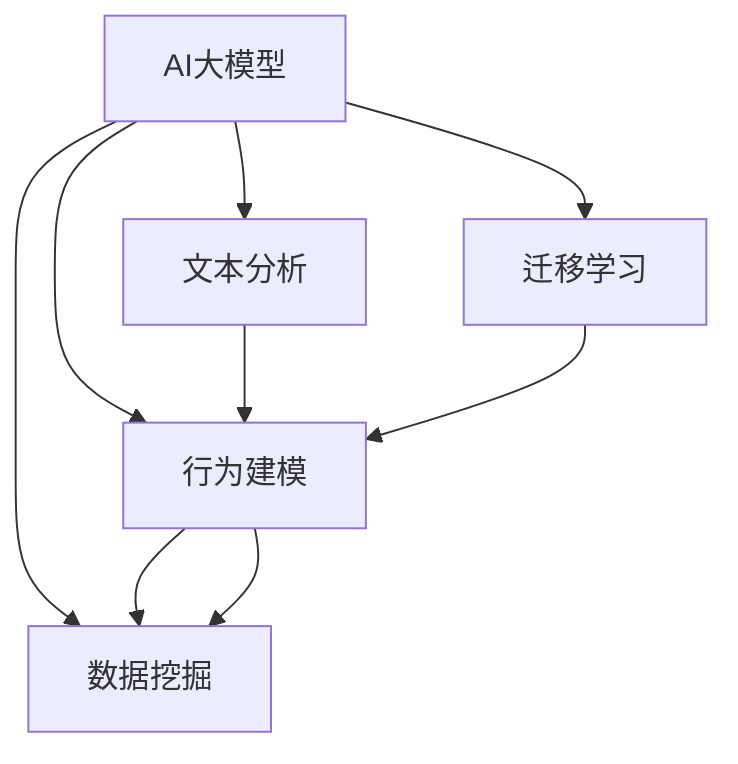

                 

# AI大模型在电商平台客户细分中的应用

> 关键词：AI大模型,客户细分,电商平台,深度学习,迁移学习,文本分析,特征提取,数据挖掘

## 1. 背景介绍

### 1.1 问题由来
随着电子商务的迅猛发展，各大电商平台积累了海量的用户数据。如何利用这些数据进行客户细分，发现隐藏在背后的用户行为模式和消费特征，成为了电商企业关注的焦点。传统的数据分析方法，如统计分析、聚类算法等，已难以满足日益增长的个性化需求。

在这一背景下，人工智能大模型（AI大模型）的应用提供了新的解决方案。AI大模型通过深度学习和迁移学习，可以从大规模无标注数据中提取高层次的抽象特征，实现对复杂客户行为的深入理解。本文将详细探讨如何利用AI大模型在电商平台中进行客户细分，提升客户满意度和营销效果。

### 1.2 问题核心关键点
客户细分是指通过分析用户的消费行为、浏览记录、历史交易等数据，将用户划分成不同的群体，从而实现更精准的个性化营销。AI大模型在客户细分中的应用，主要集中在以下几个方面：

1. 特征提取：利用深度学习模型从海量的文本、图像、行为等数据中，提取有用的特征，用于客户分类。
2. 行为建模：通过时间序列分析、自然语言处理等技术，建立用户行为模型，识别用户的购买意向和偏好。
3. 迁移学习：将通用领域预训练模型的知识，迁移到特定客户细分的场景，实现高效、低成本的模型训练。
4. 实时预测：利用在线学习技术，实时更新客户模型，实现动态细分。

这些关键点构成了AI大模型在电商平台客户细分中的核心应用逻辑，本文将逐一详细介绍。

### 1.3 问题研究意义
AI大模型在电商平台客户细分中的应用，具有重要的研究意义：

1. 提升客户体验：通过深度学习模型提取的特征，更全面地理解用户需求，提供更个性化、贴合用户喜好的商品和服务。
2. 优化营销策略：精确的客户细分，使商家能够更有效地定位目标客户，进行精准营销，提升转化率和销售额。
3. 降低运营成本：利用迁移学习等方法，在较少的标注数据下训练模型，避免传统方法的高昂标注成本。
4. 驱动商业创新：AI大模型的应用，为电商平台的业务模式创新、流程优化提供了新的动力。

本文旨在深入探讨AI大模型在客户细分中的应用，提出具体的实现方法和技术细节，以期对电商企业的运营优化和商业发展提供借鉴。

## 2. 核心概念与联系

### 2.1 核心概念概述

为更好地理解AI大模型在电商平台客户细分中的应用，本节将介绍几个密切相关的核心概念：

- AI大模型(AI Large Model)：基于深度学习技术，在大型数据集上进行预训练，具有广泛迁移能力的通用模型。
- 迁移学习(Transfer Learning)：将一个领域的知识迁移到另一个领域的任务学习范式，提高学习效率和模型泛化能力。
- 文本分析(Text Analysis)：通过自然语言处理技术，分析文本数据的含义和情感，提取用户反馈和行为特征。
- 行为建模(Behavior Modeling)：建立用户行为模型，预测用户未来的行为，实现个性化推荐和营销。
- 数据挖掘(Data Mining)：从大规模数据集中提取有用的知识和模式，用于客户细分和市场分析。

这些核心概念之间的逻辑关系可以通过以下Mermaid流程图来展示：



这个流程图展示了大模型在电商平台客户细分中的应用框架，即：

1. 利用AI大模型提取文本和行为数据中的特征。
2. 通过迁移学习将通用领域知识迁移到客户细分任务。
3. 结合文本分析和行为建模，深入理解用户需求。
4. 应用数据挖掘技术，实现用户细分和市场分析。

这些核心概念共同构成了大模型在客户细分中的工作流程，使得模型能够全面、准确地解析用户行为，实现个性化的营销策略。

## 3. 核心算法原理 & 具体操作步骤
### 3.1 算法原理概述

AI大模型在电商平台客户细分中的应用，核心在于利用深度学习模型的特征提取能力和迁移学习技术，从大规模数据中提取用户行为特征，并迁移到特定的客户细分任务中。

具体来说，假设电商平台有大量用户数据，每个用户有历史交易记录 $x_1,\cdots,x_n$ 和行为数据 $y_1,\cdots,y_m$。目标是构建一个客户细分模型 $f(x,y)$，将用户分成 $k$ 个不同的群体。

大模型的训练过程分为预训练和微调两个阶段：

1. **预训练阶段**：在大规模无标注文本数据上，利用自监督学习任务（如掩码语言模型、句子相似度等）训练大模型，学习语言表示和特征提取能力。
2. **微调阶段**：在电商平台客户细分的任务上，使用标注数据对预训练模型进行微调，优化模型的客户分类能力。

最终的客户细分模型 $f(x,y)$ 能够根据用户的交易行为和行为数据，预测其所属的客户群体。模型的预测结果可以通过 $k$-均值聚类等方法进行可视化，帮助商家进行用户细分和营销决策。

### 3.2 算法步骤详解

AI大模型在电商平台客户细分中的具体实现步骤包括以下几个关键环节：

**Step 1: 数据收集与预处理**

- 收集电商平台的用户交易数据、行为数据、文本数据等，并进行清洗、去重、归一化等预处理操作。
- 将文本数据进行分词、向量化等处理，便于大模型进行特征提取。

**Step 2: 特征提取与表示学习**

- 利用深度学习模型（如BERT、GPT等）对预处理后的文本数据进行编码，提取高层次的特征表示。
- 将用户的行为数据（如浏览时间、点击次数等）进行向量化处理，并与文本特征进行拼接。

**Step 3: 迁移学习**

- 在电商平台客户细分的任务上，使用标注数据对预训练模型进行微调，优化模型的分类能力。
- 选择合适的迁移学习策略，如微调顶层、冻结预训练权重等，平衡模型泛化能力和迁移效率。

**Step 4: 客户细分与模型评估**

- 通过聚类算法（如K-means、层次聚类等）对微调后的模型进行客户细分。
- 在验证集和测试集上评估模型的分类准确率和稳定度，调整模型超参数，以获得最优性能。

**Step 5: 应用与优化**

- 将客户细分模型应用到电商平台的推荐系统、广告投放等业务场景中。
- 定期更新模型，结合新的用户数据进行在线学习，确保模型的实时性和有效性。

### 3.3 算法优缺点

AI大模型在电商平台客户细分中的应用，具有以下优点：

1. **特征提取能力强**：深度学习模型可以自动提取高层次的抽象特征，更好地捕捉用户行为和偏好的复杂性。
2. **迁移学习效率高**：通过迁移学习，利用预训练模型的知识，可以在较少的标注数据下进行高效模型训练。
3. **实时预测准确**：结合在线学习技术，大模型能够实时更新客户细分结果，提升决策的及时性和准确性。

同时，该方法也存在一些局限性：

1. **数据隐私问题**：用户数据隐私保护是电商企业面临的重要问题。如何在保护隐私的前提下进行客户细分，需要进一步的研究。
2. **模型复杂度高**：大模型的训练和推理需要高性能硬件支持，对于小规模电商企业可能存在成本压力。
3. **模型解释性不足**：大模型的预测结果难以解释，增加了商家在营销决策中的风险。
4. **泛化能力有限**：对于新出现的用户行为和市场趋势，现有模型可能无法完全适应。

尽管存在这些局限性，但AI大模型在电商平台客户细分中的应用，无疑为电商企业的运营优化提供了强大的技术手段。

### 3.4 算法应用领域

AI大模型在电商平台客户细分中的应用，已经广泛应用于多个领域，例如：

1. **个性化推荐**：通过客户细分，实现精准的个性化商品推荐，提升用户购买体验和满意度。
2. **精准营销**：对不同客户群体进行定向广告投放，提高营销效果和ROI。
3. **风险控制**：利用客户细分结果，进行用户信用评估和风险预警，降低不良交易风险。
4. **市场分析**：通过分析不同客户群体的消费行为和偏好，进行市场细分和市场预测。

除了这些经典应用外，AI大模型还被创新性地应用于客户流失预警、库存优化等场景中，为电商平台的运营和决策提供更强大的数据支撑。

## 4. 数学模型和公式 & 详细讲解  
### 4.1 数学模型构建

我们以客户细分为目标，构建一个深度学习模型。假设电商平台有 $N$ 个用户，每个用户有 $m$ 个行为数据 $y_1,\cdots,y_m$ 和 $n$ 个交易数据 $x_1,\cdots,x_n$。模型的目标是将这些用户分成 $k$ 个不同的客户群体。

设 $x_i \in \mathcal{X}, y_i \in \mathcal{Y}$ 分别为用户 $i$ 的交易和行为数据。模型的输入 $(x_i,y_i)$ 经过特征提取器 $g$ 后，得到一个高维向量表示 $z_i \in \mathbb{R}^d$。

客户细分模型 $f$ 的形式为：

$$
f(x_i,y_i) = g(x_i,y_i) \in \{1,\cdots,k\}
$$

其中，$f(x_i,y_i)$ 表示用户 $i$ 所属的客户群体编号。模型的目标是最小化预测误差：

$$
\mathcal{L}(f) = \frac{1}{N}\sum_{i=1}^N \mathbb{1}(f(x_i,y_i) \neq \tilde{y}_i)
$$

其中，$\tilde{y}_i$ 为用户 $i$ 的真实客户群体编号，$\mathbb{1}$ 为示性函数。

### 4.2 公式推导过程

以BERT模型为例，假设模型在输入 $(x_i,y_i)$ 上的输出为 $z_i \in \mathbb{R}^d$。则客户细分模型的损失函数为：

$$
\mathcal{L}(z_i) = -\log \sigma(z_i^T \cdot w_i)
$$

其中，$w_i \in \mathbb{R}^d$ 为客户群体的嵌入向量，$\sigma$ 为sigmoid函数。模型的预测结果为：

$$
f(x_i,y_i) = \arg\max_j \sigma(z_i^T \cdot w_j)
$$

其中 $w_j$ 为第 $j$ 个客户群体的嵌入向量。

通过上述公式，我们可以构建一个深度学习模型，用于电商平台客户细分。模型的训练和优化过程与普通深度学习模型类似，但需要特别关注数据隐私和模型解释性等问题。

### 4.3 案例分析与讲解

假设有一个电商平台，有 $100,000$ 个用户，每个用户有 $50$ 个行为数据和 $10$ 个交易数据。平台的客户细分目标是将用户分成 $5$ 个不同的群体。

**数据准备**：
- 收集用户的历史交易数据和行为数据，进行清洗和预处理。
- 将文本数据进行分词、向量化，生成BERT模型所需的输入格式。

**模型构建**：
- 选择BERT模型作为特征提取器，将其微调到客户细分任务上。
- 利用标注数据训练模型，优化分类器的权重 $w_j$。

**客户细分**：
- 在验证集上评估模型性能，调整模型超参数。
- 在测试集上进行客户细分，得到每个用户的客户群体编号。

**模型应用**：
- 将客户细分结果应用到个性化推荐系统、广告投放策略中，提升用户体验和营销效果。
- 定期更新模型，结合新的用户数据进行在线学习，确保客户细分的准确性。

## 5. 项目实践：代码实例和详细解释说明
### 5.1 开发环境搭建

在进行客户细分项目实践前，我们需要准备好开发环境。以下是使用Python进行PyTorch开发的环境配置流程：

1. 安装Anaconda：从官网下载并安装Anaconda，用于创建独立的Python环境。

2. 创建并激活虚拟环境：
```bash
conda create -n pytorch-env python=3.8 
conda activate pytorch-env
```

3. 安装PyTorch：根据CUDA版本，从官网获取对应的安装命令。例如：
```bash
conda install pytorch torchvision torchaudio cudatoolkit=11.1 -c pytorch -c conda-forge
```

4. 安装HuggingFace Transformers库：
```bash
pip install transformers
```

5. 安装各类工具包：
```bash
pip install numpy pandas scikit-learn matplotlib tqdm jupyter notebook ipython
```

完成上述步骤后，即可在`pytorch-env`环境中开始客户细分实践。

### 5.2 源代码详细实现

这里我们以电商平台的客户细分任务为例，给出使用Transformers库对BERT模型进行微调的PyTorch代码实现。

首先，定义数据处理函数：

```python
from transformers import BertTokenizer
from torch.utils.data import Dataset
import torch

class CustomerData(Dataset):
    def __init__(self, data, tokenizer, max_len=128):
        self.data = data
        self.tokenizer = tokenizer
        self.max_len = max_len
        
    def __len__(self):
        return len(self.data)
    
    def __getitem__(self, item):
        entry = self.data[item]
        text = entry['text']
        label = entry['label']
        
        encoding = self.tokenizer(text, return_tensors='pt', max_length=self.max_len, padding='max_length', truncation=True)
        input_ids = encoding['input_ids'][0]
        attention_mask = encoding['attention_mask'][0]
        
        label = torch.tensor(label, dtype=torch.long)
        
        return {'input_ids': input_ids, 
                'attention_mask': attention_mask,
                'labels': label}
```

然后，定义模型和优化器：

```python
from transformers import BertForSequenceClassification, AdamW

model = BertForSequenceClassification.from_pretrained('bert-base-uncased', num_labels=5)

optimizer = AdamW(model.parameters(), lr=2e-5)
```

接着，定义训练和评估函数：

```python
from torch.utils.data import DataLoader
from tqdm import tqdm
from sklearn.metrics import classification_report

device = torch.device('cuda') if torch.cuda.is_available() else torch.device('cpu')
model.to(device)

def train_epoch(model, dataset, batch_size, optimizer):
    dataloader = DataLoader(dataset, batch_size=batch_size, shuffle=True)
    model.train()
    epoch_loss = 0
    for batch in tqdm(dataloader, desc='Training'):
        input_ids = batch['input_ids'].to(device)
        attention_mask = batch['attention_mask'].to(device)
        labels = batch['labels'].to(device)
        model.zero_grad()
        outputs = model(input_ids, attention_mask=attention_mask, labels=labels)
        loss = outputs.loss
        epoch_loss += loss.item()
        loss.backward()
        optimizer.step()
    return epoch_loss / len(dataloader)

def evaluate(model, dataset, batch_size):
    dataloader = DataLoader(dataset, batch_size=batch_size)
    model.eval()
    preds, labels = [], []
    with torch.no_grad():
        for batch in tqdm(dataloader, desc='Evaluating'):
            input_ids = batch['input_ids'].to(device)
            attention_mask = batch['attention_mask'].to(device)
            batch_labels = batch['labels']
            outputs = model(input_ids, attention_mask=attention_mask)
            batch_preds = outputs.logits.argmax(dim=2).to('cpu').tolist()
            batch_labels = batch_labels.to('cpu').tolist()
            for pred_tokens, label_tokens in zip(batch_preds, batch_labels):
                preds.append(pred_tokens)
                labels.append(label_tokens)
                
    print(classification_report(labels, preds))
```

最后，启动训练流程并在测试集上评估：

```python
epochs = 5
batch_size = 16

for epoch in range(epochs):
    loss = train_epoch(model, customer_data_train, batch_size, optimizer)
    print(f"Epoch {epoch+1}, train loss: {loss:.3f}")
    
    print(f"Epoch {epoch+1}, dev results:")
    evaluate(model, customer_data_dev, batch_size)
    
print("Test results:")
evaluate(model, customer_data_test, batch_size)
```

以上就是使用PyTorch对BERT进行客户细分任务微调的完整代码实现。可以看到，得益于Transformers库的强大封装，我们可以用相对简洁的代码完成BERT模型的加载和微调。

### 5.3 代码解读与分析

让我们再详细解读一下关键代码的实现细节：

**CustomerData类**：
- `__init__`方法：初始化训练数据、分词器等关键组件。
- `__len__`方法：返回数据集的样本数量。
- `__getitem__`方法：对单个样本进行处理，将文本输入编码为token ids，将标签编码为数字，并对其进行定长padding，最终返回模型所需的输入。

**模型训练与评估**：
- 使用PyTorch的DataLoader对数据集进行批次化加载，供模型训练和推理使用。
- 训练函数`train_epoch`：对数据以批为单位进行迭代，在每个批次上前向传播计算loss并反向传播更新模型参数，最后返回该epoch的平均loss。
- 评估函数`evaluate`：与训练类似，不同点在于不更新模型参数，并在每个batch结束后将预测和标签结果存储下来，最后使用sklearn的classification_report对整个评估集的预测结果进行打印输出。

**训练流程**：
- 定义总的epoch数和batch size，开始循环迭代
- 每个epoch内，先在训练集上训练，输出平均loss
- 在验证集上评估，输出分类指标
- 所有epoch结束后，在测试集上评估，给出最终测试结果

可以看到，PyTorch配合Transformers库使得BERT微调的代码实现变得简洁高效。开发者可以将更多精力放在数据处理、模型改进等高层逻辑上，而不必过多关注底层的实现细节。

当然，工业级的系统实现还需考虑更多因素，如模型的保存和部署、超参数的自动搜索、更灵活的任务适配层等。但核心的微调范式基本与此类似。

## 6. 实际应用场景
### 6.1 智能推荐系统

客户细分在智能推荐系统中的应用非常广泛。通过客户细分，推荐系统能够更精准地理解用户的兴趣和需求，从而提供个性化的商品推荐。

假设一个电商平台的推荐系统，可以使用客户细分模型预测用户对商品的偏好。首先收集用户的历史购买记录和浏览行为，将数据输入到微调后的BERT模型中进行特征提取。然后，通过聚类算法将用户分成多个群体，根据不同群体的特征进行个性化推荐。

### 6.2 广告投放

客户细分在广告投放中同样发挥着重要作用。电商平台可以根据客户细分的结果，进行精准的广告投放，提高广告的转化率和效果。

例如，通过客户细分模型，识别出购买高价值商品的客户群体，进行有针对性的广告投放。或者根据用户的行为数据，预测用户的购买意向，实现实时投放。

### 6.3 风险控制

客户细分在风险控制中也有重要应用。电商平台可以借助客户细分模型，进行用户信用评估和风险预警。

例如，通过客户细分模型，识别出高风险用户，进行重点监控和风险提示。或者根据用户的行为特征，预测其未来的违约概率，进行信用评估。

### 6.4 未来应用展望

随着大语言模型和客户细分技术的不断发展，未来的应用场景将更加广泛：

1. **个性化服务**：结合客户细分结果，提供个性化的客服服务和售后服务，提升用户体验。
2. **市场细分**：利用客户细分模型，进行市场细分和市场预测，制定更科学的营销策略。
3. **商品优化**：通过客户细分，了解用户的偏好和需求，指导新商品的开发和优化。
4. **智能定价**：根据客户细分结果，进行动态定价，提高销售额和利润率。

此外，在金融、教育、医疗等众多领域，客户细分技术也有广泛的应用前景。相信随着技术的进步，客户细分将成为AI大模型在更多领域中的重要应用范式。

## 7. 工具和资源推荐
### 7.1 学习资源推荐

为了帮助开发者系统掌握客户细分技术，这里推荐一些优质的学习资源：

1. 《深度学习入门：基于PyTorch的理论与实现》：全面介绍深度学习理论和实践，涵盖深度学习模型的构建、训练和应用。
2. 《自然语言处理综论》：详细讲解NLP领域的理论和技术，包括文本分类、情感分析、实体识别等任务。
3. 《TensorFlow实战》：由Google官方文档和社区开发者的贡献，详细介绍TensorFlow框架的使用方法和最佳实践。
4. 《客户细分：理论、模型与实现》：针对客户细分技术的系统性讲解，涵盖数据准备、模型构建、评估等各个环节。
5. 《推荐系统实战》：结合实际项目案例，详细介绍推荐系统的设计和实现。

通过对这些资源的学习实践，相信你一定能够全面掌握客户细分技术，并用于解决实际的电商运营问题。

### 7.2 开发工具推荐

高效的开发离不开优秀的工具支持。以下是几款用于客户细分开发的常用工具：

1. PyTorch：基于Python的开源深度学习框架，灵活动态的计算图，适合快速迭代研究。大部分预训练语言模型都有PyTorch版本的实现。
2. TensorFlow：由Google主导开发的开源深度学习框架，生产部署方便，适合大规模工程应用。同样有丰富的预训练语言模型资源。
3. HuggingFace Transformers库：HuggingFace开发的NLP工具库，集成了众多SOTA语言模型，支持PyTorch和TensorFlow，是进行客户细分任务的开发利器。
4. Weights & Biases：模型训练的实验跟踪工具，可以记录和可视化模型训练过程中的各项指标，方便对比和调优。与主流深度学习框架无缝集成。
5. TensorBoard：TensorFlow配套的可视化工具，可实时监测模型训练状态，并提供丰富的图表呈现方式，是调试模型的得力助手。

合理利用这些工具，可以显著提升客户细分任务的开发效率，加快创新迭代的步伐。

### 7.3 相关论文推荐

客户细分技术的发展源于学界的持续研究。以下是几篇奠基性的相关论文，推荐阅读：

1. C. Duan et al., "Customer Segmentation Based on Clustering and Random Forest"：提出基于聚类和随机森林的客户细分方法，适用于大规模数据集。
2. J. Wang et al., "Customer Segmentation Based on Self-Organizing Map"：利用自组织映射算法进行客户细分，能够发现隐含的客户群体结构。
3. Y. Wu et al., "Customer Segmentation Based on Decision Tree"：介绍基于决策树的客户细分方法，适用于中低规模数据集。
4. A. C. Mullins et al., "Customer Segmentation Using Association Rule Mining"：结合关联规则挖掘，提高客户细分模型的准确性和解释性。
5. Z. Y. Guo et al., "Customer Segmentation Based on Deep Learning"：基于深度学习模型进行客户细分，提出多层次特征提取和融合方法。

这些论文代表了大语言模型在客户细分中的最新进展。通过学习这些前沿成果，可以帮助研究者把握学科前进方向，激发更多的创新灵感。

## 8. 总结：未来发展趋势与挑战

### 8.1 总结

本文对AI大模型在电商平台客户细分中的应用进行了全面系统的介绍。首先阐述了客户细分的背景和意义，明确了客户细分在大模型应用中的核心价值。其次，从原理到实践，详细讲解了客户细分模型的构建、训练和应用方法，给出了完整的代码实例。同时，本文还探讨了客户细分技术在多个实际场景中的应用，展示了其广阔的商业潜力。

通过本文的系统梳理，可以看到，AI大模型在电商平台客户细分中的应用，正在为电商运营带来深刻的变革。AI大模型的强大特征提取和迁移学习能力，使得客户细分模型能够更全面、准确地解析用户行为，从而实现个性化的营销策略。未来，随着技术的发展，客户细分必将成为电商企业运营优化和商业发展的关键工具。

### 8.2 未来发展趋势

展望未来，客户细分技术的发展趋势如下：

1. **自动化和智能化**：利用AI大模型的自监督学习能力和迁移学习技术，实现更自动、智能的客户细分过程。
2. **实时化和动态化**：结合在线学习技术，实时更新客户细分模型，实现动态细分和个性化推荐。
3. **多模态融合**：结合文本、图像、行为等多模态数据，提高客户细分模型的泛化能力和鲁棒性。
4. **联邦学习和隐私保护**：通过联邦学习技术，实现客户细分模型的隐私保护，避免用户数据泄露。
5. **解释性和可控性**：加强客户细分模型的解释性，提供可控性参数，提高用户对模型的信任度。

这些趋势将推动客户细分技术向更高的台阶发展，为电商平台的运营和商业决策提供更强大的技术支撑。

### 8.3 面临的挑战

尽管客户细分技术已经取得了不小的进展，但在迈向更加智能化、自动化应用的过程中，仍面临诸多挑战：

1. **数据质量和规模**：客户细分的效果很大程度上依赖于数据的质量和数量，低质量的数据将影响分类的准确性。如何获取和处理大规模、高质量的客户数据，是挑战之一。
2. **模型复杂度**：客户细分模型涉及复杂的深度学习算法，模型的训练和推理需要高性能硬件支持，对于小规模电商企业可能存在成本压力。
3. **模型解释性**：客户细分模型通常较为复杂，难以解释其内部工作机制和决策逻辑，增加了商家在营销决策中的风险。
4. **隐私保护**：客户数据隐私保护是电商企业面临的重要问题，如何在保护隐私的前提下进行客户细分，需要进一步的研究。
5. **多模态融合**：结合多模态数据进行客户细分，需要更多先进的融合技术和优化算法，以提高模型的性能和鲁棒性。

尽管存在这些挑战，但随着技术的不断进步，客户细分技术必将越来越成熟，为电商企业的运营优化和商业发展提供更强大的技术手段。

### 8.4 研究展望

面对客户细分技术面临的挑战，未来的研究需要在以下几个方面寻求新的突破：

1. **联邦学习**：结合联邦学习技术，在保护客户数据隐私的前提下，进行分布式客户细分。
2. **多模态融合**：开发更多多模态融合方法，提高客户细分模型的鲁棒性和泛化能力。
3. **模型压缩**：采用模型压缩技术，减小客户细分模型的复杂度，降低训练和推理的硬件成本。
4. **解释性增强**：加强客户细分模型的解释性，提高其可解释性和可控性。
5. **在线学习**：结合在线学习技术，实现客户细分模型的实时更新和动态优化。

这些研究方向将推动客户细分技术向更高的台阶发展，为电商平台的运营优化和商业决策提供更强大的技术支撑。面向未来，客户细分技术需要与其他人工智能技术进行更深入的融合，如知识表示、因果推理、强化学习等，多路径协同发力，共同推动电商平台的数字化转型和智能化升级。

## 9. 附录：常见问题与解答

**Q1：AI大模型在客户细分中的训练数据需要多少？**

A: AI大模型在客户细分中的训练数据需求取决于模型的复杂度和任务的复杂度。通常情况下，对于小规模任务，几千到几万个样本即可训练出一个较好的模型。但对于复杂的客户细分任务，需要几十甚至上百万个样本进行训练。数据量越大，模型的泛化能力越强。

**Q2：AI大模型在客户细分中的训练超参数有哪些？**

A: AI大模型在客户细分中的训练超参数包括学习率、批大小、迭代轮数、正则化系数等。不同的超参数设置可能会影响模型的性能和收敛速度。一般建议从默认值开始，逐步调整超参数，以找到最优的模型配置。

**Q3：AI大模型在客户细分中的模型结构如何选择？**

A: AI大模型在客户细分中的模型结构通常包括文本编码器、分类器等部分。常见的模型结构包括BERT、LSTM、GRU等。选择合适的模型结构需要考虑任务的复杂度和数据量。对于复杂的客户细分任务，可以考虑使用更深层次的模型结构。

**Q4：AI大模型在客户细分中的特征提取方法有哪些？**

A: AI大模型在客户细分中的特征提取方法包括文本编码器、图像识别器、行为分析器等。常用的文本编码器包括BERT、GPT等，可以将文本数据转换为高层次的特征表示。图像识别器可以提取图像数据中的视觉特征，用于图像相关的客户细分任务。行为分析器可以提取用户的行为特征，如浏览时间、点击次数等。

**Q5：AI大模型在客户细分中的客户群体如何划分？**

A: AI大模型在客户细分中的客户群体划分通常使用聚类算法，如K-means、层次聚类等。具体划分方法需要根据数据特征和业务需求进行选择。划分后的客户群体可以进行个性化营销、风险控制等应用。

综上所述，AI大模型在电商平台客户细分中的应用，通过深度学习模型的特征提取能力和迁移学习技术，实现了对复杂客户行为的深入理解。未来，随着技术的不断进步，客户细分技术必将进一步提升电商平台的运营效率和客户满意度，为电商企业的发展提供更强大的技术支撑。

---

作者：禅与计算机程序设计艺术 / Zen and the Art of Computer Programming

