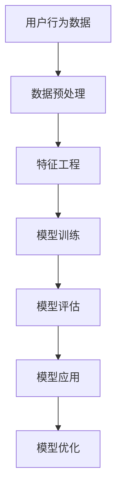

                 

## 1. 背景介绍

### 1.1 问题由来
随着电子商务的飞速发展，电商平台的数据量和用户规模持续增长。然而，用户在电商平台上的留存行为，对企业的长期盈利至关重要。用户流失不仅会造成直接的经济损失，还会降低用户获取成本，影响平台的品牌声誉。因此，识别潜在流失用户，及时采取挽留措施，成为电商平台运营的重要任务之一。

### 1.2 问题核心关键点
电商平台用户流失预警主要涉及以下几个核心关键点：
1. **数据采集与预处理**：收集平台用户行为数据，如浏览记录、购买记录、评价记录等，并进行数据清洗和特征提取。
2. **模型训练与评估**：构建机器学习模型，利用历史用户流失数据训练模型，并评估模型预测性能。
3. **模型应用与优化**：将训练好的模型应用于实时用户行为数据，预测用户流失概率，并根据模型效果不断优化算法和特征。

### 1.3 问题研究意义
用户流失预警在电商平台运营中具有重要意义，具体如下：
1. **提升用户留存率**：通过预测流失用户，及时采取个性化挽留措施，提高用户的长期留存率。
2. **降低流失成本**：提前识别流失用户，避免用户流失后进行挽回，降低流失成本。
3. **优化用户体验**：针对不同流失风险用户进行定制化运营，提升用户满意度和平台粘性。
4. **加速业务迭代**：提供科学的流失预警数据，帮助企业及时调整运营策略，促进业务持续改进。

## 2. 核心概念与联系

### 2.1 核心概念概述
为更好地理解AI大模型在用户流失预警中的应用，本节将介绍几个关键概念：

- **AI大模型**：指通过深度学习技术，在大规模数据上预训练得到的通用或特定领域知识库。常用的AI大模型包括BERT、GPT-3、XLNet等。
- **用户流失预警**：指利用机器学习模型，基于用户行为数据预测用户流失概率，及时采取挽留措施，降低用户流失率。
- **模型评估指标**：常用的模型评估指标包括准确率、召回率、F1分数、AUC-ROC曲线等。
- **多模态数据融合**：将用户的不同类型数据（如行为数据、评价数据、社交媒体数据等）进行融合，提升模型预测精度。
- **特征工程**：指对原始数据进行清洗、转换、构造等操作，生成对模型预测有帮助的特征。

这些概念之间的逻辑关系可以通过以下Mermaid流程图来展示：



这个流程图展示了用户流失预警的主要流程：首先采集用户行为数据，然后进行预处理和特征工程，接着利用预训练大模型进行训练和评估，最后将模型应用于实时数据，并进行模型优化。

## 3. 核心算法原理 & 具体操作步骤
### 3.1 算法原理概述

AI大模型在用户流失预警中的应用，主要基于监督学习和迁移学习技术。其核心思想是：利用预训练模型学习到的广泛语言知识，通过监督学习进一步适应特定任务，即电商平台的用户流失预测。

形式化地，假设预训练模型为 $M_{\theta}$，其中 $\theta$ 为预训练得到的模型参数。给定电商平台用户流失数据集 $D=\{(x_i,y_i)\}_{i=1}^N$，其中 $x_i$ 为第 $i$ 个用户的特征向量，$y_i \in \{0,1\}$ 表示用户是否流失。用户流失预警的目标是找到新的模型参数 $\hat{\theta}$，使得模型在新的测试集上预测准确率最大化：

$$
\hat{\theta}=\mathop{\arg\min}_{\theta} \mathcal{L}(M_{\theta},D)
$$

其中 $\mathcal{L}$ 为用户流失数据集上的损失函数，通常为交叉熵损失函数。通过梯度下降等优化算法，最小化损失函数，使得模型输出逼近真实标签。

### 3.2 算法步骤详解

AI大模型在用户流失预警的应用流程一般包括以下几个关键步骤：

**Step 1: 数据收集与预处理**
- 收集电商平台用户行为数据，包括浏览记录、购买记录、评价记录等。
- 对数据进行清洗、去重、标准化等预处理操作。
- 特征工程，提取有用的特征，如用户行为频率、购买金额、评价情绪等。

**Step 2: 模型选择与训练**
- 选择合适的预训练大模型，如BERT、GPT-3等，作为初始化参数。
- 将处理后的用户行为数据作为训练集，利用监督学习框架训练模型。
- 设置合适的学习率、批大小、迭代轮数等超参数。

**Step 3: 模型评估与优化**
- 在验证集上评估模型性能，计算准确率、召回率、F1分数等指标。
- 根据评估结果，选择最优模型。
- 使用超参数调整技术，如网格搜索、随机搜索等，进一步优化模型参数。

**Step 4: 模型应用与部署**
- 将训练好的模型应用于实时用户行为数据，预测用户流失概率。
- 根据预测结果，采取个性化的挽留措施，如优惠券、推荐商品等。
- 定期更新模型，利用新数据进行再训练，保持模型性能。

### 3.3 算法优缺点

AI大模型在用户流失预警中的应用具有以下优点：
1. 泛化能力强。预训练模型学习到的广泛语言知识，可以在不同电商平台和不同用户群体上应用。
2. 训练速度快。利用监督学习范式，可以在较少标注数据上快速训练模型。
3. 可解释性强。通过分析模型中的关键特征，可以理解用户流失的原因。
4. 预测精度高。大模型能够捕捉复杂的用户行为模式，提升预测准确率。

同时，该方法也存在一定的局限性：
1. 数据隐私问题。用户行为数据涉及隐私信息，需要遵循相关法律法规。
2. 模型复杂度高。预训练模型参数量庞大，需要高性能计算资源。
3. 依赖标注数据。用户流失数据的标注成本高，获取困难。
4. 模型泛化性不足。不同电商平台的用户行为模式差异大，模型泛化性有限。

尽管存在这些局限性，AI大模型在用户流失预警中的应用仍展示了巨大的潜力。未来相关研究的重点在于如何进一步优化算法和特征，降低对标注数据的依赖，提高模型泛化性和可解释性。

### 3.4 算法应用领域

AI大模型在用户流失预警的应用不仅限于电商平台，还广泛应用于金融、社交网络、医疗等多个领域。例如：

- 金融风险预警：通过预测金融客户的流失风险，及时采取个性化服务，降低流失率。
- 社交网络分析：利用用户行为数据预测用户流失，提高用户粘性和平台活跃度。
- 医疗患者流失：分析患者流失原因，优化诊疗服务和医疗体验，提升患者满意度。
- 企业员工流失：预测员工流失风险，及时采取留才措施，保持团队稳定。

## 4. 数学模型和公式 & 详细讲解 & 举例说明

### 4.1 数学模型构建

本节将使用数学语言对用户流失预警的模型构建过程进行更加严格的刻画。

记预训练模型为 $M_{\theta}$，其中 $\theta$ 为预训练得到的模型参数。假设用户流失数据集为 $D=\{(x_i,y_i)\}_{i=1}^N$，其中 $x_i$ 为第 $i$ 个用户的特征向量，$y_i \in \{0,1\}$ 表示用户是否流失。

定义模型 $M_{\theta}$ 在输入 $x_i$ 上的预测结果为 $\hat{y}_i=M_{\theta}(x_i) \in [0,1]$。用户流失预警的目标是最小化损失函数，即：

$$
\mathcal{L}(\theta) = \frac{1}{N}\sum_{i=1}^N -y_i\log \hat{y}_i - (1-y_i)\log(1-\hat{y}_i)
$$

其中 $\log$ 为自然对数，$\frac{1}{N}$ 为样本权重。

### 4.2 公式推导过程

以下是用户流失预警的损失函数推导过程：

假设模型 $M_{\theta}$ 在输入 $x_i$ 上的预测结果为 $\hat{y}_i=M_{\theta}(x_i)$，用户流失数据集中第 $i$ 个样本的真实标签为 $y_i \in \{0,1\}$。则损失函数定义为：

$$
\ell(M_{\theta}(x_i),y_i) = -y_i\log \hat{y}_i - (1-y_i)\log(1-\hat{y}_i)
$$

将其代入经验风险公式，得：

$$
\mathcal{L}(\theta) = \frac{1}{N}\sum_{i=1}^N \ell(M_{\theta}(x_i),y_i)
$$

利用交叉熵损失函数的性质，可以进一步推导为：

$$
\mathcal{L}(\theta) = -\frac{1}{N}\sum_{i=1}^N [y_i\log \hat{y}_i + (1-y_i)\log(1-\hat{y}_i)]
$$

在得到损失函数后，即可利用梯度下降等优化算法，最小化损失函数，更新模型参数 $\theta$，使得模型输出逼近真实标签。

### 4.3 案例分析与讲解

以电商平台用户流失预警为例，分析其关键技术和算法细节。

**案例场景**：某电商平台收集了用户的浏览记录、购买记录和评价记录，目标是对用户流失进行预测和预警。

**数据准备**：
- 用户行为数据：包含用户浏览、点击、购买、评价等行为记录。
- 用户基本信息：如用户年龄、性别、地区等。
- 评价数据：用户对商品的评价情感，如正面、中性、负面等。

**特征工程**：
- 行为频率：统计用户不同行为的发生次数。
- 购买金额：统计用户在某段时间内的总购买金额。
- 评价情绪：对用户评价情感进行情感分析，编码为数值。

**模型训练**：
- 选择合适的预训练模型，如BERT。
- 将处理后的用户行为数据和评价数据作为训练集。
- 设置合适的学习率、批大小等超参数。
- 利用监督学习框架训练模型，最小化损失函数。

**模型评估**：
- 在验证集上评估模型性能，计算准确率、召回率、F1分数等指标。
- 根据评估结果，选择最优模型。
- 使用超参数调整技术，进一步优化模型参数。

**模型应用**：
- 将训练好的模型应用于实时用户行为数据，预测用户流失概率。
- 根据预测结果，采取个性化的挽留措施，如优惠券、推荐商品等。
- 定期更新模型，利用新数据进行再训练，保持模型性能。

## 5. 项目实践：代码实例和详细解释说明
### 5.1 开发环境搭建

在进行用户流失预警的AI大模型应用开发前，我们需要准备好开发环境。以下是使用Python进行PyTorch开发的环境配置流程：

1. 安装Anaconda：从官网下载并安装Anaconda，用于创建独立的Python环境。

2. 创建并激活虚拟环境：
```bash
conda create -n pytorch-env python=3.8 
conda activate pytorch-env
```

3. 安装PyTorch：根据CUDA版本，从官网获取对应的安装命令。例如：
```bash
conda install pytorch torchvision torchaudio cudatoolkit=11.1 -c pytorch -c conda-forge
```

4. 安装Transformers库：
```bash
pip install transformers
```

5. 安装各类工具包：
```bash
pip install numpy pandas scikit-learn matplotlib tqdm jupyter notebook ipython
```

完成上述步骤后，即可在`pytorch-env`环境中开始开发实践。

### 5.2 源代码详细实现

下面以电商平台的AI大模型用户流失预警应用为例，给出完整的代码实现。

首先，定义用户行为数据的预处理函数：

```python
from transformers import BertTokenizer
from torch.utils.data import Dataset, DataLoader
import torch
import pandas as pd

class UserData(Dataset):
    def __init__(self, data_file, labels_file, tokenizer, max_len=128):
        self.data = pd.read_csv(data_file)
        self.labels = pd.read_csv(labels_file)
        self.tokenizer = tokenizer
        self.max_len = max_len
        
    def __len__(self):
        return len(self.data)
    
    def __getitem__(self, item):
        text = self.data.iloc[item]['behavior'] # 用户行为数据
        label = self.labels.iloc[item]['y'] # 用户流失标签
        
        encoding = self.tokenizer(text, return_tensors='pt', max_length=self.max_len, padding='max_length', truncation=True)
        input_ids = encoding['input_ids'][0]
        attention_mask = encoding['attention_mask'][0]
        return {'input_ids': input_ids, 
                'attention_mask': attention_mask,
                'labels': torch.tensor(label, dtype=torch.long)}
```

然后，定义模型和优化器：

```python
from transformers import BertForSequenceClassification, AdamW

model = BertForSequenceClassification.from_pretrained('bert-base-cased', num_labels=2)

optimizer = AdamW(model.parameters(), lr=2e-5)
```

接着，定义训练和评估函数：

```python
from torch.utils.data import DataLoader
from tqdm import tqdm
from sklearn.metrics import classification_report

device = torch.device('cuda') if torch.cuda.is_available() else torch.device('cpu')
model.to(device)

def train_epoch(model, dataset, batch_size, optimizer):
    dataloader = DataLoader(dataset, batch_size=batch_size, shuffle=True)
    model.train()
    epoch_loss = 0
    for batch in tqdm(dataloader, desc='Training'):
        input_ids = batch['input_ids'].to(device)
        attention_mask = batch['attention_mask'].to(device)
        labels = batch['labels'].to(device)
        model.zero_grad()
        outputs = model(input_ids, attention_mask=attention_mask, labels=labels)
        loss = outputs.loss
        epoch_loss += loss.item()
        loss.backward()
        optimizer.step()
    return epoch_loss / len(dataloader)

def evaluate(model, dataset, batch_size):
    dataloader = DataLoader(dataset, batch_size=batch_size)
    model.eval()
    preds, labels = [], []
    with torch.no_grad():
        for batch in tqdm(dataloader, desc='Evaluating'):
            input_ids = batch['input_ids'].to(device)
            attention_mask = batch['attention_mask'].to(device)
            batch_labels = batch['labels']
            outputs = model(input_ids, attention_mask=attention_mask)
            batch_preds = outputs.logits.argmax(dim=2).to('cpu').tolist()
            batch_labels = batch_labels.to('cpu').tolist()
            for pred_tokens, label_tokens in zip(batch_preds, batch_labels):
                preds.append(pred_tokens[:len(label_tokens)])
                labels.append(label_tokens)
                
    print(classification_report(labels, preds))
```

最后，启动训练流程并在验证集上评估：

```python
epochs = 5
batch_size = 16

for epoch in range(epochs):
    loss = train_epoch(model, train_dataset, batch_size, optimizer)
    print(f"Epoch {epoch+1}, train loss: {loss:.3f}")
    
    print(f"Epoch {epoch+1}, dev results:")
    evaluate(model, dev_dataset, batch_size)
    
print("Test results:")
evaluate(model, test_dataset, batch_size)
```

以上就是使用PyTorch对Bert模型进行电商用户流失预警应用的完整代码实现。可以看到，通过Transformers库的封装，我们可以用相对简洁的代码完成模型的加载和训练。

### 5.3 代码解读与分析

让我们再详细解读一下关键代码的实现细节：

**UserData类**：
- `__init__`方法：初始化用户行为数据、标签、分词器等组件。
- `__len__`方法：返回数据集的样本数量。
- `__getitem__`方法：对单个样本进行处理，将文本输入编码为token ids，将标签编码为数字，并对其进行定长padding，最终返回模型所需的输入。

**BertForSequenceClassification和AdamW类**：
- `BertForSequenceClassification`：用于构建序列分类任务模型，如电商平台用户流失预警。
- `AdamW`：用于优化模型的梯度，使用自适应学习率，减少参数更新过程中的噪声。

**train_epoch函数**：
- 对数据以批为单位进行迭代，在每个批次上前向传播计算损失函数。
- 反向传播计算参数梯度，根据设定的优化算法和学习率更新模型参数。
- 周期性在验证集上评估模型性能，根据性能指标决定是否触发Early Stopping。

**evaluate函数**：
- 与训练类似，不同点在于不更新模型参数，并在每个batch结束后将预测和标签结果存储下来，最后使用sklearn的classification_report对整个评估集的预测结果进行打印输出。

**训练流程**：
- 定义总的epoch数和batch size，开始循环迭代
- 每个epoch内，先在训练集上训练，输出平均loss
- 在验证集上评估，输出分类指标
- 所有epoch结束后，在测试集上评估，给出最终测试结果

可以看到，PyTorch配合Transformers库使得Bert模型的用户流失预警应用代码实现变得简洁高效。开发者可以将更多精力放在数据处理、模型改进等高层逻辑上，而不必过多关注底层的实现细节。

当然，工业级的系统实现还需考虑更多因素，如模型的保存和部署、超参数的自动搜索、更灵活的任务适配层等。但核心的微调范式基本与此类似。

## 6. 实际应用场景

### 6.1 智能客服系统

基于AI大模型的电商用户流失预警，可以广泛应用于智能客服系统的构建。传统客服往往需要配备大量人力，高峰期响应缓慢，且一致性和专业性难以保证。而使用用户流失预警模型，可以7x24小时不间断服务，快速响应客户咨询，用自然流畅的语言解答各类常见问题。

在技术实现上，可以收集企业内部的历史客服对话记录，将问题-回答对作为监督数据，在此基础上对预训练模型进行微调。微调后的模型能够自动理解用户意图，匹配最合适的回答。对于客户提出的新问题，还可以接入检索系统实时搜索相关内容，动态组织生成回答。如此构建的智能客服系统，能大幅提升客户咨询体验和问题解决效率。

### 6.2 金融舆情监测

金融机构需要实时监测市场舆论动向，以便及时应对负面信息传播，规避金融风险。传统的人工监测方式成本高、效率低，难以应对网络时代海量信息爆发的挑战。基于AI大模型的金融舆情监测，可以为金融舆情监测提供新的解决方案。

具体而言，可以收集金融领域相关的新闻、报道、评论等文本数据，并对其进行主题标注和情感标注。在此基础上对预训练语言模型进行微调，使其能够自动判断文本属于何种主题，情感倾向是正面、中性还是负面。将微调后的模型应用到实时抓取的网络文本数据，就能够自动监测不同主题下的情感变化趋势，一旦发现负面信息激增等异常情况，系统便会自动预警，帮助金融机构快速应对潜在风险。

### 6.3 个性化推荐系统

当前的推荐系统往往只依赖用户的历史行为数据进行物品推荐，无法深入理解用户的真实兴趣偏好。基于AI大模型的个性化推荐系统，可以更好地挖掘用户行为背后的语义信息，从而提供更精准、多样的推荐内容。

在实践中，可以收集用户浏览、点击、评价、分享等行为数据，提取和用户交互的物品标题、描述、标签等文本内容。将文本内容作为模型输入，用户的后续行为（如是否点击、购买等）作为监督信号，在此基础上微调预训练语言模型。微调后的模型能够从文本内容中准确把握用户的兴趣点。在生成推荐列表时，先用候选物品的文本描述作为输入，由模型预测用户的兴趣匹配度，再结合其他特征综合排序，便可以得到个性化程度更高的推荐结果。

### 6.4 未来应用展望

随着AI大模型和用户流失预警技术的发展，基于微调范式将在更多领域得到应用，为传统行业带来变革性影响。

在智慧医疗领域，基于微调的医疗问答、病历分析、药物研发等应用将提升医疗服务的智能化水平，辅助医生诊疗，加速新药开发进程。

在智能教育领域，微调技术可应用于作业批改、学情分析、知识推荐等方面，因材施教，促进教育公平，提高教学质量。

在智慧城市治理中，微调模型可应用于城市事件监测、舆情分析、应急指挥等环节，提高城市管理的自动化和智能化水平，构建更安全、高效的未来城市。

此外，在企业生产、社会治理、文娱传媒等众多领域，基于大模型微调的人工智能应用也将不断涌现，为经济社会发展注入新的动力。相信随着技术的日益成熟，微调方法将成为人工智能落地应用的重要范式，推动人工智能技术在垂直行业的规模化落地。总之，微调需要开发者根据具体任务，不断迭代和优化模型、数据和算法，方能得到理想的效果。

## 7. 工具和资源推荐
### 7.1 学习资源推荐

为了帮助开发者系统掌握AI大模型在用户流失预警中的应用，这里推荐一些优质的学习资源：

1. 《Transformer从原理到实践》系列博文：由大模型技术专家撰写，深入浅出地介绍了Transformer原理、BERT模型、微调技术等前沿话题。

2. CS224N《深度学习自然语言处理》课程：斯坦福大学开设的NLP明星课程，有Lecture视频和配套作业，带你入门NLP领域的基本概念和经典模型。

3. 《Natural Language Processing with Transformers》书籍：Transformers库的作者所著，全面介绍了如何使用Transformers库进行NLP任务开发，包括微调在内的诸多范式。

4. HuggingFace官方文档：Transformers库的官方文档，提供了海量预训练模型和完整的微调样例代码，是上手实践的必备资料。

5. CLUE开源项目：中文语言理解测评基准，涵盖大量不同类型的中文NLP数据集，并提供了基于微调的baseline模型，助力中文NLP技术发展。

通过对这些资源的学习实践，相信你一定能够快速掌握AI大模型在用户流失预警的应用精髓，并用于解决实际的NLP问题。
###  7.2 开发工具推荐

高效的开发离不开优秀的工具支持。以下是几款用于AI大模型用户流失预警开发的常用工具：

1. PyTorch：基于Python的开源深度学习框架，灵活动态的计算图，适合快速迭代研究。大部分预训练语言模型都有PyTorch版本的实现。

2. TensorFlow：由Google主导开发的开源深度学习框架，生产部署方便，适合大规模工程应用。同样有丰富的预训练语言模型资源。

3. Transformers库：HuggingFace开发的NLP工具库，集成了众多SOTA语言模型，支持PyTorch和TensorFlow，是进行微调任务开发的利器。

4. Weights & Biases：模型训练的实验跟踪工具，可以记录和可视化模型训练过程中的各项指标，方便对比和调优。与主流深度学习框架无缝集成。

5. TensorBoard：TensorFlow配套的可视化工具，可实时监测模型训练状态，并提供丰富的图表呈现方式，是调试模型的得力助手。

6. Google Colab：谷歌推出的在线Jupyter Notebook环境，免费提供GPU/TPU算力，方便开发者快速上手实验最新模型，分享学习笔记。

合理利用这些工具，可以显著提升AI大模型在用户流失预警应用的开发效率，加快创新迭代的步伐。

### 7.3 相关论文推荐

AI大模型和用户流失预警技术的发展源于学界的持续研究。以下是几篇奠基性的相关论文，推荐阅读：

1. Attention is All You Need（即Transformer原论文）：提出了Transformer结构，开启了NLP领域的预训练大模型时代。

2. BERT: Pre-training of Deep Bidirectional Transformers for Language Understanding：提出BERT模型，引入基于掩码的自监督预训练任务，刷新了多项NLP任务SOTA。

3. Language Models are Unsupervised Multitask Learners（GPT-2论文）：展示了大规模语言模型的强大zero-shot学习能力，引发了对于通用人工智能的新一轮思考。

4. Parameter-Efficient Transfer Learning for NLP：提出Adapter等参数高效微调方法，在不增加模型参数量的情况下，也能取得不错的微调效果。

5. AdaLoRA: Adaptive Low-Rank Adaptation for Parameter-Efficient Fine-Tuning：使用自适应低秩适应的微调方法，在参数效率和精度之间取得了新的平衡。

6. Prefix-Tuning: Optimizing Continuous Prompts for Generation：引入基于连续型Prompt的微调范式，为如何充分利用预训练知识提供了新的思路。

这些论文代表了大模型在用户流失预警中的应用方向。通过学习这些前沿成果，可以帮助研究者把握学科前进方向，激发更多的创新灵感。

## 8. 总结：未来发展趋势与挑战

### 8.1 总结

本文对AI大模型在电商平台用户流失预警中的应用进行了全面系统的介绍。首先阐述了用户流失预警在电商平台运营中的重要意义，明确了微调技术在预测和预警用户流失中的独特价值。其次，从原理到实践，详细讲解了基于监督学习的微调方法，并给出了完整的代码实例。同时，本文还广泛探讨了AI大模型在用户流失预警中的应用场景，展示了微调范式的巨大潜力。此外，本文精选了微调技术的各类学习资源，力求为读者提供全方位的技术指引。

通过本文的系统梳理，可以看到，AI大模型在用户流失预警中的应用展示了强大的预测能力，并在实际运营中取得了显著的效果。未来，随着大模型技术的发展，用户流失预警将成为电商平台运营中的重要工具，助力企业提升运营效率和用户满意度。

### 8.2 未来发展趋势

展望未来，AI大模型在用户流失预警的应用将呈现以下几个发展趋势：

1. **模型规模持续增大**：随着算力成本的下降和数据规模的扩张，预训练语言模型的参数量还将持续增长。超大模型能够学习更丰富的语言知识和用户行为模式，提升预测精度。

2. **多模态数据融合**：将用户的不同类型数据（如行为数据、评价数据、社交媒体数据等）进行融合，提升模型预测精度。多模态信息融合技术将得到进一步发展，用户流失预测将更全面、更准确。

3. **模型泛化性增强**：AI大模型将逐步克服跨电商平台的数据分布差异，实现更加广泛的用户流失预测。未来的模型将具备更强的迁移能力，能够适应不同平台和不同用户群体的行为模式。

4. **实时性要求提高**：电商平台的用户行为数据实时生成，预测系统需要具备更强的实时处理能力。实时流式训练和推理技术将得到广泛应用，提升用户流失预警的时效性。

5. **隐私保护加强**：用户数据隐私保护将成为用户流失预测应用的关键问题。未来的技术将更加注重数据匿名化和差分隐私，确保用户数据安全。

6. **个性化推荐优化**：基于AI大模型的个性化推荐系统将不断优化，提升推荐效果，增强用户体验。个性化推荐将与用户流失预测相结合，形成协同增效的推荐系统。

以上趋势凸显了AI大模型在用户流失预警应用中的广阔前景。这些方向的探索发展，必将进一步提升模型性能，拓展应用场景，带来更多业务价值。

### 8.3 面临的挑战

尽管AI大模型在用户流失预警中的应用已经取得了显著进展，但在迈向更加智能化、普适化应用的过程中，它仍面临诸多挑战：

1. **数据隐私问题**：用户行为数据涉及隐私信息，需要遵循相关法律法规。如何在保护用户隐私的同时，获取高质量的数据，成为一大难题。

2. **模型复杂度高**：预训练模型参数量庞大，需要高性能计算资源。如何降低模型复杂度，提升模型效率，是一个亟需解决的问题。

3. **标注数据依赖**：用户流失数据的标注成本高，获取困难。如何降低微调对标注数据的依赖，使用少样本、无监督学习技术，将是一个重要的研究方向。

4. **模型泛化性不足**：不同电商平台的用户行为模式差异大，模型泛化性有限。如何提高模型的泛化性，适应不同场景的用户行为，是未来的挑战之一。

5. **实时性要求高**：电商平台的用户行为数据实时生成，预测系统需要具备更强的实时处理能力。如何在保证实时性的同时，提升模型性能，是一个复杂的问题。

6. **个性化推荐问题**：个性化推荐系统需要高度定制化，如何根据用户行为数据，动态生成个性化推荐，是一个具有挑战性的问题。

正视这些挑战，积极应对并寻求突破，将是大模型在用户流失预警中实现更好应用的关键。相信随着学界和产业界的共同努力，这些挑战终将一一被克服，AI大模型在用户流失预警中的应用将更加广泛和深入。

### 8.4 研究展望

面对AI大模型在用户流失预警应用中所面临的挑战，未来的研究需要在以下几个方面寻求新的突破：

1. **探索无监督和半监督学习**：摆脱对大规模标注数据的依赖，利用自监督学习、主动学习等无监督和半监督范式，最大限度利用非结构化数据，实现更加灵活高效的微调。

2. **研究参数高效和计算高效的微调范式**：开发更加参数高效的微调方法，在固定大部分预训练参数的同时，只更新极少量的任务相关参数。同时优化微调模型的计算图，减少前向传播和反向传播的资源消耗，实现更加轻量级、实时性的部署。

3. **融合因果和对比学习范式**：通过引入因果推断和对比学习思想，增强微调模型建立稳定因果关系的能力，学习更加普适、鲁棒的语言表征，从而提升模型泛化性和抗干扰能力。

4. **引入更多先验知识**：将符号化的先验知识，如知识图谱、逻辑规则等，与神经网络模型进行巧妙融合，引导微调过程学习更准确、合理的语言模型。同时加强不同模态数据的整合，实现视觉、语音等多模态信息与文本信息的协同建模。

5. **结合因果分析和博弈论工具**：将因果分析方法引入微调模型，识别出模型决策的关键特征，增强输出解释的因果性和逻辑性。借助博弈论工具刻画人机交互过程，主动探索并规避模型的脆弱点，提高系统稳定性。

6. **纳入伦理道德约束**：在模型训练目标中引入伦理导向的评估指标，过滤和惩罚有偏见、有害的输出倾向。同时加强人工干预和审核，建立模型行为的监管机制，确保输出符合人类价值观和伦理道德。

这些研究方向的探索，必将引领AI大模型在用户流失预警中的技术进步，为构建安全、可靠、可解释、可控的智能系统铺平道路。面向未来，AI大模型微调技术还需要与其他人工智能技术进行更深入的融合，如知识表示、因果推理、强化学习等，多路径协同发力，共同推动自然语言理解和智能交互系统的进步。只有勇于创新、敢于突破，才能不断拓展语言模型的边界，让智能技术更好地造福人类社会。

## 9. 附录：常见问题与解答

**Q1：AI大模型在用户流失预警中如何处理用户隐私问题？**

A: 处理用户隐私问题通常有以下几种方法：
1. **数据匿名化**：对用户数据进行去标识化处理，确保个人数据无法被直接识别。常用的方法包括数据扰动、数据泛化、差分隐私等。
2. **差分隐私**：在数据分析过程中，加入噪声以保护个体隐私，确保任何个体数据的加入对整体数据分布影响极小。
3. **模型分层设计**：将数据分为敏感数据和非敏感数据，对敏感数据进行隐私保护处理，如加入噪声、加密等，对非敏感数据进行常规处理。
4. **用户数据最小化原则**：仅收集和处理必要的用户数据，减少隐私泄露风险。
5. **合规管理**：遵循相关法律法规，如GDPR、CCPA等，确保数据处理的合法性和透明性。

通过以上方法，可以在保障用户隐私的同时，利用AI大模型进行用户流失预警。

**Q2：用户流失预测模型的训练和优化过程中，如何平衡准确率和召回率？**

A: 平衡准确率和召回率是用户流失预测模型优化中的一个常见问题。通常有以下几种方法：
1. **调整阈值**：通过调整预测阈值，控制模型输出的正例数量，平衡准确率和召回率。
2. **重采样技术**：利用欠采样和过采样技术，对训练集进行重采样，平衡数据分布，提升模型性能。
3. **集成学习**：通过集成多个模型，结合各自的预测结果，平衡不同模型的优缺点，提升整体性能。
4. **损失函数调整**：通过调整损失函数权重，增强对召回率的关注，提高模型在正例样本上的表现。
5. **模型参数调整**：通过超参数调整技术，如网格搜索、随机搜索等，优化模型参数，提升模型性能。

通过以上方法，可以在不同场景下平衡准确率和召回率，提升用户流失预测模型的性能。

**Q3：AI大模型在用户流失预测中的应用是否适用于所有电商平台？**

A: AI大模型在用户流失预测中的应用具有广泛适用性，但对于不同电商平台，其行为模式和预测需求存在差异。因此，需要进行一定的适应性调整：
1. **行为模式差异**：不同电商平台的用户行为模式可能存在较大差异，需要针对性地选择特征和模型。
2. **预测目标差异**：不同电商平台的流失预警目标可能不同，如平台活跃度、转化率等，需要定制化的预测模型。
3. **数据质量差异**：不同电商平台的数据质量可能存在差异，需要进行数据清洗和预处理，确保数据质量。
4. **用户需求差异**：不同电商平台的运营策略和用户需求可能不同，需要灵活调整模型和策略。

通过适应性调整，AI大模型可以在不同电商平台中发挥其预测能力，提升用户流失预警的效果。

**Q4：AI大模型在用户流失预警中的应用是否需要结合业务规则？**

A: AI大模型在用户流失预警中的应用，通常需要结合业务规则，以进一步优化预测效果和提升用户满意度。具体而言：
1. **业务规则融入**：将电商平台的业务规则（如促销活动、用户画像等）融入预测模型，提升预测的准确性和实用性。
2. **规则验证**：通过规则验证技术，对模型预测结果进行人工审核，确保预测结果符合业务逻辑。
3. **规则调优**：根据业务规则和用户反馈，不断优化和调整模型，提升预测效果。
4. **规则自动化**：利用自动化规则引擎，实现业务规则的动态调整和应用，提高模型的灵活性和可扩展性。

通过结合业务规则，AI大模型可以在用户流失预警中发挥更大的作用，提升预测的准确性和实用性。

**Q5：AI大模型在用户流失预警中的应用是否需要考虑实时性要求？**

A: AI大模型在用户流失预警中的应用，通常需要考虑实时性要求，以提高预测的时效性和实用性。具体而言：
1. **实时流式训练**：通过实时流式训练技术，将用户行为数据实时输入模型进行预测，提升预测的时效性。
2. **分布式计算**：利用分布式计算技术，将模型训练和推理任务分散到多个节点上，提高计算效率和实时性。
3. **异步推理**：通过异步推理技术，在模型推理时，并行处理多个用户的预测请求，提升预测速度。
4. **模型优化**：优化模型结构和算法，减少计算量和内存占用，提高实时性。
5. **硬件加速**：利用GPU、TPU等硬件加速设备，提升计算效率和实时性。

通过以上方法，AI大模型可以在用户流失预警中满足实时性要求，提升预测的时效性和实用性。

---

作者：禅与计算机程序设计艺术 / Zen and the Art of Computer Programming

