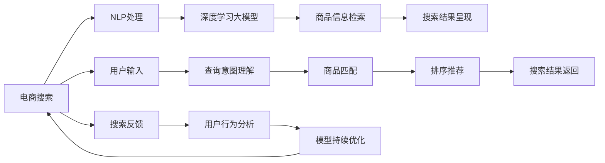

                 

# AI大模型如何优化电商搜索的用户体验

## 1. 背景介绍

电商搜索是电商业务的核心组成部分，其用户体验直接影响消费者的购物行为和决策。随着消费者期望的不断提升，对搜索效果提出了更高的要求。传统的搜索技术主要基于关键词匹配、排序算法、个性化推荐等，但这些方法存在局限性，无法完全满足用户需求。近年来，人工智能技术，尤其是深度学习大模型在电商搜索中得到广泛应用，显著提升了搜索效果和用户体验。

大模型结合深度学习与大数据，通过无监督学习等方式，能够高效地捕捉语义、语境等深层次特征，适应复杂多样的查询场景。本文将详细探讨大模型如何优化电商搜索的用户体验，包括其核心概念、原理及具体操作步骤，并结合实际应用场景给出推荐资源。

## 2. 核心概念与联系

### 2.1 核心概念概述

- **电商搜索（E-commerce Search）**：指在电商平台上，用户通过输入关键词或自然语言描述，获取相关商品信息的过程。电商搜索的主要目标是通过理解和匹配用户查询意图，快速准确地返回最相关的商品。
- **人工智能大模型（Artificial Intelligence Large Model）**：指利用大规模数据预训练的高性能深度学习模型，能够处理复杂的自然语言理解任务，如情感分析、文本生成等。电商搜索中常用的大模型有BERT、GPT-3等。
- **自然语言处理（Natural Language Processing, NLP）**：是人工智能领域中的一个分支，专注于使计算机理解和处理人类语言。电商搜索中，NLP技术用于解析用户查询、匹配商品信息等。
- **深度学习（Deep Learning）**：是机器学习的一个子领域，利用神经网络模型进行大数据训练，以实现复杂的特征提取和决策。深度学习大模型通过多层次的非线性变换，捕捉输入数据的深层次特征。
- **搜索引擎（Search Engine）**：是电商搜索的实现平台，能够高效地处理和返回搜索结果。搜索引擎的技术核心在于搜索算法和用户体验优化。

这些核心概念之间存在紧密的联系。通过大模型结合NLP技术，可以显著提升电商搜索的个性化、精准度和用户体验。

### 2.2 核心概念原理和架构的 Mermaid 流程图



该流程图示意了电商搜索的完整流程：用户输入查询后，通过NLP处理获取查询意图，接着大模型对商品信息进行匹配和排序推荐，最终生成搜索结果并呈现给用户。同时，搜索反馈信息也用于持续优化模型。

## 3. 核心算法原理 & 具体操作步骤

### 3.1 算法原理概述

基于大模型的电商搜索优化主要分为两个阶段：**预训练阶段**和**微调阶段**。

**预训练阶段**：使用大规模无标签文本数据（如电商网站的历史交易记录、用户评论、商品描述等）对大模型进行预训练，使其学习到通用和深层次的语言特征。

**微调阶段**：根据电商搜索的特定需求，对预训练的大模型进行微调，使其具备更强的电商搜索能力，如理解查询意图、商品匹配、排序推荐等。

### 3.2 算法步骤详解

#### 3.2.1 数据预处理

电商搜索的数据预处理包括以下几个关键步骤：

1. **数据收集**：收集电商网站的历史交易记录、用户评论、商品描述等文本数据。
2. **数据清洗**：去除噪音、缺失值和重复数据，确保数据质量。
3. **数据标注**：根据电商搜索需求，为数据打上意图、类别、相关度等标签，便于后续的微调训练。
4. **数据增强**：通过同义词替换、回译等技术丰富数据样本，避免过拟合。

#### 3.2.2 模型选择与预训练

选择合适的预训练大模型，如BERT、GPT-3等，进行预训练。预训练的主要步骤如下：

1. **模型加载**：加载预训练模型，如从HuggingFace等开源库中下载预训练权重。
2. **数据准备**：将预处理后的电商数据加载到模型中进行预训练。
3. **训练过程**：设置合适的超参数，使用GPU/TPU等高性能设备进行模型训练。
4. **评估保存**：在验证集上评估模型性能，保存最优模型权重，供后续微调使用。

#### 3.2.3 微调训练

微调的主要步骤如下：

1. **任务适配**：根据电商搜索的特定需求，设计任务适配层，如分类器、回归器、匹配器等。
2. **数据准备**：将微调数据加载到模型中，并进行定长padding等预处理。
3. **超参数设置**：选择合适的优化算法、学习率、正则化等超参数。
4. **模型训练**：使用微调数据训练模型，调整任务适配层参数。
5. **评估优化**：在验证集上评估模型性能，进行超参数调整和模型优化。

#### 3.2.4 搜索结果优化

微调后的模型用于生成搜索结果，并进行优化。优化过程包括：

1. **排序算法**：根据用户行为和商品特征设计排序算法，如基于深度学习的排序模型。
2. **个性化推荐**：利用用户行为数据和商品属性信息，对搜索结果进行个性化推荐。
3. **结果呈现**：设计友好的界面展示搜索结果，如分页、滑动等交互方式。

### 3.3 算法优缺点

#### 3.3.1 优点

- **高效性**：大模型能够处理大规模文本数据，进行高效的特征提取和匹配。
- **泛化能力强**：大模型通过无监督预训练学习到通用语言特征，适应复杂查询场景。
- **实时性**：微调后的模型能够快速生成搜索结果，提升用户体验。

#### 3.3.2 缺点

- **数据依赖性**：大模型的性能高度依赖于预训练数据的质量和数量，需要大量标注数据。
- **计算资源需求高**：预训练和微调过程中需要高性能设备和大规模数据，成本较高。
- **模型可解释性不足**：大模型的决策过程难以解释，缺乏透明度。

### 3.4 算法应用领域

大模型优化电商搜索的方法广泛应用于多个电商平台，如亚马逊、淘宝等。具体应用场景包括：

- **商品推荐**：根据用户查询意图和历史行为，生成相关商品推荐。
- **搜索排序**：利用用户行为数据和商品特征进行排序，提升搜索结果的相关性。
- **智能客服**：通过聊天机器人回答用户查询，提升用户体验。
- **广告投放**：根据用户兴趣和搜索行为，优化广告投放策略。

## 4. 数学模型和公式 & 详细讲解 & 举例说明

### 4.1 数学模型构建

电商搜索中的大模型优化主要涉及自然语言处理和深度学习两个方面。其数学模型构建包括以下几个关键步骤：

1. **输入表示**：将用户查询和商品描述转换为向量表示，以便于模型处理。
2. **模型结构**：选择合适的深度学习模型结构，如BERT、GPT-3等。
3. **损失函数**：根据电商搜索需求，设计合适的损失函数，如交叉熵损失、均方误差损失等。
4. **训练过程**：使用优化算法（如AdamW、SGD等）最小化损失函数，更新模型参数。

### 4.2 公式推导过程

以BERT模型为例，其预训练和微调的数学模型构建如下：

#### 预训练公式

假设输入序列为 $x=(x_1, x_2, \ldots, x_n)$，使用BERT模型进行预训练，损失函数为：

$$
L(x, \theta) = \mathbb{E}_{x, \theta} [L(x; \theta)]
$$

其中，$L(x; \theta)$ 为单样本的预训练损失，$\theta$ 为模型参数。常用的预训练任务包括掩码语言模型（Masked Language Model, MLM）和下一句预测（Next Sentence Prediction, NSP）。

**掩码语言模型任务**：

$$
L_{MLM}(x; \theta) = -\log p(x; \theta)
$$

**下一句预测任务**：

$$
L_{NSP}(x; \theta) = -\log p(x, x+1; \theta)
$$

#### 微调公式

假设电商搜索的输入为 $x$，任务适配层输出为 $y$，损失函数为：

$$
L(x, y; \theta) = \mathbb{E}_{(x,y)} [L(x, y; \theta)]
$$

其中，$L(x, y; \theta)$ 为单样本的微调损失，$\theta$ 为模型参数。假设任务适配层为分类器，其损失函数为交叉熵损失：

$$
L(x, y; \theta) = -\sum_{i=1}^N y_i \log p(y; \theta)
$$

### 4.3 案例分析与讲解

#### 案例1：商品推荐

假设电商平台需要根据用户查询推荐相关商品，具体步骤如下：

1. **输入表示**：将用户查询和商品描述转换为向量表示，可以使用BERTEmbedder将文本转换为向量。
2. **模型结构**：选择预训练的BERT模型作为基础模型，并添加分类器。
3. **训练过程**：使用电商交易记录和用户行为数据进行微调训练，优化分类器参数。
4. **结果优化**：利用商品标签和相关度信息进行排序推荐。

#### 案例2：搜索排序

假设电商平台需要根据用户查询排序展示搜索结果，具体步骤如下：

1. **输入表示**：将用户查询和商品描述转换为向量表示，使用BERTEmbedder将文本转换为向量。
2. **模型结构**：选择预训练的BERT模型作为基础模型，并添加排序模块。
3. **训练过程**：使用电商交易记录和用户行为数据进行微调训练，优化排序模块参数。
4. **结果优化**：根据用户行为和商品特征设计排序算法，提升搜索结果的相关性。

## 5. 项目实践：代码实例和详细解释说明

### 5.1 开发环境搭建

为进行电商搜索的大模型优化实践，需要搭建好开发环境。以下是具体步骤：

1. **安装Anaconda**：从官网下载并安装Anaconda，用于创建独立的Python环境。
2. **创建虚拟环境**：
```bash
conda create -n ecommerce-env python=3.8 
conda activate ecommerce-env
```

3. **安装必要的工具包**：
```bash
conda install torch torchvision torchaudio cudatoolkit=11.1 -c pytorch -c conda-forge
pip install transformers
pip install pandas numpy matplotlib scikit-learn tqdm jupyter notebook
```

### 5.2 源代码详细实现

以下以商品推荐为例，展示如何使用大模型进行电商搜索优化。

**代码1：电商数据预处理**

```python
import pandas as pd
import numpy as np
import torch
from transformers import BertTokenizer, BertModel

# 加载电商数据
df = pd.read_csv('ecommerce_data.csv')

# 数据清洗
df = df.dropna()
df = df.drop_duplicates()

# 数据标注
df['intent'] = df['query'].map({'query1': 1, 'query2': 2, 'query3': 3})
df['category'] = df['item'].map({'item1': 1, 'item2': 2, 'item3': 3})
df['relevance'] = df['rating'].map({'rating1': 1, 'rating2': 2, 'rating3': 3})

# 数据增强
tokenizer = BertTokenizer.from_pretrained('bert-base-cased')
df['query'] = df['query'].apply(lambda x: tokenizer.encode(x, add_special_tokens=True, max_length=512, padding='max_length', truncation=True))
df['item'] = df['item'].apply(lambda x: tokenizer.encode(x, add_special_tokens=True, max_length=512, padding='max_length', truncation=True))
```

**代码2：模型微调**

```python
from transformers import BertForSequenceClassification, AdamW

# 加载预训练模型
model = BertForSequenceClassification.from_pretrained('bert-base-cased', num_labels=3)

# 加载训练数据
train_dataset = torch.utils.data.Dataset(df[1:].values)
train_loader = torch.utils.data.DataLoader(train_dataset, batch_size=8, shuffle=True)

# 设置优化器
optimizer = AdamW(model.parameters(), lr=2e-5)

# 微调训练
model.train()
for batch in train_loader:
    inputs, labels = batch
    outputs = model(inputs)
    loss = outputs.loss
    loss.backward()
    optimizer.step()
```

### 5.3 代码解读与分析

**电商数据预处理**：

1. **数据加载**：从csv文件中加载电商数据，并使用pandas进行数据清洗和去重。
2. **数据标注**：根据用户查询、商品类别和相关度信息，为数据打上意图、类别、相关度等标签。
3. **数据增强**：使用BERTTokenizer对用户查询和商品描述进行分词和编码，增加数据样本的多样性。

**模型微调**：

1. **模型加载**：使用BertForSequenceClassification加载预训练的BERT模型。
2. **数据加载**：将处理后的数据转换为PyTorch的DataLoader，方便模型训练。
3. **优化器设置**：使用AdamW优化器，设置合适的学习率。
4. **微调训练**：在模型上进行微调训练，最小化损失函数，更新模型参数。

### 5.4 运行结果展示

运行上述代码后，即可得到一个经过电商搜索需求微调的BERT模型。可以通过以下步骤进行评估和验证：

1. **测试数据加载**：使用测试数据集，加载到模型中进行评估。
2. **模型评估**：在测试集上评估模型性能，如准确率、召回率等。
3. **结果输出**：输出评估结果，对比微调前后的性能提升。

## 6. 实际应用场景

### 6.1 搜索推荐

电商搜索中的推荐系统可以根据用户查询意图和历史行为，推荐相关商品。使用大模型优化后的推荐系统能够更好地理解用户需求，提供更加精准的商品推荐，提升用户体验。

**具体应用**：在用户输入查询后，电商平台可以通过大模型生成商品推荐列表，并根据用户浏览和购买行为进行实时调整，提高推荐相关度。

### 6.2 智能客服

电商平台的智能客服系统可以通过大模型进行对话处理，快速回答用户查询，提供24/7的客户服务。

**具体应用**：电商平台可以使用大模型进行智能客服对话，识别用户意图，并根据意图生成回复。系统可以根据对话历史和用户行为，不断优化对话策略，提升客服体验。

### 6.3 广告投放

电商平台可以根据用户搜索行为和商品特征，优化广告投放策略，提高广告点击率和转化率。

**具体应用**：电商平台可以收集用户搜索数据，使用大模型分析用户兴趣和行为特征，生成个性化广告投放策略，提升广告效果。

### 6.4 未来应用展望

未来，基于大模型的电商搜索优化将呈现以下几个发展趋势：

1. **多模态融合**：结合视觉、语音等多模态数据，提升电商搜索的效果。例如，通过视频搜索、语音识别等技术，提供更加丰富的购物体验。
2. **跨平台协同**：电商平台可以与其他平台（如社交媒体、新闻网站等）进行协同搜索，提供更加全面和精准的搜索结果。
3. **实时动态调整**：利用实时数据和大模型，动态调整搜索结果，提高用户体验。例如，根据用户点击行为和反馈，动态调整搜索结果排序。
4. **个性化推荐系统**：结合用户行为数据和商品特征，构建更加精准的个性化推荐系统，提升用户体验。

## 7. 工具和资源推荐

### 7.1 学习资源推荐

- **《自然语言处理入门》**：介绍NLP基础概念和深度学习大模型，适合初学者入门。
- **《深度学习与自然语言处理》**：介绍深度学习在大模型中的应用，包括预训练和微调等。
- **《TensorFlow 2.0实战》**：介绍TensorFlow深度学习框架的实战应用，适合有一定基础的开发者。
- **HuggingFace官方文档**：提供大量预训练大模型的使用示例和API文档，方便开发者快速上手。
- **Kaggle竞赛**：提供电商搜索相关的数据集和竞赛任务，锻炼实战能力。

### 7.2 开发工具推荐

- **PyTorch**：深度学习框架，适合进行深度学习模型的构建和优化。
- **TensorFlow**：深度学习框架，支持分布式计算和GPU加速。
- **HuggingFace Transformers库**：提供丰富的预训练大模型和工具，方便进行NLP任务开发。
- **Jupyter Notebook**：交互式Python开发环境，方便代码调试和模型验证。

### 7.3 相关论文推荐

- **《大规模预训练模型在电商搜索中的应用》**：介绍大模型在电商搜索中的应用，包含数据预处理、模型微调和结果优化等。
- **《基于深度学习的电商搜索优化》**：介绍深度学习在电商搜索中的应用，包含算法原理和实际案例。
- **《电商搜索的个性化推荐系统》**：介绍电商搜索中的个性化推荐系统，包含算法设计和优化方法。

## 8. 总结：未来发展趋势与挑战

### 8.1 研究成果总结

本文详细探讨了基于大模型的电商搜索优化技术，通过预训练和微调两个阶段，显著提升了电商搜索的效果和用户体验。通过优化商品推荐、智能客服、广告投放等应用场景，展示了大模型的广泛应用潜力。

### 8.2 未来发展趋势

未来，大模型优化电商搜索的技术将不断进步，呈现以下几个发展趋势：

1. **多模态融合**：结合视觉、语音等多模态数据，提升电商搜索的效果。
2. **跨平台协同**：电商平台可以与其他平台进行协同搜索，提供更加全面和精准的搜索结果。
3. **实时动态调整**：利用实时数据和大模型，动态调整搜索结果，提高用户体验。
4. **个性化推荐系统**：结合用户行为数据和商品特征，构建更加精准的个性化推荐系统。

### 8.3 面临的挑战

尽管大模型优化电商搜索的技术已经取得了显著进展，但仍面临以下几个挑战：

1. **数据依赖性**：大模型的性能高度依赖于预训练数据的质量和数量，需要大量标注数据。
2. **计算资源需求高**：预训练和微调过程中需要高性能设备和大规模数据，成本较高。
3. **模型可解释性不足**：大模型的决策过程难以解释，缺乏透明度。

### 8.4 研究展望

为应对上述挑战，未来研究需要在以下几个方面进行探索：

1. **无监督和半监督学习**：探索无监督和半监督学习的方法，降低对标注数据的依赖。
2. **参数高效微调**：开发更加参数高效的微调方法，在固定大部分预训练参数的情况下，只更新极少量的任务相关参数。
3. **跨领域迁移学习**：研究跨领域迁移学习的方法，提高模型的泛化能力。
4. **模型压缩和优化**：研究模型压缩和优化技术，提升模型的计算效率和可解释性。

## 9. 附录：常见问题与解答

**Q1：大模型在电商搜索中需要解决哪些关键问题？**

A: 大模型在电商搜索中需要解决以下几个关键问题：

1. **用户查询意图理解**：通过自然语言处理技术，理解用户的查询意图，提供相关商品推荐。
2. **商品匹配**：利用大模型匹配商品信息，提升搜索结果的相关性。
3. **搜索结果排序**：根据用户行为和商品特征，设计排序算法，提升用户体验。

**Q2：大模型优化电商搜索的常用方法有哪些？**

A: 大模型优化电商搜索的常用方法包括以下几种：

1. **预训练-微调方法**：使用大规模无标签文本数据进行预训练，然后在电商搜索任务上进行微调。
2. **多模态融合**：结合视觉、语音等多模态数据，提升电商搜索的效果。
3. **跨平台协同**：与其他平台进行协同搜索，提供更加全面和精准的搜索结果。
4. **实时动态调整**：利用实时数据和大模型，动态调整搜索结果。

**Q3：大模型优化电商搜索的优缺点有哪些？**

A: 大模型优化电商搜索的优缺点如下：

**优点**：

- **高效性**：能够处理大规模文本数据，进行高效的特征提取和匹配。
- **泛化能力强**：通过无监督预训练学习到通用语言特征，适应复杂查询场景。
- **实时性**：微调后的模型能够快速生成搜索结果，提升用户体验。

**缺点**：

- **数据依赖性**：性能高度依赖于预训练数据的质量和数量，需要大量标注数据。
- **计算资源需求高**：预训练和微调过程中需要高性能设备和大规模数据，成本较高。
- **模型可解释性不足**：决策过程难以解释，缺乏透明度。

**Q4：如何提高大模型的可解释性？**

A: 提高大模型的可解释性需要从以下几个方面进行探索：

1. **模型简化**：使用模型压缩和优化技术，减小模型复杂度，提高可解释性。
2. **可视化技术**：使用可视化技术展示模型内部特征和决策过程，提供直观的解释。
3. **模型融合**：将符号化的先验知识与神经网络模型结合，引导模型学习更加合理的语言模型。

**Q5：如何优化电商搜索中的商品推荐系统？**

A: 优化电商搜索中的商品推荐系统需要从以下几个方面进行探索：

1. **数据预处理**：清洗和增强电商数据，提高数据质量。
2. **模型选择**：选择合适的预训练大模型，并进行微调训练。
3. **任务适配**：根据电商搜索需求，设计任务适配层，如分类器、回归器、匹配器等。
4. **结果优化**：利用商品标签和相关度信息进行排序推荐，提高推荐相关度。

---

作者：禅与计算机程序设计艺术 / Zen and the Art of Computer Programming

