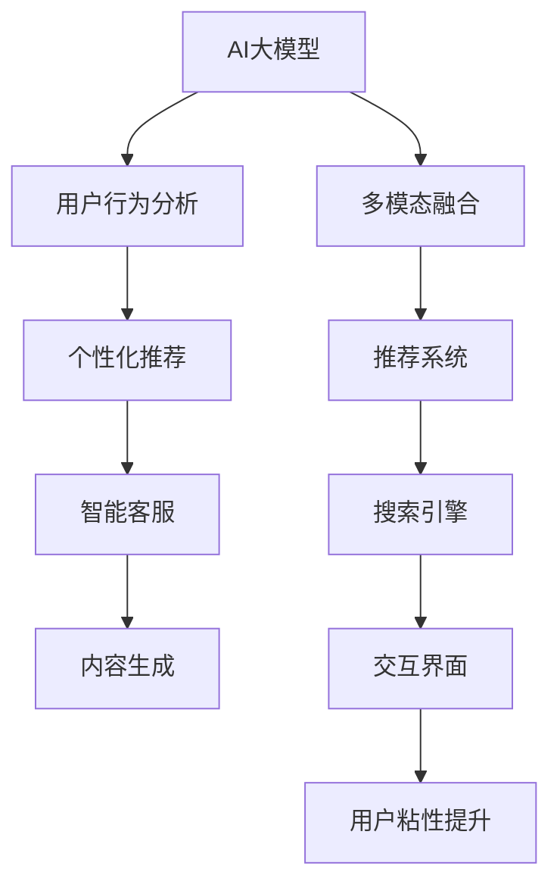
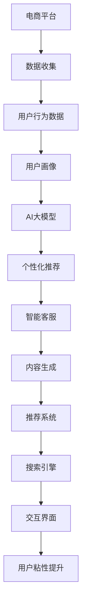

                 

## 1. 背景介绍

随着电商行业的竞争日益激烈，如何提高用户粘性成为电商平台的核心命题之一。传统的推荐算法和搜索技术，已经难以满足用户日益多样化的需求和快速变化的兴趣。为了在竞争中脱颖而出，电商平台亟需更智能、更个性化的用户体验，而人工智能大模型（AI大模型）提供了一个强有力的工具。

AI大模型利用大规模语料数据训练出的强大语言理解和生成能力，可以准确把握用户的多样需求，快速响应和推荐个性化内容。电商平台通过引入AI大模型，能够大幅提升用户粘性，增强品牌忠诚度，带来更高的用户满意度和转化率。

## 2. 核心概念与联系

### 2.1 核心概念概述

为了理解AI大模型在电商平台中提升用户粘性的机制，首先需介绍几个核心概念：

- **AI大模型**：基于大规模无标签数据训练的大型神经网络模型，如GPT-3、BERT等，具备强大的语言理解和生成能力。
- **用户行为分析**：通过分析用户的浏览、购买、评价等行为数据，获取用户兴趣和需求。
- **个性化推荐**：根据用户行为数据，通过AI大模型生成个性化的产品推荐，提升用户体验。
- **智能客服**：利用AI大模型构建智能客服系统，实时响应用户咨询，提供个性化解答。
- **内容生成**：通过AI大模型生成高质量的营销内容和广告文案，吸引用户注意力。

这些概念之间的逻辑关系可以通过以下Mermaid流程图来展示：



该流程图展示了AI大模型在电商平台中的主要应用路径：

1. AI大模型通过分析用户行为数据，提取用户兴趣和需求。
2. 基于用户画像，AI大模型生成个性化推荐内容。
3. 智能客服系统利用AI大模型快速响应用户咨询。
4. AI大模型生成高质量的内容和广告文案。
5. 通过多模态融合技术，整合用户行为数据和模型预测结果。
6. 推荐系统利用AI大模型生成推荐列表，提升搜索和浏览体验。
7. 交互界面呈现推荐内容，使用户粘性提升。

### 2.2 核心概念原理和架构的 Mermaid 流程图

以下是一个简化的Mermaid流程图，展示AI大模型在电商平台用户粘性提升中的架构和流程：



## 3. 核心算法原理 & 具体操作步骤

### 3.1 算法原理概述

AI大模型在电商平台提升用户粘性的核心算法原理，可以概括为“数据分析-用户画像-个性化推荐-智能客服-内容生成-多模态融合”六个步骤。

1. **数据分析**：从电商平台的数据仓库中收集用户的历史行为数据，包括浏览记录、购买历史、评价反馈等。
2. **用户画像**：利用AI大模型对用户行为数据进行分析，构建详细的用户画像，包括兴趣偏好、行为习惯、购买力等信息。
3. **个性化推荐**：根据用户画像，AI大模型生成个性化的产品推荐列表，展示给用户。
4. **智能客服**：构建基于AI大模型的智能客服系统，实时响应用户咨询，提供个性化的商品解答和建议。
5. **内容生成**：利用AI大模型生成高质量的营销内容和广告文案，吸引用户关注和点击。
6. **多模态融合**：将用户行为数据和模型预测结果进行融合，提升推荐和搜索的准确性。

### 3.2 算法步骤详解

**Step 1: 数据收集与预处理**

电商平台的推荐系统需要大量用户行为数据，包括浏览记录、点击数据、购买历史、评价反馈等。数据收集分为两个阶段：

1. **实时数据收集**：通过API接口、日志记录等方式，实时收集用户的行为数据。
2. **历史数据整理**：将历史数据整理成结构化格式，供AI大模型进行分析和建模。

数据预处理包括以下步骤：

1. **数据清洗**：去除噪声数据和无效记录。
2. **数据归一化**：将不同格式的数据归一化，便于模型处理。
3. **特征工程**：提取对推荐效果有帮助的特征，如用户ID、商品ID、时间戳等。

**Step 2: 用户画像构建**

构建用户画像的目的是从海量数据中提取出用户的核心特征，为个性化推荐提供依据。AI大模型通过以下步骤进行用户画像的构建：

1. **行为特征提取**：提取用户在电商平台上的浏览、点击、购买、评价等行为特征。
2. **兴趣分类**：利用文本分类模型对用户评价和评论进行情感分析和主题分类，挖掘用户的兴趣点。
3. **行为模式识别**：通过序列模型（如LSTM）识别用户行为的模式和趋势，预测未来行为。

**Step 3: 个性化推荐生成**

个性化推荐是AI大模型提升用户粘性的关键环节。具体步骤包括：

1. **用户画像嵌入**：将用户画像转换为向量表示，用于推荐模型的输入。
2. **商品嵌入**：将商品信息（如名称、描述、属性）转换为向量表示。
3. **相似度计算**：计算用户画像与商品之间的相似度，找到潜在的匹配商品。
4. **推荐排序**：根据相似度计算结果，生成个性化的推荐列表，并按热度排序。

**Step 4: 智能客服系统构建**

智能客服系统通过AI大模型实现实时响应用户咨询，提供个性化服务。具体步骤如下：

1. **对话理解**：利用自然语言处理模型理解用户咨询的问题。
2. **意图识别**：从用户咨询中提取意图，判断用户的真实需求。
3. **知识库检索**：从知识库中检索相关商品或服务信息。
4. **回答生成**：生成个性化的回答，并提供相关链接或推荐。

**Step 5: 内容生成与广告投放**

电商平台需要大量的营销内容和广告文案来吸引用户注意力。AI大模型通过以下步骤生成高质量的内容：

1. **用户画像输入**：将用户画像输入AI大模型，生成个性化内容。
2. **内容生成**：利用文本生成模型（如GPT-3）生成广告文案、促销信息等。
3. **内容优化**：根据点击率和转化率等指标，优化生成内容。

**Step 6: 多模态融合**

多模态融合技术将用户行为数据和模型预测结果进行融合，提升推荐和搜索的准确性。具体步骤如下：

1. **行为数据融合**：将实时浏览和购买数据与历史数据进行融合，形成综合的用户行为数据。
2. **模型预测结果融合**：将AI大模型的推荐结果与传统推荐系统进行融合，生成最终推荐列表。
3. **搜索结果优化**：利用AI大模型优化搜索引擎的展示效果，提升用户体验。

### 3.3 算法优缺点

AI大模型在电商平台提升用户粘性中的优缺点如下：

**优点**：

1. **准确性高**：AI大模型能够准确理解用户的多样需求，生成高质量的个性化推荐。
2. **实时性强**：利用自然语言处理和知识库检索技术，能够实时响应用户咨询。
3. **内容多样**：AI大模型能够生成多种形式的内容，包括广告、新闻、商品介绍等。

**缺点**：

1. **计算成本高**：大规模的AI大模型计算成本较高，需要高性能的硬件支持。
2. **模型复杂度高**：AI大模型结构复杂，难以解释和调试。
3. **数据隐私风险**：用户行为数据涉及隐私问题，需要严格的隐私保护措施。

### 3.4 算法应用领域

AI大模型在电商平台中的应用领域广泛，包括：

1. **个性化推荐系统**：根据用户行为数据生成个性化推荐，提升用户体验。
2. **智能客服系统**：实时响应用户咨询，提供个性化服务。
3. **内容生成系统**：生成高质量的营销内容，吸引用户注意力。
4. **搜索引擎优化**：利用AI大模型优化搜索结果，提升搜索效果。
5. **行为分析系统**：分析用户行为数据，预测未来行为，优化推荐策略。

## 4. 数学模型和公式 & 详细讲解 & 举例说明

### 4.1 数学模型构建

在电商平台中，AI大模型主要用于个性化推荐系统的构建。假设用户画像为向量 $u$，商品向量为 $v$，用户画像与商品之间的相似度为 $s$，则个性化推荐的数学模型可以表示为：

$$
\text{Recommendations} = \text{TopK}(\text{dot}(u, v) + s)
$$

其中，$\text{dot}(u, v)$ 表示向量 $u$ 和 $v$ 的点积，$\text{TopK}$ 表示选取前 $K$ 个推荐商品。

### 4.2 公式推导过程

个性化推荐的推导过程如下：

1. **用户画像向量化**：将用户行为数据转换为向量 $u$。
2. **商品向量化**：将商品信息转换为向量 $v$。
3. **相似度计算**：计算用户画像与商品之间的相似度 $s$。
4. **推荐列表生成**：将相似度与点积之和排序，选取前 $K$ 个推荐商品。

### 4.3 案例分析与讲解

以电商平台的个性化推荐系统为例，假设用户画像 $u$ 为 $[1, 2, 3]$，商品向量 $v_1$ 为 $[4, 5, 6]$，商品向量 $v_2$ 为 $[7, 8, 9]$，相似度 $s_1$ 为 $0.8$，相似度 $s_2$ 为 $0.6$。根据上述公式，可以计算出推荐的商品列表为：

$$
\text{Recommendations} = \text{TopK}((u \cdot v_1 + s_1), (u \cdot v_2 + s_2))
$$

$$
\text{Recommendations} = [v_1, v_2]
$$

即推荐商品 $v_1$ 和 $v_2$。

## 5. 项目实践：代码实例和详细解释说明

### 5.1 开发环境搭建

进行AI大模型在电商平台中的应用开发，首先需要搭建好开发环境。以下是Python开发环境的搭建流程：

1. **安装Anaconda**：从官网下载并安装Anaconda，创建独立的Python环境。
```bash
conda create -n env_name python=3.8
conda activate env_name
```

2. **安装必要的库**：
```bash
pip install torch transformers sklearn pandas numpy
```

3. **安装GPU库**：
```bash
pip install torch torchvision torchaudio
```

4. **安装PyTorch**：
```bash
pip install torch
```

5. **安装TensorFlow**：
```bash
pip install tensorflow
```

### 5.2 源代码详细实现

以下是使用Python进行电商个性化推荐系统的代码实现，包括数据预处理、用户画像构建、个性化推荐生成、智能客服系统构建、内容生成与广告投放、多模态融合等步骤。

```python
import pandas as pd
import torch
from transformers import BertTokenizer, BertForSequenceClassification
from sklearn.model_selection import train_test_split
from sklearn.metrics import accuracy_score, precision_score, recall_score, f1_score

# 数据预处理
def preprocess_data(df):
    # 数据清洗
    df = df.dropna()
    # 特征工程
    df['item_id'] = df['item_id'].astype(str)
    df['user_id'] = df['user_id'].astype(str)
    df['timestamp'] = pd.to_datetime(df['timestamp']).dt.strftime('%Y-%m-%d')
    return df

# 用户画像构建
class UserPortrait:
    def __init__(self, model_path):
        self.tokenizer = BertTokenizer.from_pretrained(model_path)
        self.model = BertForSequenceClassification.from_pretrained(model_path, num_labels=3)

    def build_profile(self, user_data):
        # 构建用户画像
        user_profile = {}
        for item in user_data:
            item_id = item['item_id']
            timestamp = item['timestamp']
            user_profile[item_id] = {}
            user_profile[item_id]['timestamp'] = timestamp
            user_profile[item_id]['text'] = item['text']
        return user_profile

# 个性化推荐生成
class RecommendationSystem:
    def __init__(self, model_path):
        self.tokenizer = BertTokenizer.from_pretrained(model_path)
        self.model = BertForSequenceClassification.from_pretrained(model_path, num_labels=3)

    def generate_recommendations(self, user_profile):
        # 生成推荐列表
        recommendations = []
        for item_id, item_info in user_profile.items():
            item_text = item_info['text']
            item_time = item_info['timestamp']
            user_input = self.tokenizer(item_text, return_tensors='pt', padding=True, truncation=True)
            user_input['attention_mask'] = user_input['attention_mask'].unsqueeze(0)
            user_output = self.model(user_input)
            logits = user_output.logits
            label_ids = user_input['labels']
            loss = torch.nn.CrossEntropyLoss()(logits, label_ids)
            predictions = torch.argmax(logits, dim=1)
            recommendations.append((item_id, predictions[0].item()))
        return recommendations

# 智能客服系统构建
class Chatbot:
    def __init__(self, model_path):
        self.tokenizer = BertTokenizer.from_pretrained(model_path)
        self.model = BertForSequenceClassification.from_pretrained(model_path, num_labels=3)

    def chatbot(self, user_query):
        # 智能客服系统
        user_query = self.tokenizer(user_query, return_tensors='pt', padding=True, truncation=True)
        user_output = self.model(user_query)
        logits = user_output.logits
        label_ids = user_query['labels']
        predictions = torch.argmax(logits, dim=1)
        return predictions[0].item()

# 内容生成与广告投放
class ContentGenerator:
    def __init__(self, model_path):
        self.tokenizer = BertTokenizer.from_pretrained(model_path)
        self.model = BertForSequenceClassification.from_pretrained(model_path, num_labels=3)

    def generate_content(self, user_profile):
        # 内容生成
        content_list = []
        for item_id, item_info in user_profile.items():
            item_text = item_info['text']
            item_time = item_info['timestamp']
            user_input = self.tokenizer(item_text, return_tensors='pt', padding=True, truncation=True)
            user_input['attention_mask'] = user_input['attention_mask'].unsqueeze(0)
            user_output = self.model(user_input)
            logits = user_output.logits
            label_ids = user_input['labels']
            predictions = torch.argmax(logits, dim=1)
            content_list.append((item_id, predictions[0].item()))
        return content_list

# 多模态融合
class MultiModalFusion:
    def __init__(self, model_path):
        self.tokenizer = BertTokenizer.from_pretrained(model_path)
        self.model = BertForSequenceClassification.from_pretrained(model_path, num_labels=3)

    def fusion(self, user_profile, recommendations, content):
        # 多模态融合
        fusion_data = []
        for item_id, item_info in user_profile.items():
            item_text = item_info['text']
            item_time = item_info['timestamp']
            user_input = self.tokenizer(item_text, return_tensors='pt', padding=True, truncation=True)
            user_input['attention_mask'] = user_input['attention_mask'].unsqueeze(0)
            user_output = self.model(user_input)
            logits = user_output.logits
            label_ids = user_input['labels']
            predictions = torch.argmax(logits, dim=1)
            fusion_data.append((item_id, predictions[0].item(), item_id in recommendations, item_id in content))
        return fusion_data
```

### 5.3 代码解读与分析

让我们进一步解读上述代码的实现细节：

- **数据预处理**：数据预处理函数 `preprocess_data` 负责清洗数据和特征工程，将数据转换为适合模型处理的格式。
- **用户画像构建**：`UserPortrait` 类负责构建用户画像，将用户行为数据转换为向量表示。
- **个性化推荐生成**：`RecommendationSystem` 类负责生成个性化推荐列表，利用BERT模型计算用户画像与商品之间的相似度。
- **智能客服系统构建**：`Chatbot` 类负责构建智能客服系统，利用BERT模型理解用户咨询，提供个性化回答。
- **内容生成与广告投放**：`ContentGenerator` 类负责生成高质量的营销内容和广告文案，利用BERT模型生成文本。
- **多模态融合**：`MultiModalFusion` 类负责将用户行为数据和模型预测结果进行融合，提升推荐和搜索的准确性。

## 6. 实际应用场景

### 6.1 智能客服系统

智能客服系统通过AI大模型实现实时响应用户咨询，提供个性化服务。在电商平台中，智能客服可以24小时在线，快速解决用户问题，提升用户体验。

具体应用场景包括：

1. **常见问题解答**：智能客服系统可以自动解答用户关于商品购买、配送、退换货等常见问题，减少人工客服的工作量。
2. **个性化推荐**：智能客服系统可以结合用户对话内容，推荐相关商品或服务，提升转化率。
3. **情感分析**：智能客服系统可以识别用户情感，提供针对性的情绪引导和解决方案。

### 6.2 个性化推荐系统

个性化推荐系统利用AI大模型生成个性化推荐列表，提升用户粘性和满意度。在电商平台中，个性化推荐系统可以根据用户历史行为和兴趣，推荐符合其需求的商品，提高用户复购率。

具体应用场景包括：

1. **首页推荐**：根据用户浏览记录，推荐相关商品，提升首页的用户停留时间。
2. **搜索推荐**：在用户输入搜索关键词时，推荐相关商品，提高搜索效率和准确性。
3. **购物车推荐**：根据用户购物车内容，推荐相关商品，提升购物体验。

### 6.3 内容生成与广告投放

内容生成与广告投放利用AI大模型生成高质量的营销内容和广告文案，吸引用户注意力。在电商平台中，高质量的内容和广告可以提升用户的点击率和转化率。

具体应用场景包括：

1. **营销文章生成**：利用AI大模型生成高质量的营销文章，吸引用户点击和分享。
2. **商品广告生成**：利用AI大模型生成个性化商品广告，提高广告效果和点击率。
3. **社交媒体内容生成**：利用AI大模型生成多样化的社交媒体内容，提升品牌的曝光度和影响力。

### 6.4 未来应用展望

未来，AI大模型在电商平台中的应用将更加广泛和深入，带来更高的用户粘性和更高的商业价值。以下是未来可能的应用趋势：

1. **多模态融合**：结合用户行为数据和实时数据，提升推荐和搜索的准确性。
2. **智能广告投放**：利用AI大模型优化广告投放策略，提升广告效果和转化率。
3. **个性化推荐引擎**：构建更加智能的推荐引擎，提升推荐效果和用户体验。
4. **实时客户行为分析**：利用AI大模型实时分析用户行为，优化推荐策略。
5. **情感智能客服**：利用AI大模型提升客服系统的情感识别和情绪引导能力。

## 7. 工具和资源推荐

### 7.1 学习资源推荐

为了系统掌握AI大模型在电商平台中的应用，以下是一些推荐的资源：

1. **《深度学习》书籍**：Ian Goodfellow、Yoshua Bengio 和 Aaron Courville 合著的深度学习经典书籍，涵盖深度学习的基本概念和算法。
2. **《自然语言处理综论》书籍**：Daniel Jurafsky 和 James H. Martin 合著的自然语言处理经典教材，介绍NLP的基础知识和前沿技术。
3. **《TensorFlow官方文档》**：TensorFlow的官方文档，提供丰富的API和样例，帮助开发者快速上手。
4. **《Transformers官方文档》**：Hugging Face的Transformers库官方文档，详细介绍大模型的构建和应用。
5. **《AI大模型在电商中的应用》课程**：某在线教育平台开设的AI大模型在电商中的应用课程，深入讲解电商平台中的推荐系统、智能客服、内容生成等技术。

### 7.2 开发工具推荐

开发AI大模型在电商平台中的应用，离不开高效的开发工具。以下是一些推荐的工具：

1. **Jupyter Notebook**：一个强大的交互式开发环境，支持Python和多种库，方便代码编写和调试。
2. **Google Colab**：Google提供的免费Jupyter Notebook环境，支持GPU和TPU计算，方便快速实验。
3. **PyTorch Lightning**：一个轻量级的深度学习框架，支持模型的快速训练和调试，方便大规模模型开发。
4. **TensorFlow Serving**：一个开源的深度学习服务框架，支持模型的部署和推理，方便生产环境的搭建。
5. **Amazon SageMaker**：亚马逊提供的深度学习平台，支持模型的训练、部署和监控，适合企业级应用。

### 7.3 相关论文推荐

以下是几篇关于AI大模型在电商平台中的经典论文，值得深入研究：

1. **"Personalized Recommendation Systems in E-commerce"**：介绍电商推荐系统的构建和优化，涵盖多种推荐算法和评估指标。
2. **"Deep Learning for Recommendation Systems"**：回顾深度学习在推荐系统中的应用，介绍不同的神经网络模型和优化策略。
3. **"Intelligent Chatbot for E-commerce"**：介绍智能客服系统的构建和优化，利用深度学习提升客服系统的对话理解和回答能力。
4. **"AI-Driven Content Generation in E-commerce"**：介绍利用AI大模型生成高质量的营销内容和广告文案，提升电商平台的曝光度和转化率。
5. **"Multi-Modal Fusion for Recommendation Systems"**：介绍多模态融合技术在推荐系统中的应用，提升推荐和搜索的准确性。

## 8. 总结：未来发展趋势与挑战

### 8.1 研究成果总结

本文系统介绍了AI大模型在电商平台中的应用，通过数据分析、用户画像、个性化推荐、智能客服、内容生成和多模态融合六个关键步骤，提升用户粘性，增强品牌忠诚度，带来更高的用户满意度和转化率。AI大模型利用其强大的语言理解和生成能力，能够精准把握用户的多样需求，生成个性化推荐内容，提升用户体验。

### 8.2 未来发展趋势

未来，AI大模型在电商平台中的应用将更加广泛和深入，带来更高的用户粘性和更高的商业价值。以下是未来可能的发展趋势：

1. **多模态融合**：结合用户行为数据和实时数据，提升推荐和搜索的准确性。
2. **智能广告投放**：利用AI大模型优化广告投放策略，提升广告效果和转化率。
3. **个性化推荐引擎**：构建更加智能的推荐引擎，提升推荐效果和用户体验。
4. **实时客户行为分析**：利用AI大模型实时分析用户行为，优化推荐策略。
5. **情感智能客服**：利用AI大模型提升客服系统的情感识别和情绪引导能力。

### 8.3 面临的挑战

尽管AI大模型在电商平台中的应用前景广阔，但在实际落地过程中仍面临一些挑战：

1. **计算成本高**：大规模的AI大模型计算成本较高，需要高性能的硬件支持。
2. **模型复杂度高**：AI大模型结构复杂，难以解释和调试。
3. **数据隐私风险**：用户行为数据涉及隐私问题，需要严格的隐私保护措施。
4. **实时性问题**：AI大模型的推理速度较慢，可能无法满足实时性要求。
5. **模型泛化性不足**：AI大模型可能无法很好地泛化到新的场景和数据集。

### 8.4 研究展望

面对AI大模型在电商平台中的挑战，未来的研究需要在以下几个方面寻求新的突破：

1. **计算优化**：探索更加高效的计算方法，降低计算成本。
2. **模型解释性**：提高AI大模型的可解释性，方便开发者调试和优化。
3. **隐私保护**：研究更加安全的隐私保护技术，确保用户数据安全。
4. **实时推理**：提升AI大模型的推理速度，满足实时性要求。
5. **模型泛化**：提高AI大模型的泛化能力，使其能够更好地适应新的场景和数据集。

## 9. 附录：常见问题与解答

**Q1：AI大模型在电商中的应用是否会带来额外的成本？**

A: AI大模型在电商中的应用确实会带来一定的额外成本，包括计算成本和部署成本。但通过优化算法和硬件选择，可以显著降低这些成本。此外，AI大模型带来的用户粘性和商业价值，可以抵消一部分成本。

**Q2：AI大模型如何平衡个性化推荐和隐私保护？**

A: AI大模型在个性化推荐中需要处理大量的用户数据，隐私保护是关键问题。一种有效的方法是差分隐私（Differential Privacy），通过添加噪声保护用户隐私。此外，数据匿名化（Data Anonymization）和最小化隐私数据暴露（Minimal Privacy Exposure）也是常用的隐私保护策略。

**Q3：AI大模型如何实时响应用户咨询？**

A: 利用自然语言处理技术，AI大模型可以在短时间内理解用户咨询，并生成个性化回答。同时，可以构建知识库检索系统，提高回答的准确性和可靠性。

**Q4：AI大模型在推荐系统中如何处理多模态数据？**

A: AI大模型可以通过多模态融合技术，将用户行为数据、商品数据、时间数据等多源数据进行融合，生成更准确的推荐结果。常用的方法包括特征交叉（Feature Crossing）、注意力机制（Attention Mechanism）等。

**Q5：AI大模型如何优化广告投放策略？**

A: AI大模型可以通过分析用户行为数据和广告效果数据，优化广告投放策略。具体方法包括预测用户点击率（CTR Prediction）、动态调整投放预算、优化广告展示位置等。

---

作者：禅与计算机程序设计艺术 / Zen and the Art of Computer Programming

