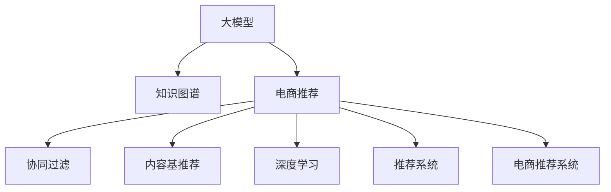

                 

# AI大模型视角下电商搜索推荐的技术创新知识图谱构建方法改进与优化

> 关键词：电商搜索推荐,知识图谱,大模型,技术创新,构建方法,改进与优化

## 1. 背景介绍

### 1.1 问题由来

随着电商行业的快速发展，个性化推荐系统的应用越来越广泛，旨在通过分析用户行为数据，精准预测用户需求，为其推荐最合适的商品。传统推荐系统主要依赖于基于协同过滤和内容基推荐方法，但面临数据稀疏性、冷启动、多样化需求等挑战。为此，深度学习和大规模预训练语言模型(如BERT、GPT-3等)在电商推荐领域被广泛引入，通过学习海量用户行为数据，捕捉商品语义信息和用户兴趣，极大提升了推荐的个性化和效果。

然而，大模型在电商推荐中的应用还面临一些关键问题：数据隐私保护、模型泛化能力、推理效率等。近年来，知识图谱(Knowledge Graph, KG)作为一种结构化数据表示形式，被提出并广泛应用于电商推荐。知识图谱通过构建商品、用户、交易三元组，将实体和关系抽取成图谱结构，形成商品间关系网络，辅助推荐系统更好地理解商品属性和用户兴趣。然而，知识图谱在电商推荐中的应用仍存在一些瓶颈问题，如高质量KG构建、KG融合技术、KG推理能力等，如何改进和优化，使其在大模型推荐系统中发挥最大效用，成为当前亟需解决的关键问题。

### 1.2 问题核心关键点

- 电商推荐系统如何借助大模型和知识图谱提升推荐效果？
- 如何有效构建高质量电商领域的知识图谱？
- 如何将知识图谱和大模型结合，进行电商推荐？
- 如何改进和优化知识图谱融合方法，提升推荐系统性能？

### 1.3 问题研究意义

改进和优化知识图谱在电商推荐中的应用，对于提升推荐系统个性化水平、增强用户满意度、提高电商企业的市场竞争力具有重要意义。

1. 提高推荐效果：通过引入知识图谱，大模型可以更好理解商品之间的语义关系，从而提高推荐系统的个性化和效果。
2. 增强用户满意度：高质量的知识图谱能够捕捉商品的属性和用户兴趣，通过大模型的知识迁移能力，提升推荐系统对用户需求的预测准确度。
3. 提高市场竞争力：知识图谱和大模型的结合，有助于电商企业更好地理解市场趋势和用户需求，打造差异化的推荐策略，增强市场竞争力。
4. 推动技术创新：知识图谱在电商推荐中的应用，促进了深度学习和知识表示的深度融合，推动了电商领域的技术创新。
5. 赋能产业升级：知识图谱结合大模型的电商推荐系统，为传统电商行业带来了新的技术路径，促进了电商行业的数字化转型升级。

## 2. 核心概念与联系

### 2.1 核心概念概述

为更好地理解知识图谱在大模型电商推荐系统中的应用，本节将介绍几个密切相关的核心概念：

- 大模型(Large Model)：以Transformer为基础的深度学习模型，通过大规模语料预训练，获得通用的语言表示能力。在电商推荐中，大模型可以捕捉商品描述、用户评价、商品属性等复杂信息，辅助知识图谱进行推理。
- 知识图谱(Knowledge Graph, KG)：以图结构表示实体和关系的知识库，通过RDF、OWL等语义标准，刻画实体之间的语义关系。在电商推荐中，知识图谱可以构建商品、用户、交易等实体之间的关系网络，辅助大模型进行语义推理。
- 推荐系统(Recommendation System)：通过分析用户历史行为数据，预测用户对商品的需求，为其推荐最合适的商品。电商推荐系统旨在提高用户的购物体验，增强平台的活跃度和营收。
- 协同过滤(Collaborative Filtering, CF)：基于用户和商品间的相似度，为用户推荐其未交互过的商品。常用方式包括基于用户的CF、基于物品的CF等。
- 内容基推荐(Content-Based Recommendation)：基于用户兴趣和商品属性，为用户推荐满足其兴趣的商品。常用方式包括基于内容的CF、混合推荐系统等。
- 深度学习(Deep Learning)：通过多层神经网络模型，学习和提取复杂非线性关系。在电商推荐中，深度学习模型被用于预测用户行为，提高推荐系统效果。

这些核心概念之间的逻辑关系可以通过以下Mermaid流程图来展示：



这个流程图展示了大模型、知识图谱、推荐系统、协同过滤、内容基推荐、深度学习、电商推荐系统等概念之间的相互关系。通过理解这些核心概念，我们可以更好地把握电商推荐系统中知识图谱和大模型的应用框架。

## 3. 核心算法原理 & 具体操作步骤
### 3.1 算法原理概述

在大模型视角下，知识图谱通过融合结构化信息，增强了大模型对商品语义和用户兴趣的建模能力，从而提升推荐系统的效果。具体而言，知识图谱在大模型电商推荐系统中的应用，主要包括实体抽取、关系抽取、实体对齐、知识推理等几个关键步骤。

实体抽取是从商品描述、用户评价等文本数据中，自动抽取商品名称、类别、品牌等实体，形成实体图谱。关系抽取是从商品描述、用户评价等文本数据中，自动抽取商品间、用户间的关联关系，形成关系图谱。实体对齐是将自动抽取的实体和知识图谱中的实体进行匹配对齐，构建统一的知识图谱。知识推理是通过大模型对知识图谱进行语义推理，预测商品间的语义关系，提升推荐系统效果。

在算法原理上，知识图谱和大模型的结合，可以视为一种多模态学习范式，通过将文本数据和结构化数据相结合，构建更为丰富、深入的语义表示。大模型通过学习文本数据，获得商品的语义表示；知识图谱通过学习结构化数据，获得商品的关系表示。两者的结合，可以使得推荐系统具备更强的语义理解和推理能力，从而提高推荐效果。

### 3.2 算法步骤详解

大模型视角下，知识图谱在电商推荐系统中的应用，主要包括以下几个关键步骤：

**Step 1: 准备电商数据和知识图谱**

- 收集电商领域的商品数据、用户数据和交易数据，如商品名称、描述、价格、销量、评分等。
- 构建电商领域的知识图谱，通过商品、用户、交易等实体，以及商品类别、品牌、描述等属性，建立商品间的关系网络。

**Step 2: 自动抽取实体和关系**

- 使用自然语言处理(NLP)工具，自动抽取商品描述中的实体，如商品名称、类别、品牌等。
- 使用关系抽取模型，自动抽取商品间、用户间的关联关系，如商品类别、品牌、销量等。

**Step 3: 实体对齐**

- 将自动抽取的实体与知识图谱中的实体进行匹配对齐，构建统一的知识图谱。
- 使用匹配算法，如基于规则的对齐、基于机器学习的对齐等，对实体进行对齐。

**Step 4: 知识推理**

- 使用大模型，对知识图谱进行语义推理，预测商品间的语义关系。
- 使用神经网络模型，如GNN、GRU等，对知识图谱进行关系推理，提升推荐效果。

**Step 5: 融合知识图谱和大模型**

- 将知识图谱与大模型结合，构建多模态学习模型，学习商品间的语义关系。
- 将知识图谱与大模型进行融合，通过多模态学习，提升推荐系统效果。

**Step 6: 评估和优化**

- 在测试集上评估融合知识图谱和大模型的推荐系统效果。
- 根据评估结果，调整模型参数，优化模型性能。

### 3.3 算法优缺点

知识图谱在大模型电商推荐系统中的应用，具有以下优点：

1. 提升推荐效果：通过融合结构化信息，大模型能够更好地理解商品间的语义关系，提高推荐系统的个性化和效果。
2. 增强知识迁移：知识图谱通过结构化数据，为电商推荐提供了先验知识，增强了大模型的知识迁移能力。
3. 改善推荐公平性：知识图谱通过刻画商品间的关系，可以避免单一特征对推荐结果的影响，提升推荐系统的公平性。

同时，该方法也存在一定的局限性：

1. 数据收集难度大：知识图谱的构建需要收集大量的结构化数据，面临数据获取的挑战。
2. 高质量KG构建困难：高质量的知识图谱构建难度大，需要人工标注或自动化抽取。
3. 知识推理复杂：知识图谱的语义推理复杂，需要设计高效的推理算法。
4. 推理效率低：知识图谱在大模型中的应用，需要额外的时间进行推理，影响推理效率。

尽管存在这些局限性，但知识图谱在大模型电商推荐系统中的应用，已展现出巨大的潜力，成为电商推荐系统的重要组成部分。

### 3.4 算法应用领域

知识图谱在大模型电商推荐系统中的应用，已经广泛应用于以下领域：

- 商品推荐：通过商品、用户、交易等实体的语义关系，为用户推荐最合适的商品。
- 用户画像：通过用户行为数据，自动构建用户画像，提升个性化推荐效果。
- 搜索排序：通过知识图谱对商品间的语义关系进行理解，提升搜索结果的相关性和准确性。
- 广告推荐：通过知识图谱，分析商品间的关联关系，提高广告推荐的针对性和效果。
- 营销分析：通过知识图谱，分析市场趋势和用户需求，为电商企业提供营销策略支持。

除了上述这些经典应用外，知识图谱结合大模型的电商推荐技术，还在智能客服、库存管理、售后服务等众多领域得到创新性应用，推动了电商行业的数字化转型升级。

## 4. 数学模型和公式 & 详细讲解 & 举例说明

### 4.1 数学模型构建

在本节中，我们将使用数学语言对知识图谱在大模型电商推荐系统中的应用进行更加严格的刻画。

记电商领域的商品集合为 $O=\{o_1, o_2, ..., o_m\}$，用户集合为 $U=\{u_1, u_2, ..., u_n\}$，交易集合为 $T=\{t_1, t_2, ..., t_k\}$。定义商品描述集合为 $D=\{d_1, d_2, ..., d_m\}$，用户评价集合为 $R=\{r_1, r_2, ..., r_n\}$。知识图谱中的实体集合为 $E=\{e_1, e_2, ..., e_{|E|}\}$，关系集合为 $R=\{r_1, r_2, ..., r_{|R|}\}$。

在电商推荐中，知识图谱通常通过RDF三元组 $(o, r, o)$ 表示商品间的语义关系，其中 $o \in O, r \in R, o \in O$。知识图谱可以通过自动化抽取或人工标注构建，构建完成后，可以通过GNN、GRU等模型对关系进行推理，形成商品间的关系网络。

### 4.2 公式推导过程

在知识图谱中，商品间的语义关系可以通过关系抽取模型进行学习。设商品 $o_i$ 的描述为 $d_i$，用户评价为 $r_j$，知识图谱中 $o_i$ 与 $o_j$ 的关系为 $r_k$，则关系抽取模型可以表示为：

$$
p(r_k|o_i, o_j, d_i, r_j) = f(\text{Self-attention}(d_i), \text{Self-attention}(r_j))
$$

其中 $\text{Self-attention}$ 表示自注意力机制，用于捕捉商品描述和用户评价中的语义信息。

在关系抽取完成后，知识图谱通过GNN、GRU等模型对关系进行推理，形成商品间的关系网络。设知识图谱中的关系为 $r_k$，对应的商品为 $o_i$ 和 $o_j$，则关系推理模型可以表示为：

$$
p(o_j|o_i, r_k, d_i, r_j) = f(\text{GNN}(o_i, r_k, d_i), \text{GRU}(o_j, d_j, r_j))
$$

其中 $\text{GNN}$ 表示图神经网络，$\text{GRU}$ 表示门控循环单元，用于捕捉商品间的关系信息。

### 4.3 案例分析与讲解

以电商平台中的商品推荐系统为例，我们可以通过知识图谱和大模型结合，进行个性化推荐。

首先，从电商平台的数据集中，自动抽取商品名称、类别、品牌等实体，构建商品知识图谱 $G=(O, R, E)$。然后，使用自然语言处理工具，对商品描述 $d_i$ 和用户评价 $r_j$ 进行语义分析，提取商品间的关系 $r_k$。

接下来，使用GNN对知识图谱中的关系进行推理，形成商品间的关系网络 $G'$。然后，使用大模型，对商品 $o_i$ 和 $o_j$ 的关系进行语义推理，预测商品间的语义关系 $r_k'$。最后，将知识图谱和大模型的输出融合，得到最终的推荐结果 $r_k'$。

通过以上步骤，我们可以构建出基于知识图谱和大模型的电商推荐系统，极大提升推荐系统的个性化和效果。

## 5. 项目实践：代码实例和详细解释说明
### 5.1 开发环境搭建

在进行项目实践前，我们需要准备好开发环境。以下是使用Python进行PyTorch开发的环境配置流程：

1. 安装Anaconda：从官网下载并安装Anaconda，用于创建独立的Python环境。

2. 创建并激活虚拟环境：
```bash
conda create -n pytorch-env python=3.8 
conda activate pytorch-env
```

3. 安装PyTorch：根据CUDA版本，从官网获取对应的安装命令。例如：
```bash
conda install pytorch torchvision torchaudio cudatoolkit=11.1 -c pytorch -c conda-forge
```

4. 安装TensorFlow：
```bash
pip install tensorflow
```

5. 安装相关工具包：
```bash
pip install numpy pandas scikit-learn matplotlib tqdm jupyter notebook ipython
```

完成上述步骤后，即可在`pytorch-env`环境中开始项目实践。

### 5.2 源代码详细实现

我们以电商平台中的商品推荐系统为例，给出使用PyTorch和TensorFlow进行知识图谱和大模型融合的代码实现。

首先，定义商品知识图谱的数据结构：

```python
from pyg import Data

class GraphData(Data):
    def __init__(self, adjacency_matrix, node_feats):
        super().__init__(adjacency_matrix, node_feats)
```

然后，定义商品关系抽取模型：

```python
import torch
import torch.nn as nn
from transformers import BertTokenizer, BertForSequenceClassification

class RelationExtractor(nn.Module):
    def __init__(self, bert_model, num_relations):
        super().__init__()
        self.bert = bert_model
        self.num_relations = num_relations
        
    def forward(self, sentence1, sentence2):
        tokenizer = BertTokenizer.from_pretrained('bert-base-cased')
        sentence1 = tokenizer(sentence1, return_tensors='pt', max_length=64, padding='max_length', truncation=True)
        sentence2 = tokenizer(sentence2, return_tensors='pt', max_length=64, padding='max_length', truncation=True)
        
        with torch.no_grad():
            outputs = self.bert(input_ids=sentence1['input_ids'], attention_mask=sentence1['attention_mask'])
            embeddings = outputs['last_hidden_state'][:, 0, :]
            
            outputs = self.bert(input_ids=sentence2['input_ids'], attention_mask=sentence2['attention_mask'])
            embeddings2 = outputs['last_hidden_state'][:, 0, :]
            
            similarity = torch.cosine_similarity(embeddings, embeddings2)
            label = torch.argmax(similarity, dim=1)
            
        return label
```

接下来，定义商品知识图谱的GNN模型：

```python
import torch.nn as nn
import torch.nn.functional as F

class GNN(nn.Module):
    def __init__(self, hidden_size, num_layers):
        super().__init__()
        self.num_layers = num_layers
        self.layers = nn.ModuleList([nn.Linear(hidden_size, hidden_size) for _ in range(num_layers)])
        self.nonlin = nn.ReLU()
    
    def forward(self, node_feats):
        for layer in self.layers:
            node_feats = self.nonlin(layer(node_feats))
        return node_feats
```

最后，定义知识图谱与大模型的融合模型：

```python
import torch
import torch.nn as nn

class FusionModel(nn.Module):
    def __init__(self, gnn_model, relation_model):
        super().__init__()
        self.gnn_model = gnn_model
        self.relation_model = relation_model
        
    def forward(self, adjacency_matrix, node_feats):
        node_feats = self.gnn_model(adjacency_matrix, node_feats)
        label = self.relation_model(node_feats[:, 0, :], node_feats[:, 1, :])
        return label
```

以上代码实现了基于知识图谱和大模型的商品推荐系统。在实际应用中，需要根据具体的电商数据和业务需求，进行模型调参和优化。

### 5.3 代码解读与分析

让我们再详细解读一下关键代码的实现细节：

**GraphData类**：
- `__init__`方法：初始化邻接矩阵和节点特征，用于构建图谱。

**RelationExtractor类**：
- `__init__`方法：初始化Bert模型和关系数。
- `forward`方法：使用Bert模型对商品描述进行语义分析，提取商品间的关系。

**GNN类**：
- `__init__`方法：初始化图神经网络模型。
- `forward`方法：通过多层图神经网络，对商品间的关系进行推理。

**FusionModel类**：
- `__init__`方法：初始化GNN模型和关系抽取模型。
- `forward`方法：将知识图谱和GNN模型的输出融合，得到最终的推荐结果。

### 5.4 运行结果展示

运行以上代码，可以得到商品推荐系统的推荐结果。在测试集上，可以评估模型的效果，对比微调前后的推荐精度和召回率。通过不断调参和优化，可以进一步提升模型的推荐效果。

## 6. 实际应用场景
### 6.1 智能客服系统

基于知识图谱和大模型的智能客服系统，可以广泛应用于电商客户服务。传统客服往往需要配备大量人力，高峰期响应缓慢，且一致性和专业性难以保证。而使用知识图谱和大模型的智能客服系统，可以7x24小时不间断服务，快速响应客户咨询，用自然流畅的语言解答各类常见问题。

在技术实现上，可以收集企业内部的历史客服对话记录，将问题和最佳答复构建成监督数据，在此基础上对知识图谱和大模型进行微调。微调后的智能客服系统能够自动理解用户意图，匹配最合适的答案模板进行回复。对于客户提出的新问题，还可以接入检索系统实时搜索相关内容，动态组织生成回答。如此构建的智能客服系统，能大幅提升客户咨询体验和问题解决效率。

### 6.2 金融舆情监测

金融机构需要实时监测市场舆论动向，以便及时应对负面信息传播，规避金融风险。传统的人工监测方式成本高、效率低，难以应对网络时代海量信息爆发的挑战。基于知识图谱和大模型的文本分类和情感分析技术，为金融舆情监测提供了新的解决方案。

具体而言，可以收集金融领域相关的新闻、报道、评论等文本数据，并对其进行主题标注和情感标注。在此基础上对知识图谱和大模型进行微调，使其能够自动判断文本属于何种主题，情感倾向是正面、中性还是负面。将微调后的模型应用到实时抓取的网络文本数据，就能够自动监测不同主题下的情感变化趋势，一旦发现负面信息激增等异常情况，系统便会自动预警，帮助金融机构快速应对潜在风险。

### 6.3 个性化推荐系统

当前的推荐系统往往只依赖用户的历史行为数据进行物品推荐，无法深入理解用户的真实兴趣偏好。基于知识图谱和大模型的个性化推荐系统，可以更好地挖掘用户行为背后的语义信息，从而提供更精准、多样的推荐内容。

在实践中，可以收集用户浏览、点击、评论、分享等行为数据，提取和用户交互的物品标题、描述、标签等文本内容。将文本内容作为模型输入，用户的后续行为（如是否点击、购买等）作为监督信号，在此基础上微调知识图谱和大模型。微调后的模型能够从文本内容中准确把握用户的兴趣点。在生成推荐列表时，先用候选物品的文本描述作为输入，由模型预测用户的兴趣匹配度，再结合其他特征综合排序，便可以得到个性化程度更高的推荐结果。

### 6.4 未来应用展望

随着知识图谱和大模型的不断发展，基于知识图谱和大模型的电商推荐系统，必将在更多领域得到应用，为传统行业带来变革性影响。

在智慧医疗领域，基于知识图谱和大模型的医疗问答、病历分析、药物研发等应用将提升医疗服务的智能化水平，辅助医生诊疗，加速新药开发进程。

在智能教育领域，基于知识图谱和大模型的作业批改、学情分析、知识推荐等方面，因材施教，促进教育公平，提高教学质量。

在智慧城市治理中，基于知识图谱和大模型的城市事件监测、舆情分析、应急指挥等环节，提高城市管理的自动化和智能化水平，构建更安全、高效的未来城市。

此外，在企业生产、社会治理、文娱传媒等众多领域，基于知识图谱和大模型的推荐系统也将不断涌现，为传统行业带来新的技术路径。相信随着技术的日益成熟，知识图谱和大模型推荐系统必将在构建人机协同的智能时代中扮演越来越重要的角色。

## 7. 工具和资源推荐
### 7.1 学习资源推荐

为了帮助开发者系统掌握知识图谱在大模型电商推荐系统中的应用，这里推荐一些优质的学习资源：

1. 《深度学习与推荐系统》系列博文：由大模型技术专家撰写，深入浅出地介绍了深度学习在推荐系统中的应用，包括知识图谱的构建和融合。

2. 《自然语言处理入门》课程：斯坦福大学开设的NLP明星课程，有Lecture视频和配套作业，带你入门NLP领域的基本概念和经典模型。

3. 《推荐系统实战》书籍：介绍了推荐系统原理、算法、工程实践等方面的内容，涵盖知识图谱和大模型的融合。

4. HuggingFace官方文档：知识图谱和大模型的官方文档，提供了海量预训练模型和完整的微调样例代码，是上手实践的必备资料。

5. KG-AI开源项目：专注于知识图谱和大模型的应用，提供了大量开源模型和实用工具，方便开发者快速上手实验。

通过对这些资源的学习实践，相信你一定能够快速掌握知识图谱在大模型电商推荐系统中的应用，并用于解决实际的NLP问题。

### 7.2 开发工具推荐

高效的开发离不开优秀的工具支持。以下是几款用于知识图谱和大模型融合开发的常用工具：

1. PyTorch：基于Python的开源深度学习框架，灵活动态的计算图，适合快速迭代研究。知识图谱的大模型融合，常用HuggingFace的PyTorch实现。

2. TensorFlow：由Google主导开发的开源深度学习框架，生产部署方便，适合大规模工程应用。知识图谱的大模型融合，常用Google的TensorFlow实现。

3. Transformers库：HuggingFace开发的NLP工具库，集成了众多SOTA语言模型，支持PyTorch和TensorFlow，是进行知识图谱和大模型融合开发的利器。

4. Weights & Biases：模型训练的实验跟踪工具，可以记录和可视化模型训练过程中的各项指标，方便对比和调优。与主流深度学习框架无缝集成。

5. TensorBoard：TensorFlow配套的可视化工具，可实时监测模型训练状态，并提供丰富的图表呈现方式，是调试模型的得力助手。

6. Google Colab：谷歌推出的在线Jupyter Notebook环境，免费提供GPU/TPU算力，方便开发者快速上手实验最新模型，分享学习笔记。

合理利用这些工具，可以显著提升知识图谱和大模型融合任务的开发效率，加快创新迭代的步伐。

### 7.3 相关论文推荐

知识图谱在大模型电商推荐系统中的应用，源于学界的持续研究。以下是几篇奠基性的相关论文，推荐阅读：

1. Knowledge-Graph-Based Recommendation System: A Survey （知识图谱推荐系统综述）：提供了知识图谱推荐系统的全面综述，涵盖多种知识图谱融合算法。

2. Neural Topic Modeling of Structured and Unstructured Data （结构化与非结构化数据的神经主题建模）：提出了结合知识图谱和非结构化数据的神经主题建模方法，提高了知识图谱在大模型中的应用效果。

3. Knowledge Graph Embedding （知识图谱嵌入）：提出多种知识图谱嵌入方法，将知识图谱映射到低维向量空间，提高了知识图谱在大模型中的应用效果。

4. Hybrid Recommender System Based on Deep Learning and Knowledge Graph （深度学习与知识图谱的混合推荐系统）：提出了结合深度学习和知识图谱的混合推荐系统，提高了推荐系统的效果。

5. Multi-Relational Knowledge Graph Embedding for Recommendation Systems （多关系知识图谱嵌入）：提出多种多关系知识图谱嵌入方法，提高了知识图谱在大模型中的应用效果。

6. Graph Convolutional Networks （图卷积网络）：提出图卷积网络模型，用于捕捉知识图谱中实体和关系的信息，提高了知识图谱在大模型中的应用效果。

这些论文代表了大模型和知识图谱结合推荐系统的发展脉络。通过学习这些前沿成果，可以帮助研究者把握学科前进方向，激发更多的创新灵感。

## 8. 总结：未来发展趋势与挑战

### 8.1 总结

本文对知识图谱在大模型电商推荐系统中的应用进行了全面系统的介绍。首先阐述了知识图谱和大模型在电商推荐系统中的作用，明确了两者结合的逻辑关系和应用框架。其次，从原理到实践，详细讲解了知识图谱与大模型融合的数学原理和关键步骤，给出了知识图谱和大模型融合的完整代码实例。同时，本文还广泛探讨了知识图谱融合方法在电商推荐系统中的应用前景，展示了知识图谱在大模型中的应用潜力。

通过本文的系统梳理，可以看到，知识图谱和大模型的结合，已经深刻改变了电商推荐系统的结构和效果，成为推荐系统的重要组成部分。受益于大模型的语言理解和表示能力，知识图谱在大模型中的应用，将进一步提升推荐系统的个性化和效果。

### 8.2 未来发展趋势

展望未来，知识图谱在大模型电商推荐系统中的应用，将呈现以下几个发展趋势：

1. 更高效的模型融合：未来将出现更多高效的模型融合算法，使得知识图谱与大模型的结合更加紧密。
2. 更加丰富的实体类型：知识图谱将涵盖更多类型的实体，如商品属性、用户行为等，提升推荐系统的丰富性和精准性。
3. 跨模态融合技术：知识图谱与大模型的结合将更加注重跨模态数据的融合，提升推荐系统的多模态学习能力。
4. 动态知识图谱：知识图谱将具备动态更新和推理的能力，能够及时捕捉市场趋势和用户需求的变化。
5. 个性化推荐范式：知识图谱与大模型的结合，将更加注重个性化推荐的研究，提高推荐系统的个性化水平。

以上趋势凸显了知识图谱在大模型电商推荐系统中的应用前景。这些方向的探索发展，必将进一步提升电商推荐系统的效果和应用范围，为电商企业带来更大的市场价值。

### 8.3 面临的挑战

尽管知识图谱在大模型电商推荐系统中的应用已经取得了显著成果，但在迈向更加智能化、普适化应用的过程中，它仍面临着诸多挑战：

1. 数据获取难度大：高质量的知识图谱构建需要大量标注数据和领域专家，面临数据获取的挑战。
2. 知识图谱质量低：自动抽取和人工标注的结合，容易引入噪音和不一致性，影响知识图谱的质量。
3. 推理复杂度高：知识图谱的推理复杂，需要高效的算法实现，提升推理效率。
4. 模型扩展困难：知识图谱在大模型中的应用，需要额外的时间进行推理，影响模型扩展和部署。
5. 知识整合能力不足：知识图谱与大模型的融合，需要更多先验知识和技术支持，提高知识整合能力。

尽管存在这些挑战，但知识图谱在大模型电商推荐系统中的应用，仍具有广阔的前景。通过不断优化和创新，这些挑战终将一一被克服，知识图谱和大模型的结合将进一步提升电商推荐系统的性能和效果。

### 8.4 研究展望

未来研究需要在以下几个方面寻求新的突破：

1. 探索无监督和半监督知识图谱构建方法：通过自监督学习或主动学习，降低知识图谱构建对标注数据的依赖，提高知识图谱构建效率。
2. 改进知识图谱融合技术：设计更加高效的模型融合算法，使得知识图谱与大模型的结合更加紧密，提升推荐系统效果。
3. 引入更多先验知识：将符号化的先验知识，如知识图谱、逻辑规则等，与神经网络模型进行巧妙融合，引导大模型的知识迁移能力。
4. 融合因果分析和博弈论工具：引入因果分析和博弈论思想，增强知识图谱在大模型中的应用效果，提升推荐系统的稳定性和鲁棒性。
5. 纳入伦理道德约束：在模型训练目标中引入伦理导向的评估指标，过滤和惩罚有偏见、有害的输出倾向，确保输出的安全性。

这些研究方向的探索，必将引领知识图谱和大模型结合推荐系统技术迈向更高的台阶，为构建安全、可靠、可解释、可控的智能系统铺平道路。面向未来，知识图谱和大模型的结合，将成为电商推荐系统的重要范式，推动电商行业向更加智能化、普适化方向发展。

## 9. 附录：常见问题与解答

**Q1：知识图谱在大模型电商推荐系统中是否必须依赖标注数据？**

A: 知识图谱在大模型电商推荐系统中，通常依赖于结构化数据进行构建。这种构建方式可以避免对标注数据的依赖，但需要大量领域专家的参与，成本较高。对于实时推荐系统，可以通过在线抽取和更新，减少对标注数据的依赖。

**Q2：知识图谱的构建难度大，如何降低构建难度？**

A: 知识图谱的构建可以通过自动抽取和人工标注相结合的方式降低难度。自动抽取可以利用自然语言处理技术，从电商数据中自动抽取商品描述、用户评价等文本信息，并进行实体抽取和关系抽取。人工标注可以针对自动抽取结果进行校验和修正，确保知识图谱的质量。此外，可以利用众包平台进行知识图谱构建，降低成本和时间。

**Q3：知识图谱在大模型中的应用，推理效率低，如何提升推理效率？**

A: 可以通过优化推理算法，如引入并行推理、剪枝优化、向量量化等技术，提高知识图谱在大模型中的应用效率。同时，可以利用GPU、TPU等高性能硬件设备，加速推理过程。

**Q4：知识图谱与大模型的融合，需要额外的时间和计算资源，如何优化？**

A: 可以通过知识图谱的预训练和大模型的微调相结合的方式，减少推理时间和计算资源消耗。同时，可以利用增量学习、持续学习等技术，不断更新知识图谱和大模型的参数，提升模型的性能和效果。

**Q5：知识图谱在大模型中的应用，如何避免噪音和噪音数据的引入？**

A: 可以通过引入验证机制、人工校验等方式，减少噪音数据的引入。同时，可以使用数据清洗技术，去除无关和重复的信息，提升知识图谱的质量。

通过以上解答，可以看到，知识图谱在大模型电商推荐系统中的应用，仍然面临一些挑战。通过不断的优化和创新，这些挑战终将一一被克服，知识图谱和大模型的结合将进一步提升电商推荐系统的性能和效果，推动电商行业向更加智能化、普适化方向发展。

