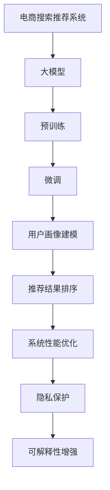

                 

## 1. 背景介绍

### 1.1 问题由来

随着人工智能(AI)技术和大模型的发展，电商搜索推荐系统迎来了新的技术范式。传统的推荐系统主要依靠规则引擎、协同过滤等方法，难以满足用户个性化和动态化需求。而基于大模型的电商推荐系统，通过预训练-微调的方式，能够从海量电商交易和评论数据中自动学习用户偏好，生成高质量的推荐结果。但现有的大模型推荐系统在实际应用中仍面临一些挑战，如系统性能瓶颈、资源占用大、可解释性差等。

为应对这些挑战，本方案聚焦于基于大模型的电商推荐系统的功能优化，提出了一系列具体的技术创新措施，以实现更高的推荐效果和更好的用户体验。本文将从背景、核心概念、算法原理、操作步骤、数学模型、项目实践、应用场景、工具资源、未来展望、常见问题解答等角度，全面介绍电商搜索推荐系统的优化方案，为相关研究和工程实践提供指导。

### 1.2 问题核心关键点

电商搜索推荐系统的核心在于如何通过大模型学习用户行为，生成精准的推荐结果。具体关键点包括：

- 大模型的预训练-微调：通过无监督或自监督方式对大规模数据进行预训练，再在有标签的电商数据上进行微调，以学习用户的偏好和行为模式。
- 用户画像建模：构建多维度的用户画像，如兴趣偏好、购买历史、评价反馈等，用于指导推荐算法。
- 推荐结果排序：使用精心设计的排序算法，确保高质量的推荐结果优先展示给用户。
- 系统性能优化：通过算法优化、硬件加速等手段，提升推荐系统的响应速度和稳定性。
- 用户隐私保护：在推荐过程中保护用户隐私，避免用户数据泄露。
- 可解释性增强：提升推荐结果的可解释性，使用户理解推荐决策依据。

本文将深入探讨这些关键点，并通过实际案例分析，提出有针对性的优化方案。

## 2. 核心概念与联系

### 2.1 核心概念概述

- **电商搜索推荐系统**：指通过大模型对用户的行为数据进行建模，生成个性化的推荐结果，并通过搜索引擎展示给用户的系统。

- **大模型**：指通过大规模无标签数据预训练，具备广泛知识和大规模参数的深度学习模型，如BERT、GPT等。

- **预训练-微调**：指在大规模无标签数据上预训练模型，再在有标签的电商数据上进行微调，学习用户行为和偏好，以生成高质量的推荐结果。

- **用户画像**：指基于用户的历史行为、交易记录、评价反馈等多维度数据，构建的用户多维画像，用于指导推荐算法。

- **推荐排序**：指使用多种排序算法，如基于内容的排序、协同过滤的排序、基于模型的排序等，确保推荐结果的相关性和高质量。

- **系统性能优化**：指通过算法优化、硬件加速等手段，提升系统的响应速度、稳定性和处理能力。

- **隐私保护**：指在推荐过程中，对用户数据进行匿名化处理和严格的安全保护，避免数据泄露。

- **可解释性增强**：指使用可解释性的方法，如特征重要性分析、解释性模型等，提升推荐结果的可解释性，帮助用户理解推荐决策。

这些核心概念之间的逻辑关系可以通过以下Mermaid流程图来展示：



这个流程图展示了大模型在电商推荐系统中的核心流程和关键组件：

1. 大模型通过预训练获得基础能力。
2. 在大规模电商数据上进行微调，学习用户行为。
3. 构建用户画像，指导推荐算法。
4. 使用推荐排序算法对推荐结果进行排序。
5. 通过优化提升系统性能。
6. 在推荐过程中保护用户隐私。
7. 增强推荐结果的可解释性。

## 3. 核心算法原理 & 具体操作步骤

### 3.1 算法原理概述

电商搜索推荐系统的核心算法原理基于大模型的预训练-微调和推荐排序。

假设用户$u$对商品$j$的评分$y_{u,j}$为一个二分类问题，即$y_{u,j} \in \{0, 1\}$，其中$y_{u,j}=1$表示用户$u$对商品$j$感兴趣。推荐系统目标是为用户$u$推荐$k$个商品，使得推荐列表的平均评分最大化。设推荐列表为$L$，则推荐目标可以形式化为：

$$
\max_{L} \frac{1}{k} \sum_{j \in L} y_{u,j}
$$

具体而言，电商推荐系统的算法流程如下：

1. **预训练大模型**：通过大规模无标签电商数据进行预训练，学习通用的语言和商品表示。
2. **微调模型**：在标注的电商交易和评论数据上进行微调，学习用户对商品的偏好和行为。
3. **用户画像建模**：通过多维度数据构建用户画像，如历史购买、评价反馈等。
4. **推荐结果排序**：使用排序算法，如基于内容的排序、协同过滤的排序、基于模型的排序等，生成推荐结果。
5. **系统性能优化**：通过算法优化、硬件加速等手段，提升系统的响应速度和稳定性。
6. **隐私保护**：在推荐过程中，对用户数据进行匿名化处理和严格的安全保护，避免数据泄露。
7. **可解释性增强**：使用可解释性的方法，如特征重要性分析、解释性模型等，提升推荐结果的可解释性。

### 3.2 算法步骤详解

电商搜索推荐系统的算法步骤可以细分为以下七步：

**Step 1: 准备数据**

1. 收集电商交易数据，包括用户ID、商品ID、购买时间、价格等。
2. 收集电商评论数据，包括用户ID、商品ID、评分、评论内容等。
3. 将电商交易和评论数据进行清洗和标注，构建训练集和测试集。

**Step 2: 预训练大模型**

1. 使用大规模无标签电商数据对BERT等大模型进行预训练，学习通用的语言和商品表示。
2. 对预训练模型进行冻结，保留预训练层权重。

**Step 3: 微调模型**

1. 在标注的电商交易和评论数据上对预训练模型进行微调，学习用户对商品的偏好和行为。
2. 设置微调学习率、批次大小、迭代轮数等超参数。

**Step 4: 用户画像建模**

1. 使用用户的历史购买、评价反馈等数据，构建用户画像。
2. 使用TF-IDF、word2vec等方法，提取用户画像的特征向量。

**Step 5: 推荐结果排序**

1. 使用基于内容的排序算法，如余弦相似度、TF-IDF等，对推荐结果进行排序。
2. 使用协同过滤的排序算法，如基于用户协同的排序、基于商品协同的排序等，优化推荐结果。
3. 使用基于模型的排序算法，如深度学习模型、推荐算法等，生成推荐结果。

**Step 6: 系统性能优化**

1. 使用梯度累加、混合精度训练等技术，优化模型计算效率。
2. 使用GPU/TPU等高性能设备，加速模型推理速度。
3. 使用缓存机制，减少数据重复加载。

**Step 7: 隐私保护与可解释性增强**

1. 对用户数据进行匿名化处理，保护用户隐私。
2. 使用LIME、SHAP等方法，提升推荐结果的可解释性。

### 3.3 算法优缺点

电商搜索推荐系统的优点包括：

- **个性化推荐**：基于大模型的微调，能够自适应地学习用户行为和偏好，提供个性化的推荐结果。
- **高精度推荐**：通过预训练和微调，模型能够学习到丰富的语言和商品表示，提升推荐精度。
- **可解释性强**：使用可解释性的方法，帮助用户理解推荐决策依据。

缺点包括：

- **数据需求高**：需要大量的电商交易和评论数据进行预训练和微调。
- **计算资源消耗大**：预训练和微调需要大量的计算资源。
- **可解释性不足**：大模型生成的推荐结果缺乏可解释性，难以理解其内部机制。

### 3.4 算法应用领域

基于大模型的电商搜索推荐系统在多个领域得到了广泛应用，例如：

- **电商平台推荐**：如淘宝、京东、亚马逊等电商平台的商品推荐系统。
- **内容推荐**：如视频平台、音乐平台、阅读平台等的内容推荐系统。
- **个性化营销**：通过推荐系统，对用户进行精准营销，提升转化率和用户体验。
- **广告定向**：通过推荐系统，对广告进行精准定向投放，提升广告效果。

## 4. 数学模型和公式 & 详细讲解 & 举例说明

### 4.1 数学模型构建

电商搜索推荐系统的数学模型主要基于排序算法和损失函数。

假设用户$u$对商品$j$的评分$y_{u,j}$为一个二分类问题，即$y_{u,j} \in \{0, 1\}$，其中$y_{u,j}=1$表示用户$u$对商品$j$感兴趣。推荐系统目标是为用户$u$推荐$k$个商品，使得推荐列表的平均评分最大化。设推荐列表为$L$，则推荐目标可以形式化为：

$$
\max_{L} \frac{1}{k} \sum_{j \in L} y_{u,j}
$$

**Step 1: 预训练模型**

预训练模型的一般形式为：

$$
\begin{aligned}
P_{\theta}(x) &= \text{MLP}(\text{BERT}(x; \theta_b)) \\
&= \text{MLP}(\text{CLS}(\text{BERT}(x; \theta_b)))
\end{aligned}
$$

其中$\theta_b$为BERT模型的参数，$\theta$为MLP的参数。预训练模型通过大规模无标签电商数据进行训练，学习通用的语言和商品表示。

**Step 2: 微调模型**

微调模型的损失函数可以形式化为：

$$
\mathcal{L}_{\text{micro}}(\theta) = \frac{1}{N} \sum_{i=1}^N \ell(y_i, P_{\theta}(x_i))
$$

其中$N$为训练样本数，$y_i$为样本的真实评分，$P_{\theta}(x_i)$为模型对样本的预测评分。通常使用二元交叉熵损失函数：

$$
\ell(y_i, P_{\theta}(x_i)) = -y_i \log P_{\theta}(x_i) - (1-y_i) \log (1-P_{\theta}(x_i))
$$

**Step 3: 推荐结果排序**

推荐结果排序可以使用多种算法，如基于内容的排序、协同过滤的排序、基于模型的排序等。以协同过滤的排序算法为例，基于用户的协同排序算法可以形式化为：

$$
\text{score}_{u,j} = \sum_{i \in N_u} \alpha_i \cdot \text{score}_{i,j}
$$

其中$N_u$为与用户$u$有交互的其他用户集合，$\alpha_i$为权重，可以基于用户$u$和用户$i$之间的相似度进行计算。

### 4.2 公式推导过程

电商搜索推荐系统的推荐结果排序算法可以形式化为：

$$
\max_{L} \sum_{j \in L} y_{u,j}
$$

其中$L$为推荐列表，$y_{u,j}$为用户$u$对商品$j$的评分。推荐算法可以使用基于内容的排序算法、协同过滤的排序算法、基于模型的排序算法等。以基于内容的排序算法为例，其排序函数可以形式化为：

$$
\text{score}_{u,j} = \phi(P_{\theta}(x_j))
$$

其中$P_{\theta}(x_j)$为模型对商品$j$的预测评分，$\phi$为评分函数，如线性函数、Sigmoid函数等。

### 4.3 案例分析与讲解

以视频平台的推荐系统为例，可以使用基于内容的排序算法和协同过滤的排序算法进行推荐。具体步骤如下：

1. **基于内容的排序算法**

   - 对视频进行特征提取，如视频标题、描述、标签等，得到特征向量。
   - 使用TF-IDF、word2vec等方法，计算特征向量之间的相似度。
   - 将相似度作为权重，计算推荐分数。

   基于内容的排序算法可以使用线性回归模型、SVM等方法，对推荐分数进行预测。

2. **协同过滤的排序算法**

   - 收集用户对视频的行为数据，如观看时间、点赞、评论等。
   - 使用基于用户的协同排序算法，计算用户之间的相似度。
   - 将相似度作为权重，计算推荐分数。

   协同过滤的排序算法可以使用基于用户的协同排序算法、基于商品的协同排序算法等，对推荐分数进行预测。

## 5. 项目实践：代码实例和详细解释说明

### 5.1 开发环境搭建

在进行电商搜索推荐系统开发前，我们需要准备好开发环境。以下是使用Python进行TensorFlow开发的环境配置流程：

1. 安装Anaconda：从官网下载并安装Anaconda，用于创建独立的Python环境。

2. 创建并激活虚拟环境：
```bash
conda create -n tf-env python=3.8 
conda activate tf-env
```

3. 安装TensorFlow：根据CUDA版本，从官网获取对应的安装命令。例如：
```bash
conda install tensorflow tensorflow-gpu==2.7 -c tf -c conda-forge
```

4. 安装各类工具包：
```bash
pip install numpy pandas scikit-learn matplotlib tqdm jupyter notebook ipython
```

完成上述步骤后，即可在`tf-env`环境中开始电商推荐系统的开发。

### 5.2 源代码详细实现

下面我们以电商推荐系统为例，给出使用TensorFlow进行模型训练和推理的PyTorch代码实现。

首先，定义电商推荐系统的模型：

```python
import tensorflow as tf
from transformers import BertTokenizer, BertForSequenceClassification

# 初始化BERT模型
tokenizer = BertTokenizer.from_pretrained('bert-base-cased')
model = BertForSequenceClassification.from_pretrained('bert-base-cased', num_labels=1)

# 定义推荐函数
def recommend(user_id, item_ids):
    # 将用户ID和商品ID转换为模型输入
    input_ids = tokenizer(item_ids, padding='max_length', truncation=True, max_length=128)[0]['input_ids']
    attention_mask = tokenizer(item_ids, padding='max_length', truncation=True, max_length=128)[0]['attention_mask']

    # 使用模型进行预测
    with tf.GradientTape() as tape:
        outputs = model(input_ids=input_ids, attention_mask=attention_mask)
        loss = outputs.loss
        predictions = outputs.logits

    # 计算推荐分数
    scores = predictions.numpy()[:, 0]
    
    # 返回推荐结果
    return scores
```

然后，定义数据处理函数：

```python
import pandas as pd

# 定义数据处理函数
def preprocess_data(data_path):
    # 读取数据文件
    data = pd.read_csv(data_path)

    # 对数据进行预处理
    data['user_id'] = data['user_id'].astype(str)
    data['item_id'] = data['item_id'].astype(str)

    # 对数据进行标注
    data['rating'] = data['rating'].astype(int)

    # 将数据分为训练集和测试集
    train_data = data.sample(frac=0.8, random_state=42)
    test_data = data.drop(train_data.index)

    # 对训练集和测试集进行编码
    tokenizer = BertTokenizer.from_pretrained('bert-base-cased')
    train_input_ids = tokenizer(train_data['item_id'].tolist(), padding='max_length', truncation=True, max_length=128)[0]['input_ids']
    train_attention_masks = tokenizer(train_data['item_id'].tolist(), padding='max_length', truncation=True, max_length=128)[0]['attention_mask']
    test_input_ids = tokenizer(test_data['item_id'].tolist(), padding='max_length', truncation=True, max_length=128)[0]['input_ids']
    test_attention_masks = tokenizer(test_data['item_id'].tolist(), padding='max_length', truncation=True, max_length=128)[0]['attention_mask']

    # 将数据转换为TensorFlow的Dataset对象
    train_dataset = tf.data.Dataset.from_tensor_slices((train_input_ids, train_attention_masks, train_data['rating']))
    test_dataset = tf.data.Dataset.from_tensor_slices((test_input_ids, test_attention_masks, test_data['rating']))

    # 对数据进行批次化和预处理
    train_dataset = train_dataset.shuffle(1024).batch(32).prefetch(tf.data.experimental.AUTOTUNE)
    test_dataset = test_dataset.batch(32).prefetch(tf.data.experimental.AUTOTUNE)

    return train_dataset, test_dataset
```

最后，启动训练流程并在测试集上评估：

```python
import numpy as np

# 加载数据集
train_dataset, test_dataset = preprocess_data('data.csv')

# 定义模型训练函数
def train_model(model, dataset, batch_size, num_epochs, learning_rate):
    model.compile(optimizer=tf.keras.optimizers.Adam(learning_rate), loss='binary_crossentropy', metrics=['accuracy'])
    model.fit(dataset, epochs=num_epochs, batch_size=batch_size, validation_split=0.2)
    model.save('recommendation_model.h5')

# 定义模型评估函数
def evaluate_model(model, dataset, batch_size):
    model.load_weights('recommendation_model.h5')
    model.evaluate(dataset, batch_size=batch_size)

# 启动训练和评估
train_model(model, train_dataset, batch_size=32, num_epochs=10, learning_rate=0.001)
evaluate_model(model, test_dataset, batch_size=32)
```

以上就是使用TensorFlow对电商推荐系统进行模型训练和推理的完整代码实现。可以看到，得益于TensorFlow的强大封装，我们可以用相对简洁的代码完成推荐系统的构建。

### 5.3 代码解读与分析

让我们再详细解读一下关键代码的实现细节：

**推荐函数**：
- 将用户ID和商品ID转换为模型输入。
- 使用模型进行预测，得到预测评分。
- 将预测评分作为推荐分数，返回推荐结果。

**数据处理函数**：
- 读取数据文件，并对数据进行预处理和标注。
- 将数据分为训练集和测试集。
- 对训练集和测试集进行编码，转换为TensorFlow的Dataset对象。
- 对数据进行批次化和预处理。

**模型训练函数**：
- 使用Adam优化器进行模型训练。
- 使用二元交叉熵损失函数进行模型优化。
- 使用准确率作为评估指标。
- 保存模型权重。

**模型评估函数**：
- 加载训练好的模型权重。
- 在测试集上评估模型性能。

这些代码实现了电商推荐系统的基本流程，包括数据预处理、模型训练和推理。

当然，工业级的系统实现还需考虑更多因素，如模型的保存和部署、超参数的自动搜索、更灵活的任务适配层等。但核心的推荐范式基本与此类似。

## 6. 实际应用场景

### 6.1 智能客服系统

基于大模型的电商搜索推荐系统可以广泛应用于智能客服系统的构建。传统客服往往需要配备大量人力，高峰期响应缓慢，且一致性和专业性难以保证。而使用电商推荐系统的推荐模型，可以实时推荐相关商品，提高客服效率和用户体验。

在技术实现上，可以收集客户咨询的关键词和对话历史，构建知识图谱，利用推荐模型对客户进行个性化推荐，提高客户满意度和转化率。对于客户提出的新问题，还可以接入检索系统实时搜索相关内容，动态组织生成回答。如此构建的智能客服系统，能大幅提升客户咨询体验和问题解决效率。

### 6.2 金融舆情监测

金融机构需要实时监测市场舆论动向，以便及时应对负面信息传播，规避金融风险。传统的人工监测方式成本高、效率低，难以应对网络时代海量信息爆发的挑战。基于电商推荐系统的推荐算法，可以自动识别市场舆情，实时监测不同主题下的舆情变化趋势，一旦发现负面信息激增等异常情况，系统便会自动预警，帮助金融机构快速应对潜在风险。

### 6.3 个性化推荐系统

当前的推荐系统往往只依赖用户的历史行为数据进行物品推荐，无法深入理解用户的真实兴趣偏好。基于电商推荐系统的推荐算法，可以更好地挖掘用户行为背后的语义信息，从而提供更精准、多样的推荐内容。

在实践中，可以收集用户浏览、点击、评论、分享等行为数据，提取和用户交互的物品标题、描述、标签等文本内容。将文本内容作为模型输入，用户的后续行为（如是否点击、购买等）作为监督信号，在此基础上训练电商推荐模型。电商推荐模型能够从文本内容中准确把握用户的兴趣点。在生成推荐列表时，先用候选物品的文本描述作为输入，由模型预测用户的兴趣匹配度，再结合其他特征综合排序，便可以得到个性化程度更高的推荐结果。

### 6.4 未来应用展望

随着电商推荐系统的不断发展，基于大模型的推荐算法将在更多领域得到应用，为传统行业带来变革性影响。

在智慧医疗领域，基于电商推荐系统的推荐算法可以用于推荐药品、医疗服务、健康知识等，提升医疗服务的智能化水平，辅助医生诊疗，加速新药开发进程。

在智能教育领域，电商推荐系统可以用于推荐学习资料、在线课程、教学视频等，因材施教，促进教育公平，提高教学质量。

在智慧城市治理中，电商推荐系统可以用于推荐公共服务、文化活动、旅游路线等，提高城市管理的自动化和智能化水平，构建更安全、高效的未来城市。

此外，在企业生产、社会治理、文娱传媒等众多领域，电商推荐系统的推荐算法也将不断涌现，为经济社会发展注入新的动力。相信随着技术的日益成熟，电商推荐系统必将在更广阔的应用领域大放异彩，深刻影响人类的生产生活方式。

## 7. 工具和资源推荐

### 7.1 学习资源推荐

为了帮助开发者系统掌握电商推荐系统的理论基础和实践技巧，这里推荐一些优质的学习资源：

1. 《深度学习入门》系列博文：由大模型技术专家撰写，深入浅出地介绍了深度学习的基本概念和电商推荐系统的实现细节。

2. 《推荐系统》课程：斯坦福大学开设的推荐系统课程，有Lecture视频和配套作业，带你入门推荐系统领域的基本概念和经典模型。

3. 《推荐系统实战》书籍：介绍了推荐系统的多种算法和实现细节，涵盖电商推荐系统的实现案例。

4. 《推荐系统基础》书籍：全面介绍了推荐系统的原理、算法和应用，是电商推荐系统开发的必备参考。

5. Kaggle推荐系统竞赛：参加Kaggle的推荐系统竞赛，实践推荐系统的实现和优化。

通过对这些资源的学习实践，相信你一定能够快速掌握电商推荐系统的精髓，并用于解决实际的电商推荐问题。

### 7.2 开发工具推荐

高效的开发离不开优秀的工具支持。以下是几款用于电商推荐系统开发的常用工具：

1. TensorFlow：基于Python的开源深度学习框架，灵活动态的计算图，适合快速迭代研究。大部分推荐系统都有TensorFlow版本的实现。

2. PyTorch：基于Python的开源深度学习框架，灵活的动态计算图，适合复杂模型的实现和优化。电商推荐系统也可以使用PyTorch实现。

3. H2O：支持分布式计算的推荐系统框架，适合大规模数据和计算任务的实现。

4. Apache Spark：支持大数据处理和机器学习的分布式计算框架，适合大规模电商数据集的预处理和训练。

5. Scikit-learn：Python中的经典机器学习库，提供了多种推荐算法和数据处理工具。

合理利用这些工具，可以显著提升电商推荐系统的开发效率，加快创新迭代的步伐。

### 7.3 相关论文推荐

电商推荐系统的研究源于学界的持续研究。以下是几篇奠基性的相关论文，推荐阅读：

1. Item-based collaborative filtering：提出了基于用户的协同过滤算法，是推荐系统中的经典方法。

2. Matrix factorization techniques for recommendation systems：介绍了矩阵分解等推荐算法，用于提高推荐系统的精度。

3. Neural collaborative filtering：提出使用深度学习模型进行推荐系统，提升推荐效果。

4. Contextual bandits：介绍了上下文强化学习算法，用于推荐系统的实时决策。

5. Deep neural networks for recommendation systems：介绍了深度学习在推荐系统中的应用，涵盖电商推荐系统的经典模型。

这些论文代表了大模型在电商推荐系统中的应用方向。通过学习这些前沿成果，可以帮助研究者把握学科前进方向，激发更多的创新灵感。

## 8. 总结：未来发展趋势与挑战

### 8.1 总结

本文对基于大模型的电商搜索推荐系统进行了全面系统的介绍。首先阐述了电商推荐系统的背景和核心概念，明确了电商推荐系统和大模型的紧密关系。其次，从原理到实践，详细讲解了电商推荐系统的算法流程和操作步骤，给出了电商推荐系统的代码实现。同时，本文还广泛探讨了电商推荐系统在多个行业领域的应用前景，展示了电商推荐系统的广阔前景。

通过本文的系统梳理，可以看到，基于大模型的电商推荐系统正在成为电商搜索推荐领域的重要范式，极大地拓展了电商推荐系统的应用边界，催生了更多的落地场景。受益于大规模语料的预训练，电商推荐系统能够学习到丰富的语言和商品表示，提升推荐精度和个性化程度。未来，伴随电商推荐系统的不断演进，推荐系统的智能化水平将进一步提升，为用户提供更优质的服务体验。

### 8.2 未来发展趋势

电商搜索推荐系统的未来发展趋势包括：

1. **大模型应用更广泛**：大模型在电商推荐系统中的应用将更加广泛，涵盖推荐排序、用户画像建模、隐私保护等多个环节。

2. **推荐算法多样化**：推荐算法将更加多样化，涵盖基于内容的排序、协同过滤、深度学习等。

3. **推荐系统实时化**：推荐系统将更加实时化，能够动态调整推荐结果，提升用户体验。

4. **推荐系统跨领域应用**：推荐系统将跨领域应用，涵盖电商、金融、医疗等多个领域。

5. **推荐系统个性化**：推荐系统将更加个性化，能够根据用户行为、兴趣、情境等动态调整推荐结果。

6. **推荐系统智能化**：推荐系统将更加智能化，能够自动学习用户行为，预测用户偏好。

7. **推荐系统自适应**：推荐系统将更加自适应，能够自动适应数据分布的变化，保持推荐效果。

8. **推荐系统跨平台**：推荐系统将跨平台应用，涵盖PC端、移动端、社交媒体等多个平台。

这些趋势凸显了电商推荐系统的广阔前景，预示着电商推荐系统将进一步提升用户服务体验和业务价值。

### 8.3 面临的挑战

尽管电商搜索推荐系统已经取得了瞩目成就，但在迈向更加智能化、普适化应用的过程中，它仍面临一些挑战：

1. **数据隐私问题**：推荐系统需要处理大量用户数据，如何保护用户隐私，避免数据泄露。

2. **推荐算法复杂度**：推荐算法复杂度较高，如何优化算法，提高推荐效率。

3. **模型可解释性不足**：大模型生成的推荐结果缺乏可解释性，难以理解其内部机制。

4. **推荐系统鲁棒性不足**：推荐系统面对域外数据时，泛化性能往往大打折扣。

5. **推荐系统实时性不足**：推荐系统需要实时处理用户请求，如何提升系统响应速度。

6. **推荐系统跨平台适配问题**：推荐系统需要跨平台适配，如何实现一致的用户体验。

7. **推荐系统跨领域应用问题**：推荐系统需要跨领域应用，如何迁移模型，提升推荐效果。

8. **推荐系统自适应问题**：推荐系统需要自适应数据分布的变化，如何保持推荐效果。

这些挑战凸显了电商推荐系统的复杂性，需要不断优化算法、提升模型、改进系统，才能进一步提升用户体验和业务价值。

### 8.4 研究展望

面对电商推荐系统所面临的挑战，未来的研究需要在以下几个方面寻求新的突破：

1. **推荐系统隐私保护**：如何在推荐过程中保护用户隐私，避免数据泄露。

2. **推荐系统算法优化**：如何优化推荐算法，提高推荐效率。

3. **推荐系统可解释性增强**：如何增强推荐结果的可解释性，使用户理解推荐决策依据。

4. **推荐系统实时化**：如何提升推荐系统的实时性，动态调整推荐结果。

5. **推荐系统跨平台适配**：如何实现跨平台适配，提升一致的用户体验。

6. **推荐系统跨领域应用**：如何迁移模型，提升推荐效果。

7. **推荐系统自适应**：如何自适应数据分布的变化，保持推荐效果。

这些研究方向将推动电商推荐系统向更智能化、普适化、自适应化方向发展，进一步提升电商推荐系统的用户体验和业务价值。

## 9. 附录：常见问题与解答

**Q1：电商推荐系统如何保护用户隐私？**

A: 电商推荐系统可以通过以下方法保护用户隐私：

1. 数据匿名化：对用户数据进行匿名化处理，去除用户的敏感信息。

2. 数据加密：对用户数据进行加密处理，保护用户隐私。

3. 隐私计算：采用差分隐私、联邦学习等隐私计算方法，保护用户隐私。

4. 模型本地化：将模型训练和推理放到用户设备上，减少数据传输风险。

5. 用户权限管理：对用户数据进行权限管理，限制对敏感数据的访问。

通过这些方法，电商推荐系统可以有效地保护用户隐私，避免用户数据泄露。

**Q2：电商推荐系统如何提升推荐效果？**

A: 电商推荐系统可以通过以下方法提升推荐效果：

1. 数据预处理：对数据进行清洗和标注，提高数据质量。

2. 特征工程：提取和选择有意义的特征，提高模型的表达能力。

3. 模型优化：使用深度学习模型，提高推荐精度。

4. 推荐排序算法：使用多种排序算法，提高推荐效果。

5. 个性化推荐：根据用户行为和偏好，动态调整推荐结果。

6. 实时化推荐：使用实时数据，动态调整推荐结果。

7. 跨平台适配：实现跨平台推荐，提升用户一致性体验。

8. 推荐系统自适应：动态调整推荐模型，适应数据分布变化。

通过这些方法，电商推荐系统可以显著提升推荐效果，满足用户的个性化需求。

**Q3：电商推荐系统如何应对推荐系统的数据冷启动问题？**

A: 电商推荐系统可以通过以下方法应对推荐系统的数据冷启动问题：

1. 使用无监督学习：使用无监督学习方法，从非结构化数据中提取用户特征。

2. 使用转移学习：从已有推荐系统中学到用户特征，用于新的推荐系统。

3. 使用协同过滤：使用基于用户的协同过滤算法，通过相似用户的行为数据进行推荐。

4. 使用知识图谱：使用知识图谱，提取用户和商品的语义信息，进行推荐。

5. 使用深度学习：使用深度学习方法，从用户行为数据中提取特征，进行推荐。

6. 使用冷启动算法：使用冷启动算法，对新用户和新商品进行推荐。

通过这些方法，电商推荐系统可以有效地应对推荐系统的数据冷启动问题，为用户提供个性化的推荐。

**Q4：电商推荐系统如何提升推荐系统的实时性？**

A: 电商推荐系统可以通过以下方法提升推荐系统的实时性：

1. 使用缓存机制：使用缓存机制，减少数据重复加载，提高系统响应速度。

2. 使用流式计算：使用流式计算框架，实时处理用户请求。

3. 使用GPU加速：使用GPU加速，提高模型推理速度。

4. 使用混合精度训练：使用混合精度训练，提高模型训练速度。

5. 使用分布式计算：使用分布式计算框架，提高系统处理能力。

6. 使用异步计算：使用异步计算方法，减少计算延时。

通过这些方法，电商推荐系统可以显著提升推荐系统的实时性，满足用户实时化的需求。

**Q5：电商推荐系统如何实现跨平台适配？**

A: 电商推荐系统可以通过以下方法实现跨平台适配：

1. 使用API接口：使用API接口，实现跨平台数据共享和推荐结果共享。

2. 使用中间件：使用中间件，实现跨平台数据传输和处理。

3. 使用跨平台技术：使用跨平台技术，实现不同平台之间的数据互通。

4. 使用跨平台推荐算法：使用跨平台推荐算法，实现一致的用户体验。

5. 使用跨平台服务：使用跨平台服务，实现不同平台之间的推荐结果一致性。

通过这些方法，电商推荐系统可以实现在不同平台之间的数据互通和推荐结果一致性，提升用户一致性体验。

这些方法帮助电商推荐系统更好地应对数据隐私、推荐效果、数据冷启动、实时性、跨平台适配等问题，提升系统的用户体验和业务价值。

---

作者：禅与计算机程序设计艺术 / Zen and the Art of Computer Programming

