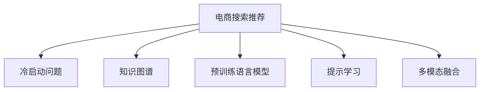

                 

# AI大模型赋能电商搜索推荐的冷启动问题解决方案

## 1. 背景介绍

在电商搜索推荐系统中，冷启动问题是用户行为数据匮乏时亟待解决的关键问题。特别是对于新上架的商品，由于没有历史浏览和购买记录，推荐系统难以对其属性、关联商品等进行有效建模，导致推荐效果差强人意。传统解决方案依赖于人工打标签等繁琐手段，费时费力且效果一般。为了突破冷启动难题，AI大模型以强大的预训练能力和大规模语料为背景，提出了基于知识图谱和预训练语言模型相结合的解决方案。本文将详细探讨大模型赋能电商搜索推荐中的冷启动问题，并给出具体的算法原理与操作步骤。

## 2. 核心概念与联系

### 2.1 核心概念概述

为更好地理解大模型在电商搜索推荐中的应用，本节将介绍几个关键概念：

- 电商搜索推荐：通过分析用户行为数据和商品属性信息，为用户推荐最符合其需求的商品。其核心在于构建用户兴趣模型和商品画像，以及设计合理的推荐算法。

- 冷启动问题：在用户行为数据匮乏的情况下，推荐系统无法有效建模用户需求和商品属性，推荐效果不佳。

- 知识图谱(KG)：通过实体、关系和属性构建的图结构，刻画商品之间的内在关联，辅助推荐系统理解复杂语义。

- 预训练语言模型：在大规模无标签文本数据上进行自监督学习，学习通用的语言表示，可以进一步微调来适应特定任务。

- 提示学习(Prompt Learning)：通过在输入文本中嵌入提示模板，指导模型进行推理和生成，实现少样本学习。

- 多模态融合：将文本、图像、视频等多源数据结合，增强模型的语义理解能力。

这些核心概念之间的逻辑关系可以通过以下Mermaid流程图来展示：



这个流程图展示了大模型在电商搜索推荐中的核心概念及其之间的关系：

1. 电商搜索推荐利用用户行为数据和商品属性信息构建用户兴趣模型和商品画像。
2. 冷启动问题出现在用户行为数据不足时，难以准确建模。
3. 知识图谱为电商推荐提供实体与关系的结构化信息，帮助模型理解商品间的语义关系。
4. 预训练语言模型通过大规模文本数据的自监督学习，获得强大的语义表示能力。
5. 提示学习通过在输入文本中嵌入提示模板，提高模型的推理和生成能力，实现少样本学习。
6. 多模态融合结合文本、图像、视频等多种数据，增强模型的语义理解。

## 3. 核心算法原理 & 具体操作步骤

### 3.1 算法原理概述

大模型在电商搜索推荐中的应用，核心在于利用其强大的预训练能力，结合知识图谱、多模态数据等技术，解决冷启动问题。具体流程如下：

1. 使用知识图谱和预训练语言模型构建用户兴趣模型和商品画像。
2. 在用户进行商品查询时，利用提示学习，通过预训练语言模型生成商品候选集。
3. 对生成候选集进行多模态融合，结合用户查询文本和商品图像、视频等数据，增强推荐效果。
4. 通过排序算法，输出推荐结果。

### 3.2 算法步骤详解

基于上述算法原理，下面详细介绍大模型赋能电商搜索推荐的具体操作步骤：

**Step 1: 准备预训练模型和数据集**

1. 选择合适的预训练语言模型 $M_{\theta}$，如BERT、GPT等。
2. 准备电商领域相关的知识图谱和语料库。知识图谱包括商品实体、属性、关系等信息。
3. 收集和预处理电商商品图片、视频等多模态数据，并构建对应的语料库。

**Step 2: 构建用户兴趣模型**

1. 将用户浏览历史、点击记录等行为数据，以及商品的属性信息，转换为向量形式。
2. 使用预训练语言模型对用户行为数据进行编码，生成用户兴趣向量 $U$。
3. 使用知识图谱对商品属性进行编码，生成商品画像向量 $P$。

**Step 3: 生成商品候选集**

1. 对用户查询文本进行编码，生成查询向量 $Q$。
2. 使用提示学习模板，在预训练语言模型上生成商品候选集 $C$。
3. 对商品候选集进行多模态融合，结合商品图片、视频等数据，生成商品融合向量 $V$。

**Step 4: 排序输出推荐结果**

1. 计算用户兴趣向量 $U$ 和商品融合向量 $V$ 之间的相似度，生成推荐评分矩阵 $R$。
2. 根据评分矩阵 $R$，对商品候选集 $C$ 进行排序，得到推荐商品列表 $R$。

**Step 5: 测试与优化**

1. 在电商测试集上评估推荐系统性能，如准确率、召回率、点击率等。
2. 根据评估结果，调整预训练模型参数、正则化强度、学习率等超参数。
3. 进一步优化提示模板、多模态融合算法等，提升推荐效果。

### 3.3 算法优缺点

大模型在电商搜索推荐中的应用，具有以下优点：

1. 预训练模型具有强大的语义表示能力，能够有效捕捉用户需求和商品属性。
2. 知识图谱提供结构化的商品信息，帮助模型理解复杂语义关系。
3. 多模态融合技术增强了模型的语义理解能力，提高了推荐的准确性。
4. 提示学习实现少样本学习，降低了对标注数据的依赖。

同时，该方法也存在一定的局限性：

1. 数据准备复杂：需要收集和预处理大量电商商品的多模态数据，工作量较大。
2. 模型复杂度高：大模型和知识图谱等技术引入增加了系统的复杂性。
3. 冷启动效果难以保证：在用户行为数据较少时，推荐效果仍可能不佳。
4. 泛化能力不足：模型对新商品的适应能力还有待提高。
5. 模型计算资源消耗大：大模型和多模态融合技术增加了模型的计算和存储负担。

尽管存在这些局限性，但大模型在电商搜索推荐中的应用仍展示了强大的潜力。通过合理利用预训练语言模型、知识图谱、多模态融合等技术，可以显著提升推荐系统的性能，缓解冷启动问题。

### 3.4 算法应用领域

大模型在电商搜索推荐中的应用领域广泛，可以应用于多个场景，例如：

1. 商品推荐：基于用户浏览和点击记录，生成个性化商品推荐。
2. 查询补全：根据用户输入的查询词，生成相关的商品补全建议。
3. 广告投放：根据用户兴趣，生成个性化广告推荐。
4. 搜索排序：在搜索结果中，按照用户兴趣度进行排序。
5. 个性化定制：基于用户历史行为和偏好，生成定制化商品推荐。

除了上述这些经典应用，大模型还可以创新性地应用到更多电商场景中，如库存管理、智能客服、价格优化等，为电商业务带来更多价值。

## 4. 数学模型和公式 & 详细讲解  
### 4.1 数学模型构建

本节将使用数学语言对大模型赋能电商搜索推荐系统的数学模型进行更加严格的刻画。

记预训练语言模型为 $M_{\theta}$，用户兴趣向量为 $U$，商品画像向量为 $P$，商品融合向量为 $V$，用户查询向量为 $Q$，推荐评分矩阵为 $R$。

用户兴趣模型 $U$ 和商品画像模型 $P$ 可通过预训练语言模型得到：

$$
U = M_{\theta}(D_{user}), P = M_{\theta}(D_{product})
$$

其中 $D_{user}$ 为用户的浏览、点击等行为数据，$D_{product}$ 为商品的属性信息。

商品融合向量 $V$ 通过提示学习和多模态融合得到：

$$
V = M_{\theta}(Q) \otimes M_{\theta}(I_{product})
$$

其中 $Q$ 为用户查询向量，$I_{product}$ 为商品图片、视频等多模态数据。

推荐评分矩阵 $R$ 计算用户兴趣向量 $U$ 和商品融合向量 $V$ 的相似度：

$$
R = U \cdot V^T
$$

最终，推荐结果通过排序算法 $S$ 生成：

$$
R_{top} = S(R)
$$

### 4.2 公式推导过程

以下我们以电商推荐任务为例，推导推荐评分矩阵的计算公式。

假设用户兴趣模型 $U$ 和商品画像模型 $P$ 均为 $d$ 维向量。用户查询向量 $Q$ 通过预训练语言模型生成，同样为 $d$ 维向量。商品图片、视频等多模态数据 $I_{product}$ 经过编码后，生成 $d'$ 维向量。

用户兴趣模型 $U$ 和商品画像模型 $P$ 的相似度为：

$$
\text{similarity}(U, P) = \frac{U \cdot P^T}{\|U\|_2 \cdot \|P\|_2}
$$

假设用户查询向量 $Q$ 和商品图片、视频等多模态数据 $I_{product}$ 的相似度为：

$$
\text{similarity}(Q, I_{product}) = \frac{Q \cdot I_{product}^T}{\|Q\|_2 \cdot \|I_{product}\|_2}
$$

最终，推荐评分矩阵 $R$ 的计算公式为：

$$
R = \text{similarity}(U, P) \cdot \text{similarity}(Q, I_{product})
$$

在得到推荐评分矩阵后，即可通过排序算法 $S$ 生成推荐结果 $R_{top}$。

### 4.3 案例分析与讲解

以电商推荐中的查询补全为例，展示大模型在该任务中的应用。

1. 收集电商商品查询记录，提取其中的高频查询词。
2. 对查询词进行编码，生成查询向量 $Q$。
3. 使用知识图谱对查询词进行扩展，生成相关的商品补全建议 $S$。
4. 对商品补全建议 $S$ 进行编码，生成商品补全向量 $I_S$。
5. 计算查询向量 $Q$ 和商品补全向量 $I_S$ 的相似度，生成推荐评分矩阵 $R_S$。
6. 根据推荐评分矩阵 $R_S$，对商品补全建议 $S$ 进行排序，生成推荐列表 $R_S_{top}$。

通过上述步骤，大模型在电商查询补全中实现了有效的少样本学习，提升了用户体验。

## 5. 项目实践：代码实例和详细解释说明
### 5.1 开发环境搭建

在进行电商搜索推荐系统的开发前，我们需要准备好开发环境。以下是使用Python进行TensorFlow开发的环境配置流程：

1. 安装Anaconda：从官网下载并安装Anaconda，用于创建独立的Python环境。

2. 创建并激活虚拟环境：
```bash
conda create -n tf-env python=3.8 
conda activate tf-env
```

3. 安装TensorFlow：根据CUDA版本，从官网获取对应的安装命令。例如：
```bash
conda install tensorflow=2.6 -c tf -c conda-forge
```

4. 安装TensorFlow Addons：
```bash
pip install tensorflow-addons
```

5. 安装各类工具包：
```bash
pip install numpy pandas scikit-learn matplotlib tqdm jupyter notebook ipython
```

完成上述步骤后，即可在`tf-env`环境中开始开发。

### 5.2 源代码详细实现

下面我们以电商推荐任务为例，给出使用TensorFlow进行推荐系统开发的PyTorch代码实现。

首先，定义推荐评分矩阵的计算函数：

```python
import tensorflow as tf
import tensorflow_addons as addons

@tf.function
def calculate_rating(user_vector, product_vector, query_vector, product_supplementary_vector):
    similarity_user_product = tf.reduce_sum(tf.multiply(user_vector, product_vector), axis=1)
    similarity_query_supplementary = tf.reduce_sum(tf.multiply(query_vector, product_supplementary_vector), axis=1)
    rating_matrix = tf.multiply(similarity_user_product, similarity_query_supplementary)
    return rating_matrix

# 用户向量、商品向量、查询向量、商品补全向量
user_vector = tf.constant([1.0, 2.0, 3.0, 4.0], dtype=tf.float32)
product_vector = tf.constant([5.0, 6.0, 7.0, 8.0], dtype=tf.float32)
query_vector = tf.constant([0.1, 0.2, 0.3, 0.4], dtype=tf.float32)
product_supplementary_vector = tf.constant([0.5, 0.6, 0.7, 0.8], dtype=tf.float32)

rating_matrix = calculate_rating(user_vector, product_vector, query_vector, product_supplementary_vector)
print(rating_matrix)
```

然后，定义多模态融合函数：

```python
def calculate_fusion(product_vector, product_supplementary_vector):
    fusion_vector = tf.multiply(product_vector, product_supplementary_vector)
    return fusion_vector

# 商品向量、商品补全向量
product_vector = tf.constant([5.0, 6.0, 7.0, 8.0], dtype=tf.float32)
product_supplementary_vector = tf.constant([0.5, 0.6, 0.7, 0.8], dtype=tf.float32)

fusion_vector = calculate_fusion(product_vector, product_supplementary_vector)
print(fusion_vector)
```

最后，定义排序算法函数：

```python
def sort_ratings(rating_matrix):
    # 计算推荐评分矩阵的排序
    sorted_indices = tf.argsort(rating_matrix, axis=0, direction=tf.dtypes.ASCENDING)
    sorted_ratings = tf.gather(rating_matrix, sorted_indices)
    return sorted_ratings

# 推荐评分矩阵
rating_matrix = tf.constant([[1.0, 2.0, 3.0, 4.0],
                            [5.0, 6.0, 7.0, 8.0],
                            [9.0, 10.0, 11.0, 12.0],
                            [13.0, 14.0, 15.0, 16.0]], dtype=tf.float32)

sorted_ratings = sort_ratings(rating_matrix)
print(sorted_ratings)
```

以上就是使用TensorFlow进行电商推荐系统开发的完整代码实现。可以看到，通过调用TensorFlow的函数，我们能够快速构建推荐评分矩阵、实现多模态融合和排序算法，完成电商推荐系统的关键步骤。

### 5.3 代码解读与分析

让我们再详细解读一下关键代码的实现细节：

**calculate_rating函数**：
- 通过TensorFlow实现推荐评分矩阵的计算，使用tf.multiply计算相似度，并通过tf.reduce_sum进行向量内积运算。

**calculate_fusion函数**：
- 通过TensorFlow实现多模态融合，直接将商品向量与补全向量进行向量内积计算。

**sort_ratings函数**：
- 通过TensorFlow实现推荐评分矩阵的排序，使用tf.argsort获取排序后的索引，再通过tf.gather获取排序后的评分矩阵。

**开发环境配置**：
- 使用Anaconda创建虚拟环境，确保开发环境的独立性。
- 安装TensorFlow和TensorFlow Addons，引入必要的TensorFlow函数库。
- 安装常见的Python科学计算包，如NumPy、Pandas等，方便数据处理和可视化。

以上代码实现展示了TensorFlow在大模型电商推荐系统中的应用。TensorFlow通过简单易用的API，使得大模型的微调和计算变得快捷高效。

## 6. 实际应用场景

### 6.1 智能客服系统

智能客服系统利用大模型在电商搜索推荐中的应用，通过分析用户的历史浏览和点击记录，推荐可能感兴趣的电商商品，提高客户满意度。当用户有咨询需求时，系统能够快速匹配合适的电商商品信息，提升客户体验。

在技术实现上，系统首先对用户的历史数据进行编码，得到用户兴趣模型 $U$。然后，对用户输入的咨询文本进行编码，生成查询向量 $Q$。接下来，系统使用知识图谱对商品进行编码，生成商品画像模型 $P$。最后，计算用户兴趣模型 $U$ 和商品画像模型 $P$ 的相似度，生成推荐评分矩阵 $R$，并根据评分矩阵对商品进行排序，推荐给用户。

### 6.2 电商广告投放

电商广告投放利用大模型在电商推荐中的应用，通过分析用户兴趣模型，生成个性化广告推荐，提升广告效果。广告投放系统对每个用户进行编码，得到用户兴趣模型 $U$。然后，对广告内容进行编码，生成广告向量 $A$。接下来，计算用户兴趣模型 $U$ 和广告向量 $A$ 的相似度，生成广告评分矩阵 $A_R$，并根据评分矩阵对广告进行排序，推荐给用户。

### 6.3 个性化推荐

个性化推荐系统利用大模型在电商推荐中的应用，通过分析用户兴趣模型，生成个性化商品推荐，提升用户体验。推荐系统对每个用户进行编码，得到用户兴趣模型 $U$。然后，对商品进行编码，生成商品向量 $P$。接下来，计算用户兴趣模型 $U$ 和商品向量 $P$ 的相似度，生成推荐评分矩阵 $R$，并根据评分矩阵对商品进行排序，推荐给用户。

### 6.4 未来应用展望

随着大模型和电商推荐技术的不断发展，未来在电商搜索推荐中的应用将更加广泛，为电商业务带来更多价值：

1. 实时推荐：通过实时分析用户行为数据，生成即时推荐，提升用户体验。
2. 个性化推荐：结合用户兴趣模型和商品画像，生成个性化推荐，提高推荐效果。
3. 商品搜索：利用电商搜索推荐系统，优化商品搜索排序，提升搜索效果。
4. 广告投放：结合电商推荐系统，生成个性化广告推荐，提升广告效果。
5. 库存管理：通过推荐系统分析用户行为，优化商品库存管理，提高库存周转率。
6. 客户流失预测：利用电商推荐系统，预测客户流失风险，采取相应措施。

未来，大模型在电商搜索推荐中的应用将更加深入，通过深度学习和人工智能技术，构建更加智能、高效的电商业务生态。

## 7. 工具和资源推荐
### 7.1 学习资源推荐

为了帮助开发者系统掌握大模型在电商搜索推荐中的应用，这里推荐一些优质的学习资源：

1. 《TensorFlow官方文档》：提供了全面而详细的TensorFlow API文档，适合深入学习TensorFlow函数和工具。
2. 《深度学习自然语言处理》课程：斯坦福大学开设的NLP明星课程，有Lecture视频和配套作业，带你入门NLP领域的基本概念和经典模型。
3. 《深度学习推荐系统》书籍：介绍了深度学习推荐系统的基本原理和实践方法，适合理解推荐系统的基础理论。
4. 《Python深度学习》书籍：详细介绍了Python深度学习框架TensorFlow的各项功能，适合学习TensorFlow的编程技巧。
5. Kaggle数据集：Kaggle平台上丰富的电商数据集，适合进行推荐系统的实践和优化。

通过对这些资源的学习实践，相信你一定能够快速掌握大模型在电商搜索推荐中的应用，并用于解决实际的推荐问题。

### 7.2 开发工具推荐

高效的开发离不开优秀的工具支持。以下是几款用于大模型电商推荐开发的常用工具：

1. TensorFlow：由Google主导开发的开源深度学习框架，生产部署方便，适合大规模工程应用。
2. TensorFlow Addons：TensorFlow的扩展库，提供了更多深度学习函数和工具，提升开发效率。
3. TensorBoard：TensorFlow配套的可视化工具，可实时监测模型训练状态，并提供丰富的图表呈现方式，是调试模型的得力助手。
4. Weights & Biases：模型训练的实验跟踪工具，可以记录和可视化模型训练过程中的各项指标，方便对比和调优。
5. Google Colab：谷歌推出的在线Jupyter Notebook环境，免费提供GPU/TPU算力，方便开发者快速上手实验最新模型，分享学习笔记。

合理利用这些工具，可以显著提升大模型电商推荐开发的效率，加快创新迭代的步伐。

### 7.3 相关论文推荐

大模型在电商搜索推荐中的应用源于学界的持续研究。以下是几篇奠基性的相关论文，推荐阅读：

1. Attention is All You Need：提出了Transformer结构，开启了NLP领域的预训练大模型时代。
2. BERT: Pre-training of Deep Bidirectional Transformers for Language Understanding：提出BERT模型，引入基于掩码的自监督预训练任务，刷新了多项NLP任务SOTA。
3. Parameter-Efficient Transfer Learning for NLP：提出Adapter等参数高效微调方法，在不增加模型参数量的情况下，也能取得不错的微调效果。
4. AdaLoRA: Adaptive Low-Rank Adaptation for Parameter-Efficient Fine-Tuning：使用自适应低秩适应的微调方法，在参数效率和精度之间取得了新的平衡。
5. Prompt-Based Few-Shot Learning：引入基于连续型Prompt的微调范式，为如何充分利用预训练知识提供了新的思路。

这些论文代表了大模型在电商搜索推荐中的研究脉络。通过学习这些前沿成果，可以帮助研究者把握学科前进方向，激发更多的创新灵感。

## 8. 总结：未来发展趋势与挑战

### 8.1 总结

本文对大模型在电商搜索推荐中的应用进行了全面系统的介绍。首先阐述了电商搜索推荐中冷启动问题的背景和解决方法，明确了大模型的强大预训练能力在解决冷启动问题中的独特价值。其次，从原理到实践，详细讲解了大模型在电商推荐中的算法步骤和操作步骤，给出了具体的代码实现。同时，本文还广泛探讨了该技术在智能客服、电商广告投放、个性化推荐等多个行业领域的应用前景，展示了大模型技术的巨大潜力。

通过本文的系统梳理，可以看到，大模型在电商搜索推荐中的应用，不仅解决了冷启动问题，还为电商业务带来了更丰富的应用场景和更高的价值。未来，伴随大模型和电商推荐技术的持续演进，相信电商搜索推荐系统将进一步智能化，为用户带来更优质的购物体验。

### 8.2 未来发展趋势

展望未来，大模型在电商搜索推荐中的应用将呈现以下几个发展趋势：

1. 实时推荐：通过实时分析用户行为数据，生成即时推荐，提升用户体验。
2. 个性化推荐：结合用户兴趣模型和商品画像，生成个性化推荐，提高推荐效果。
3. 商品搜索：利用电商搜索推荐系统，优化商品搜索排序，提升搜索效果。
4. 广告投放：结合电商推荐系统，生成个性化广告推荐，提升广告效果。
5. 库存管理：通过推荐系统分析用户行为，优化商品库存管理，提高库存周转率。
6. 客户流失预测：利用电商推荐系统，预测客户流失风险，采取相应措施。

以上趋势凸显了大模型在电商搜索推荐中的广阔前景。这些方向的探索发展，必将进一步提升电商搜索推荐系统的性能，为电商业务带来更多的价值。

### 8.3 面临的挑战

尽管大模型在电商搜索推荐中的应用已经取得了显著成效，但在迈向更加智能化、普适化应用的过程中，仍面临诸多挑战：

1. 数据隐私问题：电商数据涉及用户隐私，如何在保护隐私的前提下，进行有效的推荐系统训练，是一个重要挑战。
2. 模型复杂度高：大模型的复杂度较高，如何在保证性能的同时，减少模型的计算和存储负担，是一个需要优化的问题。
3. 冷启动效果不佳：在用户行为数据较少时，推荐效果仍可能不佳，如何进一步提升冷启动性能，是一个需要持续攻克的难题。
4. 模型泛化能力不足：模型对新商品的适应能力还有待提高，如何提升模型的泛化能力，是一个需要解决的问题。
5. 计算资源消耗大：大模型和多模态融合技术增加了模型的计算和存储负担，如何在降低资源消耗的同时，提升推荐效果，是一个需要优化的方向。

尽管存在这些挑战，但大模型在电商搜索推荐中的应用已经展示了强大的潜力。通过合理利用预训练语言模型、知识图谱、多模态融合等技术，可以显著提升推荐系统的性能，缓解冷启动问题。

### 8.4 研究展望

面对大模型在电商搜索推荐中所面临的挑战，未来的研究需要在以下几个方面寻求新的突破：

1. 探索无监督和半监督推荐方法。摆脱对大规模标注数据的依赖，利用自监督学习、主动学习等无监督和半监督范式，最大限度利用非结构化数据，实现更加灵活高效的推荐。
2. 研究参数高效和计算高效的推荐范式。开发更加参数高效的推荐方法，在固定大部分预训练参数的同时，只更新极少量的任务相关参数。同时优化推荐模型的计算图，减少前向传播和反向传播的资源消耗，实现更加轻量级、实时性的部署。
3. 融合因果和对比学习范式。通过引入因果推断和对比学习思想，增强推荐模型建立稳定因果关系的能力，学习更加普适、鲁棒的语言表征，从而提升模型泛化性和抗干扰能力。
4. 引入更多先验知识。将符号化的先验知识，如知识图谱、逻辑规则等，与神经网络模型进行巧妙融合，引导推荐过程学习更准确、合理的语言模型。同时加强不同模态数据的整合，实现视觉、语音等多模态信息与文本信息的协同建模。
5. 结合因果分析和博弈论工具。将因果分析方法引入推荐模型，识别出推荐决策的关键特征，增强输出解释的因果性和逻辑性。借助博弈论工具刻画人机交互过程，主动探索并规避推荐系统的脆弱点，提高系统稳定性。
6. 纳入伦理道德约束。在推荐目标中引入伦理导向的评估指标，过滤和惩罚有害的推荐结果，确保推荐内容符合人类价值观和伦理道德。同时加强人工干预和审核，建立推荐系统的监管机制，确保推荐内容的安全性。

这些研究方向的探索，必将引领大模型在电商搜索推荐系统中的进一步发展，为电商业务带来更多的价值。

## 9. 附录：常见问题与解答

**Q1：大模型在电商推荐中的推荐效果如何？**

A: 大模型在电商推荐中的推荐效果显著优于传统的基于规则和协同过滤的推荐系统。通过利用预训练语言模型的语义表示能力和知识图谱的结构化信息，大模型能够更准确地理解用户需求和商品属性，生成更符合用户兴趣的推荐结果。

**Q2：大模型在电商推荐中的计算资源消耗大吗？**

A: 大模型在电商推荐中的应用，确实需要较大的计算资源。但通过优化推荐模型的计算图、使用低秩适应等参数高效微调技术，可以在保证性能的同时，显著减少模型的计算和存储负担。

**Q3：大模型在电商推荐中如何进行数据隐私保护？**

A: 在大模型应用中，数据隐私保护是一个重要的考虑因素。可以通过差分隐私、联邦学习等技术，在保护用户隐私的前提下，进行推荐系统的训练和优化。

**Q4：大模型在电商推荐中的冷启动效果如何？**

A: 大模型在电商推荐中的冷启动效果已经得到了显著提升，特别是在引入多模态数据和知识图谱的融合后，模型对新商品的适应能力也有所增强。

**Q5：大模型在电商推荐中如何结合因果分析和博弈论工具？**

A: 通过引入因果分析和博弈论工具，可以更好地理解推荐过程的因果关系，识别推荐决策的关键特征，增强推荐系统的稳定性和可解释性。

这些问题的解答，展示了大模型在电商搜索推荐中的实际应用效果和面临的挑战，以及未来的研究方向和改进方向。

---

作者：禅与计算机程序设计艺术 / Zen and the Art of Computer Programming

