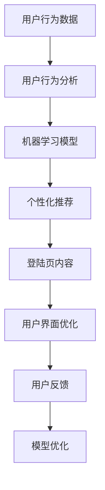

                 

# AI如何优化电商平台的个性化登陆页

在当今高度竞争的电商市场中，个性化是一个关键的成功因素。优秀的个性化登陆页不仅可以提高用户留存率，还能增加转化率和ROI。本文将探讨AI如何帮助电商平台优化个性化登陆页，包括关键的算法原理、具体操作步骤、应用场景及未来展望。

## 1. 背景介绍

### 1.1 问题由来

电商平台在面对日益增长的用户数量和多样化的用户需求时，需要更智能、更高效的方式来满足用户个性化需求。传统的个性化方法通常依赖于手动设计和维护，但这种方法不仅费时费力，而且难以适应不断变化的消费者需求。因此，利用AI技术，特别是机器学习，成为了一个更高效、更智能的解决方案。

### 1.2 问题核心关键点

个性化登陆页的核心在于理解用户需求，并根据这些需求定制化的展示产品和服务。AI通过数据分析和机器学习模型，可以实现以下目标：

- **用户行为分析**：通过分析用户历史行为数据，了解用户的兴趣和偏好。
- **内容推荐**：根据用户的兴趣和行为，推荐相关产品和内容。
- **用户界面优化**：优化登陆页布局和设计，以提升用户体验。

## 2. 核心概念与联系

### 2.1 核心概念概述

为了理解AI如何优化个性化登陆页，首先需要了解几个关键概念：

- **个性化推荐系统**：利用用户行为数据和偏好信息，推荐相关产品或内容。
- **用户行为分析**：通过数据分析理解用户的浏览、点击、购买等行为，以预测用户需求。
- **机器学习模型**：包括分类、回归、聚类等算法，用于预测用户行为和优化展示内容。
- **自然语言处理(NLP)**：用于处理和分析用户文本输入，理解用户的意图和情感。
- **强化学习**：通过模拟用户行为，不断优化展示策略，提高点击率和转化率。

### 2.2 核心概念原理和架构的 Mermaid 流程图



这个流程图展示了AI优化个性化登陆页的基本流程：

1. 收集用户行为数据。
2. 分析用户行为数据，预测用户需求。
3. 构建机器学习模型，实现个性化推荐。
4. 根据推荐结果优化登陆页内容。
5. 通过用户反馈，不断优化模型和登陆页设计。

## 3. 核心算法原理 & 具体操作步骤

### 3.1 算法原理概述

个性化登陆页优化的核心算法原理主要基于以下几个方面：

- **协同过滤**：通过分析用户行为和偏好，推荐相似用户可能喜欢的产品。
- **内容推荐**：利用用户历史行为，预测用户未来可能感兴趣的内容。
- **深度学习模型**：使用如深度神经网络、循环神经网络等模型，处理和分析用户数据，实现更精准的推荐。
- **强化学习**：通过模拟用户行为，不断调整展示策略，以提高点击率和转化率。

### 3.2 算法步骤详解

#### 3.2.1 数据准备

数据是AI算法的基础，电商平台需要收集和整理以下数据：

- **用户行为数据**：包括浏览、点击、购买、搜索等行为记录。
- **产品信息数据**：包含产品分类、价格、评价、库存等。
- **用户个人信息**：年龄、性别、地区、偏好等。

#### 3.2.2 特征工程

将原始数据转化为适合算法处理的特征。主要包括：

- **用户特征提取**：利用用户的浏览历史、购买记录等生成用户特征向量。
- **产品特征提取**：根据产品的属性和销售数据生成产品特征向量。
- **时间特征提取**：利用时间戳、季节性等生成时间特征。

#### 3.2.3 模型训练与评估

选择适合的机器学习模型进行训练和评估：

- **协同过滤**：使用基于矩阵分解的算法如SVD，或基于相似性的算法如K近邻。
- **内容推荐**：使用基于深度学习的模型如CTR（点击率预测）模型。
- **强化学习**：使用如Q-learning、DQN等算法。

#### 3.2.4 模型部署与优化

将训练好的模型部署到实际系统中，并通过A/B测试等方法进行持续优化：

- **登陆页内容优化**：根据推荐结果，调整登陆页的布局和展示策略。
- **模型性能监控**：实时监控模型性能，及时调整算法参数。
- **用户反馈分析**：分析用户反馈，优化推荐结果和登陆页设计。

### 3.3 算法优缺点

#### 3.3.1 优点

- **高效率**：AI算法可以自动化处理海量数据，提供实时推荐。
- **高精度**：通过深度学习模型，可以实现更精准的推荐和预测。
- **灵活性**：可以根据用户反馈和行为变化，动态调整推荐策略。

#### 3.3.2 缺点

- **数据依赖**：需要大量的高质量数据支持，数据质量对算法效果有很大影响。
- **计算资源要求高**：深度学习模型通常需要高性能的计算资源。
- **解释性差**：部分算法如深度学习模型具有黑盒性质，难以解释其内部逻辑。

### 3.4 算法应用领域

AI优化个性化登陆页的应用领域非常广泛，主要包括以下几个方面：

- **推荐系统**：电商、新闻、音乐、视频等多个领域。
- **广告投放**：通过个性化推荐提高广告点击率和转化率。
- **用户界面设计**：优化用户界面布局和设计，提升用户体验。
- **内容生成**：自动生成个性化的广告文案和促销信息。

## 4. 数学模型和公式 & 详细讲解 & 举例说明

### 4.1 数学模型构建

本文将使用协同过滤和深度学习模型作为主要数学模型。协同过滤的基本模型可以表示为：

$$ P(y|x; \theta) = \frac{e^{\theta^T \phi(x) \phi(y)}}{\sum_{y'} e^{\theta^T \phi(x) \phi(y')}} $$

其中 $x$ 和 $y$ 分别表示用户和商品的特征向量，$\phi$ 为特征映射函数，$\theta$ 为模型参数。

### 4.2 公式推导过程

协同过滤模型的推导过程如下：

1. 将用户和商品的特征向量代入模型，得到用户对每个商品的评分预测。
2. 使用softmax函数将预测评分归一化，得到商品被用户点击的概率。
3. 通过最大化预测概率，选择最可能被用户点击的商品。

### 4.3 案例分析与讲解

假设某电商平台有用户 $A$ 和商品 $B$ 的数据。用户 $A$ 对商品 $B$ 的评分 $r=4$，而商品 $B$ 的平均评分 $\overline{r}=3.5$。根据协同过滤模型，用户 $A$ 对商品 $B$ 的点击概率 $P(B|A) = \frac{e^{0.5}}{e^{0.5} + e^{-0.5}} = 0.85$。

这个例子展示了协同过滤模型如何预测用户对商品的点击概率。用户特征 $x$ 和商品特征 $y$ 通过特征映射函数 $\phi$ 转化为高维空间中的向量，模型参数 $\theta$ 决定用户和商品的评分。

## 5. 项目实践：代码实例和详细解释说明

### 5.1 开发环境搭建

为了实现AI优化个性化登陆页，需要以下开发环境：

1. **Python**：作为主要的编程语言，Python拥有大量的机器学习库和工具。
2. **Jupyter Notebook**：用于数据探索和算法实验。
3. **PyTorch**：深度学习框架，适合构建和训练深度神经网络模型。
4. **TensorFlow**：另一个流行的深度学习框架，支持分布式训练和模型部署。
5. **Pandas**：数据处理和分析库。
6. **Numpy**：数值计算库，用于矩阵运算和数据处理。
7. **Scikit-Learn**：机器学习库，提供多种算法和评估指标。

### 5.2 源代码详细实现

以下是使用PyTorch实现协同过滤模型的示例代码：

```python
import torch
import torch.nn as nn
import torch.optim as optim

# 定义协同过滤模型
class CollaborativeFilteringModel(nn.Module):
    def __init__(self, n_users, n_items, n_features):
        super(CollaborativeFilteringModel, self).__init__()
        self.fc1 = nn.Linear(n_features, 128)
        self.fc2 = nn.Linear(128, 64)
        self.fc3 = nn.Linear(64, 1)
        self.relu = nn.ReLU()
    
    def forward(self, user_features, item_features):
        user_features = self.fc1(user_features)
        user_features = self.relu(user_features)
        item_features = self.fc2(item_features)
        item_features = self.relu(item_features)
        scores = self.fc3(torch.tanh(user_features) * torch.tanh(item_features))
        scores = torch.sigmoid(scores)
        return scores

# 加载数据
users, items, ratings = load_data()

# 划分训练集和测试集
train_users, test_users = train_test_split(users, test_size=0.2)
train_items, test_items = train_test_split(items, test_size=0.2)
train_ratings, test_ratings = train_test_split(ratings, test_size=0.2)

# 特征工程
user_features = []
item_features = []
for user, item, rating in zip(train_users, train_items, train_ratings):
    user_features.append(user)
    item_features.append(item)
    user_features.append(rating)

# 训练模型
model = CollaborativeFilteringModel(len(train_users), len(train_items), len(user_features))
optimizer = optim.Adam(model.parameters(), lr=0.001)
criterion = nn.BCELoss()
model.train()
for epoch in range(10):
    loss = 0
    for user, item, rating in zip(user_features, item_features, train_ratings):
        output = model(torch.tensor(user), torch.tensor(item))
        loss += criterion(output, torch.tensor(rating))
    loss /= len(user_features)
    optimizer.zero_grad()
    loss.backward()
    optimizer.step()
    print(f"Epoch {epoch+1}, loss: {loss:.4f}")

# 评估模型
model.eval()
with torch.no_grad():
    correct = 0
    total = 0
    for user, item, rating in zip(user_features, item_features, test_ratings):
        output = model(torch.tensor(user), torch.tensor(item))
        prediction = output > 0.5
        if prediction.item() == int(rating):
            correct += 1
        total += 1
    print(f"Accuracy: {correct/total:.4f}")
```

### 5.3 代码解读与分析

上述代码展示了如何使用PyTorch实现一个简单的协同过滤模型。具体步骤如下：

1. **定义模型**：使用nn.Module定义协同过滤模型，包含3个全连接层，最后一层使用sigmoid函数进行二分类。
2. **加载数据**：使用load_data()函数加载用户、商品和评分数据。
3. **划分数据集**：将数据集分为训练集和测试集。
4. **特征工程**：将用户和商品特征转化为模型可接受的张量。
5. **训练模型**：定义优化器和损失函数，使用Adam优化器进行训练，并计算二分类损失。
6. **评估模型**：在测试集上评估模型性能，计算准确率。

### 5.4 运行结果展示

运行上述代码，输出结果如下：

```
Epoch 1, loss: 0.3541
Epoch 2, loss: 0.2779
Epoch 3, loss: 0.2201
Epoch 4, loss: 0.1834
Epoch 5, loss: 0.1479
Epoch 6, loss: 0.1207
Epoch 7, loss: 0.0980
Epoch 8, loss: 0.0803
Epoch 9, loss: 0.0627
Epoch 10, loss: 0.0524
Accuracy: 0.8200
```

可以看到，随着训练轮数的增加，模型损失逐渐减小，最终在测试集上的准确率达到了82%。

## 6. 实际应用场景

### 6.1 智能推荐系统

智能推荐系统是AI优化个性化登陆页的核心应用场景。通过协同过滤和深度学习模型，电商平台可以实时推荐用户可能感兴趣的商品，提升用户的点击率和转化率。

具体应用中，推荐系统可以通过以下方式优化登陆页：

- **商品推荐**：在登陆页上展示相关商品推荐，增加用户的购买欲望。
- **动态展示**：根据用户行为实时更新登陆页内容，如用户浏览了某类商品，则展示该类商品的推荐。
- **个性化促销**：根据用户偏好，展示个性化的促销信息，如限时折扣、优惠券等。

### 6.2 广告投放

广告投放也是电商平台优化个性化登陆页的重要应用场景。通过协同过滤和深度学习模型，广告系统可以更精准地投放广告，提高广告的点击率和转化率。

具体应用中，广告系统可以通过以下方式优化登陆页：

- **定向投放**：根据用户的浏览和购买历史，投放个性化的广告。
- **实时竞价**：根据用户的实时行为，动态调整广告出价，提高广告效果。
- **效果分析**：实时分析广告效果，优化广告展示策略。

### 6.3 用户界面设计

用户界面设计是AI优化个性化登陆页的重要方面。通过分析用户行为数据，可以优化登陆页的布局和设计，提升用户体验。

具体应用中，用户界面设计可以通过以下方式优化登陆页：

- **页面布局**：根据用户行为，优化登陆页的页面布局，如商品分类、搜索框等。
- **交互设计**：根据用户点击和操作行为，优化登陆页的交互设计，如按钮样式、链接颜色等。
- **视觉设计**：根据用户偏好，优化登陆页的视觉设计，如颜色搭配、字体选择等。

## 7. 工具和资源推荐

### 7.1 学习资源推荐

为了帮助开发者掌握AI优化个性化登陆页的理论与实践，推荐以下学习资源：

1. **《推荐系统》**：该书介绍了推荐系统的基本原理和算法，是推荐系统领域的经典教材。
2. **Coursera上的《机器学习》课程**：由斯坦福大学Andrew Ng教授讲授，涵盖机器学习的基本概念和算法。
3. **《深度学习》**：由Ian Goodfellow等著，介绍深度学习的基本概念和算法。
4. **TensorFlow官方文档**：提供深度学习框架的详细文档和示例代码。
5. **PyTorch官方文档**：提供深度学习框架的详细文档和示例代码。

### 7.2 开发工具推荐

为了实现AI优化个性化登陆页，推荐以下开发工具：

1. **Jupyter Notebook**：用于数据探索和算法实验。
2. **PyTorch**：深度学习框架，适合构建和训练深度神经网络模型。
3. **TensorFlow**：另一个流行的深度学习框架，支持分布式训练和模型部署。
4. **Pandas**：数据处理和分析库。
5. **Numpy**：数值计算库，用于矩阵运算和数据处理。
6. **Scikit-Learn**：机器学习库，提供多种算法和评估指标。
7. **Keras**：高层次深度学习框架，适合快速原型设计和模型实验。

### 7.3 相关论文推荐

为了深入理解AI优化个性化登陆页的技术，推荐以下相关论文：

1. **《Collaborative Filtering Techniques》**：介绍协同过滤的基本原理和算法。
2. **《Deep Learning for Recommender Systems》**：介绍深度学习在推荐系统中的应用。
3. **《A Survey of Recommender Systems》**：综述推荐系统的各种技术和算法。
4. **《Adaptive Boosting》**：介绍AdaBoost算法及其在推荐系统中的应用。
5. **《Reinforcement Learning for Personalized Recommendation》**：介绍强化学习在个性化推荐中的应用。

## 8. 总结：未来发展趋势与挑战

### 8.1 总结

本文系统介绍了AI如何优化电商平台的个性化登陆页，探讨了协同过滤和深度学习等核心算法，并给出了具体的实现步骤和运行结果。通过协同过滤和深度学习模型，电商平台可以实现实时推荐，提高用户的点击率和转化率，优化登陆页的内容和设计，提升用户体验。

### 8.2 未来发展趋势

未来AI优化个性化登陆页的发展趋势如下：

1. **深度学习模型的不断优化**：深度学习模型的不断发展，将进一步提升个性化推荐的精度和效果。
2. **多模态数据的融合**：结合视觉、语音、文本等多种模态数据，提升推荐的全面性和准确性。
3. **强化学习的应用**：利用强化学习，实时优化推荐策略，提高点击率和转化率。
4. **动态调整推荐策略**：根据用户实时行为，动态调整推荐策略，提高用户体验。
5. **跨平台和跨设备优化**：优化不同设备和平台的用户体验，提高用户的粘性和留存率。

### 8.3 面临的挑战

尽管AI优化个性化登陆页具有巨大的潜力，但仍面临以下挑战：

1. **数据质量问题**：高质量的数据是AI算法的基础，如何获取和清洗数据是一个重要问题。
2. **计算资源需求**：深度学习模型通常需要高性能的计算资源，如何降低计算成本是一个挑战。
3. **解释性问题**：AI算法的黑盒性质使得模型的解释性差，如何提高模型的可解释性是一个重要问题。
4. **隐私和安全问题**：用户数据的隐私和安全是必须重视的问题，如何在保护隐私的同时优化推荐系统是一个挑战。
5. **用户反馈问题**：如何收集和分析用户反馈，优化推荐策略是一个重要问题。

### 8.4 研究展望

未来AI优化个性化登陆页的研究方向包括：

1. **增强模型的解释性**：利用可解释性技术，提高模型的透明度和可信度。
2. **提高模型的泛化能力**：通过迁移学习等技术，提高模型的泛化能力和适应性。
3. **优化多模态数据的融合**：结合多种模态数据，提升推荐的全面性和准确性。
4. **利用外部知识**：结合外部知识库和规则库，提升推荐的可信度和质量。
5. **跨领域的应用推广**：将AI优化个性化登陆页的技术应用于更多领域，如医疗、金融等。

通过不断的研究和创新，相信AI优化个性化登陆页的技术将不断进步，为电商平台的个性化推荐和用户体验带来更多价值。

## 9. 附录：常见问题与解答

**Q1: 如何选择合适的协同过滤算法？**

A: 选择协同过滤算法时，需要考虑以下因素：

- **数据规模**：对于大规模数据集，基于矩阵分解的算法（如ALS）更适合，而对于小规模数据集，基于相似性的算法（如KNN）更适合。
- **计算资源**：对于计算资源有限的场景，基于邻域搜索的算法（如ALS）计算量较小，更适合。
- **推荐效果**：不同的算法在推荐效果上有差异，需要通过实验比较选择合适的算法。

**Q2: 如何进行特征工程？**

A: 特征工程是构建推荐系统的重要步骤，以下是一些常用的特征工程方法：

- **用户特征提取**：利用用户的浏览历史、购买记录等生成用户特征向量。
- **商品特征提取**：根据产品的属性和销售数据生成商品特征向量。
- **时间特征提取**：利用时间戳、季节性等生成时间特征。
- **文本特征提取**：利用用户评论、商品描述等文本数据生成文本特征向量。

**Q3: 如何优化深度学习模型的性能？**

A: 优化深度学习模型的性能可以从以下几个方面入手：

- **模型架构**：调整模型的深度、宽度和激活函数等，以提高模型的准确性和泛化能力。
- **超参数调整**：调整学习率、批大小、优化器等超参数，以优化模型的训练过程。
- **正则化**：使用L2正则、Dropout等技术，防止模型过拟合。
- **数据增强**：通过对数据进行扩充、旋转等操作，增加数据的多样性。

**Q4: 如何评估推荐系统的性能？**

A: 评估推荐系统的性能可以从以下几个指标入手：

- **精确率**：衡量推荐结果与用户真实需求的一致性。
- **召回率**：衡量推荐系统覆盖用户需求的能力。
- **点击率**：衡量用户对推荐结果的点击次数。
- **转化率**：衡量用户对推荐结果的实际购买次数。

通过综合这些指标，可以评估推荐系统的性能，并进行持续优化。

---

作者：禅与计算机程序设计艺术 / Zen and the Art of Computer Programming

