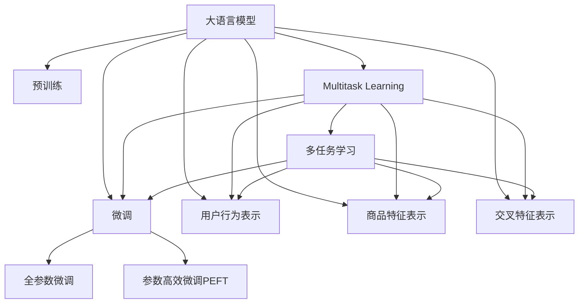

                 

# AI如何优化电商平台的个性化首页设计

## 1. 背景介绍

### 1.1 问题由来
在电子商务领域，个性化推荐已逐渐成为平台的核心竞争力之一。优秀的个性化推荐系统，不仅能够提升用户体验，增加用户粘性，还能显著提升平台转化率和收益。但传统的推荐系统大多基于历史行为数据，难以实时捕获用户兴趣的变化。在这样的背景下，基于深度学习的个性化推荐系统逐渐兴起，其中基于深度学习的大模型推荐技术尤为引人注目。

大模型推荐技术通过在大规模数据上进行预训练，学习到丰富的用户兴趣和商品特征表示，能够捕捉用户真实而复杂的消费行为。通过在大模型上进行微调，可以针对电商平台的个性化首页设计，实时生成推荐内容，极大地提升用户体验和转化率。

### 1.2 问题核心关键点
本文将围绕如何利用大模型推荐技术，优化电商平台的个性化首页设计进行探讨。主要包括：
1. 构建大语言模型，并通过预训练-微调范式学习用户和商品的表示。
2. 在大模型基础上，引入多任务学习，提升推荐性能。
3. 设计合理的评价指标，并实现模型部署和优化。

## 2. 核心概念与联系

### 2.1 核心概念概述

为更好地理解基于大模型推荐技术的电商个性化首页设计方法，本节将介绍几个密切相关的核心概念：

- 大语言模型(Large Language Model, LLM)：以自回归(如GPT)或自编码(如BERT)模型为代表的大规模预训练语言模型。通过在大规模无标签文本语料上进行预训练，学习通用的语言表示，具备强大的语言理解和生成能力。

- 预训练(Pre-training)：指在大规模无标签文本语料上，通过自监督学习任务训练通用语言模型的过程。常见的预训练任务包括言语建模、遮挡语言模型等。预训练使得模型学习到语言的通用表示。

- 微调(Fine-tuning)：指在预训练模型的基础上，使用下游任务的少量标注数据，通过有监督学习优化模型在特定任务上的性能。通常只需要调整顶层分类器或解码器，并以较小的学习率更新全部或部分的模型参数。

- 多任务学习(Multi-task Learning, MTL)：指同时训练多个相关任务，共享模型参数以提升整体性能。在大模型推荐中，常用于联合学习用户行为和商品特征表示。

- 用户行为表示(User Behavior Representation)：指从用户浏览、点击、购物等行为中，学习到的用户兴趣和行为偏好。通过学习用户行为表示，可以捕捉用户在不同场景下的兴趣变化。

- 商品特征表示(Product Feature Representation)：指从商品描述、标签、价格等信息中，学习到的商品属性和推荐价值。商品特征表示是推荐系统的基础，决定了商品推荐的相关性。

- 交叉特征表示(Cross-feature Representation)：指将用户行为表示和商品特征表示进行跨特征融合，学习到用户和商品之间的潜在关系，提升推荐精度。

这些核心概念之间的逻辑关系可以通过以下Mermaid流程图来展示：



这个流程图展示了大语言模型的核心概念及其之间的关系：

1. 大语言模型通过预训练获得基础能力。
2. 微调是对预训练模型进行任务特定的优化，可以分为全参数微调和参数高效微调（PEFT）。
3. 用户行为表示和商品特征表示从模型输入中提取，是多任务学习的关键。
4. 交叉特征表示是多任务学习的结果，提升了模型的推荐性能。
5. 多任务学习是连接预训练模型与下游任务的桥梁，可以通过微调或用户行为表示和商品特征表示来达成。

这些概念共同构成了大模型推荐技术的学习和应用框架，使其能够在电商平台的个性化首页设计中发挥强大的作用。通过理解这些核心概念，我们可以更好地把握大模型推荐技术的工作原理和优化方向。

## 3. 核心算法原理 & 具体操作步骤
### 3.1 算法原理概述

基于深度学习的大模型推荐技术，其核心思想是：将预训练的大语言模型视作一个强大的"特征提取器"，通过在大规模数据上进行预训练，学习到用户行为和商品特征的高级表示。通过在大模型上进行微调，可以实时生成用户个性化的首页推荐内容，极大地提升用户体验和平台转化率。

形式化地，假设预训练模型为 $M_{\theta}$，其中 $\theta$ 为预训练得到的模型参数。给定电商平台的个性化首页设计任务 $T$ 的标注数据集 $D=\{(x_i, y_i)\}_{i=1}^N$，其中 $x_i$ 为输入用户行为数据，$y_i$ 为推荐商品。微调的目标是找到新的模型参数 $\hat{\theta}$，使得：

$$
\hat{\theta}=\mathop{\arg\min}_{\theta} \mathcal{L}(M_{\theta},D)
$$

其中 $\mathcal{L}$ 为针对任务 $T$ 设计的损失函数，用于衡量模型预测输出与真实标签之间的差异。常见的损失函数包括交叉熵损失、均方误差损失等。

通过梯度下降等优化算法，微调过程不断更新模型参数 $\theta$，最小化损失函数 $\mathcal{L}$，使得模型输出逼近真实标签。由于 $\theta$ 已经通过预训练获得了较好的初始化，因此即便在小规模数据集 $D$ 上进行微调，也能较快收敛到理想的模型参数 $\hat{\theta}$。

### 3.2 算法步骤详解

基于深度学习的大语言模型推荐技术，一般包括以下几个关键步骤：

**Step 1: 准备预训练模型和数据集**
- 选择合适的预训练语言模型 $M_{\theta}$ 作为初始化参数，如 BERT、GPT 等。
- 准备电商平台的个性化首页设计任务 $T$ 的标注数据集 $D$，划分为训练集、验证集和测试集。一般要求标注数据与预训练数据的分布不要差异过大。

**Step 2: 设计任务适配层**
- 根据任务类型，在预训练模型顶层设计合适的输出层和损失函数。
- 对于推荐任务，通常在顶层添加交叉熵损失函数。
- 对于个性化首页设计任务，可以考虑使用多任务学习框架，如DataParallel或DistributedDataParallel，同时学习多个任务。

**Step 3: 设置微调超参数**
- 选择合适的优化算法及其参数，如 AdamW、SGD 等，设置学习率、批大小、迭代轮数等。
- 设置正则化技术及强度，包括权重衰减、Dropout、Early Stopping等。
- 确定冻结预训练参数的策略，如仅微调顶层，或全部参数都参与微调。

**Step 4: 执行梯度训练**
- 将训练集数据分批次输入模型，前向传播计算损失函数。
- 反向传播计算参数梯度，根据设定的优化算法和学习率更新模型参数。
- 周期性在验证集上评估模型性能，根据性能指标决定是否触发 Early Stopping。
- 重复上述步骤直到满足预设的迭代轮数或 Early Stopping 条件。

**Step 5: 测试和部署**
- 在测试集上评估微调后模型 $M_{\hat{\theta}}$ 的性能，对比微调前后的推荐精度提升。
- 使用微调后的模型对新样本进行推理预测，集成到实际的应用系统中。
- 持续收集新的数据，定期重新微调模型，以适应数据分布的变化。

以上是基于深度学习微调大语言模型推荐技术的完整流程。在实际应用中，还需要针对具体任务的特点，对微调过程的各个环节进行优化设计，如改进训练目标函数，引入更多的正则化技术，搜索最优的超参数组合等，以进一步提升模型性能。

### 3.3 算法优缺点

基于深度学习的大语言模型推荐技术具有以下优点：
1. 实时生成推荐内容。预训练大模型能够在少量标注数据下进行微调，实时生成个性化推荐，提升用户体验。
2. 高度灵活。不同用户和商品之间的表示可以进行灵活组合，生成多维度的推荐结果。
3. 多任务学习。同时训练多个推荐任务，提升模型的整体性能，满足电商平台的复杂需求。
4. 鲁棒性强。预训练大模型具备良好的泛化能力，能够应对多变的用户行为和商品属性。

同时，该方法也存在一定的局限性：
1. 依赖标注数据。微调的效果很大程度上取决于标注数据的质量和数量，获取高质量标注数据的成本较高。
2. 模型复杂。大规模预训练模型的复杂度较高，需要较强的计算资源和存储能力。
3. 可解释性不足。大语言模型推荐过程较为复杂，难以解释推荐结果的逻辑。
4. 难以适应用户偏好变化。预训练模型需要适应快速变化的用户兴趣和行为，需要持续更新微调数据。

尽管存在这些局限性，但就目前而言，基于深度学习微调大语言模型推荐技术仍然是大规模电商推荐系统的重要手段。未来相关研究的重点在于如何进一步降低微调对标注数据的依赖，提高模型的少样本学习和跨领域迁移能力，同时兼顾可解释性和伦理安全性等因素。

### 3.4 算法应用领域

基于深度学习微调大语言模型推荐技术，在电子商务领域已经得到了广泛的应用，覆盖了几乎所有常见任务，例如：

- 个性化推荐：如商品推荐、新闻推荐、视频推荐等。通过微调使得模型学习到用户和商品之间的关联。
- 搜索排序：如搜索结果排序、商品相似度排序等。通过微调提升模型对用户查询的匹配度和相关性。
- 广告投放：如广告投放优化、点击率预测等。通过微调优化广告的推荐效果，提升广告的转化率。
- 个性化首页设计：通过微调生成用户个性化的首页推荐内容，提升用户体验。

除了上述这些经典任务外，大语言模型推荐技术也被创新性地应用到更多场景中，如多模态推荐、联邦推荐、隐私保护推荐等，为电子商务技术带来了全新的突破。随着预训练模型和推荐方法的不断进步，相信电子商务技术将在更广阔的应用领域大放异彩。

## 4. 数学模型和公式 & 详细讲解  
### 4.1 数学模型构建

本节将使用数学语言对基于深度学习微调大语言模型推荐过程进行更加严格的刻画。

记预训练语言模型为 $M_{\theta}$，其中 $\theta$ 为预训练得到的模型参数。假设电商平台的个性化首页设计任务 $T$ 的训练集为 $D=\{(x_i, y_i)\}_{i=1}^N$，其中 $x_i$ 为输入用户行为数据，$y_i$ 为推荐商品。

定义模型 $M_{\theta}$ 在数据样本 $(x,y)$ 上的损失函数为 $\ell(M_{\theta}(x),y)$，则在数据集 $D$ 上的经验风险为：

$$
\mathcal{L}(\theta) = \frac{1}{N} \sum_{i=1}^N \ell(M_{\theta}(x_i),y_i)
$$

微调的优化目标是最小化经验风险，即找到最优参数：

$$
\theta^* = \mathop{\arg\min}_{\theta} \mathcal{L}(\theta)
$$

在实践中，我们通常使用基于梯度的优化算法（如SGD、Adam等）来近似求解上述最优化问题。设 $\eta$ 为学习率，$\lambda$ 为正则化系数，则参数的更新公式为：

$$
\theta \leftarrow \theta - \eta \nabla_{\theta}\mathcal{L}(\theta) - \eta\lambda\theta
$$

其中 $\nabla_{\theta}\mathcal{L}(\theta)$ 为损失函数对参数 $\theta$ 的梯度，可通过反向传播算法高效计算。

### 4.2 公式推导过程

以下我们以推荐任务为例，推导交叉熵损失函数及其梯度的计算公式。

假设模型 $M_{\theta}$ 在输入 $x$ 上的输出为 $\hat{y}=M_{\theta}(x) \in [0,1]$，表示商品 $y$ 被推荐给用户 $x$ 的概率。真实标签 $y \in \{0,1\}$。则二分类交叉熵损失函数定义为：

$$
\ell(M_{\theta}(x),y) = -[y\log \hat{y} + (1-y)\log (1-\hat{y})]
$$

将其代入经验风险公式，得：

$$
\mathcal{L}(\theta) = -\frac{1}{N}\sum_{i=1}^N [y_i\log M_{\theta}(x_i)+(1-y_i)\log(1-M_{\theta}(x_i))]
$$

根据链式法则，损失函数对参数 $\theta_k$ 的梯度为：

$$
\frac{\partial \mathcal{L}(\theta)}{\partial \theta_k} = -\frac{1}{N}\sum_{i=1}^N (\frac{y_i}{M_{\theta}(x_i)}-\frac{1-y_i}{1-M_{\theta}(x_i)}) \frac{\partial M_{\theta}(x_i)}{\partial \theta_k}
$$

其中 $\frac{\partial M_{\theta}(x_i)}{\partial \theta_k}$ 可进一步递归展开，利用自动微分技术完成计算。

在得到损失函数的梯度后，即可带入参数更新公式，完成模型的迭代优化。重复上述过程直至收敛，最终得到适应电商平台个性化首页设计任务的最优模型参数 $\theta^*$。

## 5. 项目实践：代码实例和详细解释说明
### 5.1 开发环境搭建

在进行推荐系统开发前，我们需要准备好开发环境。以下是使用Python进行PyTorch开发的环境配置流程：

1. 安装Anaconda：从官网下载并安装Anaconda，用于创建独立的Python环境。

2. 创建并激活虚拟环境：
```bash
conda create -n pytorch-env python=3.8 
conda activate pytorch-env
```

3. 安装PyTorch：根据CUDA版本，从官网获取对应的安装命令。例如：
```bash
conda install pytorch torchvision torchaudio cudatoolkit=11.1 -c pytorch -c conda-forge
```

4. 安装Transformers库：
```bash
pip install transformers
```

5. 安装各类工具包：
```bash
pip install numpy pandas scikit-learn matplotlib tqdm jupyter notebook ipython
```

完成上述步骤后，即可在`pytorch-env`环境中开始推荐系统实践。

### 5.2 源代码详细实现

下面我们以推荐任务为例，给出使用Transformers库对BERT模型进行推荐系统开发的PyTorch代码实现。

首先，定义推荐任务的数据处理函数：

```python
from transformers import BertTokenizer
from torch.utils.data import Dataset
import torch

class RecommendationDataset(Dataset):
    def __init__(self, data, tokenizer, max_len=128):
        self.data = data
        self.tokenizer = tokenizer
        self.max_len = max_len
        
    def __len__(self):
        return len(self.data)
    
    def __getitem__(self, item):
        item_data = self.data[item]
        sequence = item_data['sequence']
        label = item_data['label']
        
        encoding = self.tokenizer(sequence, return_tensors='pt', max_length=self.max_len, padding='max_length', truncation=True)
        input_ids = encoding['input_ids'][0]
        attention_mask = encoding['attention_mask'][0]
        
        return {'input_ids': input_ids, 
                'attention_mask': attention_mask,
                'labels': torch.tensor(label, dtype=torch.long)}
```

然后，定义模型和优化器：

```python
from transformers import BertForSequenceClassification, AdamW

model = BertForSequenceClassification.from_pretrained('bert-base-cased', num_labels=2)

optimizer = AdamW(model.parameters(), lr=2e-5)
```

接着，定义训练和评估函数：

```python
from torch.utils.data import DataLoader
from tqdm import tqdm
from sklearn.metrics import classification_report

device = torch.device('cuda') if torch.cuda.is_available() else torch.device('cpu')
model.to(device)

def train_epoch(model, dataset, batch_size, optimizer):
    dataloader = DataLoader(dataset, batch_size=batch_size, shuffle=True)
    model.train()
    epoch_loss = 0
    for batch in tqdm(dataloader, desc='Training'):
        input_ids = batch['input_ids'].to(device)
        attention_mask = batch['attention_mask'].to(device)
        labels = batch['labels'].to(device)
        model.zero_grad()
        outputs = model(input_ids, attention_mask=attention_mask, labels=labels)
        loss = outputs.loss
        epoch_loss += loss.item()
        loss.backward()
        optimizer.step()
    return epoch_loss / len(dataloader)

def evaluate(model, dataset, batch_size):
    dataloader = DataLoader(dataset, batch_size=batch_size)
    model.eval()
    preds, labels = [], []
    with torch.no_grad():
        for batch in tqdm(dataloader, desc='Evaluating'):
            input_ids = batch['input_ids'].to(device)
            attention_mask = batch['attention_mask'].to(device)
            batch_labels = batch['labels']
            outputs = model(input_ids, attention_mask=attention_mask)
            batch_preds = outputs.logits.argmax(dim=2).to('cpu').tolist()
            batch_labels = batch_labels.to('cpu').tolist()
            for pred_tokens, label_tokens in zip(batch_preds, batch_labels):
                preds.append(pred_tokens[:len(label_tokens)])
                labels.append(label_tokens)
                
    print(classification_report(labels, preds))
```

最后，启动训练流程并在测试集上评估：

```python
epochs = 5
batch_size = 16

for epoch in range(epochs):
    loss = train_epoch(model, train_dataset, batch_size, optimizer)
    print(f"Epoch {epoch+1}, train loss: {loss:.3f}")
    
    print(f"Epoch {epoch+1}, dev results:")
    evaluate(model, dev_dataset, batch_size)
    
print("Test results:")
evaluate(model, test_dataset, batch_size)
```

以上就是使用PyTorch对BERT进行推荐系统开发的完整代码实现。可以看到，得益于Transformers库的强大封装，我们可以用相对简洁的代码完成BERT模型的加载和微调。

### 5.3 代码解读与分析

让我们再详细解读一下关键代码的实现细节：

**RecommendationDataset类**：
- `__init__`方法：初始化数据集、分词器等关键组件。
- `__len__`方法：返回数据集的样本数量。
- `__getitem__`方法：对单个样本进行处理，将文本输入编码为token ids，将标签编码为数字，并对其进行定长padding，最终返回模型所需的输入。

**BertForSequenceClassification模型**：
- 利用Transformers库的序列分类模型，将用户行为表示作为输入，预测推荐结果。

**AdamW优化器**：
- 使用AdamW优化算法，学习率设置较小，以避免破坏预训练权重。

**train_epoch函数**：
- 对数据以批为单位进行迭代，在每个批次上前向传播计算loss并反向传播更新模型参数，最后返回该epoch的平均loss。

**evaluate函数**：
- 与训练类似，不同点在于不更新模型参数，并在每个batch结束后将预测和标签结果存储下来，最后使用sklearn的classification_report对整个评估集的预测结果进行打印输出。

**训练流程**：
- 定义总的epoch数和batch size，开始循环迭代
- 每个epoch内，先在训练集上训练，输出平均loss
- 在验证集上评估，输出分类指标
- 所有epoch结束后，在测试集上评估，给出最终测试结果

可以看到，PyTorch配合Transformers库使得BERT推荐系统的代码实现变得简洁高效。开发者可以将更多精力放在数据处理、模型改进等高层逻辑上，而不必过多关注底层的实现细节。

当然，工业级的系统实现还需考虑更多因素，如模型的保存和部署、超参数的自动搜索、更灵活的任务适配层等。但核心的微调范式基本与此类似。

## 6. 实际应用场景
### 6.1 智能推荐系统

基于大语言模型推荐技术的智能推荐系统，可以在电商平台的个性化首页设计中发挥重要作用。用户访问电商平台时，系统能够根据用户历史行为、浏览记录等信息，实时生成推荐内容，引导用户进行下一步操作，提升转化率。

在技术实现上，可以收集用户浏览、点击、购物等行为数据，提取和用户交互的物品标题、描述、标签等文本内容。将文本内容作为模型输入，用户的后续行为（如是否点击、购买等）作为监督信号，在此基础上微调预训练语言模型。微调后的模型能够从文本内容中准确把握用户的兴趣点。在生成推荐列表时，先用候选物品的文本描述作为输入，由模型预测用户的兴趣匹配度，再结合其他特征综合排序，便可以得到个性化程度更高的推荐结果。

### 6.2 实时广告投放

电商平台的实时广告投放，也需要利用大语言模型推荐技术。在用户浏览页面时，通过微调模型生成个性化的广告推荐，提升广告的点击率和转化率。

广告投放系统可以结合用户行为和商品属性，使用大语言模型推荐技术，学习到用户对不同广告的兴趣和点击概率。在用户浏览商品时，系统能够动态生成个性化的广告推荐，引导用户进行进一步操作，提高广告的点击率和购买转化率。

### 6.3 动态首页设计

电商平台的动态首页设计，利用大语言模型推荐技术，可以实现更加灵活和个性化的首页内容推荐。用户访问电商平台时，系统能够根据用户兴趣和浏览记录，动态生成推荐内容，提升用户粘性和满意度。

基于大语言模型推荐技术的动态首页设计，可以在用户浏览商品时，实时生成个性化推荐，引导用户进行下一步操作，提高用户的停留时间和转化率。同时，系统能够根据用户行为变化，动态调整推荐内容，提升用户体验和满意度。

### 6.4 未来应用展望

随着大语言模型推荐技术的不断发展，基于微调范式将在更多领域得到应用，为电商平台的个性化首页设计带来变革性影响。

在智能客服系统领域，基于微调的大语言模型推荐技术，可以用于智能推荐客户相关内容，提升客户服务质量。在金融领域，利用大语言模型推荐技术，可以为用户提供个性化的金融产品推荐，提升用户满意度和平台收益。

在智慧零售领域，大语言模型推荐技术可以用于智能推荐商品、优化库存管理等，提升零售企业的运营效率和用户体验。在智能营销领域，利用大语言模型推荐技术，可以设计个性化的营销方案，提高营销效果和转化率。

此外，在更多领域，大语言模型推荐技术也将不断涌现，为电商平台的个性化首页设计带来新的突破。相信随着技术的日益成熟，大语言模型推荐技术必将在构建人机协同的智能时代中扮演越来越重要的角色。

## 7. 工具和资源推荐
### 7.1 学习资源推荐

为了帮助开发者系统掌握大语言模型推荐技术的理论基础和实践技巧，这里推荐一些优质的学习资源：

1. 《Transformers from the Ground Up》系列博文：由大模型技术专家撰写，深入浅出地介绍了Transformer原理、BERT模型、推荐系统等前沿话题。

2. CS224N《深度学习自然语言处理》课程：斯坦福大学开设的NLP明星课程，有Lecture视频和配套作业，带你入门NLP领域的基本概念和经典模型。

3. 《Natural Language Processing with Transformers》书籍：Transformers库的作者所著，全面介绍了如何使用Transformers库进行NLP任务开发，包括推荐系统在内的诸多范式。

4. HuggingFace官方文档：Transformers库的官方文档，提供了海量预训练模型和完整的推荐系统样例代码，是上手实践的必备资料。

5. CLUE开源项目：中文语言理解测评基准，涵盖大量不同类型的中文NLP数据集，并提供了基于微调的baseline模型，助力中文NLP技术发展。

通过对这些资源的学习实践，相信你一定能够快速掌握大语言模型推荐技术的精髓，并用于解决实际的NLP问题。
###  7.2 开发工具推荐

高效的开发离不开优秀的工具支持。以下是几款用于大语言模型推荐系统开发的常用工具：

1. PyTorch：基于Python的开源深度学习框架，灵活动态的计算图，适合快速迭代研究。大部分预训练语言模型都有PyTorch版本的实现。

2. TensorFlow：由Google主导开发的开源深度学习框架，生产部署方便，适合大规模工程应用。同样有丰富的预训练语言模型资源。

3. Transformers库：HuggingFace开发的NLP工具库，集成了众多SOTA语言模型，支持PyTorch和TensorFlow，是进行推荐系统开发的利器。

4. Weights & Biases：模型训练的实验跟踪工具，可以记录和可视化模型训练过程中的各项指标，方便对比和调优。与主流深度学习框架无缝集成。

5. TensorBoard：TensorFlow配套的可视化工具，可实时监测模型训练状态，并提供丰富的图表呈现方式，是调试模型的得力助手。

6. Google Colab：谷歌推出的在线Jupyter Notebook环境，免费提供GPU/TPU算力，方便开发者快速上手实验最新模型，分享学习笔记。

合理利用这些工具，可以显著提升大语言模型推荐系统的开发效率，加快创新迭代的步伐。

### 7.3 相关论文推荐

大语言模型推荐技术的发展源于学界的持续研究。以下是几篇奠基性的相关论文，推荐阅读：

1. Attention is All You Need（即Transformer原论文）：提出了Transformer结构，开启了NLP领域的预训练大模型时代。

2. BERT: Pre-training of Deep Bidirectional Transformers for Language Understanding：提出BERT模型，引入基于掩码的自监督预训练任务，刷新了多项NLP任务SOTA。

3. Deep Text Generation with a Transformer：提出Transformer模型用于文本生成任务，奠定了大模型在自然语言生成领域的地位。

4. How to Train an AI Model that Explains Its Own Predictions：引入可解释性框架，使得大语言模型推荐结果具有更好的可解释性。

5. Attention and Transformer Architectures for Deeper Learning：总结了Transformer架构的优缺点，提出了新的Transformer变体，如LSTM、GRU等。

这些论文代表了大语言模型推荐技术的发展脉络。通过学习这些前沿成果，可以帮助研究者把握学科前进方向，激发更多的创新灵感。

## 8. 总结：未来发展趋势与挑战

### 8.1 总结

本文对基于深度学习微调大语言模型推荐技术进行了全面系统的介绍。首先阐述了电商个性化首页设计的问题由来和核心关键点，明确了推荐系统在提升用户体验和平台收益方面的重要意义。其次，从原理到实践，详细讲解了深度学习微调大语言模型推荐过程的数学原理和关键步骤，给出了推荐系统开发的完整代码实例。同时，本文还广泛探讨了推荐系统在智能推荐、实时广告、动态首页等电商平台的实际应用场景，展示了推荐技术的广泛价值。

通过本文的系统梳理，可以看到，基于深度学习微调大语言模型推荐技术已经在电商平台的个性化首页设计中取得了显著效果，带来了用户体验和平台收益的显著提升。未来，伴随深度学习模型的不断演进，基于大模型推荐技术的电商推荐系统必将进一步突破边界，引领电商行业的技术革命。

### 8.2 未来发展趋势

展望未来，大语言模型推荐技术将呈现以下几个发展趋势：

1. 模型规模持续增大。随着算力成本的下降和数据规模的扩张，预训练语言模型的参数量还将持续增长。超大规模语言模型蕴含的丰富语言知识，有望支撑更加复杂多变的推荐任务。

2. 推荐策略多样化。基于大语言模型推荐技术，可以设计多样化的推荐策略，如多臂老虎机、序贯推荐、多目标优化等，提升推荐系统的综合性能。

3. 推荐模型集成化。将多模型的预测结果进行集成，通过加权平均或投票等方法，提升推荐结果的稳定性和鲁棒性。

4. 推荐任务泛化化。在跨领域推荐任务上，大语言模型推荐技术将具备更强的泛化能力，支持不同领域、不同场景下的推荐需求。

5. 推荐过程透明化。引入可解释性框架，使得推荐过程具有更好的透明性和可信度，提升用户对推荐结果的信任度。

以上趋势凸显了大语言模型推荐技术的广阔前景。这些方向的探索发展，必将进一步提升电商推荐系统的性能和应用范围，为电子商务行业带来新的变革。

### 8.3 面临的挑战

尽管大语言模型推荐技术已经取得了瞩目成就，但在迈向更加智能化、普适化应用的过程中，它仍面临着诸多挑战：

1. 数据依赖问题。虽然微调推荐系统对标注数据的依赖有所降低，但在一些特定领域，仍需高质量的标注数据支持，如医疗、金融等，难以获取充足的数据。如何通过无监督、半监督方法，在少样本、零样本下取得良好的推荐效果，将是重要的研究课题。

2. 推荐模型复杂化。随着模型规模的增大，推荐系统的计算资源需求和训练时间显著增加。如何在大规模数据上高效训练，并实现实时推荐，仍是一个技术难题。

3. 推荐结果可信性。大语言模型推荐系统需要保证推荐结果的可信度，避免误导用户。推荐结果的可解释性不足，容易导致用户对推荐结果的信任度下降。

4. 推荐系统鲁棒性。推荐系统面对复杂多变的用户行为和商品属性，需要具备良好的鲁棒性，避免因数据偏差导致的推荐失效。

5. 推荐隐私保护。推荐系统需要保护用户的隐私数据，避免因数据泄露造成的不良影响。如何在推荐过程中保护用户隐私，也是一个重要的问题。

6. 推荐模型扩展性。推荐系统需要支持多样化的业务场景和推荐策略，模型需要具备良好的扩展性。

这些挑战需要研究者不断突破技术瓶颈，提出新的方法和技术，才能使大语言模型推荐技术在电商平台中得到更广泛的应用。

### 8.4 研究展望

面对大语言模型推荐技术所面临的诸多挑战，未来的研究需要在以下几个方面寻求新的突破：

1. 探索无监督和半监督推荐方法。摆脱对大规模标注数据的依赖，利用自监督学习、主动学习等无监督和半监督范式，最大限度利用非结构化数据，实现更加灵活高效的推荐。

2. 研究参数高效和计算高效的推荐方法。开发更加参数高效的推荐方法，在固定大部分预训练参数的同时，只更新极少量的任务相关参数。同时优化推荐模型的计算图，减少前向传播和反向传播的资源消耗，实现更加轻量级、实时性的部署。

3. 融合因果和对比学习范式。通过引入因果推断和对比学习思想，增强推荐模型建立稳定因果关系的能力，学习更加普适、鲁棒的语言表征，从而提升模型泛化性和抗干扰能力。

4. 引入更多先验知识。将符号化的先验知识，如知识图谱、逻辑规则等，与神经网络模型进行巧妙融合，引导推荐过程学习更准确、合理的推荐结果。同时加强不同模态数据的整合，实现视觉、语音等多模态信息与文本信息的协同建模。

5. 结合因果分析和博弈论工具。将因果分析方法引入推荐模型，识别出推荐结果的关键特征，增强推荐结果的因果性和逻辑性。借助博弈论工具刻画人机交互过程，主动探索并规避推荐系统的脆弱点，提高系统稳定性。

6. 纳入伦理道德约束。在推荐模型训练目标中引入伦理导向的评估指标，过滤和惩罚有偏见、有害的推荐结果。同时加强人工干预和审核，建立推荐行为的监管机制，确保推荐结果符合人类价值观和伦理道德。

这些研究方向的探索，必将引领大语言模型推荐技术迈向更高的台阶，为构建安全、可靠、可解释、可控的智能推荐系统铺平道路。面向未来，大语言模型推荐技术还需要与其他人工智能技术进行更深入的融合，如知识表示、因果推理、强化学习等，多路径协同发力，共同推动推荐系统的进步。只有勇于创新、敢于突破，才能不断拓展推荐系统的边界，让智能技术更好地造福用户。

## 9. 附录：常见问题与解答

**Q1：大语言模型推荐系统是否适用于所有电商场景？**

A: 大语言模型推荐系统在大多数电商场景中都能取得不错的效果，特别是对于数据量较大的场景。但对于一些特殊场景，如小商品电商、内容电商等，数据量较少且特征复杂，推荐系统的效果可能不如传统的推荐方法。因此，在具体应用中，需要根据电商场景的特点选择合适的推荐算法。

**Q2：大语言模型推荐系统如何处理长尾商品？**

A: 长尾商品的推荐是电商推荐系统的难点之一。可以通过引入冷启动策略，如基于用户兴趣的推荐、基于商品属性标签的推荐等，提升长尾商品的曝光率。同时，可以通过多任务学习，联合学习用户兴趣和商品属性，提升长尾商品的推荐效果。

**Q3：推荐系统如何平衡个性化和多样性？**

A: 在个性化推荐中，需要平衡用户的个性化需求和平台的多样性需求。可以通过引入多目标优化，同时考虑个性化度和覆盖率两个目标，找到最优的推荐方案。同时，可以在推荐结果中引入多样化策略，如多臂老虎机、随机推荐等，提升推荐结果的多样性。

**Q4：推荐系统的冷启动问题如何解决？**

A: 冷启动问题是推荐系统的常见问题，指用户没有足够的历史行为数据，无法得到准确的推荐结果。可以通过引入冷启动策略，如基于内容推荐、基于标签推荐、基于知识图谱推荐等，利用用户行为以外的信息，提升推荐效果。

**Q5：推荐系统如何处理动态用户行为？**

A: 电商平台的个性化推荐系统需要处理动态用户行为，如用户的兴趣变化、行为更新等。可以通过引入实时推荐机制，如流式推荐、滑动窗口推荐等，实时更新推荐模型，捕捉用户的最新行为变化。

**Q6：推荐系统如何处理数据不平衡问题？**

A: 电商推荐数据常常存在不平衡问题，如正样本和负样本的数量差异较大。可以通过引入重采样方法，如欠采样、过采样等，平衡数据分布。同时，可以在推荐模型中引入偏置修正技术，提升推荐系统的公平性。

通过回答这些问题，可以看到，大语言模型推荐技术在电商平台的个性化首页设计中已经取得了显著的效果，但未来仍需不断优化和改进，以应对更多的实际应用场景和挑战。

---

作者：禅与计算机程序设计艺术 / Zen and the Art of Computer Programming

