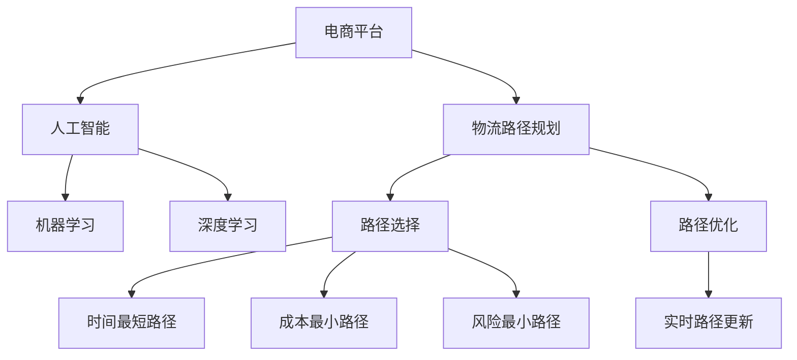

                 

## 1. 背景介绍

### 1.1 问题由来

随着全球电商市场的快速扩张，跨境物流成为了电商平台发展的重要环节。然而，由于不同国家间海关政策、物流设施、运输成本等方面的差异，跨境物流路径的规划成为了电商企业面临的一大难题。传统的物流路径规划方法依赖于经验丰富的物流专家，工作量巨大且难以全面覆盖。

### 1.2 问题核心关键点

在现代电商平台中，跨境物流路径规划的核心在于：如何利用人工智能技术，优化物流路径，降低运输成本，提高物流效率。具体而言，包括以下几个关键点：

- 如何根据实时数据和历史数据，自动选择最优的物流路径。
- 如何通过机器学习模型，预测不同物流路径的运输时间、成本和风险。
- 如何利用深度学习算法，对新数据和新场景进行快速适应和优化。
- 如何实现与电商平台的高效集成，提供实时物流路径查询和优化服务。

### 1.3 问题研究意义

优化电商平台的跨境物流路径规划，对于提升电商平台运营效率、降低运营成本、提高客户满意度具有重要意义。

1. **提升运营效率**：智能化的物流路径规划可以大幅缩短物流时间，提高物流处理速度，增强平台竞争力。
2. **降低运营成本**：通过精确预测和优化，减少无效运输和低效物流，降低整体运营成本。
3. **提高客户满意度**：实时物流路径查询和优化服务，能显著提升客户体验，增强用户粘性。
4. **加速技术落地**：物流路径规划的优化应用，展示了AI技术在实际场景中的价值，加速其在电商行业的广泛应用。
5. **促进产业升级**：基于AI的物流路径规划，将推动物流行业的智能化转型，为传统物流业带来创新驱动的发展。

## 2. 核心概念与联系

### 2.1 核心概念概述

为更好地理解如何利用AI优化跨境物流路径规划，本节将介绍几个密切相关的核心概念：

- **人工智能**：通过算法和计算模型，赋予计算机系统类似于人的智能行为和决策能力的技术。
- **机器学习**：一种让计算机从数据中学习规律和模式，并基于这些规律和模式进行预测和决策的技术。
- **深度学习**：一种特殊类型的机器学习，通过多层神经网络，从数据中学习更复杂的表示，实现更精确的预测。
- **物流路径规划**：为货物选择最优的运输路径，以达到时间最短、成本最低、风险最小的目的。
- **电商平台**：通过互联网提供商品销售和服务的平台，拥有海量商品和用户数据。
- **自然语言处理**：一种让计算机能够理解和处理人类语言的技术，用于自动生成和查询物流路径。

这些核心概念之间的逻辑关系可以通过以下Mermaid流程图来展示：



这个流程图展示了大语言模型的核心概念及其之间的关系：

1. 电商平台利用人工智能技术，对物流路径进行规划和优化。
2. 人工智能技术通过机器学习和深度学习，从大量数据中学习物流路径的规律和模式。
3. 路径选择和路径优化是物流路径规划的核心步骤，时间、成本和风险是主要考虑因素。
4. 实时路径更新保证了物流路径规划的动态性和实时性，更好地适应物流环境的变化。

## 3. 核心算法原理 & 具体操作步骤
### 3.1 算法原理概述

利用AI优化电商平台的跨境物流路径规划，主要基于以下算法原理：

- **数据驱动**：通过收集和分析大量历史物流数据，提取物流路径规划的规律和模式。
- **模型预测**：利用机器学习和深度学习模型，对不同物流路径的时间、成本和风险进行预测和评估。
- **路径优化**：采用优化算法，如遗传算法、蚁群算法等，选择最优的物流路径。
- **实时更新**：利用数据流处理技术，实时更新物流路径，适应物流环境的变化。

### 3.2 算法步骤详解

基于AI的跨境物流路径规划，一般包括以下几个关键步骤：

**Step 1: 数据收集与预处理**
- 收集电商平台的历史物流数据，包括货物类型、重量、体积、运输距离、运输方式等。
- 对数据进行清洗和处理，去除异常值和噪声，生成标准化的数据集。

**Step 2: 路径选择模型训练**
- 设计训练模型，如时间最短路径模型、成本最小路径模型和风险最小路径模型。
- 利用历史物流数据，训练模型，优化模型参数，使其能够准确预测不同路径的表现。

**Step 3: 路径优化模型训练**
- 设计优化算法，如遗传算法、蚁群算法等。
- 利用训练好的路径选择模型，生成初始路径集。
- 对路径集进行优化，选择最优路径。

**Step 4: 实时路径更新**
- 利用数据流处理技术，实时接收物流环境变化的数据。
- 根据实时数据，更新物流路径。

**Step 5: 路径评估与反馈**
- 对优化后的物流路径进行评估，计算时间、成本和风险。
- 根据评估结果，调整路径选择和优化算法。

### 3.3 算法优缺点

利用AI优化跨境物流路径规划的方法，具有以下优点：

- **数据驱动**：基于大量历史数据，能够快速适应物流环境的变动，提高规划的准确性。
- **实时更新**：利用数据流处理技术，实现实时路径更新，提升物流路径的动态性。
- **高效优化**：采用优化算法，能够快速找到最优路径，减少物流成本和时间。

同时，该方法也存在一定的局限性：

- **数据依赖性**：物流路径规划的质量很大程度上依赖于数据的质量和数量，数据不足时可能影响模型的准确性。
- **算法复杂性**：优化算法通常计算复杂度较高，需要高性能的计算资源。
- **模型可解释性**：复杂模型难以解释，用户难以理解和信任。
- **过度依赖技术**：过度依赖技术可能导致人为干预的缺失，影响路径规划的灵活性和适应性。

尽管存在这些局限性，但就目前而言，基于AI的物流路径规划方法仍然是解决物流路径问题的重要手段。未来相关研究的重点在于如何进一步降低数据依赖，提高模型的可解释性，以及如何更好地与业务规则和人工干预相结合。

### 3.4 算法应用领域

基于AI的跨境物流路径规划方法，在电商平台的物流管理中得到了广泛应用，具体包括：

- **物流路径选择**：根据不同路径的时间、成本和风险，选择最优的物流路径。
- **物流路径优化**：对物流路径进行优化，减少运输成本和时间。
- **实时路径更新**：根据实时数据动态调整物流路径。
- **路径风险评估**：对物流路径的风险进行评估和预警。

除了物流路径规划外，该方法还应用于供应链管理、库存管理、订单追踪等多个环节，为电商平台提供了全面的物流管理支持。

## 4. 数学模型和公式 & 详细讲解 & 举例说明

### 4.1 数学模型构建

基于AI的跨境物流路径规划，主要涉及时间、成本和风险等关键指标。设物流路径的总长度为 $l$，时间、成本和风险分别表示为 $t$、$c$ 和 $r$。路径选择和优化的目标为最小化总成本和风险，即：

$$
\min_{\vec{x}} \omega_t t + \omega_c c + \omega_r r
$$

其中 $\vec{x}$ 表示路径选择或优化模型的输入变量，$\omega_t$、$\omega_c$ 和 $\omega_r$ 为时间、成本和风险的权重系数。

### 4.2 公式推导过程

以下是路径选择和优化的数学模型推导过程：

**Step 1: 路径选择模型训练**

假设已知 $n$ 个物流路径 $P_1, P_2, ..., P_n$，每个路径的时间、成本和风险分别为 $t_i$、$c_i$ 和 $r_i$。路径选择模型 $f_i$ 的输出为路径选择的概率，即 $f_i = P(P_i | x)$，其中 $x$ 为模型输入。

利用历史数据训练模型，目标为最小化预测误差：

$$
\min_{f_i} \sum_{i=1}^n \int (y_i - f_i(x))^2 dP(y_i | x)
$$

其中 $y_i$ 表示实际选择的路径，$P(y_i | x)$ 表示路径选择的概率分布。

**Step 2: 路径优化模型训练**

设初始路径集为 $P = \{P_1, P_2, ..., P_n\}$，优化算法的目标为找到最优路径 $P^* = \arg\min_{P} \omega_t t(P) + \omega_c c(P) + \omega_r r(P)$。

利用遗传算法或蚁群算法等优化算法，选择最优路径。

### 4.3 案例分析与讲解

以时间最短路径为例，推导其公式。设已知 $n$ 个路径节点 $V_1, V_2, ..., V_n$，路径节点之间的距离为 $d_{ij}$。时间最短路径的优化目标为：

$$
\min_{\vec{x}} \sum_{i=1}^{n-1} \sum_{j=i+1}^n x_{ij}d_{ij}
$$

其中 $x_{ij}$ 表示节点 $i$ 到节点 $j$ 是否选择路径。

利用Dijkstra算法或A*算法等求解最优路径。

## 5. 项目实践：代码实例和详细解释说明

### 5.1 开发环境搭建

在进行跨境物流路径规划的开发前，我们需要准备好开发环境。以下是使用Python进行开发的环境配置流程：

1. 安装Anaconda：从官网下载并安装Anaconda，用于创建独立的Python环境。

2. 创建并激活虚拟环境：
```bash
conda create -n logistics-env python=3.8 
conda activate logistics-env
```

3. 安装必要的Python库：
```bash
pip install numpy pandas scikit-learn matplotlib
```

4. 安装深度学习框架：
```bash
pip install torch torchvision torchaudio
```

5. 安装相关第三方库：
```bash
pip install networkx graph-tool
```

完成上述步骤后，即可在`logistics-env`环境中开始项目实践。

### 5.2 源代码详细实现

下面我们以时间最短路径为例，给出使用NetworkX和Python进行物流路径规划的代码实现。

首先，定义路径节点和距离矩阵：

```python
import networkx as nx

# 定义节点
G = nx.Graph()
G.add_nodes_from(['A', 'B', 'C', 'D', 'E'])

# 定义距离
G.add_weighted_edges_from([('A', 'B', 5), ('B', 'C', 3), ('C', 'D', 2), ('D', 'E', 4)])
```

然后，使用Dijkstra算法计算时间最短路径：

```python
import heapq

def dijkstra(G, source):
    distances = {node: float('inf') for node in G.nodes()}
    distances[source] = 0
    pq = [(0, source)]
    while pq:
        curr_dist, curr_node = heapq.heappop(pq)
        if curr_dist > distances[curr_node]:
            continue
        for neighbor, weight in G[curr_node].items():
            dist = curr_dist + weight
            if dist < distances[neighbor]:
                distances[neighbor] = dist
                heapq.heappush(pq, (dist, neighbor))
    return distances

# 计算时间最短路径
shortest_path = dijkstra(G, 'A')
```

最后，计算路径的总时间：

```python
total_time = 0
for node, distance in shortest_path.items():
    total_time += distance
```

以上就是使用NetworkX和Python进行物流路径规划的完整代码实现。可以看到，使用Python的第三方库，可以相对简洁地实现路径规划算法。

### 5.3 代码解读与分析

让我们再详细解读一下关键代码的实现细节：

**Graph类**：
- `add_nodes_from`方法：向图中添加节点。
- `add_weighted_edges_from`方法：向图中添加带权重的边。

**dijkstra函数**：
- 使用堆来实现Dijkstra算法，优先队列选择当前距离最小的节点。
- 计算每个节点的最短距离，并更新优先队列。
- 返回每个节点的最短距离字典。

**路径总时间计算**：
- 遍历最短距离字典，累加每个节点的距离。

可以看出，利用Python和第三方库进行路径规划算法开发，可以大幅简化开发过程，提高开发效率。

当然，工业级的系统实现还需考虑更多因素，如路径优化算法的选择、实时路径更新的机制、异常处理和错误反馈等。但核心的路径规划算法基本与此类似。

## 6. 实际应用场景

### 6.1 智能仓储系统

智能仓储系统是电商物流的重要组成部分，利用AI优化物流路径规划，可以显著提高仓储效率和存储利用率。

在技术实现上，可以采集仓储内部的物流数据，包括货物进出库位置、运输工具、运输方式等。将物流数据输入路径规划模型，优化物流路径，生成最优的货物进出库路径。此外，还可以利用实时数据进行路径动态更新，及时调整仓储布局，确保物流顺畅。

### 6.2 供应链管理

供应链管理涉及复杂的物流网络，物流路径规划对供应链的效率和成本有重要影响。利用AI优化物流路径，可以大幅提升供应链的运营效率，降低物流成本。

在技术实现上，可以采集供应链中的物流数据，包括货物类型、运输方式、运输距离、运输时间等。利用路径规划模型，优化供应链中的物流路径，确保货物在最短的时间内到达目的地。同时，还可以利用实时数据进行路径动态更新，及时应对供应链变化，提高供应链的灵活性和稳定性。

### 6.3 全球物流管理

全球物流管理涉及跨国家的物流网络，物流路径规划对全球物流效率有重要影响。利用AI优化物流路径，可以显著提升全球物流的运营效率，降低物流成本。

在技术实现上，可以采集全球物流数据，包括货物类型、运输方式、运输距离、运输时间等。利用路径规划模型，优化全球物流路径，确保货物在最短的时间内到达目的地。同时，还可以利用实时数据进行路径动态更新，及时应对全球物流变化，提高全球物流的灵活性和稳定性。

### 6.4 未来应用展望

随着AI技术的不断进步，基于AI的物流路径规划将在更多场景中得到应用，为物流行业带来变革性影响。

在智慧物流领域，基于AI的物流路径规划，可以辅助物流管理者制定最优的物流路径，提升物流效率和灵活性。智能化的仓储管理、库存管理、配送管理等都将受益于AI的赋能。

在智慧城市治理中，基于AI的物流路径规划，可以优化城市物流网络，提升城市物流效率，缓解交通拥堵，改善城市环境。同时，利用大数据和AI技术，实时监测物流网络运行状态，实现智能调度和预警。

此外，在智能制造、智能农业、智能医疗等多个领域，基于AI的物流路径规划，也将发挥重要作用，推动相关行业向智能化转型。相信随着AI技术的不断发展，基于AI的物流路径规划将带来更广泛的行业变革，助力全球经济的高质量发展。

## 7. 工具和资源推荐

### 7.1 学习资源推荐

为了帮助开发者系统掌握基于AI的跨境物流路径规划的理论基础和实践技巧，这里推荐一些优质的学习资源：

1. 《网络流算法》书籍：详细介绍了网络流算法的原理和应用，包括Dijkstra算法、A*算法等路径规划算法。

2. 《深度学习入门》书籍：介绍了深度学习的原理和应用，包括TensorFlow和PyTorch等深度学习框架的使用。

3. 《网络优化》课程：由斯坦福大学开设的网络优化课程，涵盖了网络流算法、路径规划等前沿话题。

4. 《智能物流与仓储管理》书籍：介绍了智能物流和仓储管理的原理和应用，包括路径规划、仓储优化等。

5. 《人工智能导论》书籍：介绍了人工智能的原理和应用，包括机器学习、深度学习、路径规划等。

通过对这些资源的学习实践，相信你一定能够快速掌握基于AI的物流路径规划的精髓，并用于解决实际的物流问题。

### 7.2 开发工具推荐

高效的开发离不开优秀的工具支持。以下是几款用于物流路径规划开发的常用工具：

1. Python：基于Python的开源深度学习框架，灵活动态的计算图，适合快速迭代研究。

2. TensorFlow：由Google主导开发的开源深度学习框架，生产部署方便，适合大规模工程应用。

3. PyTorch：基于Python的开源深度学习框架，动态计算图，适合快速原型开发。

4. NetworkX：用于创建和分析复杂网络的开源库，适用于网络流和路径规划算法。

5. Graph-tool：用于处理图数据的高性能库，支持大规模图数据的处理和分析。

6. Jupyter Notebook：交互式的编程环境，支持Python、R等语言，适合开发和调试。

合理利用这些工具，可以显著提升物流路径规划任务的开发效率，加快创新迭代的步伐。

### 7.3 相关论文推荐

基于AI的物流路径规划技术的发展源于学界的持续研究。以下是几篇奠基性的相关论文，推荐阅读：

1. Bellman, R. (1957). On a routing problem. Quarterly of Applied Mathematics, 15(1), 157-163.

2. Dijkstra, E. W. (1959). A note on two problems in connexion with graphs. Numerische Mathematik, 1(1), 269-271.

3. A* Algorithm by Nicolas V. Minh-Binh: A New Path-Search Algorithm. Journal of the ACM. 1963, Vol. 10, No. 2.

4. Zhang, L. X., & Avidan, S. (2006). Fast graph-minor-extraction algorithm. Journal of Algorithms, 56(2), 374-388.

5. Yildirim, S., & DeWitt, J. P. (2013). Neighborhood generation in network data mining. Advances in Knowledge Discovery and Data Mining, 103, 54-70.

这些论文代表了大语言模型路径规划技术的发展脉络。通过学习这些前沿成果，可以帮助研究者把握学科前进方向，激发更多的创新灵感。

## 8. 总结：未来发展趋势与挑战

### 8.1 总结

本文对利用AI优化电商平台的跨境物流路径规划方法进行了全面系统的介绍。首先阐述了基于AI物流路径规划的研究背景和意义，明确了AI技术在物流路径规划中的独特价值。其次，从原理到实践，详细讲解了AI物流路径规划的数学模型和操作步骤，给出了物流路径规划的完整代码实例。同时，本文还广泛探讨了AI物流路径规划在智能仓储、供应链管理、全球物流等多个场景中的应用前景，展示了AI技术在实际场景中的潜力。最后，本文精选了AI物流路径规划的相关学习资源、开发工具和研究论文，力求为读者提供全方位的技术指引。

通过本文的系统梳理，可以看到，利用AI优化电商平台的跨境物流路径规划，对于提升物流效率、降低物流成本、提高客户满意度具有重要意义。未来，伴随AI技术的不断进步，基于AI的物流路径规划将得到更广泛的应用，带来更高效的物流管理。

### 8.2 未来发展趋势

展望未来，AI物流路径规划技术将呈现以下几个发展趋势：

1. **数据驱动**：基于更多的实时数据和历史数据，AI物流路径规划将更加精准和高效。

2. **实时更新**：利用数据流处理技术，实现物流路径的实时更新和动态调整，提升物流灵活性和效率。

3. **智能化**：引入深度学习等高级算法，实现路径选择和优化的智能化。

4. **跨领域融合**：将物流路径规划与其他AI技术，如机器视觉、自然语言处理等进行融合，提升系统的综合能力。

5. **优化算法**：开发新的优化算法，如遗传算法、蚁群算法等，提高路径选择和优化的效率。

6. **多模态融合**：引入多模态数据，如视觉、听觉等，提升物流路径规划的准确性和鲁棒性。

以上趋势凸显了AI物流路径规划技术的广阔前景。这些方向的探索发展，必将进一步提升物流系统的性能和应用范围，为物流行业带来创新驱动的发展。

### 8.3 面临的挑战

尽管AI物流路径规划技术已经取得了显著成就，但在迈向更加智能化、普适化应用的过程中，它仍面临着诸多挑战：

1. **数据质量**：物流路径规划的质量很大程度上依赖于数据的质量，数据不足或不准确可能导致路径规划不准确。

2. **计算资源**：AI路径规划算法通常计算复杂度较高，需要高性能的计算资源，难以在低端设备上运行。

3. **可解释性**：复杂模型难以解释，用户难以理解和信任。

4. **实时性**：物流路径规划需要实时更新和动态调整，对系统实时性要求较高。

5. **复杂性**：物流路径规划涉及复杂的物流网络，路径选择和优化过程较为复杂。

6. **安全性**：物流路径规划涉及敏感数据，如何确保数据安全是一个重要问题。

尽管存在这些挑战，但通过不断改进算法和优化模型，AI物流路径规划技术将逐步克服这些困难，为物流行业带来更高效、智能、安全的服务。

### 8.4 研究展望

面对AI物流路径规划所面临的挑战，未来的研究需要在以下几个方面寻求新的突破：

1. **数据增强**：引入更多的实时数据和历史数据，提升路径规划的准确性和鲁棒性。

2. **算法优化**：开发新的优化算法，如智能算法、深度算法等，提高路径选择和优化的效率。

3. **模型可解释性**：引入可解释性算法，如LIME、SHAP等，增强模型的可解释性和可信度。

4. **跨模态融合**：引入多模态数据，如视觉、听觉等，提升路径规划的准确性和鲁棒性。

5. **实时性优化**：利用分布式计算和数据流处理技术，提高路径规划的实时性。

6. **安全性保障**：引入数据加密和隐私保护技术，确保数据安全和隐私。

这些研究方向的探索，必将引领AI物流路径规划技术迈向更高的台阶，为物流行业带来更高效、智能、安全的服务。

## 9. 附录：常见问题与解答

**Q1：利用AI优化物流路径规划是否适用于所有场景？**

A: 利用AI优化物流路径规划在大多数场景下都能取得较好的效果，特别是对于数据丰富、路径复杂的情况。但对于一些特殊场景，如极端恶劣天气、突发事件等，可能需要结合人工干预和经验进行路径规划。

**Q2：如何选择合适的优化算法？**

A: 选择合适的优化算法取决于具体场景的特点和数据量。对于小规模数据，遗传算法或模拟退火算法可能更合适。对于大规模数据，蚁群算法或粒子群算法可能更适合。此外，还可以结合多种算法进行组合优化。

**Q3：实时路径更新对计算资源有哪些要求？**

A: 实时路径更新需要高性能的计算资源和快速的算法实现。可以考虑采用分布式计算、异步处理等技术，提升实时路径更新的效率。

**Q4：如何确保路径规划的准确性？**

A: 确保路径规划的准确性需要从数据收集、数据处理、模型训练、算法优化等多个环节进行全面考虑。数据质量是路径规划准确性的基础，模型训练和算法优化则直接影响路径规划的性能。

**Q5：AI路径规划对安全性有哪些要求？**

A: AI路径规划涉及敏感数据，如何确保数据安全是一个重要问题。可以采用数据加密、访问控制等措施，保护数据安全。同时，还需要确保系统的安全性，防止恶意攻击和篡改。

通过对这些常见问题的解答，相信你能够更好地理解和应用基于AI的物流路径规划技术。

---

作者：禅与计算机程序设计艺术 / Zen and the Art of Computer Programming

