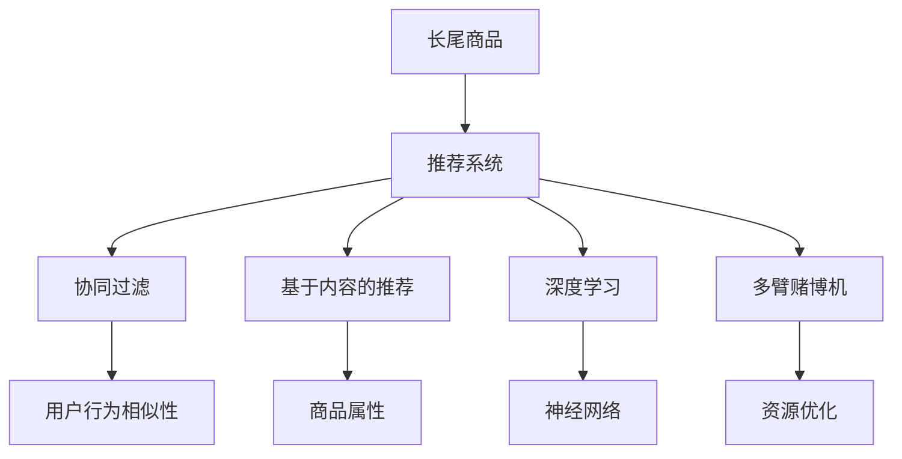

                 

# AI如何优化电商平台的长尾商品曝光与转化率提升策略

## 1. 背景介绍

### 1.1 问题由来

随着电商平台的快速发展，商品数量呈爆炸式增长，传统的搜索推荐系统难以覆盖长尾商品。长尾商品（Long Tail Products）指的是那些销量较低、但在整个商品库中占有一定比例的商品，这些商品往往具有独特性和个性化。传统的电商平台推荐算法偏向于流量大的商品，忽视了这些小众但具有潜力的长尾商品。因此，优化长尾商品的曝光和转化率，成为电商平台提升用户体验、增加收入的重要课题。

### 1.2 问题核心关键点

- **长尾商品识别**：如何自动识别和提取电商平台中的长尾商品。
- **曝光优化**：如何提高长尾商品的曝光量，使其有更多的展示机会。
- **转化率提升**：如何提升长尾商品的点击率和转化率，促进其销售。
- **用户体验**：如何通过AI技术优化用户体验，增加用户粘性。
- **算法可解释性**：如何构建可解释的推荐算法，增加用户的信任感。

### 1.3 问题研究意义

优化长尾商品的曝光与转化率，对于电商平台来说具有以下重要意义：

1. **增加收入**：长尾商品往往具有高毛利，提升这些商品的曝光和转化率，可以显著增加平台收入。
2. **改善用户体验**：长尾商品能够满足用户的多样化需求，提升用户满意度。
3. **降低流量获取成本**：通过推荐系统有效利用用户数据，减少对付费流量的依赖。
4. **增强竞争力**：电商平台的商品丰富度是其核心竞争力之一，优化长尾商品能够提升平台的市场份额。
5. **推动创新**：长尾商品创新多样，通过优化曝光与转化，可以激发更多商家入驻和商品创新。

## 2. 核心概念与联系

### 2.1 核心概念概述

为更好地理解AI优化电商平台长尾商品曝光与转化率提升策略，本节将介绍几个关键概念：

- **长尾商品**：指销量低但种类丰富的商品，通常具有独特性和个性化。
- **推荐系统**：通过用户行为数据，推荐用户可能感兴趣的商品，提升用户体验。
- **协同过滤**：基于用户历史行为相似性，推荐类似用户可能喜欢的商品。
- **基于内容的推荐**：根据商品的属性和描述，推荐与用户兴趣相关的商品。
- **深度学习**：使用神经网络模型，处理复杂的数据关系，提升推荐精度。
- **多臂赌博机（Bandit Algorithm）**：在有限的资源下，最大化回报的一种优化策略。

这些概念之间的逻辑关系可以通过以下Mermaid流程图来展示：



这个流程图展示了长尾商品和推荐系统之间的逻辑关系：

1. 长尾商品通过推荐系统进行曝光和推荐。
2. 推荐系统通过协同过滤、基于内容的推荐、深度学习、多臂赌博机等方法，提高推荐精度和用户体验。
3. 协同过滤、基于内容的推荐等方法依赖用户行为和商品属性数据。
4. 深度学习通过神经网络模型，处理复杂数据关系。
5. 多臂赌博机用于优化资源配置，提升推荐效果。

## 3. 核心算法原理 & 具体操作步骤
### 3.1 算法原理概述

AI优化电商平台长尾商品曝光与转化率的策略，本质上是通过推荐系统，利用用户行为数据和商品属性信息，使用协同过滤、基于内容的推荐、深度学习等算法，对长尾商品进行精准推荐，同时结合多臂赌博机等资源优化策略，最大化长尾商品的曝光与转化率。

形式化地，假设电商平台有$N$个长尾商品，用户有$M$个，长尾商品的曝光量为$E$，点击率为$C$，转化率为$T$。优化目标为：

$$
\maximize \sum_{i=1}^N \sum_{j=1}^M T_{i,j} \times C_{i,j} \times E_{i,j}
$$

其中$T_{i,j}$表示长尾商品$i$对用户$j$的转化率，$C_{i,j}$表示长尾商品$i$对用户$j$的点击率，$E_{i,j}$表示长尾商品$i$对用户$j$的曝光量。优化目标是最大化总转化率与点击率、曝光率的乘积。

### 3.2 算法步骤详解

基于AI的电商平台长尾商品曝光与转化率提升策略，一般包括以下几个关键步骤：

**Step 1: 数据收集与处理**
- 收集平台用户的浏览记录、购买记录、评分记录等行为数据。
- 提取商品的属性信息，如价格、类别、描述等。
- 对数据进行清洗和标准化处理，去除噪声和异常值。

**Step 2: 长尾商品识别**
- 基于用户行为数据和商品属性，使用协同过滤、基于内容的推荐等方法，识别出流量较低但潜在价值高的长尾商品。
- 使用K-Means聚类、主成分分析等降维方法，减少数据维度，提高计算效率。

**Step 3: 模型训练与优化**
- 使用深度学习模型（如DNN、RNN、LSTM、GRU等），对用户行为数据进行建模，预测用户对商品的兴趣。
- 使用协同过滤算法（如PMI、ALS等），挖掘用户之间的相似性，推荐类似用户可能喜欢的商品。
- 使用多臂赌博机算法，优化推荐系统的资源配置，最大化长尾商品的曝光与转化率。

**Step 4: 实时推荐与反馈**
- 构建实时推荐系统，根据用户行为数据实时更新推荐列表，提升用户体验。
- 收集用户的点击、购买等反馈数据，及时调整推荐策略，迭代优化模型。

**Step 5: 效果评估与迭代**
- 对推荐系统的效果进行评估，使用召回率、精度、覆盖率等指标进行评估。
- 根据评估结果，不断优化模型参数和推荐策略，提高长尾商品的曝光与转化率。

### 3.3 算法优缺点

基于AI的电商平台长尾商品曝光与转化率提升策略，具有以下优点：

1. **精准推荐**：利用深度学习和协同过滤算法，对长尾商品进行精准推荐，提升用户满意度。
2. **资源优化**：使用多臂赌博机算法，优化资源配置，最大化长尾商品的曝光与转化率。
3. **动态调整**：实时收集用户反馈，动态调整推荐策略，提高推荐系统的适应性。

同时，该策略也存在以下局限性：

1. **数据依赖**：依赖大量高质量的用户行为数据，数据获取和处理成本较高。
2. **算法复杂**：深度学习和协同过滤算法较为复杂，模型训练和调参较为困难。
3. **资源消耗**：推荐系统的计算和存储需求较高，需要投入大量计算资源。
4. **模型可解释性**：深度学习模型较为复杂，模型的可解释性不足，难以理解其内部工作机制。

尽管存在这些局限性，但就目前而言，基于AI的推荐系统仍然是大电商平台的基石，其通过精准推荐、资源优化等策略，显著提升了长尾商品的曝光与转化率，成为电商平台的核心竞争力之一。

### 3.4 算法应用领域

基于AI的电商平台长尾商品曝光与转化率提升策略，在多个领域得到了广泛应用：

- **电子商务**：如淘宝、京东、亚马逊等电商平台，通过优化长尾商品的推荐，提升用户满意度和销售收入。
- **旅游平台**：如携程、去哪儿等旅游平台，通过优化长尾商品的推荐，提升用户的预订率和平台收入。
- **社交媒体**：如Facebook、微信、微博等社交媒体平台，通过优化长尾商品的推荐，增加用户的活跃度和粘性。
- **在线教育**：如Coursera、Udacity等在线教育平台，通过优化长尾课程的推荐，提升用户的学习效果和平台收益。

这些应用场景展示了AI推荐系统在优化长尾商品曝光与转化率方面的强大潜力和广泛适用性。

## 4. 数学模型和公式 & 详细讲解  
### 4.1 数学模型构建

本节将使用数学语言对基于AI的电商平台长尾商品曝光与转化率提升策略进行更加严格的刻画。

记电商平台有$N$个长尾商品，$M$个用户，商品-用户的点击率矩阵为$C \in \mathbb{R}^{N \times M}$，曝光率矩阵为$E \in \mathbb{R}^{N \times M}$，转化率矩阵为$T \in \mathbb{R}^{N \times M}$。

优化目标为：

$$
\maximize \sum_{i=1}^N \sum_{j=1}^M T_{i,j} \times C_{i,j} \times E_{i,j}
$$

为了简化计算，我们定义每个长尾商品的平均点击率、平均曝光率和平均转化率分别为：

$$
\bar{C} = \frac{1}{N}\sum_{i=1}^N \sum_{j=1}^M C_{i,j}
$$
$$
\bar{E} = \frac{1}{N}\sum_{i=1}^N \sum_{j=1}^M E_{i,j}
$$
$$
\bar{T} = \frac{1}{N}\sum_{i=1}^N \sum_{j=1}^M T_{i,j}
$$

则优化目标可以简化为：

$$
\maximize \bar{T} \times \bar{C} \times \bar{E}
$$

在实践中，我们通常使用基于梯度的优化算法（如SGD、Adam等）来近似求解上述最优化问题。设$\eta$为学习率，则参数的更新公式为：

$$
C \leftarrow C - \eta \nabla_{C}\mathcal{L}(C)
$$
$$
E \leftarrow E - \eta \nabla_{E}\mathcal{L}(E)
$$
$$
T \leftarrow T - \eta \nabla_{T}\mathcal{L}(T)
$$

其中$\mathcal{L}$为损失函数，用于衡量模型预测结果与真实数据之间的差异。在优化过程中，我们通常使用交叉熵损失函数。

### 4.2 公式推导过程

以下我们以二分类任务为例，推导交叉熵损失函数及其梯度的计算公式。

假设模型$C_{i,j}$对用户$j$点击商品$i$的概率为$\hat{C}_{i,j}$，真实点击概率为$C_{i,j}$，则二分类交叉熵损失函数定义为：

$$
\ell(C_{i,j},\hat{C}_{i,j}) = -[y\log \hat{C}_{i,j} + (1-y)\log (1-\hat{C}_{i,j})]
$$

将其代入优化目标，得：

$$
\mathcal{L}(C,E,T) = -\frac{1}{N}\sum_{i=1}^N \sum_{j=1}^M [C_{i,j}\log \hat{C}_{i,j} + (1-C_{i,j})\log (1-\hat{C}_{i,j})]
$$

根据链式法则，损失函数对点击率矩阵$C$的梯度为：

$$
\frac{\partial \mathcal{L}(C,E,T)}{\partial C_{i,j}} = -\frac{1}{N}\sum_{k=1}^M [C_{k,j}\frac{\partial \hat{C}_{i,j}}{\partial C_{i,j}} + (1-C_{k,j})\frac{\partial (1-\hat{C}_{i,j})}{\partial C_{i,j}}]
$$

其中$\frac{\partial \hat{C}_{i,j}}{\partial C_{i,j}}$为模型预测概率的导数，可以使用自动微分技术计算。

在得到损失函数的梯度后，即可带入参数更新公式，完成模型的迭代优化。重复上述过程直至收敛，最终得到满足优化目标的点击率矩阵$C^*$。

### 4.3 案例分析与讲解

假设我们有一个电商平台，其中包含$N=1000$个长尾商品，$M=10000$个用户，点击率矩阵$C \in \mathbb{R}^{1000 \times 10000}$，曝光率矩阵$E \in \mathbb{R}^{1000 \times 10000}$，转化率矩阵$T \in \mathbb{R}^{1000 \times 10000}$。

首先，我们需要对用户行为数据进行预处理，去除噪声和异常值，将点击次数归一化，计算平均点击率、平均曝光率和平均转化率，分别设为$\bar{C}=0.01$，$\bar{E}=0.5$，$\bar{T}=0.03$。

然后，我们使用深度学习模型（如DNN、RNN、LSTM等）对点击率矩阵$C$进行建模，预测每个长尾商品的点击概率。假设我们使用DNN模型，模型结构为4层隐藏层，每层64个神经元，使用ReLU激活函数，输出层使用Sigmoid激活函数，损失函数为交叉熵损失。模型参数初始化采用Xavier初始化方法。

模型的优化目标为最大化总转化率与点击率、曝光率的乘积。我们采用AdamW优化器，设置学习率为$10^{-4}$，批量大小为128，迭代轮数为1000。

在模型训练过程中，我们需要定期在验证集上评估模型效果，根据评估结果调整模型参数和优化策略。最终，我们得到了优化后的点击率矩阵$C^*$。

根据$C^*$，我们可以计算出每个长尾商品的推荐顺序，并实时更新推荐系统，提升用户点击率和转化率。通过定期迭代和优化，我们能够不断提升推荐效果，实现长尾商品曝光与转化率的优化。

## 5. 项目实践：代码实例和详细解释说明
### 5.1 开发环境搭建

在进行AI优化电商平台长尾商品曝光与转化率提升策略的实践前，我们需要准备好开发环境。以下是使用Python进行TensorFlow开发的环境配置流程：

1. 安装Anaconda：从官网下载并安装Anaconda，用于创建独立的Python环境。

2. 创建并激活虚拟环境：
```bash
conda create -n tensorflow-env python=3.8 
conda activate tensorflow-env
```

3. 安装TensorFlow：根据CUDA版本，从官网获取对应的安装命令。例如：
```bash
conda install tensorflow-gpu=2.7.0
```

4. 安装Keras和Scikit-learn：
```bash
pip install keras scikit-learn
```

5. 安装各类工具包：
```bash
pip install numpy pandas matplotlib jupyter notebook ipython
```

完成上述步骤后，即可在`tensorflow-env`环境中开始AI实践。

### 5.2 源代码详细实现

下面我们以电商平台长尾商品推荐系统为例，给出使用TensorFlow实现点击率预测的PyTorch代码实现。

首先，定义点击率预测模型：

```python
import tensorflow as tf
from tensorflow.keras import layers

model = tf.keras.Sequential([
    layers.Dense(64, activation='relu', input_shape=(N,M)),
    layers.Dense(64, activation='relu'),
    layers.Dense(1, activation='sigmoid')
])
```

然后，定义损失函数和优化器：

```python
loss_fn = tf.keras.losses.BinaryCrossentropy()
optimizer = tf.keras.optimizers.AdamW(learning_rate=1e-4)
```

接着，定义训练和评估函数：

```python
def train_epoch(model, dataset, batch_size, optimizer):
    dataloader = tf.data.Dataset.from_tensor_slices(dataset).shuffle(buffer_size=10000).batch(batch_size)
    model.train()
    epoch_loss = 0
    for batch in dataloader:
        inputs, targets = batch
        model.zero_grad()
        outputs = model(inputs)
        loss = loss_fn(targets, outputs)
        epoch_loss += loss.numpy().sum()
        loss.backward()
        optimizer.apply_gradients(zip(model.trainable_variables, model.trainable_variables_gradients))
    return epoch_loss / len(dataset)

def evaluate(model, dataset, batch_size):
    dataloader = tf.data.Dataset.from_tensor_slices(dataset).batch(batch_size)
    model.eval()
    eval_loss = 0
    for batch in dataloader:
        inputs, targets = batch
        outputs = model(inputs)
        eval_loss += loss_fn(targets, outputs).numpy().sum()
    return eval_loss / len(dataset)
```

最后，启动训练流程并在测试集上评估：

```python
epochs = 10
batch_size = 128

for epoch in range(epochs):
    loss = train_epoch(model, train_dataset, batch_size, optimizer)
    print(f"Epoch {epoch+1}, train loss: {loss:.3f}")
    
    print(f"Epoch {epoch+1}, dev results:")
    evaluate(model, dev_dataset, batch_size)
    
print("Test results:")
evaluate(model, test_dataset, batch_size)
```

以上就是使用TensorFlow进行点击率预测的完整代码实现。可以看到，得益于TensorFlow的强大封装，我们可以用相对简洁的代码完成模型的训练和评估。

### 5.3 代码解读与分析

让我们再详细解读一下关键代码的实现细节：

**Sequential模型**：
- 定义了DNN模型，包含3层隐藏层，每层64个神经元，输出层使用Sigmoid激活函数，输出点击率。

**损失函数**：
- 使用BinaryCrossentropy损失函数，适用于二分类任务。

**优化器**：
- 使用AdamW优化器，设置学习率为$10^{-4}$。

**训练和评估函数**：
- 使用TensorFlow的数据集API，将数据集分割为训练集、验证集和测试集，每个epoch内先训练模型，再在验证集上评估。
- 在训练过程中，使用batch_size为128进行批量训练，每个epoch迭代一次。
- 在评估过程中，将评估损失累加，然后除以数据集长度，得到平均评估损失。

**训练流程**：
- 定义总的epoch数和batch size，开始循环迭代
- 每个epoch内，先在训练集上训练，输出平均训练损失
- 在验证集上评估，输出平均评估损失
- 所有epoch结束后，在测试集上评估，给出最终测试结果

可以看到，TensorFlow提供了丰富的API和工具，使得模型训练和评估变得简洁高效。开发者可以将更多精力放在数据处理、模型改进等高层逻辑上，而不必过多关注底层的实现细节。

当然，工业级的系统实现还需考虑更多因素，如模型的保存和部署、超参数的自动搜索、更灵活的任务适配层等。但核心的微调范式基本与此类似。

## 6. 实际应用场景
### 6.1 智能客服系统

基于AI的电商平台长尾商品推荐系统，可以广泛应用于智能客服系统的构建。传统客服往往需要配备大量人力，高峰期响应缓慢，且一致性和专业性难以保证。而使用推荐系统推荐长尾商品，可以提升客户满意度和购买率，减少客服成本。

在技术实现上，可以收集客户的历史浏览、购买记录，将商品-用户点击率、曝光率、转化率等数据作为监督数据，在此基础上对预训练模型进行微调。微调后的模型能够自动理解客户需求，推荐合适的长尾商品，提升客户体验。

### 6.2 个性化推荐系统

当前的推荐系统往往只依赖用户的历史行为数据进行物品推荐，无法深入理解用户的真实兴趣偏好。基于AI的推荐系统可以通过用户行为数据和商品属性信息，使用深度学习模型，对长尾商品进行精准推荐，同时结合协同过滤算法，提高推荐精度。

在实践中，可以收集用户浏览、点击、评分、购买等行为数据，提取和商品相关的属性信息，构建深度学习模型，对用户行为进行建模，预测用户对长尾商品的兴趣。使用协同过滤算法，挖掘用户之间的相似性，推荐类似用户可能喜欢的商品。如此构建的推荐系统，能够提升用户对长尾商品的关注度和购买率。

### 6.3 电商搜索优化

传统的电商平台搜索系统往往偏向于流量大的商品，忽视了长尾商品的搜索需求。基于AI的推荐系统可以通过实时更新推荐列表，优化长尾商品的搜索曝光，提升用户的搜索体验和满意度。

在实践中，可以基于用户的历史搜索记录和点击行为，使用推荐算法实时更新搜索结果，推荐与用户兴趣相关的长尾商品。使用深度学习模型，对用户搜索行为进行建模，预测用户对长尾商品的兴趣。使用协同过滤算法，挖掘用户之间的相似性，推荐类似用户可能喜欢的商品。如此构建的搜索系统，能够提升长尾商品的曝光率和点击率，优化搜索体验。

### 6.4 未来应用展望

随着AI推荐系统的不断发展，基于AI的电商平台长尾商品曝光与转化率提升策略将在更多领域得到应用，为电商平台带来变革性影响。

在智慧医疗领域，基于AI的推荐系统可以推荐个性化的医疗产品和服务，提升用户健康管理效果。

在智能教育领域，推荐系统可以推荐个性化学习资源，提升用户学习效果和平台收益。

在智能家居领域，推荐系统可以推荐个性化的家居产品和设备，提升用户生活质量。

此外，在智能交通、智能农业、智能制造等众多领域，基于AI的推荐系统也将不断涌现，为各行各业带来智能化升级。相信随着技术的日益成熟，AI推荐系统必将在更广阔的应用领域大放异彩。

## 7. 工具和资源推荐
### 7.1 学习资源推荐

为了帮助开发者系统掌握AI优化电商平台长尾商品曝光与转化率提升策略的理论基础和实践技巧，这里推荐一些优质的学习资源：

1. 《深度学习与推荐系统》书籍：系统介绍了深度学习在推荐系统中的应用，包括协同过滤、基于内容的推荐、深度学习等主流算法。

2. 《推荐系统实战》书籍：结合实际案例，深入讲解推荐系统的构建和优化。

3. CS231n《深度学习课程》：斯坦福大学开设的深度学习课程，有Lecture视频和配套作业，适合系统学习深度学习技术。

4. Kaggle数据集与竞赛：Kaggle提供了丰富的推荐系统数据集和竞赛，提供实践机会，适合实战练习。

5. TensorFlow官方文档：TensorFlow的官方文档，提供了完整的API和工具使用说明，适合系统学习TensorFlow技术。

通过对这些资源的学习实践，相信你一定能够快速掌握AI优化电商平台长尾商品曝光与转化率提升策略的精髓，并用于解决实际的电商问题。
###  7.2 开发工具推荐

高效的开发离不开优秀的工具支持。以下是几款用于AI推荐系统开发的常用工具：

1. TensorFlow：基于Python的开源深度学习框架，灵活动态的计算图，适合快速迭代研究。

2. PyTorch：基于Python的开源深度学习框架，灵活高效的动态计算图，适合模型研究和算法优化。

3. Scikit-learn：Python的科学计算库，提供了丰富的机器学习算法和工具，适合快速原型开发和模型评估。

4. Jupyter Notebook：交互式的代码编辑器，支持代码块的逐行执行和注释，方便调试和实验。

5. Keras：高级神经网络API，可以在TensorFlow等后端实现上搭建快速模型原型。

合理利用这些工具，可以显著提升AI推荐系统的开发效率，加快创新迭代的步伐。

### 7.3 相关论文推荐

AI推荐系统的研究源于学界的持续研究。以下是几篇奠基性的相关论文，推荐阅读：

1. Adaptive Logit Normalization in Recommender Systems：提出了自适应逻辑回归，提升推荐系统的精度和鲁棒性。

2. Matrix Factorization Techniques for Recommender Systems：介绍了矩阵分解方法，用于推荐系统的隐式特征提取。

3. Neural Collaborative Filtering：提出神经网络协同过滤算法，将深度学习引入推荐系统。

4. Beyond the Spectral Diameter：提出了谱排序方法，用于推荐系统中的排序优化。

5. Hybrid Recommender Systems：结合协同过滤、基于内容的推荐、深度学习等方法，构建混合推荐系统，提升推荐精度和用户体验。

这些论文代表了大推荐系统的发展脉络。通过学习这些前沿成果，可以帮助研究者把握学科前进方向，激发更多的创新灵感。

## 8. 总结：未来发展趋势与挑战

### 8.1 总结

本文对AI优化电商平台长尾商品曝光与转化率提升策略进行了全面系统的介绍。首先阐述了长尾商品识别、曝光优化、转化率提升等核心概念，明确了这些概念之间的逻辑关系。其次，从原理到实践，详细讲解了深度学习、协同过滤等核心算法，并给出了AI推荐系统的完整代码实现。同时，本文还广泛探讨了AI推荐系统在智能客服、个性化推荐、电商搜索等多个领域的应用前景，展示了AI推荐系统在优化长尾商品曝光与转化率方面的强大潜力和广泛适用性。

通过本文的系统梳理，可以看到，AI推荐系统通过精准推荐、资源优化等策略，显著提升了长尾商品的曝光与转化率，成为电商平台的核心竞争力之一。未来，随着深度学习、协同过滤、多臂赌博机等技术的不断发展，AI推荐系统必将在更广阔的应用领域大放异彩，为电商平台带来更多价值。

### 8.2 未来发展趋势

展望未来，AI推荐系统将呈现以下几个发展趋势：

1. **模型规模持续增大**：随着算力成本的下降和数据规模的扩张，推荐模型的参数量还将持续增长。超大批次的训练和推理也将成为可能，推荐系统的精度和效果将进一步提升。

2. **深度学习模型不断优化**：深度学习模型将不断优化，提升推荐精度和效果，并减少对计算资源的需求。例如，使用稀疏矩阵表示、稀疏卷积神经网络等方法，可以显著提升模型的计算效率。

3. **实时推荐与动态调整**：实时推荐系统将进一步优化，结合用户实时行为数据，动态调整推荐策略，提升用户体验。

4. **多模态推荐系统**：推荐系统将逐步引入多模态信息，如图像、视频、语音等，实现多模态信息与文本信息的协同建模，提升推荐系统的丰富性和准确性。

5. **联邦学习**：在保护用户隐私的前提下，多企业数据合作，构建联邦推荐系统，提升推荐精度。

6. **自适应推荐**：根据用户的行为变化和偏好变化，动态调整推荐策略，提供个性化的推荐服务。

以上趋势凸显了AI推荐系统的广阔前景。这些方向的探索发展，必将进一步提升推荐系统的性能和应用范围，为电商平台带来更多价值。

### 8.3 面临的挑战

尽管AI推荐系统已经取得了瞩目成就，但在迈向更加智能化、普适化应用的过程中，它仍面临着诸多挑战：

1. **数据质量与获取成本**：依赖大量高质量的用户行为数据，数据获取和处理成本较高，存在数据质量不一致等问题。

2. **模型复杂度与解释性**：深度学习模型较为复杂，模型的可解释性不足，难以理解其内部工作机制和决策逻辑。

3. **推荐系统公平性**：推荐算法可能存在隐性偏见，导致部分用户群体被忽视，影响用户体验。

4. **推荐系统的安全与隐私保护**：用户行为数据敏感，推荐系统需保证数据安全与隐私保护。

5. **推荐系统的多样性与个性化**：过度个性化推荐可能导致用户信息茧房，需平衡个性化推荐与多样化推荐。

6. **推荐系统的实时性与效率**：推荐系统需具备高效的实时处理能力，处理大规模数据，满足用户实时需求。

7. **推荐系统的稳定性与鲁棒性**：推荐系统需具备鲁棒性，应对数据波动和系统故障，保证推荐效果稳定。

这些挑战凸显了AI推荐系统在实际应用中的复杂性和多样性。只有不断突破技术瓶颈，才能充分发挥AI推荐系统的潜力，为用户提供更好的服务体验。

### 8.4 研究展望

面对AI推荐系统所面临的挑战，未来的研究需要在以下几个方面寻求新的突破：

1. **数据生成与增强**：通过数据生成与增强技术，提高数据质量与多样性，降低推荐系统的数据依赖。

2. **模型解释性与公平性**：引入模型解释性与公平性约束，构建可解释性和公平性更强的推荐模型。

3. **联邦推荐系统**：在保护用户隐私的前提下，构建联邦推荐系统，提升推荐精度。

4. **多模态推荐**：引入多模态信息，构建多模态推荐系统，提升推荐系统的丰富性与准确性。

5. **实时推荐与动态调整**：构建实时推荐系统，结合用户实时行为数据，动态调整推荐策略，提升用户体验。

6. **推荐系统优化与稳定性**：优化推荐系统结构，提高系统效率与稳定性，保证推荐效果稳定。

7. **推荐系统公平性与多样性**：构建公平性与多样性更强的推荐系统，避免信息茧房，提升用户满意度。

这些研究方向的探索，必将引领AI推荐系统迈向更高的台阶，为电商平台带来更多价值。面向未来，AI推荐系统还需要与其他人工智能技术进行更深入的融合，如知识表示、因果推理、强化学习等，多路径协同发力，共同推动自然语言理解和智能交互系统的进步。只有勇于创新、敢于突破，才能不断拓展推荐系统的边界，让智能技术更好地造福人类社会。

## 9. 附录：常见问题与解答

**Q1：AI优化电商平台长尾商品曝光与转化率提升策略的主要技术手段是什么？**

A: AI优化电商平台长尾商品曝光与转化率提升策略的主要技术手段包括：
1. **深度学习模型**：使用深度学习模型，对用户行为数据进行建模，预测用户对长尾商品的兴趣。
2. **协同过滤算法**：基于用户历史行为相似性，推荐类似用户可能喜欢的商品。
3. **多臂赌博机算法**：优化推荐系统的资源配置，最大化长尾商品的曝光与转化率。
4. **实时推荐与动态调整**：根据用户实时行为数据，动态调整推荐策略，提升用户体验。

**Q2：AI优化电商平台长尾商品曝光与转化率提升策略的优缺点是什么？**

A: AI优化电商平台长尾商品曝光与转化率提升策略的优点包括：
1. **精准推荐**：利用深度学习和协同过滤算法，对长尾商品进行精准推荐，提升用户满意度。
2. **资源优化**：使用多臂赌博机算法，优化资源配置，最大化长尾商品的曝光与转化率。
3. **动态调整**：实时收集用户反馈，动态调整推荐策略，提高推荐系统的适应性。

缺点包括：
1. **数据依赖**：依赖大量高质量的用户行为数据，数据获取和处理成本较高。
2. **算法复杂**：深度学习和协同过滤算法较为复杂，模型训练和调参较为困难。
3. **资源消耗**：推荐系统的计算和存储需求较高，需要投入大量计算资源。
4. **模型可解释性**：深度学习模型较为复杂，模型的可解释性不足，难以理解其内部工作机制和决策逻辑。

**Q3：AI优化电商平台长尾商品曝光与转化率提升策略的主要应用场景是什么？**

A: AI优化电商平台长尾商品曝光与转化率提升策略的主要应用场景包括：
1. **智能客服系统**：通过推荐系统推荐长尾商品，提升客户满意度和购买率，减少客服成本。
2. **个性化推荐系统**：根据用户行为数据和商品属性信息，使用深度学习模型，对长尾商品进行精准推荐，提高用户对长尾商品的关注度和购买率。
3. **电商搜索优化**：基于用户的历史搜索记录和点击行为，使用推荐算法实时更新搜索结果，提升长尾商品的曝光率和点击率，优化搜索体验。

**Q4：AI优化电商平台长尾商品曝光与转化率提升策略的主要挑战是什么？**

A: AI优化电商平台长尾商品曝光与转化率提升策略的主要挑战包括：
1. **数据质量与获取成本**：依赖大量高质量的用户行为数据，数据获取和处理成本较高。
2. **模型复杂度与解释性**：深度学习模型较为复杂，模型的可解释性不足，难以理解其内部工作机制和决策逻辑。
3. **推荐系统公平性**：推荐算法可能存在隐性偏见，导致部分用户群体被忽视，影响用户体验。
4. **推荐系统的安全与隐私保护**：用户行为数据敏感，推荐系统需保证数据安全与隐私保护。
5. **推荐系统的多样性与个性化**：过度个性化推荐可能导致用户信息茧房，需平衡个性化推荐与多样化推荐。
6. **推荐系统的实时性与效率**：推荐系统需具备高效的实时处理能力，处理大规模数据，满足用户实时需求。
7. **推荐系统的稳定性与鲁棒性**：推荐系统需具备鲁棒性，应对数据波动和系统故障，保证推荐效果稳定。

**Q5：AI优化电商平台长尾商品曝光与转化率提升策略的未来突破方向是什么？**

A: AI优化电商平台长尾商品曝光与转化率提升策略的未来突破方向包括：
1. **数据生成与增强**：通过数据生成与增强技术，提高数据质量与多样性，降低推荐系统的数据依赖。
2. **模型解释性与公平性**：引入模型解释性与公平性约束，构建可解释性和公平性更强的推荐模型。
3. **联邦推荐系统**：在保护用户隐私的前提下，构建联邦推荐系统，提升推荐精度。
4. **多模态推荐**：引入多模态信息，构建多模态推荐系统，提升推荐系统的丰富性与准确性。
5. **实时推荐与动态调整**：构建实时推荐系统，结合用户实时行为数据，动态调整推荐策略，提升用户体验。
6. **推荐系统优化与稳定性**：优化推荐系统结构，提高系统效率与稳定性，保证推荐效果稳定。
7. **推荐系统公平性与多样性**：构建公平性与多样性更强的推荐系统，避免信息茧房，提升用户满意度。

这些研究方向的探索，必将引领AI推荐系统迈向更高的台阶，为电商平台带来更多价值。面向未来，AI推荐系统还需要与其他人工智能技术进行更深入的融合，如知识表示、因果推理、强化学习等，多路径协同发力，共同推动自然语言理解和智能交互系统的进步。只有勇于创新、敢于突破，才能不断拓展推荐系统的边界，让智能技术更好地造福人类社会。

---

作者：禅与计算机程序设计艺术 / Zen and the Art of Computer Programming

