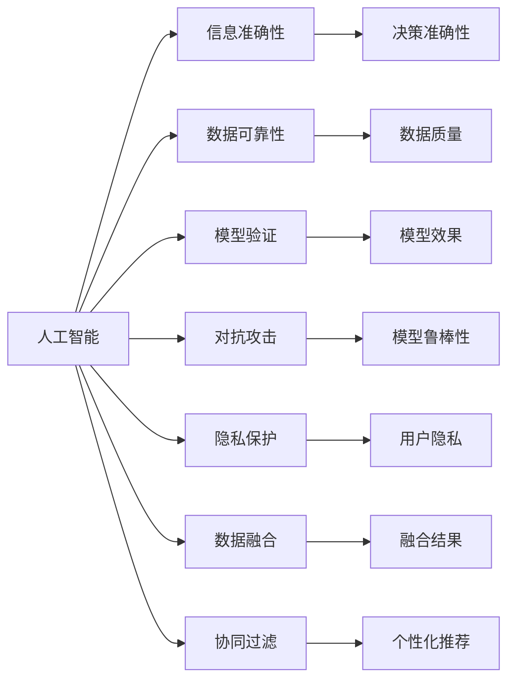

                 

# AI如何保证信息的准确性和可靠性

> 关键词：人工智能,信息准确性,数据可靠性,模型验证,对抗攻击,隐私保护,数据融合,协同过滤

## 1. 背景介绍

在数字时代，信息准确性和可靠性至关重要。无论是金融、医疗、制造业，还是日常社交，错误的信息都可能导致严重的后果。然而，伴随人工智能（AI）技术的高速发展，信息传播的自动化水平不断提高，人们对于AI系统能够提供高质量、可靠的信息的期待也在不断增强。因此，如何利用AI技术来保障信息准确性和可靠性，成为了一个值得深入探讨的课题。本文将围绕这一核心问题，介绍AI在信息准确性和可靠性保障方面的基本概念、主要方法及其应用场景，希望能够为相关领域的从业者和研究者提供一定的启发和帮助。

## 2. 核心概念与联系

### 2.1 核心概念概述

为了深入理解AI在信息准确性和可靠性保障中的作用，本节将首先介绍几个关键概念：

- **人工智能（AI）**：一种通过模拟人类智能行为，如学习、推理、感知等，实现自动化决策和任务执行的计算机技术。

- **信息准确性（Information Accuracy）**：指信息中包含的数据与真实世界的一致性程度，准确的信息有助于做出正确的决策。

- **数据可靠性（Data Reliability）**：指数据源的稳定性、一致性和真实性，可靠的数据是信息准确性的基础。

- **模型验证（Model Validation）**：指通过一系列测试和评估过程，确保AI模型能够输出高质量、可靠的信息。

- **对抗攻击（Adversarial Attack）**：指攻击者通过特定的输入扰动，使AI模型输出错误或不可靠的结果。

- **隐私保护（Privacy Protection）**：指在数据处理和信息传播过程中，保护个人隐私不被滥用或泄露。

- **数据融合（Data Fusion）**：指通过整合多个数据源，提高数据质量和准确性，从而提升信息可靠性。

- **协同过滤（Collaborative Filtering）**：指通过分析用户的行为数据，推荐与用户兴趣匹配的、可靠的信息。

这些概念之间存在紧密的联系，共同构成了AI系统在信息准确性和可靠性保障中的工作框架。

### 2.2 核心概念原理和架构的 Mermaid 流程图



这个流程图展示了AI系统在信息准确性和可靠性保障中的核心概念及其相互关系：

1. **人工智能** 是整个系统的基础，通过学习用户的输入数据，生成信息。
2. **信息准确性** 和 **决策准确性** 是AI系统追求的目标，即确保输出的信息与真实世界一致，做出正确的决策。
3. **数据可靠性** 和 **数据质量** 是信息准确性的前提，需要保证数据源的稳定性和一致性。
4. **模型验证** 和 **模型鲁棒性** 确保模型的输出准确性，防止模型受到对抗攻击影响。
5. **隐私保护** 和 **用户隐私** 是数据使用的基本原则，确保数据不被滥用。
6. **数据融合** 和 **个性化推荐** 通过整合多源数据和用户行为数据，提升信息的个性化和可靠性。

## 3. 核心算法原理 & 具体操作步骤

### 3.1 算法原理概述

AI在信息准确性和可靠性保障中的核心算法原理主要围绕以下几方面展开：

- **数据预处理和清洗**：确保输入数据的质量和一致性。
- **模型训练和优化**：通过训练和优化模型，提高模型的准确性和鲁棒性。
- **对抗攻击检测和防御**：检测和抵御对抗攻击，确保模型输出稳定可靠。
- **隐私保护技术**：在数据处理和模型训练中保护个人隐私，防止数据泄露。

### 3.2 算法步骤详解

#### 3.2.1 数据预处理和清洗

1. **数据采集**：从不同的数据源（如传感器、社交网络、公共数据库等）采集数据。
2. **数据清洗**：删除或修正缺失、错误或异常数据，以保证数据质量和一致性。
3. **特征提取**：从清洗后的数据中提取有用的特征，为模型训练提供输入。

#### 3.2.2 模型训练和优化

1. **选择模型**：根据任务需求选择合适的机器学习或深度学习模型。
2. **数据划分**：将数据集划分为训练集、验证集和测试集，用于模型的训练、调参和评估。
3. **训练模型**：使用训练集对模型进行训练，优化模型参数，提高模型效果。
4. **验证和调优**：在验证集上评估模型性能，根据评估结果进行模型调参，避免过拟合。
5. **测试和评估**：在测试集上评估模型最终性能，确保模型在新数据上的泛化能力。

#### 3.2.3 对抗攻击检测和防御

1. **识别攻击**：通过分析模型输出和输入数据，识别对抗攻击。
2. **生成对抗样本**：生成特定的对抗样本，输入到模型中，模拟攻击效果。
3. **对抗训练**：在训练过程中加入对抗样本，提高模型的鲁棒性。
4. **防御策略**：在模型输出和决策过程中，加入鲁棒性检查，防止攻击成功。

#### 3.2.4 隐私保护技术

1. **数据匿名化**：对用户数据进行匿名处理，防止用户身份被识别。
2. **差分隐私**：在模型训练中加入噪声，保护用户隐私不被泄露。
3. **安全多方计算**：在保证数据隐私的前提下，进行数据计算和信息共享。
4. **访问控制**：限制数据访问权限，防止未经授权的数据使用。

### 3.3 算法优缺点

#### 3.3.1 算法优点

1. **自动化和高效性**：AI系统能够自动处理大量数据，提高信息准确性和可靠性的处理效率。
2. **泛化能力强**：通过机器学习和深度学习模型，AI能够从数据中学习到通用的规律，提高信息准确性和可靠性。
3. **适应性强**：AI系统能够适应不同类型的数据和任务，提升信息准确性和可靠性的应用范围。

#### 3.3.2 算法缺点

1. **依赖数据质量**：AI系统的输出质量依赖于输入数据的质量，数据采集和预处理过程的误差可能影响最终结果。
2. **模型复杂性**：深度学习模型通常较为复杂，训练和优化过程需要大量计算资源和专业知识。
3. **对抗攻击风险**：AI模型可能受到对抗攻击的影响，导致信息输出错误或不可靠。

### 3.4 算法应用领域

基于AI的信息准确性和可靠性保障技术，已经在多个领域得到了广泛应用，例如：

- **金融风控**：通过数据分析和模型预测，预防金融欺诈和风险，确保交易安全。
- **医疗诊断**：利用AI技术辅助医生诊断疾病，提高诊断准确性。
- **智能推荐系统**：通过分析用户行为数据，推荐与用户兴趣匹配的、可靠的信息。
- **自动化驾驶**：通过传感器数据和AI模型，实现精准定位和决策，确保驾驶安全。
- **网络安全**：通过检测和抵御网络攻击，保障网络信息的准确性和可靠性。

## 4. 数学模型和公式 & 详细讲解 & 举例说明

### 4.1 数学模型构建

在信息准确性和可靠性保障中，常用的数学模型包括线性回归、逻辑回归、支持向量机、决策树、神经网络等。这里以线性回归模型为例，介绍其构建和应用。

线性回归模型的目标是最小化预测值与真实值之间的平方误差，即：

$$
\min_{\theta} \frac{1}{n} \sum_{i=1}^{n} (y_i - \theta^T x_i)^2
$$

其中，$n$ 为样本数量，$y_i$ 为真实值，$x_i$ 为特征向量，$\theta$ 为模型参数。

### 4.2 公式推导过程

在线性回归模型的推导过程中，主要涉及最小二乘法的求解。最小二乘法通过最小化预测值与真实值之间的残差平方和，求解模型的最优参数 $\theta$。具体推导过程如下：

1. **求偏导数**：对损失函数求偏导数，得到：
   $$
   \frac{\partial}{\partial \theta} \frac{1}{n} \sum_{i=1}^{n} (y_i - \theta^T x_i)^2 = -2 \frac{1}{n} \sum_{i=1}^{n} (y_i - \theta^T x_i) x_i
   $$

2. **求导数为零**：将偏导数设置为零，得到：
   $$
   -2 \frac{1}{n} \sum_{i=1}^{n} (y_i - \theta^T x_i) x_i = 0
   $$

3. **求解 $\theta$**：将上述方程进行整理，得到线性回归模型的参数求解公式：
   $$
   \theta = (X^T X)^{-1} X^T y
   $$

其中，$X$ 为特征矩阵，$y$ 为真实值向量。

### 4.3 案例分析与讲解

假设有一个房价预测问题，已知房屋的面积、房间数、年龄等特征，需要预测房屋的价格。可以通过收集大量历史交易数据，使用线性回归模型进行预测。具体步骤如下：

1. **数据收集**：收集大量房屋交易数据，包括房屋面积、房间数、年龄、价格等特征。
2. **数据预处理**：对数据进行清洗和特征提取，如去除异常值、标准化特征等。
3. **模型训练**：使用历史数据对线性回归模型进行训练，得到最优的模型参数。
4. **模型评估**：在测试集上评估模型性能，计算均方误差（MSE）等指标。
5. **模型应用**：使用训练好的模型对新的房屋数据进行预测，输出房屋价格。

## 5. 项目实践：代码实例和详细解释说明

### 5.1 开发环境搭建

在进行信息准确性和可靠性保障的AI项目开发前，需要准备相应的开发环境。以下是使用Python进行机器学习项目开发的简单环境配置流程：

1. 安装Anaconda：从官网下载并安装Anaconda，用于创建独立的Python环境。

2. 创建并激活虚拟环境：
```bash
conda create -n my_env python=3.8 
conda activate my_env
```

3. 安装Python科学计算库：
```bash
conda install numpy scipy pandas scikit-learn statsmodels matplotlib seaborn
```

4. 安装机器学习框架：
```bash
conda install scikit-learn
```

5. 安装机器学习模型库：
```bash
conda install catboost lightgbm xgboost
```

完成上述步骤后，即可在`my_env`环境中开始开发工作。

### 5.2 源代码详细实现

下面我们以房价预测项目为例，给出使用线性回归模型进行信息准确性和可靠性保障的PyTorch代码实现。

首先，定义数据预处理和模型训练函数：

```python
import numpy as np
import pandas as pd
from sklearn.model_selection import train_test_split
from sklearn.preprocessing import StandardScaler
from sklearn.linear_model import LinearRegression

def load_data(path):
    df = pd.read_csv(path)
    X = df.drop(['price'], axis=1)
    y = df['price']
    return X, y

def preprocess_data(X, y):
    scaler = StandardScaler()
    X_scaled = scaler.fit_transform(X)
    return X_scaled, y

def train_model(X, y, learning_rate=0.01, num_epochs=1000):
    X_train, X_test, y_train, y_test = train_test_split(X, y, test_size=0.2, random_state=42)
    model = LinearRegression()
    model.fit(X_train, y_train)
    return model, X_test, y_test

def evaluate_model(model, X_test, y_test):
    y_pred = model.predict(X_test)
    mse = np.mean((y_pred - y_test) ** 2)
    return mse

# 加载数据
X, y = load_data('house_data.csv')

# 数据预处理
X, y = preprocess_data(X, y)

# 训练模型
model, X_test, y_test = train_model(X, y)

# 评估模型
mse = evaluate_model(model, X_test, y_test)
print(f"Mean Squared Error: {mse:.2f}")
```

在上述代码中，我们首先定义了数据加载、预处理和模型训练的函数。其中，数据加载函数`load_data`用于读取CSV文件，预处理函数`preprocess_data`对数据进行标准化处理，模型训练函数`train_model`使用线性回归模型进行训练，评估函数`evaluate_model`计算均方误差（MSE）。

接下来，我们使用上述函数对房价预测项目进行实现，具体步骤如下：

1. 加载数据：使用`load_data`函数从CSV文件中加载数据，并将数据分为特征`X`和标签`y`。
2. 数据预处理：使用`preprocess_data`函数对数据进行标准化处理，以提高模型训练效果。
3. 模型训练：使用`train_model`函数训练线性回归模型，得到最优的模型参数。
4. 模型评估：使用`evaluate_model`函数评估模型性能，计算均方误差（MSE）。
5. 结果输出：输出模型的均方误差，评估模型预测效果。

### 5.3 代码解读与分析

在上述代码中，每个函数的作用和实现过程如下：

- `load_data`函数：用于加载CSV文件中的数据，并分割为特征和标签。
- `preprocess_data`函数：对特征数据进行标准化处理，以提高模型训练的稳定性和效果。
- `train_model`函数：使用线性回归模型进行训练，并返回训练好的模型和测试集。
- `evaluate_model`函数：计算模型在测试集上的均方误差（MSE），评估模型性能。

需要注意的是，在实际项目中，还需要考虑数据分割、交叉验证、模型调参等环节，以确保模型的泛化能力和鲁棒性。

## 6. 实际应用场景

### 6.1 金融风控

在金融领域，AI系统通过分析用户的交易数据、行为数据等，预测和预防金融欺诈和风险，确保交易安全。例如，银行可以使用AI系统进行信用卡欺诈检测，通过分析用户的历史交易记录，检测异常交易行为，防止信用卡盗刷和欺诈。具体实现过程中，可以通过收集用户的交易数据、设备信息、位置信息等，训练分类模型，如逻辑回归、支持向量机、随机森林等，进行用户行为分析和欺诈检测。

### 6.2 医疗诊断

在医疗领域，AI系统通过分析患者的病历数据、影像数据等，辅助医生进行疾病诊断和治疗决策。例如，AI系统可以通过分析患者的影像数据（如X光片、CT扫描、MRI等），检测病变区域和病变类型，辅助医生进行诊断和治疗。具体实现过程中，可以使用卷积神经网络（CNN）等深度学习模型，对影像数据进行特征提取和分类。

### 6.3 智能推荐系统

在电商、新闻、视频等平台，AI系统通过分析用户的行为数据，推荐与用户兴趣匹配的商品、新闻、视频等，提升用户体验和平台收益。例如，电商平台可以使用协同过滤算法，根据用户的历史行为数据，推荐用户可能感兴趣的商品。具体实现过程中，可以使用协同过滤算法、矩阵分解算法、深度学习模型等，对用户行为数据进行建模和推荐。

### 6.4 自动化驾驶

在自动驾驶领域，AI系统通过传感器数据和AI模型，实现精准定位和决策，确保驾驶安全。例如，自动驾驶汽车可以通过激光雷达、摄像头、GPS等传感器获取环境数据，使用深度学习模型进行环境感知和行为决策。具体实现过程中，可以使用卷积神经网络（CNN）、循环神经网络（RNN）等模型，对传感器数据进行特征提取和决策。

## 7. 工具和资源推荐

### 7.1 学习资源推荐

为了帮助开发者系统掌握信息准确性和可靠性保障的理论基础和实践技巧，这里推荐一些优质的学习资源：

1. **机器学习公开课**：由斯坦福大学、麻省理工学院、谷歌等机构提供的免费公开课，涵盖机器学习和深度学习的基础知识和应用案例。
2. **《深度学习》书籍**：深度学习领域的经典教材，由Yoshua Bengio、Ian Goodfellow和Aaron Courville合著，系统介绍了深度学习的原理和实践。
3. **Kaggle竞赛**：Kaggle提供了一系列数据科学和机器学习的竞赛，通过实践项目提高技术水平。
4. **Google Colab**：谷歌提供的在线Jupyter Notebook环境，免费提供GPU和TPU算力，方便开发者快速上手实验最新模型，分享学习笔记。
5. **Coursera和edX**：提供在线课程和证书，涵盖机器学习和深度学习的各个方面，适合系统学习。

通过对这些资源的学习实践，相信你一定能够快速掌握信息准确性和可靠性保障的精髓，并用于解决实际的AI应用问题。

### 7.2 开发工具推荐

高效的开发离不开优秀的工具支持。以下是几款用于信息准确性和可靠性保障的AI项目开发的常用工具：

1. **TensorFlow**：由谷歌主导开发的开源深度学习框架，生产部署方便，适合大规模工程应用。
2. **PyTorch**：基于Python的开源深度学习框架，灵活动态的计算图，适合快速迭代研究。
3. **Scikit-learn**：Python科学计算库，提供简单易用的机器学习算法，适合快速原型设计和实验验证。
4. **Catboost和LightGBM**：开源的梯度提升决策树算法库，提供高效的模型训练和预测功能。
5. **Python科学计算生态**：包括NumPy、Pandas、SciPy等库，提供强大的数据处理和计算能力。

合理利用这些工具，可以显著提升信息准确性和可靠性保障任务的开发效率，加快创新迭代的步伐。

### 7.3 相关论文推荐

信息准确性和可靠性保障的研究源于学界的持续研究。以下是几篇奠基性的相关论文，推荐阅读：

1. **《Adversarial Machine Learning》**：综述了对抗攻击的原理、检测和防御方法，是研究对抗攻击的重要文献。
2. **《Differential Privacy》**：提出了差分隐私的概念和算法，保护个人隐私不被泄露。
3. **《Data Fusion for Information Fusion》**：介绍了数据融合的原理和应用，通过整合多源数据提高信息可靠性。
4. **《Collaborative Filtering》**：综述了协同过滤算法的原理和应用，通过分析用户行为数据进行个性化推荐。

这些论文代表了大语言模型微调技术的发展脉络。通过学习这些前沿成果，可以帮助研究者把握学科前进方向，激发更多的创新灵感。

## 8. 总结：未来发展趋势与挑战

### 8.1 总结

本文对AI在信息准确性和可靠性保障中的作用进行了全面系统的介绍。首先，阐述了信息准确性和可靠性保障的研究背景和意义，明确了AI系统在保障信息质量中的核心作用。其次，从原理到实践，详细讲解了信息准确性和可靠性保障的数学模型和算法步骤，给出了信息准确性和可靠性保障的代码实例。同时，本文还广泛探讨了信息准确性和可靠性保障在金融、医疗、电商等多个领域的应用场景，展示了AI技术的广泛应用前景。

通过本文的系统梳理，可以看到，AI技术在信息准确性和可靠性保障中的独特价值。伴随AI技术的不断发展，信息准确性和可靠性保障的技术也将不断提升，为信息传播和应用带来更高效、更可靠的保障。

### 8.2 未来发展趋势

展望未来，信息准确性和可靠性保障的AI技术将呈现以下几个发展趋势：

1. **自动化水平提升**：随着AI技术的不断进步，信息准确性和可靠性保障的自动化水平将不断提高，减少人工干预和错误。
2. **模型复杂性简化**：未来的AI模型将更加轻量级和高效，能够在移动设备和嵌入式设备上实时运行。
3. **跨领域应用扩展**：AI技术将广泛应用于更多领域，如医疗、教育、农业等，提升各个领域的生产力和效率。
4. **多模态信息融合**：未来的AI系统将能够整合多种数据源，如文本、图像、语音、视频等，提升信息的全面性和可靠性。
5. **用户隐私保护加强**：在信息传播和处理过程中，将更加注重用户隐私保护，防止数据泄露和滥用。

以上趋势凸显了AI技术在信息准确性和可靠性保障中的广阔前景。这些方向的探索发展，必将进一步提升AI系统的性能和应用范围，为人类社会带来更多的便利和进步。

### 8.3 面临的挑战

尽管AI技术在信息准确性和可靠性保障中已经取得了显著进展，但在迈向更加智能化、普适化应用的过程中，仍面临诸多挑战：

1. **数据质量依赖**：AI系统的输出质量高度依赖于输入数据的质量，数据采集和预处理过程的误差可能影响最终结果。
2. **对抗攻击风险**：AI模型可能受到对抗攻击的影响，导致信息输出错误或不可靠。
3. **隐私保护难题**：在数据处理和模型训练中，如何保护个人隐私，防止数据泄露和滥用，是一个重要的挑战。
4. **模型鲁棒性不足**：AI模型可能对不同类型的数据和攻击方式表现出不同的鲁棒性，需要进一步提升模型的鲁棒性。
5. **计算资源消耗**：AI系统在处理大规模数据时，需要消耗大量计算资源，如何优化资源使用，提高系统效率，是一个重要的研究方向。

### 8.4 研究展望

为了应对上述挑战，未来的研究需要在以下几个方面寻求新的突破：

1. **数据增强和清洗技术**：通过数据增强和清洗技术，提高输入数据的质量和一致性，减少数据采集和预处理误差。
2. **对抗攻击检测和防御**：研究更加高效的对抗攻击检测和防御方法，提高模型的鲁棒性和安全性。
3. **隐私保护技术创新**：探索新的隐私保护技术，如差分隐私、安全多方计算等，保护用户隐私不被滥用。
4. **模型简化和优化**：研究轻量级和高效的模型架构，减少计算资源消耗，提高系统的实时性和可扩展性。
5. **跨模态信息融合**：研究多模态信息融合技术，提升AI系统对多源数据的整合和理解能力。

这些研究方向的探索，必将引领AI技术在信息准确性和可靠性保障中迈向更高的台阶，为构建安全、可靠、高效的信息系统铺平道路。面向未来，AI技术需要在数据质量、隐私保护、模型鲁棒性等方面持续努力，不断优化和创新，才能真正实现信息准确性和可靠性的全面保障。

## 9. 附录：常见问题与解答

### Q1：AI在信息准确性和可靠性保障中的核心算法原理是什么？

A: AI在信息准确性和可靠性保障中的核心算法原理主要包括数据预处理和清洗、模型训练和优化、对抗攻击检测和防御、隐私保护技术等。其中，数据预处理和清洗通过去除或修正数据中的异常值和噪声，提高输入数据的质量和一致性；模型训练和优化通过训练和优化AI模型，提高模型的准确性和鲁棒性；对抗攻击检测和防御通过检测和抵御对抗攻击，确保模型输出稳定可靠；隐私保护技术通过保护用户隐私，防止数据泄露和滥用。

### Q2：AI在信息准确性和可靠性保障中常用的数学模型有哪些？

A: AI在信息准确性和可靠性保障中常用的数学模型包括线性回归、逻辑回归、支持向量机、决策树、神经网络等。其中，线性回归模型用于预测和回归问题，通过最小化预测值与真实值之间的误差来训练模型；逻辑回归模型用于分类问题，通过学习特征与标签之间的概率关系进行分类；支持向量机和决策树模型用于分类和回归问题，通过寻找最优的超平面或决策边界进行分类或回归；神经网络模型用于复杂的分类和回归问题，通过多层次的非线性映射提高模型的表达能力。

### Q3：AI在信息准确性和可靠性保障中常用的开发工具有哪些？

A: AI在信息准确性和可靠性保障中常用的开发工具包括TensorFlow、PyTorch、Scikit-learn、Catboost和LightGBM等。其中，TensorFlow和PyTorch是深度学习框架，提供高效的模型训练和推理功能；Scikit-learn是科学计算库，提供简单易用的机器学习算法；Catboost和LightGBM是梯度提升决策树算法库，提供高效的模型训练和预测功能。

### Q4：AI在信息准确性和可靠性保障中常用的学习资源有哪些？

A: AI在信息准确性和可靠性保障中常用的学习资源包括机器学习公开课、《深度学习》书籍、Kaggle竞赛、Google Colab和Coursera等。其中，机器学习公开课提供免费的学习资源，涵盖机器学习和深度学习的各个方面；《深度学习》书籍是深度学习领域的经典教材，系统介绍了深度学习的原理和实践；Kaggle竞赛提供实践项目，提高技术水平；Google Colab和Coursera提供在线课程和证书，适合系统学习。

### Q5：AI在信息准确性和可靠性保障中面临的主要挑战有哪些？

A: AI在信息准确性和可靠性保障中面临的主要挑战包括数据质量依赖、对抗攻击风险、隐私保护难题、模型鲁棒性不足和计算资源消耗等。其中，数据质量依赖问题需要通过数据增强和清洗技术解决；对抗攻击风险需要通过对抗攻击检测和防御方法解决；隐私保护难题需要通过隐私保护技术创新解决；模型鲁棒性不足需要通过模型简化和优化解决；计算资源消耗问题需要通过优化资源使用和提高系统效率解决。

---

作者：禅与计算机程序设计艺术 / Zen and the Art of Computer Programming

