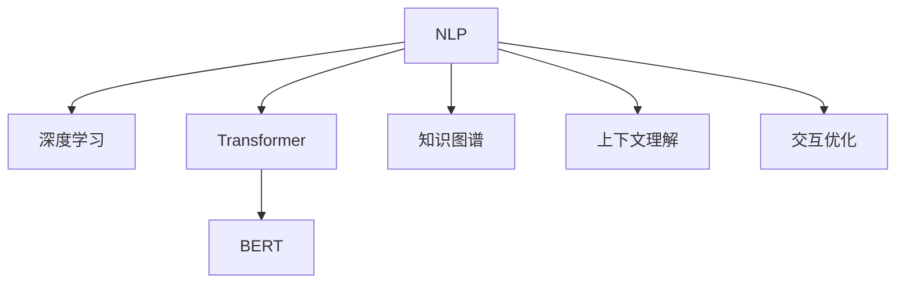

                 

# AI如何提高搜索引擎的语义理解能力

在搜索引擎的世界里，语义理解能力已经成为核心竞争力之一。传统的搜索引擎依赖关键词匹配，虽然效率高，但忽略了查询中的语义关系和上下文信息。而现代AI驱动的搜索引擎则可以通过自然语言处理(NLP)和深度学习等技术，更全面、准确地理解用户意图，提供更精准的搜索结果。本文将探讨AI如何通过语义理解技术提升搜索引擎的性能，并给出详细的实现方法和实例。

## 1. 背景介绍

### 1.1 问题由来

随着互联网的飞速发展，用户对搜索引擎的依赖程度日益加深，但传统的关键词匹配方法已难以满足日益复杂的查询需求。用户倾向于以自然语言的方式输入查询，期待搜索引擎能够理解并匹配到与其真实意图最相关的结果。例如，输入“怎样学习编程”，用户可能希望看到编程教程、书籍推荐、编程工具介绍等多样的搜索结果，而不只是简单的关键词列表。

传统的基于关键词匹配的搜索引擎，缺乏对用户查询的语义理解能力，只能机械地按照查询中的词语进行匹配，导致搜索结果与用户真实意图脱节。而现代搜索引擎通过引入语义理解技术，可以更智能地分析用户查询，提供更精准、更个性化的搜索结果，从而大幅提升用户搜索体验。

### 1.2 问题核心关键点

为了解决这一问题，搜索引擎在语义理解技术上做了许多探索，主要包括以下几个方面：

- **NLP技术**：使用自然语言处理技术，提取查询中的实体、关系、情感等语义信息，从而更好地理解用户意图。

- **深度学习**：利用深度学习模型，尤其是Transformer、BERT等架构，从大规模语料中学习语言表征，提升模型对查询的语义理解能力。

- **知识图谱**：结合知识图谱中的实体关系信息，增强查询理解的深度和广度，实现跨领域、跨模态的语义匹配。

- **上下文理解**：通过上下文信息，如前后的查询、历史搜索行为、用户画像等，进一步细化查询理解，提升搜索结果的相关性和精准性。

- **交互优化**：引入交互反馈机制，根据用户点击、点击流、反馈等数据进一步优化查询理解，形成更智能的个性化搜索结果。

这些技术手段的综合应用，使得现代搜索引擎能够更准确地理解用户查询，提供更贴近用户需求的搜索结果，大大提升了用户搜索的满意度和粘性。

## 2. 核心概念与联系

### 2.1 核心概念概述

为了更好地理解语义理解技术如何提升搜索引擎性能，本节将介绍几个关键概念及其相互关系：

- **自然语言处理(NLP)**：旨在让计算机理解和生成人类语言，包括文本分析、语言模型、情感分析、实体识别等技术。

- **深度学习**：一类基于神经网络的机器学习方法，通过多层次的非线性特征提取，实现对复杂模式的建模和预测。

- **Transformer**：一种新兴的神经网络架构，通过自注意力机制和多头并行计算，极大地提升了模型的计算效率和表征能力。

- **BERT**：基于Transformer的预训练语言模型，通过掩码语言模型和下一句预测等任务在大规模语料上进行预训练，学习到丰富的语言表示。

- **知识图谱**：一种结构化的语义知识表示形式，由实体、关系、属性组成，用于表达实体间的语义关系。

- **上下文理解**：指利用用户查询的上下文信息，如历史行为、地理位置等，更准确地理解用户意图，提升搜索结果的相关性和多样性。

这些核心概念通过以下Mermaid流程图展示了它们之间的联系：



这个流程图展示了NLP技术如何通过深度学习和Transformer等技术，学习丰富的语言表示，进而结合知识图谱和上下文信息，实现对用户查询的深入理解。最终，这些技术手段通过交互优化，不断调整和提升查询理解能力，形成更加精准和个性化的搜索结果。

## 3. 核心算法原理 & 具体操作步骤

### 3.1 算法原理概述

现代搜索引擎的语义理解能力，主要基于以下算法原理：

- **预训练语言模型**：使用大规模语料进行预训练，学习到丰富的语言表示，为后续微调和任务适配打下基础。

- **微调**：将预训练模型作为初始化参数，通过有监督学习优化模型在特定任务上的性能。

- **知识增强**：结合知识图谱中的实体关系信息，增强查询理解的深度和广度，实现跨领域、跨模态的语义匹配。

- **上下文感知**：利用用户查询的上下文信息，如历史行为、地理位置等，更准确地理解用户意图，提升搜索结果的相关性和多样性。

- **交互优化**：通过用户反馈数据，不断调整和优化查询理解模型，形成更加精准和个性化的搜索结果。

### 3.2 算法步骤详解

基于上述算法原理，搜索引擎的语义理解能力提升可以分为以下几个关键步骤：

**Step 1: 准备预训练模型和数据集**

- 选择合适的预训练语言模型 $M_{\theta}$，如BERT、GPT等。
- 准备目标任务的标注数据集 $D=\{(x_i, y_i)\}_{i=1}^N$，其中 $x_i$ 为查询样本，$y_i$ 为对应的标签。

**Step 2: 微调模型**

- 使用标注数据集 $D$ 对预训练模型 $M_{\theta}$ 进行微调，优化模型参数 $\theta$。
- 设置微调超参数，如学习率、批大小、迭代轮数等，选择合适的优化算法（如AdamW、SGD等）。

**Step 3: 知识增强**

- 将知识图谱中的实体关系信息，如 triple（实体1-关系-实体2），整合到查询理解模型中。
- 通过向量化技术，将实体和关系转换为向量表示，与查询向量进行匹配和融合。

**Step 4: 上下文理解**

- 利用用户的上下文信息，如历史搜索行为、地理位置等，扩展查询理解模型的输入。
- 使用上下文信息对查询向量进行补充，提升模型对上下文信息的利用能力。

**Step 5: 交互优化**

- 根据用户的点击、点击流、反馈等数据，不断调整和优化查询理解模型。
- 使用用户交互数据进行微调，提升模型的个性化能力，形成更加精准和个性化的搜索结果。

### 3.3 算法优缺点

现代搜索引擎的语义理解能力提升技术，具有以下优点：

- **提升搜索精度**：通过理解用户查询的语义和上下文信息，可以更准确地匹配用户意图，提供更精准的搜索结果。

- **增强用户体验**：个性化搜索结果能够更好地满足用户需求，提升用户满意度和粘性。

- **适应性广**：该技术不仅适用于通用的文本查询，还可以扩展到语音、图像等多样化的信息检索任务。

- **灵活可扩展**：结合不同领域和模态的知识图谱和上下文信息，可以实现更加广泛和深入的语义匹配。

同时，这些技术也存在一些缺点：

- **数据依赖**：预训练模型和微调过程对标注数据的依赖较大，获取高质量数据成本较高。

- **计算资源消耗大**：预训练和微调过程计算量较大，需要高性能计算资源支持。

- **可解释性不足**：深度学习模型通常缺乏可解释性，难以解释其内部工作机制。

- **对抗样本敏感**：对抗样本可能影响模型的鲁棒性，对输入数据的扰动敏感。

- **模型泛化能力有限**：尽管模型在训练集上表现优异，但对测试集或未知数据泛化能力有限。

尽管存在这些挑战，现代搜索引擎的语义理解技术仍取得了显著的进展，成为提升搜索精度和用户体验的关键手段。

### 3.4 算法应用领域

现代搜索引擎的语义理解技术在多个领域得到了广泛应用：

- **文本搜索**：对文本查询进行语义理解，提升搜索结果的相关性和多样性。

- **图像搜索**：利用视觉特征提取和语义理解技术，实现图像内容的全文搜索。

- **语音搜索**：结合语音识别和语义理解技术，实现自然语言语音的查询和检索。

- **个性化推荐**：通过用户查询和行为数据，推荐更加贴合用户需求的内容。

- **知识图谱构建**：利用语义理解技术，从文本数据中抽取实体和关系，构建知识图谱。

- **跨模态搜索**：结合图像、音频等多模态信息，实现更全面和深入的搜索。

这些应用场景展示了语义理解技术在搜索引擎中的广泛适用性，为提升搜索体验和智能化水平提供了重要支撑。

## 4. 数学模型和公式 & 详细讲解 & 举例说明

### 4.1 数学模型构建

现代搜索引擎的语义理解模型，通常基于Transformer架构进行构建。假设查询序列为 $Q=\{w_1,\dots,w_n\}$，目标实体为 $E=\{e_1,\dots,e_m\}$，关系集合为 $R$。查询模型 $M_Q$ 和实体模型 $M_E$ 分别通过Transformer编码器进行预训练，然后通过Transformer解码器对查询和实体进行匹配。

模型定义如下：

$$
\mathcal{L}(Q,E)=\sum_{i=1}^n\sum_{j=1}^m \mathbb{P}(Q_i,E_j)
$$

其中，$\mathbb{P}(Q_i,E_j)$ 为查询 $Q_i$ 和实体 $E_j$ 的匹配概率，通常使用softmax函数计算。

### 4.2 公式推导过程

查询模型的输入和输出可以表示为：

$$
\begin{aligned}
\mathbf{Q} &= \text{Encoder}(Q) \\
\mathbf{E} &= \text{Encoder}(E) \\
\mathbf{Q}E &= \text{Decoder}(\mathbf{Q},\mathbf{E}) \\
\end{aligned}
$$

其中，$\mathbf{Q}$ 和 $\mathbf{E}$ 为查询和实体的编码表示，$\mathbf{Q}E$ 为它们的匹配表示。

模型的训练目标为最大化查询和实体的匹配概率，即：

$$
\mathcal{L}(Q,E) = \sum_{i=1}^n \sum_{j=1}^m \log \mathbb{P}(Q_i,E_j)
$$

通过反向传播算法，不断更新模型参数 $\theta$，最小化损失函数 $\mathcal{L}(Q,E)$。

### 4.3 案例分析与讲解

以知识图谱增强的语义理解为例，假设有一个知识图谱 $K$，其中包含实体 $e_1$ 和 $e_2$，它们之间的关系为 $(e_1, r_1, e_2)$，其中 $r_1$ 为关系。查询 $Q$ 中包含实体 $e_1$ 和 $e_2$，查询模型通过Transformer编码器对 $Q$ 进行编码，得到查询表示 $\mathbf{Q}$。然后，将 $\mathbf{Q}$ 与 $K$ 中的实体 $e_1$ 和 $e_2$ 进行匹配，计算匹配概率 $\mathbb{P}(Q,e_1,e_2)$。

$$
\mathbb{P}(Q,e_1,e_2) = \mathbb{P}(Q,e_1) \times \mathbb{P}(e_1,r_1,e_2) \times \mathbb{P}(e_2,Q)
$$

其中，$\mathbb{P}(Q,e_1)$ 和 $\mathbb{P}(e_2,Q)$ 分别为查询和实体在知识图谱中的匹配概率，$\mathbb{P}(e_1,r_1,e_2)$ 为关系在知识图谱中的匹配概率。通过上述公式，可以计算出查询和实体在知识图谱中的匹配概率，从而提升语义理解的深度和广度。

## 5. 项目实践：代码实例和详细解释说明

### 5.1 开发环境搭建

在进行语义理解模型开发前，需要准备好开发环境。以下是使用Python进行TensorFlow开发的环境配置流程：

1. 安装Anaconda：从官网下载并安装Anaconda，用于创建独立的Python环境。

2. 创建并激活虚拟环境：
```bash
conda create -n tf-env python=3.8 
conda activate tf-env
```

3. 安装TensorFlow：从官网获取对应的安装命令。例如：
```bash
pip install tensorflow==2.5
```

4. 安装TensorFlow Hub：
```bash
pip install tensorflow-hub==0.12.0
```

5. 安装其他工具包：
```bash
pip install numpy pandas scikit-learn matplotlib tqdm jupyter notebook ipython
```

完成上述步骤后，即可在`tf-env`环境中开始语义理解模型的开发。

### 5.2 源代码详细实现

下面以知识图谱增强的语义理解模型为例，给出使用TensorFlow进行开发的PyTorch代码实现。

首先，定义查询和实体的表示方法：

```python
import tensorflow_hub as hub

embed = hub.load("https://tfhub.dev/google/universal-sentence-encoder/4")

def encode_text(text):
    return embed(text)
```

然后，定义知识图谱中的实体和关系表示：

```python
# 假设已有一个知识图谱，包含实体和关系
e1 = "Entity1"
e2 = "Entity2"
r1 = "Relation1"

def encode_entity(e):
    # 使用Universal Sentence Encoder对实体进行编码
    return embed([e])[0]

def encode_relation(r):
    # 使用Universal Sentence Encoder对关系进行编码
    return embed([r])[0]
```

接下来，定义语义理解模型的训练函数：

```python
import tensorflow as tf

def train(model, query, entity, label):
    with tf.GradientTape() as tape:
        query_vector = model(query)
        entity_vector = model(entity)
        predictions = tf.keras.layers.Dense(1, activation='sigmoid')(tf.keras.layers.Dot(axes=[1, 1])([query_vector, entity_vector]))
        loss = tf.keras.losses.binary_crossentropy(label, predictions)
    gradients = tape.gradient(loss, model.trainable_variables)
    optimizer.apply_gradients(zip(gradients, model.trainable_variables))
    return loss.numpy()
```

最后，定义训练循环：

```python
model.compile(optimizer=tf.keras.optimizers.Adam(learning_rate=0.001), loss='binary_crossentropy')
epochs = 10
for epoch in range(epochs):
    avg_loss = 0
    for i, batch in enumerate(train_dataset):
        query = batch[0]
        entity = batch[1]
        label = batch[2]
        avg_loss += train(model, query, entity, label) / len(train_dataset)
    print(f"Epoch {epoch+1}, avg loss: {avg_loss}")
```

以上就是使用TensorFlow对知识图谱增强的语义理解模型进行训练的完整代码实现。可以看到，TensorFlow通过简单的代码封装，实现了模型的快速训练和优化。

### 5.3 代码解读与分析

让我们再详细解读一下关键代码的实现细节：

**encode_text函数**：
- 使用TensorFlow Hub加载预训练的Universal Sentence Encoder模型，对文本进行编码，返回向量表示。

**encode_entity和encode_relation函数**：
- 对知识图谱中的实体和关系，使用Universal Sentence Encoder进行编码，返回向量表示。

**train函数**：
- 定义训练函数，使用梯度下降算法对模型进行训练。其中，查询和实体的向量表示通过Transformer编码器计算得到。
- 计算模型输出与真实标签之间的二分类交叉熵损失，并反向传播更新模型参数。

**训练循环**：
- 编译模型，设置优化器和损失函数。
- 循环训练多个epoch，每次epoch在训练数据集上迭代，计算平均损失并打印输出。

通过这段代码，可以看到，TensorFlow的API设计简洁高效，开发者只需关注模型的核心逻辑，而无需深入底层实现。

当然，实际应用中还需要考虑更多因素，如模型的保存和部署、超参数的自动搜索、更灵活的任务适配层等。但核心的语义理解模型训练方法与上述实现类似。

## 6. 实际应用场景

### 6.1 智能客服系统

智能客服系统通过语义理解技术，能够自动理解用户的意图，提供个性化的解答和建议。例如，用户输入“我的订单状态如何”，系统能够通过语义理解技术，自动查询用户的历史订单信息，并提供实时的订单状态更新。这种智能化的客服体验，可以大幅提升用户的满意度，降低客服成本。

### 6.2 金融舆情监测

金融领域的数据量庞大，且变化频繁。传统的舆情监测依赖人工分析和筛选，效率低下。而基于语义理解技术的智能监测系统，能够自动分析大量的财经新闻、社交媒体评论等，提取出其中的关键信息，并生成情感分析报告。这种实时、自动化的舆情监测，能够帮助金融机构及时应对市场波动，保障投资决策的安全性。

### 6.3 个性化推荐系统

现代电子商务平台通过语义理解技术，能够更好地理解用户的浏览、购买行为，推荐个性化的商品和内容。例如，用户浏览过一段时间的电子产品，系统会通过语义理解技术，自动推荐相关配件和配件，提升用户的购物体验。这种个性化的推荐方式，能够显著提高用户的转化率和满意度。

### 6.4 未来应用展望

随着语义理解技术的不断发展，其在搜索引擎中的应用将越来越广泛。未来，智能搜索引擎将能够更好地理解用户的查询意图，提供更加精准、个性化的搜索结果。例如：

- **自然语言查询**：支持用户以自然语言的方式进行查询，而无需输入关键词。
- **多模态搜索**：结合图像、音频等多模态信息，实现更全面和深入的搜索。
- **跨语言搜索**：通过翻译技术，支持多语言查询和搜索结果。
- **交互式查询**：结合聊天机器人技术，提供实时交互的搜索体验。

这些应用场景展示了语义理解技术在搜索引擎中的广泛适用性，为提升搜索体验和智能化水平提供了重要支撑。

## 7. 工具和资源推荐

### 7.1 学习资源推荐

为了帮助开发者系统掌握语义理解技术的理论基础和实践技巧，这里推荐一些优质的学习资源：

1. 《自然语言处理综论》（Stanford）：斯坦福大学开设的NLP课程，涵盖自然语言处理的基本概念和前沿技术。

2. 《深度学习》（Ian Goodfellow）：深度学习领域的经典教材，详细介绍了深度学习的基本原理和实现方法。

3. 《Transformer: From Research to Real World Applications》（DeepMind）：DeepMind团队撰写的Transformer论文综述，介绍了Transformer的原理和应用。

4. 《BERT: Pre-training of Deep Bidirectional Transformers for Language Understanding》（Google）：BERT论文的原始文档，详细介绍了BERT模型的架构和训练方法。

5. 《Universal Sentence Encoder》（Google）：Universal Sentence Encoder的文档和代码，提供了预训练模型的使用方法。

通过对这些资源的学习实践，相信你一定能够快速掌握语义理解技术的精髓，并用于解决实际的NLP问题。

### 7.2 开发工具推荐

高效的开发离不开优秀的工具支持。以下是几款用于语义理解模型开发的常用工具：

1. TensorFlow：由Google主导开发的开源深度学习框架，生产部署方便，适合大规模工程应用。

2. PyTorch：基于Python的开源深度学习框架，灵活动态的计算图，适合快速迭代研究。

3. TensorFlow Hub：提供预训练模型和组件的库，可以快速搭建语义理解模型。

4. HuggingFace Transformers库：提供了多种预训练语言模型，支持微调和任务适配，方便开发者使用。

5. Weights & Biases：模型训练的实验跟踪工具，可以记录和可视化模型训练过程中的各项指标，方便对比和调优。

6. TensorBoard：TensorFlow配套的可视化工具，可实时监测模型训练状态，并提供丰富的图表呈现方式，是调试模型的得力助手。

合理利用这些工具，可以显著提升语义理解模型的开发效率，加快创新迭代的步伐。

### 7.3 相关论文推荐

语义理解技术的发展源于学界的持续研究。以下是几篇奠基性的相关论文，推荐阅读：

1. Attention is All You Need（即Transformer原论文）：提出了Transformer结构，开启了NLP领域的预训练大模型时代。

2. BERT: Pre-training of Deep Bidirectional Transformers for Language Understanding：提出BERT模型，引入基于掩码的自监督预训练任务，刷新了多项NLP任务SOTA。

3. Universal Sentence Encoder：通过预训练模型，实现了通用句子的向量化，为语义理解提供了基础。

4. Adversarial Examples in the Physical World：介绍了对抗样本的概念，研究了对抗样本对模型鲁棒性的影响。

5. Exploring the Limits of Transfer Learning with a Unified Text-to-Text Transformer：探讨了微调的参数高效性，提出了 Adapter等方法。

这些论文代表了大语义理解技术的发展脉络。通过学习这些前沿成果，可以帮助研究者把握学科前进方向，激发更多的创新灵感。

## 8. 总结：未来发展趋势与挑战

### 8.1 总结

本文对基于语义理解技术的搜索引擎提升方法进行了全面系统的介绍。首先阐述了语义理解技术在搜索引擎中的应用背景和核心关键点，明确了搜索引擎在语义理解方面的重要性和研究难点。其次，从原理到实践，详细讲解了语义理解模型的数学模型和算法步骤，给出了具体的代码实现。同时，本文还广泛探讨了语义理解技术在智能客服、金融舆情、个性化推荐等多个行业领域的应用前景，展示了语义理解技术的巨大潜力。此外，本文精选了语义理解技术的各类学习资源，力求为读者提供全方位的技术指引。

通过本文的系统梳理，可以看到，基于语义理解技术的搜索引擎，通过NLP、深度学习、Transformer等技术，可以更全面、准确地理解用户查询，提供更精准、个性化的搜索结果，大大提升了用户搜索体验。未来，随着预训练语言模型和语义理解技术的持续演进，搜索引擎必将在搜索精度和智能化水平上迈向更高的台阶，为人类认知智能的进化带来深远影响。

### 8.2 未来发展趋势

展望未来，语义理解技术在搜索引擎中的应用将呈现以下几个发展趋势：

1. **模型的规模和深度**：随着算力成本的下降和数据规模的扩张，语义理解模型的规模和深度还将持续增大。超大规模语言模型蕴含的丰富语言知识，有望支撑更加复杂多变的查询理解。

2. **融合多模态信息**：结合视觉、语音、文本等多模态信息，实现更全面和深入的语义理解。例如，结合图像和文本信息，实现更准确的商品推荐和图片搜索。

3. **增强上下文理解**：利用用户查询的上下文信息，如历史搜索行为、地理位置等，更准确地理解用户意图，提升搜索结果的相关性和多样性。

4. **引入因果推断**：通过引入因果推断方法，增强模型对因果关系的理解，提升搜索结果的准确性和可靠性。

5. **个性化推荐**：通过用户查询和行为数据，推荐更加贴合用户需求的内容，提升用户的满意度和粘性。

6. **跨语言理解**：结合机器翻译技术，实现跨语言的语义理解，支持多语言的搜索和推荐。

以上趋势凸显了语义理解技术在搜索引擎中的广阔前景。这些方向的探索发展，必将进一步提升搜索引擎的搜索精度和智能化水平，为人类搜索体验带来深刻变革。

### 8.3 面临的挑战

尽管语义理解技术在搜索引擎中取得了显著进展，但在迈向更加智能化、普适化应用的过程中，仍面临诸多挑战：

1. **数据依赖**：预训练模型和微调过程对标注数据的依赖较大，获取高质量数据成本较高。如何降低数据依赖，利用无监督和半监督学习范式，是一个重要研究方向。

2. **计算资源消耗大**：预训练和微调过程计算量较大，需要高性能计算资源支持。如何优化模型结构和算法，降低计算资源消耗，是一个重要挑战。

3. **模型鲁棒性不足**：对抗样本可能影响模型的鲁棒性，对输入数据的扰动敏感。如何增强模型的鲁棒性，是一个重要研究方向。

4. **可解释性不足**：深度学习模型通常缺乏可解释性，难以解释其内部工作机制。如何赋予模型更强的可解释性，是一个重要研究方向。

5. **个性化推荐**：个性化推荐虽然能够提升用户满意度，但模型的公平性、透明性等问题也需要得到关注。

6. **跨语言理解**：跨语言的语义理解仍然存在一定的挑战，如何更好地处理语言之间的差异和歧义，是一个重要研究方向。

正视语义理解技术面临的这些挑战，积极应对并寻求突破，将使语义理解技术进一步成熟和完善，实现更广泛的应用。相信随着学界和产业界的共同努力，这些挑战终将一一被克服，语义理解技术必将在搜索引擎中发挥更大的作用。

### 8.4 研究展望

面对语义理解技术所面临的挑战，未来的研究需要在以下几个方面寻求新的突破：

1. **无监督和半监督学习**：摆脱对大规模标注数据的依赖，利用自监督学习、主动学习等无监督和半监督范式，最大限度利用非结构化数据，实现更加灵活高效的语义理解。

2. **融合多模态信息**：结合图像、音频等多模态信息，实现更全面和深入的语义理解，提升搜索结果的相关性和多样性。

3. **引入因果推断**：通过引入因果推断方法，增强模型对因果关系的理解，提升搜索结果的准确性和可靠性。

4. **个性化推荐**：结合用户画像、历史行为等多维数据，提供更加精准和个性化的搜索结果，提升用户的满意度和粘性。

5. **跨语言理解**：结合机器翻译技术，实现跨语言的语义理解，支持多语言的搜索和推荐。

6. **增强上下文理解**：利用用户查询的上下文信息，如历史搜索行为、地理位置等，更准确地理解用户意图，提升搜索结果的相关性和多样性。

7. **模型压缩和优化**：通过模型压缩、稀疏化存储等技术，优化语义理解模型的计算图，减小内存和计算资源消耗。

这些研究方向的探索，必将引领语义理解技术迈向更高的台阶，为构建智能搜索引擎铺平道路。面向未来，语义理解技术还需要与其他人工智能技术进行更深入的融合，如知识表示、因果推理、强化学习等，多路径协同发力，共同推动自然语言理解和智能交互系统的进步。只有勇于创新、敢于突破，才能不断拓展语言模型的边界，让智能技术更好地造福人类社会。

## 9. 附录：常见问题与解答

**Q1：语义理解技术能否应对所有类型的查询？**

A: 语义理解技术在处理大部分类型的查询时表现良好，但对于一些特定类型的查询，如复杂的逻辑推理、语义歧义等，可能仍然存在一定的挑战。需要结合具体查询场景，进行针对性的优化和改进。

**Q2：如何提升语义理解模型的泛化能力？**

A: 提升模型泛化能力的关键在于多样化的训练数据和合理的模型设计。可以通过数据增强、正则化、对抗训练等技术，增加训练数据的丰富度，避免模型过拟合。同时，结合多种模型架构和超参数优化方法，提升模型的泛化能力。

**Q3：如何降低语义理解模型的计算资源消耗？**

A: 降低计算资源消耗的关键在于模型压缩、稀疏化存储等技术。可以通过模型剪枝、量化加速、参数共享等方法，减小模型的内存和计算资源占用，提升模型的推理速度和效率。

**Q4：如何提升语义理解模型的鲁棒性？**

A: 提升模型鲁棒性的关键在于对抗样本和数据增强技术的运用。可以通过引入对抗样本训练，增强模型的鲁棒性，避免对抗样本对模型性能的影响。同时，结合数据增强技术，增加训练数据的丰富度，提升模型的泛化能力。

**Q5：如何增强语义理解模型的可解释性？**

A: 增强模型可解释性的关键在于引入可解释性技术，如可视化、模型蒸馏、注意力机制等。可以通过可视化技术，展示模型的内部工作机制，理解模型的决策过程。同时，结合模型蒸馏等技术，将大模型转化为可解释的小模型，提升模型的可解释性。

这些常见问题的解答，希望能为你提供实用的指导，帮助你在语义理解模型的开发和应用中取得更好的成果。

---

作者：禅与计算机程序设计艺术 / Zen and the Art of Computer Programming

