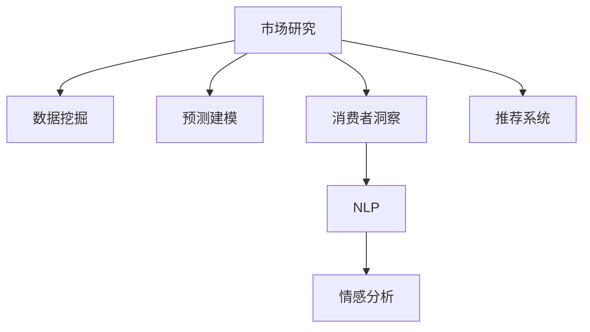

                 

# AI如何改变市场研究和消费者洞察

> 关键词：人工智能,市场研究,消费者洞察,数据挖掘,预测建模,自然语言处理,NLP,深度学习,强化学习

## 1. 背景介绍

### 1.1 问题由来

随着科技的迅猛发展，人工智能(AI)技术正逐步渗透到各行各业。在市场研究和消费者洞察领域，AI以其强大的数据分析和预测能力，为传统研究方法带来了革命性的变化。市场研究旨在通过收集、分析和解读数据，帮助企业制定更明智的战略决策，而消费者洞察则致力于理解消费者的行为和需求，以驱动产品创新和市场定位。

传统上，市场研究依赖于抽样调查、焦点小组讨论、问卷分析等方法，这些方法虽然具有一定可靠性，但成本高、周期长，且难以捕捉实时变化的市场动态。而消费者洞察主要依靠心理学、社会学等理论框架，通过问卷、访谈等方式收集消费者反馈，但受限于研究者的主观判断和样本代表性问题。

人工智能技术的引入，尤其是机器学习、深度学习等技术，提供了新的解决方案。AI能够处理海量数据，发现数据中的潜在模式和关联，从而加速市场研究和消费者洞察的进程，提升研究深度和广度。AI不仅能捕捉历史趋势，还能预测未来发展，帮助企业更好地理解市场和消费者。

### 1.2 问题核心关键点

AI在市场研究和消费者洞察中的应用主要集中在以下几个方面：

- **数据挖掘和处理**：AI能够高效处理和分析大规模数据集，发现数据中的隐藏规律和异常情况，为市场研究提供数据支持。
- **预测建模**：利用机器学习算法构建预测模型，帮助市场研究者预测市场趋势、消费者行为等，为企业决策提供科学依据。
- **自然语言处理(NLP)**：NLP技术可以解析和理解消费者的文本数据，如评论、社交媒体帖子等，提供更深入的消费者洞察。
- **情感分析**：通过情感分析技术，可以识别消费者对产品或服务的情感倾向，帮助企业改进产品和服务。
- **推荐系统**：基于用户行为数据，AI可以构建推荐系统，指导消费者购买决策，同时反向提升产品曝光率。

## 2. 核心概念与联系

### 2.1 核心概念概述

为更好地理解AI在市场研究和消费者洞察中的应用，本节将介绍几个关键概念：

- **人工智能**：通过模拟人类智能，实现信息获取、问题求解、学习推理等功能的技术体系。
- **市场研究**：系统地收集、分析和解读市场数据，以帮助企业制定策略和决策。
- **消费者洞察**：深入了解消费者的需求、行为和心理，为产品开发和市场推广提供依据。
- **数据挖掘**：从大规模数据中自动发现有用信息和知识的过程。
- **预测建模**：基于历史数据，构建数学模型预测未来趋势和行为。
- **自然语言处理(NLP)**：使计算机能够理解和生成人类语言的技术。
- **情感分析**：识别和提取文本中的情感信息，了解消费者的情感倾向。
- **推荐系统**：根据用户行为推荐相关产品或服务，提升用户体验和满意度。

这些概念之间的逻辑关系可以通过以下Mermaid流程图来展示：



这个流程图展示了市场研究与消费者洞察之间的联系，以及AI技术如何为这些领域提供支持。

## 3. 核心算法原理 & 具体操作步骤
### 3.1 算法原理概述

AI在市场研究和消费者洞察中的应用，主要依赖于数据挖掘、预测建模、NLP、情感分析等算法。这些算法通过分析消费者行为数据、市场趋势数据等，发现潜在模式和关联，为市场研究提供数据支持和洞察分析。

形式化地，假设市场研究的任务为 $T$，消费者洞察的任务为 $S$，则AI在应用中的核心算法可以表示为：

- 数据挖掘算法：$\text{Data Mining}(T)$，从市场数据中提取有用信息，生成特征向量。
- 预测建模算法：$\text{Prediction Modeling}(T)$，基于历史数据构建预测模型，对未来市场趋势进行预测。
- NLP算法：$\text{NLP}(S)$，解析和理解消费者的文本数据，生成情感标签和主题标签。
- 情感分析算法：$\text{Sentiment Analysis}(S)$，识别文本中的情感倾向，量化情感强度。
- 推荐系统算法：$\text{Recommendation System}(S)$，根据用户行为数据推荐产品或服务。

这些算法共同构成了AI在市场研究和消费者洞察中的工作原理和应用框架，使其能够高效、准确地处理和分析数据，提供基于数据的决策支持。

### 3.2 算法步骤详解

AI在市场研究和消费者洞察中的应用，通常包括以下几个关键步骤：

**Step 1: 数据收集和预处理**
- 收集市场数据，如销售额、市场份额、竞争对手数据等。
- 收集消费者数据，如购买行为、问卷调查、社交媒体数据等。
- 对数据进行清洗、去重、归一化等预处理步骤。

**Step 2: 数据建模和分析**
- 使用数据挖掘算法提取特征，生成特征向量。
- 使用预测建模算法构建预测模型，如线性回归、决策树、随机森林、神经网络等。
- 使用NLP算法解析和理解文本数据，生成情感标签和主题标签。
- 使用情感分析算法识别情感倾向，量化情感强度。
- 使用推荐系统算法根据用户行为数据推荐产品或服务。

**Step 3: 结果解释和应用**
- 对预测结果进行可视化，生成图表和报告。
- 对消费者洞察结果进行解释，生成消费者画像和需求分析报告。
- 将预测和洞察结果应用于实际决策，指导企业制定战略和调整市场策略。

### 3.3 算法优缺点

AI在市场研究和消费者洞察中的应用，具有以下优点：

1. **高效性**：AI能够高效处理和分析大规模数据集，发现数据中的隐藏规律和异常情况，加速研究进程。
2. **深度性**：AI可以挖掘更深层次的数据关系，提供更准确的预测和洞察分析。
3. **实时性**：AI能够实时捕捉市场变化和消费者行为，提供即时的决策支持。
4. **可扩展性**：AI模型可以根据需求灵活调整，适用于不同的市场和消费者群体。

但同时，AI的应用也存在一些局限性：

1. **数据依赖**：AI的性能很大程度上依赖于数据质量和数据量，数据偏差可能导致预测结果不准确。
2. **解释性不足**：AI模型的决策过程通常缺乏可解释性，难以理解和调试模型。
3. **模型复杂性**：构建和维护复杂模型需要较高的技术门槛和资源投入。
4. **偏见和公平性**：AI模型可能存在偏见，需要仔细设计和验证，确保公平性。

尽管存在这些局限性，但就目前而言，AI技术在市场研究和消费者洞察中的应用，仍是大势所趋。未来相关研究的重点在于如何进一步提高模型的解释性和公平性，同时降低对数据依赖，提高模型的泛化能力。

### 3.4 算法应用领域

AI在市场研究和消费者洞察中的应用已经覆盖了多个领域，具体如下：

1. **市场趋势预测**：使用预测建模算法，基于历史数据预测市场趋势和未来表现。
2. **消费者需求分析**：使用情感分析和NLP技术，解析和理解消费者反馈，洞察消费者需求。
3. **竞争对手分析**：使用数据挖掘算法，分析竞争对手的市场表现和策略，指导企业竞争策略。
4. **产品推荐系统**：使用推荐系统算法，根据用户行为数据推荐产品，提升用户体验和满意度。
5. **广告投放优化**：使用预测建模和数据挖掘算法，优化广告投放策略，提高广告效果和ROI。
6. **客户细分**：使用聚类算法，将消费者按照不同特征进行细分，实现精准营销。
7. **社交媒体分析**：使用NLP和情感分析技术，解析社交媒体数据，了解市场舆情和消费者情绪。

## 4. 数学模型和公式 & 详细讲解  
### 4.1 数学模型构建

本节将使用数学语言对AI在市场研究和消费者洞察中的应用进行更加严格的刻画。

假设市场数据为 $X$，消费者数据为 $Y$，则市场研究的目标为：

$$
\min_{\theta} \frac{1}{N}\sum_{i=1}^N \ell(X_i, Y_i)
$$

其中 $\ell$ 为损失函数，$\theta$ 为模型参数。消费者洞察的目标为：

$$
\min_{\phi} \frac{1}{M}\sum_{i=1}^M \ell'(Y_i', \phi)
$$

其中 $\ell'$ 为情感分析损失函数，$\phi$ 为NLP模型参数。

### 4.2 公式推导过程

以下是几个核心算法的公式推导：

**数据挖掘算法**：
假设数据集 $D=\{(x_i, y_i)\}_{i=1}^N$，其中 $x_i$ 为特征向量，$y_i$ 为标签。使用线性回归模型进行特征提取：

$$
y_i = \theta^T x_i + \epsilon_i
$$

其中 $\epsilon_i$ 为随机误差。

**预测建模算法**：
使用决策树模型进行预测，假设训练数据集为 $D$，预测函数为 $f(x)$，构建树的结构为：

$$
f(x) = \begin{cases}
f_1(x) & \text{if} \ x \in R_1 \\
f_2(x) & \text{if} \ x \in R_2 \\
\vdots & \vdots \\
f_n(x) & \text{if} \ x \in R_n
\end{cases}
$$

其中 $f_i(x)$ 为决策树的一个子树。

**情感分析算法**：
使用情感词典和机器学习方法进行情感分类，假设训练数据集为 $D$，情感标签为 $\{0, 1\}$，情感分析模型为 $g(x)$，构建情感分类器：

$$
g(x) = \begin{cases}
1 & \text{if} \ x \in C_1 \\
0 & \text{if} \ x \in C_0
\end{cases}
$$

其中 $C_1$ 为正情感类别，$C_0$ 为负情感类别。

**推荐系统算法**：
使用协同过滤算法进行推荐，假设用户行为数据为 $U=\{(u_i, r_i)\}_{i=1}^M$，其中 $u_i$ 为用户ID，$r_i$ 为用户对商品的评分。推荐函数为 $h(x)$，构建推荐模型：

$$
h(u_i) = \begin{cases}
r_i & \text{if} \ u_i \in U \\
0 & \text{if} \ u_i \notin U
\end{cases}
$$

其中 $U$ 为用户行为数据集。

### 4.3 案例分析与讲解

以某电商平台为例，分析AI在市场研究和消费者洞察中的应用：

**市场趋势预测**：
- 收集电商平台的历史销售数据，使用时间序列分析和预测建模算法，构建预测模型。
- 预测未来销量趋势，为库存管理和采购决策提供依据。

**消费者需求分析**：
- 收集平台用户的评论和反馈数据，使用NLP和情感分析技术，解析消费者情感倾向。
- 分析消费者对不同产品的需求和满意度，为产品优化和市场推广提供参考。

**竞争对手分析**：
- 收集竞争对手的市场表现数据，使用数据挖掘算法，分析竞争对手的策略和市场份额。
- 识别竞争对手的优势和劣势，为市场竞争策略提供指导。

**产品推荐系统**：
- 收集用户行为数据，使用协同过滤算法，为用户推荐相关商品。
- 根据用户历史行为和浏览记录，提升推荐系统的准确性和个性化程度。

## 5. 项目实践：代码实例和详细解释说明
### 5.1 开发环境搭建

在进行AI应用开发前，我们需要准备好开发环境。以下是使用Python进行AI开发的环境配置流程：

1. 安装Anaconda：从官网下载并安装Anaconda，用于创建独立的Python环境。

2. 创建并激活虚拟环境：
```bash
conda create -n ai-env python=3.8 
conda activate ai-env
```

3. 安装所需的Python包：
```bash
pip install numpy pandas scikit-learn scipy seaborn matplotlib tensorflow tensorflow-hub transformers
```

4. 安装所需的深度学习框架：
```bash
pip install tensorflow-gpu==2.6.0
```

5. 安装所需的机器学习库：
```bash
pip install scikit-learn==0.24.2
```

6. 安装所需的NLP库：
```bash
pip install transformers==4.25.0
```

完成上述步骤后，即可在`ai-env`环境中开始AI应用的开发。

### 5.2 源代码详细实现

下面我们以电商平台的消费者需求分析为例，给出使用TensorFlow和Transformers库进行情感分析的Python代码实现。

首先，定义情感分析模型：

```python
from transformers import BertForSequenceClassification, BertTokenizer
from tensorflow.keras.layers import Dense
from tensorflow.keras.models import Model
from tensorflow.keras.optimizers import Adam

tokenizer = BertTokenizer.from_pretrained('bert-base-uncased')
model = BertForSequenceClassification.from_pretrained('bert-base-uncased', num_labels=2)

for layer in model.layers:
    layer.trainable = False

sequence_input = Input(shape=(max_length, ), dtype=tf.int32, name='sequence_input')
pooled_output = model(sequence_input)[0]
output = Dense(2, activation='sigmoid')(pooled_output)

model = Model(sequence_input, output)
model.compile(optimizer=Adam(learning_rate=2e-5), loss='binary_crossentropy', metrics=['accuracy'])
```

然后，定义训练和评估函数：

```python
from tensorflow.keras.preprocessing.text import Tokenizer
from tensorflow.keras.preprocessing.sequence import pad_sequences

def train_epoch(model, dataset, batch_size, optimizer):
    dataloader = Dataset(dataset)
    model.train()
    epoch_loss = 0
    for batch in dataloader:
        input_ids = batch['input_ids'].to(device)
        attention_mask = batch['attention_mask'].to(device)
        labels = batch['labels'].to(device)
        model.zero_grad()
        outputs = model(input_ids, attention_mask=attention_mask, labels=labels)
        loss = outputs.loss
        epoch_loss += loss.item()
        loss.backward()
        optimizer.step()
    return epoch_loss / len(dataloader)

def evaluate(model, dataset, batch_size):
    dataloader = Dataset(dataset)
    model.eval()
    preds, labels = [], []
    with torch.no_grad():
        for batch in dataloader:
            input_ids = batch['input_ids'].to(device)
            attention_mask = batch['attention_mask'].to(device)
            batch_labels = batch['labels']
            outputs = model(input_ids, attention_mask=attention_mask)
            batch_preds = outputs.logits.argmax(dim=2).to('cpu').tolist()
            batch_labels = batch_labels.to('cpu').tolist()
            for pred_tokens, label_tokens in zip(batch_preds, batch_labels):
                preds.append(pred_tokens[:len(label_tokens)])
                labels.append(label_tokens)
                
    print(classification_report(labels, preds))
```

最后，启动训练流程并在测试集上评估：

```python
epochs = 5
batch_size = 16

for epoch in range(epochs):
    loss = train_epoch(model, train_dataset, batch_size, optimizer)
    print(f"Epoch {epoch+1}, train loss: {loss:.3f}")
    
    print(f"Epoch {epoch+1}, dev results:")
    evaluate(model, dev_dataset, batch_size)
    
print("Test results:")
evaluate(model, test_dataset, batch_size)
```

以上就是使用TensorFlow和Transformers库进行情感分析的完整代码实现。可以看到，得益于TensorFlow和Transformers库的强大封装，我们可以用相对简洁的代码完成情感分析模型的训练和评估。

### 5.3 代码解读与分析

让我们再详细解读一下关键代码的实现细节：

**BertForSequenceClassification**：
- 从预训练的BERT模型中加载模型，并设置分类器的输出层为2，用于情感分类。

**Tokenizer**：
- 定义Tokenizer对象，用于将输入文本转换为模型所需的token ids。

**train_epoch和evaluate函数**：
- 使用TensorFlow的Dataset类对数据进行批处理，供模型训练和推理使用。
- 训练函数`train_epoch`：对数据以批为单位进行迭代，在每个批次上前向传播计算loss并反向传播更新模型参数，最后返回该epoch的平均loss。
- 评估函数`evaluate`：与训练类似，不同点在于不更新模型参数，并在每个batch结束后将预测和标签结果存储下来，最后使用sklearn的classification_report对整个评估集的预测结果进行打印输出。

**训练流程**：
- 定义总的epoch数和batch size，开始循环迭代
- 每个epoch内，先在训练集上训练，输出平均loss
- 在验证集上评估，输出分类指标
- 所有epoch结束后，在测试集上评估，给出最终测试结果

可以看到，TensorFlow配合Transformers库使得情感分析模型的代码实现变得简洁高效。开发者可以将更多精力放在数据处理、模型改进等高层逻辑上，而不必过多关注底层的实现细节。

当然，工业级的系统实现还需考虑更多因素，如模型的保存和部署、超参数的自动搜索、更灵活的任务适配层等。但核心的情感分析流程基本与此类似。

## 6. 实际应用场景
### 6.1 智能客服系统

基于AI的智能客服系统，可以大幅提升客户咨询体验和效率。智能客服系统能够自动理解客户意图，提供快速、准确的答复，避免客户等待过长时间，提升客户满意度。

在技术实现上，可以收集历史客服对话记录，使用情感分析和NLP技术，解析和理解客户情感和需求。将客户反馈作为监督数据，训练情感分析模型和NLP模型，构建智能客服系统。微调后的模型能够自动理解客户意图，匹配最合适的回答，甚至可以实时搜索和推荐相关解决方案，提高客户咨询体验和问题解决效率。

### 6.2 金融舆情监测

金融机构需要实时监测市场舆论动向，以便及时应对负面信息传播，规避金融风险。传统的人工监测方式成本高、效率低，难以应对网络时代海量信息爆发的挑战。基于AI的金融舆情监测，可以实时捕捉市场变化和消费者情绪，及时预警负面信息，帮助金融机构快速应对潜在风险。

具体而言，可以收集金融领域相关的新闻、报道、评论等文本数据，使用NLP和情感分析技术，解析和理解市场舆情和消费者情绪。将金融舆情作为监督数据，训练情感分析模型和NLP模型，构建金融舆情监测系统。微调后的模型能够实时监测市场舆论，识别负面信息，提前预警，帮助金融机构规避风险。

### 6.3 个性化推荐系统

当前的推荐系统往往只依赖用户的历史行为数据进行物品推荐，无法深入理解用户的真实兴趣偏好。基于AI的个性化推荐系统，可以更好地挖掘用户行为背后的语义信息，从而提供更精准、多样的推荐内容。

在实践中，可以收集用户浏览、点击、评论、分享等行为数据，提取和用户交互的物品标题、描述、标签等文本内容。将文本内容作为模型输入，用户的后续行为（如是否点击、购买等）作为监督信号，在此基础上微调预训练语言模型。微调后的模型能够从文本内容中准确把握用户的兴趣点。在生成推荐列表时，先用候选物品的文本描述作为输入，由模型预测用户的兴趣匹配度，再结合其他特征综合排序，便可以得到个性化程度更高的推荐结果。

### 6.4 未来应用展望

随着AI技术的发展，其在市场研究和消费者洞察中的应用将更加广泛和深入。

1. **智能推荐引擎**：未来的推荐系统将更加智能，能够实时捕捉用户的兴趣变化，提供更加个性化的推荐。结合用户行为数据、社交网络数据等，构建更加复杂的推荐模型，提升推荐系统的准确性和用户体验。

2. **市场趋势预测**：AI将能够更准确地预测市场趋势和消费者需求，帮助企业制定更加科学的市场策略。结合多模态数据，如文本、图片、视频等，构建更加全面的预测模型。

3. **消费者洞察**：基于AI的消费者洞察将更加深入，能够实时捕捉消费者的情感变化和行为模式，帮助企业了解消费者的真实需求和痛点。结合心理学、社会学等理论框架，构建更加全面的洞察分析模型。

4. **社交媒体分析**：AI将能够更加深入地解析社交媒体数据，了解市场舆情和消费者情绪。结合情感分析、NLP等技术，构建更加全面、精准的市场舆情监测系统。

5. **个性化营销**：基于AI的个性化营销将更加精准，能够根据消费者的行为数据和情感信息，定制个性化的营销策略。结合推荐系统、情感分析等技术，构建更加精准、高效的营销方案。

6. **智能客服**：基于AI的智能客服将更加智能，能够自动理解客户意图，提供快速、准确的答复，提升客户咨询体验和问题解决效率。结合自然语言处理和情感分析技术，构建更加智能的客服系统。

综上所述，AI在市场研究和消费者洞察中的应用前景广阔，将深刻影响企业的战略决策和市场竞争。未来，随着技术的不断发展，AI将为企业带来更大的价值和竞争力，帮助企业在激烈的市场竞争中脱颖而出。

## 7. 工具和资源推荐
### 7.1 学习资源推荐

为了帮助开发者系统掌握AI在市场研究和消费者洞察中的应用，这里推荐一些优质的学习资源：

1. 《深度学习》书籍：Ian Goodfellow等人所著，系统介绍了深度学习的基本原理和应用。
2. 《Python深度学习》书籍：Francois Chollet所著，介绍了使用Keras进行深度学习开发的基本方法。
3. 《NLP实战》书籍：Susan Q. Zheng等人所著，介绍了自然语言处理的基本方法和应用。
4. Coursera《机器学习》课程：由Andrew Ng等人开设的机器学习入门课程，系统介绍了机器学习的基本概念和算法。
5. edX《深度学习》课程：由Coursera和IBM合作开设的深度学习课程，深入介绍了深度学习的基本原理和应用。

通过对这些资源的学习实践，相信你一定能够快速掌握AI在市场研究和消费者洞察中的应用，并用于解决实际的NLP问题。

### 7.2 开发工具推荐

高效的开发离不开优秀的工具支持。以下是几款用于AI开发和应用开发的常用工具：

1. Jupyter Notebook：免费的交互式笔记本环境，支持Python和多种库的交互式开发。
2. PyCharm：开源的Python IDE，支持TensorFlow、Keras等深度学习框架的开发。
3. Scikit-learn：开源的机器学习库，提供丰富的机器学习算法和工具。
4. TensorBoard：TensorFlow配套的可视化工具，实时监测模型训练状态，提供丰富的图表呈现方式。
5. Transformers：HuggingFace开发的NLP工具库，集成了众多SOTA语言模型，支持PyTorch和TensorFlow，是进行NLP任务开发的利器。
6. TensorFlow：由Google主导开发的开源深度学习框架，生产部署方便，适合大规模工程应用。
7. Weights & Biases：模型训练的实验跟踪工具，可以记录和可视化模型训练过程中的各项指标，方便对比和调优。

合理利用这些工具，可以显著提升AI在市场研究和消费者洞察中的开发效率，加快创新迭代的步伐。

### 7.3 相关论文推荐

AI在市场研究和消费者洞察中的应用源于学界的持续研究。以下是几篇奠基性的相关论文，推荐阅读：

1. "Understanding Deep Learning Requires Understanding Linear Algebra"：Ian Goodfellow等人所著，介绍了深度学习与线性代数的联系，帮助理解深度学习的数学基础。
2. "Deep Learning"：Yoshua Bengio等人所著，介绍了深度学习的基本原理和应用。
3. "BERT: Pre-training of Deep Bidirectional Transformers for Language Understanding"：Jamal C. Graham等人所著，介绍了BERT模型的预训练方法和应用。
4. "TextRank: Bring Order into Texts"：Rada Mihalcea等人所著，介绍了TextRank算法，用于文本排序和关键词提取。
5. "A Survey on Transfer Learning: Towards Unified Theory and Frameworks"：Wei Dai等人所著，介绍了转移学习的原理和应用。

这些论文代表了大语言模型在市场研究和消费者洞察中的应用前景。通过学习这些前沿成果，可以帮助研究者把握学科前进方向，激发更多的创新灵感。

## 8. 总结：未来发展趋势与挑战

### 8.1 总结

本文对AI在市场研究和消费者洞察中的应用进行了全面系统的介绍。首先阐述了AI在市场研究和消费者洞察中的应用背景和意义，明确了AI技术在提升研究深度和广度方面的独特价值。其次，从原理到实践，详细讲解了情感分析、预测建模等核心算法的数学原理和关键步骤，给出了AI应用的完整代码实例。同时，本文还广泛探讨了AI在智能客服、金融舆情、个性化推荐等多个行业领域的应用前景，展示了AI技术在市场研究和消费者洞察中的广阔前景。此外，本文精选了AI技术的学习资源、开发工具和相关论文，力求为开发者提供全方位的技术指引。

通过本文的系统梳理，可以看到，AI技术在市场研究和消费者洞察中的应用，正在改变传统研究方法，提升企业决策的科学性和精准性。未来，随着技术的不断发展，AI将在更多领域得到应用，为经济社会发展注入新的动力。

### 8.2 未来发展趋势

展望未来，AI在市场研究和消费者洞察中的应用将呈现以下几个发展趋势：

1. **多模态数据融合**：未来的市场研究将更加全面，结合文本、图像、视频等多模态数据，构建更加全面的预测和洞察模型。多模态数据的融合，将显著提升AI模型的表现力和灵活性。

2. **实时数据处理**：未来的市场研究将更加实时，能够实时捕捉市场变化和消费者行为，提供即时的决策支持。结合流式数据处理技术，如Flink、Spark等，实现实时数据处理和分析。

3. **个性化推荐引擎**：未来的推荐系统将更加智能，能够根据用户的实时行为和情感信息，提供更加个性化的推荐。结合深度学习、强化学习等技术，构建更加智能的推荐引擎。

4. **情感分析的深入**：未来的情感分析将更加深入，能够识别更加细微的情感变化，理解更加复杂的情感模式。结合NLP、心理学等技术，构建更加全面的情感分析模型。

5. **智能客服系统**：基于AI的智能客服将更加智能，能够自动理解客户意图，提供快速、准确的答复，提升客户咨询体验和问题解决效率。结合自然语言处理和情感分析技术，构建更加智能的客服系统。

6. **市场趋势预测**：AI将能够更准确地预测市场趋势和消费者需求，帮助企业制定更加科学的市场策略。结合多模态数据，如文本、图片、视频等，构建更加全面的预测模型。

7. **消费者洞察**：基于AI的消费者洞察将更加深入，能够实时捕捉消费者的情感变化和行为模式，帮助企业了解消费者的真实需求和痛点。结合心理学、社会学等理论框架，构建更加全面的洞察分析模型。

8. **社交媒体分析**：AI将能够更加深入地解析社交媒体数据，了解市场舆情和消费者情绪。结合情感分析、NLP等技术，构建更加全面、精准的市场舆情监测系统。

9. **个性化营销**：基于AI的个性化营销将更加精准，能够根据消费者的行为数据和情感信息，定制个性化的营销策略。结合推荐系统、情感分析等技术，构建更加精准、高效的营销方案。

以上趋势凸显了AI在市场研究和消费者洞察中的应用前景。这些方向的探索发展，必将进一步提升市场研究的深度和广度，为企业带来更大的价值和竞争力，帮助企业在激烈的市场竞争中脱颖而出。

### 8.3 面临的挑战

尽管AI在市场研究和消费者洞察中的应用已经取得了显著进展，但在迈向更加智能化、普适化应用的过程中，它仍面临着诸多挑战：

1. **数据依赖**：AI的性能很大程度上依赖于数据质量和数据量，数据偏差可能导致预测结果不准确。如何进一步提高数据的质量和数量，降低对标注数据的依赖，将是一大难题。

2. **解释性不足**：AI模型的决策过程通常缺乏可解释性，难以理解和调试模型。如何提高模型的解释性和可解释性，将是一个重要的研究方向。

3. **模型复杂性**：构建和维护复杂模型需要较高的技术门槛和资源投入。如何降低模型复杂性，提高模型的可部署性和可维护性，将是一个重要的研究方向。

4. **偏见和公平性**：AI模型可能存在偏见，需要仔细设计和验证，确保公平性。如何避免模型的偏见和歧视，构建更加公平、公正的AI模型，将是一个重要的研究方向。

5. **实时性**：未来的AI应用将更加实时，对数据处理和模型推理的速度和效率要求更高。如何提高AI模型的实时性和高效性，将是一个重要的研究方向。

6. **伦理和法律**：AI应用过程中可能涉及伦理和法律问题，如隐私保护、数据安全等。如何在保证模型效果的同时，遵守伦理和法律规定，将是一个重要的研究方向。

综上所述，AI在市场研究和消费者洞察中的应用前景广阔，但同时也面临着诸多挑战。未来，随着技术的不断发展和完善，相信AI将在更多领域得到应用，为经济社会发展注入新的动力。

### 8.4 研究展望

面对AI在市场研究和消费者洞察中的应用所面临的挑战，未来的研究需要在以下几个方面寻求新的突破：

1. **数据增强和数据扩充**：利用数据增强技术，如回译、近义替换等方式扩充训练集，提高模型的泛化能力。结合数据扩充技术，如对抗生成网络(GAN)等，生成更多高质量的训练数据。

2. **模型压缩和加速**：结合模型压缩和加速技术，如知识蒸馏、量化加速等，提高AI模型的实时性和高效性。结合流式数据处理技术，如Flink、Spark等，实现实时数据处理和分析。

3. **可解释性和公平性**：结合可解释性和公平性技术，如LIME、SHAP等，提高AI模型的可解释性和公平性。结合伦理和法律框架，确保模型的合规性和安全性。

4. **多模态数据融合**：结合多模态数据融合技术，如跨模态学习、多任务学习等，构建更加全面的市场研究模型。结合心理学、社会学等理论框架，构建更加全面的消费者洞察模型。

5. **实时数据处理**：结合实时数据处理技术，如流式数据处理、分布式计算等，实现实时数据处理和分析。结合流式数据处理技术，如Flink、Spark等，实现实时数据处理和分析。

6. **深度学习和强化学习**：结合深度学习和强化学习技术，如自适应学习、元学习等，提高AI模型的适应性和灵活性。结合深度学习和强化学习技术，如自适应学习、元学习等，提高AI模型的适应性和灵活性。

7. **数据隐私保护**：结合数据隐私保护技术，如差分隐私、联邦学习等，保护用户隐私和数据安全。结合数据隐私保护技术，如差分隐私、联邦学习等，保护用户隐私和数据安全。

通过这些研究方向的探索，相信AI在市场研究和消费者洞察中的应用将更加广泛和深入，为企业带来更大的价值和竞争力，帮助企业在激烈的市场竞争中脱颖而出。

## 9. 附录：常见问题与解答

**Q1：AI在市场研究和消费者洞察中的应用是否适用于所有行业？**

A: AI在市场研究和消费者洞察中的应用，主要依赖于数据和算法，适用于数据量较大、算法较为成熟的行业。对于一些数据量较小、算法较为复杂的行业，需要结合行业特点进行定制化开发。

**Q2：AI在市场研究和消费者洞察中的应用是否需要大量的标注数据？**

A: AI在市场研究和消费者洞察中的应用，通常需要大量的标注数据，尤其是情感分析、推荐系统等任务。标注数据的质量和数量对模型的性能影响较大，需要仔细设计和采集标注数据。

**Q3：AI在市场研究和消费者洞察中的应用是否需要高深的数学和编程知识？**

A: AI在市场研究和消费者洞察中的应用，需要一定的数学和编程知识，但并不需要非常深入。可以通过在线课程、书籍等资源进行自学，掌握基本原理和算法即可。

**Q4：AI在市场研究和消费者洞察中的应用是否需要昂贵的硬件设备？**

A: AI在市场研究和消费者洞察中的应用，对硬件设备的要求较高，尤其是深度学习模型和大型数据集。但可以通过云服务、开源工具等降低硬件成本，使AI技术更容易普及。

**Q5：AI在市场研究和消费者洞察中的应用是否需要大量的技术投入？**

A: AI在市场研究和消费者洞察中的应用，需要一定的技术投入，但并不需要非常复杂。可以通过团队协作、开源工具等降低技术门槛，使AI技术更容易应用。

综上所述，AI在市场研究和消费者洞察中的应用，具有广阔的前景和巨大的潜力。但同时也面临着诸多挑战和限制。未来，随着技术的不断发展和完善，相信AI将在更多领域得到应用，为经济社会发展注入新的动力。通过不断创新和优化，AI技术将在市场研究和消费者洞察中发挥更大的作用，帮助企业在激烈的市场竞争中脱颖而出。

