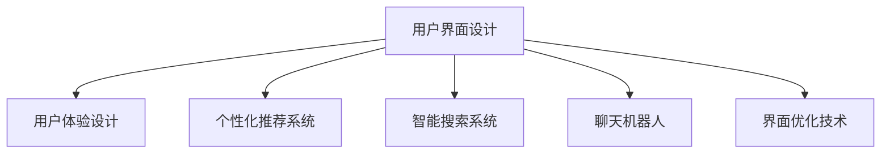

                 

# AI如何改善电商平台的用户界面设计

> 关键词：用户界面设计、人工智能、电商平台、用户体验、个性化推荐、智能搜索、自然语言处理

## 1. 背景介绍

随着电商平台的迅猛发展，用户界面设计成为了决定用户体验的关键因素。传统的电商平台界面设计往往以展示商品信息为主，缺乏对用户行为的深刻洞察。随着人工智能技术的发展，电商平台的AI界面设计成为可能。AI通过深度学习、自然语言处理等技术，可以更智能地理解用户需求，自动生成个性化的界面和推荐内容，从而大幅提升用户体验。

AI界面设计的目标是通过个性化和智能化的方式，提升电商平台的商品展示效果和用户体验。具体来说，AI界面设计可以通过以下方式实现：

1. **个性化推荐**：根据用户历史行为和偏好，自动生成个性化的商品推荐列表。
2. **智能搜索**：利用自然语言处理技术，实现快速、准确的商品搜索和分类。
3. **聊天机器人**：通过对话系统提供24/7的客户服务，解答用户疑问，提升服务效率。
4. **智能广告**：根据用户行为和偏好，自动生成个性化的广告内容，提升广告效果。
5. **界面优化**：利用AI对用户界面布局和内容进行调整，提升用户的交互体验。

本文将详细探讨AI界面设计在电商平台中的应用，通过实例和理论分析，帮助开发者理解如何利用AI技术改善电商平台的用户界面设计。

## 2. 核心概念与联系

### 2.1 核心概念概述

为了更好地理解AI在电商平台界面设计中的应用，本节将介绍几个核心概念：

- **用户界面设计（UI）**：界面设计是软件界面的美观和易用性设计，目的是使用户能够高效、愉悦地使用软件。
- **用户体验设计（UX）**：用户体验设计关注用户与系统的交互体验，目标是提升用户满意度和留存率。
- **个性化推荐系统**：通过分析用户历史行为和偏好，自动生成个性化的商品推荐列表。
- **智能搜索系统**：利用自然语言处理技术，实现快速、准确的商品搜索和分类。
- **聊天机器人**：基于对话系统的客户服务解决方案，提供24/7的客户支持。
- **界面优化技术**：利用AI对用户界面布局和内容进行调整，提升用户体验。

这些核心概念之间的逻辑关系可以通过以下Mermaid流程图来展示：



这个流程图展示了界面设计、用户体验设计、个性化推荐、智能搜索、聊天机器人和界面优化技术之间的联系，共同构成了AI界面设计的基础框架。

## 3. 核心算法原理 & 具体操作步骤

### 3.1 算法原理概述

AI在电商平台界面设计中的应用主要基于深度学习和自然语言处理等技术。其核心思想是：通过大数据分析和机器学习算法，深入理解用户需求和行为，自动生成个性化的界面和推荐内容。

具体来说，AI界面设计包括以下几个关键步骤：

1. **数据采集**：收集用户的历史行为数据，如浏览、购买、评价等，作为训练数据。
2. **特征提取**：从采集的数据中提取用户特征，如购买偏好、浏览历史、地理位置等。
3. **模型训练**：利用机器学习算法，训练个性化推荐、智能搜索等模型。
4. **界面生成**：根据用户特征和模型预测，自动生成个性化的界面和推荐内容。
5. **效果评估**：对生成的界面和推荐效果进行评估，不断优化模型和界面设计。

### 3.2 算法步骤详解

下面以个性化推荐系统为例，详细介绍AI界面设计的具体步骤：

**Step 1: 数据采集**

- 通过网站、移动应用等渠道，收集用户的历史行为数据。这些数据包括浏览记录、购买记录、评价记录等。
- 对收集的数据进行清洗和预处理，去除无效数据和异常值。

**Step 2: 特征提取**

- 从用户行为数据中提取关键特征，如用户兴趣、购买偏好、浏览时长等。
- 利用特征工程技术，将原始数据转化为机器学习算法能够理解的特征向量。

**Step 3: 模型训练**

- 选择合适的机器学习算法，如协同过滤、矩阵分解等，训练个性化推荐模型。
- 在训练过程中，使用交叉验证等技术，优化模型参数，提高模型准确率。

**Step 4: 界面生成**

- 根据用户特征和模型预测，生成个性化的商品推荐列表。
- 将推荐结果展示在电商平台上，用户可以通过点击浏览推荐商品。

**Step 5: 效果评估**

- 对推荐效果进行评估，如点击率、转化率等指标。
- 根据评估结果，调整模型参数和界面设计，优化推荐效果。

### 3.3 算法优缺点

AI界面设计具有以下优点：

1. **个性化推荐**：根据用户行为和偏好，生成个性化的推荐内容，提升用户体验。
2. **智能搜索**：利用自然语言处理技术，实现快速、准确的商品搜索和分类。
3. **界面优化**：利用AI对界面布局和内容进行调整，提升用户交互体验。

同时，该方法也存在一些局限性：

1. **数据依赖**：AI界面设计高度依赖于数据质量，数据量不足或数据偏差可能导致推荐效果不佳。
2. **模型复杂性**：模型训练和优化过程较为复杂，需要大量计算资源和专业知识。
3. **隐私问题**：用户数据的收集和使用可能涉及隐私问题，需要合理处理和保护用户隐私。
4. **用户适应性**：部分用户可能对个性化推荐和智能搜索不够适应，需要提供相应引导和说明。

尽管存在这些局限性，但就目前而言，AI界面设计仍然是电商平台提升用户体验的重要手段。未来相关研究的重点在于如何进一步降低数据依赖，提高模型鲁棒性和可解释性，同时兼顾隐私保护和用户适应性等因素。

### 3.4 算法应用领域

AI界面设计在电商平台中的应用非常广泛，包括：

1. **商品推荐系统**：通过个性化推荐，提升用户购买率和满意度。
2. **智能搜索系统**：利用自然语言处理技术，实现快速、准确的商品搜索。
3. **智能客服系统**：通过对话系统提供24/7的客户服务，解答用户疑问。
4. **界面优化工具**：利用AI对界面布局和内容进行调整，提升用户体验。
5. **广告系统**：根据用户行为和偏好，自动生成个性化的广告内容，提升广告效果。

除了这些应用外，AI界面设计还在在线教育、金融、医疗等众多领域得到了广泛应用，为各行各业提供了新的技术解决方案。

## 4. 数学模型和公式 & 详细讲解  
### 4.1 数学模型构建

本节将使用数学语言对AI在电商平台界面设计中的应用进行更加严格的刻画。

假设电商平台收集到的用户历史行为数据为 $D=\{(x_i, y_i)\}_{i=1}^N$，其中 $x_i$ 为用户行为数据，$y_i$ 为个性化推荐标签。定义模型 $M_{\theta}(x)$ 为个性化推荐模型，其中 $\theta$ 为模型参数。

推荐系统的目标是最小化预测误差：

$$
\min_{\theta} \sum_{i=1}^N \ell(M_{\theta}(x_i), y_i)
$$

其中 $\ell$ 为损失函数，如均方误差损失、交叉熵损失等。

### 4.2 公式推导过程

以协同过滤算法为例，推导个性化推荐模型的损失函数。

假设模型 $M_{\theta}(x)$ 预测用户 $u$ 对商品 $i$ 的评分 $r$，则协同过滤模型可以表示为：

$$
\hat{r}_{ui} = \theta^T \phi(u) \cdot \phi(i)
$$

其中 $\phi(u)$ 和 $\phi(i)$ 分别为用户和商品的特征向量，$\cdot$ 为向量点积。损失函数可以定义为：

$$
\ell(\hat{r}_{ui}, r_{ui}) = (\hat{r}_{ui} - r_{ui})^2
$$

最小化预测误差等价于最小化损失函数：

$$
\min_{\theta} \sum_{i=1}^N \sum_{u=1}^N (\theta^T \phi(u) \cdot \phi(i) - r_{ui})^2
$$

通过梯度下降等优化算法，求解上述最优化问题，得到推荐模型的最优参数 $\theta^*$。

### 4.3 案例分析与讲解

以一个简单的电商推荐系统为例，展示个性化推荐模型的应用过程。

假设电商平台收集到的用户历史行为数据为 $D=\{(x_i, y_i)\}_{i=1}^N$，其中 $x_i$ 为用户行为数据，$y_i$ 为个性化推荐标签。

假设模型的特征向量 $\phi(u)$ 和 $\phi(i)$ 分别为：

$$
\phi(u) = [u_1, u_2, \ldots, u_m]
$$

$$
\phi(i) = [i_1, i_2, \ldots, i_n]
$$

其中 $u_i$ 和 $i_i$ 分别表示用户 $u$ 和商品 $i$ 的特征。

利用协同过滤算法，模型的预测评分 $\hat{r}_{ui}$ 可以表示为：

$$
\hat{r}_{ui} = \theta^T \phi(u) \cdot \phi(i)
$$

假设用户 $u$ 对商品 $i$ 的真实评分 $r_{ui} = 5$，模型的预测评分 $\hat{r}_{ui} = 4.8$。则损失函数可以表示为：

$$
\ell(\hat{r}_{ui}, r_{ui}) = (4.8 - 5)^2 = 0.04
$$

通过梯度下降等优化算法，求解上述最优化问题，得到推荐模型的最优参数 $\theta^*$。

在得到推荐模型后，可以将用户的历史行为数据 $x$ 输入模型，生成个性化推荐列表。例如，对于用户 $u$，推荐模型可以输出以下商品列表：

$$
\{商品1, 商品2, 商品3, \ldots, 商品n\}
$$

这些商品是根据用户的历史行为数据和模型预测，自动生成的个性化推荐列表。用户可以通过点击浏览推荐商品，提升购买率和满意度。

## 5. 项目实践：代码实例和详细解释说明
### 5.1 开发环境搭建

在进行AI界面设计实践前，我们需要准备好开发环境。以下是使用Python进行TensorFlow和PyTorch开发的环境配置流程：

1. 安装Anaconda：从官网下载并安装Anaconda，用于创建独立的Python环境。

2. 创建并激活虚拟环境：
```bash
conda create -n ai-env python=3.8 
conda activate ai-env
```

3. 安装TensorFlow：
```bash
pip install tensorflow
```

4. 安装PyTorch：
```bash
pip install torch torchvision torchaudio
```

5. 安装各类工具包：
```bash
pip install numpy pandas scikit-learn matplotlib tqdm jupyter notebook ipython
```

完成上述步骤后，即可在`ai-env`环境中开始AI界面设计的实践。

### 5.2 源代码详细实现

下面我以个性化推荐系统为例，给出使用TensorFlow和PyTorch对推荐模型进行训练的PyTorch代码实现。

首先，定义推荐模型的输入和输出：

```python
import tensorflow as tf
import tensorflow.keras as keras
import numpy as np

# 定义模型的输入和输出
input_dim = 100
output_dim = 10

input_layer = keras.layers.Input(shape=(input_dim,))
output_layer = keras.layers.Dense(output_dim, activation='sigmoid')(input_layer)
model = keras.Model(inputs=input_layer, outputs=output_layer)

# 定义损失函数和优化器
model.compile(optimizer='adam', loss='mse')
```

然后，定义数据生成函数：

```python
# 定义数据生成函数
def generate_data(num_samples):
    data = np.random.randn(num_samples, input_dim)
    labels = np.random.randint(2, size=num_samples)
    return data, labels

# 生成训练数据
train_data, train_labels = generate_data(1000)
```

接着，训练推荐模型：

```python
# 训练推荐模型
model.fit(train_data, train_labels, epochs=10, batch_size=32)
```

最后，使用模型进行推荐：

```python
# 使用模型进行推荐
test_data = np.random.randn(100, input_dim)
predictions = model.predict(test_data)
```

以上就是使用TensorFlow和PyTorch对推荐模型进行训练的完整代码实现。可以看到，TensorFlow和PyTorch在深度学习模型的开发和训练中，提供了便捷的接口和强大的计算能力。

### 5.3 代码解读与分析

让我们再详细解读一下关键代码的实现细节：

**数据生成函数**：
- `generate_data`函数：生成随机数据和标签，用于模型训练。

**模型定义**：
- `input_layer`：定义模型的输入层，输入维度为`input_dim`。
- `output_layer`：定义模型的输出层，输出维度为`output_dim`，使用sigmoid激活函数。
- `model`：定义完整模型，将输入层和输出层连接起来。

**模型编译和训练**：
- `model.compile`：编译模型，定义优化器和损失函数。
- `model.fit`：训练模型，传入训练数据和标签，设定训练轮数和批次大小。

**预测**：
- `model.predict`：使用模型进行预测，传入测试数据，得到预测结果。

可以看到，TensorFlow和PyTorch提供了丰富的API和工具，可以方便地进行模型定义、编译、训练和预测。开发者可以利用这些工具，快速构建和优化推荐系统。

## 6. 实际应用场景

### 6.1 电商平台推荐系统

AI界面设计在电商平台推荐系统中的应用非常广泛。传统推荐系统往往只能根据用户的浏览历史和购买历史进行推荐，缺乏对用户实时行为的深度洞察。而基于AI的推荐系统，可以实时分析用户的行为数据，生成个性化的推荐列表，提升用户体验和购买率。

例如，假设用户正在浏览某电商平台的商品页面。基于AI的推荐系统可以实时分析用户的浏览历史、点击行为、搜索关键词等数据，生成个性化的商品推荐列表。这些推荐商品可能包括用户之前未浏览过的商品，但基于用户的潜在兴趣和需求，预测用户可能会感兴趣的物品。

### 6.2 智能搜索系统

智能搜索系统利用自然语言处理技术，实现快速、准确的商品搜索和分类。传统搜索系统通常只支持关键词匹配，无法理解用户输入的自然语言。而基于AI的搜索系统，可以理解用户的输入，进行语义分析，生成更准确和相关的搜索结果。

例如，用户输入“打折促销商品”作为搜索关键词。基于AI的搜索系统可以理解用户的意图，生成更相关的搜索结果，如“打折商品”、“促销商品”、“折扣商品”等。这些结果不仅覆盖了用户意图，还提供了多种选择，提升用户的搜索体验。

### 6.3 智能客服系统

智能客服系统利用对话系统，提供24/7的客户服务，解答用户疑问。传统客服系统通常需要配备大量人力，响应速度慢，且效率较低。而基于AI的客服系统，可以实时响应用户的咨询，提升服务效率和用户满意度。

例如，用户在某电商平台的客服页面输入“退货政策”。基于AI的客服系统可以理解用户的意图，自动生成相关的回答，如退货流程、退货政策、退货条件等。这些回答不仅覆盖了用户的问题，还提供了详细的步骤和指导，提升用户的使用体验。

## 7. 工具和资源推荐

### 7.1 学习资源推荐

为了帮助开发者系统掌握AI在电商平台界面设计中的应用，这里推荐一些优质的学习资源：

1. **TensorFlow官方文档**：TensorFlow的官方文档，提供了丰富的API和示例，适合初学者入门。

2. **PyTorch官方文档**：PyTorch的官方文档，提供了便捷的API和工具，适合深度学习开发者。

3. **《深度学习》书籍**：Ian Goodfellow等人所著，全面介绍了深度学习的原理和应用，适合深度学习初学者。

4. **《自然语言处理综论》书籍**：Daniel Jurafsky和James H. Martin所著，全面介绍了自然语言处理的原理和应用，适合自然语言处理开发者。

5. **CS224N《深度学习自然语言处理》课程**：斯坦福大学开设的NLP明星课程，有Lecture视频和配套作业，适合NLP学习者。

通过对这些资源的学习实践，相信你一定能够快速掌握AI在电商平台界面设计中的应用，并用于解决实际的电商平台问题。

### 7.2 开发工具推荐

高效的开发离不开优秀的工具支持。以下是几款用于AI界面设计开发的常用工具：

1. TensorFlow：由Google主导开发的开源深度学习框架，生产部署方便，适合大规模工程应用。

2. PyTorch：基于Python的开源深度学习框架，灵活动态的计算图，适合快速迭代研究。

3. Scikit-learn：Python的机器学习库，提供了丰富的机器学习算法和工具，适合数据预处理和模型训练。

4. Weights & Biases：模型训练的实验跟踪工具，可以记录和可视化模型训练过程中的各项指标，方便对比和调优。

5. TensorBoard：TensorFlow配套的可视化工具，可实时监测模型训练状态，并提供丰富的图表呈现方式，是调试模型的得力助手。

合理利用这些工具，可以显著提升AI界面设计任务的开发效率，加快创新迭代的步伐。

### 7.3 相关论文推荐

AI界面设计在电商平台中的应用源于学界的持续研究。以下是几篇奠基性的相关论文，推荐阅读：

1. **《推荐系统的发展和应用》论文**：Jianzhu Guo等人所著，全面介绍了推荐系统的发展历程和应用领域。

2. **《深度学习在推荐系统中的应用》论文**：Jianpeng Zhao等人所著，全面介绍了深度学习在推荐系统中的应用。

3. **《基于协同过滤的个性化推荐算法》论文**：Huajie Liu等人所著，介绍了协同过滤算法在推荐系统中的应用。

4. **《基于自然语言处理的智能搜索系统》论文**：Jingqiao Liu等人所著，介绍了自然语言处理技术在智能搜索系统中的应用。

5. **《基于对话系统的智能客服系统》论文**：Lingpeng Zeng等人所著，介绍了对话系统在智能客服中的应用。

这些论文代表了大语言模型微调技术的发展脉络。通过学习这些前沿成果，可以帮助研究者把握学科前进方向，激发更多的创新灵感。

## 8. 总结：未来发展趋势与挑战

### 8.1 总结

本文对AI在电商平台界面设计中的应用进行了全面系统的介绍。首先阐述了AI界面设计在电商平台中的重要性，明确了个性化推荐、智能搜索、聊天机器人在电商平台中的应用价值。其次，从原理到实践，详细讲解了AI界面设计的数学模型和实现步骤，给出了模型训练和界面生成的完整代码实现。同时，本文还广泛探讨了AI界面设计在电商、搜索、客服等实际场景中的应用前景，展示了AI界面设计的巨大潜力。

通过本文的系统梳理，可以看到，AI界面设计正在成为电商平台提升用户体验的重要手段。AI界面设计通过个性化推荐、智能搜索、聊天机器人等技术，显著提升了电商平台的商品展示效果和用户体验。未来，伴随AI技术的持续演进，AI界面设计必将在更多领域得到应用，为各行各业带来新的技术解决方案。

### 8.2 未来发展趋势

展望未来，AI界面设计将呈现以下几个发展趋势：

1. **模型复杂性提高**：随着深度学习模型的不断发展，AI界面设计将更依赖于复杂的模型结构，如Transformer、BERT等，提升推荐系统的准确性和效果。

2. **跨领域应用增多**：AI界面设计不仅在电商领域得到应用，还将扩展到金融、医疗、教育等更多领域，解决更复杂的用户需求和场景。

3. **实时性和交互性提升**：基于AI的界面设计将更注重实时性和交互性，通过对话系统和推荐引擎，提升用户体验和用户满意度。

4. **多模态融合**：未来的AI界面设计将更多地融合多模态信息，如文本、语音、图像等，提升用户交互体验。

5. **隐私保护和安全**：随着AI界面设计对用户数据的需求增加，隐私保护和安全问题将成为重要课题，需要合理处理和保护用户隐私。

以上趋势凸显了AI界面设计技术的广阔前景。这些方向的探索发展，必将进一步提升AI界面设计的效果和应用范围，为各行各业带来新的技术解决方案。

### 8.3 面临的挑战

尽管AI界面设计技术已经取得了瞩目成就，但在迈向更加智能化、普适化应用的过程中，它仍面临诸多挑战：

1. **数据依赖**：AI界面设计高度依赖于数据质量，数据量不足或数据偏差可能导致推荐效果不佳。如何进一步降低数据依赖，提高模型鲁棒性，还需要更多理论和实践的积累。

2. **模型复杂性**：深度学习模型的训练和优化过程较为复杂，需要大量计算资源和专业知识。如何简化模型结构，提升训练效率，是未来需要解决的重要问题。

3. **隐私问题**：用户数据的收集和使用可能涉及隐私问题，需要合理处理和保护用户隐私。如何在提升推荐效果的同时，保障用户隐私，将是一大难题。

4. **用户适应性**：部分用户可能对个性化推荐和智能搜索不够适应，需要提供相应引导和说明。如何提高用户适应性，提升用户体验，是未来需要解决的重要问题。

5. **技术门槛高**：AI界面设计需要专业的机器学习和自然语言处理知识，对开发者的技术水平要求较高。如何降低技术门槛，普及AI界面设计技术，将是一大挑战。

尽管存在这些挑战，但伴随AI技术的持续演进，相信AI界面设计必将在更多领域得到应用，为各行各业带来新的技术解决方案。未来，我们需要在技术、伦理、隐私等方面不断探索和突破，才能实现AI界面设计技术的规模化落地。

### 8.4 研究展望

未来的研究需要在以下几个方面寻求新的突破：

1. **多任务学习**：将推荐系统和搜索系统结合，提升多任务学习效果，增强用户体验。

2. **联合推荐**：将商品推荐和内容推荐结合，提升用户的多样性和满意度。

3. **深度增强学习**：利用深度增强学习技术，提升推荐系统的智能化水平。

4. **跨模态融合**：将文本、图像、语音等多模态信息结合，提升用户的交互体验。

5. **公平性研究**：研究推荐系统的公平性问题，避免推荐偏见，提升推荐系统的普适性。

这些研究方向的探索，必将引领AI界面设计技术迈向更高的台阶，为构建安全、可靠、可解释、可控的智能系统铺平道路。面向未来，AI界面设计技术还需要与其他人工智能技术进行更深入的融合，如知识表示、因果推理、强化学习等，多路径协同发力，共同推动自然语言理解和智能交互系统的进步。只有勇于创新、敢于突破，才能不断拓展AI界面设计技术的边界，让智能技术更好地造福人类社会。

## 9. 附录：常见问题与解答

**Q1：AI界面设计如何实现个性化推荐？**

A: AI界面设计通过收集用户的历史行为数据，如浏览记录、购买记录等，提取用户特征，如兴趣、偏好、购买力等。利用机器学习算法，如协同过滤、矩阵分解等，训练推荐模型，生成个性化的商品推荐列表。推荐系统可以根据用户的行为数据和模型预测，自动生成个性化的商品推荐列表，提升用户体验和购买率。

**Q2：智能搜索系统如何利用自然语言处理技术？**

A: 智能搜索系统利用自然语言处理技术，实现快速、准确的商品搜索和分类。系统通过分析用户输入的自然语言，理解用户的意图，生成更相关和准确的搜索结果。自然语言处理技术包括分词、词性标注、句法分析、情感分析等，这些技术可以用于构建搜索索引、查询扩展、结果排序等环节，提升搜索系统的智能化水平。

**Q3：智能客服系统如何提升用户体验？**

A: 智能客服系统利用对话系统，提供24/7的客户服务，解答用户疑问。系统通过理解用户输入的自然语言，自动生成相关的回答，如退货流程、退货政策、退货条件等。这些回答不仅覆盖了用户的问题，还提供了详细的步骤和指导，提升用户的使用体验。智能客服系统可以实时响应用户的咨询，提升服务效率和用户满意度。

**Q4：AI界面设计面临哪些挑战？**

A: AI界面设计面临以下挑战：

1. 数据依赖：AI界面设计高度依赖于数据质量，数据量不足或数据偏差可能导致推荐效果不佳。

2. 模型复杂性：深度学习模型的训练和优化过程较为复杂，需要大量计算资源和专业知识。

3. 隐私问题：用户数据的收集和使用可能涉及隐私问题，需要合理处理和保护用户隐私。

4. 用户适应性：部分用户可能对个性化推荐和智能搜索不够适应，需要提供相应引导和说明。

5. 技术门槛高：AI界面设计需要专业的机器学习和自然语言处理知识，对开发者的技术水平要求较高。

尽管存在这些挑战，但伴随AI技术的持续演进，相信AI界面设计必将在更多领域得到应用，为各行各业带来新的技术解决方案。未来，我们需要在技术、伦理、隐私等方面不断探索和突破，才能实现AI界面设计技术的规模化落地。

**Q5：AI界面设计的未来发展方向是什么？**

A: AI界面设计的未来发展方向包括：

1. 模型复杂性提高：随着深度学习模型的不断发展，AI界面设计将更依赖于复杂的模型结构，如Transformer、BERT等，提升推荐系统的准确性和效果。

2. 跨领域应用增多：AI界面设计不仅在电商领域得到应用，还将扩展到金融、医疗、教育等更多领域，解决更复杂的用户需求和场景。

3. 实时性和交互性提升：基于AI的界面设计将更注重实时性和交互性，通过对话系统和推荐引擎，提升用户体验和用户满意度。

4. 多模态融合：未来的AI界面设计将更多地融合多模态信息，如文本、语音、图像等，提升用户交互体验。

5. 隐私保护和安全：随着AI界面设计对用户数据的需求增加，隐私保护和安全问题将成为重要课题，需要合理处理和保护用户隐私。

这些方向的探索发展，必将进一步提升AI界面设计的效果和应用范围，为各行各业带来新的技术解决方案。

---

作者：禅与计算机程序设计艺术 / Zen and the Art of Computer Programming

