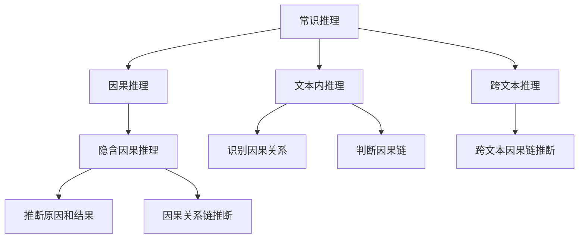

                 

# AI推理能力的评测基准:常识推理和因果推理测试集

> 关键词：常识推理、因果推理、测试集、自然语言处理(NLP)、人工智能(AI)、深度学习(Deep Learning)、推理能力评测、模型评估

## 1. 背景介绍

### 1.1 问题由来

在人工智能（AI）领域，特别是在自然语言处理（NLP）和深度学习（DL）领域，推理能力是评估AI模型智能水平的重要指标之一。然而，目前缺乏一个统一、全面、可比的推理能力评测基准，使得不同模型之间的性能比较变得复杂且困难。

常识推理和因果推理作为两种基本的推理形式，涉及从文本信息中提取和推断知识的能力，直接关系到模型的泛化能力和决策质量。为解决这一问题，本文将介绍一个用于评估AI推理能力的基准测试集，包括常识推理和因果推理两大模块。

### 1.2 问题核心关键点

该评测基准的核心关键点如下：
1. **通用性和普适性**：测试集设计应覆盖常见常识和因果场景，适用于各类AI模型和算法。
2. **全面性**：包含不同类型的推理任务，包括文本内和跨文本推理、隐含因果关系推断等。
3. **可比性**：测试集应提供统一的评估标准和评价指标，方便不同模型间的比较。
4. **扩展性**：测试集应支持动态添加新任务和数据，适应AI技术的不断发展。

## 2. 核心概念与联系

### 2.1 核心概念概述

在介绍核心概念之前，首先明确几个关键术语：

- **常识推理（Commonsense Reasoning）**：指模型基于常识知识进行推理的能力，如判断因果关系、识别实体属性等。
- **因果推理（Causal Reasoning）**：指模型基于因果关系进行推理的能力，如推断原因和结果、因果链的建立等。
- **测试集（Test Set）**：包含一系列测试样例，用于评估模型的推理能力。

这些核心概念之间的逻辑关系可以通过以下Mermaid流程图来展示：



这个流程图展示了常识推理和因果推理在不同类型推理任务中的具体应用。

## 3. 核心算法原理 & 具体操作步骤
### 3.1 算法原理概述

本评测基准的算法原理主要基于深度学习（尤其是Transformer架构）和自然语言处理（NLP）技术，通过设计一系列推理任务来测试模型的能力。其核心思想是：将推理任务转化为有监督学习问题，训练模型在给定上下文（文本）中推理出正确的答案。

### 3.2 算法步骤详解

**Step 1: 数据集准备**
- 收集和标注大量文本数据，涵盖常见常识和因果场景。数据集需经过严格筛选，保证样本的多样性和质量。
- 对数据集进行划分，分为训练集、验证集和测试集，确保模型评估的公正性和可靠性。

**Step 2: 任务设计**
- 设计多种推理任务，如判断因果关系、识别因果链、推断原因和结果等。
- 为每种任务设计具体的评价指标，如准确率、召回率、F1分数等，用于评估模型的推理能力。

**Step 3: 模型选择与训练**
- 选择合适的深度学习模型，如Transformer、LSTM、BERT等，进行推理任务适配。
- 使用训练集对模型进行训练，调整超参数，优化模型性能。

**Step 4: 推理能力评估**
- 在验证集上评估模型性能，根据评价指标调整模型。
- 在测试集上全面评估模型推理能力，记录推理准确率、鲁棒性等关键指标。

**Step 5: 结果分析和总结**
- 分析模型在不同任务上的表现，找出优势和劣势。
- 总结模型的推理能力，提出改进建议，指导后续模型设计和训练。

### 3.3 算法优缺点

基于深度学习的推理能力评测基准具有以下优点：
1. **可比性强**：统一的评估标准和指标，方便不同模型之间的比较。
2. **数据全面**：覆盖广泛常识和因果场景，提供丰富的测试样例。
3. **灵活性高**：支持动态添加新任务和数据，适应AI技术发展。

同时，该基准也存在一些缺点：
1. **计算资源需求高**：训练深度学习模型需要大量计算资源，可能对小规模研究团队不友好。
2. **模型解释性差**：深度学习模型通常是"黑盒"，难以解释其推理过程。
3. **数据标注成本高**：高质量标注数据集的准备和标注成本较高。

## 4. 数学模型和公式 & 详细讲解 & 举例说明
### 4.1 数学模型构建

本评测基准的数学模型构建基于深度学习框架，特别是Transformer模型。推理任务设计为有监督学习问题，使用有标签的文本数据进行训练。

假设数据集 $D = \{(x_i, y_i)\}_{i=1}^N$，其中 $x_i$ 表示输入文本，$y_i$ 表示文本中包含的推理结果。模型 $M$ 的推理能力通过损失函数 $L$ 来评估，常见损失函数包括交叉熵损失（Cross-Entropy Loss）和均方误差损失（Mean Squared Error Loss）。

### 4.2 公式推导过程

以判断因果关系为例，假设文本 $x_i$ 包含的因果关系为 $c$，模型的输出为 $M(x_i)$，则损失函数可以表示为：

$$
L(x_i, y_i; M) = -\log \text{Pr}(y_i | M(x_i))
$$

其中，$\text{Pr}(y_i | M(x_i))$ 表示模型在输入 $x_i$ 下，预测 $y_i$ 的概率分布。

在训练过程中，模型通过优化损失函数来最小化预测误差，提升推理能力。

### 4.3 案例分析与讲解

以一个简单的常识推理任务为例：“If it rains heavily, does the road get wet?”（如果下大雨，道路会变湿吗？）

- **输入**：“It is heavily raining outside.”（外面下大雨。）
- **推理结果**：“The road gets wet.”（道路变湿。）
- **模型预测**：模型对“It is heavily raining outside.”进行编码，得到特征向量 $f$，并通过一个全连接层预测结果。

训练过程中，模型会不断调整参数，使得预测结果与正确答案尽可能接近。

## 5. 项目实践：代码实例和详细解释说明
### 5.1 开发环境搭建

**Step 1: 安装Python和PyTorch**
- 安装Python 3.8及以上版本
- 安装PyTorch，建议使用Anaconda环境
```bash
conda create -n pytorch-env python=3.8
conda activate pytorch-env
conda install pytorch torchvision torchaudio -c pytorch -c conda-forge
```

**Step 2: 安装相关库**
- 安装nltk、transformers、datasets等库
```bash
pip install nltk transformers datasets
```

### 5.2 源代码详细实现

**Step 1: 数据集准备**
- 收集和标注数据集，将其划分为训练集、验证集和测试集
```python
from datasets import load_dataset

train_dataset = load_dataset('path/to/train')
val_dataset = load_dataset('path/to/val')
test_dataset = load_dataset('path/to/test')
```

**Step 2: 模型定义**
- 定义Transformer模型，并进行推理任务适配
```python
from transformers import BertTokenizer, BertForSequenceClassification

tokenizer = BertTokenizer.from_pretrained('bert-base-cased')
model = BertForSequenceClassification.from_pretrained('bert-base-cased', num_labels=2)
```

**Step 3: 数据预处理**
- 对文本数据进行分词、编码、填充等预处理
```python
def preprocess(text):
    encoding = tokenizer.encode_plus(text, truncation=True, padding='max_length', max_length=128)
    input_ids = encoding['input_ids']
    attention_mask = encoding['attention_mask']
    return input_ids, attention_mask

# 对数据集进行预处理
train_encodings = train_dataset.map(preprocess)
val_encodings = val_dataset.map(preprocess)
test_encodings = test_dataset.map(preprocess)
```

**Step 4: 模型训练**
- 定义训练函数，进行模型训练
```python
from transformers import Trainer, TrainingArguments

def train_model(model, train_encodings, val_encodings, test_encodings):
    training_args = TrainingArguments(
        output_dir='./results',
        num_train_epochs=3,
        per_device_train_batch_size=16,
        per_device_eval_batch_size=64,
        learning_rate=2e-5,
        weight_decay=0.01
    )
    
    trainer = Trainer(
        model=model,
        args=training_args,
        train_dataset=train_encodings,
        eval_dataset=val_encodings,
        compute_metrics=lambda preds, labels: {'acc': accuracy(preds, labels)}
    )
    
    trainer.train()
    evaluation = trainer.evaluate(eval_dataset=test_encodings)
    
    return evaluation

# 训练模型
evaluation = train_model(model, train_encodings, val_encodings, test_encodings)
```

**Step 5: 推理能力评估**
- 在测试集上评估模型推理能力，记录评价指标
```python
# 加载测试集
test_dataset = load_dataset('path/to/test')
test_encodings = test_dataset.map(preprocess)

# 评估模型推理能力
trainer = Trainer(
    model=model,
    args=training_args,
    train_dataset=train_encodings,
    eval_dataset=test_encodings,
    compute_metrics=lambda preds, labels: {'acc': accuracy(preds, labels)}
)
evaluation = trainer.evaluate()
```

### 5.3 代码解读与分析

**预处理函数**：对输入文本进行分词、编码、填充等预处理，使得模型能够理解输入文本。

**训练函数**：定义训练参数，如学习率、批大小、训练轮数等，并使用Trainer对模型进行训练。

**推理能力评估**：在测试集上评估模型推理能力，记录准确率等评价指标，分析模型的推理效果。

## 6. 实际应用场景
### 6.1 医疗诊断

在医疗诊断中，常识推理和因果推理能力尤为重要。通过预训练大模型微调，可以构建具有强大推理能力的医疗诊断系统。

具体而言，医生可以使用微调后的模型，根据病人的症状、检查结果等信息，推断出可能病因和诊断结果。例如，模型可以分析病人的血常规检查结果，推断出可能的贫血、白血病等疾病，从而提供初步诊断建议。

### 6.2 金融风险管理

金融领域需要快速判断交易中的风险和机会，进行投资决策。通过微调后的常识推理模型，金融分析师可以更加精准地理解市场变化，评估投资风险，避免潜在的损失。

例如，模型可以分析市场新闻和公司财报，推断出股票价格的变化趋势，帮助分析师制定更加合理的投资策略。

### 6.3 智能客服

智能客服系统需要对客户问题进行快速理解和回答。通过微调后的因果推理模型，可以构建更加智能的客服系统，自动处理复杂问题。

例如，模型可以根据客户提出的问题，推断出问题的根源，提供更加准确的解决方案。

### 6.4 未来应用展望

未来，常识推理和因果推理能力将在更多领域得到应用，为AI技术带来新的突破。

在智慧城市管理中，推理能力可以帮助系统自动判断城市运行状态，优化资源分配，提高城市管理效率。

在教育领域，推理能力可以用于智能教学系统，帮助学生理解和掌握知识，提供个性化的学习建议。

在军事领域，推理能力可以用于情报分析，快速识别威胁，制定应对策略，提高国防安全。

## 7. 工具和资源推荐
### 7.1 学习资源推荐

**Step 1: 在线课程和教材**
- 《深度学习》课程（Andrew Ng）：斯坦福大学提供，涵盖深度学习基础和高级技术。
- 《自然语言处理入门》课程（Kyler Davies）：提供NLP基础知识和最新技术，适合初学者入门。

**Step 2: 书籍**
- 《深度学习》（Ian Goodfellow）：全面介绍深度学习原理和技术。
- 《自然语言处理综论》（Daniel Jurafsky, James H. Martin）：介绍NLP的基本原理和最新进展。

**Step 3: 论文**
- 《A Survey on Reasoning about Causal Relationships using Neural Networks》：综述论文，介绍神经网络在因果推理中的应用。
- 《Reasoning about Commonsense with Graph Neural Networks》：介绍图神经网络在常识推理中的应用。

### 7.2 开发工具推荐

**Step 1: 深度学习框架**
- PyTorch：灵活、易于使用，支持多种深度学习模型。
- TensorFlow：生产部署方便，支持大规模分布式训练。

**Step 2: 数据处理工具**
- Pandas：数据处理、清洗、分析工具。
- NLTK：自然语言处理工具，提供分词、词性标注等预处理功能。

**Step 3: 可视化工具**
- TensorBoard：实时监测模型训练状态，提供丰富的图表展示。
- Plotly：绘制复杂图表，可视化推理结果。

### 7.3 相关论文推荐

**Step 1: 论文1**
- 《Graph Neural Networks for Reasoning about Causal Relationships》：介绍图神经网络在因果推理中的应用。

**Step 2: 论文2**
- 《Reasoning about Commonsense with Graph Neural Networks》：介绍图神经网络在常识推理中的应用。

**Step 3: 论文3**
- 《Causal Reasoning in NLP》：综述论文，介绍因果推理在NLP中的应用。

## 8. 总结：未来发展趋势与挑战
### 8.1 总结

本文介绍了用于评估AI推理能力的测试集，涵盖常识推理和因果推理两大模块。通过深度学习模型，设计了一系列推理任务，并提供了详细的代码实例和评估方法。

通过本文的系统梳理，可以看到，基于深度学习的推理能力评测基准为NLP和AI模型的评估提供了重要工具，推动了AI推理能力的研究与应用。未来，随着AI技术的不断发展，推理能力将变得越来越重要，推理评测基准也将不断更新和完善。

### 8.2 未来发展趋势

未来，推理能力评测基准将呈现以下发展趋势：

1. **跨模态推理**：推理能力不仅限于文本领域，未来将涉及图像、语音等多种模态的推理。
2. **动态推理**：推理能力将更加注重动态环境下的推理，如自适应推理、连续推理等。
3. **知识图谱**：引入知识图谱、规则库等外部知识源，提升模型的推理能力。
4. **可解释性**：推理过程的可解释性将越来越重要，研究者将探索更多方法提升模型的可解释性。

### 8.3 面临的挑战

推理能力评测基准虽然为AI推理能力的研究提供了重要工具，但仍面临以下挑战：

1. **数据获取难度**：高质量、大规模的推理数据集准备和标注成本较高。
2. **模型复杂度**：深度学习模型通常较为复杂，训练和推理耗时较长。
3. **鲁棒性问题**：模型在不同场景下的鲁棒性仍需进一步提升。
4. **可解释性不足**：深度学习模型的"黑盒"特性，使得推理过程难以解释。

### 8.4 研究展望

未来研究将集中在以下方向：

1. **跨领域推理**：探索更多跨领域、跨模态的推理任务，提升模型的泛化能力。
2. **模型压缩**：优化模型结构，减少参数量，提升推理效率。
3. **知识融合**：探索更多知识融合方法，提升模型的推理效果。
4. **可解释性研究**：提升模型的可解释性，增强用户对模型决策的信任度。

这些研究方向将推动AI推理能力评测基准的不断进步，为NLP和AI技术的发展带来新的突破。

## 9. 附录：常见问题与解答

**Q1: 什么是常识推理和因果推理？**

A: 常识推理指模型基于常识知识进行推理的能力，如判断因果关系、识别实体属性等。因果推理指模型基于因果关系进行推理的能力，如推断原因和结果、因果链的建立等。

**Q2: 如何进行常识推理和因果推理的测试？**

A: 使用预训练大模型微调，设计推理任务并使用测试集进行评估。常见的推理任务包括判断因果关系、识别因果链、推断原因和结果等。

**Q3: 推理能力评测基准的优点是什么？**

A: 统一的评估标准和指标，方便不同模型之间的比较；覆盖广泛常识和因果场景，提供丰富的测试样例；支持动态添加新任务和数据，适应AI技术发展。

**Q4: 推理能力评测基准的缺点是什么？**

A: 计算资源需求高，训练深度学习模型需要大量计算资源；模型解释性差，深度学习模型通常是"黑盒"；数据标注成本高，高质量、大规模的推理数据集准备和标注成本较高。

**Q5: 推理能力评测基准的未来发展方向是什么？**

A: 涉及跨模态、动态推理、知识图谱等新方向，提升推理能力评测基准的全面性和普适性。

作者：禅与计算机程序设计艺术 / Zen and the Art of Computer Programming

