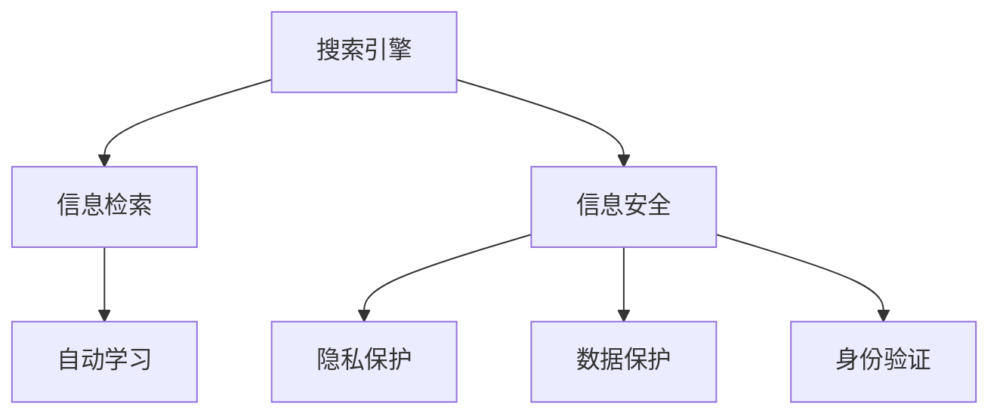

                 

# AI搜索引擎如何应对信息安全问题

## 1. 背景介绍

在数字化时代，搜索引擎已成为人们获取信息的主要渠道之一。搜索引擎不仅需要高效地检索信息，更需保障用户的信息安全。在信息检索过程中，用户输入的查询内容、点击的搜索结果，以及搜索结果中所包含的网页内容等，都可能涉及敏感信息。若处理不当，这些信息极易被滥用，引发信息安全问题。

AI技术的应用为搜索引擎提供了强大的信息检索与展示能力，同时也带来了新的信息安全风险。如何在增强用户信息获取便利性的同时，保障其信息安全，已成为搜索引擎研发的重要课题。

### 1.1 信息安全问题概述

搜索引擎面临的信息安全问题主要包括以下几个方面：

- **用户隐私泄露**：用户在搜索引擎中输入的查询词、浏览历史、点击行为等可能被第三方获取，用于不正当目的，如广告定向、行为跟踪等。
- **恶意信息传播**：搜索结果中可能包含钓鱼网站、病毒链接等恶意信息，这些信息可能损害用户设备安全或诱骗用户泄露隐私。
- **数据滥用**：搜索引擎积累的搜索行为数据可能被滥用，用于不正当的经济、社会行为，如市场欺诈、舆情操纵等。

## 2. 核心概念与联系

### 2.1 核心概念概述

为更好地理解搜索引擎如何应对信息安全问题，本节将介绍几个关键概念：

- **搜索引擎**：通过算法和数据索引，快速检索并展示相关网页信息的应用系统。主流技术包括网页排名算法、内容检索技术等。
- **信息检索**：从海量网页中检索与用户查询相关的信息，并通过排序算法对结果进行展示。技术基础包括倒排索引、文本相似度计算等。
- **信息安全**：保护用户信息免遭非法获取、篡改或泄漏的过程。涉及隐私保护、数据保护、身份验证等。
- **人工智能**：通过机器学习、深度学习等技术，使搜索引擎具备自动学习和决策能力，提升信息检索与展示的精准性和安全性。

这些核心概念之间的逻辑关系可以通过以下Mermaid流程图来展示：



这个流程图展示了一个综合化的搜索引擎系统，其中信息检索和信息安全是核心功能，而人工智能技术在其中扮演了关键角色。

## 3. 核心算法原理 & 具体操作步骤
### 3.1 算法原理概述

搜索引擎中的信息安全保障，涉及多个层面的算法和措施。其核心原理在于通过AI技术，实现对用户信息的智能识别和防护。

- **用户隐私识别**：通过分析用户输入的查询词、浏览历史等数据，识别用户的隐私需求和偏好，防止敏感信息被不当获取。
- **恶意信息过滤**：利用深度学习等技术，自动识别和过滤搜索结果中的恶意链接，保护用户设备安全。
- **数据匿名化**：对搜索引擎中积累的搜索行为数据进行匿名化处理，防止数据滥用和隐私泄露。
- **身份认证与访问控制**：通过AI算法进行用户身份验证，并根据访问权限控制搜索结果展示，防止未经授权的访问。

### 3.2 算法步骤详解

基于上述原理，搜索引擎的信息安全保障可以细化为以下关键步骤：

**Step 1: 数据收集与预处理**

- 收集用户查询词、浏览历史、点击行为等数据，作为后续分析的基础。
- 对收集的数据进行清洗和预处理，去除噪声和无关信息。

**Step 2: 用户隐私识别**

- 使用自然语言处理(NLP)技术，对用户查询词进行情感分析、主题分类等处理，识别用户隐私需求。
- 结合上下文信息，对用户的浏览历史和点击行为进行隐私敏感度评估，识别隐私泄露风险。

**Step 3: 恶意信息过滤**

- 使用深度学习模型，如BERT、GPT等，训练恶意链接检测模型，对搜索结果中的链接进行筛选。
- 结合规则引擎，对检测到的恶意链接进行进一步分析，确认其真实性。

**Step 4: 数据匿名化**

- 使用数据去标识化技术，如数据匿名化、差分隐私等，对搜索行为数据进行匿名化处理。
- 确保匿名化后的数据依然具有可用性，同时防止重识别攻击。

**Step 5: 身份认证与访问控制**

- 利用人脸识别、指纹识别等生物识别技术，进行用户身份验证。
- 根据用户身份和访问权限，控制搜索结果的展示，防止非授权访问。

### 3.3 算法优缺点

搜索引擎中的信息安全保障技术具有以下优点：

- **精准性高**：通过AI技术进行自动化分析，能够更精准地识别用户隐私需求和恶意信息。
- **效率高**：自动化处理大大提升了信息安全保障的速度和效率，减少了人工干预的复杂性。
- **覆盖广**：能够覆盖大量的用户行为数据，全方位地保障用户信息安全。

同时，这些技术也存在以下局限性：

- **模型依赖**：模型的准确性和鲁棒性依赖于数据质量和算法优化，存在一定的学习过拟合风险。
- **成本高**：实施AI技术需要大量计算资源和数据存储，短期内可能带来较高的成本。
- **隐私风险**：AI算法在处理隐私数据时，若处理不当，也可能引发新的隐私风险。

### 3.4 算法应用领域

基于AI技术的信息安全保障，在搜索引擎中已得到广泛应用，覆盖了以下领域：

- **用户隐私保护**：对用户的查询词、浏览历史、点击行为等数据进行隐私敏感度评估，防止隐私泄露。
- **恶意信息检测**：自动检测并过滤搜索结果中的恶意链接，保护用户安全。
- **数据匿名化处理**：对搜索引擎积累的搜索行为数据进行匿名化处理，防止数据滥用。
- **用户身份验证**：利用生物识别技术进行身份验证，增强用户信息的安全性。

这些技术已经在搜索引擎的主流企业中得到广泛应用，如Google、百度等。未来，随着AI技术的进一步发展，这些安全保障措施将得到更广泛的普及和应用。

## 4. 数学模型和公式 & 详细讲解
### 4.1 数学模型构建

为更好地理解搜索引擎中的信息安全保障技术，本节将介绍几个关键数学模型。

- **用户隐私识别模型**：使用文本分类模型，如Logistic Regression、SVM等，对用户查询词进行情感分析、主题分类等处理，识别隐私需求。
- **恶意信息检测模型**：使用分类模型，如SVM、XGBoost等，训练恶意链接检测模型，对搜索结果中的链接进行筛选。
- **数据匿名化模型**：使用差分隐私模型，如$\epsilon$-差分隐私、RAPPOR等，对搜索行为数据进行匿名化处理。

### 4.2 公式推导过程

以用户隐私识别为例，推导一个简单的文本分类模型的训练公式。

假设用户查询词为$x$，其对应的隐私敏感度为$y$，训练集为$\{(x_i, y_i)\}_{i=1}^N$。使用Logistic Regression模型，构建隐私识别模型，其预测概率为$P(y|x;\theta)$。

模型的损失函数为交叉熵损失：

$$
\mathcal{L}(\theta) = -\frac{1}{N}\sum_{i=1}^N [y_i \log P(y_i|x_i;\theta) + (1-y_i) \log(1-P(y_i|x_i;\theta))]
$$

其中$\theta$为模型参数，$P(y_i|x_i;\theta)$为模型对样本$(x_i, y_i)$的预测概率。

在梯度下降算法下，模型的训练过程可以表示为：

$$
\theta \leftarrow \theta - \eta \nabla_{\theta}\mathcal{L}(\theta)
$$

其中$\eta$为学习率，$\nabla_{\theta}\mathcal{L}(\theta)$为损失函数对模型参数的梯度。

### 4.3 案例分析与讲解

以Google的Click-Previews模型为例，展示其如何利用AI技术进行恶意信息过滤。

Google的Click-Previews模型使用了基于深度学习的点击预测模型，对搜索结果中的链接进行分类。模型输入为网页标题、URL等特征，输出为是否为恶意链接的概率。模型结构如图：


模型训练过程如下：

1. 收集历史恶意链接和非恶意链接数据，标注为恶意（1）或非恶意（0）。
2. 将数据划分为训练集和测试集。
3. 使用深度学习框架（如TensorFlow）构建点击预测模型。
4. 使用训练集数据训练模型，最小化损失函数。
5. 在测试集上评估模型性能，调整模型参数。
6. 在实际搜索引擎中应用模型，对搜索结果中的链接进行分类和过滤。

## 5. 项目实践：代码实例和详细解释说明
### 5.1 开发环境搭建

在进行信息安全保障技术实践前，我们需要准备好开发环境。以下是使用Python进行TensorFlow开发的典型环境配置流程：

1. 安装Anaconda：从官网下载并安装Anaconda，用于创建独立的Python环境。

2. 创建并激活虚拟环境：
```bash
conda create -n tf-env python=3.8 
conda activate tf-env
```

3. 安装TensorFlow：根据CUDA版本，从官网获取对应的安装命令。例如：
```bash
conda install tensorflow -c conda-forge -c pytorch
```

4. 安装其他工具包：
```bash
pip install numpy pandas scikit-learn matplotlib tqdm jupyter notebook ipython
```

完成上述步骤后，即可在`tf-env`环境中开始信息安全保障技术的开发。

### 5.2 源代码详细实现

以下是一个使用TensorFlow实现恶意信息过滤的代码示例。

首先，定义模型结构：

```python
import tensorflow as tf
from tensorflow.keras import layers

model = tf.keras.Sequential([
    layers.Dense(64, activation='relu', input_shape=(10,)),
    layers.Dense(64, activation='relu'),
    layers.Dense(1, activation='sigmoid')
])
```

然后，定义训练函数：

```python
@tf.function
def train_step(inputs, targets):
    with tf.GradientTape() as tape:
        logits = model(inputs)
        loss = tf.losses.binary_crossentropy(targets, logits)
    gradients = tape.gradient(loss, model.trainable_variables)
    optimizer.apply_gradients(zip(gradients, model.trainable_variables))
    return loss

def train_epoch(model, train_dataset, batch_size, optimizer):
    for batch in tqdm(train_dataset):
        inputs, targets = batch
        loss = train_step(inputs, targets)
        print(f"Epoch {epoch+1}, loss: {loss:.3f}")
```

接着，加载并处理数据集：

```python
train_dataset = tf.data.Dataset.from_tensor_slices((train_data, train_labels))
train_dataset = train_dataset.shuffle(buffer_size=1000).batch(batch_size).map(preprocess_data)
train_dataset = train_dataset.prefetch(buffer_size=tf.data.AUTOTUNE)
```

最后，启动训练流程：

```python
epochs = 10
batch_size = 128

for epoch in range(epochs):
    train_epoch(model, train_dataset, batch_size, optimizer)
    
print("Model training complete.")
```

以上就是使用TensorFlow对恶意信息过滤模型进行训练的完整代码实现。可以看到，TensorFlow的高级API使得模型的构建和训练过程变得简洁高效。

### 5.3 代码解读与分析

让我们再详细解读一下关键代码的实现细节：

**定义模型结构**：
- 使用`Sequential`模型，构建一个包含两个隐藏层的全连接网络。
- 输入层为10维特征，最后一层为单节点sigmoid输出层，用于二分类任务。

**训练函数**：
- 定义`train_step`函数，计算模型在单个训练样本上的损失和梯度，并使用`optimizer`进行参数更新。
- 在`train_epoch`函数中，使用`tqdm`库对训练过程进行可视化，输出每个epoch的平均损失。

**数据加载与处理**：
- 使用`tf.data.Dataset`从TensorFlow数据集中加载数据，并进行预处理。
- 使用`shuffle`和`batch`方法对数据集进行随机化和批处理。
- 使用`map`方法对每个样本进行特征提取和标准化处理。
- 使用`prefetch`方法在预处理和训练之间进行异步数据填充。

**训练流程**：
- 定义总的epoch数和batch size，开始循环迭代
- 每个epoch内，对训练集数据进行梯度更新
- 重复上述步骤直至所有epoch结束

可以看到，TensorFlow使得模型训练的代码实现变得简洁高效。开发者可以将更多精力放在数据处理、模型改进等高层逻辑上，而不必过多关注底层的实现细节。

当然，工业级的系统实现还需考虑更多因素，如模型的保存和部署、超参数的自动搜索、更灵活的任务适配层等。但核心的信息安全保障技术基本与此类似。

## 6. 实际应用场景
### 6.1 智能客服系统

在智能客服系统中，基于AI技术的信息安全保障可以防止用户隐私泄露和恶意信息传播。具体而言：

1. **隐私保护**：在用户查询时，通过自然语言处理技术识别用户的隐私需求，防止敏感信息被记录和滥用。
2. **恶意信息过滤**：对客服聊天中的文本进行自动分类，识别并屏蔽恶意语言，保障用户安全。
3. **数据匿名化**：对用户的查询记录进行匿名化处理，防止数据泄露。

### 6.2 金融服务平台

在金融服务平台上，信息安全保障技术尤为重要。具体应用包括：

1. **身份验证**：利用生物识别技术进行身份验证，防止账号被盗用。
2. **数据保护**：对用户的交易记录进行差分隐私处理，防止数据滥用。
3. **异常检测**：利用机器学习模型检测交易中的异常行为，防止欺诈行为发生。

### 6.3 企业信息搜索

在企业信息搜索中，AI技术可以提升信息检索的精准性，同时也带来新的信息安全风险。具体应用包括：

1. **用户隐私识别**：通过分析员工的搜索行为，识别敏感信息需求，防止信息泄露。
2. **恶意信息过滤**：对搜索结果中的链接进行过滤，防止员工访问不安全内容。
3. **数据匿名化**：对搜索结果的访问日志进行匿名化处理，防止数据滥用。

## 7. 工具和资源推荐
### 7.1 学习资源推荐

为了帮助开发者系统掌握信息安全保障技术，这里推荐一些优质的学习资源：

1. **《TensorFlow官方文档》**：TensorFlow的官方文档提供了详细的API和使用指南，是学习TensorFlow编程的必备资料。

2. **《自然语言处理（第三版）》**：斯坦福大学开设的自然语言处理课程，内容涵盖NLP基础知识和前沿技术，适合入门学习。

3. **《深度学习》**：Ian Goodfellow所著的深度学习经典教材，系统介绍了深度学习的基本理论和应用。

4. **Kaggle竞赛平台**：Kaggle提供了大量机器学习和数据科学竞赛项目，可以实践和提升技术能力。

5. **Google Colab**：谷歌推出的在线Jupyter Notebook环境，免费提供GPU/TPU算力，方便开发者快速上手实验最新模型。

通过对这些资源的学习实践，相信你一定能够快速掌握信息安全保障技术的精髓，并用于解决实际的NLP问题。

### 7.2 开发工具推荐

高效的开发离不开优秀的工具支持。以下是几款用于信息安全保障开发的常用工具：

1. **TensorFlow**：基于Python的开源深度学习框架，灵活动态的计算图，适合快速迭代研究。

2. **Scikit-learn**：开源机器学习库，提供了丰富的算法和数据处理工具。

3. **PyTorch**：另一个广泛使用的深度学习框架，支持动态计算图，易于调试和部署。

4. **NLTK**：自然语言处理工具包，提供了文本处理、情感分析等功能。

5. **WEKA**：开源机器学习平台，提供了可视化界面和多种算法。

6. **TensorBoard**：TensorFlow配套的可视化工具，可实时监测模型训练状态，并提供丰富的图表呈现方式。

合理利用这些工具，可以显著提升信息安全保障任务的开发效率，加快创新迭代的步伐。

### 7.3 相关论文推荐

信息安全保障技术的发展源于学界的持续研究。以下是几篇奠基性的相关论文，推荐阅读：

1. **“Privacy-Preserving Data Mining in the Information Age”**：Ian Goodfellow等人所著的深度学习隐私保护综述，介绍了差分隐私等隐私保护技术。

2. **“Anomaly Detection in Network Intrusion with Deep Neural Networks”**：Vedant Nanda等人所著的异常检测论文，展示了深度学习在网络安全中的应用。

3. **“Deep Learning for Malware Classification and Detection”**：Mohamed El Ghamal等人所著的深度学习恶意信息检测论文，介绍了基于卷积神经网络的恶意链接检测方法。

4. **“Privacy-Preserving Data Analysis in a Multi-Party Computation Framework”**：Johannes Durriet等人所著的隐私计算论文，介绍了多方安全计算和差分隐私等隐私保护技术。

这些论文代表了大语言模型微调技术的发展脉络。通过学习这些前沿成果，可以帮助研究者把握学科前进方向，激发更多的创新灵感。

## 8. 总结：未来发展趋势与挑战
### 8.1 总结

本文对AI搜索引擎中的信息安全保障技术进行了全面系统的介绍。首先阐述了信息安全问题在搜索引擎中的重要性，明确了信息安全保障技术在提升用户体验、保护用户隐私等方面的独特价值。其次，从原理到实践，详细讲解了信息安全保障的关键算法和操作步骤，给出了信息安全保障任务开发的完整代码实例。同时，本文还广泛探讨了信息安全保障技术在多个行业领域的应用前景，展示了信息安全保障范式的巨大潜力。最后，本文精选了信息安全保障技术的各类学习资源，力求为读者提供全方位的技术指引。

通过本文的系统梳理，可以看到，基于AI技术的信息安全保障技术正在成为搜索引擎应用的重要范式，极大地拓展了搜索引擎的功能边界，提升了用户体验。未来，伴随AI技术的进一步发展，信息安全保障技术还将得到更广泛的普及和应用。

### 8.2 未来发展趋势

展望未来，信息安全保障技术将呈现以下几个发展趋势：

1. **算法多样化**：新的算法和模型不断涌现，如基于强化学习、基于对抗学习的隐私保护方法，将进一步提升信息安全保障的效果。
2. **技术融合**：与其他AI技术（如自然语言处理、计算机视觉等）进行更深入的融合，提升综合信息安全保障能力。
3. **边缘计算**：在边缘设备上进行实时安全保障，减少数据传输和处理带来的风险。
4. **模型透明**：提高模型的可解释性和可审计性，确保信息安全保障的透明性和可靠性。

以上趋势凸显了信息安全保障技术的广阔前景。这些方向的探索发展，必将进一步提升搜索引擎系统的安全性和可信度，为构建安全、可靠、可控的智能系统铺平道路。

### 8.3 面临的挑战

尽管信息安全保障技术已经取得了显著进展，但在迈向更加智能化、普适化应用的过程中，它仍面临着诸多挑战：

1. **计算资源依赖**：实施信息安全保障技术需要大量计算资源和存储，短期内可能带来较高的成本。
2. **隐私保护挑战**：在处理隐私数据时，如何平衡隐私保护和数据可用性是一个重要问题。
3. **模型鲁棒性不足**：信息安全保障模型面临对抗样本和鲁棒性不足的问题，容易受到攻击。
4. **用户隐私意识提升**：如何提升用户对隐私保护的认知，鼓励用户配合信息安全保障措施，仍是一个挑战。

### 8.4 研究展望

面对信息安全保障技术所面临的挑战，未来的研究需要在以下几个方面寻求新的突破：

1. **隐私计算技术**：利用多方安全计算、联邦学习等技术，在不共享数据的前提下，实现数据隐私保护。
2. **对抗样本防御**：开发更鲁棒的深度学习模型，增强模型的抗对抗样本能力。
3. **模型可解释性**：利用可解释性技术，提高模型的可解释性和可审计性，增强用户信任。
4. **用户隐私教育**：通过技术推广和政策引导，提升用户对隐私保护的认知，鼓励用户积极配合信息安全保障措施。

这些研究方向将推动信息安全保障技术的进一步发展，为构建安全、可靠、可控的智能系统提供有力支持。总之，信息安全保障技术需要在技术创新和应用实践之间不断迭代，才能真正实现其价值。

## 9. 附录：常见问题与解答
----------------------------------------------------------------

**Q1：搜索引擎中的信息安全问题主要有哪些？**

A: 搜索引擎面临的信息安全问题主要包括用户隐私泄露、恶意信息传播、数据滥用等。

**Q2：如何选择合适的学习率？**

A: 学习率的选择应考虑模型的复杂度和数据量。对于复杂模型和大量数据，应选择较小的学习率，以防止模型过拟合。

**Q3：实施信息安全保障技术需要哪些计算资源？**

A: 信息安全保障技术需要大量的计算资源和存储空间，特别是对于大规模数据集和复杂模型的训练。

**Q4：如何提升模型的鲁棒性？**

A: 提升模型的鲁棒性可以从以下几个方面入手：
1. 数据增强：使用数据扩增技术，增加模型的抗干扰能力。
2. 对抗训练：使用对抗样本训练模型，增强模型的鲁棒性。
3. 模型压缩：使用模型压缩技术，减少模型的计算复杂度。

**Q5：信息安全保障技术在实际应用中需要注意哪些问题？**

A: 信息安全保障技术在实际应用中需要注意以下几个问题：
1. 隐私保护：确保数据隐私不受侵害，防止敏感信息泄露。
2. 模型透明：提高模型的可解释性和可审计性，确保信息安全保障的透明性和可靠性。
3. 用户体验：在保障安全的同时，确保用户的搜索体验不受影响。

**Q6：未来信息安全保障技术的发展趋势是什么？**

A: 未来信息安全保障技术的发展趋势包括算法多样化、技术融合、边缘计算、模型透明等，这些趋势将进一步提升搜索引擎系统的安全性和可信度。

**Q7：如何提升用户对隐私保护的认知？**

A: 提升用户对隐私保护的认知可以从以下几个方面入手：
1. 技术推广：通过技术宣传和教育，让用户了解隐私保护的重要性。
2. 政策引导：制定和推广相关政策，规范用户隐私行为。

总之，信息安全保障技术需要从多个方面入手，才能真正实现其价值。只有在技术创新和应用实践之间不断迭代，才能推动搜索引擎系统的安全性和可信度的提升。

