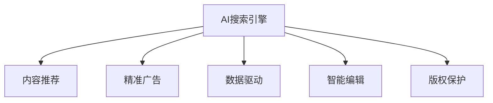

                 

# AI搜索引擎对传统媒体和出版业的影响

> 关键词：AI搜索引擎、内容推荐、精准广告、数据驱动、智能编辑、版权保护

## 1. 背景介绍

### 1.1 问题由来
随着互联网和数字技术的快速发展，信息的获取和传播方式发生了深刻变革。搜索引擎作为互联网时代信息检索的核心工具，在用户体验、信息发现、内容分发等方面扮演着至关重要的角色。传统媒体和出版业，如报纸、杂志、图书等，在数字化转型过程中，面临着巨大挑战和机遇。AI搜索引擎技术的应用，为传统媒体和出版业带来了全新的变革，驱动着内容生产、分发和消费模式的变革。

### 1.2 问题核心关键点
本文将从AI搜索引擎技术的应用出发，分析其在传统媒体和出版业中的应用场景、技术实现、实际效果和未来趋势，探讨其对传统媒体和出版业的影响，以及如何通过AI技术优化内容生产和分发流程，提升用户体验，实现行业转型升级。

## 2. 核心概念与联系

### 2.1 核心概念概述

- **AI搜索引擎**：利用人工智能技术，包括自然语言处理(NLP)、机器学习(ML)、深度学习(DL)等，实现对搜索结果的智能排序、推荐和个性化展示。与传统搜索引擎相比，AI搜索引擎能够更准确地理解用户的查询意图，提供更相关、更精准的搜索结果。

- **内容推荐**：基于用户的历史行为数据、兴趣偏好和实时交互数据，通过机器学习模型，动态生成个性化的内容推荐列表，提升用户满意度。内容推荐系统广泛应用于电商、新闻、视频等多个领域，对用户体验有着重要的影响。

- **精准广告**：通过数据分析和机器学习技术，识别潜在的用户群体，实现广告的精准投放，提高广告效果和ROI。精准广告不仅能够提升广告主的收益，还能降低用户的干扰，提升广告相关性。

- **数据驱动**：传统媒体和出版业的各个环节，如内容创作、版权管理、发行销售等，都在逐步向数据驱动的方向转型。通过数据的收集、分析和应用，优化决策过程，提升效率和效果。

- **智能编辑**：利用AI技术，对新闻稿、文章、书籍等内容进行自动化处理，如校对、摘要生成、语义分析等，提升编辑工作的效率和质量。智能编辑技术能够帮助编辑团队应对海量内容，提高内容创作的水平。

- **版权保护**：AI技术在版权保护中也发挥着重要作用，通过版权识别、内容追踪、侵权检测等技术，保护内容创作者的合法权益，打击盗版和侵权行为。

这些核心概念之间的逻辑关系可以通过以下Mermaid流程图来展示：



这个流程图展示了AI搜索引擎技术在传统媒体和出版业中的应用路径和影响。通过AI搜索引擎，媒体和出版业能够更好地理解和满足用户的需求，提高广告投放的精准度，驱动数据驱动的决策，提升内容创作的智能水平，加强版权保护。

## 3. 核心算法原理 & 具体操作步骤
### 3.1 算法原理概述

AI搜索引擎的核心算法包括：

1. **自然语言处理(NLP)**：通过分词、词性标注、命名实体识别、情感分析等技术，理解和解析用户的查询意图。
2. **机器学习(ML)与深度学习(DL)**：基于用户行为数据和搜索日志，构建推荐模型和广告投放模型，实现个性化内容和精准广告的推送。
3. **数据分析与处理**：通过数据收集、清洗、分析和应用，优化内容生产、分发和版权保护等环节。

### 3.2 算法步骤详解

AI搜索引擎的实现流程大致分为以下几个步骤：

1. **数据收集**：从用户在搜索引擎中的搜索行为、广告点击行为、内容阅读行为等获取数据。
2. **特征提取**：从收集到的数据中提取用户的兴趣特征、行为特征、时间特征等。
3. **模型训练**：使用机器学习或深度学习算法，构建推荐模型和广告投放模型。
4. **结果生成**：根据用户的查询输入和提取到的特征，生成个性化的搜索结果和推荐内容。
5. **效果评估**：通过点击率、转化率、用户满意度等指标，评估搜索引擎的效果，并进行优化。

### 3.3 算法优缺点

AI搜索引擎技术的优点包括：

1. **精准度提升**：通过理解用户意图，提供更相关、更精准的搜索结果，提升用户体验。
2. **个性化推荐**：通过分析用户行为数据，实现个性化内容的推荐，提高用户满意度和留存率。
3. **广告效果优化**：通过精准的广告投放，提高广告主的ROI，降低用户的干扰。
4. **效率提升**：通过自动化处理和数据分析，提升内容生产和版权保护的工作效率。

其缺点包括：

1. **数据隐私问题**：在收集和处理用户数据时，可能涉及隐私问题，需确保数据安全和用户隐私保护。
2. **算法偏见**：模型可能会学习到数据中的偏见，导致搜索结果和推荐结果的不公平。
3. **技术复杂性**：算法实现复杂，需要大量的数据和计算资源。
4. **成本高**：大规模的算法模型训练和部署，需要较高的技术投入和硬件资源。

### 3.4 算法应用领域

AI搜索引擎技术广泛应用于新闻、图书、视频、电商等多个领域，具体包括：

1. **新闻媒体**：基于用户兴趣和搜索行为，推荐相关新闻文章，提升阅读体验。
2. **图书出版**：通过个性化推荐，提升用户的阅读兴趣，增加书籍销量。
3. **视频平台**：根据用户观看历史和兴趣，推荐相关视频内容，提升用户粘性。
4. **电商网站**：基于用户浏览行为和购买记录，推荐商品，提高转化率。

## 4. 数学模型和公式 & 详细讲解

### 4.1 数学模型构建

假设搜索引擎的数据集为 $D = \{(x_i, y_i)\}_{i=1}^N$，其中 $x_i$ 为用户的搜索行为或浏览记录，$y_i$ 为用户的实际点击行为。模型的目标是最大化点击率 $R$，即：

$$
\max_{\theta} \sum_{i=1}^N \log \frac{\exp(y_i \theta^T x_i)}{\sum_{j=1}^N \exp(\theta^T x_j)}
$$

其中 $\theta$ 为模型的参数，$y_i$ 为0或1，表示用户是否点击了搜索结果。

### 4.2 公式推导过程

1. **假设条件**：
   - 假设用户点击的概率服从伯努利分布，即 $y_i \sim Bernoulli(\eta_i)$，其中 $\eta_i = \theta^T x_i$。
   - 假设点击率与特征 $x_i$ 成线性关系，即 $P(y_i=1|\theta) = \sigma(\theta^T x_i)$，其中 $\sigma(z) = \frac{1}{1 + e^{-z}}$ 为sigmoid函数。

2. **最大似然估计**：
   - 利用似然函数，最大化点击率 $R$：
   $$
   \max_{\theta} \log \prod_{i=1}^N P(y_i|\theta) = \sum_{i=1}^N \log P(y_i|\theta)
   $$
   - 通过Jensen不等式，可以转化为对数似然函数：
   $$
   \max_{\theta} \mathbb{E}[\log P(y_i|\theta)] = \mathbb{E}[\log \sigma(\theta^T x_i)] = \mathbb{E}[\eta_i \log \sigma(\theta^T x_i) + (1 - \eta_i) \log (1 - \sigma(\theta^T x_i))]
   $$
   - 对上式进行求解，得到模型的参数 $\theta$。

3. **损失函数和优化算法**：
   - 利用交叉熵损失函数：
   $$
   L(\theta) = -\frac{1}{N} \sum_{i=1}^N [y_i \log P(y_i|\theta) + (1-y_i) \log (1 - P(y_i|\theta))]
   $$
   - 通过梯度下降等优化算法进行参数更新。

### 4.3 案例分析与讲解

以新闻媒体为例，假设用户的搜索行为包括搜索时间、搜索关键词和浏览记录等特征。模型通过学习这些特征，预测用户点击新闻文章的概率。具体实现步骤如下：

1. **特征提取**：将用户的搜索行为和浏览记录转换成数值向量 $x_i$。
2. **模型训练**：使用监督学习算法（如线性回归、逻辑回归等），训练模型参数 $\theta$。
3. **结果生成**：根据新用户的搜索行为特征 $x_{new}$，利用模型预测用户点击新闻文章的概率 $P(y_{new}|x_{new},\theta)$。
4. **推荐策略**：根据预测结果，推荐新闻文章列表给用户。

## 5. 项目实践：代码实例和详细解释说明
### 5.1 开发环境搭建

为了进行AI搜索引擎的开发，需要搭建相应的开发环境。以下是使用Python进行TensorFlow开发的环境配置流程：

1. 安装Anaconda：从官网下载并安装Anaconda，用于创建独立的Python环境。
2. 创建并激活虚拟环境：
```bash
conda create -n tensorflow-env python=3.8 
conda activate tensorflow-env
```
3. 安装TensorFlow：根据CUDA版本，从官网获取对应的安装命令。例如：
```bash
conda install tensorflow -c tensorflow -c conda-forge
```
4. 安装各类工具包：
```bash
pip install numpy pandas scikit-learn matplotlib tqdm jupyter notebook ipython
```
完成上述步骤后，即可在`tensorflow-env`环境中开始搜索引擎的开发。

### 5.2 源代码详细实现

以下是一个简单的新闻推荐系统的示例代码，用于展示AI搜索引擎的基本实现。

```python
import tensorflow as tf
from tensorflow.keras.layers import Input, Dense, Embedding, Concatenate, Flatten, Add
from tensorflow.keras.models import Model

# 定义模型
inputs = Input(shape=(100,), name='inputs')
x1 = Dense(100, activation='relu')(inputs)
x2 = Embedding(10000, 100)(x1)
x3 = Flatten()(x2)
x4 = Dense(100, activation='relu')(x3)

inputs = Input(shape=(100,), name='inputs')
x5 = Dense(100, activation='relu')(inputs)
x6 = Embedding(10000, 100)(x5)
x7 = Flatten()(x6)
x8 = Dense(100, activation='relu')(x7)

concat = Concatenate()([x4, x8])
output = Dense(1, activation='sigmoid')(concat)

model = Model(inputs=[inputs, inputs], outputs=[output])

# 编译模型
model.compile(loss='binary_crossentropy', optimizer='adam', metrics=['accuracy'])

# 训练模型
model.fit([train_x1, train_x2], train_y, epochs=10, batch_size=32)

# 预测
test_x1, test_x2 = preprocess(test_data)
test_y_pred = model.predict([test_x1, test_x2])
```

以上代码实现了基于TensorFlow的新闻推荐系统，包含了输入层、嵌入层、全连接层等组件。模型输入为用户的搜索行为和浏览记录，输出为点击新闻文章的概率。通过训练模型，可以预测新用户的点击概率，从而实现个性化推荐。

### 5.3 代码解读与分析

**特征提取层**：
- `Input`：用于定义模型的输入层，指定输入特征的维度。
- `Dense`：全连接层，用于对输入特征进行线性变换。
- `Embedding`：嵌入层，将高维稀疏向量转换为低维稠密向量。
- `Flatten`：展平层，将高维张量展平为一维向量。

**输出层**：
- `Concatenate`：连接层，将多个特征向量进行拼接。
- `Dense`：全连接层，用于对拼接后的特征进行线性变换。
- `Activation`：激活函数，引入非线性变换，提高模型的拟合能力。

**模型训练**：
- `compile`：编译模型，指定损失函数、优化器和评价指标。
- `fit`：训练模型，指定训练数据、批次大小、迭代次数等参数。

**模型预测**：
- `preprocess`：数据预处理，将新数据转换为模型输入格式。
- `predict`：预测模型输出，返回点击概率。

代码实现中，通过定义两层相同的全连接神经网络，将用户的搜索行为和浏览记录转换为低维向量，并拼接后输入到输出层，最终得到点击概率。这种实现方式可以处理高维稀疏特征，并引入非线性变换，提高模型的表达能力。

## 6. 实际应用场景

### 6.1 智能媒体内容推荐

基于AI搜索引擎技术，智能媒体平台可以为用户提供个性化的内容推荐。用户在浏览新闻、视频、文章等时，系统会记录用户的点击、浏览和停留时间等行为数据，分析用户的兴趣偏好，推荐相关内容。通过这种方式，用户能够更快地发现感兴趣的新闻和视频，提升阅读和观看体验。

### 6.2 精准广告投放

AI搜索引擎技术可以帮助广告主实现精准的广告投放。系统可以根据用户的浏览历史和搜索行为，识别出潜在的目标客户群体，精准地推送广告，提升广告的点击率和转化率。同时，系统还能够实时监测广告效果，调整投放策略，确保广告预算的合理利用。

### 6.3 版权保护

AI搜索引擎技术在版权保护中也发挥着重要作用。通过数据分析和版权识别技术，系统可以识别出侵权行为，及时通知版权方，保护原创内容。同时，系统还能够跟踪内容的使用情况，提供版权证明，确保内容使用的合规性和安全性。

### 6.4 未来应用展望

随着AI技术的不断进步，未来AI搜索引擎将在更多领域得到应用，进一步推动传统媒体和出版业的数字化转型：

1. **智能编辑**：通过AI技术，对新闻稿、文章、书籍等内容进行自动化处理，如校对、摘要生成、语义分析等，提升编辑工作的效率和质量。
2. **个性化新闻推荐**：根据用户的搜索行为和兴趣，推荐相关新闻文章，提升用户的阅读体验。
3. **广告精准投放**：利用数据分析和机器学习技术，实现广告的精准投放，提高广告效果和ROI。
4. **版权保护**：通过版权识别和追踪技术，保护内容创作者的合法权益，打击盗版和侵权行为。
5. **数据驱动决策**：利用数据分析技术，优化内容生产、分发和版权保护等环节，提升决策的科学性和效率。

## 7. 工具和资源推荐

### 7.1 学习资源推荐

为了帮助开发者系统掌握AI搜索引擎的理论基础和实践技巧，这里推荐一些优质的学习资源：

1. 《深度学习与神经网络》：斯坦福大学机器学习课程，系统讲解深度学习原理和实现。
2. 《TensorFlow实战》：详细讲解TensorFlow框架的使用和应用，包含推荐系统、广告投放等案例。
3. 《自然语言处理入门》：介绍NLP的基本概念和常用技术，包括文本分类、情感分析、信息抽取等。
4. 《机器学习实战》：实战项目驱动，介绍机器学习算法的实现和优化。
5. Kaggle：数据科学竞赛平台，提供丰富的数据集和机器学习竞赛，帮助开发者提高实践能力。

通过对这些资源的学习实践，相信你一定能够快速掌握AI搜索引擎的精髓，并用于解决实际的媒体和出版问题。

### 7.2 开发工具推荐

高效的开发离不开优秀的工具支持。以下是几款用于AI搜索引擎开发的常用工具：

1. TensorFlow：基于Python的开源深度学习框架，灵活动态的计算图，适合快速迭代研究。TensorFlow提供了丰富的神经网络组件和优化器，支持GPU加速。
2. PyTorch：基于Python的开源深度学习框架，灵活易用，适合科研和生产部署。PyTorch提供动态计算图和自动微分功能，便于快速原型开发。
3. Keras：高层神经网络API，简单易用，适合快速搭建和调试神经网络模型。Keras提供了丰富的预训练模型和迁移学习策略，便于微调和应用。
4. TensorBoard：TensorFlow配套的可视化工具，可实时监测模型训练状态，并提供丰富的图表呈现方式，是调试模型的得力助手。
5. Weights & Biases：模型训练的实验跟踪工具，可以记录和可视化模型训练过程中的各项指标，方便对比和调优。

合理利用这些工具，可以显著提升AI搜索引擎的开发效率，加快创新迭代的步伐。

### 7.3 相关论文推荐

AI搜索引擎技术的发展源于学界的持续研究。以下是几篇奠基性的相关论文，推荐阅读：

1. Hinton G. E. et al. "Deep Learning"：深度学习经典教材，介绍深度学习的基本概念和算法。
2. Le Cun Y. et al. "Convolutional Networks for Images, Speech, and Time Series"：介绍卷积神经网络的原理和应用。
3. Dean J. et al. "Large-Scale Distributed Deep Learning"：介绍分布式深度学习框架的实现和优化。
4. Manning C. D. et al. "Foundations of Statistical Natural Language Processing"：介绍自然语言处理的统计模型和算法。
5. Sivic J. et al. "Video Google"：介绍视频内容识别和检索的深度学习算法。

这些论文代表了大语言模型微调技术的发展脉络。通过学习这些前沿成果，可以帮助研究者把握学科前进方向，激发更多的创新灵感。

## 8. 总结：未来发展趋势与挑战

### 8.1 研究成果总结

本文对AI搜索引擎技术在传统媒体和出版业中的应用进行了全面系统的介绍。从背景、核心概念、算法原理、操作步骤、实际应用场景等多个角度，深入探讨了AI搜索引擎对传统媒体和出版业的影响，以及如何通过AI技术优化内容生产和分发流程，提升用户体验，实现行业转型升级。

### 8.2 未来发展趋势

展望未来，AI搜索引擎技术将在更多领域得到应用，进一步推动传统媒体和出版业的数字化转型：

1. **智能编辑**：通过AI技术，对新闻稿、文章、书籍等内容进行自动化处理，如校对、摘要生成、语义分析等，提升编辑工作的效率和质量。
2. **个性化新闻推荐**：根据用户的搜索行为和兴趣，推荐相关新闻文章，提升用户的阅读体验。
3. **广告精准投放**：利用数据分析和机器学习技术，实现广告的精准投放，提高广告效果和ROI。
4. **版权保护**：通过版权识别和追踪技术，保护内容创作者的合法权益，打击盗版和侵权行为。
5. **数据驱动决策**：利用数据分析技术，优化内容生产、分发和版权保护等环节，提升决策的科学性和效率。

### 8.3 面临的挑战

尽管AI搜索引擎技术已经取得了瞩目成就，但在迈向更加智能化、普适化应用的过程中，仍面临诸多挑战：

1. **数据隐私问题**：在收集和处理用户数据时，可能涉及隐私问题，需确保数据安全和用户隐私保护。
2. **算法偏见**：模型可能会学习到数据中的偏见，导致搜索结果和推荐结果的不公平。
3. **技术复杂性**：算法实现复杂，需要大量的数据和计算资源。
4. **成本高**：大规模的算法模型训练和部署，需要较高的技术投入和硬件资源。
5. **资源优化**：在资源受限的情况下，如何优化模型结构，提升推理速度，优化资源占用，是实际应用中的重要问题。

### 8.4 研究展望

面对AI搜索引擎所面临的种种挑战，未来的研究需要在以下几个方面寻求新的突破：

1. **数据隐私保护**：开发更为隐私友好的算法，减少对用户数据的依赖，保护用户隐私。
2. **算法公平性**：研究并改进算法，减少模型偏见，实现公平的搜索结果和推荐。
3. **技术优化**：优化模型结构，提升推理速度和资源利用率，降低算法实现复杂度。
4. **低成本应用**：开发更为轻量级的算法，降低技术门槛，降低部署成本。
5. **多模态融合**：结合视频、语音、图像等多模态数据，提升内容理解和推荐效果。

这些研究方向的探索，将进一步推动AI搜索引擎技术的进步，为传统媒体和出版业带来更深层次的变革。只有勇于创新、敢于突破，才能真正实现人工智能技术在垂直行业的规模化落地。总之，AI搜索引擎技术需要通过不断的技术进步和应用创新，为传统媒体和出版业提供更优质的服务和体验，助力行业数字化转型升级。

## 9. 附录：常见问题与解答

**Q1：AI搜索引擎是否适用于所有媒体和出版业场景？**

A: AI搜索引擎技术适用于绝大多数媒体和出版业场景，如新闻、图书、视频、电商等。但对于一些特定领域，如医学、法律等，需要结合领域特征，进行定制化的设计和优化。

**Q2：如何提升AI搜索引擎的推荐效果？**

A: 提升AI搜索引擎推荐效果的方法包括：
1. 增加数据量：收集更多的用户行为数据，丰富模型训练集。
2. 优化特征提取：通过更先进的特征提取算法，提升特征表示的质量。
3. 改进算法模型：使用更先进的推荐算法，如协同过滤、深度学习等，提升模型的拟合能力。
4. 数据预处理：对数据进行清洗、归一化、降维等处理，提高模型的泛化能力。
5. 实时更新：根据用户反馈和新数据，动态更新模型参数，提升推荐效果。

**Q3：AI搜索引擎在版权保护中扮演什么角色？**

A: AI搜索引擎在版权保护中扮演重要角色，主要体现在以下几个方面：
1. 版权识别：通过数据分析和识别技术，快速识别出版权作品。
2. 内容追踪：通过版权追踪技术，实时监控内容的使用情况，确保内容使用的合规性。
3. 侵权检测：通过版权监测技术，及时发现和处理侵权行为，保护版权方的合法权益。

**Q4：AI搜索引擎在内容生产中的作用是什么？**

A: AI搜索引擎在内容生产中的作用主要体现在以下几个方面：
1. 内容推荐：通过个性化推荐，帮助编辑发现潜在的高质量内容。
2. 智能编辑：通过自动化处理和校对，提升内容创作的效率和质量。
3. 数据驱动决策：通过数据分析，优化内容生产流程，提升决策的科学性和效率。

通过这些技术手段，AI搜索引擎能够帮助内容创作者更好地理解和把握用户的兴趣和需求，提升内容的质量和传播效果，从而推动媒体和出版业的发展。

**Q5：AI搜索引擎在新闻推荐中的应用有哪些？**

A: AI搜索引擎在新闻推荐中的应用包括：
1. 个性化新闻推荐：根据用户的搜索行为和兴趣，推荐相关新闻文章，提升用户的阅读体验。
2. 热点新闻推送：通过数据分析，实时推送热点新闻，满足用户的即时信息需求。
3. 事件监测：通过实时搜索和数据分析，监测和跟踪重大事件，提供及时的新闻报道。

以上应用能够提升新闻媒体的覆盖面和用户粘性，增强用户的参与感和互动性，从而提升新闻媒体的影响力和市场竞争力。

---

作者：禅与计算机程序设计艺术 / Zen and the Art of Computer Programming

