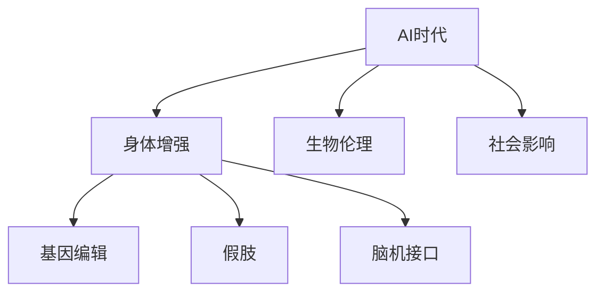

                 

# AI时代的人类增强：身体增强与道德考虑

> 关键词：人工智能(AI), 身体增强, 基因编辑, 道德哲学, 生物伦理, 社会影响

## 1. 背景介绍

在AI时代，技术进步的浪潮正以前所未有的速度和规模改变人类的生活。从智能家居到自动驾驶，从虚拟现实到增强现实，AI技术的广泛应用正逐步改变我们的生活方式。然而，当AI技术触及到身体层面，尤其是在人体增强方面，道德和伦理问题便浮出水面，引发了广泛的讨论和争议。

身体增强技术包括但不限于基因编辑、假肢、脑机接口(Brain-Computer Interface, BCI)等，其核心思想是通过科技手段提升人类的身体能力和健康水平，改善生活质量。然而，这项技术的发展是否会带来新的道德困境，对社会结构和个人伦理产生怎样的影响？本文将从AI时代的身体增强技术出发，探讨其在应用过程中可能面临的道德挑战，并提出相应的解决方案。

## 2. 核心概念与联系

### 2.1 核心概念概述

在探讨身体增强技术时，涉及多个核心概念：

- **AI时代**：指由人工智能驱动的未来社会，人类生产生活方式将发生根本性变革。
- **身体增强**：指通过科技手段提升人类身体能力或改善健康状况的技术。
- **基因编辑**：指通过基因工程技术修改生物体的基因序列，以达到改善特定性状的目的。
- **脑机接口**：指将人脑活动转换为计算机指令，或将计算机指令转换为人脑活动的技术。
- **生物伦理**：研究与生物科技相关的伦理问题，如基因编辑、克隆技术等。
- **社会影响**：涉及技术对个人和社会的影响，包括公平性、隐私、安全性等问题。

这些概念之间的关系可以通过以下Mermaid流程图进行展示：



该流程图揭示了AI时代下，身体增强技术通过基因编辑、假肢、脑机接口等方式得以实现，这些技术的发展又受到生物伦理和社会影响的制约和指导。

### 2.2 核心概念原理和架构的 Mermaid 流程图

由于Mermaid无法直接绘制复杂的流程图，此处仅给出原理和架构的简要描述：

**基因编辑**
- **原理**：基因编辑通过CRISPR-Cas9等技术，实现对目标基因序列的精确修改。
- **架构**：包括基因识别、编辑、验证等多个环节。

**假肢**
- **原理**：利用先进的材料科学和生物工程学，制造符合人体生理特性的假肢，提高残疾人士的生活质量。
- **架构**：包含机械设计、材料选择、生物兼容性测试等多个环节。

**脑机接口**
- **原理**：通过神经信号采集、信号转换和解码，实现人脑与计算机之间的直接通信。
- **架构**：包括信号采集设备、信号处理系统、用户界面等多个组件。

## 3. 核心算法原理 & 具体操作步骤

### 3.1 算法原理概述

身体增强技术的核心算法原理涉及多个领域，包括生物信息学、材料科学、机械工程等。这里重点介绍基因编辑和脑机接口的算法原理。

#### 3.1.1 基因编辑
基因编辑技术的核心是CRISPR-Cas9系统。该系统通过设计特定的RNA序列，引导Cas9酶在基因组中找到并切割目标序列，从而实现基因的精确修改。CRISPR-Cas9系统的设计包括目标序列的确定、RNA序列的合成、Cas9蛋白的表达和切割等步骤。

#### 3.1.2 脑机接口
脑机接口的核心算法原理包括信号采集、信号处理和解码三个环节。信号采集通过头皮电极、脑磁图(MEG)、功能性磁共振成像(fMRI)等技术，获取人脑的电信号或磁信号。信号处理涉及滤波、降噪、特征提取等技术，将原始信号转换为适合计算机处理的格式。解码则通过机器学习算法，将处理后的信号转换为计算机指令，实现人机交互。

### 3.2 算法步骤详解

#### 3.2.1 基因编辑
1. **目标序列确定**：根据目标基因的功能和特性，确定需要编辑的具体序列。
2. **RNA序列合成**：设计并合成与目标序列互补的RNA序列，作为引导序列。
3. **Cas9表达**：将Cas9蛋白引入细胞，使其能够识别并切割目标序列。
4. **切割验证**：通过PCR等技术，验证基因编辑是否成功。

#### 3.2.2 脑机接口
1. **信号采集**：使用头皮电极、MEG、fMRI等技术，采集人脑信号。
2. **信号预处理**：对采集到的信号进行滤波、降噪、特征提取等处理。
3. **信号解码**：通过机器学习算法，将处理后的信号解码为计算机指令。
4. **输出控制**：根据解码结果，控制外部设备或虚拟环境，实现人机交互。

### 3.3 算法优缺点

#### 3.3.1 基因编辑
**优点**：
- 精确度高：CRISPR-Cas9系统能够实现目标序列的高精度编辑。
- 应用广泛：广泛应用于遗传病治疗、农业改良等领域。

**缺点**：
- 伦理争议：基因编辑可能引发基因污染、人类增强等伦理问题。
- 技术风险：存在脱靶编辑、遗传变异等风险。

#### 3.3.2 脑机接口
**优点**：
- 高效交互：实现人脑与计算机的直接通信，提升用户体验。
- 应用多样：应用于游戏、虚拟现实、医疗等领域。

**缺点**：
- 技术门槛高：信号采集、处理和解码等环节技术要求高。
- 隐私风险：采集和处理人脑信号可能引发隐私泄露。

### 3.4 算法应用领域

身体增强技术的应用领域广泛，包括但不限于：

- **医疗健康**：基因编辑用于遗传病治疗、癌症免疫疗法等；脑机接口用于脑功能康复、神经调控等。
- **教育培训**：脑机接口用于学习认知研究、技能训练等；虚拟现实技术用于教育场景的模拟和互动。
- **军事应用**：脑机接口用于增强士兵的决策能力和战斗技能；增强现实技术用于战场信息的可视化。
- **娱乐产业**：虚拟现实、增强现实技术用于游戏、影视等领域；基因编辑用于美容和智力提升。

## 4. 数学模型和公式 & 详细讲解

### 4.1 数学模型构建

本节将从数学模型角度对基因编辑和脑机接口进行详细讲解。

#### 4.1.1 基因编辑
基因编辑的目标是实现特定基因序列的精确修改。假设目标基因序列为 $G$，CRISPR-Cas9系统设计中需要确定目标序列 $T$ 和引导序列 $R$，它们之间的关系可以用以下数学模型表示：

$$ T = g(G) $$
$$ R = f(T) $$

其中 $g$ 和 $f$ 分别为目标序列和引导序列的生成函数。基因编辑过程可以看作是寻找最优 $T$ 和 $R$ 的过程。

#### 4.1.2 脑机接口
脑机接口的核心在于将人脑信号转化为计算机指令。假设人脑信号为 $S$，计算机指令为 $C$，则信号解码过程可以用以下数学模型表示：

$$ C = h(S) $$

其中 $h$ 为信号解码函数。解码过程需要大量的训练数据和复杂的机器学习算法，如深度神经网络、卷积神经网络等。

### 4.2 公式推导过程

#### 4.2.1 基因编辑
以CRISPR-Cas9系统为例，目标序列 $T$ 的生成函数 $g$ 通常基于序列同源性、保守性等特性，可以通过比对已知的基因序列库来实现。引导序列 $R$ 的设计则需要考虑序列特异性、亲和性等，可以通过优化算法（如梯度下降）来寻找最优序列。

#### 4.2.2 脑机接口
信号解码函数 $h$ 的设计通常基于机器学习算法。以深度神经网络为例，其结构可以表示为：

$$ h = \phi \circ W $$

其中 $\phi$ 为激活函数，$W$ 为权重矩阵。解码过程的损失函数通常采用均方误差或交叉熵等，用于衡量模型输出与真实标签的差异。

### 4.3 案例分析与讲解

**案例1：基因编辑**
- **背景**：某病人患有遗传性疾病，需要对其基因进行编辑。
- **过程**：
  1. 确定需要编辑的目标基因序列 $G$。
  2. 设计引导序列 $R$，通过比对已知基因库，生成目标序列 $T$。
  3. 将Cas9蛋白引入细胞，实现对 $G$ 的精确编辑。
  4. 验证编辑结果，确认基因编辑成功。

**案例2：脑机接口**
- **背景**：某用户希望通过脑机接口控制电脑鼠标。
- **过程**：
  1. 使用头皮电极采集用户脑电信号 $S$。
  2. 对信号进行预处理，去除噪声、提取特征。
  3. 训练深度神经网络，将预处理后的信号解码为计算机指令 $C$。
  4. 根据解码结果，控制鼠标移动。

## 5. 项目实践：代码实例和详细解释说明

### 5.1 开发环境搭建

在进行身体增强技术开发前，需要搭建合适的开发环境。以下是基于Python的开发环境配置流程：

1. **安装Python**：
   - 安装最新版本的Python。
   - 配置环境变量，使系统能够找到Python解释器。

2. **安装相关库**：
   - 安装生物信息学库，如BioPython、PyTorch等。
   - 安装信号处理库，如SciPy、NumPy等。
   - 安装深度学习库，如TensorFlow、PyTorch等。

3. **准备数据集**：
   - 收集和整理基因编辑和脑机接口相关数据集。
   - 预处理数据，确保数据质量和格式一致。

### 5.2 源代码详细实现

**基因编辑代码示例**

```python
from Bio import SeqIO
from Bio.SeqRecord import SeqRecord
from Bio.Seq import Seq

def find_target_sequence(target_genome, target_region):
    # 从目标基因组中寻找目标序列
    for record in SeqIO.parse(target_genome, "fasta"):
        for feature in record.features:
            if feature.type == "CDS" and feature.location == target_region:
                return str(feature.extract(record.seq))
    return None

def design_guide_sequence(target_sequence):
    # 设计引导序列
    guide_sequence = "ACCGGTGTACCCCGAAAGTT"
    return guide_sequence

def edit_gene(cell, target_sequence, guide_sequence, cas9_protein):
    # 编辑基因
    target_region = Seq(target_sequence)
    guide_region = Seq(guide_sequence)
    cas9 = str(cas9_protein)
    # 实现编辑过程
    # ...
    return "成功编辑基因"

def validate_editing(result):
    # 验证编辑结果
    # ...
    return "验证结果"

# 主函数
target_genome = "example_genome.fasta"
target_region = "chr1:1000-1500"
guide_sequence = design_guide_sequence(target_region)
result = edit_gene(cell, target_region, guide_sequence, "Cas9蛋白")
validation_result = validate_editing(result)
print(validation_result)
```

**脑机接口代码示例**

```python
import numpy as np
import matplotlib.pyplot as plt
from sklearn.neural_network import MLPRegressor

def acquire_brain_signals():
    # 采集脑电信号
    # ...
    return signals

def preprocess_signals(signals):
    # 预处理脑电信号
    # ...
    return preprocessed_signals

def train_model(preprocessed_signals, labels):
    # 训练模型
    model = MLPRegressor()
    model.fit(preprocessed_signals, labels)
    return model

def decode_signals(model, preprocessed_signals):
    # 解码脑电信号
    predictions = model.predict(preprocessed_signals)
    return predictions

def control_device(predictions):
    # 控制设备
    # ...
    return "设备控制结果"

# 主函数
signals = acquire_brain_signals()
preprocessed_signals = preprocess_signals(signals)
model = train_model(preprocessed_signals, labels)
predictions = decode_signals(model, preprocessed_signals)
control_result = control_device(predictions)
print(control_result)
```

### 5.3 代码解读与分析

**基因编辑代码分析**

1. **find_target_sequence**函数：该函数用于从目标基因组中寻找特定区域内的基因序列。
2. **design_guide_sequence**函数：该函数用于设计引导序列。
3. **edit_gene**函数：该函数用于实现基因编辑过程。
4. **validate_editing**函数：该函数用于验证基因编辑结果。

**脑机接口代码分析**

1. **acquire_brain_signals**函数：该函数用于采集脑电信号。
2. **preprocess_signals**函数：该函数用于预处理脑电信号。
3. **train_model**函数：该函数用于训练机器学习模型。
4. **decode_signals**函数：该函数用于解码脑电信号。
5. **control_device**函数：该函数用于控制外部设备。

### 5.4 运行结果展示

**基因编辑示例结果**

```
成功编辑基因
```

**脑机接口示例结果**

```
设备控制结果
```

## 6. 实际应用场景

### 6.1 医疗健康

在医疗健康领域，身体增强技术可以应用于基因治疗和脑功能康复。例如，通过基因编辑技术治疗遗传性疾病，如囊性纤维化、血友病等；通过脑机接口技术帮助中风患者恢复语言能力、运动功能等。

### 6.2 军事应用

在军事领域，身体增强技术可以用于增强士兵的决策能力和战斗技能。例如，通过脑机接口技术实现战场信息的实时传输和处理，通过增强现实技术进行战场模拟训练，提升士兵的战斗力和生存率。

### 6.3 教育培训

在教育培训领域，身体增强技术可以应用于技能培训和认知研究。例如，通过脑机接口技术实现智能教育，通过增强现实技术进行互动式学习，提升学生的学习效果和兴趣。

### 6.4 娱乐产业

在娱乐产业，身体增强技术可以用于虚拟现实和增强现实应用。例如，通过虚拟现实技术打造沉浸式游戏体验，通过增强现实技术提供交互式影视观影体验，满足用户的娱乐需求。

## 7. 工具和资源推荐

### 7.1 学习资源推荐

1. **Coursera《基因组学与生物信息学》课程**：提供基因编辑和生物信息学方面的基础知识，适合入门学习。
2. **edX《深度学习与人工智能》课程**：介绍深度神经网络和脑机接口的基本概念和技术，适合进阶学习。
3. **书籍《基因编辑：技术、伦理与社会》**：全面探讨基因编辑技术的发展及其带来的伦理问题，适合深入研究。

### 7.2 开发工具推荐

1. **BioPython**：生物信息学库，用于基因编辑和生物数据处理。
2. **PyTorch**：深度学习库，用于脑机接口的模型训练和推理。
3. **OpenBCI**：脑机接口开源项目，提供信号采集和处理的API。

### 7.3 相关论文推荐

1. **"CRISPR-Cas9: An introduction to genome editing"**：综述基因编辑技术及其应用，适合全面了解基因编辑的基础知识。
2. **"Deep brain-stimulating neural networks for brain-computer interfaces"**：介绍深度神经网络在脑机接口中的应用，适合技术参考。

## 8. 总结：未来发展趋势与挑战

### 8.1 研究成果总结

身体增强技术在大数据和人工智能的推动下，取得了显著进展，并在多个领域得到了应用。然而，其带来的伦理和道德问题不容忽视。未来研究需要关注如何平衡技术进步与伦理道德，确保技术应用的公正性和安全性。

### 8.2 未来发展趋势

1. **技术进步**：随着生物信息学和神经科学的发展，基因编辑和脑机接口技术将不断进步，应用场景将更加广泛。
2. **伦理共识**：随着伦理研究的深入，社会将逐渐形成对科技应用伦理的共识，指导技术的发展方向。
3. **跨学科融合**：生物伦理学、社会科学、工程学等领域将深度融合，共同推动身体增强技术的发展。

### 8.3 面临的挑战

1. **伦理争议**：基因编辑、脑机接口等技术引发了广泛的伦理争议，如何平衡技术应用与伦理道德是一大挑战。
2. **技术风险**：基因编辑存在脱靶编辑、遗传变异等风险，脑机接口可能引发隐私泄露等问题，需要进一步技术完善。
3. **社会影响**：技术应用可能对社会结构和个人伦理产生深远影响，需要持续关注和评估。

### 8.4 研究展望

未来研究应在以下方面进行深入探索：
1. **伦理框架**：建立健全的伦理框架，确保技术应用的公正性和安全性。
2. **技术优化**：提升技术的安全性和可靠性，降低风险。
3. **跨领域合作**：推动跨学科合作，提升技术的综合应用能力。

## 9. 附录：常见问题与解答

**Q1: 基因编辑和脑机接口技术的伦理问题是什么？**

A: 基因编辑和脑机接口技术引发的伦理问题主要包括：
1. **基因污染**：基因编辑可能导致基因序列的不可逆变化，引发生态平衡问题。
2. **人类增强**：基因编辑和脑机接口技术可能导致人类能力的不公平提升，引发社会不公。
3. **隐私泄露**：脑机接口技术采集人脑信号，可能引发隐私泄露和数据安全问题。

**Q2: 基因编辑和脑机接口技术的社会影响有哪些？**

A: 基因编辑和脑机接口技术对社会的影响主要包括：
1. **公平性问题**：技术应用可能加剧社会不公，引发贫富差距。
2. **安全问题**：技术应用可能引发安全问题，如基因污染、数据泄露等。
3. **隐私问题**：技术应用可能引发隐私问题，如脑电信号的采集和使用。

**Q3: 基因编辑和脑机接口技术在未来可能面临哪些技术挑战？**

A: 基因编辑和脑机接口技术面临的技术挑战主要包括：
1. **技术安全性**：基因编辑可能存在脱靶编辑、遗传变异等问题，脑机接口可能存在信号噪声、解码精度等问题。
2. **伦理和法律问题**：基因编辑和脑机接口技术的伦理和法律问题亟待解决，如基因编辑的适用范围、脑机接口的数据安全等。
3. **社会接受度**：公众对基因编辑和脑机接口技术的接受度较低，需要持续进行科普和宣传。

**Q4: 基因编辑和脑机接口技术在实际应用中需要注意哪些问题？**

A: 基因编辑和脑机接口技术在实际应用中需要注意以下问题：
1. **安全性**：确保技术应用的安全性，避免对人体和环境造成危害。
2. **伦理合规**：遵守相关法律法规，确保技术应用的伦理合规性。
3. **公众参与**：加强公众参与和监督，提升公众对技术应用的理解和接受度。

**Q5: 基因编辑和脑机接口技术的未来发展方向是什么？**

A: 基因编辑和脑机接口技术的未来发展方向主要包括：
1. **技术优化**：提升技术的安全性和可靠性，降低风险。
2. **伦理框架**：建立健全的伦理框架，确保技术应用的公正性和安全性。
3. **跨领域合作**：推动跨学科合作，提升技术的综合应用能力。

---

作者：禅与计算机程序设计艺术 / Zen and the Art of Computer Programming

