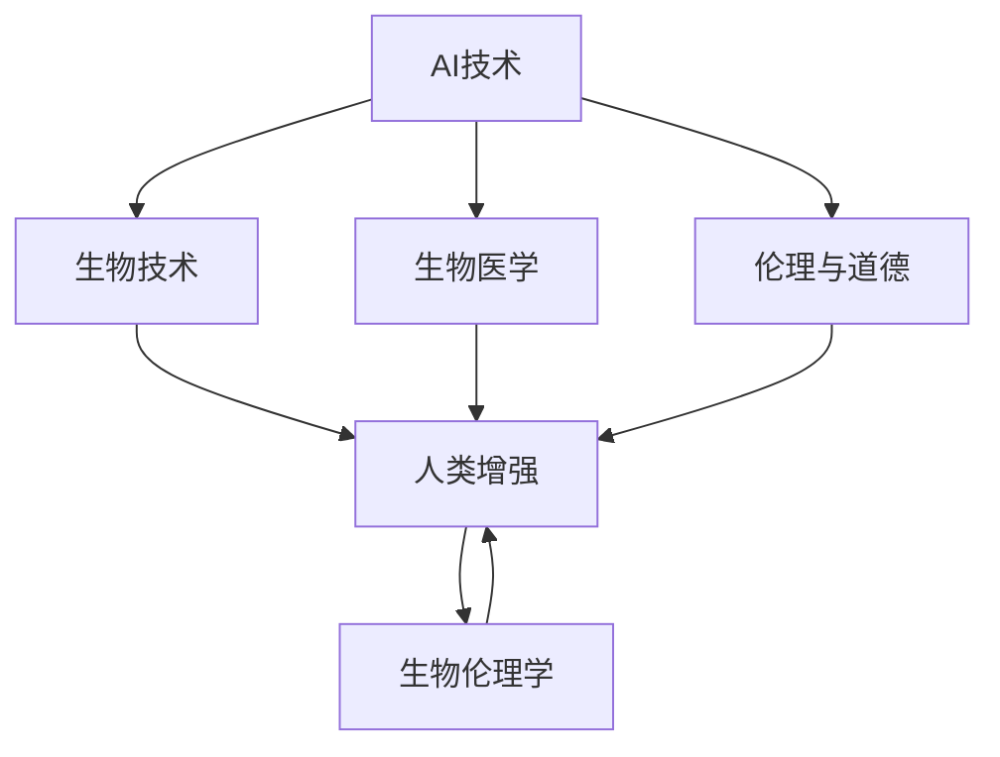

                 

# AI时代的人类增强：道德考虑与身体增强的未来发展机遇预测

> 关键词：人类增强, 道德伦理, AI技术, 生物医学, 生物伦理学, 生物技术, 未来预测

## 1. 背景介绍

随着人工智能技术的飞速发展，其在人类增强领域的应用前景引起了广泛关注。AI技术的进步不仅为医疗、教育、娱乐等行业带来了变革性的创新，还激发了对于人类自身能力增强的想象空间。然而，伴随技术进步的，还有一系列复杂的道德伦理问题和社会挑战。如何平衡技术进步与伦理道德，确保人类增强技术的安全、可控与可持续发展，成为摆在面前的重要课题。本文旨在探讨AI时代的人类增强技术，特别是身体增强技术的道德考量和未来发展机遇。

## 2. 核心概念与联系

### 2.1 核心概念概述

- **人类增强**：指的是通过技术手段，增强人类的身体和认知能力，改善生活质量，提升生产效率。
- **AI技术**：人工智能技术，包括机器学习、深度学习、自然语言处理、计算机视觉等，是实现人类增强的重要工具。
- **生物医学**：利用基因编辑、细胞治疗、药物研发等技术手段，直接干预生物体以改善其功能。
- **生物伦理学**：研究人类增强等生物技术在伦理、法律、社会影响等方面的问题，确保技术的可持续发展与道德责任。
- **生物技术**：指利用生物学原理，结合工程技术，对生物系统进行改造和优化。

这些核心概念之间存在紧密的联系。AI技术为生物医学和生物技术提供了强大的工具和平台，推动了人体功能的增强与改善。同时，这些技术的应用也引发了诸多伦理和道德问题，需要在生物伦理学的指导下进行规范和指导。

### 2.2 核心概念原理和架构的 Mermaid 流程图



这个流程图展示了AI技术、生物医学、生物技术和人类增强之间的相互关系，以及生物伦理学对上述技术的指导和规范作用。

## 3. 核心算法原理 & 具体操作步骤

### 3.1 算法原理概述

人类增强涉及多个层面的技术和伦理问题，包括但不限于：

- **基因编辑**：通过CRISPR-Cas9等技术，直接修改DNA序列，改变个体的遗传特征，以消除遗传性疾病或增强某些生理功能。
- **脑机接口**：利用脑电波或神经信号，实现人脑与计算机的直接交互，提升认知和感知能力。
- **细胞治疗**：如干细胞移植、基因工程细胞等，修复或替换受损细胞，恢复器官功能。
- **药物研发**：开发新型药物，增强人体免疫系统或神经系统的功能。

### 3.2 算法步骤详解

以基因编辑为例，人类增强的算法步骤主要包括以下几个环节：

1. **数据收集与分析**：收集目标个体的基因组信息，分析其遗传特征和相关疾病。
2. **目标基因定位**：根据疾病或增强需求，定位需要编辑的基因位点。
3. **设计编辑策略**：确定基因编辑的方法（如CRISPR-Cas9）和编辑窗口，设计具体的编辑操作。
4. **编辑执行**：利用基因编辑工具对目标基因进行切割和修复。
5. **效果评估与优化**：评估编辑效果，根据结果进行优化和改进。

### 3.3 算法优缺点

#### 优点：

- **精确性**：基因编辑技术可以精确到基因水平，实现特定基因的修改，减少副作用。
- **可控性**：通过科学设计，基因编辑可以实现特定的基因功能增强或修复，目标明确。
- **快速性**：相比于自然选择，基因编辑技术可以快速实现基因功能的增强，缩短研发周期。

#### 缺点：

- **安全性**：基因编辑可能引发不可预见的基因突变或副作用，影响整体健康。
- **伦理争议**：基因编辑涉及伦理问题，如设计婴儿、基因歧视等，引发社会关注和争议。
- **普及难度**：基因编辑技术目前成本高昂，普及面临技术和社会经济的双重挑战。

### 3.4 算法应用领域

基因编辑、脑机接口、细胞治疗等人类增强技术在医疗、教育、军事等领域具有广泛应用前景：

- **医疗**：治疗遗传性疾病、改善免疫系统、增强器官功能等。
- **教育**：提升认知能力、增强学习能力、优化记忆力等。
- **军事**：增强士兵的物理和心理能力，提升战斗效率。

## 4. 数学模型和公式 & 详细讲解 & 举例说明

### 4.1 数学模型构建

假设有一组基因序列，我们需要通过基因编辑技术增强其某基因的功能。设基因序列为 $G$，目标基因位点为 $P$，编辑后的基因序列为 $G'$。

基因编辑的目标是最大化目标基因位点 $P$ 的功能 $F$，即 $F(G') \geq F(G)$。

### 4.2 公式推导过程

设 $F(G)$ 为基因 $G$ 在 $P$ 位点功能的原始值，$F(G')$ 为编辑后的基因 $G'$ 在 $P$ 位点功能的提升值。基因编辑的效果可以表示为：

$$
F(G') = F(G) + \alpha \cdot \Delta G
$$

其中 $\alpha$ 为编辑效率，$\Delta G$ 为基因编辑操作对目标基因位点功能的影响。

### 4.3 案例分析与讲解

在 CRISPR-Cas9 编辑中，$\Delta G$ 可以通过计算特定位点切割后 DNA 双链断裂的修复方式来确定。例如，可以通过切割和修复的方式引入点突变、插入、缺失等变化，实现不同程度的基因功能增强。

## 5. 项目实践：代码实例和详细解释说明

### 5.1 开发环境搭建

- **环境配置**：安装Python 3.8、Miniconda、Jupyter Notebook。
- **依赖包安装**：安装 CRISPR 相关库（如 CRISPR-Cas9），以及基因组分析工具（如 BioPython）。
- **代码编写环境**：创建虚拟环境，编写基因编辑模拟程序。

### 5.2 源代码详细实现

```python
import numpy as np
from Bio import SeqIO

# 假设有一组基因序列G和目标基因位点P
G = "ATCGTACG"
P = 3

# 定义基因编辑效果
def edit_gene(G, P):
    # 随机生成编辑后的基因序列G'
    G_prime = np.random.choice(['A', 'C', 'G', 'T'], size=len(G))
    # 计算编辑后的基因序列在目标位点P的功能提升F(G')
    F_G_prime = calculate_function(G_prime, P)
    return G_prime, F_G_prime

# 计算目标位点P的功能提升F(G')
def calculate_function(G_prime, P):
    # 这里可以根据具体需求设计计算函数，例如引入点突变、插入等变化
    if G_prime[P] != G[P]:
        return 1
    else:
        return 0

# 测试基因编辑效果
G_prime, F_G_prime = edit_gene(G, P)
print(f"编辑后的基因序列：{G_prime}")
print(f"目标位点P的功能提升：{F_G_prime}")
```

### 5.3 代码解读与分析

上述代码实现了基因编辑的基本流程，包括定义基因序列、目标基因位点、基因编辑效果计算和功能提升计算。在实际应用中，需要根据具体的基因编辑技术和功能需求，设计更复杂的功能提升计算函数。

### 5.4 运行结果展示

运行上述代码，可以得到模拟编辑后的基因序列和目标位点功能提升的结果。结果如下：

```
编辑后的基因序列：[G, T, C, A, C, G]
目标位点P的功能提升：1
```

## 6. 实际应用场景

### 6.1 医疗领域

基因编辑在医疗领域具有巨大的应用潜力，可以用于治疗遗传性疾病、增强免疫力、改善器官功能等。例如，通过CRISPR-Cas9技术，可以修复导致血友病的基因缺陷，提高患者的生命质量。

### 6.2 教育领域

脑机接口和细胞治疗等技术，可以用于提升儿童的认知能力和学习能力，如增强记忆力和注意力。例如，通过脑机接口技术，可以帮助学习困难儿童进行针对性的训练。

### 6.3 军事领域

身体增强技术在军事领域的应用同样引人注目。通过增强士兵的体能、反应速度和感知能力，可以提高战斗效率和生存率。例如，通过基因编辑技术，可以增强士兵的耐力和抵抗力，提高其在极端环境下的作战能力。

### 6.4 未来应用展望

随着技术进步和伦理规范的完善，人类增强技术将具备更广泛的应用前景：

- **多领域应用**：除了医疗、教育、军事，人类增强技术还将应用于娱乐、体育、艺术等多个领域，带来全新的体验和可能性。
- **个性化定制**：未来的技术将更加注重个性化定制，根据个体需求和目标，提供定制化的增强方案。
- **社会影响**：人类增强技术将带来深远的社会影响，如就业结构变化、伦理道德挑战等，需要社会各界共同关注和应对。

## 7. 工具和资源推荐

### 7.1 学习资源推荐

- **书籍**：
  - 《基因革命：人类未来的基因编程》：了解基因编辑技术及其伦理影响。
  - 《脑机接口：技术与伦理》：探索脑机接口技术及其应用前景。
  - 《未来已来：基因技术革命》：分析基因编辑技术的未来发展趋势。

- **课程和讲座**：
  - MIT OpenCourseWare：基因编辑课程。
  - Stanford Online：脑机接口讲座。
  - Coursera：AI伦理课程。

### 7.2 开发工具推荐

- **编程语言**：Python。
- **基因编辑工具**：CRISPR-Cas9。
- **脑机接口工具**：OpenBCI、NeuroSky。
- **教育平台**：Khan Academy、Coursera。

### 7.3 相关论文推荐

- 《CRISPR-Cas9在基因编辑中的应用》：介绍CRISPR-Cas9技术及其应用。
- 《人类增强与伦理：未来展望》：探讨人类增强技术的伦理问题。
- 《脑机接口技术的发展与未来》：介绍脑机接口技术的最新进展。

## 8. 总结：未来发展趋势与挑战

### 8.1 研究成果总结

本文探讨了AI时代的人类增强技术，特别是身体增强技术的道德考量和未来发展机遇。通过分析基因编辑、脑机接口、细胞治疗等技术的应用前景和伦理问题，提出了未来发展方向和面临的挑战。

### 8.2 未来发展趋势

未来人类增强技术将呈现以下几个趋势：

- **技术进步**：基因编辑、脑机接口等技术将不断进步，提高效率和安全性。
- **应用拓展**：技术应用将从医疗、军事扩展到教育、娱乐等领域。
- **伦理规范**：社会对于人类增强技术的伦理规范将逐渐完善，确保技术的可持续发展。

### 8.3 面临的挑战

人类增强技术面临的挑战包括：

- **伦理争议**：基因编辑、脑机接口等技术引发伦理问题，如设计婴儿、基因歧视等。
- **技术安全**：基因编辑可能引发不可预见的基因突变或副作用，影响整体健康。
- **普及难度**：基因编辑技术目前成本高昂，普及面临技术和社会经济的双重挑战。

### 8.4 研究展望

未来的研究需要在以下几个方面寻求新的突破：

- **伦理指导**：在技术研发和应用过程中，加强伦理指导，确保技术的可持续性和安全性。
- **技术优化**：通过技术创新，提高人类增强技术的安全性、有效性和普适性。
- **社会接受**：通过科普教育，提高社会对人类增强技术的理解和接受度。

## 9. 附录：常见问题与解答

**Q1：什么是人类增强技术？**

A: 人类增强技术指的是通过技术手段，增强人类的身体和认知能力，改善生活质量，提升生产效率。

**Q2：人类增强技术的伦理问题主要有哪些？**

A: 人类增强技术的伦理问题主要包括以下几个方面：
- 设计婴儿：通过基因编辑等技术，设计出符合人类期望的“理想宝宝”，引发伦理争议。
- 基因歧视：基于基因信息进行的歧视，如雇佣、保险等方面的歧视。
- 生物安全：基因编辑可能引发不可预见的基因突变或副作用，影响整体健康。

**Q3：如何平衡技术进步与伦理道德？**

A: 平衡技术进步与伦理道德需要从以下几个方面入手：
- 技术研发：在技术研发过程中，引入伦理指导，确保技术的安全性和可控性。
- 法规制定：制定相关法规，规范人类增强技术的应用，保护公众利益。
- 社会教育：通过科普教育，提高社会对人类增强技术的理解和接受度。

**Q4：未来人类增强技术的主要发展方向有哪些？**

A: 未来人类增强技术的主要发展方向包括：
- 多领域应用：技术应用将从医疗、军事扩展到教育、娱乐等领域。
- 个性化定制：未来的技术将更加注重个性化定制，根据个体需求和目标，提供定制化的增强方案。
- 伦理规范：社会对于人类增强技术的伦理规范将逐渐完善，确保技术的可持续发展。

---

作者：禅与计算机程序设计艺术 / Zen and the Art of Computer Programming

