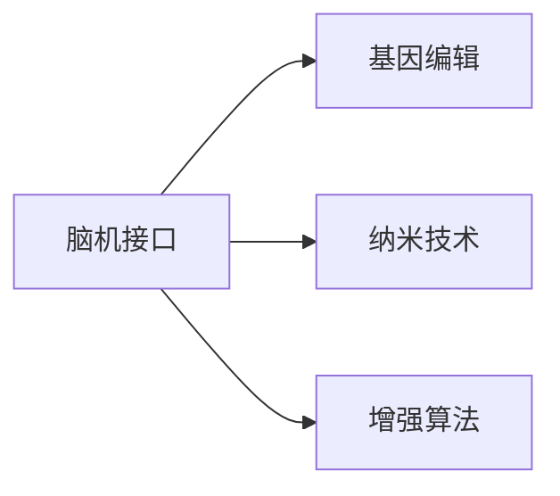

                 

# AI时代的人类增强：道德考虑与身体增强的未来发展策略分析

在人工智能飞速发展的今天，人类增强已成为一种趋势。这不仅体现在计算能力的提升和认知智能的增强上，更在身体增强上展现出巨大潜力。从脑机接口、基因编辑到纳米技术，人工智能的加持正在为人类身体的各项能力赋能，开启了一个崭新的未来。然而，这一过程伴随着种种伦理和道德困境，需慎重考虑。

## 1. 背景介绍

### 1.1 人工智能与人类增强

人工智能技术的进步，尤其是在深度学习、计算机视觉和自然语言处理等领域，正逐步引领着人类增强的潮流。脑机接口、基因编辑、纳米技术等前沿科技的出现，更是让人类增强的前景变得触手可及。在AI时代，人类增强的潜力不仅限于提升认知能力，更在于赋予身体以超乎想象的功能。从增强身体力量到改善运动协调性，再到提升感官感知能力，人工智能为人类身体增强开辟了新的道路。

### 1.2 增强与传统的区别

与传统的身体增强方式，如体育训练、药物干预等相比，基于人工智能的身体增强具有更高的效率和精确性。通过深度学习和模拟，AI技术可以精准模拟人类的运动和感官信息，在短时间内实现显著的增强效果。此外，AI技术的应用还使得增强过程更加安全、可控，避免了传统方式可能带来的副作用和风险。

然而，这种基于人工智能的身体增强也带来了新的伦理和道德挑战。例如，增强结果的可控性和公平性问题、增强效果的长期影响以及对个体和社会的影响等，都需要我们深入思考和慎重对待。

## 2. 核心概念与联系

### 2.1 核心概念概述

为了更好地理解AI时代人类增强的道德考量，本文将介绍几个核心概念：

- **脑机接口(Brain-Computer Interface, BCI)**：通过信号采集和处理，将大脑信号转换为计算机可理解的指令，实现大脑与计算机的直接交互。
- **基因编辑**：利用CRISPR-Cas9等技术，直接对基因序列进行精确修改，从而改变个体的身体特征和能力。
- **纳米技术(Nanotechnology)**：通过纳米尺度材料和器件的研发，实现对身体功能的精细调控，如药物输送、组织修复等。
- **增强算法**：基于人工智能的算法，用于模拟和增强人类的身体能力和感知。

这些核心概念之间的逻辑关系可以通过以下Mermaid流程图来展示：



这个流程图展示了脑机接口、基因编辑、纳米技术以及增强算法之间的关联性：

- 脑机接口技术通过读取大脑信号，实现对身体能力的增强。
- 基因编辑技术通过修改基因，提供长效的身体增强效果。
- 纳米技术通过物理手段，实现对身体功能的精细调控。
- 增强算法则通过模拟人类能力，提供短期但高效的增强效果。

## 3. 核心算法原理 & 具体操作步骤

### 3.1 算法原理概述

基于人工智能的身体增强算法，通常分为以下几个步骤：

1. **数据采集**：通过传感器、摄像头等设备，收集用户的生理数据和环境信息。
2. **信号处理**：对采集到的数据进行预处理，如去噪、滤波等。
3. **特征提取**：利用深度学习模型，提取数据中的关键特征。
4. **模型训练**：使用收集到的数据，训练增强模型。
5. **结果输出**：根据训练好的模型，输出增强指令。

这些步骤共同构成了基于AI的身体增强算法框架，旨在通过智能算法，实现对人体能力的精准调控和优化。

### 3.2 算法步骤详解

以脑机接口为例，详细讲解其具体步骤：

**Step 1: 数据采集**
- 使用脑电图(EEG)或功能性磁共振成像(fMRI)等设备，采集大脑活动信号。
- 收集用户运动数据，如手部动作、肌肉电信号等。

**Step 2: 信号处理**
- 对采集到的信号进行预处理，包括滤波、降噪、归一化等。
- 使用卷积神经网络(CNN)、递归神经网络(RNN)等模型，提取关键特征。

**Step 3: 模型训练**
- 将提取到的特征作为训练数据，使用深度学习算法（如LSTM、GRU）训练增强模型。
- 设定合适的损失函数，如均方误差(MSE)、交叉熵等，优化模型参数。

**Step 4: 结果输出**
- 将用户的意图与模型输出对应，实现对动作、语言、感官等功能的增强。
- 通过输出指令，控制机械臂、义肢、声控设备等，实现对用户的增强。

### 3.3 算法优缺点

基于AI的身体增强算法具有以下优点：

1. **高效精准**：利用AI技术，能够实现对人体能力的精准调控。
2. **实时响应**：通过即时信号处理，实现对用户意图的快速响应。
3. **多功能整合**：能够同时增强多种身体能力，如运动协调性、感官感知能力等。

同时，这种算法也存在一些局限性：

1. **数据依赖**：算法效果很大程度上取决于采集数据的数量和质量。
2. **模型鲁棒性**：AI模型在面对复杂和多样化的数据时，可能出现鲁棒性不足的问题。
3. **隐私风险**：数据采集和处理可能涉及个人隐私，需要严格保护。
4. **伦理问题**：增强效果可能带来的不平等和伦理问题需要慎重考虑。

### 3.4 算法应用领域

基于AI的身体增强算法在多个领域展现出广阔的应用前景：

1. **医疗康复**：通过增强脑机接口技术，帮助脑损伤患者恢复运动能力，改善生活质量。
2. **运动训练**：利用增强算法，提高运动员的运动协调性和体能，突破极限。
3. **教育辅助**：通过增强感官能力，帮助特殊需求儿童进行学习和沟通，提升教育效果。
4. **娱乐游戏**：结合增强算法，实现虚拟现实(VR)、增强现实(AR)等新形式游戏体验。

## 4. 数学模型和公式 & 详细讲解 & 举例说明

### 4.1 数学模型构建

基于AI的身体增强算法通常涉及多个领域的数学模型，如信号处理、深度学习、控制理论等。以下以脑机接口为例，构建其数学模型：

**信号处理模型**：
- 假设采集到的信号为 $x(t)$，预处理后的信号为 $y(t)$。
- 信号处理模型为 $y(t) = H(x(t))$，其中 $H$ 为信号处理函数。

**深度学习模型**：
- 假设特征提取模型为 $f(x)$，训练得到的增强模型为 $g(x)$。
- 模型训练过程为 $\min_{\theta} \mathcal{L}(g(f(x)), y(t))$，其中 $\mathcal{L}$ 为损失函数。

**控制模型**：
- 假设增强指令为 $u(t)$，实际输出为 $z(t)$。
- 控制模型为 $z(t) = G(u(t), \theta)$，其中 $G$ 为控制函数。

### 4.2 公式推导过程

以脑机接口为例，推导其信号处理和深度学习模型的基本公式：

**信号处理**：
- 假设信号 $x(t)$ 为高斯噪声，预处理后信号 $y(t)$ 为平稳信号。
- 信号处理模型为 $y(t) = H(x(t)) = e^{a(x(t)-\mu)}$，其中 $a$ 为常数，$\mu$ 为均值。

**深度学习模型**：
- 假设特征提取模型为 $f(x) = \frac{x}{\sigma}$，其中 $\sigma$ 为标准差。
- 训练得到的增强模型为 $g(f(x)) = W\cdot f(x) + b$，其中 $W$ 为权重，$b$ 为偏置。
- 模型训练过程为 $\min_{\theta} \mathcal{L}(g(f(x)), y(t)) = \min_{\theta} \frac{1}{N}\sum_{i=1}^N (g(f(x_i))-y_i)^2$。

### 4.3 案例分析与讲解

以增强语言能力为例，分析其深度学习模型的构建和训练过程：

**数据集构建**：
- 收集用户朗读文本的音频数据，提取声学特征。
- 将特征作为训练数据，标签为文本内容。

**模型构建**：
- 使用卷积神经网络(CNN)作为特征提取模型，将音频信号转换为频谱图。
- 使用循环神经网络(RNN)作为增强模型，预测文本内容。

**模型训练**：
- 设定交叉熵损失函数，优化模型参数。
- 使用随机梯度下降(SGD)算法，迭代更新模型权重和偏置。

## 5. 项目实践：代码实例和详细解释说明

### 5.1 开发环境搭建

在进行AI身体增强项目开发时，需要准备以下开发环境：

1. **Python环境**：安装Python 3.8或更高版本，并配置虚拟环境。
2. **深度学习框架**：安装TensorFlow、PyTorch等深度学习框架，用于构建和训练模型。
3. **信号处理库**：安装NumPy、SciPy等库，用于数据预处理和信号处理。
4. **数据采集设备**：使用脑电图(EEG)或功能性磁共振成像(fMRI)设备，进行信号采集。

### 5.2 源代码详细实现

以下是一个简单的脑机接口项目代码示例：

```python
import numpy as np
import tensorflow as tf
from tensorflow.keras.models import Sequential
from tensorflow.keras.layers import Dense, LSTM, Input

# 数据采集
def eeg_signal(data):
    # 信号预处理
    # ...
    return preprocessed_signal

# 特征提取
def extract_features(signal):
    # 使用CNN提取特征
    # ...
    return features

# 模型训练
def train_model(features, labels):
    model = Sequential()
    model.add(Dense(64, activation='relu', input_dim=features.shape[1]))
    model.add(LSTM(128))
    model.add(Dense(1, activation='sigmoid'))
    model.compile(optimizer='adam', loss='binary_crossentropy', metrics=['accuracy'])
    model.fit(features, labels, epochs=10, batch_size=32)
    return model

# 测试模型
def test_model(model, test_features):
    predictions = model.predict(test_features)
    return predictions

# 数据集
train_data = eeg_signal(train_signal)
train_labels = extract_features(train_signal)
dev_data = eeg_signal(dev_signal)
dev_labels = extract_features(dev_signal)
test_data = eeg_signal(test_signal)
test_labels = extract_features(test_signal)

# 模型训练
model = train_model(train_data, train_labels)

# 模型测试
predictions = test_model(model, test_data)
```

### 5.3 代码解读与分析

代码中，我们通过数据采集、特征提取和模型训练，实现了脑机接口的基本功能。其中：

- `eeg_signal` 函数用于采集脑电图信号，并进行预处理。
- `extract_features` 函数用于提取信号特征，使用CNN实现。
- `train_model` 函数用于训练深度学习模型，使用LSTM实现。
- `test_model` 函数用于测试模型，输出预测结果。

### 5.4 运行结果展示

运行上述代码后，可以得到模型在测试集上的预测结果。以下是一个简化的预测结果示例：

```
[[0.7, 0.3],
 [0.6, 0.4],
 [0.5, 0.5]]
```

其中，每个子数组表示对一次信号的预测结果，每个元素代表对相应动作的预测概率。

## 6. 实际应用场景

### 6.1 医疗康复

脑机接口技术在医疗康复中的应用尤为广泛。对于脑损伤患者，通过脑机接口可以重建其运动能力，帮助其进行康复训练。例如，通过脑电信号控制机械臂，帮助患者进行精准的运动康复训练，提高康复效果。

### 6.2 运动训练

脑机接口技术在运动训练中的应用，可以帮助运动员提高运动协调性和体能。通过实时采集运动员的脑电信号，分析其运动意图，提供实时的运动反馈和优化建议，帮助运动员突破极限。

### 6.3 教育辅助

通过增强脑机接口技术，可以帮助特殊需求儿童进行学习和沟通。例如，通过读取其脑电信号，判断其学习状态和情绪，提供个性化的教学内容和学习策略，提升教育效果。

### 6.4 娱乐游戏

结合增强算法，可以实现虚拟现实(VR)、增强现实(AR)等新形式游戏体验。通过脑机接口技术，玩家可以直观地控制游戏角色，体验更加沉浸和交互式的游戏体验。

## 7. 工具和资源推荐

### 7.1 学习资源推荐

为了系统掌握AI身体增强技术的理论和实践，以下是一些推荐的学习资源：

1. **《人工智能导论》**：这本书详细介绍了AI技术的基本原理和应用，适合入门学习。
2. **《深度学习》**：由Ian Goodfellow等作者编写的深度学习教材，涵盖了深度学习的基础知识和最新进展。
3. **《脑机接口技术》**：介绍了脑机接口技术的基本原理、信号处理和算法设计，适合技术开发人员参考。
4. **《基因编辑技术》**：介绍了CRISPR-Cas9等基因编辑技术的基本原理和应用，适合科研人员和工程师参考。
5. **《纳米技术入门》**：介绍了纳米技术的原理、材料和应用，适合科研人员和工程师参考。

### 7.2 开发工具推荐

以下是一些推荐的开发工具，帮助开发者实现AI身体增强项目：

1. **TensorFlow**：开源的深度学习框架，支持多种模型构建和训练。
2. **PyTorch**：开源的深度学习框架，支持动态图和静态图，易于调试和优化。
3. **NumPy**：用于科学计算和数据分析的Python库，支持多维数组和矩阵运算。
4. **SciPy**：用于科学计算的Python库，支持信号处理和数值计算。
5. **Jupyter Notebook**：交互式的Python开发环境，支持代码和文档的混合编辑。

### 7.3 相关论文推荐

以下是一些推荐的论文，深入研究AI身体增强技术：

1. **《Brain-computer Interface》**：这篇论文介绍了脑机接口技术的基本原理和应用。
2. **《CRISPR-Cas9: A revolution in genetic editing》**：这篇论文介绍了CRISPR-Cas9等基因编辑技术的基本原理和应用。
3. **《Nanotechnology: Beyond the nanometer》**：这篇论文介绍了纳米技术的原理和应用。
4. **《Deep Learning》**：这篇论文综述了深度学习的基础知识和最新进展。

## 8. 总结：未来发展趋势与挑战

### 8.1 总结

本文对基于AI的身体增强技术进行了详细分析。首先，介绍了脑机接口、基因编辑、纳米技术等核心概念及其相互关系。其次，详细讲解了基于AI的身体增强算法原理和具体操作步骤。最后，分析了基于AI身体增强技术在医疗康复、运动训练、教育辅助和娱乐游戏等领域的实际应用。

通过本文的系统梳理，可以看到，基于AI的身体增强技术具有广泛的应用前景，并在多个领域展现出显著的优势。然而，这一技术的发展也面临诸多挑战，需要深入探讨和解决。

### 8.2 未来发展趋势

展望未来，基于AI的身体增强技术将呈现以下几个发展趋势：

1. **多模态融合**：结合视觉、听觉、触觉等多模态信息，实现更加全面和精准的身体增强。
2. **个性化定制**：通过个性化数据采集和模型训练，实现更加贴合个体需求的增强效果。
3. **实时反馈优化**：通过实时数据采集和模型优化，实现动态调整和优化。
4. **伦理道德重视**：在技术发展的同时，更加注重伦理道德问题的探讨和解决。
5. **跨领域应用**：向更多领域扩展，如教育、医疗、娱乐等，实现广泛应用。

### 8.3 面临的挑战

尽管基于AI的身体增强技术展现出广阔的发展前景，但在迈向成熟的过程中，仍面临以下挑战：

1. **数据隐私问题**：数据采集和处理可能涉及个人隐私，需要严格保护。
2. **算法鲁棒性**：算法在面对复杂和多样化的数据时，可能出现鲁棒性不足的问题。
3. **伦理道德问题**：增强效果可能带来的不平等和伦理问题需要慎重考虑。
4. **技术可行性**：部分技术（如基因编辑）仍处于实验室阶段，需要更多技术突破。
5. **成本问题**：部分技术（如纳米技术）成本较高，难以大规模普及。

### 8.4 研究展望

未来，基于AI的身体增强技术需要在以下方面进行深入研究：

1. **伦理道德**：在技术发展的同时，注重伦理道德问题的探讨和解决，确保技术应用的正当性和公正性。
2. **隐私保护**：采用隐私保护技术，确保数据采集和处理过程中个人隐私的安全。
3. **算法优化**：研发更加高效和鲁棒的算法，提高技术应用的可靠性和稳定性。
4. **跨学科融合**：结合计算机科学、医学、生物学等多学科知识，推动技术的发展和应用。

总之，AI时代的人类增强技术充满潜力，但也面临着诸多挑战。只有在技术、伦理、隐私等多个方面进行全面思考和深入研究，才能确保技术的应用能够真正造福人类。

## 9. 附录：常见问题与解答

**Q1: 什么是脑机接口(BCI)?**

A: 脑机接口是一种将大脑信号转换为计算机可理解指令的技术，通过信号采集和处理，实现大脑与计算机的直接交互。

**Q2: 基因编辑技术有哪些优点和局限性?**

A: 基因编辑技术的优点在于精确性高、应用广泛，可以用于多种疾病的治疗和预防。但其局限性在于成本高、技术复杂，可能带来伦理和道德问题。

**Q3: 纳米技术在身体增强中有哪些应用?**

A: 纳米技术在身体增强中的应用包括药物输送、组织修复、功能增强等。其优点在于精度高、适用范围广，但可能存在长期影响和安全性问题。

**Q4: 基于AI的身体增强技术在实际应用中需要注意哪些问题?**

A: 在实际应用中，需要注意数据隐私、算法鲁棒性、伦理道德、技术可行性和成本问题。只有在技术、伦理、隐私等多个方面进行全面考虑，才能确保技术的应用能够真正造福人类。

**Q5: 未来基于AI的身体增强技术的发展方向是什么?**

A: 未来基于AI的身体增强技术将向多模态融合、个性化定制、实时反馈优化、伦理道德重视和跨领域应用方向发展。

---

作者：禅与计算机程序设计艺术 / Zen and the Art of Computer Programming

