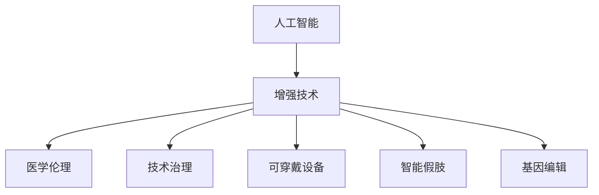

                 

# AI时代的人类增强：道德考虑与身体增强的未来发展趋势分析

> 关键词：人工智能,增强技术,医学伦理,技术治理,可穿戴设备,智能假肢,基因编辑

## 1. 背景介绍

在21世纪，人工智能(AI)技术的飞速发展正在深刻改变人类的生活和工作方式，为人类能力的提升开辟了新的道路。AI时代，通过技术手段增强人类的感知、运动、认知等能力，以适应未来高度复杂的社会和自然环境，成为广泛讨论的热点话题。本文旨在探讨AI时代人类增强技术的发展现状与未来趋势，重点关注医学伦理和身体增强技术的进步。

## 2. 核心概念与联系

### 2.1 核心概念概述

为更好地理解AI时代人类增强技术的核心概念和它们之间的关系，本节将介绍几个关键概念：

- **人工智能(AI)**：指通过计算机算法实现的人类智能模拟，涵盖感知、学习、推理、自我修正等多个方面。
- **增强技术**：指通过AI技术提升人类能力，使其在特定领域或场景下表现超越自然状态。
- **医学伦理**：在医疗领域中，对增强技术的研究、应用和推广需遵守的道德准则和规范。
- **技术治理**：通过政策、法律、伦理等手段，规范和管理AI技术的应用，确保其安全、公正和可控。
- **可穿戴设备**：如智能手表、健身追踪器等，通过AI和传感器实现对人体活动、健康状况的监测和反馈。
- **智能假肢**：利用AI技术设计的假肢，能够模拟真实肢体功能，改善身体残疾人群的生活质量。
- **基因编辑**：如CRISPR-Cas9等技术，能够精确修改人类基因，进而影响个体的身体和认知特征。

这些核心概念之间的逻辑关系可以通过以下Mermaid流程图来展示：



这个流程图展示了大语言模型的核心概念及其之间的关系：

1. 人工智能技术提供底层技术支持。
2. 增强技术以AI为手段，提升人类各项能力。
3. 医学伦理为增强技术的研究和应用提供规范。
4. 技术治理确保增强技术的应用有序、安全。
5. 可穿戴设备、智能假肢和基因编辑等技术，具体实现增强目标。

这些概念共同构成了AI时代人类增强技术的框架，为其进一步发展提供了方向和指引。

## 3. 核心算法原理 & 具体操作步骤

### 3.1 算法原理概述

AI时代的人类增强技术，通常利用深度学习、机器学习等算法模型，对人类能力进行优化和提升。常见的增强技术包括：

- **感知增强**：利用图像识别、语音识别等技术提升人类的视觉、听觉能力。
- **运动增强**：通过机器人技术、智能假肢等实现肢体功能的增强。
- **认知增强**：通过自然语言处理、知识图谱等技术提升人类的思维、决策能力。

这些技术大多以机器学习模型为媒介，通过优化模型参数，在特定任务上实现性能提升。

### 3.2 算法步骤详解

AI时代人类增强技术的实现步骤通常包括以下几个关键环节：

**Step 1: 数据收集与处理**
- 收集与增强目标相关的各类数据，如影像数据、语音数据、生理数据等。
- 清洗和预处理数据，确保数据质量和一致性。

**Step 2: 模型选择与设计**
- 根据增强目标选择合适的模型结构，如卷积神经网络(CNN)用于图像识别，循环神经网络(RNN)用于语音处理。
- 设计适合的损失函数和优化算法，如交叉熵、Adam优化器等。

**Step 3: 模型训练**
- 使用处理好的数据对模型进行训练，调整参数以最小化损失函数。
- 训练过程中使用正则化技术，如Dropout、L2正则，避免过拟合。

**Step 4: 模型评估与优化**
- 在测试集上评估模型性能，通过准确率、召回率等指标衡量模型效果。
- 根据评估结果调整模型结构或参数，进一步优化模型性能。

**Step 5: 应用部署**
- 将训练好的模型部署到实际应用场景中，如智能假肢、可穿戴设备等。
- 监测模型性能，根据实际需求不断优化和改进。

### 3.3 算法优缺点

AI时代人类增强技术具有以下优点：
1. 提升人类能力。通过技术手段增强感知、运动、认知等功能，使人类在特定领域表现更优。
2. 促进社会进步。提高人类生产力和生活质量，促进科技进步和社会发展。
3. 促进医疗进步。通过医学伦理和技术治理，推动医疗服务的改善和普及。

同时，该技术也存在一定的局限性：
1. 依赖高质量数据。数据质量和处理环节对模型效果有很大影响，数据不足或处理不当可能导致模型失效。
2. 技术复杂度高。算法模型的复杂性，需要较高的技术门槛和研发成本。
3. 伦理和安全风险。增强技术的应用可能带来隐私泄露、数据安全、伦理争议等问题。
4. 技术普及难度大。技术实现和应用推广需要克服技术、经济、政策等多方面障碍。

### 3.4 算法应用领域

AI时代人类增强技术广泛应用于多个领域，例如：

- **医疗健康**：利用增强技术提升诊断准确率，辅助手术，改善患者康复体验。
- **教育培训**：通过认知增强技术，提升教学质量，个性化定制学习内容。
- **工业生产**：增强机器操作人员的感知和反应能力，提升生产效率和安全。
- **交通运输**：通过感知增强技术，提升驾驶辅助系统的精准度，改善交通安全。
- **体育竞技**：利用运动增强技术，提高运动员的训练水平和比赛表现。

这些应用展示了增强技术在不同领域中的广阔前景和重要价值。

## 4. 数学模型和公式 & 详细讲解 & 举例说明

### 4.1 数学模型构建

为具体分析AI时代人类增强技术的数学原理，本节将使用数学语言对增强技术进行建模。

假设增强目标为提升视觉感知能力，需通过深度学习模型 $M$ 对图像数据进行训练，模型输入为 $x$，输出为 $y$。训练过程的损失函数为 $L(y, \hat{y})$，其中 $\hat{y}=M(x)$ 为模型预测输出。

定义模型 $M$ 在训练集 $D$ 上的经验风险为：

$$
\mathcal{L}(M) = \frac{1}{N}\sum_{i=1}^N L(y_i, \hat{y}_i)
$$

其中 $y_i$ 为训练集中的真实标签，$\hat{y}_i$ 为模型对 $x_i$ 的预测。

### 4.2 公式推导过程

下面以视觉增强为例，推导深度学习模型 $M$ 的优化过程。

对于模型参数 $\theta$，其优化目标为：

$$
\min_{\theta} \mathcal{L}(M) = \min_{\theta} \frac{1}{N}\sum_{i=1}^N L(y_i, \hat{y}_i)
$$

常用的优化算法，如梯度下降法，通过计算模型参数的梯度 $\nabla_{\theta}\mathcal{L}(M)$ 来更新参数值，公式为：

$$
\theta \leftarrow \theta - \eta \nabla_{\theta}\mathcal{L}(M)
$$

其中 $\eta$ 为学习率，通常需要根据具体任务调整。

### 4.3 案例分析与讲解

以视觉增强为例，利用深度学习模型提升图像识别准确率。假设输入图像数据为 $x \in \mathbb{R}^d$，输出为 $y \in \{0, 1\}$，模型为二分类任务。通过交叉熵损失函数：

$$
L(y, \hat{y}) = -[y\log\hat{y} + (1-y)\log(1-\hat{y})]
$$

定义经验风险：

$$
\mathcal{L}(M) = \frac{1}{N}\sum_{i=1}^N L(y_i, \hat{y}_i)
$$

使用梯度下降法优化模型参数 $\theta$：

$$
\theta \leftarrow \theta - \eta \nabla_{\theta}\mathcal{L}(M)
$$

其中，

$$
\nabla_{\theta}\mathcal{L}(M) = \frac{1}{N}\sum_{i=1}^N [y_i - \hat{y}_i]
$$

通过以上公式，对模型进行迭代优化，直至收敛。

## 5. 项目实践：代码实例和详细解释说明

### 5.1 开发环境搭建

在进行增强技术开发前，需要准备好开发环境。以下是使用Python进行TensorFlow开发的环境配置流程：

1. 安装Anaconda：从官网下载并安装Anaconda，用于创建独立的Python环境。

2. 创建并激活虚拟环境：
```bash
conda create -n tf-env python=3.8 
conda activate tf-env
```

3. 安装TensorFlow：根据CUDA版本，从官网获取对应的安装命令。例如：
```bash
conda install tensorflow -c conda-forge
```

4. 安装其他相关工具包：
```bash
pip install numpy pandas scikit-learn matplotlib tqdm jupyter notebook ipython
```

完成上述步骤后，即可在`tf-env`环境中开始增强技术的开发。

### 5.2 源代码详细实现

这里以视觉增强为例，利用深度学习模型对图像数据进行训练，并实现模型的优化过程。

首先，定义数据处理函数：

```python
import tensorflow as tf
from tensorflow.keras.preprocessing.image import ImageDataGenerator

def preprocess_data(data_dir, batch_size, image_size):
    train_datagen = ImageDataGenerator(rescale=1./255, shear_range=0.2, zoom_range=0.2, horizontal_flip=True)
    train_generator = train_datagen.flow_from_directory(
        data_dir,
        target_size=(image_size, image_size),
        batch_size=batch_size,
        class_mode='binary')
    return train_generator
```

然后，定义模型和优化器：

```python
from tensorflow.keras import layers, models

def build_model():
    model = models.Sequential()
    model.add(layers.Conv2D(32, (3,3), activation='relu', input_shape=(image_size,image_size,3)))
    model.add(layers.MaxPooling2D((2,2)))
    model.add(layers.Conv2D(64, (3,3), activation='relu'))
    model.add(layers.MaxPooling2D((2,2)))
    model.add(layers.Conv2D(128, (3,3), activation='relu'))
    model.add(layers.MaxPooling2D((2,2)))
    model.add(layers.Flatten())
    model.add(layers.Dense(512, activation='relu'))
    model.add(layers.Dense(1, activation='sigmoid'))
    return model

model = build_model()
optimizer = tf.keras.optimizers.Adam(lr=0.001)
```

接着，定义训练和评估函数：

```python
def train_epoch(model, data_generator, batch_size, optimizer):
    model.compile(optimizer=optimizer, loss='binary_crossentropy', metrics=['accuracy'])
    model.fit_generator(data_generator, epochs=10, steps_per_epoch=len(train_generator))
    return model.evaluate_generator(data_generator)
    
def evaluate(model, data_generator, batch_size):
    model.compile(optimizer='adam', loss='binary_crossentropy', metrics=['accuracy'])
    test_loss, test_acc = model.evaluate_generator(data_generator)
    print('Test Loss:', test_loss, 'Test Accuracy:', test_acc)
```

最后，启动训练流程并在测试集上评估：

```python
epochs = 10
batch_size = 32
image_size = 224

train_generator = preprocess_data(train_dir, batch_size, image_size)
test_generator = preprocess_data(test_dir, batch_size, image_size)

for epoch in range(epochs):
    train_loss, train_acc = train_epoch(model, train_generator, batch_size, optimizer)
    print('Epoch:', epoch+1, 'Train Loss:', train_loss, 'Train Accuracy:', train_acc)
    
    test_loss, test_acc = evaluate(model, test_generator, batch_size)
    print('Epoch:', epoch+1, 'Test Loss:', test_loss, 'Test Accuracy:', test_acc)
    
print('Final Model Evaluation:')
evaluate(model, test_generator, batch_size)
```

以上就是使用TensorFlow对深度学习模型进行视觉增强的完整代码实现。可以看到，TensorFlow提供了丰富的工具和API，使得模型的构建、训练和评估过程变得简洁高效。

### 5.3 代码解读与分析

让我们再详细解读一下关键代码的实现细节：

**preprocess_data函数**：
- 定义了一个数据生成器，使用ImageDataGenerator对输入的图像数据进行预处理，包括缩放、旋转、翻转等，增强数据多样性。
- 通过flow_from_directory方法加载目录下的图像数据，并按批次生成训练样本。

**build_model函数**：
- 定义了一个卷积神经网络模型，包括卷积层、池化层、全连接层等。
- 最后一层为输出层，使用sigmoid激活函数，进行二分类任务。

**train_epoch函数**：
- 将模型编译为指定优化器和损失函数，使用fit_generator方法对数据生成器进行训练，循环迭代固定轮数。

**evaluate函数**：
- 评估模型的性能，使用evaluate_generator方法对测试数据生成器进行评估，返回损失和准确率。

**训练流程**：
- 定义总的轮数、批大小和图像尺寸，开始循环迭代
- 每个轮内，先在训练集上进行训练，输出平均损失和准确率
- 在测试集上评估，输出最终测试结果
- 所有轮结束后，在测试集上评估，给出最终测试结果

可以看出，TensorFlow的API设计使得模型的构建和训练过程变得非常直观，开发者可以更专注于算法和数据处理的设计。

## 6. 实际应用场景

### 6.1 医疗健康

在医疗健康领域，AI时代人类增强技术的应用前景广阔。通过增强技术，可以提升医生的诊断效率和精度，改善患者的治疗体验。

- **图像识别**：利用深度学习模型对医学影像进行分析和诊断，如CT、MRI等。例如，通过增强技术提升肿瘤检测的准确率。
- **医疗辅助**：增强技术可以辅助医生进行手术操作，如微创手术、远程医疗等。例如，智能手术机器人结合增强视觉技术，提高手术成功率。
- **健康监测**：通过可穿戴设备实时监测患者的生理数据，及时预警健康风险。例如，智能手表监测心率、血压等指标，预防心血管疾病。

### 6.2 教育培训

在教育培训领域，AI时代人类增强技术可以提升教学质量，促进个性化学习。

- **智能辅导**：利用增强技术构建智能辅导系统，提供个性化学习内容。例如，通过增强技术实现智能推荐系统，推荐适合学生的学习资源。
- **教学评估**：通过增强技术分析学生的学习行为和表现，提供个性化反馈。例如，通过增强技术分析学生的答题情况，优化教学策略。
- **虚拟现实(VR)教学**：利用增强技术构建虚拟现实环境，提供沉浸式教学体验。例如，通过增强技术构建虚拟实验室，进行实验教学。

### 6.3 工业生产

在工业生产领域，AI时代人类增强技术可以提升生产效率和安全性。

- **机器人操作**：利用增强技术提升机器人的感知和操作能力，改善生产流程。例如，通过增强技术提升工业机器人的视觉和触觉感知，提高装配精度。
- **智能监控**：通过增强技术构建智能监控系统，提升生产环境的自动化水平。例如，通过增强技术分析生产线数据，优化生产计划。
- **安全防护**：通过增强技术提升生产环境的安全性，防止事故发生。例如，通过增强技术构建安全监控系统，实时预警潜在风险。

### 6.4 未来应用展望

随着增强技术的不断发展，未来的应用场景将更加多样和复杂。以下是对未来应用前景的展望：

- **通用AI**：未来的增强技术将趋向于通用AI的发展方向，具备更强的自我学习和自我修正能力。例如，通过增强技术构建通用智能系统，实现复杂任务的自动化。
- **跨模态增强**：未来的增强技术将打破单一模态的限制，实现视觉、语音、触觉等多模态数据的协同增强。例如，通过增强技术构建多模态智能系统，提升人机交互的感知能力。
- **个性化增强**：未来的增强技术将更注重个性化需求，提供定制化的解决方案。例如，通过增强技术构建个性化健康管理系统，满足用户的个性化健康需求。
- **伦理与法律**：未来的增强技术需更注重伦理与法律问题，确保技术应用的公平性和安全性。例如，通过增强技术构建伦理审查机制，保障技术的道德应用。

总之，AI时代人类增强技术的应用前景广阔，将在医疗、教育、工业等领域发挥重要作用，推动社会进步和科技进步。

## 7. 工具和资源推荐

### 7.1 学习资源推荐

为帮助开发者系统掌握AI时代人类增强技术的相关知识，以下是一些优质的学习资源：

1. 《深度学习》系列书籍：由多位知名专家共同编写，系统介绍了深度学习的基本概念和算法。
2. Coursera《人工智能导论》课程：由斯坦福大学开设，涵盖人工智能的各个领域，包括强化学习、机器学习等。
3. TensorFlow官方文档：TensorFlow的全面教程和API文档，包含大量案例和示例代码。
4. OpenAI《人工智能伦理》系列讲座：探讨人工智能技术的伦理和法律问题，提供前沿视角。
5. Kaggle机器学习竞赛平台：提供大量的实际数据集和竞赛任务，锻炼实际应用能力。

通过对这些资源的学习实践，相信你一定能够快速掌握AI时代人类增强技术，并用于解决实际问题。

### 7.2 开发工具推荐

高效的工具支持是开发增强技术的重要保障。以下是几款常用的工具：

1. TensorFlow：Google主导的开源深度学习框架，支持灵活的计算图和分布式训练。
2. PyTorch：Facebook开发的深度学习框架，易于使用，支持动态计算图和GPU加速。
3. Keras：高层次的深度学习API，基于TensorFlow和Theano，简化模型构建过程。
4. Jupyter Notebook：交互式开发环境，支持Python、R等语言，方便代码调试和展示。
5. VS Code：轻量级的IDE，支持多种编程语言和扩展，适合开发复杂项目。

合理利用这些工具，可以显著提升AI时代人类增强技术的开发效率，加快创新迭代的步伐。

### 7.3 相关论文推荐

AI时代人类增强技术的研究涉及多个学科，以下是一些具有代表性的相关论文：

1. "Deep Residual Learning for Image Recognition"（ResNet论文）：提出残差网络，解决深度学习模型的梯度消失问题，推动了视觉增强技术的发展。
2. "Towards General Purpose AI"（通用AI论文）：探讨了构建通用AI的路径和挑战，为未来增强技术的发展提供方向。
3. "Ethics in the Design, Development and Application of AI and Robotics"：深入讨论了人工智能技术的伦理问题，提供决策指南。
4. "Human-AI Collaboration: A Survey"：综述了人机协同技术的发展现状和应用前景，为未来增强技术的研究提供参考。
5. "Optimization Algorithms for Deep Learning"：探讨了深度学习模型的优化算法，为模型训练和微调提供理论基础。

这些论文代表了大语言模型微调技术的发展脉络。通过学习这些前沿成果，可以帮助研究者把握学科前进方向，激发更多的创新灵感。

## 8. 总结：未来发展趋势与挑战

### 8.1 总结

本文对AI时代人类增强技术进行了全面系统的介绍。首先阐述了增强技术的研究背景和重要性，明确了其对提升人类能力和推动社会进步的巨大价值。其次，从原理到实践，详细讲解了增强技术的数学原理和核心步骤，给出了增强技术开发的全流程示例。同时，本文还探讨了增强技术在医疗健康、教育培训、工业生产等领域的广泛应用，展示了其广阔的发展前景。

通过本文的系统梳理，可以看到，AI时代人类增强技术正在深刻改变人类的生产和生活方式，为各行各业带来了新的机遇和挑战。未来，随着技术的持续演进和应用的不断拓展，增强技术必将为人类社会带来更加深远的影响。

### 8.2 未来发展趋势

展望未来，AI时代人类增强技术将呈现以下几个发展趋势：

1. **多模态融合**：未来的增强技术将打破单一模态的限制，实现视觉、语音、触觉等多模态数据的协同增强，提升感知和决策能力。
2. **通用AI**：未来的增强技术将趋向于通用AI的发展方向，具备更强的自我学习和自我修正能力，能够处理复杂多变的任务。
3. **伦理与安全**：未来的增强技术需更注重伦理与安全问题，确保技术应用的公平性和安全性，避免技术滥用。
4. **个性化与定制化**：未来的增强技术将更注重个性化需求，提供定制化的解决方案，满足用户的个性化需求。
5. **跨领域应用**：未来的增强技术将在更多领域得到应用，如金融、物流、农业等，推动相关行业的数字化转型。

以上趋势展示了AI时代人类增强技术的广阔前景和重要价值。这些方向的探索发展，必将进一步提升增强技术的效果和应用范围，为人类社会带来更加深远的影响。

### 8.3 面临的挑战

尽管AI时代人类增强技术已经取得了显著进展，但在迈向更加智能化、普适化应用的过程中，仍面临诸多挑战：

1. **数据隐私与安全**：增强技术的广泛应用将带来大量数据收集和处理，如何保障数据隐私和安全，避免数据泄露和滥用，是一个重要课题。
2. **伦理与法律问题**：增强技术的快速应用可能引发伦理和法律争议，如何确保技术的公平性、透明性和责任性，需要制定相应的规范和标准。
3. **技术复杂度**：增强技术的开发和应用需要高水平的技术支撑，如何降低技术门槛，实现技术的普及和推广，是一个重要挑战。
4. **技术均衡发展**：增强技术的发展需要跨学科的协同合作，如何平衡不同领域的发展，确保技术均衡推进，是一个重要课题。
5. **社会接受度**：增强技术的推广可能引发社会对技术的不信任和抵触情绪，如何提升公众对技术的理解和接受度，是一个重要课题。

解决这些挑战，需要学界和产业界的共同努力，推动技术规范和伦理法律的完善，促进技术的健康发展。

### 8.4 研究展望

面对AI时代人类增强技术面临的诸多挑战，未来的研究需要在以下几个方面寻求新的突破：

1. **跨学科合作**：增强技术的发展需要跨学科的协同合作，结合人工智能、心理学、伦理学等多领域知识，推动技术全面发展。
2. **技术标准化**：制定增强技术的标准化规范和伦理准则，确保技术应用的公平性和安全性。
3. **公众教育与参与**：提升公众对增强技术的理解和接受度，促进技术在社会各界的普及和应用。
4. **人机协同设计**：设计更加符合人类需求和使用习惯的增强系统，提升人机协同效果，实现技术与人类的和谐共生。
5. **技术与文化融合**：探索增强技术与人文、艺术、哲学等领域的融合，推动技术的深度发展。

这些研究方向的探索，必将引领AI时代人类增强技术迈向更高的台阶，为构建人机协同的智能社会提供新的路径。总之，AI时代人类增强技术的研究需要多路径协同发力，共同推动技术的健康发展，为人类社会带来更加深远的影响。

## 9. 附录：常见问题与解答

**Q1：增强技术与人类智能的关系如何？**

A: 增强技术旨在提升人类的感知、运动、认知等功能，但并不意味着代替人类智能。增强技术是对人类智能的补充和提升，使人类在特定领域表现更优，但不会取代人类创造性思维和情感交流的能力。

**Q2：增强技术如何实现多模态数据融合？**

A: 多模态数据融合通常涉及跨学科知识，如计算机视觉、语音处理、自然语言处理等。通过将不同模态的数据进行融合，利用深度学习模型提取多模态特征，进行联合分析，可以获得更全面的感知和决策能力。

**Q3：增强技术在应用过程中如何保障数据隐私和安全？**

A: 增强技术需遵循数据隐私和安全的基本原则，如最小化数据收集、加强数据加密、确保数据匿名化等。同时，应建立完善的数据管理机制，防止数据泄露和滥用。

**Q4：增强技术在实际应用中面临哪些伦理问题？**

A: 增强技术的伦理问题包括但不限于数据隐私、技术公平性、技术透明性等。在应用过程中，应确保技术的公平性，避免技术滥用，保护弱势群体权益，确保技术的透明性和可解释性。

**Q5：增强技术如何实现个性化与定制化？**

A: 增强技术可通过个性化推荐、定制化设计等方式实现。例如，通过分析用户的行为和偏好，推荐适合用户的增强技术方案，或根据用户需求设计定制化的增强设备。

通过本文的系统梳理，可以看到，AI时代人类增强技术正在深刻改变人类的生产和生活方式，为各行各业带来了新的机遇和挑战。未来，随着技术的持续演进和应用的不断拓展，增强技术必将为人类社会带来更加深远的影响。

