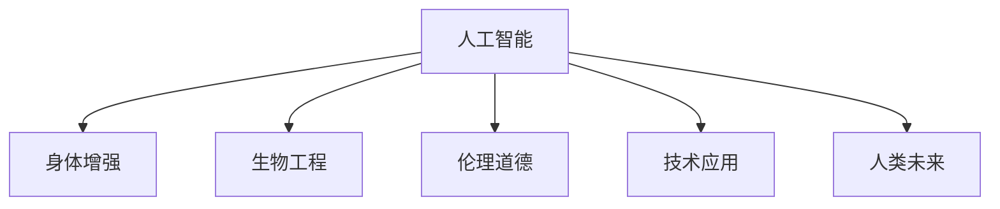

                 

# AI时代的人类增强：道德考虑与身体增强的未来挑战与机遇

> 关键词：
- 人工智能(AI)
- 身体增强(Body Enhancement)
- 道德伦理学(Ethics)
- 生物工程(Bioengineering)
- 技术应用(Applications)
- 人类未来(Human Enhancement)
- 风险管理(Risk Management)

## 1. 背景介绍

随着人工智能(AI)技术的飞速发展，越来越多的领域开始引入AI技术来提升人类能力。从医疗、教育到娱乐，AI技术的渗透极大地改变了人类的生产生活方式。然而，这些技术的广泛应用也引发了一系列复杂的伦理道德问题，尤其是身体增强(Body Enhancement)领域，更是众说纷纭，争论不休。

### 1.1 身体增强的兴起

身体增强通常指的是通过科技手段，对人类身体或大脑进行改造，以提升人类的身体或认知能力。这些技术包括但不限于基因编辑、脑机接口、生物机械增强等。当前，身体增强技术正处于快速发展期，各种新兴技术如CRISPR基因编辑、神经调制器、仿生假肢等，已经在实验室或临床试验中取得了初步成功。

身体增强技术的崛起，源于人类对提升自身能力的永恒追求。从古至今，人们通过各种方式不断探索自身的极限。而现代科技的加持，使得这种追求更加现实，甚至触手可及。无论是运动运动员通过基因编辑提升体能，还是科研人员通过神经接口增强脑力，身体增强正在逐步从科幻走向现实。

### 1.2 伦理道德的复杂性

然而，身体增强技术的发展也引发了一系列复杂的伦理道德问题。这些问题涉及个人自由、公平正义、科技边界等多个层面。例如，通过基因编辑改造婴儿，是否会影响其自主选择权？通过神经接口增强大脑功能，是否会带来认知操控的风险？这些问题的答案尚不明确，甚至存在严重分歧。

面对这些伦理道德困境，社会各界开始对AI时代的人类增强进行深入讨论。一方面，人们看到了技术带来的巨大潜力，期待通过身体增强技术提升人类生存质量和幸福感；另一方面，也担心技术的不当应用可能带来新的风险和问题。如何平衡技术发展与伦理道德，成为AI时代需要认真面对的挑战。

## 2. 核心概念与联系

### 2.1 核心概念概述

为更好地理解AI时代人类增强的伦理道德问题，本节将介绍几个密切相关的核心概念：

- **人工智能(AI)**：一种能够模拟人类智能行为的技术，包括但不限于机器学习、深度学习、自然语言处理等。
- **身体增强(Body Enhancement)**：通过科技手段对人类身体或大脑进行改造，提升人类的身体或认知能力。
- **生物工程(Bioengineering)**：涉及生物学、工程学和医学的交叉学科，旨在通过工程技术解决生物系统的问题。
- **伦理道德(Ethics)**：研究人类行为的道德原则和规范，探讨科技发展的伦理界限。
- **技术应用(Applications)**：具体应用场景中AI技术的表现形式，如自动驾驶、机器人、增强现实等。
- **人类未来(Human Enhancement)**：通过技术手段提升人类的生存质量、幸福感、认知能力的愿景。

这些核心概念之间的逻辑关系可以通过以下Mermaid流程图来展示：



这个流程图展示了大语言模型的核心概念及其之间的关系：

1. 人工智能通过各种技术手段（如生物工程）对人类身体和大脑进行改造，实现增强效果。
2. 伦理道德是指导技术应用的原则，确保技术发展不偏离人类福祉的初衷。
3. 技术应用体现人工智能的具体表现形式，如增强现实、自动驾驶等。
4. 人类未来通过技术应用实现，并进一步推动技术发展。

## 3. 核心算法原理 & 具体操作步骤

### 3.1 算法原理概述

身体增强技术的核心算法原理主要基于基因编辑、神经接口、仿生机械等技术手段，旨在通过对人类身体或大脑进行改造，提升人类的认知和物理能力。这些技术的发展，需要依赖AI和生物工程技术的融合，实现对人类身体的精确控制和优化。

### 3.2 算法步骤详解

以基因编辑为例，其核心算法步骤通常包括以下几个环节：

1. **目标基因选择**：根据需求选择合适的基因进行编辑，如增强肌肉力量、提升免疫力、改善认知能力等。
2. **基因序列设计**：设计目标基因的编辑序列，包括引物设计和酶切位点选择。
3. **基因编辑技术实施**：采用CRISPR-Cas9等基因编辑技术，进行目标基因的精确修改。
4. **编辑效果评估**：通过实验验证基因编辑的效果，并进行优化调整。

### 3.3 算法优缺点

身体增强技术的算法原理和操作步骤具有以下优缺点：

**优点：**

1. **精确性高**：基因编辑技术能够实现对目标基因的精确修改，确保增强效果的可控性和稳定性。
2. **效果显著**：通过基因编辑，可以显著提升人类的物理能力和认知水平，带来巨大的生活改进。
3. **应用广泛**：基因编辑技术可应用于多个领域，如运动、健康、认知等，潜力巨大。

**缺点：**

1. **伦理争议**：基因编辑涉及伦理道德问题，如基因隐私、基因编辑的应用边界等，引发广泛争议。
2. **技术风险**：基因编辑存在误操作和不可逆的风险，一旦发生错误可能带来严重后果。
3. **成本高昂**：基因编辑技术目前仍处于昂贵阶段，大规模应用面临经济障碍。

### 3.4 算法应用领域

身体增强技术的应用领域非常广泛，涵盖了医疗、运动、教育等多个方面。以下是几个典型的应用场景：

1. **医疗领域**：通过基因编辑治疗遗传病，提升癌症治疗效果，改善免疫系统功能等。
2. **运动领域**：通过基因编辑增强运动员体能，提升竞技水平，减少运动伤害。
3. **教育领域**：通过神经接口增强学生的认知能力，提高学习效率，优化教育质量。
4. **娱乐领域**：通过神经接口增强娱乐体验，如虚拟现实、游戏等，带来新的沉浸式体验。

## 4. 数学模型和公式 & 详细讲解 & 举例说明

### 4.1 数学模型构建

以基因编辑为例，其数学模型可以描述为：

设目标基因序列为 $G$，编辑位点为 $S$，目标序列为 $T$。则基因编辑的基本模型可以表示为：

$$
T = \text{Edit}(G, S)
$$

其中 $\text{Edit}$ 表示基因编辑函数，作用是对 $G$ 中指定 $S$ 位置进行修改，使其变为 $T$。

### 4.2 公式推导过程

基因编辑的具体实现步骤包括引物设计、酶切位点选择和酶切效率计算。以CRISPR-Cas9为例，其编辑过程可以表示为：

1. **引物设计**：
   - 设计两条特异性引物 $P1$ 和 $P2$，用于识别目标序列 $G$。
   - 引物设计需满足碱基配对原则和热稳定性，以保证引物效率和特异性。

   引物设计的数学模型为：

   $$
   \text{Pr}(P) = \text{Score}(P1, P2, G)
   $$

2. **酶切位点选择**：
   - 选择目标序列 $G$ 中的酶切位点 $S$，确保Cas9蛋白能够在正确位置进行切割。
   - 酶切位点需满足特定序列规则，如AAGAGATCT。

   酶切位点选择的数学模型为：

   $$
   \text{Opt}(S) = \text{MaxScore}(S, G)
   $$

3. **酶切效率计算**：
   - 计算Cas9蛋白在目标序列 $G$ 中的切割效率 $E$，确保切割精确性。
   - 切割效率与引物设计、酶切位点等因素有关。

   酶切效率的数学模型为：

   $$
   E = f(\text{Pr}(P), \text{Opt}(S), G)
   $$

### 4.3 案例分析与讲解

以增强肌肉力量为例，其基因编辑的目标基因序列为 $G_{muscle}$，目标序列为 $T_{muscle}$，酶切位点为 $S_{muscle}$。设目标基因中需要增强的肌肉相关基因基因为 $G_{myosin}$，则基因编辑过程可以表示为：

$$
T_{muscle} = \text{Edit}(G_{muscle}, S_{muscle})
$$

其中 $S_{muscle}$ 为特异性酶切位点，用于精确修改 $G_{myosin}$ 基因序列，使其能够产生增强肌肉力量的相关蛋白质。

## 5. 项目实践：代码实例和详细解释说明

### 5.1 开发环境搭建

要进行基因编辑等身体增强技术的项目实践，需要搭建相应的开发环境。以下是基本的搭建流程：

1. **安装生物信息学软件**：如BGI BioX、BLAST、DNA-assembler等。
2. **安装基因编辑软件**：如CRISPR-Cas9、Cas9n等。
3. **配置实验设备**：包括实验室、PCR仪、测序仪等。
4. **搭建数据库**：用于存储和检索基因序列信息。

### 5.2 源代码详细实现

以基因编辑为例，以下是CRISPR-Cas9的Python代码实现：

```python
import crisprCas9

# 定义目标基因序列
target_sequence = 'AGGTGGCGTGGAGCGCGGTGATGGCCCGCCCGGGTCCAGGCAGACGGAAGACGGACGGGCCAACACCAACGAGGCCAAGACCGCCAACACCGGAGGCCGAGGTGGCGGAGCCCGGCAACGACGCCGAGAGGGCGAGGTAGCCGCCGCGGCGGCGCGGTGCCCGGGCGGAGGATCCGGCCGCCAGGAGCCGCGGGTCGCGCCGGCCGCGCGGCCAGGGCGCGAGCCGCAGGGCGCGGCGGCGGGGCGGCGGCCGCCGGGCCGGCGGGGCAGCGCGCGCCGACGCGGCGGCCGGCGCCGCCGCCGGCGCGGGCGGCCGCGCGGCGCGGGCCGCCGCCGCGGCCGCCGCCGCGGCCGCGGCCGCCGCCGCGGCCGCCGCCGCCGCCGCGGCCGCGCGGGCGCGCGCCGCCGCGCGCGCGCGCCGCGGCCGCGGCCGCCGCCGCCGCGCGCCGCGGCCGCCGCGCGGCCGCCGCGCGCGCGCGGCGCGGCGCGCGCGCCGCGCCGCGCGGCGCCGCGCCGCGCCGCCGCCGCCGCCGCCGCCGCCGCCGCCGCCGCCGCCGCCGCCGCCGCCGCCGCCGCCGCCGCCGCCGCCGCCGCCGCCGCCGCCGCCGCCGCCGCCGCCGCCGCCGCCGCCGCCGCCGCCGCCGCCGCCGCCGCCGCCGCCGCCGCCGCCGCCGCCGCCGCCGCCGCCGCCGCCGCCGCCGCCGCCGCCGCCGCCGCCGCCGCCGCCGCCGCCGCCGCCGCCGCCGCCGCCGCCGCCGCCGCCGCCGCCGCCGCCGCCGCCGCCGCCGCCGCCGCCGCCGCCGCCGCCGCCGCCGCCGCCGCCGCCGCCGCCGCCGCCGCCGCCGCCGCCGCCGCCGCCGCCGCCGCCGCCGCCGCCGCCGCCGCCGCCGCCGCCGCCGCCGCCGCCGCCGCCGCCGCCGCCGCCGCCGCCGCCGCCGCCGCCGCCGCCGCCGCCGCCGCCGCCGCCGCCGCCGCCGCCGCCGCCGCCGCCGCCGCCGCCGCCGCCGCCGCCGCCGCCGCCGCCGCCGCCGCCGCCGCCGCCGCCGCCGCCGCCGCCGCCGCCGCCGCCGCCGCCGCCGCCGCCGCCGCCGCCGCCGCCGCCGCCGCCGCCGCCGCCGCCGCCGCCGCCGCCGCCGCCGCCGCCGCCGCCGCCGCCGCCGCCGCCGCCGCCGCCGCCGCCGCCGCCGCCGCCGCCGCCGCCGCCGCCGCCGCCGCCGCCGCCGCCGCCGCCGCCGCCGCCGCCGCCGCCGCCGCCGCCGCCGCCGCCGCCGCCGCCGCCGCCGCCGCCGCCGCCGCCGCCGCCGCCGCCGCCGCCGCCGCCGCCGCCGCCGCCGCCGCCGCCGCCGCCGCCGCCGCCGCCGCCGCCGCCGCCGCCGCCGCCGCCGCCGCCGCCGCCGCCGCCGCCGCCGCCGCCGCCGCCGCCGCCGCCGCCGCCGCCGCCGCCGCCGCCGCCGCCGCCGCCGCCGCCGCCGCCGCCGCCGCCGCCGCCGCCGCCGCCGCCGCCGCCGCCGCCGCCGCCGCCGCCGCCGCCGCCGCCGCCGCCGCCGCCGCCGCCGCCGCCGCCGCCGCCGCCGCCGCCGCCGCCGCCGCCGCCGCCGCCGCCGCCGCCGCCGCCGCCGCCGCCGCCGCCGCCGCCGCCGCCGCCGCCGCCGCCGCCGCCGCCGCCGCCGCCGCCGCCGCCGCCGCCGCCGCCGCCGCCGCCGCCGCCGCCGCCGCCGCCGCCGCCGCCGCCGCCGCCGCCGCCGCCGCCGCCGCCGCCGCCGCCGCCGCCGCCGCCGCCGCCGCCGCCGCCGCCGCCGCCGCCGCCGCCGCCGCCGCCGCCGCCGCCGCCGCCGCCGCCGCCGCCGCCGCCGCCGCCGCCGCCGCCGCCGCCGCCGCCGCCGCCGCCGCCGCCGCCGCCGCCGCCGCCGCCGCCGCCGCCGCCGCCGCCGCCGCCGCCGCCGCCGCCGCCGCCGCCGCCGCCGCCGCCGCCGCCGCCGCCGCCGCCGCCGCCGCCGCCGCCGCCGCCGCCGCCGCCGCCGCCGCCGCCGCCGCCGCCGCCGCCGCCGCCGCCGCCGCCGCCGCCGCCGCCGCCGCCGCCGCCGCCGCCGCCGCCGCCGCCGCCGCCGCCGCCGCCGCCGCCGCCGCCGCCGCCGCCGCCGCCGCCGCCGCCGCCGCCGCCGCCGCCGCCGCCGCCGCCGCCGCCGCCGCCGCCGCCGCCGCCGCCGCCGCCGCCGCCGCCGCCGCCGCCGCCGCCGCCGCCGCCGCCGCCGCCGCCGCCGCCGCCGCCGCCGCCGCCGCCGCCGCCGCCGCCGCCGCCGCCGCCGCCGCCGCCGCCGCCGCCGCCGCCGCCGCCGCCGCCGCCGCCGCCGCCGCCGCCGCCGCCGCCGCCGCCGCCGCCGCCGCCGCCGCCGCCGCCGCCGCCGCCGCCGCCGCCGCCGCCGCCGCCGCCGCCGCCGCCGCCGCCGCCGCCGCCGCCGCCGCCGCCGCCGCCGCCGCCGCCGCCGCCGCCGCCGCCGCCGCCGCCGCCGCCGCCGCCGCCGCCGCCGCCGCCGCCGCCGCCGCCGCCGCCGCCGCCGCCGCCGCCGCCGCCGCCGCCGCCGCCGCCGCCGCCGCCGCCGCCGCCGCCGCCGCCGCCGCCGCCGCCGCCGCCGCCGCCGCCGCCGCCGCCGCCGCCGCCGCCGCCGCCGCCGCCGCCGCCGCCGCCGCCGCCGCCGCCGCCGCCGCCGCCGCCGCCGCCGCCGCCGCCGCCGCCGCCGCCGCCGCCGCCGCCGCCGCCGCCGCCGCCGCCGCCGCCGCCGCCGCCGCCGCCGCCGCCGCCGCCGCCGCCGCCGCCGCCGCCGCCGCCGCCGCCGCCGCCGCCGCCGCCGCCGCCGCCGCCGCCGCCGCCGCCGCCGCCGCCGCCGCCGCCGCCGCCGCCGCCGCCGCCGCCGCCGCCGCCGCCGCCGCCGCCGCCGCCGCCGCCGCCGCCGCCGCCGCCGCCGCCGCCGCCGCCGCCGCCGCCGCCGCCGCCGCCGCCGCCGCCGCCGCCGCCGCCGCCGCCGCCGCCGCCGCCGCCGCCGCCGCCGCCGCCGCCGCCGCCGCCGCCGCCGCCGCCGCCGCCGCCGCCGCCGCCGCCGCCGCCGCCGCCGCCGCCGCCGCCGCCGCCGCCGCCGCCGCCGCCGCCGCCGCCGCCGCCGCCGCCGCCGCCGCCGCCGCCGCCGCCGCCGCCGCCGCCGCCGCCGCCGCCGCCGCCGCCGCCGCCGCCGCCGCCGCCGCCGCCGCCGCCGCCGCCGCCGCCGCCGCCGCCGCCGCCGCCGCCGCCGCCGCCGCCGCCGCCGCCGCCGCCGCCGCCGCCGCCGCCGCCGCCGCCGCCGCCGCCGCCGCCGCCGCCGCCGCCGCCGCCGCCGCCGCCGCCGCCGCCGCCGCCGCCGCCGCCGCCGCCGCCGCCGCCGCCGCCGCCGCCGCCGCCGCCGCCGCCGCCGCCGCCGCCGCCGCCGCCGCCGCCGCCGCCGCCGCCGCCGCCGCCGCCGCCGCCGCCGCCGCCGCCGCCGCCGCCGCCGCCGCCGCCGCCGCCGCCGCCGCCGCCGCCGCCGCCGCCGCCGCCGCCGCCGCCGCCGCCGCCGCCGCCGCCGCCGCCGCCGCCGCCGCCGCCGCCGCCGCCGCCGCCGCCGCCGCCGCCGCCGCCGCCGCCGCCGCCGCCGCCGCCGCCGCCGCCGCCGCCGCCGCCGCCGCCGCCGCCGCCGCCGCCGCCGCCGCCGCCGCCGCCGCCGCCGCCGCCGCCGCCGCCGCCGCCGCCGCCGCCGCCGCCGCCGCCGCCGCCGCCGCCGCCGCCGCCGCCGCCGCCGCCGCCGCCGCCGCCGCCGCCGCCGCCGCCGCCGCCGCCGCCGCCGCCGCCGCCGCCGCCGCCGCCGCCGCCGCCGCCGCCGCCGCCGCCGCCGCCGCCGCCGCCGCCGCCGCCGCCGCCGCCGCCGCCGCCGCCGCCGCCGCCGCCGCCGCCGCCGCCGCCGCCGCCGCCGCCGCCGCCGCCGCCGCCGCCGCCGCCGCCGCCGCCGCCGCCGCCGCCGCCGCCGCCGCCGCCGCCGCCGCCGCCGCCGCCGCCGCCGCCGCCGCCGCCGCCGCCGCCGCCGCCGCCGCCGCCGCCGCCGCCGCCGCCGCCGCCGCCGCCGCCGCCGCCGCCGCCGCCGCCGCCGCCGCCGCCGCCGCCGCCGCCGCCGCCGCCGCCGCCGCCGCCGCCGCCGCCGCCGCCGCCGCCGCCGCCGCCGCCGCCGCCGCCGCCGCCGCCGCCGCCGCCGCCGCCGCCGCCGCCGCCGCCGCCGCCGCCGCCGCCGCCGCCGCCGCCGCCGCCGCCGCCGCCGCCGCCGCCGCCGCCGCCGCCGCCGCCGCCGCCGCCGCCGCCGCCGCCGCCGCCGCCGCCGCCGCCGCCGCCGCCGCCGCCGCCGCCGCCGCCGCCGCCGCCGCCGCCGCCGCCGCCGCCGCCGCCGCCGCCGCCGCCGCCGCCGCCGCCGCCGCCGCCGCCGCCGCCGCCGCCGCCGCCGCCGCCGCCGCCGCCGCCGCCGCCGCCGCCGCCGCCGCCGCCGCCGCCGCCGCCGCCGCCGCCGCCGCCGCCGCCGCCGCCGCCGCCGCCGCCGCCGCCGCCGCCGCCGCCGCCGCCGCCGCCGCCGCCGCCGCCGCCGCCGCCGCCGCCGCCGCCGCCGCCGCCGCCGCCGCCGCCGCCGCCGCCGCCGCCGCCGCCGCCGCCGCCGCCGCCGCCGCCGCCGCCGCCGCCGCCGCCGCCGCCGCCGCCGCCGCCGCCGCCGCCGCCGCCGCCGCCGCCGCCGCCGCCGCCGCCGCCGCCGCCGCCGCCGCCGCCGCCGCCGCCGCCGCCGCCGCCGCCGCCGCCGCCGCCGCCGCCGCCGCCGCCGCCGCCGCCGCCGCCGCCGCCGCCGCCGCCGCCGCCGCCGCCGCCGCCGCCGCCGCCGCCGCCGCCGCCGCCGCCGCCGCCGCCGCCGCCGCCGCCGCCGCCGCCGCCGCCGCCGCCGCCGCCGCCGCCGCCGCCGCCGCCGCCGCCGCCGCCGCCGCCGCCGCCGCCGCCGCCGCCGCCGCCGCCGCCGCCGCCGCCGCCGCCGCCGCCGCCGCCGCCGCCGCCGCCGCCGCCGCCGCCGCCGCCGCCGCCGCCGCCGCCGCCGCCGCCGCCGCCGCCGCCGCCGCCGCCGCCGCCGCCGCCGCCGCCGCCGCCGCCGCCGCCGCCGCCGCCGCCGCCGCCGCCGCCGCCGCCGCCGCCGCCGCCGCCGCCGCCGCCGCCGCCGCCGCCGCCGCCGCCGCCGCCGCCGCCGCCGCCGCCGCCGCCGCCGCCGCCGCCGCCGCCGCCGCCGCCGCCGCCGCCGCCGCCGCCGCCGCCGCCGCCGCCGCCGCCGCCGCCGCCGCCGCCGCCGCCGCCGCCGCCGCCGCCGCCGCCGCCGCCGCCGCCGCCGCCGCCGCCGCCGCCGCCGCCGCCGCCGCCGCCGCCGCCGCCGCCGCCGCCGCCGCCGCCGCCGCCGCCGCCGCCGCCGCCGCCGCCGCCGCCGCCGCCGCCGCCGCCGCCGCCGCCGCCGCCGCCGCCGCCGCCGCCGCCGCCGCCGCCGCCGCCGCCGCCGCCGCCGCCGCCGCCGCCGCCGCCGCCGCCGCCGCCGCCGCCGCCGCCGCCGCCGCCGCCGCCGCCGCCGCCGCCGCCGCCGCCGCCGCCGCCGCCGCCGCCGCCGCCGCCGCCGCCGCCGCCGCCGCCGCCGCCGCCGCCGCCGCCGCCGCCGCCGCCGCCGCCGCCGCCGCCGCCGCCGCCGCCGCCGCCGCCGCCGCCGCCGCCGCCGCCGCCGCCGCCGCCGCCGCCGCCGCCGCCGCCGCCGCCGCCGCCGCCGCCGCCGCCGCCGCCGCCGCCGCCGCCGCCGCCGCCGCCGCCGCCGCCGCCGCCGCCGCCGCCGCCGCCGCCGCCGCCGCCGCCGCCGCCGCCGCCGCCGCCGCCGCCGCCGCCGCCGCCGCCGCCGCCGCCGCCGCCGCCGCCGCCGCCGCCGCCGCCGCCGCCGCCGCCGCCGCCGCCGCCGCCGCCGCCGCCGCCGCCGCCGCCGCCGCCGCCGCCGCCGCCGCCGCCGCCGCCGCCGCCGCCGCCGCCGCCGCCGCCGCCGCCGCCGCCGCCGCCGCCGCCGCCGCCGCCGCCGCCGCCGCCGCCGCCGCCGCCGCCGCCGCCGCCGCCGCCGCCGCCGCCGCCGCCGCCGCCGCCGCCGCCGCCGCCGCCGCCGCCGCCGCCGCCGCCGCCGCCGCCGCCGCCGCCGCCGCCGCCGCCGCCGCCGCCGCCGCCGCCGCCGCCGCCGCCGCCGCCGCCGCCGCCGCCGCCGCCGCCGCCGCCGCCGCCGCCGCCGCCGCCGCCGCCGCCGCCGCCGCCGCCGCCGCCGCCGCCGCCGCCGCCGCCGCCGCCGCCGCCGCCGCCGCCGCCGCCGCCGCCGCCGCCGCCGCCGCCGCCGCCGCCGCCGCCGCCGCCGCCGCCGCCGCCGCCGCCGCCGCCGCCGCCGCCGCCGCCGCCGCCGCCGCCGCCGCCGCCGCCGCCGCCGCCGCCGCCGCCGCCGCCGCCGCCGCCGCCGCCGCCGCCGCCGCCGCCGCCGCCGCCGCCGCCGCCGCCGCCGCCGCCGCCGCCGCCGCCGCCGCCGCCGCCGCCGCCGCCGCCGCCGCCGCCGCCGCCGCCGCCGCCGCCGCCGCCGCCGCCGCCGCCGCCGCCGCCGCCGCCGCCGCCGCCGCCGCCGCCGCCGCCGCCGCCGCCGCCGCCGCCGCCGCCGCCGCCGCCGCCGCCGCCGCCGCCGCCGCCGCCGCCGCCGCCGCCGCCGCCGCCGCCGCCGCCGCCGCCGCCGCCGCCGCCGCCGCCGCCGCCGCCGCCGCCGCCGCCGCCGCCGCCGCCGCCGCCGCCGCCGCCGCCGCCGCCGCCGCCGCCGCCGCCGCCGCCGCCGCCGCCGCCGCCGCCGCCGCCGCCGCCGCCGCCGCCGCCGCCGCCGCCGCCGCCGCCGCCGCCGCCGCCGCCGCCGCCGCCGCCGCCGCCGCCGCCGCCGCCGCCGCCGCCGCCGCCGCCGCCGCCGCCGCCGCCGCCGCCGCCGCCGCCGCCGCCGCCGCCGCCGCCGCCGCCGCCGCCGCCGCCGCCGCCGCCGCCGCCGCCGCCGCCGCCGCCGCCGCCGCCGCCGCCGCCGCCGCCGCCGCCGCCGCCGCCGCCGCCGCCGCCGCCGCCGCCGCCGCCGCCGCCGCCGCCGCCGCCGCCGCCGCCGCCGCCGCCGCCGCCGCCGCCGCCGCCGCCGCCGCCGCCGCCGCCGCCGCCGCCGCCGCCGCCGCCGCCGCCGCCGCCGCCGCCGCCGCCGCCGCCGCCGCCGCCGCCGCCGCCGCCGCCGCCGCCGCCGCCGCCGCCGCCGCCGCCGCCGCCGCCGCCGCCGCCGCCGCCGCCGCCGCCGCCGCCGCCGCCGCCGCCGCCGCCGCCGCCGCCGCCGCCGCCGCCGCCGCCGCCGCCGCCGCCGCCGCCGCCGCCGCCGCCGCCGCCGCCGCCGCCGCCGCCGCCGCCGCCGCCGCCGCCGCCGCCGCCGCCGCCGCCGCCGCCGCCGCCGCCGCCGCCGCCGCCGCCGCCGCCGCCGCCGCCGCCGCCGCCGCCGCCGCCGCCGCCGCCGCCGCCGCCGCCGCCGCCGCCGCCGCCGCCGCCGCCGCCGCCGCCGCCGCCGCCGCCGCCGCCGCCGCCGCCGCCGCCGCCGCCGCCGCCGCCGCCGCCGCCGCCGCCGCCGCCGCCGCCGCCGCCGCCGCCGCCGCCGCCGCCGCCGCCGCCGCCGCCGCCGCCGCCGCCGCCGCCGCCGCCGCCGCCGCCGCCGCCGCCGCCGCCGCCGCCGCCGCCGCCGCCGCCGCCGCCGCCGCCGCCGCCGCCGCCGCCGCCGCCGCCGCCGCCGCCGCCGCCGCCGCCGCCGCCGCCGCCGCCGCCGCCGCCGCCGCCGCCGCCGCCGCCGCCGCCGCCGCCGCCGCCGCCGCCGCCGCCGCCGCCGCCGCCGCCGCCGCCGCCGCCGCCGCCGCCGCCGCCGCCGCCGCCGCCGCCGCCGCCGCCGCCGCCGCCGCCGCCGCCGCCGCCGCCGCCGCCGCCGCCGCCGCCGCCGCCGCCGCCGCCGCCGCCGCCGCCGCCGCCGCCGCCGCCGCCGCCGCCGCCGCCGCCGCCGCCGCCGCCGCCGCCGCCGCCGCCGCCGCCGCCGCCGCCGCCGCCGCCGCCGCCGCCGCCGCCGCCGCCGCCGCCGCCGCCGCCGCCGCCGCCGCCGCCGCCGCCGCCGCCGCCGCCGCCGCCGCCGCCGCCGCCGCCGCCGCCGCCGCCGCCGCCGCCGCCGCCGCCGCCGCCGCCGCCGCCGCCGCCGCCGCCGCCGCCGCCGCCGCCGCCGCCGCCGCCGCCGCCGCCGCCGCCGCCGCCGCCGCCGCCGCCGCCGCCGCCGCCGCCGCCGCCGCCGCCGCCGCCGCCGCCGCCGCCGCCGCCGCCGCCGCCGCCGCCGCCGCCGCCGCCGCCGCCGCCGCCGCCGCCGCCGCCGCCGCCGCCGCCGCCGCCGCCGCCGCCGCCGCCGCCGCCGCCGCCGCCGCCGCCGCCGCCGCCGCCGCCGCCGCCGCCGCCGCCGCCGCCGCCGCCGCCGCCGCCGCCGCCGCCGCCGCCGCCGCCGCCGCCGCCGCCGCCGCCGCCGCCGCCGCCGCCGCCGCCGCCGCCGCCGCCGCCGCCGCCGCCGCCGCCGCCGCCGCCGCCGCCGCCGCCGCCGCCGCCGCCGCCGCCGCCGCCGCCGCCGCCGCCGCCGCCGCCGCCGCCGCCGCCGCCGCCGCCGCCGCCGCCGCCGCCGCCGCCGCCGCCGCCGCCGCCGCCGCCGCCGCCGCCGCCGCCGCCGCCGCCGCCGCCGCCGCCGCCGCCGCCGCCGCCGCCGCCGCCGCCGCCGCCGCCGCCGCCGCCGCCGCCGCCGCCGCCGCCGCCGCCGCCGCCGCCGCCGCCGCCGCCGCCGCCGCCGCCGCCGCCGCCGCCGCCGCCGCCGCCGCCGCCGCCGCCGCCGCCGCCGCCGCCGCCGCCGCCGCCGCCGCCGCCGCCGCCGCCGCCGCCGCCGCCGCCGCCGCCGCCGCCGCCGCCGCCGCCGCCGCCGCCGCCGCCGCCGCCGCCGCCGCCGCCGCCGCCGCCGCCGCCGCCGCCGCCGCCGCCGCCGCCGCCGCCGCCGCCGCCGCCGCCGCCGCCGCCGCCGCCGCCGCCGCCGCCGCCGCCGCCGCCGCCGCCGCCGCCGCCGCCGCCGCCGCCGCCGCCGCCGCCGCCGCCGCCGCCGCCGCCGCCGCCGCCGCCGCCGCCGCCGCCGCCGCCGCCGCCGCCGCCGCCGCCGCCGCCGCCGCCGCCGCCGCCGCCGCCGCCGCCGCCGCCGCCGCCGCCGCCGCCGCCGCCGCCGCCGCCGCCGCCGCCGCCGCCGCCGCCGCCGCCGCCGCCGCCGCCGCCGCCGCCGCCGCCGCCGCCGCCGCCGCCGCCGCCGCCGCCGCCGCCGCCGCCGCCGCCGCCGCCGCCGCCGCCGCCGCCGCCGCCGCCGCCGCCGCCGCCGCCGCCGCCGCCGCCGCCGCCGCCGCCGCCGCCGCCGCCGCCGCCGCCGCCGCCGCCGCCGCCGCCGCCGCCGCCGCCGCCGCCGCCGCCGCCGCCGCCGCCGCCGCCGCCGCCGCCGCCGCCGCCGCCGCCGCCGCCGCCGCCGCCGCCGCCGCCGCCGCCGCCGCCGCCGCCGCCGCCGCCGCCGCCGCCGCCGCCGCCGCCGCCGCCGCCGCCGCCGCCGCCGCCGCCGCCGCCGCCGCCGCCGCCGCCGCCGCCGCCGCCGCCGCCGCCGCCGCCGCCGCCGCCGCCGCCGCCGCCGCCGCCGCCGCCGCCGCCGCCGCCGCCGCCGCCGCCGCCGCCGCCGCCGCCGCCGCCGCCGCCGCCGCCGCCGCCGCCGCCGCCGCCGCCGCCGCCGCCGCCGCCGCCGCCGCCGCCGCCGCCGCCGCCGCCGCCGCCGCCGCCGCCGCCGCCGCCGCCGCCGCCGCCGCCGCCGCCGCCGCCGCCGCCGCCGCCGCCGCCGCCGCCGCCGCCGCCGCCGCCGCCGCCGCCGCCGCCGCCGCCGCCGCCGCCGCCGCCGCCGCCGCCGCCGCCGCCGCCGCCGCCGCCGCCGCCGCCGCCGCCGCCGCCGCCGCCGCCGCCGCCGCCGCCGCCGCCGCCGCCGCCGCCGCCGCCGCCGCCGCCGCCGCCGCCGCCGCCGCCGCCGCCGCCGCCGCCGCCGCCGCCGCCGCCGCCGCCGCCGCCGCCGCCGCCGCCGCCGCCGCCGCCGCCGCCGCCGCCGCCGCCGCCGCCGCCGCCGCCGCCGCCGCCGCCGCCGCCGCCGCCGCCGCCGCCGCCGCCGCCGCCGCCGCCGCCGCCGCCGCCGCCGCCGCCGCCGCCGCCGCCGCCGCCGCCGCCGCCGCCGCCGCCGCCGCCGCCGCCGCCGCCGCCGCCGCCGCCGCCGCCGCCGCCGCCGCCGCCGCCGCCGCCGCCGCCGCCGCCGCCGCCGCCGCCGCCGCCGCCGCCGCCGCCGCCGCCGCCGCCGCCGCCGCCGCCGCCGCCGCCGCCGCCGCCGCCGCCGCCGCCGCCGCCGCCGCCGCCGCCGCCGCCGCCGCCGCCGCCGCCGCCGCCGCCGCCGCCGCCGCCGCCGCCGCCGCCGCCGCCGCCGCCGCCGCCGCCGCCGCCGCCGCCGCCGCCGCCGCCGCCGCCGCCGCCGCCGCCGCCGCCGCCGCCGCCGCCGCCGCCGCCGCCGCCGCCG

