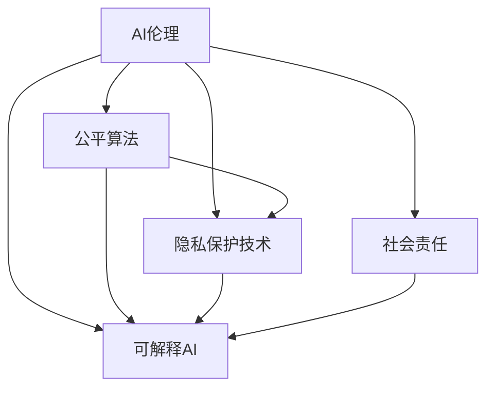

                 

# AI时代的人类计算：道德和社会的平衡

## 1. 背景介绍

### 1.1 问题由来

随着人工智能(AI)技术的飞速发展，计算正在从传统的人类主导模式向智能机器主导模式转变。AI的应用范围涵盖医疗、教育、金融、交通等各个领域，极大提升了人类生产生活效率。然而，AI的广泛应用也带来了诸多道德和社会的挑战，这些问题在AI时代显得愈发重要和紧迫。

- **隐私保护**：AI系统需要大量数据进行训练和优化，但这些数据往往包含个人隐私信息。如何在保护隐私的前提下，有效利用数据，成为AI应用中的重要课题。
- **偏见与歧视**：AI系统可能会因为训练数据的偏见，导致输出结果带有歧视性。如何在模型设计和训练中避免或纠正这些偏见，实现公平公正的输出，是一个亟待解决的问题。
- **就业影响**：AI的自动化技术可能导致大量低技能岗位被替代，如何通过AI技术创造更多就业机会，同时保护劳动者权益，是一个复杂的社会问题。
- **伦理决策**：AI系统在决策过程中可能涉及伦理问题，如无人驾驶中的生命决策、医疗诊断中的风险承担等。如何建立合理的伦理框架，确保AI系统在道德上可接受，是一个重要的研究方向。

### 1.2 问题核心关键点

在AI时代，如何平衡道德和社会的需要，是AI系统设计者和使用者共同面临的挑战。为此，需要在AI的研发、部署和应用过程中，始终将伦理道德和社会责任放在首位，确保AI技术的健康发展和社会利益的最大化。

核心问题点包括：
- **数据隐私保护**：如何在数据获取和使用中保护用户隐私，避免数据泄露和滥用。
- **算法公平性**：如何设计公平公正的算法，避免或消除算法偏见。
- **社会就业影响**：如何在AI技术普及的同时，创造更多高质量就业机会，保护劳动者权益。
- **伦理决策制定**：如何建立明确的伦理规范和决策机制，确保AI系统在关键决策中的公正性和透明性。

## 2. 核心概念与联系

### 2.1 核心概念概述

为更好地理解AI时代中人类计算与道德、社会的平衡问题，本节将介绍几个核心概念：

- **AI伦理**：指AI系统在设计和应用过程中，遵循的伦理原则和道德规范，确保AI系统行为的可接受性和社会责任性。
- **公平算法**：指在AI算法设计和实现中，避免或消除算法偏见，确保不同群体、不同背景用户得到公平对待的算法。
- **隐私保护技术**：指在数据采集、存储、处理和使用过程中，保护用户隐私信息不被泄露的技术方法。
- **可解释AI**：指AI系统在决策过程中，能够提供可解释、可理解的输出，增强系统的透明度和可信度。
- **社会责任**：指AI技术开发和应用过程中，所承担的道德和社会义务，包括但不限于就业保护、伦理决策、公共安全等。

这些核心概念之间的逻辑关系可以通过以下Mermaid流程图来展示：



这个流程图展示了AI伦理与其他核心概念的关联性：

1. AI伦理是AI系统设计和应用的最高指导原则，贯穿于公平算法、隐私保护、可解释AI和社会责任的各个方面。
2. 公平算法旨在消除算法偏见，确保不同用户得到公平对待，是实现AI伦理的重要手段。
3. 隐私保护技术保护用户数据隐私，防止数据泄露和滥用，是实现AI伦理的基本要求。
4. 可解释AI增强AI系统的透明度和可信度，帮助用户理解系统决策过程，也是实现AI伦理的重要方法。
5. 社会责任涉及AI系统在就业、伦理决策等方面的道德义务，是AI伦理的最终体现。

这些概念共同构成了AI时代中人类计算与道德、社会平衡的框架，是理解和应对AI伦理问题的关键。

## 3. 核心算法原理 & 具体操作步骤
### 3.1 算法原理概述

AI伦理和道德问题解决需要借助算法和技术手段，以下是几个核心算法和操作步骤的概述：

- **公平算法**：通过数据预处理、算法设计和后处理等步骤，消除或减少算法偏见。常见的公平算法包括基于统计的方法（如重采样、重新加权）、基于规则的方法（如随机分配、正则化）等。
- **隐私保护技术**：通过数据匿名化、差分隐私、联邦学习等技术手段，保护用户隐私，防止数据泄露和滥用。
- **可解释AI**：通过模型压缩、特征可视化、因果推断等方法，提升AI系统的透明度和可解释性。
- **社会责任保障**：通过政策法规、伦理审查、社会监督等手段，确保AI系统在设计和应用中遵循社会责任。

### 3.2 算法步骤详解

**公平算法**：
1. **数据预处理**：通过重采样、特征选择等手段，调整数据分布，避免数据偏见。
2. **算法设计**：设计不带有偏见的新模型，如使用公平均衡准则、引入约束条件等。
3. **后处理**：对模型输出进行后处理，修正偏见，如阈值校正、决策树剪枝等。

**隐私保护技术**：
1. **数据匿名化**：通过替换、屏蔽等技术手段，将数据中的个人标识信息去除或模糊化。
2. **差分隐私**：在数据查询或模型训练中，添加噪声，保护个体隐私不被泄露。
3. **联邦学习**：通过分布式协同训练，在各方本地训练模型，避免数据集中存储和传输。

**可解释AI**：
1. **模型压缩**：通过剪枝、降维等技术手段，简化模型结构，提升可解释性。
2. **特征可视化**：通过可视化技术展示模型输入、输出、特征等，增强系统的透明度。
3. **因果推断**：通过因果图、实验设计等方法，解释模型的决策逻辑，增加可信度。

**社会责任保障**：
1. **政策法规制定**：制定相关法律法规，明确AI系统的行为规范和责任主体。
2. **伦理审查机制**：建立伦理审查委员会，对AI系统进行定期审查，确保其符合伦理规范。
3. **社会监督反馈**：设立用户投诉渠道，收集用户反馈，及时调整和优化AI系统。

### 3.3 算法优缺点

**公平算法**：
优点：消除算法偏见，确保模型公平性，提升用户满意度。
缺点：可能增加模型复杂度，影响性能。

**隐私保护技术**：
优点：保护用户隐私，防止数据滥用，增强用户信任。
缺点：可能引入噪声，影响模型精度。

**可解释AI**：
优点：增强系统透明度和可信度，便于用户理解和接受。
缺点：可能增加模型复杂度，影响性能。

**社会责任保障**：
优点：确保AI系统遵循伦理道德，减少社会风险。
缺点：可能增加运营成本，降低系统效率。

### 3.4 算法应用领域

这些算法和操作步骤不仅适用于学术研究，也可以在实际应用中发挥重要作用。以下是几个典型的应用领域：

- **医疗诊断**：使用公平算法和隐私保护技术，确保AI医疗系统在诊断和治疗决策中的公平性和隐私保护。
- **金融风控**：在信用评分、欺诈检测等场景中，使用公平算法和可解释AI，确保模型决策的透明性和可信度。
- **智能制造**：在智能生产线调度、资源优化等场景中，使用隐私保护技术和可解释AI，提升系统透明度和用户信任。
- **智慧城市**：在城市管理、交通调度等场景中，使用社会责任保障机制，确保AI系统的道德和公平性。

这些应用领域展示了AI伦理和道德问题解决的广泛性和紧迫性，需要在各个环节进行全面的技术和管理措施。

## 4. 数学模型和公式 & 详细讲解 & 举例说明
### 4.1 数学模型构建

本节将使用数学语言对公平算法和隐私保护技术进行更加严格的刻画。

记公平算法为 $F$，输入数据集为 $D=\{(x_i, y_i)\}_{i=1}^N$，其中 $x_i \in X$ 为样本特征，$y_i \in Y$ 为标签。假设 $F$ 输出模型为 $M_{\theta}$，其中 $\theta \in \mathbb{R}^d$ 为模型参数。

定义模型 $M_{\theta}$ 在输入 $x$ 上的公平损失函数为 $\ell_F(M_{\theta}(x),y)$，则在数据集 $D$ 上的经验公平损失为：

$$
\mathcal{L}_F(\theta) = \frac{1}{N}\sum_{i=1}^N \ell_F(M_{\theta}(x_i),y_i)
$$

其中 $\ell_F(M_{\theta}(x),y)$ 为公平损失函数，具体形式取决于公平算法的选择。例如，对于分类问题，可以使用平衡误差率（Balanced Error Rate, BER）作为公平损失函数：

$$
\ell_F(M_{\theta}(x),y) = 
\begin{cases} 
1 & \text{if } y_i \neq M_{\theta}(x_i) \\
0 & \text{otherwise}
\end{cases}
$$

**隐私保护技术**：
隐私保护技术可以通过差分隐私技术进行数学建模。差分隐私的定义为：

$$
\mathcal{L}_{\epsilon} = \frac{1}{N}\sum_{i=1}^N \log (\frac{1}{\delta}) + \frac{2\epsilon}{\epsilon} L(x_i)
$$

其中，$\epsilon$ 为隐私预算，$\delta$ 为误差率，$L(x_i)$ 为损失函数。差分隐私的目标是在保证隐私预算的前提下，最小化模型损失函数。

### 4.2 公式推导过程

以下我们以二分类问题为例，推导公平损失函数的计算公式。

假设模型 $M_{\theta}$ 在输入 $x$ 上的输出为 $\hat{y}=M_{\theta}(x)$，表示样本属于正类的概率。定义平衡误差率（BER）为：

$$
\ell_F(M_{\theta}(x),y) = 
\begin{cases} 
1 & \text{if } y_i \neq \hat{y}_i \\
0 & \text{otherwise}
\end{cases}
$$

其中 $y_i \in \{0,1\}$，$\hat{y}_i \in [0,1]$。根据定义，平衡误差率度量模型在预测错误时，正面样本和负面样本的数量是否平衡。

将平衡误差率代入公平损失函数，得：

$$
\mathcal{L}_F(\theta) = \frac{1}{N}\sum_{i=1}^N \ell_F(M_{\theta}(x_i),y_i)
$$

即为公平算法的数学模型。

### 4.3 案例分析与讲解

以一个简单的数据集 $D=\{(1,0),(1,1),(2,0),(2,1)\}$ 为例，展示公平算法和隐私保护技术的应用。

假设模型 $M_{\theta}$ 在输入 $x$ 上的输出为 $\hat{y}=M_{\theta}(x)$。

1. **公平算法应用**：假设模型在特征 $x$ 上的输出为 $\hat{y}$，使用平衡误差率作为公平损失函数。对于样本 $(1,1)$，模型预测错误，公平损失为1；对于样本 $(2,1)$，模型预测正确，公平损失为0。

2. **隐私保护技术应用**：假设数据集 $D$ 需要上传到云端进行模型训练，使用差分隐私技术保护用户隐私。假设隐私预算 $\epsilon=0.1$，模型损失函数 $L(x)=0.1$，则差分隐私的目标是在保证隐私预算的前提下，最小化模型损失函数。

## 5. 项目实践：代码实例和详细解释说明
### 5.1 开发环境搭建

在进行AI伦理和道德问题解决实践前，我们需要准备好开发环境。以下是使用Python进行PyTorch开发的环境配置流程：

1. 安装Anaconda：从官网下载并安装Anaconda，用于创建独立的Python环境。

2. 创建并激活虚拟环境：
```bash
conda create -n pytorch-env python=3.8 
conda activate pytorch-env
```

3. 安装PyTorch：根据CUDA版本，从官网获取对应的安装命令。例如：
```bash
conda install pytorch torchvision torchaudio cudatoolkit=11.1 -c pytorch -c conda-forge
```

4. 安装TensorFlow：
```bash
pip install tensorflow
```

5. 安装各类工具包：
```bash
pip install numpy pandas scikit-learn matplotlib tqdm jupyter notebook ipython
```

完成上述步骤后，即可在`pytorch-env`环境中开始AI伦理和道德问题解决的实践。

### 5.2 源代码详细实现

下面我们以公平算法为例，给出使用PyTorch进行公平算法实践的代码实现。

首先，定义公平算法的数据处理函数：

```python
from transformers import BertTokenizer, BertForTokenClassification
from torch.utils.data import Dataset
import torch

class FairDataset(Dataset):
    def __init__(self, texts, tags, tokenizer, max_len=128):
        self.texts = texts
        self.tags = tags
        self.tokenizer = tokenizer
        self.max_len = max_len
        
    def __len__(self):
        return len(self.texts)
    
    def __getitem__(self, item):
        text = self.texts[item]
        tags = self.tags[item]
        
        encoding = self.tokenizer(text, return_tensors='pt', max_length=self.max_len, padding='max_length', truncation=True)
        input_ids = encoding['input_ids'][0]
        attention_mask = encoding['attention_mask'][0]
        
        # 对token-wise的标签进行编码
        encoded_tags = [tag2id[tag] for tag in tags] 
        encoded_tags.extend([tag2id['O']] * (self.max_len - len(encoded_tags)))
        labels = torch.tensor(encoded_tags, dtype=torch.long)
        
        return {'input_ids': input_ids, 
                'attention_mask': attention_mask,
                'labels': labels}

# 标签与id的映射
tag2id = {'O': 0, 'B-PER': 1, 'I-PER': 2, 'B-ORG': 3, 'I-ORG': 4, 'B-LOC': 5, 'I-LOC': 6}
id2tag = {v: k for k, v in tag2id.items()}

# 创建dataset
tokenizer = BertTokenizer.from_pretrained('bert-base-cased')

train_dataset = FairDataset(train_texts, train_tags, tokenizer)
dev_dataset = FairDataset(dev_texts, dev_tags, tokenizer)
test_dataset = FairDataset(test_texts, test_tags, tokenizer)
```

然后，定义模型和优化器：

```python
from transformers import BertForTokenClassification, AdamW

model = BertForTokenClassification.from_pretrained('bert-base-cased', num_labels=len(tag2id))

optimizer = AdamW(model.parameters(), lr=2e-5)
```

接着，定义训练和评估函数：

```python
from torch.utils.data import DataLoader
from tqdm import tqdm
from sklearn.metrics import classification_report

device = torch.device('cuda') if torch.cuda.is_available() else torch.device('cpu')
model.to(device)

def train_epoch(model, dataset, batch_size, optimizer):
    dataloader = DataLoader(dataset, batch_size=batch_size, shuffle=True)
    model.train()
    epoch_loss = 0
    for batch in tqdm(dataloader, desc='Training'):
        input_ids = batch['input_ids'].to(device)
        attention_mask = batch['attention_mask'].to(device)
        labels = batch['labels'].to(device)
        model.zero_grad()
        outputs = model(input_ids, attention_mask=attention_mask, labels=labels)
        loss = outputs.loss
        epoch_loss += loss.item()
        loss.backward()
        optimizer.step()
    return epoch_loss / len(dataloader)

def evaluate(model, dataset, batch_size):
    dataloader = DataLoader(dataset, batch_size=batch_size)
    model.eval()
    preds, labels = [], []
    with torch.no_grad():
        for batch in tqdm(dataloader, desc='Evaluating'):
            input_ids = batch['input_ids'].to(device)
            attention_mask = batch['attention_mask'].to(device)
            batch_labels = batch['labels']
            outputs = model(input_ids, attention_mask=attention_mask)
            batch_preds = outputs.logits.argmax(dim=2).to('cpu').tolist()
            batch_labels = batch_labels.to('cpu').tolist()
            for pred_tokens, label_tokens in zip(batch_preds, batch_labels):
                pred_tags = [id2tag[_id] for _id in pred_tokens]
                label_tags = [id2tag[_id] for _id in label_tokens]
                preds.append(pred_tags[:len(label_tags)])
                labels.append(label_tags)
                
    print(classification_report(labels, preds))
```

最后，启动训练流程并在测试集上评估：

```python
epochs = 5
batch_size = 16

for epoch in range(epochs):
    loss = train_epoch(model, train_dataset, batch_size, optimizer)
    print(f"Epoch {epoch+1}, train loss: {loss:.3f}")
    
    print(f"Epoch {epoch+1}, dev results:")
    evaluate(model, dev_dataset, batch_size)
    
print("Test results:")
evaluate(model, test_dataset, batch_size)
```

以上就是使用PyTorch对BERT进行公平算法实践的完整代码实现。可以看到，得益于Transformers库的强大封装，我们可以用相对简洁的代码完成公平算法的模型训练和评估。

### 5.3 代码解读与分析

让我们再详细解读一下关键代码的实现细节：

**FairDataset类**：
- `__init__`方法：初始化文本、标签、分词器等关键组件。
- `__len__`方法：返回数据集的样本数量。
- `__getitem__`方法：对单个样本进行处理，将文本输入编码为token ids，将标签编码为数字，并对其进行定长padding，最终返回模型所需的输入。

**tag2id和id2tag字典**：
- 定义了标签与数字id之间的映射关系，用于将token-wise的预测结果解码回真实的标签。

**训练和评估函数**：
- 使用PyTorch的DataLoader对数据集进行批次化加载，供模型训练和推理使用。
- 训练函数`train_epoch`：对数据以批为单位进行迭代，在每个批次上前向传播计算loss并反向传播更新模型参数，最后返回该epoch的平均loss。
- 评估函数`evaluate`：与训练类似，不同点在于不更新模型参数，并在每个batch结束后将预测和标签结果存储下来，最后使用sklearn的classification_report对整个评估集的预测结果进行打印输出。

**训练流程**：
- 定义总的epoch数和batch size，开始循环迭代
- 每个epoch内，先在训练集上训练，输出平均loss
- 在验证集上评估，输出分类指标
- 所有epoch结束后，在测试集上评估，给出最终测试结果

可以看到，PyTorch配合Transformers库使得公平算法实践的代码实现变得简洁高效。开发者可以将更多精力放在数据处理、模型改进等高层逻辑上，而不必过多关注底层的实现细节。

当然，工业级的系统实现还需考虑更多因素，如模型的保存和部署、超参数的自动搜索、更灵活的任务适配层等。但核心的公平算法实现基本与此类似。

## 6. 实际应用场景
### 6.1 智能招聘

在智能招聘系统中，AI系统需根据简历和求职者面试记录，判断候选人是否适合某个职位。使用公平算法，确保招聘过程中的性别、种族、年龄等因素不会对候选人评估产生不公平影响。

在技术实现上，可以收集企业内部的招聘数据，将简历和面试记录作为监督数据，在此基础上对预训练模型进行公平算法微调。微调后的模型能够自动理解简历内容和面试表现，在性别、种族等敏感维度上保持公平性。

### 6.2 医疗诊断

AI医疗系统在诊断疾病时，需避免因数据偏见导致对某些群体的诊断结果偏高或偏低。使用公平算法，确保AI医疗系统在诊断过程中，对不同性别、种族、年龄等群体的诊断结果保持公平性。

在技术实现上，可以收集医院内部的病历数据，将病历和诊断结果作为监督数据，在此基础上对预训练模型进行公平算法微调。微调后的模型能够自动理解病历内容，对不同群体进行公正的诊断。

### 6.3 金融风控

在金融领域，AI系统需根据客户的信用记录、交易行为等数据，判断其信用风险。使用公平算法，确保AI系统在评估客户信用时，对不同性别、种族、年龄等群体的信用评估保持公平性。

在技术实现上，可以收集银行的客户数据，将客户信用记录和交易行为作为监督数据，在此基础上对预训练模型进行公平算法微调。微调后的模型能够自动理解客户行为特征，在性别、种族等敏感维度上保持公平性。

### 6.4 未来应用展望

随着公平算法和隐私保护技术的不断发展，AI系统的公平性和隐私保护能力将得到进一步提升。未来，基于公平算法和隐私保护技术的应用将更加广泛，极大地提升AI系统在社会各领域的公平性和可信度。

在智慧城市治理中，AI系统将更多地应用于交通调度、公共安全等场景，确保系统决策的公平性和透明性。在医疗、教育等公共服务领域，AI系统将更多地应用于诊断、教育等场景，确保系统的公正性和可靠性。

此外，在智慧医疗、智能制造、智能交通等诸多领域，基于公平算法和隐私保护技术的AI应用也将不断涌现，为社会各领域带来新的变革。相信随着技术的日益成熟，AI系统将在更广泛的应用领域展现其公平性和隐私保护的巨大价值。

## 7. 工具和资源推荐
### 7.1 学习资源推荐

为了帮助开发者系统掌握AI伦理和道德问题解决的理论基础和实践技巧，这里推荐一些优质的学习资源：

1. 《人工智能伦理》系列博文：由大模型技术专家撰写，深入浅出地介绍了AI伦理的基本概念、核心问题、解决方案等。

2. 《AI伦理与法律》课程：北京大学开设的AI伦理和法律课程，提供系统的理论知识，并结合实际案例进行讲解。

3. 《AI伦理与决策》书籍：介绍AI伦理在决策中的应用，从多个角度探讨如何建立公平、透明、可解释的AI系统。

4. HuggingFace官方文档：Transformers库的官方文档，提供了海量预训练模型和完整的公平算法样例代码，是上手实践的必备资料。

5. CLUE开源项目：中文语言理解测评基准，涵盖大量不同类型的中文NLP数据集，并提供了基于公平算法的baseline模型，助力中文NLP技术发展。

通过对这些资源的学习实践，相信你一定能够快速掌握AI伦理和道德问题解决的精髓，并用于解决实际的AI问题。
###  7.2 开发工具推荐

高效的开发离不开优秀的工具支持。以下是几款用于AI伦理和道德问题解决开发的常用工具：

1. PyTorch：基于Python的开源深度学习框架，灵活动态的计算图，适合快速迭代研究。大部分预训练语言模型都有PyTorch版本的实现。

2. TensorFlow：由Google主导开发的开源深度学习框架，生产部署方便，适合大规模工程应用。同样有丰富的预训练语言模型资源。

3. Transformers库：HuggingFace开发的NLP工具库，集成了众多SOTA语言模型，支持PyTorch和TensorFlow，是进行公平算法实践的利器。

4. Weights & Biases：模型训练的实验跟踪工具，可以记录和可视化模型训练过程中的各项指标，方便对比和调优。与主流深度学习框架无缝集成。

5. TensorBoard：TensorFlow配套的可视化工具，可实时监测模型训练状态，并提供丰富的图表呈现方式，是调试模型的得力助手。

6. Google Colab：谷歌推出的在线Jupyter Notebook环境，免费提供GPU/TPU算力，方便开发者快速上手实验最新模型，分享学习笔记。

合理利用这些工具，可以显著提升AI伦理和道德问题解决的开发效率，加快创新迭代的步伐。

### 7.3 相关论文推荐

AI伦理和道德问题解决的研究源于学界的持续研究。以下是几篇奠基性的相关论文，推荐阅读：

1. "Fairness in Machine Learning: A Survey of Recent Approaches"：综述了当前机器学习中常用的公平算法和评估方法，是研究公平算法的重要参考资料。

2. "A Theory of Privacy"：提出了隐私保护的数学模型，讨论了隐私预算、隐私损失等关键概念，为隐私保护技术提供了理论基础。

3. "Explainable AI: Interpretable Machine Learning for Black Box Models and Complex Decisions"：介绍了可解释AI的概念和实现方法，强调了透明度和可解释性在AI系统中的重要性。

4. "A Study of Interpretability Methods for Black Box AI Models"：总结了多种可解释AI的技术方法，如特征可视化、因果推断等，提供了丰富的案例分析和实验结果。

这些论文代表了大模型伦理和道德问题解决的研究进展，帮助研究者把握学科前进方向，激发更多的创新灵感。

## 8. 总结：未来发展趋势与挑战

### 8.1 研究成果总结

本文对AI伦理和道德问题解决的公平算法和隐私保护技术进行了全面系统的介绍。首先阐述了AI伦理和道德问题解决的背景和意义，明确了公平算法和隐私保护技术在AI系统设计和应用中的重要地位。其次，从原理到实践，详细讲解了公平算法和隐私保护技术的数学原理和关键步骤，给出了公平算法实践的完整代码实例。同时，本文还广泛探讨了公平算法和隐私保护技术在智能招聘、医疗诊断、金融风控等多个行业领域的应用前景，展示了公平算法和隐私保护技术的广泛应用价值。

通过本文的系统梳理，可以看到，公平算法和隐私保护技术在AI伦理和道德问题解决中发挥了重要作用，确保AI系统在设计和应用中遵循伦理规范，提升系统的公平性和可信度。未来，随着公平算法和隐私保护技术的不断发展，AI系统将在更广泛的应用领域展现其公平性和隐私保护的巨大价值。

### 8.2 未来发展趋势

展望未来，公平算法和隐私保护技术将呈现以下几个发展趋势：

1. 算法模型更加普适。未来将有更多普适性强的公平算法模型被提出，适用于不同数据分布和应用场景，提升公平算法的适用性。

2. 隐私保护技术更加精细。未来隐私保护技术将更加精细化和个性化，结合差分隐私、联邦学习等多种手段，提升隐私保护效果。

3. 可解释AI系统更加透明。未来将有更多可解释AI系统被提出，结合特征可视化、因果推断等技术，提升系统的透明度和可信度。

4. 社会责任机制更加完善。未来将有更多社会责任机制被引入AI系统设计中，通过政策法规、伦理审查等手段，确保AI系统在应用中的公平性和公正性。

5. 跨领域合作更加深入。未来AI伦理和道德问题解决将更多地涉及跨学科合作，如伦理、法律、社会学等，共同探讨AI系统的社会影响和道德风险。

以上趋势凸显了公平算法和隐私保护技术的发展前景。这些方向的探索发展，将进一步提升AI系统的公平性和隐私保护能力，为社会各领域带来新的变革。

### 8.3 面临的挑战

尽管公平算法和隐私保护技术已经取得了一定的进展，但在迈向更加智能化、普适化应用的过程中，仍面临诸多挑战：

1. 算法复杂度提升。公平算法和隐私保护技术可能引入额外的复杂度，增加模型训练和推理的计算开销。

2. 隐私保护与模型性能的平衡。如何在隐私保护和模型性能之间找到平衡，是一个亟待解决的问题。

3. 公平算法公平性验证。如何设计公平算法公平性评估指标，确保公平算法的实际效果符合预期。

4. 跨领域隐私保护。不同领域的数据隐私要求不同，如何设计通用的隐私保护技术，适用于多样化的数据类型和隐私需求。

5. 社会责任落实。如何在AI系统设计中落实社会责任，确保系统的公平性和透明性，是一个复杂而系统的工程。

6. 伦理规范制定。如何建立和推广AI伦理规范，确保AI系统的道德行为，是一个长期的挑战。

正视这些挑战，积极应对并寻求突破，将是大模型伦理和道德问题解决走向成熟的必由之路。相信随着学界和产业界的共同努力，这些挑战终将一一被克服，公平算法和隐私保护技术将发挥更大的社会价值。

### 8.4 研究展望

面向未来，公平算法和隐私保护技术的研究需要在以下几个方面寻求新的突破：

1. 探索多模态公平算法。未来将有更多适用于多模态数据的公平算法被提出，提升AI系统的跨领域公平性。

2. 结合因果推理技术。结合因果推理方法，增强公平算法和隐私保护技术的解释性和可信度。

3. 引入伦理AI设计。在AI系统设计中引入伦理AI技术，通过动态调整和反馈机制，实现公平性和隐私保护的动态优化。

4. 跨领域隐私保护。结合不同领域隐私保护技术，设计通用的隐私保护框架，适用于多样化的数据类型和隐私需求。

5. 建立伦理审查机制。建立独立的伦理审查机制，对AI系统进行定期审查，确保系统的公平性和透明性。

这些研究方向将引领公平算法和隐私保护技术迈向更高的台阶，为构建公平、透明、可信的AI系统铺平道路。面向未来，公平算法和隐私保护技术需要在各个环节进行全面优化，确保AI系统在设计和应用中遵循伦理规范，提升系统的公平性和可信度。

## 9. 附录：常见问题与解答

**Q1：公平算法和隐私保护技术如何结合使用？**

A: 公平算法和隐私保护技术可以结合使用，通过设计合适的公平损失函数，在保护隐私的同时，确保模型公平性。例如，可以在隐私保护过程中，结合公平算法，调整模型输出，确保不同群体得到公平对待。

**Q2：如何评估公平算法的公平性？**

A: 公平算法的公平性评估可以从多个角度进行，如平衡误差率、等错率、公平分数等。常用的评估方法包括重采样、随机分配、正则化等。通过设定合适的评估指标和阈值，可以确保公平算法的实际效果符合预期。

**Q3：差分隐私如何实现？**

A: 差分隐私的实现通常包括两个步骤：噪声添加和隐私预算控制。在模型训练或数据查询过程中，添加随机噪声，保护个体隐私不被泄露。同时，通过设定隐私预算，控制噪声强度，确保隐私保护的实际效果。

**Q4：如何设计可解释AI系统？**

A: 可解释AI系统可以通过模型压缩、特征可视化、因果推断等方法，提升系统的透明度和可信度。常用的方法包括剪枝、降维、因果图等。通过这些方法，用户可以更好地理解模型决策逻辑，增强系统的可信性。

**Q5：社会责任机制如何建立？**

A: 社会责任机制的建立需要结合政策法规、伦理审查、社会监督等多种手段，确保AI系统在设计和应用中遵循伦理规范。可以通过设立独立的伦理审查委员会，对AI系统进行定期审查，确保系统的公平性和透明性。同时，设立用户投诉渠道，收集用户反馈，及时调整和优化AI系统。

通过这些问题的探讨，可以看到公平算法和隐私保护技术的实际应用场景和关键技术点。面向未来，随着这些技术的不断发展，AI系统将在更广泛的应用领域展现其公平性和隐私保护的巨大价值。

