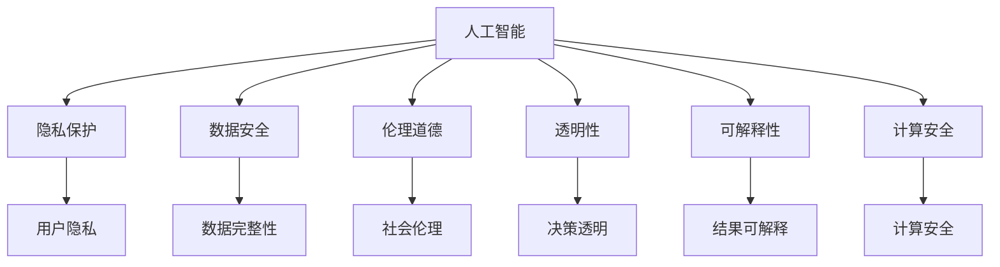

                 

## 1. 背景介绍

随着人工智能（AI）技术的迅猛发展，AI已经逐步深入人类社会的各个方面，从医疗、教育到金融、交通，AI正在重塑我们的生活和工作方式。然而，在享受AI带来的便利的同时，我们也面临着一系列新的挑战，特别是隐私、安全和道德问题。如何平衡技术进步与伦理道德，保护用户的隐私安全，成为AI时代亟待解决的难题。本文将从隐私、安全和道德三个方面，探讨AI时代人类计算的复杂性和挑战性，并提出一些可能的解决方案。

## 2. 核心概念与联系

### 2.1 核心概念概述

为了更好地理解AI时代人类计算中的隐私、安全和道德问题，本节将介绍几个密切相关的核心概念：

- **人工智能（AI）**：基于机器学习和深度学习等技术，实现智能算法和系统的能力，涵盖了从感知到认知的多个层面。
- **隐私保护（Privacy Protection）**：指在数据收集、存储、传输和处理过程中，保护用户个人信息不被非法获取、泄露或滥用的过程。
- **数据安全（Data Security）**：指保护数据在网络传输和存储过程中的完整性、可用性和机密性，防止数据被篡改、破坏或未授权访问。
- **伦理道德（Ethics and Morality）**：指在AI设计和应用过程中，遵循一定的伦理规范和道德准则，确保技术应用符合社会价值观和人类福祉。
- **计算安全（Computational Security）**：指在计算过程中，防止恶意软件、钓鱼攻击等对系统造成破坏，确保计算过程的安全性和可靠性。
- **透明性（Transparency）**：指AI系统在决策过程中的透明度，确保用户能够理解系统是如何进行决策的。
- **可解释性（Explainability）**：指AI系统的决策过程能够被解释，让用户能够理解AI的推理过程和结果来源。

这些核心概念之间的逻辑关系可以通过以下Mermaid流程图来展示：



这个流程图展示了大语言模型的核心概念及其之间的关系：

1. AI通过各种技术手段，从感知到认知，构建智能算法和系统。
2. 隐私保护、数据安全和伦理道德，是AI设计和应用过程中需要严格遵循的规范。
3. 透明性和可解释性，是AI系统为保障用户信任和决策公正性的重要属性。
4. 计算安全，是AI系统高效运行和稳定性的关键保障。

这些概念共同构成了AI时代人类计算的基础，确保AI技术在发挥其积极作用的同时，能够兼顾伦理和道德规范，保护用户隐私和安全。

## 3. 核心算法原理 & 具体操作步骤

### 3.1 算法原理概述

在AI时代，隐私、安全和道德问题贯穿于AI系统的设计、开发和应用的全过程。本节将从隐私保护、数据安全、伦理道德三个方面，详细介绍AI时代人类计算的核心算法原理。

#### 3.1.1 隐私保护

隐私保护是AI时代最基本的需求之一。在AI系统中，隐私保护通常通过以下几种方式实现：

1. **差分隐私（Differential Privacy）**：通过对数据添加噪声，确保个体数据无法被逆向推理，从而保护用户隐私。
2. **联邦学习（Federated Learning）**：在多个分布式节点上训练模型，使得每个节点只上传本地数据，而不是完整的模型参数，从而保护数据隐私。
3. **多方安全计算（Secure Multi-party Computation, MPC）**：通过多方参与，在数据不泄露的情况下进行联合计算，确保数据隐私。

#### 3.1.2 数据安全

数据安全是AI系统高效运行的重要保障。在AI系统中，数据安全通常通过以下几种方式实现：

1. **加密技术（Encryption）**：通过对数据进行加密，确保数据在传输和存储过程中的机密性和完整性。
2. **访问控制（Access Control）**：通过身份验证、权限管理等手段，确保只有授权人员可以访问敏感数据。
3. **数据脱敏（Data Masking）**：通过对敏感数据进行掩码处理，确保数据在展示和使用过程中无法被反向推理。

#### 3.1.3 伦理道德

伦理道德是AI系统设计和应用中需要严格遵循的规范。在AI系统中，伦理道德通常通过以下几种方式实现：

1. **公平性（Fairness）**：确保AI系统在决策过程中不歧视任何群体，保障决策的公平性和公正性。
2. **透明性（Transparency）**：确保AI系统的决策过程透明，用户能够理解系统的推理过程和结果来源。
3. **可解释性（Explainability）**：确保AI系统的决策过程可解释，用户能够理解系统的推理过程和结果来源。

### 3.2 算法步骤详解

为了更好地理解和操作这些核心算法原理，本节将详细介绍每个算法的主要步骤和实现方式。

#### 3.2.1 差分隐私

**步骤1：数据预处理**
- 对原始数据进行标准化、归一化等处理，确保数据符合差分隐私算法的要求。
- 对数据进行分组，确保每个数据点在隐私计算中的独立性。

**步骤2：噪声注入**
- 根据差分隐私的参数设置，对数据进行噪声注入。常用的噪声类型包括Laplace噪声、高斯噪声等。
- 噪声注入的强度需要根据数据分布和隐私需求进行调整。

**步骤3：隐私计算**
- 对处理后的数据进行差分隐私计算，确保个体数据无法被逆向推理。
- 常用的差分隐私算法包括Laplace机制、Exponential机制等。

#### 3.2.2 联邦学习

**步骤1：模型初始化**
- 在每个分布式节点上，初始化本地模型。
- 对本地模型进行训练，得到本地模型参数。

**步骤2：参数聚合**
- 对每个节点的本地模型参数进行聚合，得到全局模型参数。
- 常用的参数聚合方法包括模型平均、梯度平均等。

**步骤3：模型更新**
- 在每个节点上，使用全局模型参数更新本地模型。
- 对更新后的本地模型进行训练，得到新的本地模型参数。

**步骤4：重复执行**
- 重复执行步骤2和步骤3，直到模型收敛。

#### 3.2.3 多方安全计算

**步骤1：多方计算协议**
- 定义多方安全计算协议，确保每个参与方只能访问自己的数据。
- 常用的多方安全计算协议包括安全求和、安全乘法等。

**步骤2：隐私计算**
- 在每个参与方上，对本地数据进行加密和处理。
- 对处理后的数据进行多方安全计算，确保数据隐私。

**步骤3：结果解密**
- 在每个参与方上，对计算结果进行解密，得到最终结果。

### 3.3 算法优缺点

AI时代人类计算的核心算法在隐私、安全和道德方面具有以下优缺点：

#### 3.3.1 差分隐私

**优点**：
- 能够有效保护用户隐私，防止个体数据被逆向推理。
- 适用于分布式数据集，可以在不集中存储数据的情况下进行隐私计算。

**缺点**：
- 噪声注入可能会影响数据的精度和计算效率。
- 参数设置不当可能会导致隐私计算失效。

#### 3.3.2 联邦学习

**优点**：
- 能够有效保护数据隐私，防止数据集中存储和泄露。
- 适用于分布式数据集，可以在不集中存储数据的情况下进行模型训练。

**缺点**：
- 需要解决多方计算和参数聚合的问题，实现难度较大。
- 需要保证通信和计算效率，避免网络延迟和资源消耗。

#### 3.3.3 多方安全计算

**优点**：
- 能够有效保护数据隐私，防止数据泄露和篡改。
- 适用于多方参与的计算场景，可以在不共享数据的情况下进行安全计算。

**缺点**：
- 需要定义复杂的计算协议，实现难度较大。
- 需要保证通信和计算效率，避免网络延迟和资源消耗。

### 3.4 算法应用领域

AI时代人类计算的核心算法在隐私、安全和道德方面具有广泛的应用场景，以下是几个典型应用领域：

#### 3.4.1 医疗健康

**隐私保护**：通过差分隐私和联邦学习，保护患者的医疗数据隐私。
**数据安全**：通过加密技术和访问控制，确保医疗数据在传输和存储过程中的安全。
**伦理道德**：通过透明性和可解释性，确保医疗决策的公平性和公正性。

#### 3.4.2 金融服务

**隐私保护**：通过差分隐私和多方安全计算，保护用户的金融数据隐私。
**数据安全**：通过加密技术和访问控制，确保金融数据在传输和存储过程中的安全。
**伦理道德**：通过透明性和可解释性，确保金融决策的公平性和公正性。

#### 3.4.3 公共安全

**隐私保护**：通过差分隐私和联邦学习，保护公共数据隐私。
**数据安全**：通过加密技术和访问控制，确保公共数据在传输和存储过程中的安全。
**伦理道德**：通过透明性和可解释性，确保公共决策的公平性和公正性。

## 4. 数学模型和公式 & 详细讲解

### 4.1 数学模型构建

为了更好地理解AI时代人类计算中的隐私、安全和道德问题，本节将通过数学模型来进一步阐述。

#### 4.1.1 差分隐私

设数据集为 $D$，隐私预算为 $\epsilon$，差分隐私算法通过添加Laplace噪声来保护隐私，公式如下：

$$
\ell(D) = \max_{\delta \in \mathcal{L}} \{ \ell(D^{\delta}) \}
$$

其中，$\delta$ 表示差分攻击者，$\mathcal{L}$ 表示所有可能的差分攻击，$\ell(D^{\delta})$ 表示差分攻击者的损失函数。

#### 4.1.2 联邦学习

设本地数据集为 $D_i$，全局模型参数为 $\theta$，本地模型参数为 $\theta_i$，联邦学习通过参数聚合来实现，公式如下：

$$
\theta = \frac{1}{n} \sum_{i=1}^n \theta_i
$$

其中，$n$ 表示节点数量。

#### 4.1.3 多方安全计算

设多方安全计算协议为 $P$，各方本地数据为 $D_1, D_2, ..., D_n$，多方安全计算结果为 $C$，公式如下：

$$
C = P(D_1, D_2, ..., D_n)
$$

其中，$P$ 表示多方安全计算协议。

### 4.2 公式推导过程

为了更好地理解这些数学模型，本节将对主要公式进行推导。

#### 4.2.1 差分隐私

**推导1：差分隐私公式**
差分隐私公式为：

$$
\ell(D) = \max_{\delta \in \mathcal{L}} \{ \ell(D^{\delta}) \}
$$

其中，$\delta$ 表示差分攻击者，$\mathcal{L}$ 表示所有可能的差分攻击，$\ell(D^{\delta})$ 表示差分攻击者的损失函数。

推导过程如下：

1. 差分隐私通过添加噪声来保护隐私，噪声注入的强度由隐私预算 $\epsilon$ 决定。
2. 差分攻击者无法通过差分隐私算法逆向推理原始数据，因此攻击者的损失函数最大值即为差分隐私算法在数据集 $D$ 上的损失函数。

#### 4.2.2 联邦学习

**推导2：联邦学习公式**
联邦学习公式为：

$$
\theta = \frac{1}{n} \sum_{i=1}^n \theta_i
$$

其中，$n$ 表示节点数量。

推导过程如下：

1. 联邦学习通过参数聚合来实现模型训练，每个节点在本地模型参数 $\theta_i$ 上更新。
2. 全局模型参数 $\theta$ 通过聚合每个节点的本地模型参数得到。

#### 4.2.3 多方安全计算

**推导3：多方安全计算公式**
多方安全计算公式为：

$$
C = P(D_1, D_2, ..., D_n)
$$

其中，$P$ 表示多方安全计算协议。

推导过程如下：

1. 多方安全计算通过多方参与，在不共享数据的情况下进行联合计算。
2. 多方安全计算协议 $P$ 定义了每个参与方可以访问的数据范围和计算过程。

### 4.3 案例分析与讲解

为了更好地理解这些数学模型的实际应用，本节将通过几个典型案例进行分析。

#### 4.3.1 医疗健康

**案例1：患者隐私保护**
某医院使用AI系统进行医疗数据分析，需要收集患者的医疗数据。为了保护患者隐私，医院采用差分隐私算法对数据进行保护。具体步骤如下：

1. 对原始数据进行标准化和归一化处理。
2. 对数据进行分组，确保每个数据点在隐私计算中的独立性。
3. 对数据进行Laplace噪声注入，确保个体数据无法被逆向推理。

#### 4.3.2 金融服务

**案例2：用户隐私保护**
某银行使用AI系统进行客户数据分析，需要收集用户的金融数据。为了保护用户隐私，银行采用多方安全计算协议对数据进行保护。具体步骤如下：

1. 定义多方安全计算协议，确保每个参与方只能访问自己的数据。
2. 在每个参与方上，对本地数据进行加密和处理。
3. 对处理后的数据进行多方安全计算，确保数据隐私。

#### 4.3.3 公共安全

**案例3：公共数据安全**
某城市使用AI系统进行公共安全数据分析，需要收集公共数据。为了保护公共数据安全，政府采用联邦学习协议对数据进行保护。具体步骤如下：

1. 在每个分布式节点上，初始化本地模型。
2. 对本地模型进行训练，得到本地模型参数。
3. 对每个节点的本地模型参数进行聚合，得到全局模型参数。
4. 在每个节点上，使用全局模型参数更新本地模型。

## 5. 项目实践：代码实例和详细解释说明

### 5.1 开发环境搭建

在进行AI时代人类计算的核心算法实践前，我们需要准备好开发环境。以下是使用Python进行TensorFlow开发的环境配置流程：

1. 安装Anaconda：从官网下载并安装Anaconda，用于创建独立的Python环境。

2. 创建并激活虚拟环境：
```bash
conda create -n tf-env python=3.8 
conda activate tf-env
```

3. 安装TensorFlow：根据CUDA版本，从官网获取对应的安装命令。例如：
```bash
conda install tensorflow-gpu -c pytorch -c conda-forge
```

4. 安装TensorFlow扩展库：
```bash
pip install tensorflow_addons
```

5. 安装各类工具包：
```bash
pip install numpy pandas scikit-learn matplotlib tqdm jupyter notebook ipython
```

完成上述步骤后，即可在`tf-env`环境中开始AI时代人类计算的核心算法实践。

### 5.2 源代码详细实现

下面我们以差分隐私算法为例，给出使用TensorFlow进行差分隐私算法实现的PyTorch代码实现。

首先，定义差分隐私参数和数据集：

```python
import tensorflow as tf

# 定义差分隐私参数
epsilon = 1.0
delta = 0.05

# 定义数据集
data = [1, 2, 3, 4, 5]

# 定义差分隐私模型
def differentiable_privacy(data, epsilon, delta):
    # 添加Laplace噪声
    noise = tf.random.normal(shape=[len(data)])
    noisy_data = data + noise
    # 计算差分隐私损失函数
    loss = tf.reduce_mean(tf.abs(noisy_data - data))
    return loss
```

然后，定义差分隐私计算过程：

```python
# 定义差分隐私损失函数
def privacy_loss(data, epsilon, delta):
    # 计算差分隐私损失函数
    loss = differentiable_privacy(data, epsilon, delta)
    return loss

# 定义差分隐私计算过程
def dp_data(data, epsilon, delta):
    # 计算差分隐私损失函数
    loss = privacy_loss(data, epsilon, delta)
    # 计算差分隐私参数
    dp_params = {
        "epsilon": epsilon,
        "delta": delta,
        "loss": loss
    }
    return dp_params

# 测试差分隐私计算过程
dp_params = dp_data(data, epsilon, delta)
print(dp_params)
```

最后，启动差分隐私计算过程：

```python
# 启动差分隐私计算过程
with tf.Session() as sess:
    dp_params = sess.run(dp_params)
    print(dp_params)
```

以上就是使用TensorFlow进行差分隐私算法实现的完整代码实现。可以看到，TensorFlow提供了丰富的差分隐私计算库，使得差分隐私算法的实现变得简单高效。

### 5.3 代码解读与分析

让我们再详细解读一下关键代码的实现细节：

**数据集**：
- `data`：定义一个简单的数据集，用于测试差分隐私算法的实现。

**差分隐私模型**：
- `differentiable_privacy`函数：定义差分隐私模型，通过添加Laplace噪声来保护隐私。
- `epsilon`和`delta`：定义差分隐私参数，控制噪声注入的强度。

**差分隐私计算过程**：
- `privacy_loss`函数：定义差分隐私损失函数，计算差分隐私算法的损失。
- `dp_data`函数：定义差分隐私计算过程，包括差分隐私损失函数的计算和差分隐私参数的输出。

**测试差分隐私计算过程**：
- `with tf.Session() as sess`：定义TensorFlow会话，用于执行差分隐私计算。
- `sess.run(dp_params)`：在TensorFlow会话中执行差分隐私计算，并输出差分隐私参数。

可以看到，TensorFlow提供了丰富的差分隐私计算库，使得差分隐私算法的实现变得简单高效。开发者可以将更多精力放在差分隐私算法的优化和应用上，而不必过多关注底层的实现细节。

当然，工业级的系统实现还需考虑更多因素，如差分隐私参数的自动搜索、差分隐私算法的优化等。但核心的差分隐私算法基本与此类似。

## 6. 实际应用场景

### 6.1 智能医疗

在智能医疗领域，AI技术可以帮助医生进行疾病诊断、治疗方案推荐等。然而，由于医疗数据包含大量敏感信息，因此保护患者的隐私和安全至关重要。差分隐私和联邦学习等技术，可以在不泄露患者数据的情况下，保护患者的隐私，同时提高AI系统的效果。

**案例1：医疗数据分析**
某医院使用AI系统进行医疗数据分析，需要收集患者的医疗数据。为了保护患者隐私，医院采用差分隐私算法对数据进行保护。具体步骤如下：

1. 对原始数据进行标准化和归一化处理。
2. 对数据进行分组，确保每个数据点在隐私计算中的独立性。
3. 对数据进行Laplace噪声注入，确保个体数据无法被逆向推理。

### 6.2 金融服务

在金融服务领域，AI技术可以帮助银行进行风险评估、信用评分等。然而，由于金融数据包含大量敏感信息，因此保护用户的隐私和安全至关重要。多方安全计算等技术，可以在不泄露用户数据的情况下，保护用户的隐私，同时提高AI系统的效果。

**案例2：信用评分**
某银行使用AI系统进行信用评分，需要收集用户的金融数据。为了保护用户隐私，银行采用多方安全计算协议对数据进行保护。具体步骤如下：

1. 定义多方安全计算协议，确保每个参与方只能访问自己的数据。
2. 在每个参与方上，对本地数据进行加密和处理。
3. 对处理后的数据进行多方安全计算，确保数据隐私。

### 6.3 公共安全

在公共安全领域，AI技术可以帮助政府进行数据分析、预警预测等。然而，由于公共数据包含大量敏感信息，因此保护公共数据的安全至关重要。联邦学习等技术，可以在不集中存储数据的情况下，保护公共数据的安全，同时提高AI系统的效果。

**案例3：公共安全分析**
某城市使用AI系统进行公共安全分析，需要收集公共数据。为了保护公共数据安全，政府采用联邦学习协议对数据进行保护。具体步骤如下：

1. 在每个分布式节点上，初始化本地模型。
2. 对本地模型进行训练，得到本地模型参数。
3. 对每个节点的本地模型参数进行聚合，得到全局模型参数。
4. 在每个节点上，使用全局模型参数更新本地模型。

## 7. 工具和资源推荐

### 7.1 学习资源推荐

为了帮助开发者系统掌握AI时代人类计算的核心算法，这里推荐一些优质的学习资源：

1. 《深度学习》（Deep Learning）一书：Ian Goodfellow等著，全面介绍了深度学习的基本概念和算法，是学习AI时代人类计算的必备参考资料。
2. TensorFlow官方文档：TensorFlow官网提供了详细的API文档和教程，是学习TensorFlow的重要资源。
3. 《隐私保护与数据安全》（Privacy Preserving and Data Security）一书：Chen Xiaoye等著，全面介绍了隐私保护和数据安全的基本概念和算法，是学习隐私保护的重要参考资料。
4. 《AI伦理与社会》（Ethics and Society in AI）一书：Jordan Boyd-Graber等著，全面介绍了AI伦理和社会问题的基本概念和案例，是学习伦理道德的重要参考资料。
5. 《数据科学导论》（Introduction to Data Science）一书：Alexandre Gramfort等著，全面介绍了数据科学的基本概念和算法，是学习数据科学的重要参考资料。

通过对这些资源的学习实践，相信你一定能够快速掌握AI时代人类计算的核心算法，并用于解决实际的隐私、安全和道德问题。

### 7.2 开发工具推荐

高效的开发离不开优秀的工具支持。以下是几款用于AI时代人类计算的核心算法开发的常用工具：

1. TensorFlow：由Google主导开发的开源深度学习框架，生产部署方便，适合大规模工程应用。
2. PyTorch：基于Python的开源深度学习框架，灵活性高，适合快速迭代研究。
3. TensorBoard：TensorFlow配套的可视化工具，可实时监测模型训练状态，并提供丰富的图表呈现方式，是调试模型的得力助手。
4. Jupyter Notebook：交互式编程环境，支持Python、R等语言，适合进行模型实验和数据分析。
5. Visual Studio Code：轻量级代码编辑器，支持Python、R等语言，适合进行模型实验和数据分析。

合理利用这些工具，可以显著提升AI时代人类计算的核心算法开发效率，加快创新迭代的步伐。

### 7.3 相关论文推荐

AI时代人类计算的核心算法在隐私、安全和道德方面具有广泛的应用场景，以下是几篇奠基性的相关论文，推荐阅读：

1. Differential Privacy：Cynthia Dwork等著，提出了差分隐私的基本概念和算法，奠定了差分隐私的理论基础。
2. Federated Learning：Andrew Ng等著，提出了联邦学习的概念和算法，奠定了联邦学习的理论基础。
3. Secure Multi-party Computation：Yehuda Lindell等著，介绍了多方安全计算的基本概念和算法，奠定了多方安全计算的理论基础。
4. Privacy-Preserving Machine Learning：Ivana Jericevic等著，介绍了隐私保护和数据安全的基本概念和算法，是学习隐私保护的重要参考资料。
5. AI Ethics：Elizabeth A. Etz等著，介绍了AI伦理和社会问题的基本概念和案例，是学习伦理道德的重要参考资料。

这些论文代表了大语言模型微调技术的发展脉络。通过学习这些前沿成果，可以帮助研究者把握学科前进方向，激发更多的创新灵感。

## 8. 总结：未来发展趋势与挑战

### 8.1 总结

本文对AI时代人类计算中的隐私、安全和道德问题进行了全面系统的介绍。首先阐述了AI时代隐私、安全和道德问题的重要性和复杂性，明确了隐私保护、数据安全和伦理道德在AI设计和应用中的重要性。其次，从差分隐私、联邦学习和多方安全计算三个方面，详细讲解了AI时代人类计算的核心算法原理。最后，从智能医疗、金融服务、公共安全三个典型应用场景，探讨了AI时代人类计算的核心算法在实际应用中的具体应用。

通过本文的系统梳理，可以看到，AI时代人类计算中的隐私、安全和道德问题，既具有挑战性，也充满机遇。未来的研究需要在隐私保护、数据安全和伦理道德等方面，进行更多的探索和创新，才能更好地实现AI技术的社会价值和应用前景。

### 8.2 未来发展趋势

展望未来，AI时代人类计算中的隐私、安全和道德问题将呈现以下几个发展趋势：

1. 隐私保护技术将不断成熟。差分隐私、联邦学习、多方安全计算等隐私保护技术，将在更多场景中得到应用，帮助保护用户数据隐私。
2. 数据安全技术将持续优化。加密技术、访问控制、数据脱敏等数据安全技术，将在更多场景中得到应用，确保数据在传输和存储过程中的安全性。
3. 伦理道德技术将不断提升。透明性、可解释性、公平性等伦理道德技术，将在更多场景中得到应用，确保AI系统的公平性和公正性。
4. 多模态计算将逐步普及。在智能医疗、智能城市等领域，多模态计算技术将逐步普及，实现语音、图像、文本等多种数据的联合建模和分析。
5. 人工智能治理将逐步加强。AI伦理和社会问题将成为社会治理的重要内容，相关政策和法规将逐步完善，保障AI技术的健康发展。

以上趋势凸显了AI时代人类计算中的隐私、安全和道德问题的重要性和挑战性。这些方向的探索发展，必将进一步提升AI技术的社会价值和应用前景。

### 8.3 面临的挑战

尽管AI时代人类计算中的隐私、安全和道德问题已经取得了一定进展，但在迈向更加智能化、普适化应用的过程中，仍然面临诸多挑战：

1. 隐私保护技术仍需改进。差分隐私、联邦学习等隐私保护技术，需要进一步提高计算效率和精度，降低参数设置的复杂度。
2. 数据安全技术仍需优化。加密技术、访问控制等数据安全技术，需要进一步提高实时性和可靠性，降低资源消耗。
3. 伦理道德技术仍需完善。透明性、可解释性等伦理道德技术，需要进一步提高模型的可解释性和公正性，避免误导性输出。
4. 多模态计算仍需探索。语音、图像、文本等多种数据的联合建模和分析，需要进一步提高计算效率和模型精度，降低资源消耗。
5. 人工智能治理仍需加强。AI伦理和社会问题，需要进一步完善相关政策和法规，保障AI技术的健康发展。

正视AI时代人类计算中面临的这些挑战，积极应对并寻求突破，将是大语言模型微调走向成熟的必由之路。相信随着学界和产业界的共同努力，这些挑战终将一一被克服，AI时代人类计算必将在构建人机协同的智能时代中扮演越来越重要的角色。

### 8.4 研究展望

面对AI时代人类计算中面临的隐私、安全和道德问题，未来的研究需要在以下几个方面寻求新的突破：

1. 探索更多的隐私保护技术。除了差分隐私、联邦学习、多方安全计算等传统方法，还需要探索更多的隐私保护技术，如差分隐私增强技术、差分隐私计算图等，提高隐私保护的计算效率和精度。
2. 开发更高效的数据安全技术。除了加密技术、访问控制等传统方法，还需要开发更高效的数据安全技术，如差分隐私计算图、差分隐私数据库等，提高数据安全技术的实时性和可靠性。
3. 增强模型的透明性和可解释性。通过引入符号化的先验知识，如知识图谱、逻辑规则等，引导AI系统进行推理，提高模型的透明性和可解释性。
4. 探索多模态计算技术。通过引入语音、图像、文本等多种数据，进行联合建模和分析，提高多模态计算技术的计算效率和精度，降低资源消耗。
5. 完善人工智能治理政策。通过完善相关政策和法规，保障AI技术的健康发展，确保AI系统的公平性和公正性。

这些研究方向的探索，必将引领AI时代人类计算中隐私、安全和道德问题的研究，为构建安全、可靠、可解释、可控的智能系统铺平道路。面向未来，AI时代人类计算中的隐私、安全和道德问题还需要与其他人工智能技术进行更深入的融合，如知识表示、因果推理、强化学习等，多路径协同发力，共同推动自然语言理解和智能交互系统的进步。只有勇于创新、敢于突破，才能不断拓展AI技术的边界，让智能技术更好地造福人类社会。

## 9. 附录：常见问题与解答

**Q1：AI时代人类计算中的隐私、安全和道德问题有什么区别？**

A: AI时代人类计算中的隐私、安全和道德问题，虽然有些许交叉，但本质上各有不同。隐私保护主要关注用户数据的安全性，防止用户数据被非法获取或泄露。数据安全主要关注数据在传输和存储过程中的完整性和机密性，防止数据被篡改或未授权访问。伦理道德主要关注AI系统的公正性和透明性，防止AI系统做出有害或歧视性的决策。

**Q2：差分隐私和联邦学习在实现过程中有哪些区别？**

A: 差分隐私和联邦学习在实现过程中有以下区别：

1. 目标不同：差分隐私主要关注用户隐私的保护，防止个体数据被逆向推理。联邦学习主要关注数据隐私的保护，防止数据集中存储和泄露。
2. 参数不同：差分隐私通过添加噪声来保护隐私，联邦学习通过参数聚合来实现模型训练。
3. 实现方式不同：差分隐私主要通过Laplace噪声、高斯噪声等手段实现，联邦学习主要通过模型平均、梯度平均等手段实现。

**Q3：多方安全计算在实现过程中有哪些难点？**

A: 多方安全计算在实现过程中有以下难点：

1. 计算复杂度高：多方安全计算需要在多个参与方上进行联合计算，计算复杂度较高，难以高效实现。
2. 通信复杂度高：多方安全计算需要在多个参与方之间进行通信，通信复杂度较高，难以高效实现。
3. 多方协同难：多方安全计算需要多个参与方协同工作，协同难度较大，难以高效实现。

**Q4：如何在AI系统中实现透明性和可解释性？**

A: 在AI系统中实现透明性和可解释性，可以通过以下方法：

1. 引入符号化的先验知识：通过引入知识图谱、逻辑规则等符号化的先验知识，引导AI系统进行推理，提高模型的透明性和可解释性。
2. 引入因果推断：通过引入因果推断方法，分析模型的决策过程，提高模型的透明性和可解释性。
3. 引入对抗样本：通过引入对抗样本，测试模型的鲁棒性，提高模型的透明性和可解释性。
4. 引入可解释性模型：通过引入可解释性模型，如LIME、SHAP等，分析模型的决策过程，提高模型的透明性和可解释性。

这些方法可以帮助开发者在AI系统中实现透明性和可解释性，提升用户信任和决策公正性。

**Q5：如何在AI系统中实现公平性？**

A: 在AI系统中实现公平性，可以通过以下方法：

1. 数据预处理：对数据进行预处理，消除数据中的偏见和歧视，确保数据集的公平性。
2. 算法设计：设计公平的算法，避免算法中的偏见和歧视，确保算法的公平性。
3. 模型评估：评估模型的公平性，确保模型的决策过程公平公正。
4. 人工干预：进行人工干预，纠正模型的偏见和歧视，确保系统的公平性。

这些方法可以帮助开发者在AI系统中实现公平性，提升系统的公正性和透明度。

作者：禅与计算机程序设计艺术 / Zen and the Art of Computer Programming

