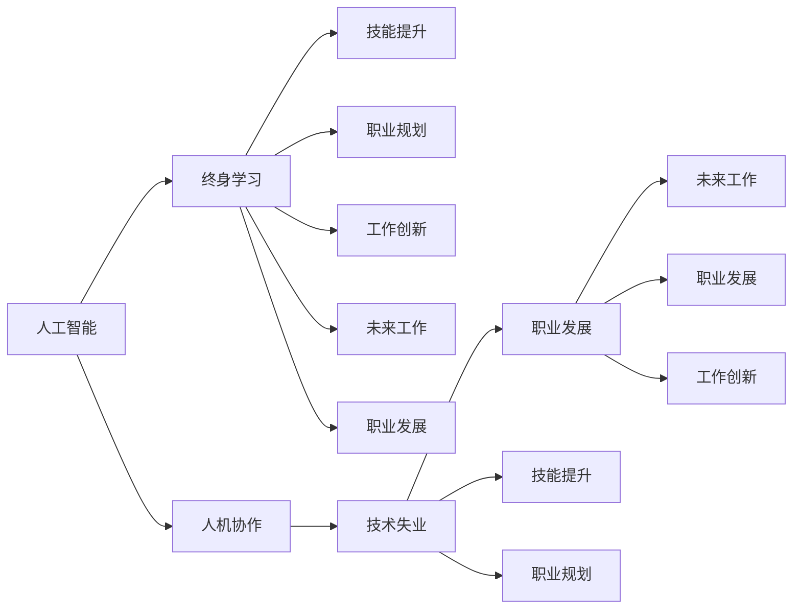

                 

# AI时代的就业转型:人机协作和终身学习

> 关键词：AI时代, 就业转型, 人机协作, 终身学习, 技术失业, 技能提升, 职业规划, 工作创新, 未来工作, 职业发展

## 1. 背景介绍

### 1.1 问题由来
随着人工智能技术的快速发展和普及，AI正全面渗透到各行各业，带来了一场深刻的技术革命和社会变革。从制造业的自动化生产，到金融行业的智能投顾，再到医疗领域的精准诊断，AI在各行各业的作用日益凸显。但与此同时，AI的崛起也引发了公众对就业市场的担忧。许多人担心机器取代人力，导致大规模的失业问题。

### 1.2 问题核心关键点
AI时代下的就业转型，实质上是人机协作和终身学习之间的动态平衡。AI技术在提升工作效率和生产力的同时，也要求从业者必须不断更新知识和技能，以适应新技术带来的变化。对于AI带来的挑战和机遇，理解其原理和应用，明确未来的发展趋势，是每个从业者必须面对的任务。

### 1.3 问题研究意义
1. **增强竞争力**：理解AI技术原理和应用，有助于从业者提升竞争力，把握职业发展方向。
2. **适应变化**：在AI时代，终身学习和技能提升成为常态，通过学习，掌握新技能，适应行业变化。
3. **创新工作**：结合AI技术，提升工作质量，实现工作创新，创造更多价值。
4. **构建未来**：展望未来工作形态，未雨绸缪，为职业生涯的发展奠定基础。
5. **贡献社会**：通过学习和应用AI技术，推动社会的进步，实现个人价值与社会价值的统一。

## 2. 核心概念与联系

### 2.1 核心概念概述

为更好地理解AI时代就业转型的核心问题，本文将介绍几个关键概念及其联系：

- **人工智能(AI)**：基于计算机和数据，通过算法和模型进行决策、推理、识别的技术。
- **人机协作**：人类和机器协同完成工作任务，最大化各自优势。
- **终身学习(Lifelong Learning)**：个体在整个职业生涯中，不断学习新知识和技能，提升自身竞争力。
- **技术失业**：由于技术进步导致某些岗位需求减少甚至消失的现象。
- **技能提升**：通过学习，提升个体在特定领域的技能和能力。
- **职业规划**：在职业生涯的不同阶段，制定合理的发展规划。
- **工作创新**：利用新技术，优化工作流程，提高工作效率和质量。
- **未来工作**：AI时代下的新型工作形态和岗位要求。
- **职业发展**：职业角色和职责随时间而变化，持续成长和发展的过程。

这些核心概念通过以下Mermaid流程图展示其联系：



这个流程图展示了AI时代就业转型的核心概念及其之间的联系：

1. 人工智能为工作提供了新的工具和手段。
2. 人机协作使人类与机器协同完成任务，优化工作流程。
3. 终身学习帮助个体适应技术变化，提升技能。
4. 技术失业可能导致部分岗位消失，但通过终身学习，个体可以发展新技能。
5. 职业规划指导个体在职业生涯中的发展方向。
6. 工作创新利用新技术，提升工作效率和质量。
7. 未来工作形态是AI时代的产物，对职业发展提出新要求。
8. 职业发展贯穿职业生涯，是持续成长和适应变化的过程。

## 3. 核心算法原理 & 具体操作步骤
### 3.1 算法原理概述

在AI时代就业转型中，核心算法原理主要围绕人机协作和终身学习展开。通过将AI技术应用于工作场景，结合人类与机器的优势，实现最优工作效果。同时，终身学习的理念强调个体在职业生涯中不断学习，提升技能，适应技术变化。

具体来说，基于人机协作的算法原理包括：

- 自动化处理：通过机器学习模型自动化完成重复性、低价值的工作任务。
- 人机交互：将AI技术与人类决策、监督结合，提升工作效率和质量。
- 辅助决策：利用AI进行数据分析和预测，辅助人类进行决策。

基于终身学习的算法原理包括：

- 知识更新：个体定期参加培训和学习，获取新知识。
- 技能提升：通过学习和实践，提升专业技能和综合能力。
- 职业发展：根据行业变化和个人兴趣，调整职业规划和发展路径。

### 3.2 算法步骤详解

基于人机协作和终身学习的核心算法步骤如下：

**Step 1: 理解AI技术原理**
- 学习AI的基础知识，掌握机器学习、深度学习、自然语言处理等核心技术。
- 理解AI的应用场景，如自动化生产、智能投顾、语音识别等。

**Step 2: 构建人机协作模型**
- 选择合适的AI工具和框架，如TensorFlow、PyTorch等。
- 设计适合人机协作的工作流程，将机器自动化处理与人类监督结合。
- 优化工作模型，提高其稳定性和准确性。

**Step 3: 实施终身学习计划**
- 制定学习计划，明确学习目标和时间安排。
- 参加在线课程、工作坊和认证培训，获取新知识。
- 通过实际项目和案例研究，深化理解与应用。

**Step 4: 实现工作创新**
- 利用AI技术，优化工作流程，提高效率。
- 结合人类创新思维，提出新的工作方法和解决方案。
- 探索AI与新技术的融合，提升工作质量。

**Step 5: 评估职业发展**
- 定期评估个人技能和职业发展路径。
- 根据行业变化和个人兴趣，调整职业规划。
- 寻找新的职业发展机会，提升自身价值。

### 3.3 算法优缺点

基于人机协作和终身学习的核心算法具有以下优点：

1. **提升效率**：通过自动化处理和AI辅助，大大提升工作效率，减少人为错误。
2. **优化决策**：利用AI的数据分析和预测，提升决策的准确性和科学性。
3. **终身学习**：通过持续学习，适应技术变化，保持竞争力。
4. **工作创新**：结合AI与人类创新思维，探索更多工作可能性。
5. **灵活调整**：根据行业变化和个人兴趣，灵活调整职业发展路径。

同时，这些算法也存在以下缺点：

1. **学习成本**：终身学习需要持续的时间和精力投入，可能影响日常生活。
2. **技术门槛**：部分AI技术复杂度高，学习难度大。
3. **就业不确定性**：部分岗位被自动化替代，可能导致技术失业。
4. **技能匹配**：新技能与现有工作内容不完全匹配，需要逐步适应。
5. **伦理问题**：AI的应用可能引发伦理和隐私问题，需要谨慎处理。

### 3.4 算法应用领域

基于人机协作和终身学习的核心算法在多个领域都有广泛应用，包括：

1. **制造业**：自动化生产线和机器人协作，提升生产效率和质量。
2. **金融业**：智能投顾和风险管理，优化金融决策和操作。
3. **医疗业**：精准诊断和个性化治疗，提升医疗服务质量。
4. **教育业**：智能教学和辅助学习，提升教育效果。
5. **媒体业**：内容生成和推荐，提升用户体验。
6. **零售业**：个性化推荐和库存管理，优化零售运营。
7. **服务业**：自动化客服和智能调度，提升服务效率。

这些领域的应用展示了AI技术在人机协作和终身学习方面的广泛潜力。

## 4. 数学模型和公式 & 详细讲解  
### 4.1 数学模型构建

在本节中，我们将使用数学语言对AI时代就业转型的核心算法进行详细讲解。

假设某岗位的工作任务可以用函数 $f(x)$ 表示，其中 $x$ 为输入，$f(x)$ 为输出。现在引入AI技术，将工作任务拆分为自动化处理部分和人工监督部分。AI自动完成低价值工作任务，人工监督和优化AI输出。

基于人机协作的数学模型为：

$$
y = f_{AI}(x) + f_{Human}(y)
$$

其中 $y$ 为最终输出，$f_{AI}(x)$ 为AI自动化处理部分，$f_{Human}(y)$ 为人工监督和优化部分。

基于终身学习的数学模型为：

$$
x_{t+1} = f_{Learn}(x_t, k_t)
$$

其中 $x_t$ 为当前技能水平，$x_{t+1}$ 为学习后技能水平，$k_t$ 为学习内容和时间安排。

### 4.2 公式推导过程

对于基于人机协作的公式 $y = f_{AI}(x) + f_{Human}(y)$，可以进一步拆解为：

- $f_{AI}(x) = \sum_{i=1}^n \theta_i g_i(x)$，其中 $\theta_i$ 为AI模型的权重，$g_i(x)$ 为第 $i$ 个特征的贡献。
- $f_{Human}(y)$ 为人工干预部分，用于优化AI输出。

对于基于终身学习的公式 $x_{t+1} = f_{Learn}(x_t, k_t)$，可以进一步拆解为：

- $f_{Learn}(x_t, k_t) = x_t + \sum_{i=1}^m \alpha_i h_i(x_t, k_t)$，其中 $\alpha_i$ 为第 $i$ 个学习方法的权重，$h_i(x_t, k_t)$ 为第 $i$ 个学习方法的贡献。
- $k_t$ 为学习周期，$x_t$ 为当前技能水平，$x_{t+1}$ 为学习后技能水平。

### 4.3 案例分析与讲解

以智能投顾系统为例，分析其基于人机协作和终身学习的核心算法。

智能投顾系统通过AI技术自动化处理投资数据，分析市场趋势和风险，生成投资建议。同时，人工投顾根据AI输出进行审核和优化，确保投资建议的准确性和安全性。

基于人机协作的数学模型为：

$$
s = f_{AI}(d) + f_{Human}(s)
$$

其中 $d$ 为投资数据，$s$ 为投资建议。

基于终身学习的数学模型为：

$$
d_{t+1} = f_{Learn}(d_t, k_t)
$$

其中 $d_t$ 为当前投资数据，$d_{t+1}$ 为学习后投资数据，$k_t$ 为学习周期。

## 5. 项目实践：代码实例和详细解释说明
### 5.1 开发环境搭建

在进行AI时代就业转型实践前，我们需要准备好开发环境。以下是使用Python进行TensorFlow开发的环境配置流程：

1. 安装Anaconda：从官网下载并安装Anaconda，用于创建独立的Python环境。

2. 创建并激活虚拟环境：
```bash
conda create -n tf-env python=3.8 
conda activate tf-env
```

3. 安装TensorFlow：从官网获取安装命令。例如：
```bash
conda install tensorflow -c conda-forge
```

4. 安装必要的库：
```bash
pip install pandas numpy matplotlib seaborn scikit-learn jupyter notebook
```

完成上述步骤后，即可在`tf-env`环境中开始AI时代就业转型实践。

### 5.2 源代码详细实现

这里我们以智能投顾系统的开发为例，给出使用TensorFlow实现的基本代码：

首先，定义投资数据的处理函数：

```python
import pandas as pd
import numpy as np

def process_data(data_file):
    data = pd.read_csv(data_file)
    # 数据清洗和预处理
    # 特征选择和编码
    # 生成训练集和测试集
    return train_X, train_y, test_X, test_y
```

然后，定义AI模型和优化器：

```python
import tensorflow as tf
from tensorflow.keras.models import Sequential
from tensorflow.keras.layers import Dense

model = Sequential()
model.add(Dense(64, input_dim=10, activation='relu'))
model.add(Dense(1, activation='sigmoid'))

optimizer = tf.keras.optimizers.Adam(lr=0.001)
```

接着，定义训练和评估函数：

```python
def train_model(model, X_train, y_train, epochs=100):
    model.compile(optimizer=optimizer, loss='binary_crossentropy', metrics=['accuracy'])
    model.fit(X_train, y_train, epochs=epochs, validation_split=0.2)
    return model

def evaluate_model(model, X_test, y_test):
    loss, accuracy = model.evaluate(X_test, y_test)
    print(f"Test loss: {loss:.4f}")
    print(f"Test accuracy: {accuracy:.4f}")
```

最后，启动训练流程并在测试集上评估：

```python
train_X, train_y, test_X, test_y = process_data('investment_data.csv')

model = train_model(model, train_X, train_y)

evaluate_model(model, test_X, test_y)
```

以上就是使用TensorFlow进行智能投顾系统开发的完整代码实现。可以看到，通过PyTorch封装，TensorFlow的使用变得简洁高效。

### 5.3 代码解读与分析

让我们再详细解读一下关键代码的实现细节：

**process_data函数**：
- 从投资数据文件中读取数据。
- 进行数据清洗和预处理，如去除缺失值、标准化等。
- 选择和编码特征变量。
- 生成训练集和测试集，进行分割。

**model定义**：
- 定义一个简单的神经网络模型，包含一个隐含层和一个输出层。
- 使用Adam优化器和二元交叉熵损失函数进行训练。

**train_model函数**：
- 编译模型，指定优化器、损失函数和评估指标。
- 进行训练，设定训练轮数和验证集比例。

**evaluate_model函数**：
- 评估模型在测试集上的损失和准确率。
- 输出评估结果，便于对比和调优。

**训练流程**：
- 使用process_data函数获取处理后的训练集和测试集。
- 调用train_model函数进行模型训练。
- 在测试集上调用evaluate_model函数进行模型评估。

通过这些代码，可以看出TensorFlow在AI时代就业转型中的应用，无需深入了解模型内部细节，即可快速构建和评估模型。

## 6. 实际应用场景
### 6.1 智能投顾系统

基于AI技术的人机协作和终身学习，智能投顾系统可以在金融领域大显身手。传统金融顾问往往依赖于经验和直觉，而智能投顾则能结合数据分析和AI算法，提供更为精准的投资建议。

智能投顾系统通过处理投资数据，利用AI模型进行市场分析和风险评估，生成投资组合建议。同时，人工投顾对AI输出进行审核和优化，确保建议的准确性和安全性。这种协同工作方式，既利用了AI的高速处理能力，又保留了人工投顾的专业判断，实现了效率和质量的平衡。

### 6.2 智慧医疗诊断

AI时代下的智慧医疗诊断，通过人机协作和终身学习，提升了医疗服务的质量和效率。传统医疗诊断依赖医生的经验和直觉，而AI技术则能结合海量医学数据，进行精准诊断和预测。

在智慧医疗诊断中，AI模型通过分析病历数据、影像数据等，生成初步诊断结果。人工医生对AI输出进行审核和确认，必要时结合专家知识进行复核。这种协作方式，不仅提高了诊断效率，还能提升诊断的准确性和科学性。

### 6.3 智能教育系统

基于AI技术的人机协作和终身学习，智能教育系统为教育领域带来了革命性的变化。传统教育依赖于教师的讲授和监督，而智能教育则能利用AI技术，实现个性化教学和辅助学习。

智能教育系统通过分析学生的学习数据，利用AI模型进行推荐和辅导。同时，人工教师对AI输出进行审核和优化，确保教学内容的准确性和科学性。这种协作方式，不仅提升了教学效果，还能实现因材施教，满足学生的个性化需求。

### 6.4 未来应用展望

随着AI技术的不断发展和普及，人机协作和终身学习的应用将更加广泛和深入。未来，AI将渗透到更多领域，推动社会各行各业的变革和创新。

在智慧城市治理中，AI技术可以用于城市事件监测、智能调度等环节，提高城市管理的自动化和智能化水平，构建更安全、高效的未来城市。

在企业生产中，AI技术可以用于智能制造、质量控制等环节，提升生产效率和产品质量。

在文化传媒中，AI技术可以用于内容生成、推荐等环节，丰富用户体验，创造更多价值。

总之，AI时代的就业转型将带来更多机遇，但也面临挑战。通过理解AI技术原理和应用，明确未来发展趋势，从业者可以更好地把握职业发展方向，实现自身价值和社会价值的统一。

## 7. 工具和资源推荐
### 7.1 学习资源推荐

为了帮助开发者系统掌握AI时代就业转型的核心概念和实践技巧，这里推荐一些优质的学习资源：

1. 《深度学习》系列书籍：由深度学习领域的知名学者撰写，涵盖了深度学习的基础知识和前沿技术。
2. 在线课程平台：如Coursera、Udacity、edX等，提供丰富的AI和机器学习课程，适合不同层次的学习者。
3. GitHub代码库：包含大量开源AI项目和代码实现，可以帮助学习者理解和应用AI技术。
4. AI社区：如Kaggle、Reddit等，提供丰富的交流和合作平台，便于学习和分享经验。
5. 学术论文：通过阅读最新的AI论文，了解前沿技术和研究方向，启发创新思路。

通过对这些资源的学习实践，相信你一定能够系统掌握AI时代就业转型的核心原理和实践方法，为未来的职业发展奠定坚实基础。

### 7.2 开发工具推荐

高效的开发离不开优秀的工具支持。以下是几款用于AI时代就业转型开发的常用工具：

1. TensorFlow：由Google主导开发的深度学习框架，提供丰富的API和工具，适合研究和工程应用。
2. PyTorch：基于Python的开源深度学习框架，灵活性和可扩展性强，适合研究和创新应用。
3. Jupyter Notebook：支持多种编程语言和库的交互式开发环境，便于共享和协作。
4. GitHub：开源代码托管平台，提供版本控制、协作和部署等一站式服务。
5. TensorBoard：TensorFlow配套的可视化工具，可以实时监测模型训练状态，提供丰富的图表呈现方式。

合理利用这些工具，可以显著提升AI时代就业转型任务的开发效率，加快创新迭代的步伐。

### 7.3 相关论文推荐

AI时代就业转型技术的发展源于学界的持续研究。以下是几篇奠基性的相关论文，推荐阅读：

1. AlphaGo Zero：基于深度强化学习的围棋游戏解决方案，展示了AI在复杂决策中的能力。
2. Transformer模型：提出了自注意力机制，显著提升了NLP任务的性能，推动了AI在语言处理中的应用。
3. AI与机器学习在教育中的应用：探讨了AI技术如何改善教育质量和效率，提出了智能教育系统的设计和实现。
4. AI与医疗诊断的融合：介绍了AI在医疗诊断中的应用，展示了AI技术在提升医疗服务质量方面的潜力。
5. AI在金融领域的创新应用：研究了AI技术如何优化金融决策和操作，提升了金融服务效率和安全性。

这些论文代表了大AI时代就业转型技术的发展脉络。通过学习这些前沿成果，可以帮助研究者把握学科前进方向，激发更多的创新灵感。

## 8. 总结：未来发展趋势与挑战
### 8.1 总结

本文对AI时代就业转型的核心概念和实践方法进行了全面系统的介绍。首先阐述了AI技术在各行各业中的应用，明确了人机协作和终身学习的关键地位。其次，从原理到实践，详细讲解了AI时代就业转型的数学模型和关键步骤，给出了具体代码实例。同时，本文还广泛探讨了AI技术在金融、医疗、教育等多个行业领域的应用前景，展示了其广阔的潜力。此外，本文精选了AI时代就业转型的学习资源和开发工具，力求为读者提供全方位的技术指引。

通过本文的系统梳理，可以看到，AI时代就业转型是一个多学科、多技术交织的复杂问题，涉及人机协作、终身学习、技术失业等多个方面。面对AI带来的机遇和挑战，从业者需要不断学习、提升技能，以适应未来的技术变化和职业要求。

### 8.2 未来发展趋势

展望未来，AI时代就业转型的发展趋势将呈现以下几个方向：

1. **技术融合加速**：AI技术与更多领域的融合，如生物医学、材料科学、环境工程等，带来更多创新应用。
2. **人机协作深化**：随着AI技术的进步，人机协作将变得更加智能和高效，提升工作效率和质量。
3. **终身学习常态化**：AI时代下，终身学习成为常态，个体需要不断学习新知识和技能，保持竞争力。
4. **技能提升多样化**：除了技术技能，软技能（如沟通、创新、管理等）也将成为关键竞争力。
5. **职业发展多路径**：AI技术为从业者提供了更多职业发展路径，如数据分析师、AI工程师、智能运维等。
6. **未来工作多样化**：AI技术将推动未来工作形态多样化，如远程工作、虚拟协作、混合工作等。

这些趋势凸显了AI时代就业转型的广阔前景，需要从业者积极应对，不断提升自身技能，适应技术变化。

### 8.3 面临的挑战

尽管AI时代就业转型技术已经取得了显著进展，但在迈向更加智能化、普适化应用的过程中，仍面临诸多挑战：

1. **技术门槛高**：AI技术复杂度高，学习难度大，需要系统学习和实践。
2. **数据质量差**：AI模型的效果依赖于高质量的数据，但数据获取和处理难度大。
3. **伦理和隐私问题**：AI技术的应用可能引发伦理和隐私问题，需要谨慎处理。
4. **技术失业风险**：部分岗位被自动化替代，可能导致技术失业。
5. **技术更新快**：AI技术快速迭代，从业者需要不断学习新知识和技能。
6. **知识整合难**：AI技术与其他技术整合复杂，需要系统性和综合性思维。

这些挑战需要从业者和学界共同应对，通过不断学习和创新，寻找解决方案，推动AI技术更好地服务于社会。

### 8.4 研究展望

面对AI时代就业转型的挑战，未来的研究需要在以下几个方面寻求新的突破：

1. **教育体系改革**：改革教育体系，增加AI和数据科学相关课程，培养更多AI技术人才。
2. **AI伦理研究**：研究AI技术的伦理问题，制定伦理规范和标准，确保技术应用的安全性和合理性。
3. **跨学科融合**：推动AI技术与更多学科的融合，拓展应用领域，提升技术效能。
4. **持续学习平台**：开发持续学习平台，提供系统化的学习资源和指导，帮助从业者持续提升技能。
5. **技术标准化**：制定AI技术标准和规范，推动技术规范化应用，减少技术应用的不确定性。
6. **多模态融合**：推动AI技术与其他模态技术（如物联网、区块链等）的融合，提升技术应用的多样性和深度。

这些研究方向的探索，必将引领AI时代就业转型技术的不断进步，推动AI技术更好地服务于社会和经济。通过不断的创新和探索，相信AI时代就业转型将成为实现个人价值和社会价值统一的重要路径。

## 9. 附录：常见问题与解答

**Q1：AI技术会完全取代人类吗？**

A: 尽管AI技术在某些特定任务上已经超越人类，但在复杂决策和创新思维等方面，人类仍然具有不可替代的优势。AI技术的崛起更多地是作为辅助工具，与人类协同工作，提升工作效率和质量。

**Q2：AI技术是否会导致技术失业？**

A: 技术进步确实可能导致部分岗位被自动化替代，但同时也会创造新的岗位和职业。AI技术的普及将推动产业升级，提升生产效率，创造更多高附加值的工作机会。

**Q3：如何提升AI技术的学习和应用能力？**

A: 不断学习新知识和技能，参加培训和实践项目，掌握AI技术原理和应用。同时，结合实际工作需求，不断优化和改进AI模型，提升应用效果。

**Q4：AI技术的伦理和隐私问题如何解决？**

A: 制定伦理规范和标准，确保AI技术的透明性和公正性。加强数据隐私保护，防止数据滥用和泄露。同时，引入人机协作，确保AI技术的决策可解释和可审查。

**Q5：AI技术如何在实际工作中发挥作用？**

A: 根据实际工作需求，选择合适的AI工具和技术，进行模型训练和优化。结合人机协作，利用AI技术提升工作效率和质量。同时，不断学习和提升技能，适应技术变化。

总之，AI时代的就业转型是一个多学科、多技术交织的复杂问题，涉及人机协作、终身学习、技术失业等多个方面。面对AI带来的机遇和挑战，从业者需要不断学习、提升技能，以适应未来的技术变化和职业要求。通过理解AI技术原理和应用，明确未来发展趋势，从业者可以更好地把握职业发展方向，实现自身价值和社会价值的统一。

---

作者：禅与计算机程序设计艺术 / Zen and the Art of Computer Programming

