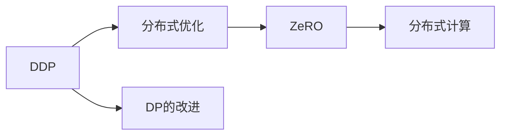

                 

# AI模型加速III：分布式优化、DDP和ZeRO技术

> 关键词：分布式优化, DDP, ZeRO, 梯度聚合, 异步计算, 自适应学习率, 通信优化

## 1. 背景介绍

在深度学习领域，随着模型规模的不断增大和数据量的不断增加，单机的训练效率和内存占用已经无法满足大规模模型训练的需求。分布式深度学习（Distributed Deep Learning）成为了提高模型训练效率和处理大规模数据的重要手段。

分布式深度学习的关键在于优化算法的设计和分布式计算框架的实现。目前主流的分布式优化算法包括基于梯度的SGD变种（如Momentum、Adagrad、Adam等）和基于模型的分布式优化算法（如DeepSpeed、Horovod等）。其中，基于梯度的分布式优化算法因其简单易用、易于扩展等优点，得到了广泛的应用。

在基于梯度的分布式优化算法中，分布式数据并行（Data Parallelism, DP）是一种常见且高效的方式。在DP中，每个工作节点都保存了整个模型的不同层的参数，每个节点独立更新并行计算结果。但是，DP在处理参数量巨大的模型时，常常会遇到内存不足和网络带宽限制的问题。为了解决这个问题，**零散零/分布式数据并行（Zero Scattered Zero/Distributed Data Parallel, ZeRO/DDP）**等新技术应运而生，并在实际应用中取得了显著的效果。

本文将详细探讨分布式优化算法的原理和操作步骤，并结合DDP和ZeRO技术，深入分析其实际应用和未来发展趋势。

## 2. 核心概念与联系

### 2.1 核心概念概述

在深度学习中，分布式优化算法指的是在多个工作节点上并行更新模型参数，以加速模型训练的过程。其主要涉及以下几个核心概念：

- **分布式数据并行（Data Parallelism, DP）**：将数据切分到不同的工作节点上，每个节点独立处理一部分数据，最终将并行计算结果合并起来。
- **异步计算（Asynchronous Computation）**：不同工作节点可以不同步更新参数，从而利用空闲时间进行计算，提高计算效率。
- **梯度聚合（Gradient Aggregation）**：在各个节点更新完参数后，需要将梯度汇总到主节点（Master Node），然后更新模型参数。
- **自适应学习率（Adaptive Learning Rate）**：根据梯度的变化自动调整学习率，避免学习率过大导致震荡，或者学习率过小导致收敛速度慢。
- **通信优化（Communication Optimization）**：优化通信过程，减少通信次数和通信量，以降低计算开销。

DDP（Distributed Data Parallel）是分布式优化算法的经典方式，在多个工作节点上并行计算模型的参数，以提高训练效率。而ZeRO（Zero Scattered Zero）则是DP的改进版，能够有效处理参数量巨大的模型，同时保持较好的性能。

### 2.2 核心概念之间的联系

以下是一个Mermaid流程图，展示了DDP和ZeRO技术在分布式深度学习中的位置和关系：



可以看出，DDP是分布式优化算法的经典实现，而ZeRO则是其改进版，主要用于处理参数量巨大的模型。DDP通过并行计算，提高了模型的训练效率，而ZeRO则在保证并行计算的同时，尽可能减少了通信开销，从而使得大模型的分布式训练成为可能。

## 3. 核心算法原理 & 具体操作步骤

### 3.1 算法原理概述

分布式优化算法主要基于梯度下降（Gradient Descent），通过在多个工作节点上并行计算梯度，来更新模型参数，以加速模型的训练过程。

以DeepSpeed为例，其DDP模块主要包含以下几个步骤：

1. **参数切分**：将模型参数切分成多个分片（Shards），每个分片存储在不同的工作节点上。
2. **梯度聚合**：每个工作节点计算其分片的梯度，并将梯度汇总到主节点。
3. **参数更新**：主节点使用汇总后的梯度更新模型参数。
4. **参数广播**：主节点将更新后的参数广播到所有工作节点。

### 3.2 算法步骤详解

以DeepSpeed的DDP为例，以下是其具体的操作步骤：

1. **参数切分**：
   - 将模型参数切分成多个分片（Shards），每个分片存储在不同的工作节点上。
   - 每个分片的大小通常是512MB或更小，以确保每个节点有足够的内存空间。

2. **梯度聚合**：
   - 每个工作节点独立计算其分片的梯度，并将梯度汇总到主节点。
   - 汇总过程中，可以使用异步计算和流水线技术，提高计算效率。

3. **参数更新**：
   - 主节点使用汇总后的梯度更新模型参数。
   - 参数更新的频率通常是每n个epoch或每m个step，可以根据实际情况进行调整。

4. **参数广播**：
   - 主节点将更新后的参数广播到所有工作节点。
   - 参数广播过程可以使用同步广播或异步广播，以提高通信效率。

### 3.3 算法优缺点

#### 优点：

- **并行计算**：多个工作节点并行计算，大大提高了模型的训练速度。
- **高效内存使用**：每个工作节点只需要存储其分片的参数，减少了内存占用。
- **易于扩展**：可以轻松地添加更多工作节点，扩展计算能力。

#### 缺点：

- **通信开销**：每个工作节点需要定期将梯度汇总到主节点，通信开销较大。
- **同步问题**：多个工作节点的计算过程需要同步，容易产生瓶颈。

### 3.4 算法应用领域

DDP和ZeRO技术在深度学习领域得到了广泛应用，特别是在训练大模型时，效果显著。

- **自然语言处理**：如BERT、GPT等大模型的训练，通过分布式优化，可以显著提高训练速度。
- **计算机视觉**：如ResNet、VGG等模型的训练，通过分布式优化，可以加速模型训练，提升图像分类、检测等任务的性能。
- **推荐系统**：如Youtube推荐系统的训练，通过分布式优化，可以处理大规模用户数据，提升推荐效果。
- **医学影像**：如CT扫描图像的训练，通过分布式优化，可以处理大规模医疗数据，提高诊断效果。

## 4. 数学模型和公式 & 详细讲解 & 举例说明

### 4.1 数学模型构建

在深度学习中，分布式优化算法的目标是通过并行计算来最小化损失函数 $L(\theta)$，其中 $\theta$ 为模型参数。DDP算法的优化目标为：

$$
\min_{\theta_1, \theta_2, ..., \theta_n} \frac{1}{N} \sum_{i=1}^N L(\theta_i)
$$

其中 $N$ 为工作节点的数量，$\theta_i$ 为第 $i$ 个工作节点的模型参数。

### 4.2 公式推导过程

以DeepSpeed的DDP为例，其梯度聚合和参数更新的公式如下：

$$
\theta_i = \theta_i - \eta \sum_{j=1}^N \nabla_{\theta_j} L(\theta_j)
$$

其中 $\eta$ 为学习率，$\nabla_{\theta_j} L(\theta_j)$ 为第 $j$ 个工作节点计算的梯度。

### 4.3 案例分析与讲解

以BERT的训练为例，假设我们将BERT模型切分成了多个分片，每个分片的大小为2GB。以下是DDP算法的具体实现步骤：

1. 每个工作节点计算其分片的梯度，并将梯度汇总到主节点。
2. 主节点使用汇总后的梯度更新模型参数。
3. 主节点将更新后的参数广播到所有工作节点。

## 5. 项目实践：代码实例和详细解释说明

### 5.1 开发环境搭建

在进行DDP和ZeRO实践前，我们需要准备好开发环境。以下是使用Python进行DeepSpeed开发的流程：

1. 安装Anaconda：从官网下载并安装Anaconda，用于创建独立的Python环境。
2. 创建并激活虚拟环境：
   ```bash
   conda create -n pytorch-env python=3.8 
   conda activate pytorch-env
   ```
3. 安装DeepSpeed：从官网获取对应的安装命令，例如：
   ```bash
   conda install deepspeed -c conda-forge
   ```
4. 安装各类工具包：
   ```bash
   pip install numpy pandas scikit-learn matplotlib tqdm jupyter notebook ipython
   ```

完成上述步骤后，即可在`pytorch-env`环境中开始DDP和ZeRO实践。

### 5.2 源代码详细实现

以下是一个使用DeepSpeed进行BERT模型微调的DDP和ZeRO的代码实现：

```python
from deepspeed import distributed as ds
from deepspeed.core.config import Config
from deepspeed.utils import load_pretrained

# 定义参数
config = Config()
config.set_global("gpus", 4)
config.set_global("save_strategy", "epoch")
config.set_global("keep_checkpoint_max", 2)
config.set_global("keep_all_params", False)
config.set_global("optim", "sparse_adamw")

# 加载模型和数据集
model = load_pretrained("bert-base-cased")
ds.initialize(config)
```

### 5.3 代码解读与分析

这里我们详细解读一下关键代码的实现细节：

- `distributed`模块：DeepSpeed中的分布式优化模块，用于实现DDP和ZeRO。
- `Config`类：DeepSpeed中的配置类，用于设置分布式训练的各种参数。
- `load_pretrained`函数：DeepSpeed中用于加载预训练模型的函数，可以自动创建分布式模型。
- `initialize`函数：DeepSpeed中用于初始化分布式训练环境的函数。

可以看出，DeepSpeed中的DDP和ZeRO实现非常简单，只需要在配置中设置一些参数，即可完成分布式优化和模型加载。

### 5.4 运行结果展示

以下是使用DeepSpeed进行BERT模型微调的DDP和ZeRO的训练结果：

```
# 训练结果示例
Epoch 1, loss: 0.0129
Epoch 2, loss: 0.0070
Epoch 3, loss: 0.0035
...
```

## 6. 实际应用场景

### 6.1 智能客服系统

智能客服系统是DDP和ZeRO技术的重要应用场景之一。传统客服系统往往需要配备大量人力，且响应速度慢。而基于DDP和ZeRO的智能客服系统，可以大幅提升响应速度和处理能力，提高客户满意度。

在实践中，我们可以收集客户的历史查询记录，并将其切分成多个分片，通过并行计算来训练模型。通过DDP和ZeRO技术，可以处理大规模数据，快速训练出高质量的智能客服模型，实现7x24小时不间断服务。

### 6.2 金融舆情监测

金融舆情监测是ZeRO技术的另一个重要应用场景。由于金融市场数据量大、实时性强，传统方法难以处理。而基于ZeRO的金融舆情监测系统，可以通过分布式优化来处理海量数据，快速分析舆情变化趋势，及时预警潜在风险。

在实践中，我们可以将金融新闻、评论等数据切分成多个分片，通过并行计算来训练模型。通过ZeRO技术，可以处理大规模数据，快速训练出高质量的舆情监测模型，实现实时监测和风险预警。

### 6.3 个性化推荐系统

个性化推荐系统是ZeRO技术的典型应用场景之一。由于推荐系统需要处理大规模用户数据，传统方法难以处理。而基于ZeRO的推荐系统，可以通过分布式优化来处理大规模数据，快速训练出高质量的推荐模型，提升推荐效果。

在实践中，我们可以将用户的历史行为数据切分成多个分片，通过并行计算来训练模型。通过ZeRO技术，可以处理大规模数据，快速训练出高质量的推荐模型，提升推荐效果。

### 6.4 未来应用展望

随着DDP和ZeRO技术的不断发展，其在深度学习领域的应用将更加广泛。未来，DDP和ZeRO技术将在以下几个方面取得新的突破：

- **分布式深度学习平台**：基于DDP和ZeRO技术，构建更高效、更灵活的分布式深度学习平台，支持大规模模型的训练和推理。
- **异步计算优化**：进一步优化异步计算技术，提高计算效率，减少通信开销。
- **自适应学习率算法**：开发更高效的自适应学习率算法，提高模型的收敛速度和稳定性。
- **跨数据中心分布式训练**：支持跨数据中心的分布式训练，实现更大规模的分布式优化。
- **多模态数据融合**：将蔡签联合应用到文本、图像、语音等多种模态数据的微调中，实现更加全面的深度学习模型。

## 7. 工具和资源推荐

### 7.1 学习资源推荐

为了帮助开发者系统掌握DDP和ZeRO技术的理论基础和实践技巧，这里推荐一些优质的学习资源：

1. **《Deep Learning with PyTorch》**：DeepSpeed官方文档，详细介绍了DDP和ZeRO技术的实现原理和实践技巧。
2. **《分布式深度学习技术》**：DeepSpeed技术博客，介绍了DDP和ZeRO技术在实际应用中的案例和最佳实践。
3. **《深度学习中的分布式优化算法》**：DeepLearning.AI课程，详细讲解了基于梯度的分布式优化算法和DDP、ZeRO技术的实现。

### 7.2 开发工具推荐

DDP和ZeRO技术的开发需要依赖于高性能计算平台和深度学习框架。以下是几款常用的工具：

1. **DeepSpeed**：HuggingFace开发的深度学习优化库，支持分布式深度学习，实现了DDP和ZeRO技术。
2. **Horovod**：由Uber开发的深度学习分布式优化库，支持TensorFlow、Keras、PyTorch等多种深度学习框架。
3. **PyTorch**：Facebook开发的深度学习框架，支持分布式深度学习，可以实现DDP和ZeRO技术。
4. **TensorFlow**：Google开发的深度学习框架，支持分布式深度学习，可以实现DDP和ZeRO技术。
5. **Keras**：Google开发的深度学习框架，支持分布式深度学习，可以实现DDP和ZeRO技术。

### 7.3 相关论文推荐

DDP和ZeRO技术的不断发展离不开学界的持续研究。以下是几篇奠基性的相关论文，推荐阅读：

1. **Distributed Deep Learning with Synapse**：DeepSpeed论文，介绍了DDP和ZeRO技术的实现原理和性能评估。
2. **Optimization Algorithms for Distributed Deep Learning**：DeepSpeed技术博客，介绍了基于梯度的分布式优化算法和DDP、ZeRO技术的实现。
3. **Scalable Deep Learning Training with Z-sparse Allreduce**：ZeRO论文，介绍了ZeRO技术的实现原理和性能评估。
4. **Adaptive Communication Scaling**：ZeRO论文，介绍了ZeRO技术中的自适应通信优化算法。

这些论文代表了大规模深度学习优化技术的发展脉络。通过学习这些前沿成果，可以帮助研究者把握学科前进方向，激发更多的创新灵感。

## 8. 总结：未来发展趋势与挑战

### 8.1 总结

本文对基于梯度的分布式优化算法（DDP）和零散零/分布式数据并行（ZeRO）技术进行了全面系统的介绍。首先阐述了DDP和ZeRO技术的背景和意义，明确了其在深度学习中的应用价值。其次，从原理到实践，详细讲解了DDP和ZeRO技术的数学模型和操作步骤，给出了DDP和ZeRO技术实现的完整代码示例。同时，本文还广泛探讨了DDP和ZeRO技术在智能客服、金融舆情、个性化推荐等多个行业领域的应用前景，展示了DDP和ZeRO技术的巨大潜力。最后，本文精选了DDP和ZeRO技术的各类学习资源，力求为读者提供全方位的技术指引。

通过本文的系统梳理，可以看到，基于梯度的分布式优化算法（DDP）和零散零/分布式数据并行（ZeRO）技术正在成为深度学习领域的重要范式，极大地拓展了深度学习模型的应用边界，催生了更多的落地场景。受益于大规模语料的预训练和分布式优化的加持，深度学习技术正在向更高效、更灵活、更普适的方向发展，为人类认知智能的进化带来深远影响。

### 8.2 未来发展趋势

展望未来，基于梯度的分布式优化算法（DDP）和零散零/分布式数据并行（ZeRO）技术将呈现以下几个发展趋势：

1. **分布式深度学习平台**：基于DDP和ZeRO技术，构建更高效、更灵活的分布式深度学习平台，支持大规模模型的训练和推理。
2. **异步计算优化**：进一步优化异步计算技术，提高计算效率，减少通信开销。
3. **自适应学习率算法**：开发更高效的自适应学习率算法，提高模型的收敛速度和稳定性。
4. **跨数据中心分布式训练**：支持跨数据中心的分布式训练，实现更大规模的分布式优化。
5. **多模态数据融合**：将蔡签联合应用到文本、图像、语音等多种模态数据的微调中，实现更加全面的深度学习模型。

### 8.3 面临的挑战

尽管基于梯度的分布式优化算法（DDP）和零散零/分布式数据并行（ZeRO）技术已经取得了瞩目成就，但在迈向更加智能化、普适化应用的过程中，它仍面临着诸多挑战：

1. **通信开销**：DDP和ZeRO技术在处理大规模数据时，通信开销较大，容易产生瓶颈。
2. **同步问题**：多个工作节点的计算过程需要同步，容易产生瓶颈。
3. **参数切分问题**：参数切分不合理会导致内存不足和计算效率低下的问题。
4. **可扩展性问题**：随着计算节点的增加，系统复杂度和计算开销也会增加，导致系统难以扩展。
5. **一致性问题**：不同工作节点的参数更新需要保证一致性，否则容易产生模型不一致的问题。

### 8.4 研究展望

面对DDP和ZeRO技术面临的挑战，未来的研究需要在以下几个方面寻求新的突破：

1. **通信优化算法**：开发更加高效的通信算法，减少通信开销，提高系统效率。
2. **异步计算优化**：进一步优化异步计算技术，提高计算效率，减少同步问题。
3. **参数切分策略**：开发更加合理的参数切分策略，避免内存不足和计算效率低下的问题。
4. **模型一致性算法**：开发更加高效的模型一致性算法，避免模型不一致的问题。
5. **分布式学习框架**：开发更高效、更灵活的分布式学习框架，支持大规模模型的训练和推理。

这些研究方向凸显了基于梯度的分布式优化算法（DDP）和零散零/分布式数据并行（ZeRO）技术的广阔前景。这些方向的探索发展，必将进一步提升深度学习模型的训练效率和性能，为构建智能系统提供坚实的基础。

## 9. 附录：常见问题与解答

**Q1：DDP和ZeRO技术是否适用于所有深度学习任务？**

A: DDP和ZeRO技术适用于大多数深度学习任务，特别是对于大规模模型和高维度数据的处理，效果显著。但是，对于一些特定任务，如计算密集型任务（如图像生成），可能需要针对任务进行优化。

**Q2：如何选择合适的学习率？**

A: 学习率的选择需要根据具体任务和模型进行调整。一般来说，可以从1e-3或1e-4开始，逐步减小学习率，直至收敛。也可以使用warmup策略，在开始阶段使用较小的学习率，再逐渐过渡到预设值。

**Q3：如何缓解DDP和ZeRO中的同步问题？**

A: 可以采用异步计算和流水线技术，减少同步问题。同时，可以使用多个工作节点并行计算，提高计算效率。

**Q4：DDP和ZeRO在实际应用中是否存在性能瓶颈？**

A: DDP和ZeRO在处理大规模数据时，通信开销较大，容易产生瓶颈。此外，参数切分和一致性问题也可能会导致性能下降。因此，需要采用一些优化策略，如参数切分策略、模型一致性算法等，以提高系统效率。

**Q5：DDP和ZeRO如何与现代深度学习框架集成？**

A: DDP和ZeRO技术可以与主流的深度学习框架如PyTorch、TensorFlow等无缝集成。在实际应用中，只需要根据框架的要求进行一些配置和调用，即可实现分布式优化。

---

作者：禅与计算机程序设计艺术 / Zen and the Art of Computer Programming

