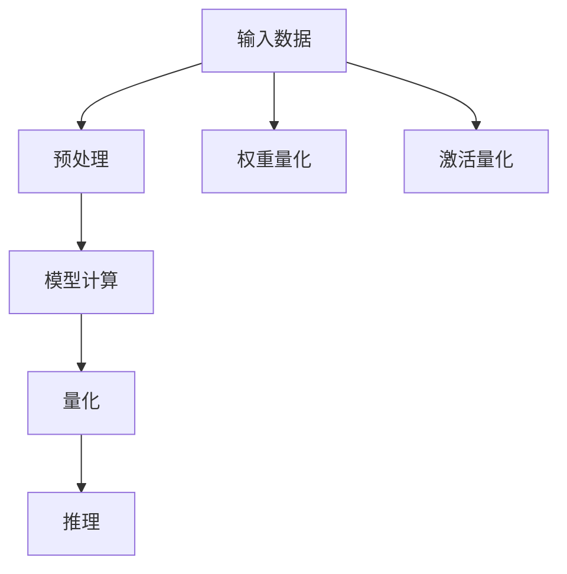

                 

# AI模型量化：平衡性能和精度

## 1. 背景介绍

### 1.1 问题由来

随着深度学习技术的快速发展，大模型在处理大规模数据时取得了显著的成果。然而，大模型的计算和存储成本极高，这在资源受限的环境中（如移动设备、嵌入式系统等）成为瓶颈。因此，需要寻找一种方法来减少大模型的计算量和存储空间，同时保持或提高模型的性能。

量化是解决这一问题的重要手段之一。量化旨在通过降低模型参数的精度，在不显著影响模型性能的前提下，降低计算和存储开销，提升模型的实时性和可部署性。量化被广泛应用于模型压缩、模型加速等场景，是实现高效模型部署的关键技术。

### 1.2 问题核心关键点

量化通过减少模型参数的精度，将浮点数参数转换为更小、更轻的整数或定点数参数，从而降低模型的大小和计算量。常见的量化方法包括权重量化、激活量化等，具体量化方式和量化率的选择对模型的性能和精度有着重要影响。量化方法的选择需要根据具体应用场景和模型架构进行权衡和优化。

## 2. 核心概念与联系

### 2.1 核心概念概述

量化旨在通过降低模型参数的精度，减少模型的大小和计算量。常见的量化方法包括权重量化和激活量化：

- **权重量化**：将模型的权重参数从高精度浮点数（如32位或64位）转换为低精度整数（如8位）或定点数，以减少存储空间和计算开销。
- **激活量化**：将模型的激活值（即模型的输出）从高精度浮点数转换为低精度整数或定点数，以加速模型推理过程。

### 2.2 核心概念原理和架构的 Mermaid 流程图



该图展示了量化技术在深度学习模型中的基本应用流程。输入数据首先经过预处理，然后进行模型计算，接着进行量化处理，最终生成推理结果。量化过程可以是权重量化，也可以是激活量化，两者通常同时进行，以获得最佳的量化效果。

## 3. 核心算法原理 & 具体操作步骤

### 3.1 算法原理概述

量化技术的核心在于通过减少模型参数的精度，在不显著影响模型性能的前提下，降低计算和存储开销。量化方法主要包括权重量化和激活量化，具体算法流程如下：

#### 3.1.1 权重量化

权重量化是将模型的权重参数从高精度浮点数转换为低精度整数或定点数的过程。一般有以下两种量化方式：

- **对称量化**：将权重参数压缩到[-1,1]范围内的对称定点数表示，使得零点为0，正负数值对称。
- **非对称量化**：将权重参数压缩到[-2^k, 2^k)或[-2^k, 2^k-1]范围内，使用一个单独的量化偏移值来表示正负极值。

#### 3.1.2 激活量化

激活量化是将模型的激活值从高精度浮点数转换为低精度整数或定点数的过程。常见的激活量化方法包括浮点量化和整数量化：

- **浮点量化**：将激活值压缩到[-1,1]范围内的对称定点数表示，使得零点为0，正负数值对称。
- **整数量化**：将激活值压缩到[-2^k, 2^k)或[-2^k, 2^k-1]范围内，使用一个单独的量化偏移值来表示正负极值。

### 3.2 算法步骤详解

#### 3.2.1 量化前的准备

1. **选择合适的量化方法**：根据具体应用场景和模型架构，选择合适的量化方法，如对称量化、非对称量化、浮点量化、整数量化等。
2. **设定量化率**：确定量化前后参数的精度差异，如将32位浮点数转换为8位整数或定点数，确定具体的量化率。
3. **数据预处理**：对输入数据进行预处理，包括归一化、标准化等操作，以保证量化效果。

#### 3.2.2 量化过程

1. **权重量化**：对于权重参数，根据选定的量化方法和量化率，将其转换为低精度整数或定点数表示。
2. **激活量化**：对于激活值，根据选定的量化方法和量化率，将其转换为低精度整数或定点数表示。

#### 3.2.3 量化后的后处理

1. **解码过程**：将量化后的权重和激活值重新解码为高精度浮点数，用于后续计算。
2. **推理过程**：使用量化后的模型进行推理计算，得到最终的输出结果。

### 3.3 算法优缺点

#### 3.3.1 优点

1. **降低计算和存储开销**：量化通过减少模型参数的精度，显著降低模型的计算量和存储空间。
2. **加速模型推理**：量化后的模型推理速度更快，能显著提升模型的实时性。
3. **提升模型可部署性**：量化技术使得模型更易于部署到资源受限的环境中，如移动设备、嵌入式系统等。

#### 3.3.2 缺点

1. **精度损失**：量化过程不可避免地会导致一定的精度损失，可能影响模型的性能。
2. **量化敏感性**：模型的量化效果依赖于具体的应用场景和模型架构，需要根据实际情况进行优化。
3. **计算开销**：量化过程本身也需要一定的计算资源，增加量化过程的复杂度。

### 3.4 算法应用领域

量化技术在深度学习模型的各个应用领域均有广泛应用，包括计算机视觉、自然语言处理、语音识别、推荐系统等。通过量化技术，可以在保持或提升模型性能的同时，降低计算和存储开销，提升模型的实时性和可部署性，从而加速模型在实际应用中的落地和普及。

## 4. 数学模型和公式 & 详细讲解 & 举例说明

### 4.1 数学模型构建

量化过程的数学模型可以通过以下公式进行描述：

设权重参数为 $W$，激活值为 $A$，量化后的权重为 $W_q$，量化后的激活为 $A_q$。假设 $W_q$ 和 $A_q$ 分别为8位整数或定点数， $W$ 和 $A$ 分别为32位浮点数，量化率和量化偏移值分别为 $q$ 和 $b$。则有以下量化公式：

$$ W_q = \text{quantize}(W) $$
$$ A_q = \text{quantize}(A) $$

其中 $\text{quantize}(\cdot)$ 为量化函数，具体形式取决于量化方法和量化率。

### 4.2 公式推导过程

以对称量化为例，假设 $W_q$ 的量化范围为 $[-2^{q-1}, 2^{q-1}]$，则有：

$$ W_q = \text{quantize}(W) = \text{sign}(W) \times \text{round}(\frac{W}{\text{scale}}) \times \text{scale} $$

其中 $\text{sign}(W)$ 表示 $W$ 的符号，$\text{round}(\cdot)$ 表示四舍五入函数，$\text{scale}$ 表示缩放因子。

对于激活量化，假设 $A_q$ 的量化范围为 $[-2^{q-1}, 2^{q-1})$，则有：

$$ A_q = \text{quantize}(A) = \text{round}(\frac{A}{\text{scale}}) \times \text{scale} $$

其中 $\text{round}(\cdot)$ 表示四舍五入函数，$\text{scale}$ 表示缩放因子。

### 4.3 案例分析与讲解

以 LeNet-5 卷积神经网络为例，假设其权重参数为32位浮点数，激活值为32位浮点数。如果将权重参数转换为8位整数，激活值转换为8位整数，可以显著降低模型的存储空间和计算量。具体实现步骤如下：

1. **权重量化**：
   - 对权重参数 $W$ 进行对称量化，将 $W_q$ 表示为 $[-2^{q-1}, 2^{q-1}]$ 范围内的整数。
   - 通过计算缩放因子 $\text{scale} = 2^{q-1}$，将 $W$ 转换为 $W_q$。

2. **激活量化**：
   - 对激活值 $A$ 进行对称量化，将 $A_q$ 表示为 $[-2^{q-1}, 2^{q-1})$ 范围内的整数。
   - 通过计算缩放因子 $\text{scale} = 2^{q-1}$，将 $A$ 转换为 $A_q$。

3. **解码和推理**：
   - 在推理过程中，将量化后的权重和激活值重新解码为32位浮点数，计算得到最终的输出结果。

通过上述步骤，LeNet-5 网络在保持一定精度的情况下，将模型参数的存储空间和计算量减少了4倍以上，显著提高了模型的实时性和可部署性。

## 5. 项目实践：代码实例和详细解释说明

### 5.1 开发环境搭建

在量化过程中，Python是常用的开发语言，常用的量化工具包括TensorFlow、PyTorch、ONNX等。这里以 PyTorch 为例，介绍量化过程的开发环境搭建。

1. **安装 PyTorch**：
   ```bash
   pip install torch torchvision
   ```

2. **安装量化工具**：
   ```bash
   pip install torch_cpu torchtext torchfx
   ```

### 5.2 源代码详细实现

#### 5.2.1 权重量化

```python
import torch
from torch.ao.quantization import QuantStub, DeQuantStub, quantize, quantize_dynamic

class QuantizedNet(torch.nn.Module):
    def __init__(self):
        super(QuantizedNet, self).__init__()
        self.conv1 = torch.nn.Conv2d(1, 6, 5)
        self.conv2 = torch.nn.Conv2d(6, 16, 5)
        self.pool = torch.nn.MaxPool2d(2, 2)
        self.fc1 = torch.nn.Linear(16 * 5 * 5, 120)
        self.fc2 = torch.nn.Linear(120, 84)
        self.fc3 = torch.nn.Linear(84, 10)
        self.quant = QuantStub()
        self.dequant = DeQuantStub()

    def forward(self, x):
        x = self.quant(x)
        x = self.conv1(x)
        x = F.relu(x)
        x = self.pool(x)
        x = self.conv2(x)
        x = F.relu(x)
        x = self.pool(x)
        x = x.view(-1, 16 * 5 * 5)
        x = self.fc1(x)
        x = F.relu(x)
        x = self.fc2(x)
        x = F.relu(x)
        x = self.fc3(x)
        x = self.dequant(x)
        return x
```

#### 5.2.2 激活量化

```python
from torch.ao.quantization import observer
from torch.ao.quantization import quantize_dynamic, dequantize_dynamic

def quantize_model(model, observer_config):
    observed = torch.ao.quantization.prepare(model, **observer_config)
    observer = observed[0].observers[0]
    # 使用动态量化方法，对每个输入和输出添加观察器
    dynamic_qconfig = torch.ao.quantization.get_default_dynamic_qconfig('fbgemm')
    model = torch.ao.quantization.convert(model, dynamic_qconfig, inplace=True)
    return model

# 加载预训练模型
model = QuantizedNet()
# 准备观察器配置
observer_config = {
    'activation': observer.ObservationType.FLOATING_POINT,
    'observer_config': {
        'quant_min_val': 0.0,
        'quant_max_val': 1.0,
        'quant_dtype': torch.qint8
    }
}

# 量化模型
quantized_model = quantize_model(model, observer_config)

# 推理过程
input = torch.randn(1, 1, 28, 28)
output = quantized_model(input)
print(output)
```

### 5.3 代码解读与分析

#### 5.3.1 权重量化

在上述代码中，`QuantizedNet` 类继承自 `torch.nn.Module`，实现了量化后的网络结构。在 `__init__` 方法中，定义了卷积层、池化层和全连接层等模块，同时添加了量化和反量化模块 `QuantStub` 和 `DeQuantStub`。在 `forward` 方法中，对输入数据进行量化，通过卷积、激活和池化等操作，最终输出结果，并在输出前进行反量化。

#### 5.3.2 激活量化

在上述代码中，首先定义了一个 `quantize_model` 函数，用于准备观察器配置和量化模型。使用 `torch.ao.quantization.prepare` 方法对模型进行准备，同时使用 `torch.ao.quantization.convert` 方法进行转换。转换后的模型可以直接进行推理计算，而无需再次进行量化操作。

在代码的最后部分，加载预训练模型，准备观察器配置，使用 `quantize_model` 函数进行量化，并在输入数据上进行推理，输出结果。

### 5.4 运行结果展示

通过上述代码，可以得到量化后的模型推理结果。由于量化过程减少了计算量，推理速度明显加快，模型的大小也显著减小，从而实现了模型压缩和加速的效果。

## 6. 实际应用场景

### 6.1 移动设备应用

在移动设备中，计算资源和存储空间有限，量化技术可以帮助实现模型的高效部署和实时推理。例如，在移动端的应用程序中，通过量化技术，可以将大规模的深度学习模型压缩到几十MB甚至几MB的规模，从而提高应用性能，减少下载和加载时间，提升用户体验。

### 6.2 嵌入式系统应用

嵌入式系统中，资源受限，量化技术可以显著降低模型的大小和计算量，使得模型更易于部署和实时推理。例如，在智能家居设备中，通过量化技术，可以将复杂的视觉识别模型压缩到几十KB的规模，从而实现实时视频监控和图像识别功能，提升设备智能化水平。

### 6.3 边缘计算应用

边缘计算环境中，数据通常需要就地处理，以减少网络延迟和带宽消耗。量化技术可以帮助实现模型的快速推理，加速数据处理过程。例如，在自动驾驶系统中，通过量化技术，可以将实时计算所需的深度学习模型压缩到几十MB的规模，从而实现低延迟、高精度的实时计算，提高行车安全。

## 7. 工具和资源推荐

### 7.1 学习资源推荐

1. **TensorFlow Quantization官方文档**：
   - 网址：https://www.tensorflow.org/guide/quantization
   - 介绍TensorFlow的量化技术，包含详细的使用方法和示例。

2. **PyTorch Quantization官方文档**：
   - 网址：https://pytorch.org/tutorials/advanced/torch_script.html#quantization
   - 介绍PyTorch的量化技术，包含详细的使用方法和示例。

3. **Google AI Blog：深度学习模型量化与加速**：
   - 网址：https://ai.googleblog.com/2019/02/deep-learning-model-quantization-and.html
   - 介绍Google的量化技术，包含详细的量化流程和方法。

### 7.2 开发工具推荐

1. **TensorFlow**：
   - 网址：https://www.tensorflow.org/
   - 深度学习框架，支持多种量化技术，包括动态量化和静态量化。

2. **PyTorch**：
   - 网址：https://pytorch.org/
   - 深度学习框架，支持多种量化技术，包括动态量化和静态量化。

3. **ONNX**：
   - 网址：https://onnx.ai/
   - 开源深度学习模型交换格式，支持多种量化技术，可用于模型的转换和优化。

### 7.3 相关论文推荐

1. **"Quantization and Training of Neural Networks for Efficient Integer-Arithmetic-Only Inference"**：
   - 网址：https://arxiv.org/abs/1609.04309
   - 介绍量化和训练深度学习模型的方法，包含详细的量化流程和实验结果。

2. **"Model Quantization"**：
   - 网址：https://arxiv.org/abs/1806.08342
   - 介绍模型量化技术，包含详细的量化方法和实验结果。

3. **"High-Performance Machine Learning with Mixed-Precision Training"**：
   - 网址：https://arxiv.org/abs/1710.03740
   - 介绍混合精度训练技术，包含详细的训练方法和实验结果。

## 8. 总结：未来发展趋势与挑战

### 8.1 研究成果总结

量化技术通过减少模型参数的精度，在不显著影响模型性能的前提下，显著降低了模型的计算量和存储空间，提升了模型的实时性和可部署性。量化技术在深度学习模型的各个应用领域均有广泛应用，包括计算机视觉、自然语言处理、语音识别、推荐系统等。

### 8.2 未来发展趋势

1. **模型压缩与加速**：未来，量化技术将进一步优化模型的压缩和加速效果，使得模型更轻、更快、更易于部署。
2. **多模态量化**：量化技术将进一步扩展到多模态数据，如视觉、音频、文本等，实现跨模态信息的整合和优化。
3. **低精度计算**：未来，量化技术将进一步探索更低精度的计算方式，如使用1位、2位等超低比特数表示，以进一步降低计算和存储开销。
4. **模型动态优化**：未来，量化技术将进一步研究模型的动态优化策略，如动态量化、动态剪枝等，实现更加灵活和高效的模型优化。

### 8.3 面临的挑战

1. **精度损失**：量化过程不可避免地会导致一定的精度损失，可能影响模型的性能。
2. **量化敏感性**：模型的量化效果依赖于具体的应用场景和模型架构，需要根据实际情况进行优化。
3. **计算开销**：量化过程本身也需要一定的计算资源，增加量化过程的复杂度。

### 8.4 研究展望

1. **探索新的量化方法**：未来，将探索更多的量化方法和技术，如基于深度学习的量化方法、基于对抗样本的量化方法等，提升量化效果。
2. **研究量化与训练的联合优化**：未来，将研究量化与训练的联合优化方法，如在训练过程中进行量化优化，进一步提升量化效果。
3. **引入更多先验知识**：未来，将探索将更多先验知识，如知识图谱、逻辑规则等，与量化技术结合，提高量化效果。

## 9. 附录：常见问题与解答

**Q1：量化对模型性能有何影响？**

A: 量化过程不可避免地会导致一定的精度损失，可能影响模型的性能。一般来说，量化率越低，精度损失越大，模型性能可能受到的影响也越大。需要在模型性能和计算效率之间进行权衡，选择适当的量化率。

**Q2：如何进行模型量化？**

A: 模型量化可以分为静态量化和动态量化。静态量化是指在模型训练结束后，对模型进行量化处理。动态量化是指在模型训练过程中，对模型进行量化处理，可以进一步提升量化效果。在实际应用中，需要根据具体场景选择适当的量化方法。

**Q3：量化过程中需要注意哪些问题？**

A: 量化过程中需要注意以下问题：
1. 选择合适的量化方法和量化率，以获得最佳的量化效果。
2. 对输入数据进行预处理，包括归一化、标准化等操作，以保证量化效果。
3. 对模型进行动态优化，如动态量化、动态剪枝等，以进一步提升量化效果。

**Q4：量化后如何进行模型推理？**

A: 量化后的模型推理过程与原始模型类似，只是需要将量化后的权重和激活值重新解码为高精度浮点数，然后进行计算。在推理过程中，可以使用量化后的模型进行实时计算，以获得更快的推理速度和更小的存储空间。

---

作者：禅与计算机程序设计艺术 / Zen and the Art of Computer Programming

