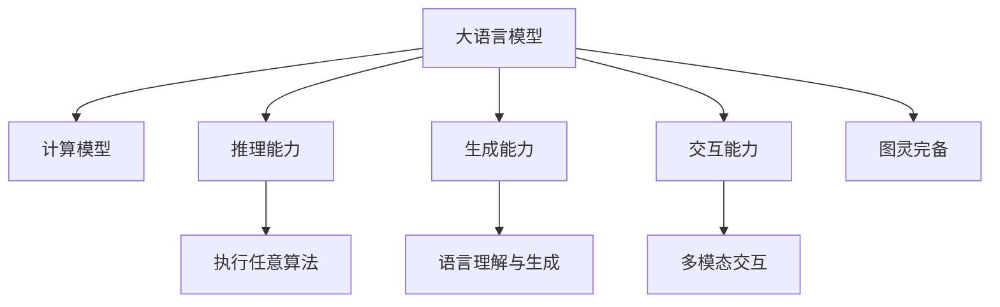
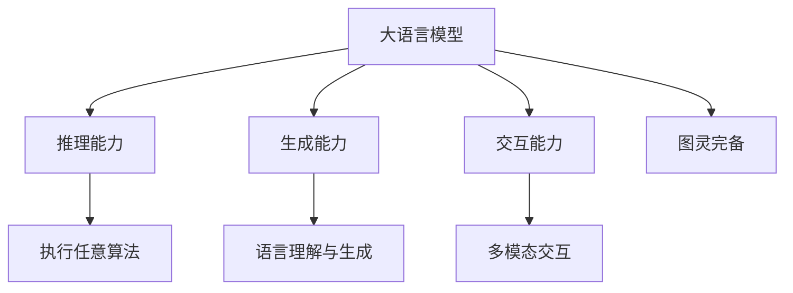

                 

# AI的全能性：LLM与图灵完备

> 关键词：大语言模型(LLM), 图灵完备, 人工智能, 计算模型, 语言生成, 推理能力

## 1. 背景介绍

### 1.1 问题由来

近年来，随着深度学习技术的飞速发展，人工智能(AI)领域迎来了新的突破，尤其是大语言模型(LLM)的涌现，彻底改变了自然语言处理(NLP)、计算机视觉(CV)等领域的传统应用模式。作为最先进的AI计算模型之一，LLM不仅能够处理自然语言，还具备强大的推理、生成能力，被誉为人工智能的"瑞士军刀"。

大语言模型如GPT-3、BERT、T5等，通过在大规模无标签文本语料上进行预训练，学习到了广泛的语言知识和结构，能够对语言进行深入理解、生成和推理。而图灵完备性作为AI系统所追求的理想状态，指的是一个计算模型能够执行任意算法，从而具备与通用图灵机(Turing Machine)相同的能力。

本文将深入探讨大语言模型与图灵完备性的关系，分析LLM在AI领域中的全能性表现，探讨其在推理、生成、交互等方面所展现出的图灵完备潜力。

### 1.2 问题核心关键点

大语言模型的全能性体现在其对各种AI任务的适应性和通用性上。通过了解和掌握LLM的核心概念和基本原理，可以更好地理解和应用其在AI领域中的强大能力。

以下是与大语言模型和图灵完备性相关的核心概念和关键点：

- **大语言模型(LLM)**：指在自然语言处理、计算机视觉等领域中，通过预训练和微调得到的能够执行各种AI任务的模型。
- **图灵完备性**：指一个计算模型能够执行任意算法，从而具备与通用图灵机相同的能力。
- **推理能力**：指模型能够根据输入的条件，推导出正确的结论或结果。
- **生成能力**：指模型能够根据输入的条件，生成符合逻辑和语法的文本或数据。
- **交互能力**：指模型能够通过输入和输出，与用户进行交互，执行各种任务。

理解这些核心概念及其相互关系，将有助于深入探讨大语言模型在图灵完备性方面的表现和应用。

## 2. 核心概念与联系

### 2.1 核心概念概述

大语言模型与图灵完备性的联系，主要体现在以下几个方面：

- **计算模型**：大语言模型是一种计算模型，通过学习大规模数据集中的语言知识，具备执行各种AI任务的能力。
- **执行任意算法**：大语言模型能够根据输入的文本或指令，执行各类算法和任务，体现了其图灵完备性。
- **语言理解与生成**：大语言模型通过学习自然语言的结构和语义，能够对语言进行理解、生成和推理，具备高度的智能性。
- **多模态交互**：大语言模型不仅限于文本数据，还能够在视觉、语音等多模态数据上执行任务，体现其强大的通用性。

这些概念之间的关系可以用以下Mermaid流程图来表示：



### 2.2 核心概念原理和架构的 Mermaid 流程图

由于篇幅限制，我们仅展示核心概念的图表，重点突出大语言模型与图灵完备性的联系。



## 3. 核心算法原理 & 具体操作步骤

### 3.1 算法原理概述

大语言模型的核心算法原理基于Transformer架构，通过自监督学习在无标签数据上进行预训练，学习到语言的通用表示。在此基础上，通过有监督学习在下游任务上进行微调，优化模型在特定任务上的性能。

大语言模型通过预训练-微调的方式，具备图灵完备性，即能够执行任意算法。具体而言，其推理能力、生成能力和交互能力，使其能够胜任各种AI任务，如自然语言理解、生成、对话、翻译等。

### 3.2 算法步骤详解

大语言模型的预训练和微调过程大致分为以下步骤：

1. **数据准备**：准备大规模无标签数据集，如维基百科、新闻等文本数据。
2. **预训练模型构建**：选择适合的语言模型架构（如BERT、GPT等），并进行参数初始化。
3. **自监督学习**：在预训练模型上进行自监督学习，如语言模型预测、掩码语言模型等。
4. **微调模型**：根据特定任务的需求，收集有标签数据集，对预训练模型进行微调。
5. **测试与部署**：在测试集上评估微调后的模型性能，并将其部署到实际应用中。

### 3.3 算法优缺点

大语言模型具有以下优点：

- **通用性强**：能够适应多种AI任务，如自然语言理解、生成、对话等。
- **推理能力强**：能够根据输入的条件，推导出正确的结论或结果。
- **生成质量高**：生成的文本和数据符合语法和语义要求。
- **交互流畅**：能够与用户进行自然语言交互，执行各类任务。

但同时也存在一些缺点：

- **数据依赖性强**：需要大规模数据进行预训练和微调。
- **计算资源消耗大**：需要高性能的计算设备进行训练和推理。
- **可解释性差**：模型的内部工作机制和决策逻辑较难解释。
- **偏见和有害信息**：可能学习到有害或偏见的信息，需要谨慎应用。

### 3.4 算法应用领域

大语言模型在多个AI领域中得到了广泛应用，如：

- **自然语言处理(NLP)**：如文本分类、情感分析、机器翻译、问答系统等。
- **计算机视觉(CV)**：如图像分类、物体检测、图像生成等。
- **推荐系统**：如个性化推荐、用户行为分析等。
- **金融科技**：如市场舆情分析、智能投顾等。
- **健康医疗**：如医疗问答、病历分析、辅助诊断等。

## 4. 数学模型和公式 & 详细讲解 & 举例说明

### 4.1 数学模型构建

大语言模型通常基于Transformer架构，通过自监督学习任务进行预训练。以BERT为例，其数学模型构建如下：

1. **输入嵌入层**：将输入文本转换为向量表示。
2. **编码器层**：通过多层Transformer块进行编码。
3. **池化层**：将编码器层的输出进行池化，得到固定长度的表示向量。
4. **分类器**：在池化层的输出上，使用全连接层进行分类或回归等任务。

### 4.2 公式推导过程

以BERT为例，其推理过程可以表示为：

$$
\text{Encoder}(\text{EncoderInput}, \theta) = \text{Transformer}(\text{Embedding}(\text{Input}), \theta)
$$

其中 $\theta$ 为模型参数，$\text{EncoderInput}$ 为输入文本，$\text{Embedding}$ 为输入嵌入层，$\text{Transformer}$ 为编码器层。

### 4.3 案例分析与讲解

以BERT的分类任务为例，假设输入文本为 $x$，模型参数为 $\theta$。分类任务的数学模型可以表示为：

$$
\text{Output} = \text{Linear}(\text{BERT}(\text{Embedding}(\text{x})), \theta)
$$

其中 $\text{Linear}$ 为分类器，$\text{BERT}$ 为BERT模型，$\text{Embedding}$ 为输入嵌入层。模型的输出 $\text{Output}$ 表示对输入文本 $x$ 进行分类后的标签。

## 5. 项目实践：代码实例和详细解释说明

### 5.1 开发环境搭建

在进行大语言模型的项目实践前，需要准备相应的开发环境。以下是使用Python进行PyTorch开发的环境配置流程：

1. 安装Anaconda：从官网下载并安装Anaconda，用于创建独立的Python环境。
2. 创建并激活虚拟环境：
```bash
conda create -n pytorch-env python=3.8 
conda activate pytorch-env
```

3. 安装PyTorch：根据CUDA版本，从官网获取对应的安装命令。例如：
```bash
conda install pytorch torchvision torchaudio cudatoolkit=11.1 -c pytorch -c conda-forge
```

4. 安装Transformers库：
```bash
pip install transformers
```

5. 安装各类工具包：
```bash
pip install numpy pandas scikit-learn matplotlib tqdm jupyter notebook ipython
```

完成上述步骤后，即可在`pytorch-env`环境中开始项目实践。

### 5.2 源代码详细实现

下面是使用PyTorch对BERT模型进行情感分析任务微调的Python代码实现。

```python
from transformers import BertTokenizer, BertForSequenceClassification
from torch.utils.data import Dataset, DataLoader
from sklearn.metrics import accuracy_score
from tqdm import tqdm

class TextDataset(Dataset):
    def __init__(self, texts, labels):
        self.texts = texts
        self.labels = labels
        self.tokenizer = BertTokenizer.from_pretrained('bert-base-uncased')

    def __len__(self):
        return len(self.texts)

    def __getitem__(self, item):
        text = self.texts[item]
        label = self.labels[item]
        encoding = self.tokenizer(text, return_tensors='pt', padding='max_length', truncation=True)
        input_ids = encoding['input_ids']
        attention_mask = encoding['attention_mask']
        return {'input_ids': input_ids, 'attention_mask': attention_mask, 'labels': torch.tensor(label, dtype=torch.long)}

train_dataset = TextDataset(train_texts, train_labels)
test_dataset = TextDataset(test_texts, test_labels)

model = BertForSequenceClassification.from_pretrained('bert-base-uncased', num_labels=2)
optimizer = AdamW(model.parameters(), lr=2e-5)

device = torch.device('cuda') if torch.cuda.is_available() else torch.device('cpu')
model.to(device)

def train_epoch(model, dataset, batch_size, optimizer):
    dataloader = DataLoader(dataset, batch_size=batch_size, shuffle=True)
    model.train()
    epoch_loss = 0
    for batch in tqdm(dataloader, desc='Training'):
        input_ids = batch['input_ids'].to(device)
        attention_mask = batch['attention_mask'].to(device)
        labels = batch['labels'].to(device)
        model.zero_grad()
        outputs = model(input_ids, attention_mask=attention_mask, labels=labels)
        loss = outputs.loss
        epoch_loss += loss.item()
        loss.backward()
        optimizer.step()
    return epoch_loss / len(dataloader)

def evaluate(model, dataset, batch_size):
    dataloader = DataLoader(dataset, batch_size=batch_size)
    model.eval()
    preds, labels = [], []
    with torch.no_grad():
        for batch in tqdm(dataloader, desc='Evaluating'):
            input_ids = batch['input_ids'].to(device)
            attention_mask = batch['attention_mask'].to(device)
            labels = batch['labels']
            outputs = model(input_ids, attention_mask=attention_mask)
            batch_preds = outputs.logits.argmax(dim=1).to('cpu').tolist()
            batch_labels = labels.to('cpu').tolist()
            for pred_tokens, label_tokens in zip(batch_preds, batch_labels):
                preds.append(pred_tokens[:len(label_tokens)])
                labels.append(label_tokens)
    return accuracy_score(labels, preds)

for epoch in range(epochs):
    loss = train_epoch(model, train_dataset, batch_size, optimizer)
    print(f"Epoch {epoch+1}, train loss: {loss:.3f}")
    acc = evaluate(model, test_dataset, batch_size)
    print(f"Epoch {epoch+1}, test acc: {acc:.3f}")
```

### 5.3 代码解读与分析

让我们再详细解读一下关键代码的实现细节：

**TextDataset类**：
- `__init__`方法：初始化文本、标签、分词器等关键组件。
- `__len__`方法：返回数据集的样本数量。
- `__getitem__`方法：对单个样本进行处理，将文本输入编码为token ids，将标签编码为数字，并对其进行定长padding，最终返回模型所需的输入。

**模型和优化器**：
- `BertForSequenceClassification`类：BERT的序列分类模型，用于执行文本分类任务。
- `AdamW`优化器：用于更新模型参数，支持权重衰减、梯度累积等功能。

**训练和评估函数**：
- 使用PyTorch的DataLoader对数据集进行批次化加载，供模型训练和推理使用。
- 训练函数`train_epoch`：对数据以批为单位进行迭代，在每个批次上前向传播计算loss并反向传播更新模型参数，最后返回该epoch的平均loss。
- 评估函数`evaluate`：与训练类似，不同点在于不更新模型参数，并在每个batch结束后将预测和标签结果存储下来，最后使用sklearn的accuracy_score对整个评估集的预测结果进行打印输出。

**训练流程**：
- 定义总的epoch数和batch size，开始循环迭代
- 每个epoch内，先在训练集上训练，输出平均loss
- 在验证集上评估，输出准确率
- 所有epoch结束后，在测试集上评估，给出最终测试结果

可以看到，PyTorch配合Transformers库使得BERT微调的代码实现变得简洁高效。开发者可以将更多精力放在数据处理、模型改进等高层逻辑上，而不必过多关注底层的实现细节。

当然，工业级的系统实现还需考虑更多因素，如模型的保存和部署、超参数的自动搜索、更灵活的任务适配层等。但核心的微调范式基本与此类似。

## 6. 实际应用场景

### 6.1 智能客服系统

基于大语言模型微调的对话技术，可以广泛应用于智能客服系统的构建。传统客服往往需要配备大量人力，高峰期响应缓慢，且一致性和专业性难以保证。而使用微调后的对话模型，可以7x24小时不间断服务，快速响应客户咨询，用自然流畅的语言解答各类常见问题。

在技术实现上，可以收集企业内部的历史客服对话记录，将问题和最佳答复构建成监督数据，在此基础上对预训练对话模型进行微调。微调后的对话模型能够自动理解用户意图，匹配最合适的答案模板进行回复。对于客户提出的新问题，还可以接入检索系统实时搜索相关内容，动态组织生成回答。如此构建的智能客服系统，能大幅提升客户咨询体验和问题解决效率。

### 6.2 金融舆情监测

金融机构需要实时监测市场舆论动向，以便及时应对负面信息传播，规避金融风险。传统的人工监测方式成本高、效率低，难以应对网络时代海量信息爆发的挑战。基于大语言模型微调的文本分类和情感分析技术，为金融舆情监测提供了新的解决方案。

具体而言，可以收集金融领域相关的新闻、报道、评论等文本数据，并对其进行主题标注和情感标注。在此基础上对预训练语言模型进行微调，使其能够自动判断文本属于何种主题，情感倾向是正面、中性还是负面。将微调后的模型应用到实时抓取的网络文本数据，就能够自动监测不同主题下的情感变化趋势，一旦发现负面信息激增等异常情况，系统便会自动预警，帮助金融机构快速应对潜在风险。

### 6.3 个性化推荐系统

当前的推荐系统往往只依赖用户的历史行为数据进行物品推荐，无法深入理解用户的真实兴趣偏好。基于大语言模型微调技术，个性化推荐系统可以更好地挖掘用户行为背后的语义信息，从而提供更精准、多样的推荐内容。

在实践中，可以收集用户浏览、点击、评论、分享等行为数据，提取和用户交互的物品标题、描述、标签等文本内容。将文本内容作为模型输入，用户的后续行为（如是否点击、购买等）作为监督信号，在此基础上微调预训练语言模型。微调后的模型能够从文本内容中准确把握用户的兴趣点。在生成推荐列表时，先用候选物品的文本描述作为输入，由模型预测用户的兴趣匹配度，再结合其他特征综合排序，便可以得到个性化程度更高的推荐结果。

### 6.4 未来应用展望

随着大语言模型和微调方法的不断发展，基于微调范式将在更多领域得到应用，为传统行业带来变革性影响。

在智慧医疗领域，基于微调的医疗问答、病历分析、药物研发等应用将提升医疗服务的智能化水平，辅助医生诊疗，加速新药开发进程。

在智能教育领域，微调技术可应用于作业批改、学情分析、知识推荐等方面，因材施教，促进教育公平，提高教学质量。

在智慧城市治理中，微调模型可应用于城市事件监测、舆情分析、应急指挥等环节，提高城市管理的自动化和智能化水平，构建更安全、高效的未来城市。

此外，在企业生产、社会治理、文娱传媒等众多领域，基于大模型微调的人工智能应用也将不断涌现，为经济社会发展注入新的动力。相信随着预训练语言模型和微调方法的持续演进，大语言模型微调必将在构建人机协同的智能时代中扮演越来越重要的角色。

## 7. 工具和资源推荐

### 7.1 学习资源推荐

为了帮助开发者系统掌握大语言模型微调的理论基础和实践技巧，这里推荐一些优质的学习资源：

1. 《Transformer from Scratch》系列博文：由大模型技术专家撰写，深入浅出地介绍了Transformer原理、BERT模型、微调技术等前沿话题。

2. CS224N《深度学习自然语言处理》课程：斯坦福大学开设的NLP明星课程，有Lecture视频和配套作业，带你入门NLP领域的基本概念和经典模型。

3. 《Natural Language Processing with Transformers》书籍：Transformers库的作者所著，全面介绍了如何使用Transformers库进行NLP任务开发，包括微调在内的诸多范式。

4. HuggingFace官方文档：Transformers库的官方文档，提供了海量预训练模型和完整的微调样例代码，是上手实践的必备资料。

5. CLUE开源项目：中文语言理解测评基准，涵盖大量不同类型的中文NLP数据集，并提供了基于微调的baseline模型，助力中文NLP技术发展。

通过对这些资源的学习实践，相信你一定能够快速掌握大语言模型微调的精髓，并用于解决实际的NLP问题。

### 7.2 开发工具推荐

高效的开发离不开优秀的工具支持。以下是几款用于大语言模型微调开发的常用工具：

1. PyTorch：基于Python的开源深度学习框架，灵活动态的计算图，适合快速迭代研究。大部分预训练语言模型都有PyTorch版本的实现。

2. TensorFlow：由Google主导开发的开源深度学习框架，生产部署方便，适合大规模工程应用。同样有丰富的预训练语言模型资源。

3. Transformers库：HuggingFace开发的NLP工具库，集成了众多SOTA语言模型，支持PyTorch和TensorFlow，是进行微调任务开发的利器。

4. Weights & Biases：模型训练的实验跟踪工具，可以记录和可视化模型训练过程中的各项指标，方便对比和调优。与主流深度学习框架无缝集成。

5. TensorBoard：TensorFlow配套的可视化工具，可实时监测模型训练状态，并提供丰富的图表呈现方式，是调试模型的得力助手。

6. Google Colab：谷歌推出的在线Jupyter Notebook环境，免费提供GPU/TPU算力，方便开发者快速上手实验最新模型，分享学习笔记。

合理利用这些工具，可以显著提升大语言模型微调任务的开发效率，加快创新迭代的步伐。

### 7.3 相关论文推荐

大语言模型和微调技术的发展源于学界的持续研究。以下是几篇奠基性的相关论文，推荐阅读：

1. Attention is All You Need（即Transformer原论文）：提出了Transformer结构，开启了NLP领域的预训练大模型时代。

2. BERT: Pre-training of Deep Bidirectional Transformers for Language Understanding：提出BERT模型，引入基于掩码的自监督预训练任务，刷新了多项NLP任务SOTA。

3. Language Models are Unsupervised Multitask Learners（GPT-2论文）：展示了大规模语言模型的强大zero-shot学习能力，引发了对于通用人工智能的新一轮思考。

4. Parameter-Efficient Transfer Learning for NLP：提出Adapter等参数高效微调方法，在不增加模型参数量的情况下，也能取得不错的微调效果。

5. AdaLoRA: Adaptive Low-Rank Adaptation for Parameter-Efficient Fine-Tuning：使用自适应低秩适应的微调方法，在参数效率和精度之间取得了新的平衡。

这些论文代表了大语言模型微调技术的发展脉络。通过学习这些前沿成果，可以帮助研究者把握学科前进方向，激发更多的创新灵感。

## 8. 总结：未来发展趋势与挑战

### 8.1 总结

本文对大语言模型与图灵完备性的关系进行了深入探讨。通过介绍大语言模型在推理、生成、交互等领域的全能性表现，分析其与图灵完备性的联系，并给出相关的实际应用案例。

通过本文的系统梳理，可以看到，大语言模型具备图灵完备性，能够在多领域执行各种AI任务。随着预训练语言模型和微调方法的持续演进，其在推理、生成、交互等方面的全能性将得到进一步提升，为更多行业带来变革性影响。

### 8.2 未来发展趋势

展望未来，大语言模型与图灵完备性相关的研究将呈现以下几个发展趋势：

1. **模型规模持续增大**：随着算力成本的下降和数据规模的扩张，预训练语言模型的参数量还将持续增长。超大规模语言模型蕴含的丰富语言知识，有望支撑更加复杂多变的下游任务微调。

2. **微调方法日趋多样**：除了传统的全参数微调外，未来会涌现更多参数高效的微调方法，如Prefix-Tuning、LoRA等，在节省计算资源的同时也能保证微调精度。

3. **持续学习成为常态**：随着数据分布的不断变化，微调模型也需要持续学习新知识以保持性能。如何在不遗忘原有知识的同时，高效吸收新样本信息，将成为重要的研究课题。

4. **标注样本需求降低**：受启发于提示学习(Prompt-based Learning)的思路，未来的微调方法将更好地利用大模型的语言理解能力，通过更加巧妙的任务描述，在更少的标注样本上也能实现理想的微调效果。

5. **多模态微调崛起**：当前的微调主要聚焦于纯文本数据，未来会进一步拓展到图像、视频、语音等多模态数据微调。多模态信息的融合，将显著提升语言模型对现实世界的理解和建模能力。

6. **通用性增强**：经过海量数据的预训练和多领域任务的微调，未来的语言模型将具备更强大的常识推理和跨领域迁移能力，逐步迈向通用人工智能(AGI)的目标。

以上趋势凸显了大语言模型微调技术的广阔前景。这些方向的探索发展，必将进一步提升大语言模型的性能和应用范围，为构建人机协同的智能时代中扮演越来越重要的角色。

### 8.3 面临的挑战

尽管大语言模型微调技术已经取得了瞩目成就，但在迈向更加智能化、普适化应用的过程中，它仍面临着诸多挑战：

1. **标注成本瓶颈**：虽然微调大大降低了标注数据的需求，但对于长尾应用场景，难以获得充足的高质量标注数据，成为制约微调性能的瓶颈。如何进一步降低微调对标注样本的依赖，将是一大难题。

2. **模型鲁棒性不足**：当前微调模型面对域外数据时，泛化性能往往大打折扣。对于测试样本的微小扰动，微调模型的预测也容易发生波动。如何提高微调模型的鲁棒性，避免灾难性遗忘，还需要更多理论和实践的积累。

3. **推理效率有待提高**：大规模语言模型虽然精度高，但在实际部署时往往面临推理速度慢、内存占用大等效率问题。如何在保证性能的同时，简化模型结构，提升推理速度，优化资源占用，将是重要的优化方向。

4. **可解释性亟需加强**：当前微调模型更像是"黑盒"系统，难以解释其内部工作机制和决策逻辑。对于医疗、金融等高风险应用，算法的可解释性和可审计性尤为重要。如何赋予微调模型更强的可解释性，将是亟待攻克的难题。

5. **安全性有待保障**：预训练语言模型难免会学习到有害或偏见的信息，通过微调传递到下游任务，产生误导性、歧视性的输出，给实际应用带来安全隐患。如何从数据和算法层面消除模型偏见，避免恶意用途，确保输出的安全性，也将是重要的研究课题。

6. **知识整合能力不足**：现有的微调模型往往局限于任务内数据，难以灵活吸收和运用更广泛的先验知识。如何让微调过程更好地与外部知识库、规则库等专家知识结合，形成更加全面、准确的信息整合能力，还有很大的想象空间。

正视微调面临的这些挑战，积极应对并寻求突破，将是大语言模型微调走向成熟的必由之路。相信随着学界和产业界的共同努力，这些挑战终将一一被克服，大语言模型微调必将在构建安全、可靠、可解释、可控的智能系统铺平道路。

### 8.4 研究展望

面向未来，大语言模型微调技术需要在以下几个方面寻求新的突破：

1. **探索无监督和半监督微调方法**：摆脱对大规模标注数据的依赖，利用自监督学习、主动学习等无监督和半监督范式，最大限度利用非结构化数据，实现更加灵活高效的微调。

2. **研究参数高效和计算高效的微调范式**：开发更加参数高效的微调方法，在固定大部分预训练参数的同时，只更新极少量的任务相关参数。同时优化微调模型的计算图，减少前向传播和反向传播的资源消耗，实现更加轻量级、实时性的部署。

3. **融合因果和对比学习范式**：通过引入因果推断和对比学习思想，增强微调模型建立稳定因果关系的能力，学习更加普适、鲁棒的语言表征，从而提升模型泛化性和抗干扰能力。

4. **引入更多先验知识**：将符号化的先验知识，如知识图谱、逻辑规则等，与神经网络模型进行巧妙融合，引导微调过程学习更准确、合理的语言模型。同时加强不同模态数据的整合，实现视觉、语音等多模态信息与文本信息的协同建模。

5. **结合因果分析和博弈论工具**：将因果分析方法引入微调模型，识别出模型决策的关键特征，增强输出解释的因果性和逻辑性。借助博弈论工具刻画人机交互过程，主动探索并规避模型的脆弱点，提高系统稳定性。

6. **纳入伦理道德约束**：在模型训练目标中引入伦理导向的评估指标，过滤和惩罚有偏见、有害的输出倾向。同时加强人工干预和审核，建立模型行为的监管机制，确保输出符合人类价值观和伦理道德。

这些研究方向的探索，必将引领大语言模型微调技术迈向更高的台阶，为构建安全、可靠、可解释、可控的智能系统铺平道路。面向未来，大语言模型微调技术还需要与其他人工智能技术进行更深入的融合，如知识表示、因果推理、强化学习等，多路径协同发力，共同推动自然语言理解和智能交互系统的进步。只有勇于创新、敢于突破，才能不断拓展语言模型的边界，让智能技术更好地造福人类社会。

## 9. 附录：常见问题与解答

**Q1：大语言模型是否具备图灵完备性？**

A: 大语言模型通过预训练和微调，具备执行各种AI任务的能力，因此在某种程度上具备图灵完备性。然而，大语言模型仍需依赖一定的数据和算法才能实现其全能性，并非真正的通用图灵机。

**Q2：如何缓解大语言模型微调过程中的过拟合问题？**

A: 过拟合是微调面临的主要挑战，尤其是在标注数据不足的情况下。常见的缓解策略包括：
1. 数据增强：通过回译、近义替换等方式扩充训练集
2. 正则化：使用L2正则、Dropout、Early Stopping等避免过拟合
3. 对抗训练：引入对抗样本，提高模型鲁棒性
4. 参数高效微调：只调整少量参数(如Adapter、Prefix等)，减小过拟合风险
5. 多模型集成：训练多个微调模型，取平均输出，抑制过拟合

这些策略往往需要根据具体任务和数据特点进行灵活组合。只有在数据、模型、训练、推理等各环节进行全面优化，才能最大限度地发挥大语言模型微调的威力。

**Q3：大语言模型在推理能力、生成能力和交互能力方面表现如何？**

A: 大语言模型在推理、生成和交互能力方面表现出色，具体如下：
1. 推理能力：能够根据输入的条件，推导出正确的结论或结果，如自然语言推理、逻辑推理等。
2. 生成能力：能够根据输入的条件，生成符合语法和语义要求的文本或数据，如文本摘要、故事生成等。
3. 交互能力：能够通过输入和输出，与用户进行自然语言交互，执行各种任务，如智能客服、对话系统等。

通过持续的预训练和微调，大语言模型在这些方面的能力将不断提升，展现出更加强大的全能性。

**Q4：大语言模型在多模态数据微调方面有哪些应用？**

A: 大语言模型在多模态数据微调方面具有广泛的应用前景，具体如下：
1. 跨模态语义理解：将文本与图像、语音等多模态数据结合，进行语义分析、情感分析等任务。
2. 多模态推荐系统：将用户的行为数据与图像、视频等多模态数据结合，生成个性化推荐结果。
3. 多模态问答系统：将问题与图片、语音等多种形式的数据结合，进行智能问答。
4. 多模态机器翻译：将源语言与目标语言的多模态数据结合，进行自动翻译。

多模态数据的整合将进一步提升大语言模型的理解和生成能力，拓展其在更多领域的落地应用。

**Q5：大语言模型微调技术未来有哪些新的研究方向？**

A: 大语言模型微调技术未来有以下新的研究方向：
1. 无监督和半监督微调：利用自监督学习、主动学习等无监督和半监督方法，降低对标注数据的依赖，实现更加灵活高效的微调。
2. 参数高效和计算高效的微调范式：开发更多参数高效的微调方法，在固定大部分预训练参数的同时，只更新极少量的任务相关参数。同时优化微调模型的计算图，减少资源消耗，实现更高效的部署。
3. 融合因果和对比学习：引入因果推断和对比学习思想，增强模型的泛化能力和抗干扰能力。
4. 引入更多先验知识：将知识图谱、逻辑规则等符号化知识与神经网络模型结合，提升模型的推理和生成能力。
5. 多模态微调：拓展到图像、视频、语音等多模态数据微调，提升模型的跨领域迁移能力。
6. 结合因果分析和博弈论工具：增强模型的因果推理和交互能力，提高系统的稳定性和可解释性。
7. 纳入伦理道德约束：在模型训练和应用过程中，引入伦理导向的评估指标，确保输出符合人类价值观和伦理道德。

这些研究方向将进一步推动大语言模型微调技术的进步，提升其在各个领域的适用性和安全性。

**Q6：大语言模型微调技术在实际应用中面临哪些挑战？**

A: 大语言模型微调技术在实际应用中面临以下挑战：
1. 标注成本瓶颈：微调需大量标注数据，对于长尾应用场景，难以获得充足的高质量标注数据。
2. 模型鲁棒性不足：面对域外数据，泛化性能有限，容易受到噪声和扰动的影响。
3. 推理效率有待提高：大规模语言模型在推理过程中存在计算效率低下的问题，需要优化模型结构和算法。
4. 可解释性差：模型的内部工作机制和决策逻辑较难解释，难以满足高风险应用的需求。
5. 安全性问题：可能学习到有害或偏见的信息，需要谨慎应用，避免误导性输出。
6. 知识整合能力不足：现有的微调模型往往局限于任务内数据，难以灵活吸收和运用广泛的先验知识。

正视这些挑战，积极寻求解决方案，是大语言模型微调技术走向成熟的关键。

