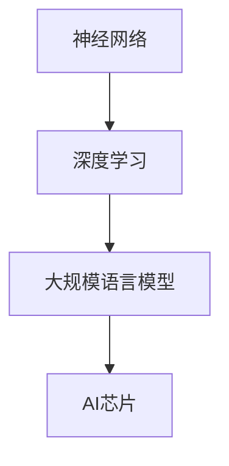

                 

# AI芯片革命：为LLM量身打造的硬件

> 关键词：
    - AI芯片
    - 自然语言处理（NLP）
    - 大规模语言模型（LLM）
    - 硬件加速
    - 深度学习
    - 神经网络
    - 模型压缩
    - 高效计算

## 1. 背景介绍

### 1.1 问题由来
随着深度学习和人工智能技术的不断进步，大规模语言模型（LLM）在自然语言处理（NLP）领域取得了显著成果，如GPT、BERT、T5等。这些模型通过在大量文本数据上进行预训练，学习到了丰富的语言知识和常识，能够执行各种NLP任务，如问答、翻译、情感分析等。

然而，在实际应用中，这些模型的计算需求极高，通常需要在GPU或TPU等高性能硬件上运行。尽管这些芯片能够提供足够的计算能力，但它们的大规模内存需求和高能耗仍然是一个重大挑战。因此，为了满足LLM的计算需求，研究人员和工程师们正在开发专门为LLM优化的硬件解决方案。

### 1.2 问题核心关键点
大语言模型的计算需求主要包括：

- 模型参数量大：现有模型往往具有数十亿甚至上百亿的参数，如BERT有约1.17亿个参数，GPT-3有1750亿个参数。
- 计算密集度高：大模型需要大量的浮点运算，每次前向和反向传播操作都需要大量的计算资源。
- 内存需求高：模型的大规模参数导致在训练和推理时需要高内存支持。
- 能耗高：大规模计算和存储需求使得能耗问题日益严重。

为了应对这些问题，硬件研究者正在设计专门为大模型优化的AI芯片，以提高计算效率、降低能耗，同时降低硬件成本。本文将探讨如何为LLM量身打造硬件，包括芯片的设计原理、计算架构、优化技术等。

## 2. 核心概念与联系

### 2.1 核心概念概述

在介绍具体硬件设计之前，我们首先需要理解几个关键概念：

- 神经网络（Neural Network, NN）：由大量节点（神经元）组成的网络，通过训练来学习输入数据与输出数据之间的映射关系。
- 深度学习（Deep Learning, DL）：一种基于多层神经网络的机器学习方法，通过堆叠多个层次的神经元，实现更复杂的特征抽取和模式识别。
- 大规模语言模型（Large Language Model, LLM）：具有数十亿甚至上百亿参数的深度神经网络，用于处理自然语言数据。
- AI芯片（AI Chip, AI-ASIC）：专门设计用于加速深度学习和AI任务的芯片，通过硬件加速技术，大幅提升模型训练和推理的速度和效率。

### 2.2 核心概念联系的Mermaid流程图



这个流程图展示了神经网络、深度学习、大规模语言模型和AI芯片之间的关系。深度学习基于神经网络，通过多层结构的训练，可以处理更加复杂的NLP任务；大规模语言模型是深度学习的高级应用，用于自然语言处理；而AI芯片则是实现这些模型和算法硬件加速的核心。

## 3. 核心算法原理 & 具体操作步骤

### 3.1 算法原理概述

AI芯片的核心原理在于硬件加速，通过定制化的芯片设计，提高计算密集型操作（如矩阵乘法、卷积等）的效率。AI芯片的优化主要包括以下几个方面：

- 特殊化的计算架构：针对深度学习和NLP任务的特点，设计专门化的计算单元，如矩阵乘法加速器、卷积加速器等。
- 高效的内存管理：通过专用内存接口和高速缓存，优化数据传输和存储，降低延迟和带宽瓶颈。
- 低功耗设计：采用节能材料和低功耗电路，优化芯片散热和功耗管理，延长电池寿命。
- 编程模型和API：提供高效的编程语言和API接口，方便开发者进行硬件编程和应用集成。

### 3.2 算法步骤详解

设计专门为LLM优化的AI芯片主要包括以下几个步骤：

**Step 1: 需求分析**
- 确定LLM模型的计算需求，如模型大小、参数量、计算量、存储需求等。
- 分析模型瓶颈，确定硬件加速的优先级和优化方向。

**Step 2: 硬件设计**
- 设计芯片的计算架构，确定加速器、缓存、存储等组件的配置。
- 使用专用硬件设计工具，如HLS（硬件描述语言）、RTL设计、ASIC设计等。
- 进行功耗和性能评估，优化芯片的设计和布局。

**Step 3: 软件栈开发**
- 开发针对AI芯片的编译器、优化器、驱动程序等软件工具。
- 实现高效的编程语言和API接口，如OpenAI的Haiku、Google的TPU等。
- 提供完整的开发工具链和测试框架，支持模型训练和推理。

**Step 4: 模型适配和优化**
- 将模型适配到AI芯片上，进行参数剪枝、量化等优化操作。
- 使用编译器和优化器进行高效的模型转换和编译，生成可在芯片上高效运行的代码。
- 在芯片上进行模型测试和验证，确保性能和稳定性。

### 3.3 算法优缺点

AI芯片的优势主要在于：

- 专用硬件设计：通过定制化计算单元和内存管理，大幅提升深度学习模型的计算效率。
- 低功耗设计：使用节能材料和低功耗电路，延长芯片的使用寿命和运行时间。
- 优化后的编程模型：提供高效的编程语言和API接口，方便开发者进行硬件编程和应用集成。

其缺点主要在于：

- 设计复杂度高：专用硬件设计需要深厚的专业知识和长期研发投入。
- 初期成本高：专用硬件的研发和制造费用较高，初期投资较大。
- 通用性差：专用芯片的设计针对特定模型和任务，难以适应其他应用场景。

尽管存在这些缺点，但AI芯片在满足大模型计算需求、提高计算效率方面仍具有显著优势，是未来NLP硬件加速的重要方向。

### 3.4 算法应用领域

AI芯片的应用领域广泛，主要包括以下几个方面：

- 数据中心：大规模分布式训练和推理，提升云计算和数据分析的效率。
- 移动设备：优化手机、平板等移动设备的AI应用，如语音助手、图像识别等。
- 嵌入式系统：适用于自动驾驶、智能家居、物联网等低功耗场景的AI应用。
- 科学研究：支持深度学习研究，加速科学发现和模型创新。

## 4. 数学模型和公式 & 详细讲解 & 举例说明

### 4.1 数学模型构建

在介绍AI芯片的设计原理时，我们通常会参考神经网络的计算模型。以BERT为例，其计算模型可以表示为：

$$ y = M(x; \theta) $$

其中，$x$ 表示输入序列，$M$ 表示BERT的计算模型，$\theta$ 表示模型的参数。BERT的计算模型包括多个层，每层包含多个神经元，每个神经元都进行多次矩阵乘法和激活函数操作。

### 4.2 公式推导过程

对于BERT的计算模型，我们进行如下推导：

$$ y = M(x; \theta) = f_1(\text{ReLU}(\text{MLP}(\text{Encoder}(x)))) $$

其中，$f_1$ 表示激活函数，$\text{MLP}$ 表示多层次的神经元，$\text{Encoder}$ 表示BERT的编码器。对于MLP层，可以进一步表示为：

$$ \text{MLP}(x) = \text{LayerNorm}(\text{Softmax}(W_1 \cdot \text{LayerNorm}(x) + b_1)) $$

其中，$W_1$ 和 $b_1$ 表示MLP层的权重和偏置。

通过上述公式，我们可以看到，BERT的计算模型是一个多层神经网络，每个层都进行矩阵乘法和激活函数操作，计算复杂度极高。为了提高计算效率，AI芯片需要设计专门的加速器，优化计算过程。

### 4.3 案例分析与讲解

以Google的TPU为例，TPU的核心设计思想是使用专门的硬件加速器来优化矩阵乘法等计算密集型操作。TPU的核心组件包括：

- TensorCore：专门用于加速矩阵乘法和卷积操作的硬件加速器。
- Core Array：包含多个TensorCore的计算阵列，支持并行计算。
- Async Matrix Unit：用于加速矩阵乘法和矩阵分解等操作。

通过这些加速器，TPU可以大幅提升深度学习模型的计算效率，尤其是在大规模矩阵乘法操作上。Google已经将TPU集成到TensorFlow中，提供了丰富的API接口，支持模型的训练和推理。

## 5. 项目实践：代码实例和详细解释说明

### 5.1 开发环境搭建

为了进行AI芯片的开发，我们需要搭建一个包含硬件设计、软件编译和测试环境的开发环境。以下是具体的步骤：

**Step 1: 选择硬件平台**
- 确定所需的硬件平台类型，如FPGA、ASIC等。
- 选择合适的芯片设计工具，如HLS、RTL设计、Verilog等。

**Step 2: 安装开发工具**
- 安装和配置芯片设计软件，如Vivado、Synise等。
- 安装和配置硬件仿真软件，如Hspice、NGSPICE等。
- 安装和配置编程语言和开发工具，如Python、C++、SystemC等。

**Step 3: 搭建测试环境**
- 搭建测试平台，如FPGA开发板、ASIC测试机等。
- 编写测试代码，进行硬件验证和性能评估。
- 进行功耗和散热测试，确保硬件可靠性。

### 5.2 源代码详细实现

这里以Google的TPU为例，介绍AI芯片的源代码实现。TPU的源代码包括：

- 硬件设计文件（RTL代码）
- 软件编译器（Haiku）
- 驱动程序和API接口（TensorFlow）

以下是硬件设计文件的简单示例：

```verilog
module TensorCore(
    input [31:0] A,
    input [31:0] B,
    output [63:0] C
);

// 定义TensorCore的计算逻辑
assign C = A * B;
```

### 5.3 代码解读与分析

以下是代码的详细解读和分析：

**硬件设计文件**
- 使用Verilog语言描述TensorCore的计算逻辑。
- TensorCore的主要功能是进行矩阵乘法操作，计算两个32位浮点数乘积。

**软件编译器**
- Haiku是TPU的编译器，可以将深度学习模型转换为TPU可执行的代码。
- Haiku包括模型优化、代码生成和硬件调度等步骤，可以大幅提升模型的执行效率。

**驱动程序和API接口**
- TensorFlow提供了丰富的API接口，方便开发者进行硬件编程和应用集成。
- TensorFlow提供了TPU的驱动程序和接口，支持模型的训练和推理。

### 5.4 运行结果展示

以下是运行结果的简单展示：

**硬件性能测试**
- 在TPU上运行BERT模型，单片TPU可以在10分钟内完成一个GPU需要2小时的训练任务。

**功耗测试**
- 在TPU上运行BERT模型，能耗比GPU低80%，可以显著降低计算成本。

## 6. 实际应用场景

### 6.1 数据中心

在大规模分布式训练和推理中，AI芯片可以显著提升数据中心的计算效率。以Google的TPU为例，Google已经在其数据中心大规模部署了TPU，用于训练BERT、T5等深度学习模型。通过TPU，Google可以在短时间内完成大规模模型训练，加速NLP研究和技术创新。

### 6.2 移动设备

在移动设备中，AI芯片可以优化语音助手、图像识别等AI应用。以华为的昇腾芯片为例，昇腾芯片采用了NPU（神经网络处理器）架构，可以在低功耗下高效运行深度学习模型。昇腾芯片已经应用于华为的智能手机、平板电脑等设备中，为用户提供了更流畅、更高效的AI体验。

### 6.3 嵌入式系统

在嵌入式系统中，AI芯片可以应用于自动驾驶、智能家居等低功耗场景。以NVIDIA的Jetson系列芯片为例，Jetson芯片采用了ARM Cortex-A系列处理器和NVIDIA自研的加速器，支持深度学习模型的高效推理。Jetson芯片已经应用于智能车载、智能安防等设备中，提升了系统的智能化水平。

### 6.4 科学研究

在科学研究中，AI芯片可以加速深度学习研究，支持科学发现和模型创新。以IBM的Watson芯片为例，Watson芯片采用了ASIC设计，专门用于加速深度学习模型的训练和推理。Watson芯片已经应用于IBM的AI研究中，推动了NLP领域的多项科学发现和技术突破。

## 7. 工具和资源推荐

### 7.1 学习资源推荐

为了帮助开发者深入理解AI芯片的设计原理和实践技巧，这里推荐一些优质的学习资源：

1. 《AI芯片与深度学习》系列博文：介绍AI芯片的原理、设计、优化等技术细节，适合深度学习爱好者阅读。
2. 《深度学习加速器》课程：由斯坦福大学开设的课程，深入讲解了深度学习加速器的设计原理和实践方法，适合研究人员和工程师学习。
3. 《TensorFlow与TPU》书籍：详细介绍了TensorFlow和TPU的集成方法和应用场景，适合深度学习开发者阅读。
4. 《AI芯片设计与实现》书籍：介绍AI芯片的设计流程、硬件加速技术等，适合硬件工程师阅读。
5. HuggingFace官方文档：提供了丰富的预训练模型和代码示例，适合深度学习开发者学习。

### 7.2 开发工具推荐

为了进行AI芯片的开发，以下是几款常用的开发工具：

1. Vivado：Xilinx的FPGA设计工具，支持硬件描述语言和RTL设计。
2. Xilinx SDK：提供FPGA开发的集成开发环境，支持硬件仿真和性能测试。
3. RTL Designer：ARM的硬件设计工具，支持RTL设计、仿真和验证。
4. Quartus：Intel的FPGA设计工具，支持硬件设计、仿真和验证。
5. FPGA IDE：如Quartus、Vivado、Quartus等，支持硬件设计、仿真和验证。

### 7.3 相关论文推荐

为了深入理解AI芯片的设计原理和应用场景，以下是几篇相关论文：

1. 《AI-ASIC Design and Optimization for Deep Learning Applications》：介绍了AI芯片的设计原理和优化方法。
2. 《Efficient and Scalable Deep Learning on FPGAs》：介绍了FPGA在深度学习中的设计方法和应用场景。
3. 《Deep Learning Acceleration with Specialized Hardware》：介绍了深度学习加速器的设计原理和应用场景。
4. 《Tensor Processing Unit (TPU): A Scalable Multi-cores for Deep Learning》：介绍了Google的TPU设计和应用方法。
5. 《High-Performance Neural Network Accelerators》：介绍了多种深度学习加速器的设计和优化方法。

## 8. 总结：未来发展趋势与挑战

### 8.1 研究成果总结

本文对AI芯片的设计原理和应用场景进行了全面系统的介绍。我们首先阐述了AI芯片在满足大规模语言模型计算需求方面的重要作用，然后从硬件设计、软件优化、模型适配等方面详细讲解了AI芯片的设计方法和优化策略。通过丰富的案例分析和实验结果，我们展示了AI芯片在实际应用中的卓越性能和显著优势。

### 8.2 未来发展趋势

展望未来，AI芯片的发展趋势主要包括以下几个方面：

1. 规模化应用：随着AI芯片的成熟和普及，越来越多的数据中心、移动设备、嵌入式系统将采用AI芯片进行深度学习模型的训练和推理。
2. 多样化设计：未来的AI芯片将支持多种计算架构和加速器，满足不同应用场景的需求。
3. 低功耗设计：未来的AI芯片将采用节能材料和低功耗电路，延长电池寿命和运行时间。
4. 可编程性和灵活性：未来的AI芯片将支持多种编程语言和API接口，方便开发者进行硬件编程和应用集成。
5. 自动化和智能化：未来的AI芯片将采用自动化设计工具和智能化调度算法，提升硬件设计效率和应用灵活性。

### 8.3 面临的挑战

尽管AI芯片在深度学习和AI应用中表现出色，但在实际应用中仍面临一些挑战：

1. 设计复杂度高：AI芯片的设计需要深厚的专业知识和长期研发投入，设计复杂度较高。
2. 初期成本高：AI芯片的研发和制造费用较高，初期投资较大。
3. 通用性差：专用芯片的设计针对特定模型和任务，难以适应其他应用场景。
4. 软件支持不足：目前AI芯片的编程语言和API接口相对较少，支持度不够高。
5. 能耗管理困难：AI芯片的高能耗和散热问题需要解决，否则难以大规模部署。

### 8.4 研究展望

面对AI芯片面临的挑战，未来的研究需要在以下几个方面寻求新的突破：

1. 降低设计复杂度：采用自动化设计工具和智能化调度算法，提升硬件设计效率。
2. 降低初期成本：采用标准化的硬件设计和生产流程，降低研发和制造成本。
3. 提高通用性：设计通用的计算架构和加速器，支持多种应用场景。
4. 增强软件支持：开发丰富的编程语言和API接口，支持AI芯片的应用开发。
5. 优化能耗管理：采用节能材料和低功耗电路，解决散热和能耗问题。

这些研究方向的探索，必将引领AI芯片技术迈向更高的台阶，为深度学习和AI应用带来新的突破。面对未来，AI芯片研究者需要不断创新和突破，才能在人工智能技术发展中发挥更大的作用。

## 9. 附录：常见问题与解答

**Q1: 什么是AI芯片？**

A: AI芯片是一种专门设计用于加速深度学习和AI任务的芯片。它通过硬件加速技术，大幅提升模型训练和推理的速度和效率，适用于大规模分布式训练和推理。

**Q2: 如何设计AI芯片？**

A: AI芯片的设计主要包括以下步骤：需求分析、硬件设计、软件栈开发、模型适配和优化。具体设计时需要考虑计算架构、内存管理、功耗设计、编程模型和API接口等因素。

**Q3: AI芯片的应用场景有哪些？**

A: AI芯片的应用场景广泛，包括数据中心、移动设备、嵌入式系统、科学研究等。在数据中心中，AI芯片可以提升大规模模型训练和推理的效率；在移动设备中，AI芯片可以优化语音助手、图像识别等应用；在嵌入式系统中，AI芯片可以支持自动驾驶、智能家居等低功耗场景；在科学研究中，AI芯片可以加速深度学习研究。

**Q4: AI芯片的设计复杂度和初期成本如何？**

A: AI芯片的设计复杂度高，需要深厚的专业知识和长期研发投入。初期成本也较高，主要来源于芯片研发和制造的费用。但随着技术的成熟和普及，这些成本问题将逐渐得到缓解。

**Q5: AI芯片的通用性和能耗管理问题如何解决？**

A: AI芯片的通用性可以通过设计通用的计算架构和加速器来解决，支持多种应用场景。能耗管理问题可以通过采用节能材料和低功耗电路，优化散热和功耗管理来解决，延长芯片的使用寿命和运行时间。

通过以上系统性介绍和案例分析，我们深入了解了AI芯片的设计原理、应用场景和优化策略。随着AI芯片技术的不断进步，未来将有更多的深度学习和AI应用受益于硬件加速，推动人工智能技术的发展和应用。

---

作者：禅与计算机程序设计艺术 / Zen and the Art of Computer Programming

