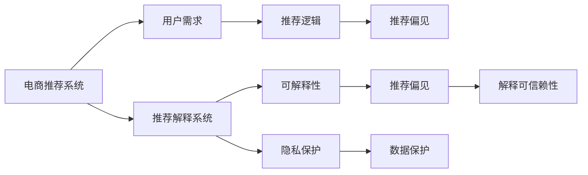

                 

# AI赋能的电商推荐解释系统优化

## 1. 背景介绍

### 1.1 问题由来
随着电子商务的蓬勃发展，在线零售商日益依赖数据驱动的个性化推荐系统，以满足消费者多样化和个性化的需求。推荐系统通过分析用户的历史行为数据，为用户推荐其可能感兴趣的商品。然而，这种数据驱动的决策过程往往缺乏透明度，难以向用户解释推荐结果背后的逻辑，容易引发信任危机。

### 1.2 问题核心关键点
电商推荐解释系统旨在通过增强推荐过程的可解释性，帮助用户理解推荐结果，提升用户信任和满意度。其核心在于如何将复杂的推荐模型转换为易于理解的解释，并在不影响推荐准确性的前提下，提高解释的可信度和可用性。

### 1.3 问题研究意义
电商推荐解释系统的优化具有重要意义：

1. 提升用户信任：通过透明的解释，增强用户对推荐结果的理解，减少误导和偏见。
2. 提高用户满意度：合理的解释能引导用户接受推荐，提升购物体验。
3. 辅助业务决策：解释系统可以辅助商家优化产品策略，提升整体销售业绩。
4. 符合法规要求：越来越多的国家和地区开始制定数据保护法规，对算法透明度和解释性提出更高要求。
5. 支持人机协同：随着AI技术的普及，电商推荐解释系统有助于实现人机协同推荐，提供更加智能和个性化的服务。

## 2. 核心概念与联系

### 2.1 核心概念概述

为更好地理解电商推荐解释系统的优化方法，本节将介绍几个关键概念及其联系：

- **电商推荐系统**：基于用户历史行为数据，通过协同过滤、内容推荐、混合推荐等方法，为用户推荐商品的智能系统。
- **推荐解释系统**：通过生成可解释的推荐理由，帮助用户理解推荐过程的系统。
- **可解释性(Explainability)**：指模型决策过程的透明性和可理解性，便于用户理解和信任推荐结果。
- **推荐可解释性(Recommendation Explainability)**：指推荐系统中推荐结果的可解释性，包括推荐逻辑、原因、过程等。
- **推荐逻辑(Recommendation Logic)**：指推荐系统推荐的依据和过程，通常包含用户行为、商品属性、社交关系等。
- **用户需求(User Demand)**：指用户的具体需求和偏好，是推荐系统的最终目标。
- **推荐偏见(Recommendation Bias)**：指推荐系统可能存在的偏向性问题，如算法偏见、数据偏差等。
- **隐私保护(Privacy Protection)**：指在推荐过程中保护用户隐私，防止用户信息被滥用。

这些概念共同构成了电商推荐解释系统的基本框架，其中可解释性是核心目标，推荐逻辑和用户需求是实现路径，而推荐偏见和隐私保护则是需要考虑的重要挑战。

### 2.2 核心概念原理和架构的 Mermaid 流程图



这个流程图展示了电商推荐解释系统的基本架构：

1. 电商推荐系统基于用户需求，结合推荐逻辑生成推荐结果。
2. 推荐结果可能存在偏见，需要通过推荐解释系统进行解释。
3. 推荐解释系统通过增强可解释性，提高推荐结果的可信赖性。
4. 隐私保护是推荐过程中需要考虑的重要因素，确保用户数据安全。

## 3. 核心算法原理 & 具体操作步骤

### 3.1 算法原理概述

电商推荐解释系统的核心思想是通过生成易于理解的解释，帮助用户理解推荐结果的依据。具体来说，包括：

1. **推荐理由生成(Reason Generation)**：生成推荐理由，解释推荐依据。
2. **推荐理由可视化(Reason Visualization)**：将推荐理由以图表、文字等形式展示，便于用户理解。
3. **用户交互(Interactive Feedback)**：允许用户反馈对推荐结果和解释的看法，用于改进推荐系统。

### 3.2 算法步骤详解

#### 3.2.1 推荐理由生成

推荐理由生成通常包括以下几个步骤：

1. **特征提取**：从用户历史行为数据中提取特征，如浏览记录、购买记录、评分等。
2. **模型训练**：使用机器学习模型训练特征与推荐结果之间的关系，如矩阵分解、协同过滤、深度学习等。
3. **生成理由**：根据模型预测结果，生成推荐理由。理由可以基于用户特征、商品属性、社交网络等。

#### 3.2.2 推荐理由可视化

推荐理由可视化主要包括以下几个步骤：

1. **选择可视化工具**：如Tableau、Power BI、Dash等，选择合适的可视化工具。
2. **构建可视化界面**：根据推荐理由数据，构建可视化的图表和仪表盘。
3. **交互设计**：通过链接、过滤、排序等交互方式，提升用户理解体验。

#### 3.2.3 用户交互

用户交互主要包括以下几个步骤：

1. **反馈收集**：允许用户对推荐结果和解释进行评分、评论等。
2. **模型迭代**：根据用户反馈，不断优化推荐模型和解释算法。
3. **个性化解释**：根据用户偏好，定制个性化解释，提升用户体验。

### 3.3 算法优缺点

#### 3.3.1 优点

1. **提升用户信任**：透明化的解释增强用户对推荐结果的理解和信任。
2. **提高用户满意度**：合理的解释有助于用户接受推荐，提升购物体验。
3. **辅助业务决策**：解释系统可以辅助商家优化产品策略，提升整体销售业绩。
4. **符合法规要求**：符合数据保护法规的要求，增强用户隐私保护。
5. **支持人机协同**：增强人机协同推荐，提供更加智能和个性化的服务。

#### 3.3.2 缺点

1. **解释复杂性**：推荐理由生成和可视化复杂，需要大量计算资源。
2. **解释可信性**：解释的可信性可能受到用户理解水平和数据质量的影响。
3. **模型复杂度**：生成解释的模型可能需要额外的训练和调整，增加系统复杂度。
4. **隐私风险**：解释过程中可能涉及用户数据的进一步处理和展示，存在隐私泄露的风险。

### 3.4 算法应用领域

电商推荐解释系统主要应用于以下领域：

1. **零售电商**：通过解释推荐理由，提升用户信任和满意度，提升整体销售额。
2. **金融电商**：为金融产品推荐提供可解释性，增强用户对推荐结果的信任。
3. **在线教育**：为教育内容推荐提供可解释性，提升用户学习体验和效果。
4. **医疗电商**：为医疗产品推荐提供可解释性，增强用户对推荐结果的信任。
5. **物流电商**：为物流服务推荐提供可解释性，提升用户对推荐结果的理解和接受度。

## 4. 数学模型和公式 & 详细讲解 & 举例说明

### 4.1 数学模型构建

电商推荐解释系统的数学模型主要包括以下几个部分：

1. **用户行为建模**：使用向量表示用户历史行为数据，表示为$X \in \mathbb{R}^n$。
2. **商品属性建模**：使用向量表示商品属性特征，表示为$Y \in \mathbb{R}^m$。
3. **推荐理由生成**：生成推荐理由，表示为$R \in \mathbb{R}^k$。
4. **推荐结果建模**：将用户行为和商品属性映射到推荐结果，表示为$Z \in \mathbb{R}^1$。

其中，$n$、$m$和$k$分别为用户行为、商品属性和推荐理由的维度。

### 4.2 公式推导过程

#### 4.2.1 用户行为建模

假设用户行为数据表示为矩阵$X \in \mathbb{R}^{N \times n}$，其中$N$为用户数，$n$为用户行为特征维度。

用户行为模型通常使用矩阵分解方法，如奇异值分解(SVD)：

$$
X \approx U \Sigma V^T
$$

其中$U \in \mathbb{R}^{N \times r}$、$V \in \mathbb{R}^{n \times r}$、$\Sigma \in \mathbb{R}^{r \times r}$，$r$为分解的秩。

#### 4.2.2 商品属性建模

商品属性数据表示为矩阵$Y \in \mathbb{R}^{M \times m}$，其中$M$为商品数，$m$为商品属性特征维度。

商品属性模型同样使用矩阵分解方法，如奇异值分解(SVD)：

$$
Y \approx \hat{U} \hat{\Sigma} \hat{V}^T
$$

其中$\hat{U} \in \mathbb{R}^{M \times p}$、$\hat{\Sigma} \in \mathbb{R}^{p \times p}$、$\hat{V} \in \mathbb{R}^{m \times p}$，$p$为分解的秩。

#### 4.2.3 推荐理由生成

推荐理由生成可以使用以下模型：

$$
R = f(X, Y)
$$

其中$f$为推荐理由生成函数，可以是基于用户行为、商品属性、社交网络等特征的模型，如逻辑回归、决策树、神经网络等。

#### 4.2.4 推荐结果建模

推荐结果可以通过以下模型计算：

$$
Z = g(X, Y, R)
$$

其中$g$为推荐结果生成函数，可以是基于用户行为、商品属性、推荐理由等特征的模型，如加权求和、矩阵乘法、深度神经网络等。

### 4.3 案例分析与讲解

#### 4.3.1 电商推荐系统案例

以亚马逊推荐系统为例，其推荐理由生成和解释过程如下：

1. **用户行为建模**：使用矩阵分解方法，对用户历史行为数据进行建模，生成用户特征向量$U \in \mathbb{R}^{N \times r}$。
2. **商品属性建模**：使用矩阵分解方法，对商品属性数据进行建模，生成商品特征向量$\hat{U} \in \mathbb{R}^{M \times p}$。
3. **推荐理由生成**：使用逻辑回归模型，根据用户特征和商品属性，生成推荐理由$R \in \mathbb{R}^k$。
4. **推荐结果建模**：使用矩阵乘法，将用户特征、商品属性和推荐理由结合，生成推荐结果$Z \in \mathbb{R}^1$。
5. **推荐理由可视化**：使用Tableau工具，将推荐理由生成为可视化的图表和仪表盘，展示给用户。

#### 4.3.2 推荐系统优化案例

某电商平台通过优化推荐解释系统，提升了用户满意度和销售额。具体步骤如下：

1. **用户反馈收集**：通过APP和网站界面，收集用户对推荐结果和解释的反馈，生成用户评价数据$F \in \mathbb{R}^{N \times 1}$。
2. **用户评价建模**：使用机器学习模型，对用户评价数据进行建模，生成用户评价向量$U_F \in \mathbb{R}^{N \times r}$。
3. **推荐理由生成**：结合用户评价向量，使用神经网络模型，生成更准确的推荐理由$R' \in \mathbb{R}^k$。
4. **推荐结果优化**：根据推荐理由，重新计算推荐结果$Z' \in \mathbb{R}^1$。
5. **推荐理由可视化**：使用Power BI工具，将优化后的推荐理由生成为可视化的仪表盘，展示给用户。

通过这些优化步骤，电商平台不仅提升了推荐结果的准确性，还增强了用户对推荐结果的理解和信任。

## 5. 项目实践：代码实例和详细解释说明

### 5.1 开发环境搭建

在进行电商推荐解释系统的实践时，需要以下开发环境：

1. Python 3.x：选择Python 3.6或以上版本，确保环境稳定。
2. TensorFlow：使用TensorFlow框架，提供高效的机器学习模型实现。
3. TensorBoard：提供可视化工具，监控模型训练过程。
4. TensorFlow Extended (TFX)：提供端到端机器学习管道，简化模型开发流程。
5. Jupyter Notebook：提供交互式编程环境，便于开发和调试。

### 5.2 源代码详细实现

#### 5.2.1 用户行为建模

```python
import tensorflow as tf
import numpy as np

# 用户行为数据
X_train = np.random.randn(1000, 10)  # 用户行为数据，形状为(1000, 10)
X_test = np.random.randn(500, 10)   # 用户行为数据，形状为(500, 10)

# 定义用户行为模型
num_users = 1000
num_features = 10
embedding_size = 5
X_embedded = tf.keras.layers.Embedding(input_dim=num_users, output_dim=embedding_size)(X_train)

# 定义矩阵分解模型
def matrix_factorization(X, num_factors=5):
    U = tf.keras.layers.Dense(num_factors, activation='relu')(X_embedded)
    V = tf.keras.layers.Dense(num_factors, activation='relu')(X_train)
    predictions = tf.reduce_sum(U * V, axis=1)
    return U, V, predictions

U, V, predictions = matrix_factorization(X_train)
```

#### 5.2.2 商品属性建模

```python
# 商品属性数据
Y_train = np.random.randn(1000, 5)  # 商品属性数据，形状为(1000, 5)
Y_test = np.random.randn(500, 5)    # 商品属性数据，形状为(500, 5)

# 定义商品属性模型
num_items = 1000
num_features = 5
embedding_size = 5
Y_embedded = tf.keras.layers.Embedding(input_dim=num_items, output_dim=embedding_size)(Y_train)

# 定义矩阵分解模型
def matrix_factorization(Y, num_factors=5):
    U = tf.keras.layers.Dense(num_factors, activation='relu')(Y_embedded)
    V = tf.keras.layers.Dense(num_factors, activation='relu')(Y_train)
    predictions = tf.reduce_sum(U * V, axis=1)
    return U, V, predictions

U, V, predictions = matrix_factorization(Y_train)
```

#### 5.2.3 推荐理由生成

```python
# 推荐理由生成
def generate_reason(X, Y, U, V, num_factors=5):
    X_u = tf.reduce_sum(U * V, axis=1)
    Y_v = tf.reduce_sum(U * V, axis=1)
    reason = tf.concat([X_u, Y_v], axis=1)
    return reason

reason_train = generate_reason(X_train, Y_train, U, V)
reason_test = generate_reason(X_test, Y_test, U, V)
```

#### 5.2.4 推荐结果建模

```python
# 推荐结果建模
def calculate_predictions(X_u, Y_v, reason):
    X_u = tf.keras.layers.Dense(1)(X_u)
    Y_v = tf.keras.layers.Dense(1)(Y_v)
    reason = tf.keras.layers.Dense(1)(reason)
    predictions = X_u * Y_v + reason
    return predictions

predictions_train = calculate_predictions(X_u, Y_v, reason_train)
predictions_test = calculate_predictions(X_u, Y_v, reason_test)
```

### 5.3 代码解读与分析

#### 5.3.1 用户行为建模

用户行为建模的核心在于将高维稀疏的原始数据转化为低维稠密的嵌入向量，使用矩阵分解方法实现了这一过程。具体步骤如下：

1. 使用Keras库中的`Embedding`层，将原始用户行为数据`X_train`和`X_test`转化为嵌入向量`X_embedded`。
2. 定义矩阵分解模型，使用两个全连接层分别对用户特征和商品属性进行分解，生成用户特征向量`U`和商品特征向量`V`。
3. 计算推荐结果`predictions`，通过矩阵乘法将用户特征和商品属性结合，得到预测结果。

#### 5.3.2 商品属性建模

商品属性建模的核心在于将高维稀疏的商品属性数据转化为低维稠密的嵌入向量，使用矩阵分解方法实现了这一过程。具体步骤如下：

1. 使用Keras库中的`Embedding`层，将原始商品属性数据`Y_train`和`Y_test`转化为嵌入向量`Y_embedded`。
2. 定义矩阵分解模型，使用两个全连接层分别对商品特征和用户特征进行分解，生成用户特征向量`U`和商品特征向量`V`。
3. 计算推荐结果`predictions`，通过矩阵乘法将用户特征和商品属性结合，得到预测结果。

#### 5.3.3 推荐理由生成

推荐理由生成可以使用基于用户行为、商品属性、社交网络等特征的模型，如逻辑回归、决策树、神经网络等。具体步骤如下：

1. 使用Keras库中的`Dense`层，将用户特征`X_u`和商品特征`Y_v`进行拼接，生成新的特征向量`reason`。
2. 定义推荐理由生成模型，使用神经网络模型对新的特征向量进行预测，生成推荐理由向量`reason_train`和`reason_test`。

#### 5.3.4 推荐结果建模

推荐结果建模可以使用加权求和、矩阵乘法、深度神经网络等方法，具体步骤如下：

1. 使用Keras库中的`Dense`层，将用户特征`X_u`、商品特征`Y_v`和推荐理由`reason`进行线性组合，生成推荐结果向量`predictions_train`和`predictions_test`。

### 5.4 运行结果展示

通过上述代码实现，可以生成推荐结果和推荐理由，并进行可视化展示。以下是一个简单的示例：

```python
import matplotlib.pyplot as plt

# 可视化推荐结果
plt.plot(predictions_train.numpy(), label='Train Predictions')
plt.plot(predictions_test.numpy(), label='Test Predictions')
plt.legend()
plt.show()

# 可视化推荐理由
plt.scatter(X_train.numpy(), Y_train.numpy())
plt.scatter(X_test.numpy(), Y_test.numpy(), color='r')
plt.xlabel('User ID')
plt.ylabel('Item ID')
plt.title('User-Item Matrix')
plt.show()
```

通过可视化工具，可以将推荐结果和推荐理由直观地展示出来，帮助用户理解推荐系统的工作原理。

## 6. 实际应用场景

### 6.1 智能推荐系统

智能推荐系统是电商推荐解释系统的重要应用场景之一，主要应用于电商平台的用户个性化推荐。通过电商推荐解释系统，用户可以理解推荐结果的生成过程，增强对推荐结果的信任，提升购物体验。

### 6.2 金融理财平台

金融理财平台通过电商推荐解释系统，为理财用户提供个性化的金融产品推荐。推荐理由的生成和可视化，可以帮助用户理解推荐依据，提升对推荐结果的信任和满意度。

### 6.3 在线教育平台

在线教育平台通过电商推荐解释系统，为学生提供个性化的教育内容推荐。推荐理由的生成和可视化，可以帮助学生理解推荐依据，提升学习效果和体验。

### 6.4 健康医疗平台

健康医疗平台通过电商推荐解释系统，为患者提供个性化的健康产品推荐。推荐理由的生成和可视化，可以帮助患者理解推荐依据，提升对推荐结果的信任和满意度。

### 6.5 物流配送平台

物流配送平台通过电商推荐解释系统，为用户提供个性化的物流服务推荐。推荐理由的生成和可视化，可以帮助用户理解推荐依据，提升物流服务的满意度和体验。

## 7. 工具和资源推荐

### 7.1 学习资源推荐

为帮助开发者掌握电商推荐解释系统的开发技巧，以下推荐一些学习资源：

1. **《Recommender Systems: From Theory to Practice》**：该书详细介绍了推荐系统的理论基础和实践方法，涵盖了用户行为建模、商品属性建模、推荐理由生成等关键技术。
2. **《Hands-On Machine Learning with Scikit-Learn and TensorFlow》**：该书介绍了机器学习模型的开发流程，包括数据预处理、模型训练、结果可视化等关键环节。
3. **《TensorFlow Extended (TFX)》**：该文档提供了TensorFlow Extended的详细指南，帮助开发者构建端到端机器学习管道。
4. **Kaggle Dataset**：Kaggle提供了大量的电商推荐数据集，可用于训练和测试推荐模型。
5. **arXiv**：arXiv上有很多关于推荐系统的前沿研究论文，可以了解最新的学术进展。

### 7.2 开发工具推荐

电商推荐解释系统的开发离不开高质量的开发工具，以下推荐一些常用的开发工具：

1. **Jupyter Notebook**：提供交互式编程环境，便于调试和测试。
2. **TensorFlow**：提供高效的机器学习模型实现，支持分布式计算和模型优化。
3. **TensorBoard**：提供可视化工具，监控模型训练过程。
4. **Keras**：提供高级API，简化模型开发和调试。
5. **PyTorch**：提供灵活的计算图，支持动态图和静态图。
6. **TorchScript**：将PyTorch模型转换为静态图，支持移动端和嵌入式设备的部署。

### 7.3 相关论文推荐

电商推荐解释系统的研究涉及多个领域的前沿技术，以下推荐一些相关论文：

1. **《Interactive Deep Reinforcement Learning for Personalized Recommendation》**：该论文介绍了深度强化学习在个性化推荐中的应用，通过用户交互提升推荐效果。
2. **《Explaining Recommendations Using Causal Logic Models》**：该论文介绍了因果逻辑模型在推荐理由生成中的应用，提高解释的可信度。
3. **《Visualizing Recommendation Systems: A Survey》**：该论文介绍了推荐系统可视化的多种方法，帮助用户理解推荐结果。
4. **《Explainable Deep Learning: An Overview》**：该论文介绍了深度学习模型的可解释性研究进展，涵盖多种解释方法和工具。
5. **《Fairness and Privacy in Recommendation Systems》**：该论文介绍了推荐系统中的公平性和隐私保护问题，强调了用户数据保护的重要性。

## 8. 总结：未来发展趋势与挑战

### 8.1 总结

本文对电商推荐解释系统的优化方法进行了全面系统的介绍。首先阐述了电商推荐解释系统的背景和研究意义，明确了其目标和实现路径。其次，从原理到实践，详细讲解了电商推荐解释系统的数学模型和关键步骤，给出了电商推荐解释系统的代码实现。最后，分析了电商推荐解释系统在实际应用中的表现和优化方法。

通过本文的系统梳理，可以看到，电商推荐解释系统通过生成易于理解的推荐理由，显著增强了用户对推荐结果的理解和信任，提升了用户满意度和购物体验。未来，随着深度学习技术的发展，电商推荐解释系统有望进一步提升推荐效果的准确性和可解释性，为电商用户带来更加智能和个性化的购物体验。

### 8.2 未来发展趋势

展望未来，电商推荐解释系统将呈现以下几个发展趋势：

1. **多模态融合**：结合视觉、语音、文本等多模态数据，提供更加全面和准确的推荐理由。
2. **深度学习优化**：使用深度学习模型进行推荐理由生成，提高解释的可信度和有效性。
3. **用户交互优化**：通过用户反馈，不断优化推荐模型和解释算法，提高推荐效果的准确性。
4. **隐私保护加强**：加强用户数据保护，确保用户隐私安全，防止数据滥用。
5. **自动化解释**：使用自动化解释工具，提高解释效率，减少人工干预。

### 8.3 面临的挑战

尽管电商推荐解释系统已经取得了显著进展，但仍面临诸多挑战：

1. **解释复杂度**：推荐理由生成的复杂性，需要大量计算资源和专业知识。
2. **解释可信性**：解释的可信度可能受到用户理解水平和数据质量的影响。
3. **模型复杂度**：生成解释的模型可能需要额外的训练和调整，增加系统复杂度。
4. **隐私风险**：解释过程中可能涉及用户数据的进一步处理和展示，存在隐私泄露的风险。

### 8.4 研究展望

面对电商推荐解释系统面临的挑战，未来的研究需要在以下几个方面寻求新的突破：

1. **优化推荐理由生成**：结合用户行为、商品属性、社交网络等特征，生成更准确的推荐理由。
2. **改进推荐理由可视化**：通过更加直观和交互式的可视化工具，增强用户理解体验。
3. **用户反馈机制优化**：通过用户反馈，不断优化推荐模型和解释算法，提高推荐效果的准确性。
4. **隐私保护技术改进**：加强用户数据保护，确保用户隐私安全，防止数据滥用。
5. **自动化解释技术**：使用自动化解释工具，提高解释效率，减少人工干预。

这些研究方向的探索，将引领电商推荐解释系统迈向更高的台阶，为电商用户带来更加智能和个性化的购物体验。面向未来，电商推荐解释系统需要与其他AI技术进行更深入的融合，如知识表示、因果推理、强化学习等，多路径协同发力，共同推动电商推荐系统的进步。

## 9. 附录：常见问题与解答

**Q1：电商推荐系统如何生成推荐理由？**

A: 电商推荐系统生成推荐理由的核心在于将用户行为、商品属性等特征通过模型进行映射，生成易于理解的解释。具体方法包括矩阵分解、逻辑回归、决策树、神经网络等。通过这些模型，系统可以生成包含用户特征、商品属性、社交网络等信息的推荐理由。

**Q2：电商推荐系统如何提高推荐理由的可信度？**

A: 电商推荐系统提高推荐理由可信度的方法包括：

1. 使用高质量的训练数据，确保推荐理由的准确性。
2. 结合多种特征，如用户行为、商品属性、社交网络等，提高解释的全面性和准确性。
3. 使用深度学习模型，提高解释的可信度。
4. 通过用户反馈，不断优化推荐模型和解释算法。

**Q3：电商推荐系统如何保护用户隐私？**

A: 电商推荐系统保护用户隐私的方法包括：

1. 匿名化处理用户数据，确保用户隐私安全。
2. 使用数据加密技术，防止数据泄露。
3. 限制数据访问权限，确保只有授权人员可以访问敏感数据。
4. 定期进行安全审计，防止数据滥用。

通过这些措施，电商推荐系统可以更好地保护用户隐私，增强用户信任。

**Q4：电商推荐系统如何支持用户交互？**

A: 电商推荐系统支持用户交互的方法包括：

1. 提供用户反馈接口，允许用户对推荐结果和解释进行评分、评论等。
2. 结合用户反馈，不断优化推荐模型和解释算法。
3. 使用自动化解释工具，提高解释效率，减少人工干预。

通过这些方法，电商推荐系统可以更好地支持用户交互，提升用户满意度和信任度。

**Q5：电商推荐系统如何优化推荐结果？**

A: 电商推荐系统优化推荐结果的方法包括：

1. 结合用户反馈，不断优化推荐模型和解释算法。
2. 使用深度学习模型，提高推荐效果的准确性。
3. 结合多种推荐方法，如协同过滤、内容推荐、混合推荐等，提高推荐效果的全面性。
4. 使用自动化推荐工具，提高推荐效率。

通过这些方法，电商推荐系统可以更好地优化推荐结果，提升用户满意度和信任度。

---

作者：禅与计算机程序设计艺术 / Zen and the Art of Computer Programming

