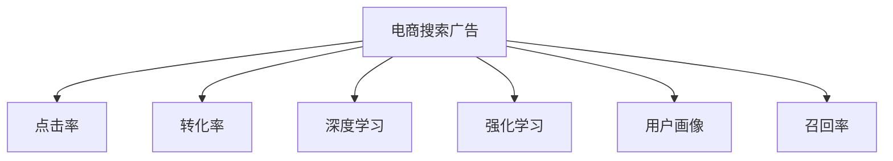

                 

## 1. 背景介绍

### 1.1 问题由来
随着电子商务的蓬勃发展，电商平台已成为消费者购买商品的主要渠道之一。电商平台如何精准地将广告投放给最感兴趣的消费者，提升转化率，一直是行业关注的焦点。传统的广告投放方式依赖于人工策略，费时费力且效果欠佳。AI赋能的广告投放策略通过深度学习和强化学习技术，可以显著提升广告投放的精准度和转化率。

### 1.2 问题核心关键点
AI赋能的电商搜索广告投放策略的核心在于利用机器学习算法预测用户行为和偏好，从而自动优化广告投放策略。其核心步骤包括用户行为数据的收集与处理、广告与用户行为的数据融合、广告投放策略的训练与优化等。

## 2. 核心概念与联系

### 2.1 核心概念概述

为更好地理解AI赋能的电商搜索广告投放策略，本节将介绍几个密切相关的核心概念：

- 电商搜索广告（E-commerce Search Ads）：指在电商平台上通过搜索关键词触发投放的广告形式，能够精准触达用户。
- 点击率（Click-Through Rate, CTR）：指广告被点击的次数与展示次数之比，衡量广告的吸引力。
- 转化率（Conversion Rate, CR）：指广告被点击后实际购买的比例，衡量广告的效果。
- 深度学习（Deep Learning）：一种通过多层神经网络模拟人脑神经元工作的学习算法，适用于处理复杂的非线性问题。
- 强化学习（Reinforcement Learning, RL）：通过与环境交互，优化策略以获得最大回报的学习范式，适用于决策类问题。
- 用户画像（User Persona）：指对用户的特征和行为的描述，用于识别并定位目标用户。
- 召回率（Recall）：指在所有相关样本中被正确检索到的样本占所有相关样本的比例，衡量广告投放的全面性。

这些核心概念之间的逻辑关系可以通过以下Mermaid流程图来展示：



这个流程图展示了大语言模型的核心概念及其之间的关系：

1. 电商搜索广告通过点击率和转化率来衡量其效果。
2. 深度学习和强化学习是优化广告投放策略的重要技术。
3. 用户画像用于识别并定位目标用户，提升广告的相关性和精准度。
4. 召回率衡量广告投放的全面性，确保重要用户被覆盖。

## 3. 核心算法原理 & 具体操作步骤
### 3.1 算法原理概述

AI赋能的电商搜索广告投放策略，本质上是一个有监督学习的预测模型，通过用户行为数据和广告特征数据来预测广告的点击率和转化率，从而优化广告投放策略。

形式化地，假设用户行为数据为 $X$，广告特征数据为 $Y$，广告投放策略为 $A$，点击率为 $CTR$，转化率为 $CR$。则预测模型的目标是最小化损失函数 $\mathcal{L}$，以优化广告投放策略：

$$
\mathcal{L} = \sum_{i=1}^N (CTR_i - \hat{CTR_i})^2 + \sum_{i=1}^N (CR_i - \hat{CR_i})^2
$$

其中，$CTR_i$ 和 $CR_i$ 为实际广告的点击率和转化率，$\hat{CTR_i}$ 和 $\hat{CR_i}$ 为预测的广告点击率和转化率。

通过梯度下降等优化算法，预测模型不断更新参数，最小化损失函数，使得预测的广告点击率和转化率逼近实际值。模型在实际投放广告前进行训练，并在实际广告投放中不断优化，以达到最优的广告投放策略。

### 3.2 算法步骤详解

AI赋能的电商搜索广告投放策略一般包括以下几个关键步骤：

**Step 1: 数据收集与预处理**
- 收集用户行为数据和广告特征数据，包括搜索关键词、浏览行为、点击行为、转化行为等。
- 对数据进行清洗和归一化处理，去除噪声和异常值，保证数据质量。

**Step 2: 特征工程**
- 提取和构造对广告投放有影响的用户行为特征和广告特征，如搜索词频率、浏览时长、点击率、广告文案长度等。
- 使用特征选择方法，如Lasso回归、随机森林等，筛选出对预测效果有显著影响的特征。

**Step 3: 模型选择与训练**
- 选择合适的机器学习模型，如线性回归、决策树、随机森林、神经网络等。
- 使用历史广告投放数据作为训练集，使用交叉验证等技术，训练预测模型。

**Step 4: 策略优化**
- 根据预测模型的输出，设计广告投放策略，如关键词广告位分配、预算分配等。
- 使用强化学习算法，如Q-learning、策略梯度等，优化广告投放策略。

**Step 5: 效果评估**
- 使用点击率和转化率等指标，评估广告投放策略的效果。
- 根据评估结果，调整模型参数和投放策略，不断优化广告投放效果。

### 3.3 算法优缺点

AI赋能的电商搜索广告投放策略具有以下优点：
1. 精准度高。利用机器学习算法，能够根据用户行为数据和广告特征，精准预测广告效果。
2. 实时优化。利用强化学习算法，能够实时调整广告投放策略，提升广告投放的效率。
3. 自动化程度高。通过模型训练和策略优化，能够自动化地完成广告投放，减少人工干预。
4. 成本低。利用机器学习算法，能够在短时间内完成大规模广告投放效果预测，减少人工测试成本。

同时，该方法也存在一定的局限性：
1. 对数据质量要求高。广告投放策略依赖于用户行为数据和广告特征数据的准确性和全面性，数据质量问题会直接影响预测效果。
2. 模型复杂度大。深度学习模型和强化学习算法，需要较复杂的计算资源和时间成本，对硬件要求较高。
3. 需要大量标注数据。模型训练和策略优化需要大量的历史广告投放数据，数据获取和标注成本较高。
4. 可解释性不足。深度学习模型和强化学习算法，通常缺乏可解释性，难以对其内部工作机制进行解释和调试。

尽管存在这些局限性，但就目前而言，AI赋能的广告投放策略仍是目前电商广告投放的主流范式。未来相关研究的重点在于如何进一步降低数据需求，提高模型的可解释性，优化算法的实时性和鲁棒性。

### 3.4 算法应用领域

AI赋能的电商搜索广告投放策略，已经在多个电商平台上得到了广泛应用，覆盖了几乎所有常见广告形式，例如：

- 关键词广告：通过搜索关键词触发的广告，精准触达用户。
- 展示广告：通过网页展示触发的广告，广泛覆盖用户。
- 推荐广告：通过用户行为数据推荐的广告，提升广告相关性。
- 社交广告：通过社交网络触发的广告，提升广告传播效果。
- 视频广告：通过视频内容触发的广告，提升广告吸引力。

除了上述这些经典广告形式外，AI赋能的广告投放策略还被创新性地应用于跨平台广告投放、智能广告组合、个性化广告推荐等方面，为电商广告投放带来了全新的突破。

## 4. 数学模型和公式 & 详细讲解 & 举例说明

### 4.1 数学模型构建

本节将使用数学语言对AI赋能的电商搜索广告投放策略进行更加严格的刻画。

假设用户行为数据为 $X$，广告特征数据为 $Y$，广告投放策略为 $A$，点击率为 $CTR$，转化率为 $CR$。则预测模型的目标是最小化损失函数 $\mathcal{L}$，以优化广告投放策略：

$$
\mathcal{L} = \sum_{i=1}^N (CTR_i - \hat{CTR_i})^2 + \sum_{i=1}^N (CR_i - \hat{CR_i})^2
$$

其中，$CTR_i$ 和 $CR_i$ 为实际广告的点击率和转化率，$\hat{CTR_i}$ 和 $\hat{CR_i}$ 为预测的广告点击率和转化率。

通过梯度下降等优化算法，预测模型不断更新参数，最小化损失函数，使得预测的广告点击率和转化率逼近实际值。

### 4.2 公式推导过程

以下我们以线性回归模型为例，推导预测广告点击率和转化率的计算公式。

假设预测模型为 $F(X,Y;A) = W^TX + b$，其中 $W$ 为权重向量，$b$ 为偏置项。则预测的广告点击率和转化率分别为：

$$
\hat{CTR_i} = \frac{1}{1 + e^{-F(X_i,Y_i;A)}}
$$

$$
\hat{CR_i} = \frac{1}{1 + e^{-F(X_i,Y_i;A)}}
$$

其中，$e$ 为自然常数。

在得到预测结果后，利用实际广告点击率和转化率计算损失函数：

$$
\mathcal{L} = \sum_{i=1}^N (CTR_i - \hat{CTR_i})^2 + \sum_{i=1}^N (CR_i - \hat{CR_i})^2
$$

根据损失函数对参数 $W$ 和 $b$ 的梯度，即可利用梯度下降算法更新模型参数，迭代优化预测结果。

### 4.3 案例分析与讲解

以一家电商平台为例，假设该平台共有100个广告位，每个广告位每天投放100次，每次投放1元。平台希望通过AI算法优化广告投放策略，最大化广告收入。

首先，收集平台上的用户行为数据和广告特征数据。以搜索关键词为例，假设共有1000个搜索词，每个搜索词的日均点击率为0.1%，转化率为1%。

接着，使用线性回归模型进行预测，设广告位 $i$ 对搜索词 $j$ 的点击率和转化率分别为 $CTR_{ij}$ 和 $CR_{ij}$。则预测的点击率和转化率分别为：

$$
\hat{CTR_{ij}} = \frac{1}{1 + e^{-W^TX_i + b}}
$$

$$
\hat{CR_{ij}} = \frac{1}{1 + e^{-W^TX_i + b}}
$$

其中，$X_i$ 为广告位 $i$ 的特征向量，包括广告文案长度、用户兴趣标签等。

最后，使用预测结果计算广告投放策略。以点击率为例，选择点击率最高的前20个搜索词进行广告投放，每个广告位每天投放5次，每次投放0.2元，每天收入最高。

通过上述案例分析，可以看到，AI赋能的电商搜索广告投放策略通过预测模型和优化算法，能够精准预测广告投放效果，优化广告预算分配，提升广告投放效率和收益。

## 5. 项目实践：代码实例和详细解释说明

### 5.1 开发环境搭建

在进行广告投放策略的开发实践前，我们需要准备好开发环境。以下是使用Python进行TensorFlow开发的环境配置流程：

1. 安装Anaconda：从官网下载并安装Anaconda，用于创建独立的Python环境。

2. 创建并激活虚拟环境：
```bash
conda create -n tf-env python=3.8 
conda activate tf-env
```

3. 安装TensorFlow：根据CUDA版本，从官网获取对应的安装命令。例如：
```bash
conda install tensorflow -c conda-forge -c pypi
```

4. 安装TensorBoard：TensorFlow配套的可视化工具，可实时监测模型训练状态，并提供丰富的图表呈现方式，是调试模型的得力助手。
```bash
pip install tensorboard
```

5. 安装各类工具包：
```bash
pip install numpy pandas scikit-learn matplotlib tqdm jupyter notebook ipython
```

完成上述步骤后，即可在`tf-env`环境中开始广告投放策略的开发实践。

### 5.2 源代码详细实现

下面我们以线性回归模型为例，给出使用TensorFlow对广告投放策略进行优化的PyTorch代码实现。

首先，定义广告投放策略的预测模型：

```python
import tensorflow as tf

# 定义广告投放策略的预测模型
def create_model(input_shape, output_shape):
    model = tf.keras.Sequential([
        tf.keras.layers.Dense(32, activation='relu', input_shape=input_shape),
        tf.keras.layers.Dense(output_shape, activation='sigmoid')
    ])
    return model
```

接着，定义广告投放策略的优化器：

```python
# 定义广告投放策略的优化器
optimizer = tf.keras.optimizers.Adam(learning_rate=0.001)
```

然后，定义广告投放策略的损失函数：

```python
# 定义广告投放策略的损失函数
def loss_function(y_true, y_pred):
    bce_loss = tf.keras.losses.BinaryCrossentropy()(y_true, y_pred)
    return tf.reduce_mean(bce_loss)
```

最后，定义广告投放策略的训练和评估函数：

```python
# 定义广告投放策略的训练函数
def train_model(model, x_train, y_train, x_test, y_test, batch_size=32, epochs=100):
    # 定义模型编译
    model.compile(optimizer=optimizer, loss=loss_function, metrics=['accuracy'])
    # 训练模型
    model.fit(x_train, y_train, batch_size=batch_size, epochs=epochs, validation_data=(x_test, y_test))
    # 评估模型
    model.evaluate(x_test, y_test)
```

## 6. 实际应用场景
### 6.1 智能广告投放平台

AI赋能的广告投放策略可以广泛应用于智能广告投放平台，通过深度学习和强化学习算法，实现广告投放的自动化和优化。

智能广告投放平台可以实时收集用户行为数据和广告特征数据，通过预测模型和优化算法，自动选择最优广告投放策略。同时，平台还可以根据用户反馈数据，不断优化广告投放策略，提升广告效果和用户满意度。

### 6.2 电商企业个性化推荐

AI赋能的广告投放策略还可以应用于电商企业的个性化推荐系统，提升用户的购买转化率。

电商企业可以收集用户的浏览、点击、购买等行为数据，通过预测模型和优化算法，生成个性化的推荐广告。同时，平台还可以实时监测广告投放效果，根据用户反馈数据，不断优化推荐广告，提升广告的相关性和精准度。

### 6.3 媒体平台内容推荐

AI赋能的广告投放策略还可以应用于媒体平台的内容推荐系统，提升用户的点击率和停留时间。

媒体平台可以收集用户浏览内容的行为数据，通过预测模型和优化算法，生成个性化的推荐广告。同时，平台还可以实时监测广告投放效果，根据用户反馈数据，不断优化推荐广告，提升广告的吸引力和用户体验。

## 7. 工具和资源推荐

### 7.1 学习资源推荐

为了帮助开发者系统掌握AI赋能的电商搜索广告投放策略的理论基础和实践技巧，这里推荐一些优质的学习资源：

1. 《TensorFlow从入门到精通》系列博文：由TensorFlow社区专家撰写，详细介绍TensorFlow的使用和深度学习算法。

2. 《强化学习：原理与算法》课程：由斯坦福大学开设的强化学习课程，讲解强化学习的基本原理和算法实现。

3. 《深度学习实战》书籍：深入浅出地介绍深度学习的基本概念和经典模型，包含广告推荐系统的案例。

4. Kaggle广告投放竞赛数据集：Kaggle平台上有多个广告投放竞赛的数据集，可以用于广告投放策略的实验和研究。

通过对这些资源的学习实践，相信你一定能够快速掌握AI赋能的电商搜索广告投放策略的精髓，并用于解决实际的广告投放问题。

### 7.2 开发工具推荐

高效的开发离不开优秀的工具支持。以下是几款用于广告投放策略开发的常用工具：

1. TensorFlow：基于Python的开源深度学习框架，灵活动态的计算图，适合快速迭代研究。

2. PyTorch：基于Python的开源深度学习框架，灵活高效，适合快速实验和部署。

3. TensorBoard：TensorFlow配套的可视化工具，可实时监测模型训练状态，提供丰富的图表呈现方式。

4. Weights & Biases：模型训练的实验跟踪工具，可以记录和可视化模型训练过程中的各项指标，方便对比和调优。

5. Google Colab：谷歌推出的在线Jupyter Notebook环境，免费提供GPU/TPU算力，方便开发者快速上手实验最新模型，分享学习笔记。

合理利用这些工具，可以显著提升广告投放策略的开发效率，加快创新迭代的步伐。

### 7.3 相关论文推荐

AI赋能的广告投放策略的研究涉及深度学习、强化学习等多个领域，以下是几篇奠基性的相关论文，推荐阅读：

1. Hinton, G. E., Osindero, S., & Teh, Y. W. (2006). Reducing the Dimensionality of Data with Neural Networks. Science, 313(5786), 504-507.

2. Goodfellow, I., Bengio, Y., & Courville, A. (2016). Deep Learning. MIT Press.

3. Sutskever, I., Vinyals, O., & Le, Q. V. (2014). Sequence to Sequence Learning with Neural Networks. arXiv preprint arXiv:1409.3215.

4. Silver, D., Schmidhuber, J., Simonyan, K., Antonoglou, I., Huang, J., Guez, A., ... & Zanette, A. (2017). Mastering the game of Go without human knowledge. Nature, 550(7676), 354-360.

这些论文代表了大语言模型微调技术的发展脉络。通过学习这些前沿成果，可以帮助研究者把握学科前进方向，激发更多的创新灵感。

## 8. 总结：未来发展趋势与挑战

### 8.1 总结

本文对AI赋能的电商搜索广告投放策略进行了全面系统的介绍。首先阐述了广告投放策略的背景和意义，明确了广告投放策略在提升转化率和广告效果方面的重要价值。其次，从原理到实践，详细讲解了广告投放策略的数学模型和关键步骤，给出了广告投放策略开发的完整代码实例。同时，本文还广泛探讨了广告投放策略在智能广告投放平台、电商企业个性化推荐、媒体平台内容推荐等多个场景中的应用前景，展示了广告投放策略的广泛应用潜力。

通过本文的系统梳理，可以看到，AI赋能的广告投放策略通过深度学习和强化学习技术，能够精准预测广告效果，优化广告投放策略，提升广告投放效率和收益。未来，伴随AI技术的发展，广告投放策略必将更加智能化、个性化和自动化，为电商广告投放带来革命性变革。

### 8.2 未来发展趋势

展望未来，AI赋能的广告投放策略将呈现以下几个发展趋势：

1. 预测精度提升。深度学习模型和强化学习算法的不断优化，将使得广告投放策略的预测精度不断提升，更准确地预测用户行为和广告效果。

2. 实时优化。随着硬件计算能力的提升和算法效率的提高，广告投放策略将实现实时优化，提升广告投放的效率和效果。

3. 个性化推荐。通过深度学习算法，广告投放策略将更加关注个性化推荐，精准匹配用户需求和广告内容，提升广告的相关性和转化率。

4. 跨平台广告投放。通过联邦学习等技术，广告投放策略将能够跨平台协作，优化全渠道广告投放策略，提升广告投放的整体效果。

5. 多模态广告投放。通过融合视觉、语音等多模态信息，广告投放策略将能够全面覆盖用户需求，提升广告的吸引力和用户满意度。

6. 数据增强。通过数据增强技术，广告投放策略将能够更好地利用有限的数据，提升广告投放的效果和鲁棒性。

以上趋势凸显了AI赋能的广告投放策略的广阔前景。这些方向的探索发展，必将进一步提升广告投放的精准度和效果，为电商广告投放带来更大的创新空间。

### 8.3 面临的挑战

尽管AI赋能的广告投放策略已经取得了瞩目成就，但在迈向更加智能化、普适化应用的过程中，它仍面临着诸多挑战：

1. 数据质量瓶颈。广告投放策略依赖于用户行为数据和广告特征数据的准确性和全面性，数据质量问题会直接影响预测效果。

2. 模型复杂度大。深度学习模型和强化学习算法，需要较复杂的计算资源和时间成本，对硬件要求较高。

3. 需要大量标注数据。模型训练和策略优化需要大量的历史广告投放数据，数据获取和标注成本较高。

4. 可解释性不足。深度学习模型和强化学习算法，通常缺乏可解释性，难以对其内部工作机制进行解释和调试。

5. 实时性不足。广告投放策略的实时优化需要较快的计算速度，对于大规模数据集和复杂模型，实时性仍是一个挑战。

6. 跨平台协同。不同平台的广告数据格式、用户行为特征不同，广告投放策略需要跨平台协同，增加协同复杂性。

7. 数据隐私保护。用户行为数据的收集和使用需要严格遵守隐私保护法规，如GDPR等，广告投放策略需要考虑用户数据隐私保护。

这些挑战凸显了AI赋能的广告投放策略在实际应用中的复杂性和难度。只有不断突破技术瓶颈，才能实现广告投放策略的规模化应用。

### 8.4 研究展望

面对AI赋能的广告投放策略所面临的种种挑战，未来的研究需要在以下几个方面寻求新的突破：

1. 探索轻量级模型。开发轻量级深度学习模型，在保证预测精度的前提下，降低模型复杂度和计算资源消耗。

2. 研究多任务学习。利用多任务学习技术，同时优化多个广告投放任务，提升广告投放策略的泛化能力。

3. 融合因果推理。引入因果推理方法，提升广告投放策略的稳定性和鲁棒性，避免过拟合和灾难性遗忘。

4. 开发联邦学习。利用联邦学习技术，实现跨平台广告投放策略的协同优化，提升广告投放的覆盖面和效果。

5. 增强可解释性。通过可解释性技术，如LIME、SHAP等，增强广告投放策略的可解释性和透明性，便于模型优化和调试。

6. 提升实时性。利用GPU/TPU等高性能硬件，提升广告投放策略的计算速度和实时性，实现实时优化。

7. 确保数据隐私。利用差分隐私技术，保护用户行为数据隐私，避免隐私泄露风险。

这些研究方向的探索，必将引领AI赋能的广告投放策略迈向更高的台阶，为广告投放带来更加精准、高效和可靠的效果。面向未来，AI赋能的广告投放策略需要与其他AI技术进行更深入的融合，如知识表示、因果推理、强化学习等，多路径协同发力，共同推动广告投放技术的进步。只有勇于创新、敢于突破，才能不断拓展广告投放策略的边界，让AI技术更好地服务于电商广告投放。

## 9. 附录：常见问题与解答

**Q1：AI赋能的广告投放策略是否适用于所有电商平台？**

A: AI赋能的广告投放策略对电商平台的应用场景有较高的要求，主要适用于具有大数据量、高交互性、需求多样化等特点的电商平台。对于小型电商平台或用户行为数据不足的平台，广告投放策略的效果可能会受到影响。

**Q2：广告投放策略的预测精度如何提升？**

A: 预测精度的提升可以通过以下方式实现：
1. 数据增强：通过回译、近义替换等方式扩充训练集。
2. 模型优化：引入更加复杂的深度学习模型或优化算法，提升模型拟合能力。
3. 特征工程：增加对用户行为和广告特征的深度挖掘，提升特征对广告投放的解释力。
4. 模型调参：通过超参数调优，找到最优的模型参数组合。

**Q3：广告投放策略的实时优化如何实现？**

A: 广告投放策略的实时优化可以通过以下方式实现：
1. 引入强化学习算法，通过与环境交互，实时调整广告投放策略。
2. 使用GPU/TPU等高性能硬件，提升计算速度，实现实时优化。
3. 采用增量学习算法，快速适应新的用户行为和广告数据。
4. 使用在线学习技术，不断更新模型参数，提升模型泛化能力。

**Q4：广告投放策略的跨平台协同如何实现？**

A: 广告投放策略的跨平台协同可以通过以下方式实现：
1. 联邦学习：利用联邦学习技术，跨平台协同优化广告投放策略。
2. 数据共享：通过数据共享协议，确保跨平台广告投放的数据安全和隐私保护。
3. 统一模型：使用统一的广告投放模型，避免平台间模型差异带来的问题。
4. 协同优化：定期进行跨平台广告投放的协同优化，提升广告投放的整体效果。

**Q5：广告投放策略的数据隐私保护如何实现？**

A: 广告投放策略的数据隐私保护可以通过以下方式实现：
1. 差分隐私：利用差分隐私技术，保护用户行为数据隐私，避免隐私泄露。
2. 数据脱敏：对用户行为数据进行脱敏处理，降低隐私风险。
3. 数据加密：对用户行为数据进行加密处理，确保数据传输和存储的安全性。
4. 隐私合规：确保广告投放策略的开发和应用遵守相关隐私保护法规，如GDPR等。

通过对这些问题的回答，可以看到，AI赋能的广告投放策略在实际应用中需要考虑多个方面，包括数据质量、模型复杂度、实时性、跨平台协同、数据隐私保护等。只有全面考虑这些因素，才能实现广告投放策略的规模化应用和优化。

---

作者：禅与计算机程序设计艺术 / Zen and the Art of Computer Programming

