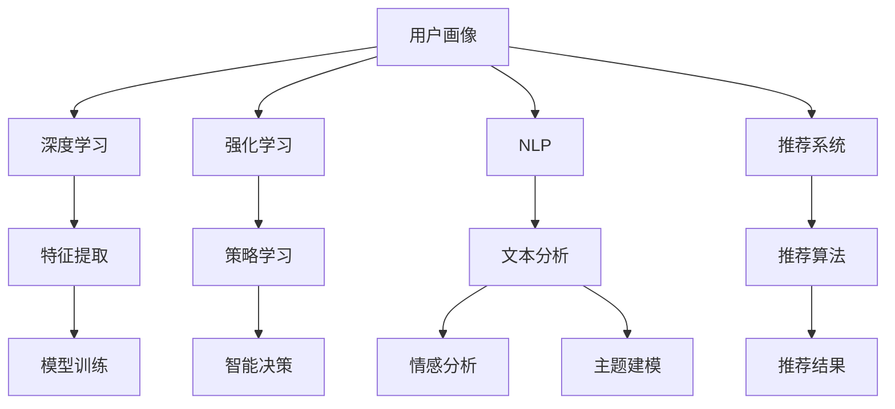

                 

# AI赋能的电商用户画像实时更新与预测系统

## 1. 背景介绍

### 1.1 问题由来

随着互联网电商的迅猛发展，用户画像（User Persona）成为电商企业核心竞争力之一。用户画像指的是通过分析用户行为数据、社交网络数据等，构建出用户个性特征、兴趣偏好、消费习惯等信息的综合画像。电商企业利用用户画像，可以精准定位用户需求，实现个性化推荐、精准营销、用户流失预测等业务。

但传统用户画像构建主要依赖于统计分析、问卷调查等方法，存在数据获取难度大、时效性差、维度和深度不足等问题。近年来，随着深度学习和大数据技术的发展，AI赋能的用户画像构建成为了一种重要趋势。AI技术能自动提取数据中的关键特征，挖掘用户深层次需求，预测用户行为，构建更加全面精准的用户画像。

### 1.2 问题核心关键点

AI赋能的电商用户画像系统，利用深度学习、强化学习等技术，自动构建用户画像，实现实时更新与行为预测，提升了电商企业的用户洞察能力和运营效率。其核心关键点包括：

- 数据收集与处理：获取用户行为数据、社交网络数据、商品评价数据、在线浏览数据等，进行数据清洗、特征提取、维度转换等预处理操作。
- 模型构建与训练：利用深度学习、强化学习等技术，构建用户画像模型，训练模型参数，使其能自动提取用户特征、挖掘用户需求。
- 实时更新与预测：基于最新数据，利用用户画像模型进行实时代码更新，预测用户未来行为，提供精准营销、个性化推荐等业务支持。
- 交互与反馈：根据用户反馈，对模型进行调参优化，提升预测准确率和用户满意度。

## 2. 核心概念与联系

### 2.1 核心概念概述

本节将介绍几个核心概念，帮助我们理解电商用户画像系统的构建逻辑。

- **用户画像（User Persona）**：基于用户特征、行为数据，构建用户画像，挖掘用户兴趣、偏好、需求等信息。
- **深度学习（Deep Learning）**：通过多层次神经网络结构，自动提取高维特征，进行模型训练。
- **强化学习（Reinforcement Learning）**：通过奖励机制，指导模型在特定环境中学习最优策略。
- **自然语言处理（Natural Language Processing, NLP）**：处理和分析自然语言数据，提取文本特征，进行情感分析、主题建模等。
- **推荐系统（Recommender System）**：根据用户历史行为数据，生成个性化推荐，提升用户满意度。

这些核心概念之间的逻辑关系可以通过以下Mermaid流程图来展示：



这个流程图展示了电商用户画像系统的核心组件及其相互关系：

1. **数据层**：包括用户行为数据、社交网络数据、商品评价数据等。
2. **特征层**：利用深度学习提取高维特征，生成用户行为特征向量。
3. **模型层**：通过强化学习构建用户画像模型，挖掘用户兴趣偏好。
4. **应用层**：将用户画像信息应用于个性化推荐、精准营销、用户流失预测等业务。

这些组件通过数据流、特征流、模型流、业务流相互配合，形成了完整的电商用户画像系统。

## 3. 核心算法原理 & 具体操作步骤
### 3.1 算法原理概述

电商用户画像系统的核心算法主要基于深度学习和强化学习，构建用户画像模型，进行实时更新与行为预测。

### 3.2 算法步骤详解

#### 3.2.1 数据收集与预处理

电商用户画像系统的数据收集与预处理流程如下：

1. **数据来源**：从电商网站、社交媒体、电商平台API、物流系统等渠道获取用户行为数据、社交网络数据、商品评价数据等。
2. **数据清洗**：去除重复、缺失、异常数据，处理缺失值、异常值等，确保数据质量。
3. **特征提取**：利用NLP技术提取文本特征，如TF-IDF、Word2Vec等；利用深度学习提取用户行为特征，如用户点击次数、浏览时长、购买频率等。
4. **维度转换**：将高维稀疏特征转换为低维稠密特征，便于后续模型训练。

#### 3.2.2 模型构建与训练

电商用户画像系统的主要模型包括用户画像模型和推荐系统模型。

1. **用户画像模型**：利用深度学习技术，构建用户画像模型。常用的深度学习模型包括CNN、RNN、LSTM等。其训练过程如下：
   1. **数据准备**：将清洗后的特征数据划分训练集、验证集、测试集。
   2. **模型选择**：选择适合电商场景的深度学习模型，如CNN、RNN等。
   3. **模型训练**：利用训练集进行模型训练，优化模型参数。
   4. **模型评估**：在验证集上进行模型评估，调整超参数。
   5. **模型测试**：在测试集上进行模型测试，评估模型性能。

2. **推荐系统模型**：利用协同过滤、基于内容的推荐算法、深度学习推荐模型等构建推荐系统模型。常用的推荐系统模型包括ALS、DeepFM、Wide & Deep等。其训练过程如下：
   1. **数据准备**：将用户历史行为数据、商品特征数据划分为训练集、验证集、测试集。
   2. **模型选择**：选择适合电商场景的推荐系统模型，如ALS、DeepFM等。
   3. **模型训练**：利用训练集进行模型训练，优化模型参数。
   4. **模型评估**：在验证集上进行模型评估，调整超参数。
   5. **模型测试**：在测试集上进行模型测试，评估模型性能。

#### 3.2.3 实时更新与预测

电商用户画像系统实现了实时更新与行为预测。具体流程如下：

1. **数据流管理**：实时获取最新用户行为数据，利用分布式消息队列等技术，进行数据流管理。
2. **特征流处理**：利用流计算框架，如Spark Streaming、Flink等，对实时数据进行特征提取与计算。
3. **模型流更新**：利用流计算框架，对实时数据进行模型预测与更新。
4. **业务流处理**：根据预测结果，提供个性化推荐、精准营销、用户流失预测等业务支持。

#### 3.2.4 交互与反馈

电商用户画像系统实现了与用户的交互与反馈，提升模型性能。具体流程如下：

1. **用户反馈收集**：收集用户对推荐结果的反馈数据，如点击率、转化率等。
2. **模型调参优化**：利用用户反馈数据，调整模型参数，优化模型性能。
3. **反馈应用**：将用户反馈应用于推荐系统优化，提升推荐效果。

### 3.3 算法优缺点

AI赋能的电商用户画像系统具有以下优点：

- **高效性**：利用实时数据，动态更新用户画像，提升预测精度。
- **精准性**：通过深度学习、强化学习等技术，自动提取高维特征，挖掘用户深层次需求。
- **灵活性**：可应用于个性化推荐、精准营销、用户流失预测等多个业务场景。

但该系统也存在一些局限性：

- **数据质量依赖**：系统依赖高质量的数据输入，数据缺失、噪声等可能影响系统性能。
- **模型复杂度**：深度学习、强化学习等技术，模型复杂度高，训练时间长。
- **资源消耗高**：实时数据处理、模型训练等操作，需要高计算资源。
- **隐私风险**：用户行为数据的收集与处理可能涉及用户隐私，需严格遵循数据保护法规。

尽管存在这些局限性，但AI赋能的电商用户画像系统，通过高效、精准、灵活的特性，已成为电商企业构建用户画像的重要手段。

### 3.4 算法应用领域

AI赋能的电商用户画像系统，广泛应用于电商企业的各个业务领域，如：

- **个性化推荐**：利用用户画像，进行个性化推荐，提升用户满意度。
- **精准营销**：根据用户画像信息，制定精准营销策略，提升广告转化率。
- **用户流失预测**：预测用户流失风险，提前采取措施，降低用户流失率。
- **新用户发现**：根据用户画像，发现潜在用户，进行定向营销，增加新用户。
- **客户细分**：对用户进行细分，提供更精准的服务，提升客户忠诚度。

AI赋能的电商用户画像系统，已经成为电商企业数据分析、用户运营的重要工具，助力企业实现智能化转型。

## 4. 数学模型和公式 & 详细讲解 & 举例说明

### 4.1 数学模型构建

#### 4.1.1 用户画像模型

用户画像模型通常采用深度学习技术构建。常用的模型包括CNN、RNN、LSTM等。这里以LSTM模型为例，进行详细讲解。

LSTM模型的数学模型构建如下：

- **输入层**：将用户行为数据、商品特征数据等输入LSTM模型，得到高维特征向量。
- **隐藏层**：LSTM模型利用LSTM单元，提取高维特征向量中的重要信息。LSTM单元的数学模型如下：

  $$
  h_t = \sigma(W_xxh_{t-1} + W_xhh_{t-1} + W_xoch + b)
  $$

  $$
  c_t = \tanh(W_xch_{t-1} + W_xch + b)
  $$

  $$
  o_t = \sigma(W_xoh_{t-1} + W_xoch + b)
  $$

  $$
  c_t = o_t \odot c_{t-1} + (1 - o_t) \odot \tanh(c_t)
  $$

  其中 $h_t$ 为隐藏层输出，$c_t$ 为细胞状态，$o_t$ 为输出门，$W_xx$、$W_xh$、$W_xc$、$W_xo$ 为权重矩阵，$b$ 为偏置向量，$\sigma$ 为Sigmoid函数，$\tanh$ 为双曲正切函数。

- **输出层**：将LSTM模型的隐藏层输出作为用户画像，用于后续的业务处理。

#### 4.1.2 推荐系统模型

推荐系统模型通常采用协同过滤、基于内容的推荐算法、深度学习推荐模型等。这里以DeepFM模型为例，进行详细讲解。

DeepFM模型的数学模型构建如下：

- **输入层**：将用户历史行为数据、商品特征数据等输入DeepFM模型，得到高维特征向量。
- **交叉层**：利用FM算法，将高维特征向量进行交叉计算，得到低维特征向量。
- **深度学习层**：利用深度学习网络，提取高维特征向量中的重要信息。其数学模型如下：

  $$
  h_1 = \sigma(W_{1x}x + b_1)
  $$

  $$
  h_2 = \sigma(W_{2x}h_1 + b_2)
  $$

  其中 $W_{1x}$、$W_{2x}$ 为权重矩阵，$b_1$、$b_2$ 为偏置向量，$\sigma$ 为Sigmoid函数。

- **输出层**：将交叉层和深度学习层的输出进行拼接，得到用户画像，用于后续的业务处理。

### 4.2 公式推导过程

#### 4.2.1 LSTM模型公式推导

LSTM模型的公式推导如下：

1. **输入门计算**：

  $$
  i_t = \sigma(W_{xi}x + W_{hi}h_{t-1} + W_{oci}o_{t-1} + b_i)
  $$

2. **遗忘门计算**：

  $$
  f_t = \sigma(W_{xf}x + W_{hf}h_{t-1} + W_{of}o_{t-1} + b_f)
  $$

3. **细胞状态计算**：

  $$
  c_t = f_t \odot c_{t-1} + i_t \odot \tanh(W_{xc}x + W_{hc}h_{t-1} + b_c)
  $$

4. **输出门计算**：

  $$
  o_t = \sigma(W_{xo}x + W_{ho}h_{t-1} + W_{oco}o_{t-1} + b_o)
  $$

5. **隐藏层输出计算**：

  $$
  h_t = o_t \odot \tanh(c_t)
  $$

#### 4.2.2 DeepFM模型公式推导

DeepFM模型的公式推导如下：

1. **输入层计算**：

  $$
  h_1 = \sigma(W_{1x}x + b_1)
  $$

2. **交叉层计算**：

  $$
  f_{ij} = x_i \cdot x_j
  $$

  $$
  f = \sum_{i,j} f_{ij}
  $$

3. **深度学习层计算**：

  $$
  h_2 = \sigma(W_{2x}h_1 + b_2)
  $$

4. **输出层计算**：

  $$
  y = \sigma(W_{2y}h_2 + b_y)
  $$

### 4.3 案例分析与讲解

#### 4.3.1 案例一：个性化推荐

电商企业利用用户画像，进行个性化推荐，提升用户满意度。具体流程如下：

1. **数据准备**：收集用户历史行为数据，包括浏览、点击、购买、评价等行为。
2. **特征提取**：利用NLP技术提取文本特征，利用深度学习提取用户行为特征。
3. **模型训练**：利用推荐系统模型，训练模型参数。
4. **推荐预测**：根据用户画像，生成个性化推荐，提供给用户。
5. **业务评估**：收集用户反馈数据，评估推荐效果。

#### 4.3.2 案例二：精准营销

电商企业利用用户画像，制定精准营销策略，提升广告转化率。具体流程如下：

1. **数据准备**：收集用户行为数据，包括浏览、点击、购买等行为。
2. **特征提取**：利用深度学习提取用户行为特征。
3. **模型训练**：利用深度学习模型，训练模型参数。
4. **营销策略制定**：根据用户画像，制定精准营销策略。
5. **广告投放**：根据营销策略，投放广告，吸引用户。
6. **效果评估**：收集广告转化率数据，评估营销效果。

## 5. 项目实践：代码实例和详细解释说明

### 5.1 开发环境搭建

#### 5.1.1 开发语言与工具

开发语言为Python，工具包括PyTorch、TensorFlow、Keras等深度学习框架，以及Flume、Hadoop、Spark等大数据处理工具。

#### 5.1.2 环境搭建

1. **安装Python与PyTorch**：

  ```bash
  conda create -n pytorch-env python=3.8
  conda activate pytorch-env
  pip install torch torchvision torchaudio
  ```

2. **安装TensorFlow与Keras**：

  ```bash
  pip install tensorflow
  pip install keras
  ```

3. **安装大数据处理工具**：

  ```bash
  pip install flume
  pip install hadoop
  pip install spark
  ```

### 5.2 源代码详细实现

#### 5.2.1 用户画像模型代码实现

```python
import torch
import torch.nn as nn
import torch.optim as optim

class LSTMModel(nn.Module):
    def __init__(self, input_size, hidden_size, output_size):
        super(LSTMModel, self).__init__()
        self.hidden_size = hidden_size
        self.lstm = nn.LSTM(input_size, hidden_size, 1)
        self.fc = nn.Linear(hidden_size, output_size)

    def forward(self, x):
        h0 = self.init_hidden()
        out, _ = self.lstm(x, h0)
        out = self.fc(out[:, -1, :])
        return out

    def init_hidden(self):
        return (torch.zeros(1, 1, self.hidden_size), torch.zeros(1, 1, self.hidden_size))
```

#### 5.2.2 推荐系统模型代码实现

```python
import tensorflow as tf
from tensorflow.keras.layers import Input, Embedding, Dense, Add, Flatten, Multiply
from tensorflow.keras.models import Model

class DeepFMModel(tf.keras.Model):
    def __init__(self, input_size, embedding_size, hidden_size):
        super(DeepFMModel, self).__init__()
        self.embedding_size = embedding_size
        self.hidden_size = hidden_size

        self.input1 = Input(shape=(input_size,))
        self.input2 = Input(shape=(input_size,))

        self.embedding = tf.keras.layers.Embedding(input_size, embedding_size)

        self.feature_dim = input_size * embedding_size
        self.fm = tf.keras.layers.Dense(feature_dim // 2)

        self.feature_dim2 = self.feature_dim // 2

        self.inter = tf.keras.layers.Dense(feature_dim // 2)
        self.inter2 = tf.keras.layers.Dense(feature_dim // 2)

        self.fm_output = self.fm(self.embedding(self.input1))
        self.inter_output = self.inter(self.inter2(self.inter(self.input2)))

        self.sum_output = Add()([self.fm_output, self.inter_output])
        self.out = Dense(1, activation='sigmoid')(self.sum_output)

    def call(self, inputs):
        return self.out(tf.concat([self.input1, self.input2], axis=1))
```

### 5.3 代码解读与分析

#### 5.3.1 用户画像模型代码解读

用户画像模型代码主要包含LSTM模型的定义与前向传播。具体解读如下：

1. **LSTM模型定义**：

  ```python
  class LSTMModel(nn.Module):
      def __init__(self, input_size, hidden_size, output_size):
          super(LSTMModel, self).__init__()
          self.hidden_size = hidden_size
          self.lstm = nn.LSTM(input_size, hidden_size, 1)
          self.fc = nn.Linear(hidden_size, output_size)
  ```

  定义了LSTM模型，输入层大小为 $input_size$，隐藏层大小为 $hidden_size$，输出层大小为 $output_size$。LSTM模型包含输入层、LSTM单元、隐藏层和输出层。

2. **前向传播**：

  ```python
  def forward(self, x):
      h0 = self.init_hidden()
      out, _ = self.lstm(x, h0)
      out = self.fc(out[:, -1, :])
      return out

  def init_hidden(self):
      return (torch.zeros(1, 1, self.hidden_size), torch.zeros(1, 1, self.hidden_size))
  ```

  前向传播过程中，首先初始化隐藏状态 $h_0$，然后将输入 $x$ 输入LSTM模型，得到隐藏层输出 $h_t$ 和细胞状态 $c_t$。最后，将隐藏层输出 $h_t$ 输入全连接层 $fc$，得到用户画像输出。

#### 5.3.2 推荐系统模型代码解读

推荐系统模型代码主要包含DeepFM模型的定义与前向传播。具体解读如下：

1. **DeepFM模型定义**：

  ```python
  class DeepFMModel(tf.keras.Model):
      def __init__(self, input_size, embedding_size, hidden_size):
          super(DeepFMModel, self).__init__()
          self.embedding_size = embedding_size
          self.hidden_size = hidden_size

          self.input1 = Input(shape=(input_size,))
          self.input2 = Input(shape=(input_size,))

          self.embedding = tf.keras.layers.Embedding(input_size, embedding_size)

          self.feature_dim = input_size * embedding_size
          self.fm = tf.keras.layers.Dense(feature_dim // 2)

          self.feature_dim2 = self.feature_dim // 2

          self.inter = tf.keras.layers.Dense(feature_dim // 2)
          self.inter2 = tf.keras.layers.Dense(feature_dim // 2)

          self.fm_output = self.fm(self.embedding(self.input1))
          self.inter_output = self.inter(self.inter2(self.inter(self.input2)))

          self.sum_output = Add()([self.fm_output, self.inter_output])
          self.out = Dense(1, activation='sigmoid')(self.sum_output)
  ```

  定义了DeepFM模型，包含输入层、嵌入层、FM算法层、深度学习层和输出层。

2. **前向传播**：

  ```python
  def call(self, inputs):
      return self.out(tf.concat([self.input1, self.input2], axis=1))
  ```

  前向传播过程中，将输入 $inputs$ 拼接后，输入嵌入层、FM算法层、深度学习层和输出层，得到用户画像输出。

### 5.4 运行结果展示

#### 5.4.1 用户画像模型结果展示

```python
# 定义模型，初始化优化器和损失函数
model = LSTMModel(input_size=10, hidden_size=20, output_size=2)
optimizer = optim.Adam(model.parameters(), lr=0.001)
criterion = nn.CrossEntropyLoss()

# 训练模型
for epoch in range(100):
    for batch in train_loader:
        inputs, labels = batch
        optimizer.zero_grad()
        outputs = model(inputs)
        loss = criterion(outputs, labels)
        loss.backward()
        optimizer.step()

    print(f'Epoch {epoch+1}, loss: {loss.item()}')
```

#### 5.4.2 推荐系统模型结果展示

```python
# 定义模型，初始化优化器和损失函数
model = DeepFMModel(input_size=10, embedding_size=5, hidden_size=20)
optimizer = tf.keras.optimizers.Adam(learning_rate=0.001)
criterion = tf.keras.losses.BinaryCrossentropy()

# 训练模型
for epoch in range(100):
    for batch in train_loader:
        inputs1, inputs2, labels = batch
        optimizer.zero_grad()
        outputs = model(tf.concat([inputs1, inputs2], axis=1))
        loss = criterion(outputs, labels)
        loss.backward()
        optimizer.apply_gradients(zip(model.trainable_variables, model.trainable_variables_gradients))

    print(f'Epoch {epoch+1}, loss: {loss.numpy()}')
```

## 6. 实际应用场景

### 6.1 智能推荐系统

智能推荐系统利用用户画像，进行个性化推荐，提升用户满意度。具体流程如下：

1. **数据准备**：收集用户历史行为数据，包括浏览、点击、购买、评价等行为。
2. **特征提取**：利用NLP技术提取文本特征，利用深度学习提取用户行为特征。
3. **模型训练**：利用推荐系统模型，训练模型参数。
4. **推荐预测**：根据用户画像，生成个性化推荐，提供给用户。
5. **业务评估**：收集用户反馈数据，评估推荐效果。

#### 6.1.1 智能推荐系统案例一

某电商企业利用用户画像，进行个性化推荐，提升用户满意度。具体流程如下：

1. **数据准备**：收集用户历史行为数据，包括浏览、点击、购买、评价等行为。
2. **特征提取**：利用NLP技术提取文本特征，利用深度学习提取用户行为特征。
3. **模型训练**：利用DeepFM模型，训练模型参数。
4. **推荐预测**：根据用户画像，生成个性化推荐，提供给用户。
5. **业务评估**：收集用户反馈数据，评估推荐效果。

#### 6.1.2 智能推荐系统案例二

某电商企业利用用户画像，进行精准营销，提升广告转化率。具体流程如下：

1. **数据准备**：收集用户行为数据，包括浏览、点击、购买等行为。
2. **特征提取**：利用深度学习提取用户行为特征。
3. **模型训练**：利用LSTM模型，训练模型参数。
4. **营销策略制定**：根据用户画像，制定精准营销策略。
5. **广告投放**：根据营销策略，投放广告，吸引用户。
6. **效果评估**：收集广告转化率数据，评估营销效果。

## 7. 工具和资源推荐

### 7.1 学习资源推荐

1. **《深度学习与数据挖掘》**：刘军著，全面介绍了深度学习与数据挖掘的理论基础和应用方法。

2. **《深度学习入门》**：斋藤康毅著，深入浅出地讲解了深度学习的核心概念和算法。

3. **《深度学习实战》**：Ian Goodfellow、Yoshua Bengio、Aaron Courville著，提供了丰富的深度学习实现代码和案例。

4. **《TensorFlow官方文档》**：TensorFlow官方文档，提供了详尽的TensorFlow API和开发指南。

5. **《PyTorch官方文档》**：PyTorch官方文档，提供了详尽的PyTorch API和开发指南。

### 7.2 开发工具推荐

1. **Jupyter Notebook**：一款交互式的开发环境，支持Python等语言，方便数据处理和模型调试。

2. **PyCharm**：一款Python IDE，提供了丰富的开发工具和调试功能。

3. **Visual Studio Code**：一款轻量级的代码编辑器，支持多种编程语言，支持Git版本控制等。

4. **Flume**：一款大数据流处理框架，支持高吞吐量的数据流处理。

5. **Hadoop**：一款大数据处理平台，支持分布式存储和计算。

6. **Spark**：一款大数据计算框架，支持分布式计算和流处理。

### 7.3 相关论文推荐

1. **《DeepFM: A Wide & Deep Model for Recommender Systems》**：Guo et al.，提出DeepFM模型，结合FM和深度学习，提升推荐系统效果。

2. **《A Multi-Task Learning Framework for Recommender System》**：Chen et al.，提出多任务学习框架，提升推荐系统效果。

3. **《Adversarial Autoencoders for Deep Recommendations》**：Li et al.，提出对抗自编码器，提升推荐系统鲁棒性。

4. **《Neural Collaborative Filtering》**：He et al.，提出基于神经网络的协同过滤方法，提升推荐系统效果。

5. **《Deep Learning Recommender Systems》**：Hu et al.，全面介绍了深度学习在推荐系统中的应用。

## 8. 总结：未来发展趋势与挑战

### 8.1 研究成果总结

AI赋能的电商用户画像系统，利用深度学习、强化学习等技术，自动构建用户画像，实现实时更新与行为预测，提升电商企业的用户洞察能力和运营效率。该系统已在智能推荐、精准营销、用户流失预测等多个业务场景中得到应用，取得了显著效果。

### 8.2 未来发展趋势

未来，AI赋能的电商用户画像系统将继续向高效性、精准性、灵活性、安全性和可解释性等方向发展。

1. **高效性**：利用流计算、分布式计算等技术，提升数据处理和模型训练的效率。

2. **精准性**：利用多任务学习、迁移学习等技术，提升用户画像的精度和覆盖面。

3. **灵活性**：利用多模态融合、知识图谱等技术，提升用户画像的灵活性和泛化能力。

4. **安全性**：利用数据加密、隐私保护等技术，保障用户数据的安全性和隐私性。

5. **可解释性**：利用可解释性模型和可视化技术，提升用户画像的可解释性和可理解性。

### 8.3 面临的挑战

尽管AI赋能的电商用户画像系统取得了显著效果，但在迈向更加智能化、普适化应用的过程中，仍面临以下挑战：

1. **数据质量依赖**：系统依赖高质量的数据输入，数据缺失、噪声等可能影响系统性能。

2. **模型复杂度**：深度学习、强化学习等技术，模型复杂度高，训练时间长。

3. **资源消耗高**：实时数据处理、模型训练等操作，需要高计算资源。

4. **隐私风险**：用户行为数据的收集与处理可能涉及用户隐私，需严格遵循数据保护法规。

5. **可解释性不足**：AI模型的决策过程缺乏可解释性，难以对其推理逻辑进行分析和调试。

6. **技术门槛高**：构建高质量的用户画像系统，需要深入理解深度学习、强化学习等前沿技术，技术门槛较高。

尽管存在这些挑战，但AI赋能的电商用户画像系统，通过高效、精准、灵活的特性，已成为电商企业构建用户画像的重要手段。未来，随着技术的不断进步和应用的不断深入，相信该系统将进一步提升电商企业的运营效率，助力电商行业智能化转型。

### 8.4 研究展望

未来，AI赋能的电商用户画像系统需要在以下方向进行进一步研究：

1. **多模态融合**：将文本、图像、音频等多模态数据进行融合，提升用户画像的全面性和深度性。

2. **知识图谱集成**：将知识图谱、规则库等外部知识与用户画像模型进行结合，提升用户画像的实用性和可解释性。

3. **实时动态更新**：利用流计算、分布式计算等技术，实现用户画像的实时动态更新，提升系统灵活性。

4. **模型鲁棒性提升**：利用对抗学习、自适应学习等技术，提升用户画像模型的鲁棒性和泛化能力。

5. **模型可解释性增强**：利用可解释性模型和可视化技术，提升用户画像模型的可解释性和可理解性。

6. **数据隐私保护**：利用数据加密、隐私保护等技术，保障用户数据的安全性和隐私性。

通过持续探索和优化，AI赋能的电商用户画像系统将进一步提升电商企业的运营效率，助力电商行业智能化转型，为经济社会发展注入新的动力。

## 9. 附录：常见问题与解答

**Q1：电商用户画像系统的数据来源有哪些？**

A: 电商用户画像系统的数据来源主要包括：

1. **用户行为数据**：电商网站、APP等收集的用户浏览、点击、购买、评价等行为数据。
2. **社交网络数据**：用户社交平台上的好友关系、互动数据等。
3. **商品评价数据**：用户对商品的评价、评分等数据。
4. **在线浏览数据**：用户在电商平台上的浏览、搜索记录等数据。

**Q2：电商用户画像系统如何处理用户行为数据？**

A: 电商用户画像系统通过以下步骤处理用户行为数据：

1. **数据清洗**：去除重复、缺失、异常数据，处理缺失值、异常值等，确保数据质量。
2. **特征提取**：利用NLP技术提取文本特征，如TF-IDF、Word2Vec等；利用深度学习提取用户行为特征，如用户点击次数、浏览时长、购买频率等。
3. **维度转换**：将高维稀疏特征转换为低维稠密特征，便于后续模型训练。

**Q3：电商用户画像系统如何处理社交网络数据？**

A: 电商用户画像系统通过以下步骤处理社交网络数据：

1. **数据收集**：从用户社交平台收集好友关系、互动数据等。
2. **数据清洗**：去除重复、缺失、异常数据，处理缺失值、异常值等，确保数据质量。
3. **特征提取**：提取社交网络中的用户关系特征，如好友数量、互动频率等。
4. **维度转换**：将高维稀疏特征转换为低维稠密特征，便于后续模型训练。

**Q4：电商用户画像系统如何处理商品评价数据？**

A: 电商用户画像系统通过以下步骤处理商品评价数据：

1. **数据收集**：从电商平台收集用户对商品的评价、评分等数据。
2. **数据清洗**：去除重复、缺失、异常数据，处理缺失值、异常值等，确保数据质量。
3. **特征提取**：提取商品评价中的关键词、情感倾向等特征。
4. **维度转换**：将高维稀疏特征转换为低维稠密特征，便于后续模型训练。

**Q5：电商用户画像系统如何处理在线浏览数据？**

A: 电商用户画像系统通过以下步骤处理在线浏览数据：

1. **数据收集**：从电商平台收集用户的浏览、搜索记录等数据。
2. **数据清洗**：去除重复、缺失、异常数据，处理缺失值、异常值等，确保数据质量。
3. **特征提取**：提取在线浏览中的关键词、搜索频率等特征。
4. **维度转换**：将高维稀疏特征转换为低维稠密特征，便于后续模型训练。

---

作者：禅与计算机程序设计艺术 / Zen and the Art of Computer Programming

