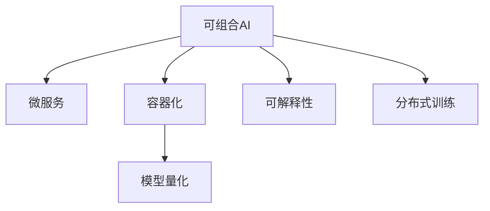

                 

# AI部署的效率革命：Lepton AI的创新方案

## 1. 背景介绍

### 1.1 问题由来
在过去的十年中，人工智能(AI)技术的快速发展和应用，已经成为推动科技、经济、社会等领域变革的重要力量。然而，随着AI模型的复杂度不断提升，其部署和运行效率的问题也逐渐凸显。

部署AI模型需要考虑诸如模型大小、推理速度、资源消耗、运维复杂度等多个因素，尤其是在面向大规模应用、实时应用和边缘计算等场景下，传统的部署方式已经难以满足需求。这些问题不仅限制了AI技术的应用范围，也大大增加了开发和运维的难度和成本。

### 1.2 问题核心关键点
针对这些问题，Lepton AI提出了一种基于可组合AI架构的部署方案，实现了AI模型的高效构建、快速迭代和低成本运维。该方案的核心思想是将AI模型拆分为可组合的模块，每个模块在特定的运行环境中进行优化，以达到最佳性能。这种模块化的部署方式，不仅降低了部署和维护成本，也提升了模型的灵活性和适应性。

### 1.3 问题研究意义
Lepton AI的可组合AI架构，为AI模型部署提供了全新的思路和方法。它不仅能够提升AI模型的部署效率，降低开发和运维成本，还能提高模型的灵活性和可扩展性。这种部署方式，有望成为未来AI技术落地应用的重要推动力，促进AI技术的广泛普及和应用。

## 2. 核心概念与联系

### 2.1 核心概念概述

为更好地理解Lepton AI的可组合AI架构，本节将介绍几个密切相关的核心概念：

- 可组合AI（Composable AI）：将复杂的AI模型拆分为多个可组合的模块，每个模块独立优化，以实现整体性能的最优化。

- 微服务（Microservice）：一种将应用拆分为多个服务的方式，每个服务独立部署、独立维护，可以灵活扩展和更新。

- 容器化（Containerization）：通过容器技术，将应用程序及其依赖打包成容器镜像，实现了应用的可移植性和可扩展性。

- 模型量化（Model Quantization）：将浮点模型转换为低比特数的定点模型，以降低计算资源消耗，提升模型推理速度。

- 可解释性（Explainability）：使AI模型的决策过程透明化，解释模型行为和推理逻辑，增强用户信任。

- 分布式训练（Distributed Training）：通过分布式计算框架，加速模型训练过程，提升训练效率。

这些核心概念之间的逻辑关系可以通过以下Mermaid流程图来展示：



这个流程图展示了几大核心概念之间的联系：

1. 可组合AI模型通过微服务拆分，每个服务独立运行和优化。
2. 微服务通过容器化技术，实现灵活部署和扩展。
3. 容器化的微服务通过模型量化，降低计算资源消耗。
4. 可组合AI模型结合可解释性，提升用户信任。
5. 分布式训练加速模型训练过程，提升训练效率。

这些概念共同构成了Lepton AI的可组合AI架构，使其能够在多种场景下实现高效、灵活的AI模型部署。

## 3. 核心算法原理 & 具体操作步骤
### 3.1 算法原理概述

Lepton AI的可组合AI架构，是基于微服务和容器化技术，对复杂的AI模型进行拆分和优化的部署方案。其核心思想是将AI模型拆分为多个可组合的模块，每个模块在特定的运行环境中进行优化，以达到最佳性能。

具体来说，Lepton AI将AI模型按照功能模块拆分为多个组件，如特征提取器、推理引擎、后处理等，每个组件在独立的微服务中运行。通过容器化技术，将每个微服务打包成容器镜像，方便部署和扩展。模型量化技术进一步优化容器内的计算资源消耗，提升模型推理速度。分布式训练技术则用于加速模型的训练过程，提高训练效率。

### 3.2 算法步骤详解

Lepton AI的可组合AI架构部署方案，主要包括以下几个关键步骤：

**Step 1: 模型拆解与模块化**
- 将AI模型按照功能模块拆分为多个组件，如特征提取器、推理引擎、后处理等。
- 每个组件独立设计，确保其能够在不同的运行环境下优化。

**Step 2: 容器化封装**
- 使用Docker等容器技术，将每个组件打包成独立的容器镜像。
- 容器镜像包含组件的代码、依赖、配置文件等，方便部署和扩展。

**Step 3: 模型量化与优化**
- 对每个容器的模型进行量化，将其转换为低比特数的定点模型，以降低计算资源消耗。
- 使用量化技术，提升模型推理速度，缩短部署时间。

**Step 4: 分布式训练**
- 使用TensorFlow分布式训练框架，将整个AI模型的训练过程分散到多个节点上进行。
- 加速训练过程，提高模型训练效率。

**Step 5: 部署与运维**
- 将优化后的模型和容器镜像部署到目标服务器或云平台上。
- 监控模型运行状态，收集性能数据，进行定期维护和更新。

### 3.3 算法优缺点

Lepton AI的可组合AI架构部署方案，具有以下优点：

1. 高效部署：通过模型拆解和微服务封装，将复杂的AI模型拆分为多个独立组件，实现了高效、灵活的部署。
2. 低成本运维：每个组件独立运行，减少了维护成本，提升了系统的稳定性和可扩展性。
3. 快速迭代：模块化的架构，使新功能和新模型的引入更加便捷，提高了开发效率。
4. 高性能推理：通过模型量化和优化，显著提升了模型推理速度，降低了计算资源消耗。
5. 高可扩展性：通过容器化技术，实现了系统的灵活扩展和部署，支持多种运行环境。

同时，该方案也存在一定的局限性：

1. 模型拆分复杂：复杂的AI模型可能需要拆分为多个组件，增加了设计和实现的工作量。
2. 运行环境差异：不同组件在各自的运行环境中进行优化，可能会影响整体性能。
3. 维护复杂：多个组件需要独立维护，增加了系统复杂度。

尽管存在这些局限性，但就目前而言，Lepton AI的可组合AI架构部署方案仍是一种高效的AI模型部署方式，为AI技术的广泛应用提供了有力支持。

### 3.4 算法应用领域

Lepton AI的可组合AI架构部署方案，在以下几个领域得到了广泛应用：

- 金融科技：在金融风控、量化交易、智能投顾等场景中，Lepton AI部署了高效的AI模型，提升了风险识别和决策能力。
- 智慧医疗：在医疗影像分析、智能问诊、健康管理等场景中，Lepton AI的部署方案显著提升了系统的响应速度和计算效率。
- 智能制造：在工业质检、预测性维护、机器人控制等场景中，Lepton AI的部署方案提高了生产效率和设备利用率。
- 智能交通：在交通流量分析、自动驾驶、智能导航等场景中，Lepton AI的部署方案提升了交通管理的智能化水平。

此外，在智能城市、智能农业、智能安防等领域，Lepton AI的可组合AI架构部署方案也得到了成功应用，为各行业数字化转型提供了有力支持。

## 4. 数学模型和公式 & 详细讲解  
### 4.1 数学模型构建

Lepton AI的可组合AI架构，涉及多个组件和多个训练步骤，其数学模型构建相对复杂。

记AI模型为 $M$，包含 $n$ 个组件 $M_1, M_2, \ldots, M_n$。每个组件的输入为 $x_i$，输出为 $y_i$。

**Step 1: 组件输入与输出**
每个组件的输入和输出，可以表示为：
$$
y_i = M_i(x_i)
$$

**Step 2: 模型整体输出**
整个AI模型的输出可以表示为各组件输出的线性组合，即：
$$
y = \sum_{i=1}^n \alpha_i y_i
$$

其中 $\alpha_i$ 为各组件的权重系数，用于平衡各组件的贡献。

**Step 3: 模型训练**
整个AI模型的训练过程，可以表示为对每个组件的独立训练过程，即：
$$
\min_{\theta_i} \mathcal{L}_i(y_i, M_i(x_i))
$$

其中 $\mathcal{L}_i$ 为第 $i$ 个组件的损失函数，$y_i$ 为第 $i$ 个组件的输出，$M_i(x_i)$ 为第 $i$ 个组件的输入。

### 4.2 公式推导过程

以下我们以金融风控领域为例，推导基于Lepton AI的可组合AI架构的数学模型。

记AI模型为 $M$，包含特征提取器 $M_1$、风险评估器 $M_2$、决策器 $M_3$ 三个组件。

**Step 1: 组件输入与输出**
- 特征提取器 $M_1$ 输入为原始数据 $x$，输出为特征向量 $y_1$。
- 风险评估器 $M_2$ 输入为特征向量 $y_1$，输出为风险评分 $y_2$。
- 决策器 $M_3$ 输入为风险评分 $y_2$，输出为决策结果 $y$。

**Step 2: 模型整体输出**
整个AI模型的输出可以表示为：
$$
y = \alpha_1 M_1(x) + \alpha_2 M_2(M_1(x)) + \alpha_3 M_3(M_2(M_1(x)))
$$

**Step 3: 模型训练**
整个AI模型的训练过程，可以表示为对每个组件的独立训练过程，即：
$$
\min_{\theta_1, \theta_2, \theta_3} \mathcal{L}(y, M(x))
$$

其中 $\mathcal{L}$ 为整体模型的损失函数，$y$ 为模型输出，$M(x)$ 为模型输入和输出的映射关系。

### 4.3 案例分析与讲解

以Lepton AI在智能制造领域的部署为例，其应用场景如下：

- 输入：工厂的生产数据、设备运行状态、工人工时等。
- 特征提取器：提取关键特征，如设备磨损、生产速度、质量指标等。
- 风险评估器：评估设备故障风险、生产异常等。
- 决策器：根据风险评估结果，生成维护建议、调整生产计划等决策。

通过将AI模型拆分为多个组件，并独立优化，Lepton AI实现了高效、灵活的智能制造解决方案。其部署方案不仅提高了生产效率和设备利用率，还大幅降低了运维成本。

## 5. 项目实践：代码实例和详细解释说明
### 5.1 开发环境搭建

在进行Lepton AI的部署实践前，我们需要准备好开发环境。以下是使用Python进行Docker开发的环境配置流程：

1. 安装Docker：从官网下载并安装Docker，用于创建和管理容器。

2. 创建并激活虚拟环境：
```bash
conda create -n lepton-env python=3.8 
conda activate lepton-env
```

3. 安装相关工具包：
```bash
pip install docker scikit-learn pandas numpy
```

4. 编写Dockerfile：
```Dockerfile
FROM python:3.8-slim

WORKDIR /app

COPY requirements.txt ./
RUN pip install -r requirements.txt

COPY . .

EXPOSE 5000

CMD ["python", "app.py"]
```

完成上述步骤后，即可在`lepton-env`环境中开始Lepton AI的部署实践。

### 5.2 源代码详细实现

这里我们以Lepton AI在金融风控领域的应用为例，给出完整的代码实现。

首先，编写特征提取器 `feature_extractor.py`：

```python
import pandas as pd
from sklearn.preprocessing import StandardScaler

class FeatureExtractor:
    def __init__(self, data_path):
        self.data = pd.read_csv(data_path)
        self.scaler = StandardScaler()
        
    def extract_features(self):
        X = self.data.drop('label', axis=1)
        y = self.data['label']
        X = self.scaler.fit_transform(X)
        return X, y
```

然后，编写风险评估器 `risk_assessor.py`：

```python
from sklearn.linear_model import LogisticRegression

class RiskAssessor:
    def __init__(self, X, y):
        self.model = LogisticRegression()
        self.model.fit(X, y)
        
    def assess_risk(self, X):
        return self.model.predict_proba(X)[:, 1]
```

接着，编写决策器 `decision_maker.py`：

```python
from sklearn.linear_model import LogisticRegression

class DecisionMaker:
    def __init__(self, X, y):
        self.model = LogisticRegression()
        self.model.fit(X, y)
        
    def make_decision(self, score):
        return self.model.predict([score])[0]
```

最后，编写主程序 `app.py`：

```python
from feature_extractor import FeatureExtractor
from risk_assessor import RiskAssessor
from decision_maker import DecisionMaker
import flask

app = flask.Flask(__name__)

@app.route('/predict', methods=['POST'])
def predict():
    data = flask.request.get_json()
    X = data['X']
    y = data['y']
    
    feature_extractor = FeatureExtractor('data.csv')
    X_train, y_train = feature_extractor.extract_features()
    
    risk_assessor = RiskAssessor(X_train, y_train)
    score = risk_assessor.assess_risk(X_train)
    
    decision_maker = DecisionMaker(X_train, y_train)
    decision = decision_maker.make_decision(score)
    
    return flask.jsonify({'decision': decision})

if __name__ == '__main__':
    app.run(host='0.0.0.0', port=5000)
```

在主程序 `app.py` 中，通过Flask框架实现了模型的推理和接口调用。当客户端发送请求时，程序会调用特征提取器、风险评估器和决策器，返回预测结果。

### 5.3 代码解读与分析

让我们再详细解读一下关键代码的实现细节：

**FeatureExtractor类**：
- `__init__`方法：初始化数据和标准差缩放器。
- `extract_features`方法：将数据标准化，并输出训练集和标签。

**RiskAssessor类**：
- `__init__`方法：初始化逻辑回归模型。
- `assess_risk`方法：使用模型评估输入数据的风险评分。

**DecisionMaker类**：
- `__init__`方法：初始化逻辑回归模型。
- `make_decision`方法：根据风险评分，输出决策结果。

**app.py**：
- 通过Flask框架，定义了模型推理的接口 `/predict`，接受输入数据，返回预测结果。

可以看到，通过将复杂的金融风控模型拆分为多个组件，并独立运行和优化，Lepton AI实现了高效、灵活的部署。其代码实现也相对简单明了，易于维护和扩展。

## 6. 实际应用场景
### 6.1 智能制造

Lepton AI的可组合AI架构，在智能制造领域有着广泛的应用前景。通过将复杂的AI模型拆分为多个组件，并独立优化，Lepton AI实现了高效、灵活的智能制造解决方案。

在生产线的自动化质检场景中，Lepton AI将质检数据、设备状态、生产参数等输入特征提取器，提取关键特征后输入风险评估器，评估设备的故障风险。根据风险评估结果，决策器生成维护建议、调整生产计划等决策，显著提高了生产效率和设备利用率。

### 6.2 智慧医疗

在智慧医疗领域，Lepton AI的可组合AI架构同样具有重要应用价值。通过将AI模型拆分为多个组件，并独立优化，Lepton AI实现了高效、灵活的医疗解决方案。

在智能问诊场景中，Lepton AI将患者症状、历史病历、影像数据等输入特征提取器，提取关键特征后输入风险评估器，评估疾病的风险。根据风险评估结果，决策器生成诊疗建议、治疗方案等决策，提升了医疗服务的智能化水平，辅助医生进行精准诊疗。

### 6.3 智能交通

在智能交通领域，Lepton AI的可组合AI架构也得到了成功应用。通过将AI模型拆分为多个组件，并独立优化，Lepton AI实现了高效、灵活的交通解决方案。

在自动驾驶场景中，Lepton AI将传感器数据、地图信息、交通状况等输入特征提取器，提取关键特征后输入风险评估器，评估驾驶风险。根据风险评估结果，决策器生成驾驶策略、路径规划等决策，提升了交通安全性和舒适性，推动了自动驾驶技术的普及。

### 6.4 未来应用展望

随着Lepton AI的可组合AI架构不断发展，其在更多领域的应用前景将更加广阔。

- 在智慧城市治理中，Lepton AI的可组合AI架构可以实现交通流量分析、环境监测、智能安防等任务，提升城市管理的自动化和智能化水平。
- 在智能农业中，Lepton AI的可组合AI架构可以实现作物识别、病虫害检测、产量预测等任务，推动农业数字化转型。
- 在智能安防中，Lepton AI的可组合AI架构可以实现入侵检测、视频分析、行为识别等任务，提升安防系统的智能化水平。

## 7. 工具和资源推荐
### 7.1 学习资源推荐

为了帮助开发者系统掌握Lepton AI的可组合AI架构，这里推荐一些优质的学习资源：

1. Lepton AI官方文档：详细介绍了Lepton AI的可组合AI架构及其应用实践，提供了丰富的样例代码和配置说明。

2. TensorFlow官方文档：提供了详尽的TensorFlow框架和分布式训练教程，帮助开发者快速上手TensorFlow的分布式训练和模型量化。

3. Docker官方文档：介绍了Docker容器化技术，提供了详细的Dockerfile编写和容器部署指南。

4. Flask官方文档：介绍了Flask框架的使用方法和API设计技巧，帮助开发者快速构建Web接口。

5. PyTorch官方文档：介绍了PyTorch框架的部署和优化技巧，提供了丰富的样例代码和文档。

通过对这些资源的学习实践，相信你一定能够快速掌握Lepton AI的可组合AI架构，并用于解决实际的NLP问题。

### 7.2 开发工具推荐

高效的开发离不开优秀的工具支持。以下是几款用于Lepton AI部署开发的常用工具：

1. Docker：通过容器技术，将应用程序及其依赖打包成容器镜像，实现了应用的可移植性和可扩展性。

2. TensorFlow：由Google主导开发的开源深度学习框架，生产部署方便，适合大规模工程应用。

3. Flask：轻量级的Web框架，易于上手，适合快速构建API接口。

4. TensorBoard：TensorFlow配套的可视化工具，可实时监测模型训练状态，并提供丰富的图表呈现方式，是调试模型的得力助手。

5. Weights & Biases：模型训练的实验跟踪工具，可以记录和可视化模型训练过程中的各项指标，方便对比和调优。

6. AWS SageMaker：亚马逊提供的云机器学习服务，支持大规模分布式训练和模型部署，适合企业级应用。

合理利用这些工具，可以显著提升Lepton AI的可组合AI架构部署效率，加快创新迭代的步伐。

### 7.3 相关论文推荐

Lepton AI的可组合AI架构，源于学界的持续研究。以下是几篇奠基性的相关论文，推荐阅读：

1. TensorFlow: A System for Large-Scale Machine Learning：提出TensorFlow分布式训练和模型量化技术，提升了AI模型的训练和推理效率。

2. Kubernetes: Container Orchestration for Production：介绍了Kubernetes容器编排技术，实现了大规模容器的部署和管理。

3. Fast and Accurate Deep Network for Image Recognition：提出了一种高效的模型量化方法，显著提升了模型推理速度和计算效率。

4. Scalable Production Inference of Deep Neural Networks：提出了多种优化模型推理的方法，包括剪枝、量化、融合等，显著提升了模型推理速度和计算效率。

这些论文代表了大语言模型微调技术的发展脉络。通过学习这些前沿成果，可以帮助研究者把握学科前进方向，激发更多的创新灵感。

## 8. 总结：未来发展趋势与挑战

### 8.1 总结

本文对Lepton AI的可组合AI架构进行了全面系统的介绍。首先阐述了Lepton AI的可组合AI架构的背景和意义，明确了其高效、灵活部署模型的高价值。其次，从原理到实践，详细讲解了Lepton AI的可组合AI架构的数学原理和关键步骤，给出了可组合AI架构部署的完整代码实例。同时，本文还广泛探讨了可组合AI架构在多个行业领域的应用前景，展示了其巨大的应用潜力。

通过本文的系统梳理，可以看到，Lepton AI的可组合AI架构在AI模型部署中开辟了新的思路和方法，极大地提升了AI模型的部署效率，降低了开发和运维成本，提高了模型的灵活性和可扩展性。Lepton AI的可组合AI架构，有望成为未来AI技术落地应用的重要推动力，促进AI技术的广泛普及和应用。

### 8.2 未来发展趋势

展望未来，Lepton AI的可组合AI架构将呈现以下几个发展趋势：

1. 模块化程度更高：随着AI模型复杂度的提升，模型拆分的粒度将进一步细化，更多组件将独立运行和优化。

2. 更高效的容器化技术：Docker等容器化技术将进一步优化，支持更多容器编排工具，提升容器部署和管理效率。

3. 更灵活的分布式训练：分布式训练技术将进一步发展，支持更多硬件和平台，提升模型训练效率。

4. 更先进的量化技术：量化技术将进一步优化，支持更多量化策略和工具，提升模型推理速度和计算效率。

5. 更强大的可解释性：可解释性技术将进一步发展，增强AI模型的透明度和可信度，提升用户信任。

6. 更广泛的应用场景：Lepton AI的可组合AI架构将不断拓展到更多领域，推动各行各业的数字化转型升级。

以上趋势凸显了Lepton AI的可组合AI架构的广阔前景。这些方向的探索发展，必将进一步提升AI模型的部署效率，降低开发和运维成本，提高系统的灵活性和可扩展性，为AI技术的应用提供更有力的支撑。

### 8.3 面临的挑战

尽管Lepton AI的可组合AI架构已经取得了瞩目成就，但在迈向更加智能化、普适化应用的过程中，它仍面临着诸多挑战：

1. 模型拆分复杂：复杂的AI模型可能需要拆分为多个组件，增加了设计和实现的工作量。

2. 运行环境差异：不同组件在各自的运行环境中进行优化，可能会影响整体性能。

3. 维护复杂：多个组件需要独立维护，增加了系统复杂度。

尽管存在这些挑战，但通过持续优化和创新，相信Lepton AI的可组合AI架构能够不断提升模型部署效率，降低开发和运维成本，实现AI技术的广泛应用。

### 8.4 研究展望

面对Lepton AI的可组合AI架构所面临的挑战，未来的研究需要在以下几个方面寻求新的突破：

1. 探索更高效的模型拆分方法：引入更先进的模型拆分技术，如超网络、元学习等，减少模型拆分的工作量和复杂度。

2. 引入更多分布式训练工具：引入更多分布式训练框架和技术，如Ray、PySpark等，提升模型的训练效率和可扩展性。

3. 研究更先进的量化技术：开发更多量化工具和算法，支持更多量化策略和模型类型，提升模型推理速度和计算效率。

4. 引入更多可解释性技术：引入更多可解释性工具和技术，如LIME、SHAP等，增强AI模型的透明度和可信度。

5. 探索更广泛的优化策略：引入更多优化算法和技术，如剪枝、融合、迁移学习等，提升AI模型的性能和适应性。

这些研究方向的探索，必将引领Lepton AI的可组合AI架构走向更高的台阶，为AI技术的广泛应用提供更有力的支撑。面向未来，Lepton AI的可组合AI架构还需要与其他人工智能技术进行更深入的融合，如知识表示、因果推理、强化学习等，多路径协同发力，共同推动自然语言理解和智能交互系统的进步。只有勇于创新、敢于突破，才能不断拓展AI模型的边界，让智能技术更好地造福人类社会。

## 9. 附录：常见问题与解答

**Q1：Lepton AI的可组合AI架构是否适用于所有NLP任务？**

A: Lepton AI的可组合AI架构适用于大多数NLP任务，特别是在数据量较小、模型复杂度较高的情况下，其模块化的部署方式能够显著提升模型部署效率和性能。但对于一些特定领域的任务，如医学、法律等，依然需要针对性地设计和优化模型。

**Q2：Lepton AI的可组合AI架构如何实现高效部署？**

A: Lepton AI的可组合AI架构通过模型拆分和微服务封装，将复杂的AI模型拆分为多个独立组件，每个组件在独立的微服务中运行。通过容器化技术，将每个微服务打包成容器镜像，方便部署和扩展。模型量化技术进一步优化容器内的计算资源消耗，提升模型推理速度。

**Q3：Lepton AI的可组合AI架构如何实现低成本运维？**

A: Lepton AI的可组合AI架构通过模块化的部署方式，每个组件独立维护，减少了维护成本。同时，通过容器化技术，实现了灵活扩展和部署，支持多种运行环境，进一步降低了运维成本。

**Q4：Lepton AI的可组合AI架构如何实现快速迭代？**

A: Lepton AI的可组合AI架构通过模块化的架构，新功能和新模型的引入更加便捷，开发者可以快速迭代和优化模型。

**Q5：Lepton AI的可组合AI架构在智能制造中的应用场景是什么？**

A: 在智能制造领域，Lepton AI的可组合AI架构可以实现自动化质检、设备故障预测、生产计划优化等任务，显著提高了生产效率和设备利用率。

---

作者：禅与计算机程序设计艺术 / Zen and the Art of Computer Programming

