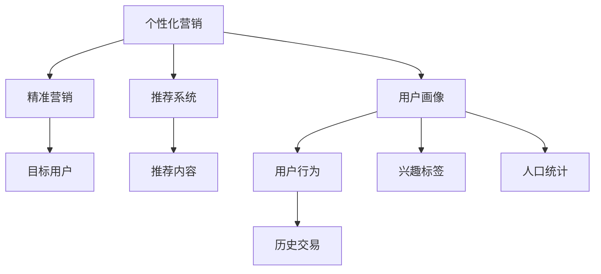

                 

# AI驱动的个性化营销新模式

> 关键词：个性化营销, AI技术, 用户画像, 精准营销, 推荐系统, 数据科学

## 1. 背景介绍

### 1.1 问题由来
随着互联网技术的快速发展和社交媒体的广泛应用，企业对于市场营销策略的个性化、精准化需求日益增长。传统的营销方式，如大众媒体广告、电视广告等，难以精准触达目标用户，且成本高昂、效果有限。而个性化营销通过分析用户行为、偏好等数据，制定针对性的推广策略，可以实现更高的转化率和投资回报率。

近年来，人工智能技术的飞速发展，为个性化营销提供了新的方法和工具。AI技术可以从大数据中提取有价值的信息，构建精细化的用户画像，精准匹配用户需求，从而实现营销策略的个性化、动态化。本文将介绍基于AI技术的新型个性化营销模式，探讨其实现原理和操作步骤，并结合案例分析展示其应用效果。

## 2. 核心概念与联系

### 2.1 核心概念概述

为更好地理解AI驱动的个性化营销模式，本节将介绍几个密切相关的核心概念：

- 个性化营销(Personalized Marketing)：根据用户的行为、偏好、历史交易等数据，设计针对性的营销策略，以提升用户体验和营销效果。
- 用户画像(User Profile)：通过数据分析和挖掘，构建用户的多维度特征，如年龄、性别、兴趣、消费习惯等，形成详细而准确的个人画像。
- 精准营销(Exact Marketing)：基于用户画像，将营销内容精确地推送给目标用户，避免资源浪费，提高广告点击率和转化率。
- 推荐系统(Recommendation System)：通过学习用户的历史行为和兴趣，为用户推荐合适的商品、内容、服务等。
- 数据科学(Data Science)：涵盖数据采集、处理、分析、建模和应用等全流程，是实现个性化营销和精准营销的重要工具。

这些核心概念之间的逻辑关系可以通过以下Mermaid流程图来展示：



这个流程图展示了个性化营销的核心概念及其之间的关系：

1. 个性化营销通过用户画像和精准营销实现对目标用户的精确匹配。
2. 用户画像由用户行为、历史交易、兴趣标签和人口统计等多维度数据构成。
3. 推荐系统则通过学习用户的历史行为和兴趣，为用户推荐合适的商品、内容、服务等。
4. 数据科学是实现个性化营销和精准营销的关键技术，包括数据采集、处理、分析和建模等。

这些核心概念共同构成了AI驱动的个性化营销模式，使其能够在各种场景下实现用户需求的精准匹配和高效营销。通过理解这些核心概念，我们可以更好地把握个性化营销的工作原理和优化方向。

## 3. 核心算法原理 & 具体操作步骤
### 3.1 算法原理概述

AI驱动的个性化营销模式，本质上是利用数据科学、机器学习等技术，从海量数据中提取有价值的信息，构建精准的用户画像，并基于此进行精准营销的过程。

形式化地，假设目标用户集为 $U$，目标商品集为 $I$，用户行为数据为 $D_U$，商品信息数据为 $D_I$。个性化营销的目标是找到一个映射函数 $f:U \rightarrow I$，使得 $f(u)$ 为商品 $I$，且用户 $u$ 对 $f(u)$ 的评价最高。

为实现这一目标，通常使用推荐系统模型和用户画像模型，具体步骤如下：

1. 数据预处理：清洗、标准化用户行为数据和商品信息数据，形成可用于建模的特征向量。
2. 用户画像构建：根据用户行为数据和商品信息数据，构建精细化的用户画像，包括兴趣、偏好、消费习惯等。
3. 推荐模型训练：在用户画像的基础上，使用协同过滤、深度学习等推荐算法训练推荐模型，对用户进行个性化推荐。
4. 精准营销策略制定：基于推荐结果，制定有针对性的营销策略，通过社交媒体、电子邮件等方式触达目标用户。

### 3.2 算法步骤详解

AI驱动的个性化营销一般包括以下几个关键步骤：

**Step 1: 数据采集与预处理**

- 采集用户行为数据和商品信息数据。常见数据源包括电商平台的用户订单记录、社交媒体用户的点赞、评论、分享等互动数据，以及商品的产品介绍、价格、销量等描述信息。
- 数据清洗和预处理。包括去除噪声、填补缺失值、归一化等步骤，形成可用于建模的数据集。

**Step 2: 用户画像构建**

- 特征提取：从用户行为数据和商品信息数据中提取特征，如用户的浏览记录、购买记录、评分记录等，商品的类别、品牌、价格等。
- 用户建模：使用数据科学算法构建用户画像模型，如聚类算法、深度学习模型等，形成用户的多维度特征表示。
- 用户画像更新：定期更新用户画像，引入最新的用户行为和商品信息，保持用户画像的时效性。

**Step 3: 推荐模型训练**

- 数据划分：将用户行为数据和商品信息数据划分为训练集、验证集和测试集。
- 推荐算法选择：根据任务需求选择合适的推荐算法，如协同过滤、基于矩阵分解的推荐模型、深度学习推荐模型等。
- 模型训练：在训练集上使用优化算法（如梯度下降）训练推荐模型，并使用验证集进行参数调优。
- 模型评估：在测试集上评估推荐模型的准确率和召回率，选择性能最佳的模型。

**Step 4: 精准营销策略制定**

- 用户分组：根据用户画像将用户分为不同类别，如潜在用户、活跃用户、高价值用户等。
- 策略制定：针对不同用户群体，制定相应的营销策略，如针对潜在用户推荐入门级产品，针对活跃用户推出优惠券等。
- 渠道选择：选择适合的营销渠道，如社交媒体、电子邮件、短信等，进行精准触达。
- 营销效果监控：实时监控营销活动的效果，调整策略以提升投资回报率。

### 3.3 算法优缺点

AI驱动的个性化营销模式具有以下优点：

1. 精确匹配：通过用户画像和推荐模型，可以精确地匹配用户和商品，提升广告点击率和转化率。
2. 成本低：相较于传统广告投放，个性化营销可以显著降低营销成本。
3. 高效性：基于数据驱动的推荐系统，可以快速迭代优化，实时响应市场需求。
4. 用户满意度：个性化推荐可以提升用户满意度和粘性，提升品牌忠诚度。

同时，该方法也存在一定的局限性：

1. 数据隐私：用户的个性化数据可能涉及隐私问题，需要采取严格的隐私保护措施。
2. 模型复杂度：推荐模型和用户画像模型的构建和维护需要较高的技术门槛和计算资源。
3. 数据依赖：个性化营销的效果高度依赖于数据的质量和完整性。
4. 泛化能力：模型泛化能力不足可能导致推荐结果不准确。

尽管存在这些局限性，但就目前而言，基于AI技术的个性化营销模式仍然是最为高效和精准的营销手段之一。未来相关研究的重点在于如何进一步优化算法，降低对数据和模型的依赖，提高推荐系统的泛化能力和隐私保护水平。

### 3.4 算法应用领域

AI驱动的个性化营销模式已经在电商、社交媒体、金融等多个领域得到了广泛应用，具体如下：

- 电商平台：通过个性化推荐系统，向用户推荐商品、优惠活动，提升用户购买率和复购率。
- 社交媒体：通过精准营销策略，对用户进行精准推送内容、广告，提高用户互动率和转化率。
- 金融行业：通过个性化推荐和精准营销，为客户提供定制化服务，提升用户满意度和忠诚度。

## 4. 数学模型和公式 & 详细讲解 & 举例说明

### 4.1 数学模型构建

本节将使用数学语言对AI驱动的个性化营销过程进行更加严格的刻画。

假设用户行为数据为 $D_U=\{(x_{ui}, y_{ui})\}_{i=1}^N, x_{ui} \in X, y_{ui} \in Y$，其中 $x_{ui}$ 为第 $u$ 用户对第 $i$ 商品的评分，$y_{ui}$ 为该评分的真实值（0或1），即用户是否购买了该商品。商品信息数据为 $D_I=\{(i_j, p_j)\}_{j=1}^M, i_j \in I, p_j \in P$，其中 $i_j$ 为第 $j$ 商品，$p_j$ 为该商品的属性（如类别、品牌、价格等）。

定义用户画像模型为 $f_u: X \rightarrow P$，推荐模型为 $g_i: Y \rightarrow P$。则个性化营销的目标是最大化 $g_i(y_{ui}) = p_i$ 与用户实际行为 $x_{ui}$ 的匹配度。

形式化地，构建用户画像模型 $f_u$ 和推荐模型 $g_i$ 的损失函数为：

$$
\mathcal{L}(f_u, g_i) = \frac{1}{N}\sum_{i=1}^N \ell(x_{ui}, f_u(x_{ui})) + \frac{1}{M}\sum_{j=1}^M \ell(y_{ui}, g_i(y_{ui}))
$$

其中 $\ell$ 为损失函数，如均方误差损失、交叉熵损失等。

### 4.2 公式推导过程

以下我们以协同过滤算法为例，推导推荐模型的训练公式。

假设推荐系统构建了用户画像 $f_u$ 和商品画像 $f_i$，将用户画像和商品画像组成矩阵 $F$ 和 $G$。则协同过滤算法目标是最小化如下损失函数：

$$
\mathcal{L}(F,G) = \frac{1}{N}\sum_{i=1}^N \sum_{u=1}^N \| f_u(x_{ui}) - g_i(y_{ui}) \|^2
$$

利用梯度下降算法求解损失函数的最小值，推荐模型 $g_i$ 的更新公式为：

$$
g_i \leftarrow g_i - \eta \frac{\partial \mathcal{L}(F,G)}{\partial g_i}
$$

其中 $\eta$ 为学习率，$\frac{\partial \mathcal{L}(F,G)}{\partial g_i}$ 为梯度，可通过求导得到。

在得到梯度后，即可带入参数更新公式，完成模型的迭代优化。重复上述过程直至收敛，最终得到适应推荐任务的最优模型参数 $g_i^*$。

### 4.3 案例分析与讲解

假设某电商平台希望利用AI技术提升个性化推荐效果，具体实施步骤如下：

**Step 1: 数据采集与预处理**

- 采集用户行为数据 $D_U$ 和商品信息数据 $D_I$。
- 对用户行为数据进行清洗和预处理，去除噪声、填补缺失值、归一化等。

**Step 2: 用户画像构建**

- 从用户行为数据中提取用户特征 $x_u$，如用户的浏览记录、购买记录、评分记录等。
- 使用深度学习模型构建用户画像模型 $f_u$，对用户特征进行多维度特征表示。

**Step 3: 推荐模型训练**

- 从商品信息数据中提取商品特征 $p_i$，如商品的类别、品牌、价格等。
- 使用协同过滤算法构建推荐模型 $g_i$，对用户和商品进行匹配。
- 在训练集上训练推荐模型，使用均方误差损失进行参数调优。

**Step 4: 精准营销策略制定**

- 根据用户画像模型将用户分为不同类别，如潜在用户、活跃用户、高价值用户等。
- 针对不同用户群体，制定相应的推荐策略，如针对潜在用户推荐入门级产品。
- 选择适合的营销渠道，如社交媒体、电子邮件、短信等，进行精准触达。
- 实时监控营销活动的效果，调整策略以提升投资回报率。

以上即为基于协同过滤算法的电商推荐系统实现步骤。需要注意的是，在实际应用中，不同的推荐算法和用户画像模型可能需要根据具体任务进行调整和优化。

## 5. 项目实践：代码实例和详细解释说明
### 5.1 开发环境搭建

在进行推荐系统开发前，我们需要准备好开发环境。以下是使用Python进行推荐系统开发的常见环境配置流程：

1. 安装Python：推荐安装Python 3.8及以上版本，使用conda或pip安装依赖库。

2. 安装Scikit-Learn：推荐安装Scikit-Learn 0.24及以上版本，用于构建协同过滤推荐系统。

3. 安装TensorFlow或PyTorch：推荐使用TensorFlow 2.x或PyTorch 1.8及以上版本，用于构建深度学习推荐模型。

4. 安装NumPy和Pandas：推荐安装NumPy 1.22及以上版本和Pandas 1.3及以上版本，用于数据处理和分析。

5. 安装dask：推荐安装dask 2023.2.0及以上版本，用于分布式数据处理和分析。

完成上述步骤后，即可在本地环境或云平台上开始推荐系统开发。

### 5.2 源代码详细实现

这里我们以协同过滤算法为例，给出使用Scikit-Learn库构建推荐系统的Python代码实现。

```python
from sklearn.datasets import make_biclusters
from sklearn.metrics.pairwise import cosine_similarity
from sklearn.decomposition import TruncatedSVD

# 生成样本数据
X, Y = make_biclusters(n_clusters=5, n_samples=100, n_features=10, n_blocks=10, shuffle=False, random_state=42)
X = X.astype(float)
Y = Y.astype(float)

# 构建协同过滤推荐系统
X_svd = TruncatedSVD(n_components=5).fit_transform(X)
Y_svd = TruncatedSVD(n_components=5).fit_transform(Y)
user_svd = TruncatedSVD(n_components=5).fit_transform(X_svd)
item_svd = TruncatedSVD(n_components=5).fit_transform(Y_svd)

# 计算用户和商品相似度矩阵
similarity_matrix = cosine_similarity(user_svd, item_svd)

# 构建推荐模型
import numpy as np
def recommendation(X, Y, similarity_matrix, n_recommendations=5):
    user_svd = TruncatedSVD(n_components=5).fit_transform(X)
    item_svd = TruncatedSVD(n_components=5).fit_transform(Y)
    recommendation = np.dot(similarity_matrix, user_svd.T) @ item_svd.T
    return recommendation

# 测试推荐效果
recommendations = recommendation(X, Y, similarity_matrix, n_recommendations=5)
print(recommendations)
```

以上代码实现了基于协同过滤算法的推荐系统，具体步骤如下：

1. 生成样本数据 $X$ 和 $Y$。
2. 使用TruncatedSVD降维算法将用户行为矩阵 $X$ 和商品画像矩阵 $Y$ 降维，形成用户特征矩阵 $X_svd$ 和商品特征矩阵 $Y_svd$。
3. 计算用户画像矩阵 $X_svd$ 和商品画像矩阵 $Y_svd$ 的相似度矩阵。
4. 使用相似度矩阵和用户画像矩阵，构建推荐模型 $g_i$。
5. 对每个用户 $u$，计算其推荐的商品 $g_i$，并输出前 $n_recommendations$ 个推荐商品。

### 5.3 代码解读与分析

让我们再详细解读一下关键代码的实现细节：

**make_biclusters方法**：
- 生成样本数据 $X$ 和 $Y$。参数包括用户数、商品数、特征数、聚类数等，用于模拟电商平台的用户行为和商品画像数据。

**TruncatedSVD类**：
- 使用TruncatedSVD降维算法将用户行为矩阵 $X$ 和商品画像矩阵 $Y$ 降维，形成用户特征矩阵 $X_svd$ 和商品特征矩阵 $Y_svd$。

**cosine_similarity方法**：
- 计算用户画像矩阵 $X_svd$ 和商品画像矩阵 $Y_svd$ 的相似度矩阵。

**recommendation函数**：
- 定义推荐模型 $g_i$，使用相似度矩阵和用户画像矩阵，计算用户 $u$ 的推荐商品 $g_i$。

**测试推荐效果**：
- 对每个用户 $u$，计算其推荐的商品 $g_i$，并输出前 $n_recommendations$ 个推荐商品。

以上代码展示了基于协同过滤算法的推荐系统实现，利用Scikit-Learn库简化了矩阵降维和相似度计算过程。开发者可以根据实际需求调整参数，优化推荐效果。

## 6. 实际应用场景
### 6.1 智能推荐系统

智能推荐系统是AI驱动个性化营销的核心应用场景之一。电商、视频、音乐等平台，通过智能推荐系统，为用户推荐符合其兴趣和需求的商品、内容等，提升用户满意度和转化率。

例如，某电商网站通过智能推荐系统，分析用户的浏览和购买行为，构建用户画像，并基于此进行个性化推荐。用户登录后，系统会根据其历史行为和兴趣，推荐相关商品，并提供优惠券等激励措施，提高用户购买意愿。

### 6.2 社交媒体个性化广告

社交媒体平台通过个性化广告，实现精准触达用户，提高广告效果。平台可以收集用户的互动数据，构建用户画像，并基于此进行广告投放。例如，某社交媒体平台通过个性化广告推荐系统，分析用户点赞、评论、分享等互动数据，构建用户画像，并根据画像特征推送个性化广告，提升广告点击率和转化率。

### 6.3 医疗精准营销

医疗行业通过个性化营销，向目标用户推荐合适的医疗服务和药品，提高用户满意度和忠诚度。例如，某医疗平台通过个性化推荐系统，分析用户的健康数据和病史信息，构建用户画像，并基于此进行精准推荐，提高用户对健康管理的参与度。

### 6.4 金融精准营销

金融行业通过个性化营销，向目标用户推荐合适的金融产品和服务，提高用户满意度和转化率。例如，某金融平台通过个性化推荐系统，分析用户的投资偏好和消费行为，构建用户画像，并基于此进行精准推荐，提升用户的理财和消费体验。

## 7. 工具和资源推荐
### 7.1 学习资源推荐

为了帮助开发者系统掌握推荐系统的理论基础和实践技巧，这里推荐一些优质的学习资源：

1. 《推荐系统基础》：由清华大学出版社出版的推荐系统经典教材，系统介绍了推荐系统的基础理论和算法。

2. 《Python推荐系统实践》：作者李伟，介绍了基于Python的推荐系统开发实践，涵盖协同过滤、矩阵分解等算法。

3. Coursera推荐系统课程：由斯坦福大学李飞飞教授主讲，系统介绍了推荐系统的基础理论和算法，配套作业和实验。

4 Kaggle推荐系统竞赛：参加Kaggle推荐系统竞赛，积累实战经验，提升推荐系统开发能力。

通过对这些资源的学习实践，相信你一定能够快速掌握推荐系统的精髓，并用于解决实际的推荐问题。

### 7.2 开发工具推荐

高效的开发离不开优秀的工具支持。以下是几款用于推荐系统开发的常用工具：

1. Python：推荐使用Python 3.8及以上版本，具有丰富的第三方库和社区支持，适合推荐系统开发。

2. Scikit-Learn：推荐使用Scikit-Learn 0.24及以上版本，用于构建协同过滤推荐系统。

3. TensorFlow或PyTorch：推荐使用TensorFlow 2.x或PyTorch 1.8及以上版本，用于构建深度学习推荐模型。

4. NumPy和Pandas：推荐使用NumPy 1.22及以上版本和Pandas 1.3及以上版本，用于数据处理和分析。

5. dask：推荐使用dask 2023.2.0及以上版本，用于分布式数据处理和分析。

合理利用这些工具，可以显著提升推荐系统开发效率，加快创新迭代的步伐。

### 7.3 相关论文推荐

推荐系统的发展源于学界的持续研究。以下是几篇奠基性的相关论文，推荐阅读：

1. The Bellknap Project: A Guide to Focusing on the Right Things When Building Systems (Simpson, 2008)：介绍如何系统化地设计推荐系统，提高系统性能和可维护性。

2. A Survey on Recommendation Algorithms and Systems: The Evaluation Perspective (Pan, Yao, 2013)：系统总结了推荐系统的评价指标和算法，为推荐系统优化提供了重要参考。

3. Collaborative Filtering: A Review and Comparative Analysis (Reshef, Wang, 2010)：详细介绍了协同过滤算法的原理和实现，提供了推荐系统算法对比分析。

4. Deep Collaborative Filtering with TensorFlow and Keras (Salfani, 2017)：介绍了深度学习推荐系统的实现方法，利用TensorFlow和Keras进行推荐系统开发。

这些论文代表了大推荐系统的发展脉络。通过学习这些前沿成果，可以帮助研究者把握推荐系统的方向和趋势，激发更多的创新灵感。

## 8. 总结：未来发展趋势与挑战
### 8.1 总结

本文对基于AI技术的新型个性化营销模式进行了全面系统的介绍。首先阐述了个性化营销、用户画像、精准营销、推荐系统和数据科学等核心概念，明确了AI驱动的个性化营销模式在各种场景下的应用价值。其次，从原理到实践，详细讲解了推荐系统的构建和优化过程，给出了推荐系统开发的完整代码实例。同时，本文还广泛探讨了推荐系统在电商、社交媒体、医疗、金融等多个行业领域的应用前景，展示了AI驱动个性化营销的巨大潜力。

通过本文的系统梳理，可以看到，AI驱动的个性化营销模式正在成为推荐系统的重要范式，极大地拓展了推荐系统的应用边界，催生了更多的落地场景。受益于深度学习技术的飞速发展，推荐系统的精度和效果得到了显著提升，为用户带来了更好的体验和服务。未来，伴随推荐算法和用户画像模型的不断优化，推荐系统将进一步拓展应用范围，为各行各业带来变革性影响。

### 8.2 未来发展趋势

展望未来，推荐系统的发展将呈现以下几个趋势：

1. 深度学习技术的普及。深度学习技术已经在推荐系统中得到广泛应用，未来将继续推动推荐系统的精度和效果提升。

2. 多模态推荐系统的崛起。未来的推荐系统将不再局限于单一的文本或图片数据，而是可以融合多种模态信息，提升推荐效果。

3. 实时推荐系统的构建。未来的推荐系统将实现实时推荐，用户每操作一次，系统便能实时更新推荐结果，提高推荐的相关性和时效性。

4. 用户反馈的整合。未来的推荐系统将更加重视用户反馈，通过用户行为和反馈数据，优化推荐策略，提高用户满意度。

5. 个性化推荐之外的智能服务。未来的推荐系统将不仅仅局限于推荐商品和内容，还将扩展到智能问答、智能客服等领域，为用户提供更加全面的服务体验。

6. 隐私保护和伦理道德的重视。未来的推荐系统将更加重视用户隐私保护和伦理道德，确保推荐系统的公平性和透明性。

以上趋势凸显了推荐系统的广阔前景。这些方向的探索发展，必将进一步提升推荐系统的性能和应用范围，为用户带来更加优质的服务体验。

### 8.3 面临的挑战

尽管推荐系统已经取得了显著的成果，但在迈向更加智能化、普适化应用的过程中，它仍面临诸多挑战：

1. 数据质量问题。推荐系统的效果高度依赖于数据的质量和多样性，数据不足或不真实会导致推荐结果不准确。

2. 算法复杂度问题。推荐算法的复杂度较高，需要大量的计算资源和时间成本，限制了推荐系统的应用范围。

3. 隐私保护问题。推荐系统涉及大量用户隐私数据，如何保护用户隐私成为亟待解决的问题。

4. 模型泛化能力问题。推荐模型往往容易出现过拟合现象，泛化能力不足会导致推荐结果在实际应用中效果不佳。

5. 用户行为预测问题。推荐系统需要准确预测用户行为，但用户的实际行为具有一定的不确定性，难以准确预测。

6. 计算资源问题。推荐系统需要大量的计算资源进行训练和推理，如何降低计算成本成为重要的研究方向。

尽管存在这些挑战，但随着技术的不断进步和优化，推荐系统在各个领域的应用将会越来越广泛，为用户带来更多的价值和便利。

### 8.4 研究展望

面对推荐系统所面临的挑战，未来的研究需要在以下几个方面寻求新的突破：

1. 改进数据采集和预处理技术，提高数据质量和多样性。

2. 优化推荐算法，降低计算资源消耗，提高推荐系统的实时性和可扩展性。

3. 引入多模态数据，融合视觉、语音、文本等多种信息，提升推荐系统的效果和泛化能力。

4. 引入用户反馈机制，动态优化推荐策略，提高推荐系统的实时性和个性化水平。

5. 设计隐私保护机制，确保用户隐私安全，增强推荐系统的可信任度。

6. 开发智能问答和客服系统，提供更加全面的服务体验，拓展推荐系统的应用场景。

这些研究方向的探索，必将引领推荐系统技术迈向更高的台阶，为各行各业带来更加智能化、个性化的服务体验。面向未来，推荐系统需要与其他人工智能技术进行更深入的融合，如自然语言处理、计算机视觉等，多路径协同发力，共同推动推荐系统的进步。只有勇于创新、敢于突破，才能不断拓展推荐系统的边界，让推荐系统更好地造福人类社会。

## 9. 附录：常见问题与解答

**Q1：推荐系统如何处理用户行为数据？**

A: 推荐系统通常通过用户行为数据构建用户画像，进而实现个性化推荐。用户行为数据包括用户的浏览记录、购买记录、评分记录等。推荐系统会将这些数据进行预处理，如去噪、归一化、特征提取等，形成可用于建模的特征向量，然后利用协同过滤、深度学习等算法构建推荐模型。

**Q2：推荐系统如何进行特征工程？**

A: 特征工程是推荐系统的核心环节，包括特征提取、特征选择、特征工程等步骤。特征提取是对原始数据进行转换，形成可用于建模的特征向量。特征选择是选择最相关的特征，去除噪声和冗余信息。特征工程是进行高维特征空间的降维处理，提高模型的泛化能力和性能。

**Q3：推荐系统如何评估性能？**

A: 推荐系统的性能评估通常使用准确率、召回率、F1-score、AUC等指标。准确率表示推荐结果中正确推荐的商品数量占总推荐数量的比例，召回率表示正确推荐的商品数量占所有可能推荐商品数量的比例，F1-score综合了准确率和召回率，AUC表示不同阈值下推荐结果的ROC曲线下面积，用于评估推荐系统的公平性和效果。

**Q4：推荐系统如何处理冷启动问题？**

A: 冷启动问题是推荐系统面临的重要挑战，指用户和商品画像缺失的情况下，如何实现个性化推荐。常见的方法包括基于内容的推荐、协同过滤推荐等，通过推荐系统内置的推荐机制，根据用户历史行为和商品属性，实现冷启动推荐。

**Q5：推荐系统如何实现实时推荐？**

A: 实时推荐系统需要高效的计算和数据处理能力，利用流式数据处理和分布式计算技术，实时更新推荐结果。常见的方法包括使用流式数据处理框架（如Apache Flink、Apache Kafka等），进行实时数据采集和处理，利用深度学习模型进行实时推荐。

通过以上回答，可以更好地理解推荐系统的核心概念、实现步骤和应用场景，掌握推荐系统开发的实践技巧。推荐系统作为AI驱动个性化营销的重要工具，将在未来发挥更加重要的作用，带来更多创新的应用和体验。

