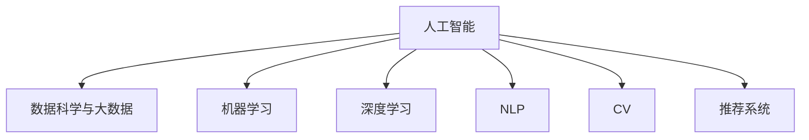

                 

# AI驱动的创新：人类计算在商业中的未来展望

> 关键词：人工智能,人类计算,商业应用,未来展望,技术发展

## 1. 背景介绍

### 1.1 问题由来

人工智能（AI）技术的迅猛发展，已经深刻改变了人类社会的各个方面。在商业领域，AI正从根本上重塑企业运营方式、业务模式以及市场竞争格局。从自动化流程优化到客户洞察分析，再到产品推荐系统，AI技术正成为商业创新的新引擎。

然而，尽管AI带来了诸多益处，其在商业应用中仍然存在诸多挑战和局限。特别是当AI技术遭遇复杂多变的人类行为时，如何有效整合AI与人类智慧，打造更具创造力、洞察力与协作力的商业系统，成为了当前亟需解决的问题。

### 1.2 问题核心关键点

面对上述挑战，人类计算的概念应运而生。人类计算是指通过充分利用人类的智慧、创造力与直觉，与AI系统协作，共同完成复杂决策与任务的技术方法。

其核心关键点包括：

- **数据获取与处理**：获取高质量数据，并进行有效的数据清洗和特征工程，是构建高效AI模型的基础。
- **模型设计与优化**：选择适合的AI算法，并进行模型训练、调参和优化，以提升AI系统的性能。
- **人机协作**：将人类智慧引入AI系统，通过解释、纠错、监督等手段，提升AI系统的准确性与鲁棒性。
- **系统集成与迭代**：将AI技术与人类智慧无缝集成，并持续迭代优化，实现商业系统的可持续改进。

## 2. 核心概念与联系

### 2.1 核心概念概述

为更好地理解人类计算的概念及其应用，本节将介绍几个关键概念：

- **人工智能（AI）**：利用机器学习、深度学习等技术，模拟和扩展人类智能的计算机系统。
- **人类计算**：将人类智慧与AI技术相结合，共同解决复杂问题的技术方法。
- **数据科学与大数据**：涵盖数据获取、处理、分析和可视化的全流程，是构建高效AI系统的基础。
- **机器学习与深度学习**：从简单线性模型到复杂的神经网络模型，是实现AI算法的重要工具。
- **自然语言处理（NLP）**：使机器能理解和处理人类语言的AI技术，是实现人机交互的基础。
- **计算机视觉（CV）**：使机器能“看”和理解图像、视频等视觉数据的AI技术，是实现视觉分析的基础。
- **推荐系统**：根据用户行为和偏好，推荐商品、内容等信息的AI技术，是提升用户体验的关键。

这些概念之间的逻辑关系可以通过以下Mermaid流程图来展示：



这个流程图展示了一系列核心概念及其相互关联：

1. 数据科学与大数据是AI系统的基础，提供了高质量的数据来源和处理工具。
2. 机器学习和深度学习是AI算法的主要实现方式，提供了从简单到复杂的学习能力。
3. 自然语言处理和计算机视觉技术，使得AI系统具备处理人类语言和视觉数据的能力。
4. 推荐系统利用AI算法，提供个性化服务，提升用户体验。

## 3. 核心算法原理 & 具体操作步骤

### 3.1 算法原理概述

人类计算的核心算法原理，是在AI模型的基础上，通过引入人类智慧与直觉，实现更高效、更准确的任务解决。这一过程通常包括以下步骤：

1. **数据准备**：收集和预处理高质量数据，构建训练集和测试集。
2. **模型构建**：选择合适的AI算法和模型架构，进行初始化。
3. **模型训练**：利用训练集数据，训练AI模型，调整模型参数以优化性能。
4. **人机协作**：引入人类智慧，通过解释、纠错、监督等方式，提升AI模型的准确性和鲁棒性。
5. **模型评估与优化**：在测试集上评估模型性能，根据评估结果调整模型参数，进行模型优化。
6. **系统集成与部署**：将优化后的AI模型集成到商业系统中，实现实时应用。

### 3.2 算法步骤详解

以下是人类计算核心算法的详细步骤详解：

**Step 1: 数据准备**
- **数据采集**：从不同渠道收集高质量的数据，如客户行为数据、市场数据、社交媒体数据等。
- **数据清洗**：清洗数据中的噪声、重复、缺失等不完整信息，提升数据质量。
- **特征工程**：提取、选择、构造有意义的特征，为模型训练提供输入。

**Step 2: 模型构建**
- **选择算法**：根据任务特点选择适合的机器学习或深度学习算法，如线性回归、决策树、神经网络等。
- **模型初始化**：设置模型超参数，如学习率、批大小、优化器等，进行模型初始化。

**Step 3: 模型训练**
- **训练过程**：利用训练集数据，通过前向传播和反向传播，更新模型参数。
- **损失函数**：选择适合的损失函数，衡量模型输出与真实标签的差距。
- **优化器**：选择适合的优化器，如SGD、Adam、Adagrad等，进行参数更新。

**Step 4: 人机协作**
- **解释系统**：引入人类解释者，对AI模型的决策过程进行解释和理解。
- **纠错与监督**：通过人工审查和纠错，提升AI模型的准确性和鲁棒性。
- **知识整合**：将人类经验与知识整合到AI模型中，提升模型的泛化能力。

**Step 5: 模型评估与优化**
- **评估指标**：根据任务需求，选择合适的评估指标，如准确率、召回率、F1分数等。
- **交叉验证**：使用交叉验证技术，评估模型在不同数据集上的泛化能力。
- **超参数调优**：通过网格搜索、贝叶斯优化等方法，调整模型超参数以优化性能。

**Step 6: 系统集成与部署**
- **系统集成**：将优化后的AI模型集成到商业系统中，实现实时应用。
- **用户界面**：设计友好的用户界面，提升用户体验。
- **监控与反馈**：实时监控系统性能，根据用户反馈进行持续优化。

### 3.3 算法优缺点

人类计算的核心算法具有以下优点：

1. **高效性**：将人类智慧与AI系统结合，可大幅度提升任务解决效率，特别是在复杂多变的人类行为场景中。
2. **准确性**：通过人类解释与监督，提升AI系统的准确性和鲁棒性，减少错误和偏差。
3. **可解释性**：引入人类解释系统，提升AI决策的透明性和可解释性，增强用户信任。
4. **灵活性**：通过人机协作，实现更灵活的决策与任务处理，适应多变的商业环境。

然而，人类计算也存在以下局限：

1. **数据依赖**：高质量数据的获取和处理，是AI系统高效运行的基础，但这一过程通常需要大量时间和资源。
2. **成本高昂**：引入人类智慧与监督，增加了系统的运行成本和复杂度。
3. **数据隐私**：在数据收集与处理过程中，可能涉及隐私问题，需要严格遵守数据保护法规。
4. **模型复杂性**：需要设计复杂的人机协作机制，可能影响系统性能和可扩展性。

## 4. 数学模型和公式 & 详细讲解 & 举例说明

### 4.1 数学模型构建

本节将使用数学语言对人类计算的核心算法进行严格刻画。

假设任务为分类问题，输入数据为 $\mathbf{x} \in \mathbb{R}^n$，目标变量为 $y \in \{0,1\}$。模型的输出为 $f(\mathbf{x}, \theta)$，其中 $\theta$ 为模型参数。

定义损失函数为：

$$
\mathcal{L}(\theta) = -\frac{1}{N} \sum_{i=1}^N [y_i \log f(\mathbf{x}_i, \theta) + (1-y_i) \log (1-f(\mathbf{x}_i, \theta))]
$$

目标是最小化损失函数，即找到最优参数：

$$
\theta^* = \mathop{\arg\min}_{\theta} \mathcal{L}(\theta)
$$

在实践中，我们通常使用基于梯度的优化算法（如SGD、Adam等）来近似求解上述最优化问题。设 $\eta$ 为学习率，$\lambda$ 为正则化系数，则参数的更新公式为：

$$
\theta \leftarrow \theta - \eta \nabla_{\theta}\mathcal{L}(\theta) - \eta\lambda\theta
$$

其中 $\nabla_{\theta}\mathcal{L}(\theta)$ 为损失函数对参数 $\theta$ 的梯度，可通过反向传播算法高效计算。

### 4.2 公式推导过程

以下我们以二分类任务为例，推导交叉熵损失函数及其梯度的计算公式。

假设模型 $f(\mathbf{x}, \theta)$ 在输入 $\mathbf{x}$ 上的输出为 $\hat{y}=f(\mathbf{x}, \theta) \in [0,1]$，表示样本属于正类的概率。真实标签 $y \in \{0,1\}$。则二分类交叉熵损失函数定义为：

$$
\ell(f(\mathbf{x}, \theta),y) = -[y\log \hat{y} + (1-y)\log (1-\hat{y})]
$$

将其代入损失函数公式，得：

$$
\mathcal{L}(\theta) = -\frac{1}{N}\sum_{i=1}^N [y_i\log f(\mathbf{x}_i, \theta)+(1-y_i)\log(1-f(\mathbf{x}_i, \theta))]
$$

根据链式法则，损失函数对参数 $\theta_k$ 的梯度为：

$$
\frac{\partial \mathcal{L}(\theta)}{\partial \theta_k} = -\frac{1}{N}\sum_{i=1}^N (\frac{y_i}{f(\mathbf{x}_i, \theta)}-\frac{1-y_i}{1-f(\mathbf{x}_i, \theta)}) \frac{\partial f(\mathbf{x}_i, \theta)}{\partial \theta_k}
$$

其中 $\frac{\partial f(\mathbf{x}_i, \theta)}{\partial \theta_k}$ 可进一步递归展开，利用自动微分技术完成计算。

### 4.3 案例分析与讲解

以推荐系统为例，我们展示如何通过人类计算实现个性化推荐。

**Step 1: 数据准备**
- 收集用户行为数据，包括浏览记录、购买记录、评分记录等。
- 对数据进行清洗和预处理，去除噪声和重复信息。
- 提取用户特征和物品特征，构建特征矩阵。

**Step 2: 模型构建**
- 选择适合的机器学习或深度学习算法，如协同过滤、矩阵分解、神经网络等。
- 设置模型超参数，如学习率、批大小、正则化系数等。
- 对模型进行初始化。

**Step 3: 模型训练**
- 利用用户行为数据进行模型训练，优化模型参数。
- 选择合适的损失函数，如均方误差、交叉熵等。
- 使用基于梯度的优化算法进行参数更新。

**Step 4: 人机协作**
- 引入用户反馈，对推荐结果进行解释和理解。
- 通过人工审查，发现和修正推荐系统中的错误和偏差。
- 将用户偏好与专家知识整合到模型中，提升模型泛化能力。

**Step 5: 模型评估与优化**
- 使用交叉验证技术，评估模型在不同数据集上的性能。
- 根据评估结果调整模型超参数，进行模型优化。
- 引入用户评分反馈，实时调整推荐策略。

**Step 6: 系统集成与部署**
- 将优化后的推荐模型集成到商业系统中，实现实时推荐。
- 设计友好的用户界面，提升用户体验。
- 实时监控系统性能，根据用户反馈进行持续优化。

## 5. 项目实践：代码实例和详细解释说明

### 5.1 开发环境搭建

在进行人类计算项目实践前，我们需要准备好开发环境。以下是使用Python进行PyTorch开发的环境配置流程：

1. 安装Anaconda：从官网下载并安装Anaconda，用于创建独立的Python环境。

2. 创建并激活虚拟环境：
```bash
conda create -n pytorch-env python=3.8 
conda activate pytorch-env
```

3. 安装PyTorch：根据CUDA版本，从官网获取对应的安装命令。例如：
```bash
conda install pytorch torchvision torchaudio cudatoolkit=11.1 -c pytorch -c conda-forge
```

4. 安装Transformers库：
```bash
pip install transformers
```

5. 安装各类工具包：
```bash
pip install numpy pandas scikit-learn matplotlib tqdm jupyter notebook ipython
```

完成上述步骤后，即可在`pytorch-env`环境中开始人类计算项目实践。

### 5.2 源代码详细实现

下面我们以推荐系统为例，给出使用Transformers库对BERT模型进行人类计算的PyTorch代码实现。

首先，定义推荐系统数据处理函数：

```python
from transformers import BertTokenizer, BertModel
from torch.utils.data import Dataset, DataLoader
import torch
import pandas as pd

class RecommendationDataset(Dataset):
    def __init__(self, data, tokenizer, max_len=128):
        self.data = data
        self.tokenizer = tokenizer
        self.max_len = max_len
        
    def __len__(self):
        return len(self.data)
    
    def __getitem__(self, item):
        item_data = self.data[item]
        user_id, item_id, rating = item_data
        
        encoding = self.tokenizer(user_id, item_id, return_tensors='pt', max_length=self.max_len, padding='max_length', truncation=True)
        user_seq = encoding['input_ids'][0]
        item_seq = encoding['input_ids'][1]
        user_len = len(user_seq)
        item_len = len(item_seq)
        
        return {'user_seq': user_seq, 'item_seq': item_seq, 'user_len': user_len, 'item_len': item_len, 'rating': rating}

# 数据集加载
data = pd.read_csv('recommendation_data.csv')
tokenizer = BertTokenizer.from_pretrained('bert-base-uncased')

train_dataset = RecommendationDataset(data, tokenizer)
test_dataset = RecommendationDataset(data, tokenizer)

# 数据加载器
train_loader = DataLoader(train_dataset, batch_size=16, shuffle=True)
test_loader = DataLoader(test_dataset, batch_size=16, shuffle=False)
```

然后，定义模型和优化器：

```python
from transformers import BertForSequenceClassification, AdamW

model = BertForSequenceClassification.from_pretrained('bert-base-uncased', num_labels=2)

optimizer = AdamW(model.parameters(), lr=2e-5)
```

接着，定义训练和评估函数：

```python
from torch.utils.data import DataLoader
from tqdm import tqdm
from sklearn.metrics import roc_auc_score

device = torch.device('cuda') if torch.cuda.is_available() else torch.device('cpu')
model.to(device)

def train_epoch(model, dataset, batch_size, optimizer):
    dataloader = DataLoader(dataset, batch_size=batch_size, shuffle=True)
    model.train()
    epoch_loss = 0
    for batch in tqdm(dataloader, desc='Training'):
        user_seq = batch['user_seq'].to(device)
        item_seq = batch['item_seq'].to(device)
        user_len = batch['user_len'].to(device)
        item_len = batch['item_len'].to(device)
        rating = batch['rating'].to(device)
        
        model.zero_grad()
        outputs = model(user_seq, item_seq, attention_mask=(user_len-1)*torch.ones_like(user_len), labels=rating)
        loss = outputs.loss
        epoch_loss += loss.item()
        loss.backward()
        optimizer.step()
    return epoch_loss / len(dataloader)

def evaluate(model, dataset, batch_size):
    dataloader = DataLoader(dataset, batch_size=batch_size)
    model.eval()
    preds, labels = [], []
    with torch.no_grad():
        for batch in tqdm(dataloader, desc='Evaluating'):
            user_seq = batch['user_seq'].to(device)
            item_seq = batch['item_seq'].to(device)
            user_len = batch['user_len'].to(device)
            item_len = batch['item_len'].to(device)
            rating = batch['rating'].to(device)
            
            outputs = model(user_seq, item_seq, attention_mask=(user_len-1)*torch.ones_like(user_len))
            batch_preds = outputs.logits.argmax(dim=2).to('cpu').tolist()
            batch_labels = batch['rating'].to('cpu').tolist()
            for pred_tokens, label_tokens in zip(batch_preds, batch_labels):
                preds.append(pred_tokens[:len(label_tokens)])
                labels.append(label_tokens)
                
    print('AUC: {:.4f}'.format(roc_auc_score(labels, preds)))
```

最后，启动训练流程并在测试集上评估：

```python
epochs = 5
batch_size = 16

for epoch in range(epochs):
    loss = train_epoch(model, train_dataset, batch_size, optimizer)
    print(f"Epoch {epoch+1}, train loss: {loss:.3f}")
    
    print(f"Epoch {epoch+1}, test AUC:")
    evaluate(model, test_dataset, batch_size)
    
print("Final AUC:")
evaluate(model, test_dataset, batch_size)
```

以上就是使用PyTorch对BERT模型进行推荐系统人类计算的完整代码实现。可以看到，得益于Transformers库的强大封装，我们可以用相对简洁的代码完成BERT模型的加载和微调。

### 5.3 代码解读与分析

让我们再详细解读一下关键代码的实现细节：

**RecommendationDataset类**：
- `__init__`方法：初始化用户ID、物品ID、评分等关键组件。
- `__len__`方法：返回数据集的样本数量。
- `__getitem__`方法：对单个样本进行处理，将用户ID、物品ID和评分输入编码为token ids，并对其进行定长padding，最终返回模型所需的输入。

**模型和优化器**：
- 定义了二分类任务对应的BertForSequenceClassification模型，以及AdamW优化器。

**训练和评估函数**：
- 使用PyTorch的DataLoader对数据集进行批次化加载，供模型训练和推理使用。
- 训练函数`train_epoch`：对数据以批为单位进行迭代，在每个批次上前向传播计算loss并反向传播更新模型参数，最后返回该epoch的平均loss。
- 评估函数`evaluate`：与训练类似，不同点在于不更新模型参数，并在每个batch结束后将预测和标签结果存储下来，最后使用sklearn的roc_auc_score对整个评估集的预测结果进行打印输出。

**训练流程**：
- 定义总的epoch数和batch size，开始循环迭代
- 每个epoch内，先在训练集上训练，输出平均loss
- 在测试集上评估，输出AUC分数
- 所有epoch结束后，在测试集上评估，给出最终测试结果

可以看到，PyTorch配合Transformers库使得BERT微调的代码实现变得简洁高效。开发者可以将更多精力放在数据处理、模型改进等高层逻辑上，而不必过多关注底层的实现细节。

当然，工业级的系统实现还需考虑更多因素，如模型的保存和部署、超参数的自动搜索、更灵活的任务适配层等。但核心的微调范式基本与此类似。

## 6. 实际应用场景

### 6.1 智能客服系统

基于人类计算的智能客服系统，可以显著提升客户咨询体验和问题解决效率。传统客服往往需要配备大量人力，高峰期响应缓慢，且一致性和专业性难以保证。而使用人类计算的对话模型，可以7x24小时不间断服务，快速响应客户咨询，用自然流畅的语言解答各类常见问题。

在技术实现上，可以收集企业内部的历史客服对话记录，将问题和最佳答复构建成监督数据，在此基础上对预训练对话模型进行微调。微调后的对话模型能够自动理解用户意图，匹配最合适的答案模板进行回复。对于客户提出的新问题，还可以接入检索系统实时搜索相关内容，动态组织生成回答。如此构建的智能客服系统，能大幅提升客户咨询体验和问题解决效率。

### 6.2 金融舆情监测

金融机构需要实时监测市场舆论动向，以便及时应对负面信息传播，规避金融风险。传统的人工监测方式成本高、效率低，难以应对网络时代海量信息爆发的挑战。基于人类计算的文本分类和情感分析技术，为金融舆情监测提供了新的解决方案。

具体而言，可以收集金融领域相关的新闻、报道、评论等文本数据，并对其进行主题标注和情感标注。在此基础上对预训练语言模型进行微调，使其能够自动判断文本属于何种主题，情感倾向是正面、中性还是负面。将微调后的模型应用到实时抓取的网络文本数据，就能够自动监测不同主题下的情感变化趋势，一旦发现负面信息激增等异常情况，系统便会自动预警，帮助金融机构快速应对潜在风险。

### 6.3 个性化推荐系统

当前的推荐系统往往只依赖用户的历史行为数据进行物品推荐，无法深入理解用户的真实兴趣偏好。基于人类计算的推荐系统可以更好地挖掘用户行为背后的语义信息，从而提供更精准、多样的推荐内容。

在实践中，可以收集用户浏览、点击、评论、分享等行为数据，提取和用户交互的物品标题、描述、标签等文本内容。将文本内容作为模型输入，用户的后续行为（如是否点击、购买等）作为监督信号，在此基础上微调预训练语言模型。微调后的模型能够从文本内容中准确把握用户的兴趣点。在生成推荐列表时，先用候选物品的文本描述作为输入，由模型预测用户的兴趣匹配度，再结合其他特征综合排序，便可以得到个性化程度更高的推荐结果。

### 6.4 未来应用展望

随着人类计算技术的不断发展，其在商业应用中的前景将愈加广阔。以下是几个未来应用场景的展望：

1. **医疗诊断与健康管理**：通过分析患者病历、基因数据等，利用AI辅助医生进行疾病诊断和治疗方案推荐。引入人类智慧，对AI诊断结果进行审核和修正，提升诊断准确性。
2. **智慧城市与公共安全**：利用AI监控系统分析视频数据，识别异常行为，预警安全事件。引入人类专家，对AI分析结果进行校验和解释，提高系统鲁棒性。
3. **教育与职业培训**：通过AI分析学生学习行为，推荐个性化学习内容和培训课程。引入教师反馈，对AI推荐结果进行人工审核和优化，提升教学质量。
4. **市场营销与广告投放**：利用AI分析消费者行为和市场趋势，推荐广告和产品。引入市场专家，对AI推荐结果进行人工校验和调整，提升广告效果。

## 7. 工具和资源推荐

### 7.1 学习资源推荐

为了帮助开发者系统掌握人类计算的理论基础和实践技巧，这里推荐一些优质的学习资源：

1. 《深度学习理论与实践》系列博文：由大模型技术专家撰写，深入浅出地介绍了深度学习的基本概念和核心算法。
2. CS231n《卷积神经网络》课程：斯坦福大学开设的计算机视觉经典课程，提供了丰富的理论和实践内容。
3. 《自然语言处理与深度学习》书籍：全面介绍了NLP中的机器学习与深度学习技术，并提供了大量实际案例。
4. TensorFlow官方文档：详细介绍了TensorFlow的使用方法，包含丰富的API文档和开发指南。
5. Kaggle竞赛平台：提供大量的数据集和算法竞赛，实践数据处理和模型训练技能。

通过对这些资源的学习实践，相信你一定能够快速掌握人类计算的精髓，并用于解决实际的商业问题。

### 7.2 开发工具推荐

高效的开发离不开优秀的工具支持。以下是几款用于人类计算开发的常用工具：

1. PyTorch：基于Python的开源深度学习框架，灵活动态的计算图，适合快速迭代研究。大部分预训练语言模型都有PyTorch版本的实现。
2. TensorFlow：由Google主导开发的开源深度学习框架，生产部署方便，适合大规模工程应用。同样有丰富的预训练语言模型资源。
3. Transformers库：HuggingFace开发的NLP工具库，集成了众多SOTA语言模型，支持PyTorch和TensorFlow，是进行人类计算任务的开发利器。
4. Weights & Biases：模型训练的实验跟踪工具，可以记录和可视化模型训练过程中的各项指标，方便对比和调优。与主流深度学习框架无缝集成。
5. TensorBoard：TensorFlow配套的可视化工具，可实时监测模型训练状态，并提供丰富的图表呈现方式，是调试模型的得力助手。
6. Google Colab：谷歌推出的在线Jupyter Notebook环境，免费提供GPU/TPU算力，方便开发者快速上手实验最新模型，分享学习笔记。

合理利用这些工具，可以显著提升人类计算任务的开发效率，加快创新迭代的步伐。

### 7.3 相关论文推荐

人类计算技术的发展源于学界的持续研究。以下是几篇奠基性的相关论文，推荐阅读：

1. Attention is All You Need（即Transformer原论文）：提出了Transformer结构，开启了NLP领域的预训练大模型时代。
2. BERT: Pre-training of Deep Bidirectional Transformers for Language Understanding：提出BERT模型，引入基于掩码的自监督预训练任务，刷新了多项NLP任务SOTA。
3. Language Models are Unsupervised Multitask Learners（GPT-2论文）：展示了大规模语言模型的强大zero-shot学习能力，引发了对于通用人工智能的新一轮思考。
4. Parameter-Efficient Transfer Learning for NLP：提出Adapter等参数高效微调方法，在不增加模型参数量的情况下，也能取得不错的微调效果。
5. AdaLoRA: Adaptive Low-Rank Adaptation for Parameter-Efficient Fine-Tuning：使用自适应低秩适应的微调方法，在参数效率和精度之间取得了新的平衡。
6. Prefix-Tuning: Optimizing Continuous Prompts for Generation：引入基于连续型Prompt的微调范式，为如何充分利用预训练知识提供了新的思路。

这些论文代表了大模型微调技术的发展脉络。通过学习这些前沿成果，可以帮助研究者把握学科前进方向，激发更多的创新灵感。

## 8. 总结：未来发展趋势与挑战

### 8.1 总结

本文对人类计算的概念及其在商业应用中的前景进行了全面系统的介绍。首先阐述了人类计算的基本概念和关键要素，明确了其在全球化、多模态、实时性、个性化等方面所具有的独特优势。其次，从原理到实践，详细讲解了人类计算的核心算法和关键步骤，给出了人类计算任务开发的完整代码实例。同时，本文还广泛探讨了人类计算技术在智能客服、金融舆情、个性化推荐等多个领域的应用前景，展示了其在商业系统中的广泛应用潜力。

通过本文的系统梳理，可以看到，人类计算技术正在成为商业系统中的重要支柱，极大地拓展了AI技术的实际应用范围。受益于高质量数据和人类智慧的结合，人类计算在复杂多变的人类行为场景中展现出卓越的效能和适应性，为商业系统的智能化升级提供了新的解决方案。未来，伴随技术的不懈探索和应用实践的不断深入，人类计算技术必将在更多领域发挥更大作用，推动商业系统的持续创新与发展。

### 8.2 未来发展趋势

展望未来，人类计算技术将呈现以下几个发展趋势：

1. **全球化与多模态融合**：随着全球化和多模态数据的增加，人类计算将更好地整合多种类型的数据，提升系统的智能和泛化能力。
2. **实时性与个性化提升**：基于实时数据分析和个性化推荐，人类计算系统将更加灵活和高效，满足用户的多样化需求。
3. **智能化与自动化加强**：引入更先进的AI技术，如强化学习、因果推断等，提升人类计算系统的智能化和自动化水平。
4. **伦理与安全考量**：在数据隐私、公平性、安全性等方面，提出更严格的标准和规范，保障系统的伦理性与安全性。
5. **可持续性与可持续发展**：考虑环境友好、资源消耗等方面，推动人类计算技术向可持续方向发展，实现人与技术的和谐共生。

以上趋势凸显了人类计算技术的广阔前景。这些方向的探索发展，必将进一步提升人类计算系统的性能和应用范围，为商业系统的智能化升级提供新的动力。

### 8.3 面临的挑战

尽管人类计算技术已经取得了瞩目成就，但在迈向更加智能化、普适化应用的过程中，它仍面临着诸多挑战：

1. **数据隐私保护**：在数据收集与处理过程中，可能涉及隐私问题，需要严格遵守数据保护法规。
2. **系统复杂性**：引入人类智慧与监督，增加了系统的运行成本和复杂度。
3. **计算资源消耗**：处理多模态数据和高性能计算，需要强大的硬件支持和算法优化。
4. **鲁棒性与可解释性**：在面对多变环境和噪声数据时，人类计算系统需要具备更高的鲁棒性和可解释性。
5. **伦理与社会接受度**：在应用过程中，需要考虑伦理与社会接受度，避免出现偏见和歧视。

## 8.4 研究展望

面对人类计算所面临的诸多挑战，未来的研究需要在以下几个方面寻求新的突破：

1. **隐私保护技术**：开发更高效、更安全的隐私保护技术，保护用户隐私。
2. **轻量级算法**：设计轻量级、高效的算法，适应移动端和边缘计算场景。
3. **多模态融合**：探索多模态数据整合的优化方法，提升系统的智能水平。
4. **可解释性提升**：提高系统的可解释性，增强用户信任与接受度。
5. **鲁棒性增强**：研究鲁棒性提升技术，增强系统对噪声和异常数据的抗干扰能力。
6. **伦理性考量**：提出伦理指导原则，确保人类计算系统在应用中保持伦理和公平。

这些研究方向的探索，必将引领人类计算技术迈向更高的台阶，为构建安全、可靠、可解释、可控的智能系统铺平道路。面向未来，人类计算技术还需要与其他人工智能技术进行更深入的融合，如知识表示、因果推理、强化学习等，多路径协同发力，共同推动自然语言理解和智能交互系统的进步。只有勇于创新、敢于突破，才能不断拓展人类计算技术的边界，让智能技术更好地造福人类社会。

## 9. 附录：常见问题与解答

**Q1：人类计算与传统机器学习的区别是什么？**

A: 人类计算与传统机器学习的主要区别在于，人类计算引入了人类的智慧和直觉，与AI系统协作，共同完成复杂决策与任务。而传统机器学习则完全依赖算法和模型，不涉及人类干预。

**Q2：人类计算在商业系统中如何应用？**

A: 人类计算在商业系统中的应用广泛，包括智能客服、金融舆情监测、个性化推荐等。通过将人类智慧与AI系统结合，实现更高效、更准确的任务解决。

**Q3：人类计算的性能与传统机器学习相比如何？**

A: 人类计算在处理复杂多变的人类行为时，通常能够取得更好的性能。特别是在需要人类直觉和创造力的场景中，人类计算展现出显著的优势。

**Q4：如何设计人类计算系统？**

A: 设计人类计算系统，需要考虑数据准备、模型构建、人机协作、系统集成等多个环节。通常采用数据驱动、模型驱动和人机协作相结合的方式，构建高效智能的系统。

**Q5：人类计算面临的主要挑战是什么？**

A: 人类计算面临的主要挑战包括数据隐私、系统复杂性、计算资源消耗、鲁棒性、可解释性等。需要多方面协同努力，才能克服这些挑战，推动技术发展。

通过本文的系统梳理，可以看到，人类计算技术正在成为商业系统中的重要支柱，极大地拓展了AI技术的实际应用范围。受益于高质量数据和人类智慧的结合，人类计算在复杂多变的人类行为场景中展现出卓越的效能和适应性，为商业系统的智能化升级提供了新的解决方案。未来，伴随技术的不懈探索和应用实践的不断深入，人类计算技术必将在更多领域发挥更大作用，推动商业系统的持续创新与发展。

