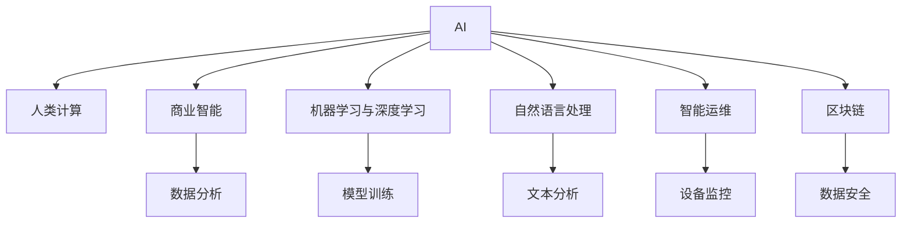

                 

# AI驱动的创新：人类计算在商业中的潜力与挑战

## 1. 背景介绍

### 1.1 问题由来

随着人工智能技术的快速发展，AI在商业领域的应用范围越来越广，影响也越来越深远。AI驱动的创新正在重塑各个行业的业务模式和运营方式，带来前所未有的机遇和挑战。然而，如何充分利用AI技术，最大化其在商业中的潜力，同时有效应对可能出现的挑战，是一个亟待探讨的重要话题。

### 1.2 问题核心关键点

AI驱动的创新主要集中在以下几个方面：

- **自动化流程优化**：通过AI技术对业务流程进行自动化，提升效率，降低成本。
- **数据驱动决策**：利用AI对海量数据进行分析和预测，辅助业务决策。
- **个性化推荐与客户体验**：AI技术可以帮助企业提供个性化的产品和服务，提升客户满意度。
- **智能运维与维护**：AI技术可以实现设备状态的实时监控与预测性维护，降低运营风险。
- **自然语言处理与交互**：AI技术可以提升人机交互体验，实现智能客服、聊天机器人等应用。

然而，AI在商业应用中也存在一些挑战，包括：

- **数据质量与隐私**：数据的准确性和隐私保护是AI应用的基础，需要解决数据噪音和隐私泄露问题。
- **模型可解释性**：AI模型的决策过程往往难以解释，这可能会影响业务决策的可信度和接受度。
- **计算资源消耗**：AI模型通常需要大量计算资源，如何有效利用资源是一个重要挑战。
- **人才培养与成本**：AI技术的应用需要高水平人才，但相关人才培养周期长、成本高。

本文旨在深入探讨AI在商业中的潜力与挑战，并提出相应的解决方案。

## 2. 核心概念与联系

### 2.1 核心概念概述

为了更好地理解AI在商业中的应用，本节将介绍几个核心概念：

- **AI与人类计算**：AI技术通过模仿人类智能来处理复杂问题，而人类计算则强调人的智慧与经验在解决问题中的作用。
- **商业智能(BI)**：利用数据分析、挖掘技术，支持企业决策过程。
- **机器学习与深度学习**：通过数据驱动的方式，训练模型，实现自动化的决策与优化。
- **自然语言处理(NLP)**：使机器能够理解和处理人类语言，实现智能客服、文本分析等应用。
- **智能运维(IoT)**：利用AI技术对物联网设备进行监控和管理，提升运维效率。
- **区块链技术**：提供一种去中心化、安全的交易和数据存储方式，适用于数据共享与隐私保护。

这些核心概念之间存在紧密联系，共同构成了AI在商业应用的基本框架。

### 2.2 核心概念原理和架构的 Mermaid 流程图



这个流程图展示了AI在商业应用中各个概念之间的联系：

1. AI技术通过模仿人类智能，支持人类计算。
2. 商业智能利用AI技术进行数据分析与挖掘，辅助决策。
3. 机器学习与深度学习通过数据驱动的方式，训练模型，实现自动化决策与优化。
4. 自然语言处理使机器能够理解人类语言，实现智能客服、文本分析等应用。
5. 智能运维利用AI技术对物联网设备进行监控与管理，提升运维效率。
6. 区块链技术提供去中心化的数据存储方式，保障数据安全与隐私。

## 3. 核心算法原理 & 具体操作步骤

### 3.1 算法原理概述

AI在商业中的潜力主要体现在以下几个方面：

- **自动化流程优化**：通过AI对业务流程进行自动化，提升效率，降低成本。常见方法包括机器学习、自然语言处理等技术。
- **数据驱动决策**：利用AI对海量数据进行分析和预测，辅助业务决策。方法包括机器学习、深度学习、时间序列预测等。
- **个性化推荐与客户体验**：AI技术可以根据用户行为数据，提供个性化的产品和服务，提升客户满意度。方法包括协同过滤、深度学习等。
- **智能运维与维护**：AI技术可以实现设备状态的实时监控与预测性维护，降低运营风险。方法包括物联网、机器学习等。
- **自然语言处理与交互**：AI技术可以提升人机交互体验，实现智能客服、聊天机器人等应用。方法包括自然语言处理、语音识别等。

### 3.2 算法步骤详解

基于AI驱动的商业创新主要包含以下几个步骤：

1. **需求分析**：确定业务问题，明确AI在其中的应用场景和目标。
2. **数据准备**：收集、清洗、标注相关数据，为AI模型训练和优化提供基础。
3. **模型训练**：选择合适的算法与模型结构，对数据进行训练和优化，获得最佳的性能。
4. **部署与集成**：将训练好的模型集成到业务流程中，进行实际应用。
5. **监控与优化**：持续监控模型性能，根据实际应用效果进行调整和优化。

### 3.3 算法优缺点

AI在商业中的应用具有以下优点：

- **效率提升**：自动化流程和数据分析可以有效提升业务效率，降低运营成本。
- **决策支持**：AI模型可以提供客观的数据支持，辅助决策者做出更科学的决策。
- **个性化服务**：AI可以根据用户行为数据，提供个性化的产品和服务，提升客户体验。
- **预测性维护**：AI技术可以实现设备状态的实时监控与预测性维护，减少故障率，提高设备利用率。

然而，AI在商业应用中也存在一些缺点：

- **数据依赖**：AI模型的性能高度依赖于数据的质量和数量，数据的收集、清洗和标注需要大量时间和资源。
- **模型复杂性**：AI模型的构建和优化需要较高的技术门槛，模型复杂度较高，难以理解和调试。
- **成本投入**：AI技术的开发和应用需要大量的计算资源和专业人才，成本较高。
- **隐私风险**：AI模型往往需要大量敏感数据，数据泄露和隐私保护问题需要特别注意。

### 3.4 算法应用领域

AI在商业中主要应用于以下几个领域：

- **金融服务**：利用AI进行风险评估、信用评分、欺诈检测等。
- **零售电商**：通过AI技术进行需求预测、库存管理、个性化推荐等。
- **医疗健康**：利用AI进行疾病预测、影像诊断、治疗方案推荐等。
- **制造业**：通过AI技术进行质量控制、设备维护、供应链优化等。
- **物流与配送**：利用AI进行路径优化、配送调度、库存管理等。
- **能源与环保**：利用AI进行能源消耗预测、环境监测、污染控制等。

## 4. 数学模型和公式 & 详细讲解 & 举例说明

### 4.1 数学模型构建

在商业中，AI的应用模型通常包括以下几个模块：

- **输入层**：接收原始数据，如文本、图像、声音等。
- **中间层**：通过一系列的神经网络层或机器学习算法进行特征提取和模型训练。
- **输出层**：根据中间层的特征，输出预测结果或执行特定的业务决策。

以推荐系统为例，其数学模型通常包括：

- **用户-物品交互矩阵**：记录用户与物品的交互行为，如评分、浏览记录等。
- **用户特征向量**：表示用户的兴趣偏好、历史行为等。
- **物品特征向量**：表示物品的属性、评分分布等。
- **推荐模型**：利用机器学习算法，如协同过滤、深度学习等，对用户和物品进行关联预测，生成推荐列表。

### 4.2 公式推导过程

以协同过滤推荐系统为例，其推荐模型公式如下：

$$
\hat{y}_{ui} = \alpha \sum_{j \neq i} \frac{\hat{r}_{uj} \hat{r}_{ji}}{d_j} + \beta \frac{\sum_{j \neq i} y_{uj} \hat{r}_{ji}}{d_j}
$$

其中，$\hat{y}_{ui}$表示用户$u$对物品$i$的预测评分，$d_j$表示用户$j$的评分分布，$\alpha$和$\beta$为模型参数。

在实际应用中，协同过滤推荐系统通常分为基于用户的协同过滤和基于物品的协同过滤两种方法。

### 4.3 案例分析与讲解

以电商平台的个性化推荐系统为例，分析其数据处理和模型训练过程：

1. **数据准备**：收集用户的浏览记录、购买记录、评分记录等，清洗并标注数据，形成用户-物品交互矩阵。
2. **特征工程**：提取用户特征（如年龄、性别、购买历史等）和物品特征（如价格、品牌、类别等）。
3. **模型训练**：使用协同过滤算法或深度学习模型，如矩阵分解、神经网络等，对用户和物品进行关联预测。
4. **模型评估**：使用交叉验证等方法，评估推荐模型的效果，调整模型参数。
5. **部署与应用**：将训练好的模型集成到电商平台的推荐引擎中，实时生成推荐列表，提升用户体验。

## 5. 项目实践：代码实例和详细解释说明

### 5.1 开发环境搭建

在进行AI商业应用开发前，需要准备好开发环境。以下是使用Python进行TensorFlow开发的环境配置流程：

1. 安装Anaconda：从官网下载并安装Anaconda，用于创建独立的Python环境。

2. 创建并激活虚拟环境：
```bash
conda create -n tf-env python=3.8 
conda activate tf-env
```

3. 安装TensorFlow：根据CUDA版本，从官网获取对应的安装命令。例如：
```bash
conda install tensorflow
```

4. 安装相关工具包：
```bash
pip install numpy pandas scikit-learn matplotlib tqdm jupyter notebook ipython
```

完成上述步骤后，即可在`tf-env`环境中开始AI商业应用开发。

### 5.2 源代码详细实现

这里我们以电商平台的个性化推荐系统为例，给出使用TensorFlow进行模型开发的PyTorch代码实现。

首先，定义推荐模型的输入输出格式：

```python
import tensorflow as tf

# 输入层
user_input = tf.keras.layers.Input(shape=(1,), name='user_input')
item_input = tf.keras.layers.Input(shape=(1,), name='item_input')

# 输出层
output = tf.keras.layers.Dense(units=1, activation='sigmoid', name='output')(tf.keras.layers.concatenate([user_input, item_input]))
```

然后，定义推荐模型：

```python
# 中间层
hidden_layer = tf.keras.layers.Dense(units=32, activation='relu')(tf.keras.layers.concatenate([user_input, item_input]))
```

接着，定义推荐模型的损失函数和优化器：

```python
# 输出层
output = tf.keras.layers.Dense(units=1, activation='sigmoid')(hidden_layer)

# 损失函数
loss = tf.keras.losses.BinaryCrossentropy()(output, y_true)
```

最后，启动模型训练和测试：

```python
# 编译模型
model.compile(optimizer=tf.keras.optimizers.Adam(learning_rate=0.01), loss=loss)

# 训练模型
model.fit(x_train, y_train, epochs=10, batch_size=32, validation_data=(x_val, y_val))

# 测试模型
model.evaluate(x_test, y_test)
```

以上就是使用TensorFlow进行个性化推荐系统开发的完整代码实现。可以看到，通过TensorFlow的高级API，代码实现简洁高效。

### 5.3 代码解读与分析

让我们再详细解读一下关键代码的实现细节：

**定义输入输出**：
- `tf.keras.layers.Input`：定义输入层，接收用户ID和物品ID。
- `tf.keras.layers.Dense`：定义中间层和输出层，通过全连接神经网络进行特征提取和预测。

**定义模型**：
- `tf.keras.layers.concatenate`：将用户ID和物品ID拼接起来，作为神经网络的输入。
- `tf.keras.layers.Dense`：定义中间层，使用ReLU激活函数进行非线性变换。
- `tf.keras.layers.Dense`：定义输出层，使用Sigmoid激活函数进行二分类预测。

**定义损失函数和优化器**：
- `tf.keras.losses.BinaryCrossentropy`：定义二分类交叉熵损失函数，用于衡量模型预测与真实标签之间的差异。
- `tf.keras.optimizers.Adam`：定义Adam优化器，用于模型参数的优化。

**启动训练与测试**：
- `model.compile`：编译模型，指定优化器、损失函数等。
- `model.fit`：训练模型，指定训练数据、验证数据等。
- `model.evaluate`：测试模型，评估模型性能。

可以看到，TensorFlow的高级API使得AI商业应用开发变得简洁高效。开发者可以将更多精力放在模型设计、数据处理等高层逻辑上，而不必过多关注底层的实现细节。

当然，工业级的系统实现还需考虑更多因素，如模型的保存和部署、超参数的自动搜索、更加灵活的任务适配层等。但核心的算法范式基本与此类似。

## 6. 实际应用场景

### 6.1 金融服务

AI在金融服务中的应用主要包括风险评估、信用评分、欺诈检测等。以信用评分为例，分析其实际应用场景：

1. **数据准备**：收集用户的信用历史、消费记录、社交网络等信息，清洗并标注数据。
2. **特征工程**：提取用户特征（如年龄、收入、职业等）和信用特征（如贷款历史、还款记录等）。
3. **模型训练**：使用机器学习算法，如逻辑回归、随机森林等，对用户进行信用评分预测。
4. **模型评估**：使用交叉验证等方法，评估模型效果，调整模型参数。
5. **部署与应用**：将训练好的模型集成到金融机构的信用评分系统中，实时生成信用评分，辅助决策。

### 6.2 零售电商

AI在零售电商中的应用主要包括需求预测、库存管理、个性化推荐等。以个性化推荐为例，分析其实际应用场景：

1. **数据准备**：收集用户的浏览记录、购买记录、评分记录等，清洗并标注数据。
2. **特征工程**：提取用户特征（如年龄、性别、购买历史等）和物品特征（如价格、品牌、类别等）。
3. **模型训练**：使用协同过滤算法或深度学习模型，如矩阵分解、神经网络等，对用户和物品进行关联预测。
4. **模型评估**：使用交叉验证等方法，评估推荐模型的效果，调整模型参数。
5. **部署与应用**：将训练好的模型集成到电商平台的推荐引擎中，实时生成推荐列表，提升用户体验。

### 6.3 医疗健康

AI在医疗健康中的应用主要包括疾病预测、影像诊断、治疗方案推荐等。以影像诊断为例，分析其实际应用场景：

1. **数据准备**：收集医学影像数据，标注病灶区域和类别。
2. **特征工程**：提取影像特征（如像素值、纹理特征等）和诊断特征（如病灶大小、形态等）。
3. **模型训练**：使用深度学习算法，如卷积神经网络、全连接网络等，对医学影像进行病灶检测和分类。
4. **模型评估**：使用交叉验证等方法，评估模型效果，调整模型参数。
5. **部署与应用**：将训练好的模型集成到医疗影像诊断系统中，实时分析医学影像，辅助医生诊断。

### 6.4 未来应用展望

随着AI技术的不断进步，其在商业中的应用将更加广泛和深入。未来，AI驱动的创新可能进一步拓展到以下几个领域：

1. **智能运维与制造**：利用AI技术进行设备状态的实时监控与预测性维护，提升运维效率和设备利用率。
2. **智慧城市与交通**：通过AI技术实现城市事件的实时监测与预警，提升城市管理效率和交通智能化水平。
3. **智能农业与食品**：利用AI技术进行作物生长预测、病虫害检测、食品安全检测等，提升农业生产效率和食品安全水平。
4. **智慧教育和培训**：利用AI技术进行个性化学习推荐、智能辅导、情感分析等，提升教育培训效果。
5. **智能能源与环保**：利用AI技术进行能源消耗预测、环境监测、污染控制等，推动绿色可持续发展。

## 7. 工具和资源推荐

### 7.1 学习资源推荐

为了帮助开发者系统掌握AI在商业中的应用，这里推荐一些优质的学习资源：

1. **《深度学习》（Ian Goodfellow等著）**：全面介绍深度学习的基本概念、算法和应用。
2. **《Python深度学习》（Francois Chollet著）**：介绍使用TensorFlow、Keras等工具进行深度学习开发的实践方法。
3. **《机器学习实战》（Peter Harrington著）**：通过实战项目，展示机器学习算法在实际应用中的实现方法。
4. **《商业智能》（Tom Davenport著）**：介绍商业智能的基本概念、技术和应用。
5. **《智能运维》（Richard Yu等著）**：介绍智能运维的基本概念、技术和应用。

通过对这些资源的学习实践，相信你一定能够快速掌握AI在商业中的应用，并用于解决实际的商业问题。

### 7.2 开发工具推荐

高效的开发离不开优秀的工具支持。以下是几款用于AI商业应用开发的常用工具：

1. **TensorFlow**：由Google主导开发的开源深度学习框架，生产部署方便，适合大规模工程应用。
2. **PyTorch**：基于Python的开源深度学习框架，灵活度较高，适合快速迭代研究。
3. **Keras**：高层API，方便快速搭建深度学习模型。
4. **Jupyter Notebook**：交互式笔记本，方便进行数据探索和模型实验。
5. **Weights & Biases**：模型训练的实验跟踪工具，可以记录和可视化模型训练过程中的各项指标，方便对比和调优。
6. **Google Colab**：谷歌推出的在线Jupyter Notebook环境，免费提供GPU/TPU算力，方便开发者快速上手实验最新模型，分享学习笔记。

合理利用这些工具，可以显著提升AI商业应用开发的效率，加快创新迭代的步伐。

### 7.3 相关论文推荐

AI在商业中的应用源于学界的持续研究。以下是几篇奠基性的相关论文，推荐阅读：

1. **《大规模深度学习：实践、挑战与未来》（Goodfellow等著）**：介绍大规模深度学习的实践方法和挑战。
2. **《深度学习在金融领域的实践》（Taylor等著）**：介绍深度学习在金融领域的实际应用。
3. **《AI在零售电商中的应用》（Jiang等著）**：介绍AI在零售电商中的个性化推荐、库存管理等应用。
4. **《医疗影像中的深度学习》（Han等著）**：介绍深度学习在医学影像中的应用。
5. **《智能运维中的机器学习》（Li等著）**：介绍机器学习在智能运维中的应用。

这些论文代表了大规模深度学习在商业领域的应用脉络。通过学习这些前沿成果，可以帮助研究者把握学科前进方向，激发更多的创新灵感。

## 8. 总结：未来发展趋势与挑战

### 8.1 总结

本文对AI在商业中的潜力与挑战进行了全面系统的介绍。首先阐述了AI在商业中的重要应用场景，明确了AI在商业创新中的价值。其次，从原理到实践，详细讲解了AI商业应用的数学模型和具体步骤，给出了AI商业应用的完整代码实现。同时，本文还广泛探讨了AI在金融、零售、医疗等领域的应用前景，展示了AI驱动的商业创新的广阔前景。最后，本文精选了AI商业应用的各类学习资源，力求为读者提供全方位的技术指引。

通过本文的系统梳理，可以看到，AI在商业中具有广阔的应用前景和巨大的潜力，但也面临着数据质量、模型可解释性、计算资源消耗等诸多挑战。这些挑战需要通过不断创新和优化，逐步克服，才能实现AI商业应用的持续发展和优化。

### 8.2 未来发展趋势

展望未来，AI在商业中的应用将呈现以下几个发展趋势：

1. **自动化程度提升**：随着AI技术的进步，自动化流程的复杂度将进一步提升，能够处理更加复杂、多样化的业务场景。
2. **个性化服务增强**：利用AI技术，提供更加精准、个性化的产品和服务，提升客户体验和满意度。
3. **跨领域融合加强**：AI技术与物联网、区块链等技术深度融合，拓展应用范围，提升系统安全性和可靠性。
4. **数据驱动决策普及**：AI技术在商业决策中的应用将更加广泛，提升决策效率和质量。
5. **模型可解释性增强**：AI模型的决策过程将更加透明和可解释，提升决策的可信度和接受度。
6. **计算资源优化**：利用AI技术优化计算资源分配，提升系统效率和性能。

以上趋势凸显了AI在商业中的广泛应用前景，其应用将深刻影响各行各业的业务模式和运营方式。

### 8.3 面临的挑战

尽管AI在商业应用中已经取得了显著进展，但在迈向更加智能化、普适化应用的过程中，仍面临诸多挑战：

1. **数据质量与隐私**：数据的准确性和隐私保护是AI应用的基础，需要解决数据噪音和隐私泄露问题。
2. **模型可解释性**：AI模型的决策过程往往难以解释，这可能会影响业务决策的可信度和接受度。
3. **计算资源消耗**：AI模型通常需要大量计算资源，如何有效利用资源是一个重要挑战。
4. **人才培养与成本**：AI技术的应用需要高水平人才，但相关人才培养周期长、成本高。
5. **伦理道德约束**：AI技术在商业应用中需要遵守伦理道德，确保输出符合人类价值观和伦理道德。

这些挑战需要通过技术创新、制度完善和人才培养等多方面协同努力，逐步克服。

### 8.4 研究展望

面对AI在商业应用中所面临的挑战，未来的研究需要在以下几个方面寻求新的突破：

1. **数据增强与质量提升**：利用数据增强、生成对抗网络等技术，提升数据质量和多样性，解决数据噪音和隐私泄露问题。
2. **模型可解释性增强**：引入因果分析、模型蒸馏等技术，增强AI模型的可解释性和可解释性。
3. **计算资源优化**：利用分布式计算、模型压缩等技术，优化计算资源分配，提升系统效率和性能。
4. **人才培养与激励机制**：加强人才培养和激励机制，提升AI技术在商业中的应用水平。
5. **伦理道德约束**：建立AI技术应用的伦理道德框架，确保技术应用的合规性和可接受性。

这些研究方向将推动AI在商业中的应用走向成熟和规范，提升其应用价值和社会影响力。

## 9. 附录：常见问题与解答

**Q1：AI技术在商业中的应用是否存在数据依赖性？**

A: AI技术在商业中的应用确实存在数据依赖性。数据的质量、多样性和标注对AI模型的性能和泛化能力有重要影响。数据的噪音和隐私泄露问题需要通过数据清洗、去重、匿名化等技术进行解决。

**Q2：AI模型在商业应用中的可解释性问题如何解决？**

A: AI模型的可解释性问题是商业应用中的一大挑战。目前，通过模型蒸馏、因果分析、模型可视化等技术，可以增强AI模型的可解释性和可理解性。同时，建立透明、公开的AI模型应用规则和监管机制，确保AI技术的应用合规性和可接受性。

**Q3：AI技术在商业应用中的计算资源消耗如何优化？**

A: AI技术在商业应用中需要大量的计算资源，包括数据预处理、模型训练、推理等环节。通过分布式计算、模型压缩、算法优化等技术，可以显著降低计算资源消耗，提升系统的效率和性能。

**Q4：AI技术在商业应用中的伦理道德问题如何解决？**

A: AI技术在商业应用中需要遵守伦理道德规范，确保技术应用的合规性和可接受性。通过建立透明、公开的AI模型应用规则和监管机制，确保AI技术的应用符合人类价值观和伦理道德。

通过以上系统的分析和解答，可以看出，AI在商业中的应用具有广阔的前景和巨大的潜力，但也面临诸多挑战。只有通过不断创新和优化，才能充分发挥AI技术在商业中的价值，推动其广泛应用和普及。

