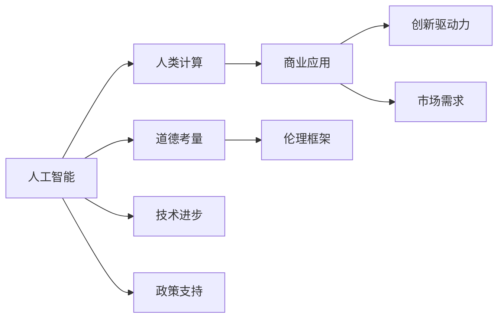

                 

# AI驱动的创新：人类计算在商业中的道德考虑因素与应用前景展望

> 关键词：人工智能,人类计算,商业应用,道德考量,伦理框架,创新驱动力

## 1. 背景介绍

随着人工智能(AI)技术的快速发展，“人类计算”的概念正逐渐成为商业创新的一个重要趋势。人类计算，即利用AI技术增强人类智力，将计算能力与人类的创造力相结合，以实现更高效、更智能的商业运作。这一过程既带来了前所未有的机遇，也引发了一系列道德和伦理问题，需要深度思考和综合考量。

在讨论人类计算在商业中的实际应用时，我们必须面对几个重要问题：

- **技术的道德边界**：人类计算如何在尊重个人隐私、避免偏见和歧视的同时，实现技术对商业活动的优化和提升？
- **公平与包容性**：如何确保AI技术带来的商业解决方案能够普惠所有人群，而不是加剧社会不平等？
- **透明度与可解释性**：如何在商业应用中提供足够的透明度，使AI决策过程可以被理解和解释？
- **就业与技能转变**：随着自动化和智能化的推进，如何平衡技术创新与社会就业，确保人类能够适应和利用新技术带来的变化？

本文将系统地探讨这些问题，并展望AI驱动的商业创新在未来可能的发展路径。

## 2. 核心概念与联系

为了更好地理解人类计算在商业中的道德考量与应用前景，本节将介绍几个关键概念及其相互关系：

### 2.1 核心概念概述

- **人工智能(AI)**：一种通过计算机程序模拟人类智能的技术，包括机器学习、深度学习、自然语言处理等。
- **人类计算**：利用AI技术增强人类的智力，使其能够更高效、更智能地完成商业活动。
- **商业应用**：AI技术在零售、金融、医疗、制造等多个商业领域的应用。
- **道德考量**：在使用AI技术时，需要遵循的一系列伦理原则和规范，包括隐私保护、公平正义、透明度等。
- **伦理框架**：一套旨在指导AI技术合理使用的道德原则和规范体系。
- **创新驱动力**：推动商业活动创新的关键因素，包括技术进步、市场需求、政策支持等。

这些概念之间的相互关系可以通过以下Mermaid流程图进行展示：



## 3. 核心算法原理 & 具体操作步骤
### 3.1 算法原理概述

基于人工智能的商业应用通常涉及以下几个步骤：

1. **数据采集**：收集与商业活动相关的数据，包括客户信息、交易记录、市场数据等。
2. **数据处理与分析**：利用AI技术对数据进行清洗、特征提取、模式识别等处理，从中提取有价值的信息。
3. **模型训练**：基于处理后的数据，使用AI模型进行训练，优化算法参数，提高预测准确性。
4. **模型部署与评估**：将训练好的模型部署到商业系统中，进行实际应用，并根据效果进行评估和优化。

### 3.2 算法步骤详解

在具体实施过程中，需要注意以下关键步骤：

**Step 1: 数据采集与清洗**
- 数据采集：根据商业需求，选择合适的数据源，确保数据的全面性和代表性。
- 数据清洗：处理缺失值、异常值等噪声数据，确保数据的准确性和一致性。

**Step 2: 特征工程与选择**
- 特征工程：根据业务需求，对数据进行特征提取和工程处理，提高数据的表征能力。
- 特征选择：根据模型要求，选择最有用的特征，去除冗余和无关特征，提高模型的泛化能力。

**Step 3: 模型训练与优化**
- 模型选择：选择合适的AI模型，如线性回归、决策树、神经网络等。
- 超参数调优：根据实验结果调整模型超参数，如学习率、批大小等，提高模型性能。
- 模型评估：使用验证集和测试集评估模型效果，确保模型在不同数据集上表现稳定。

**Step 4: 模型部署与监控**
- 模型部署：将训练好的模型部署到生产环境中，实现商业应用。
- 性能监控：实时监控模型性能，及时发现和解决性能问题。
- 持续优化：根据反馈信息，不断调整和优化模型，提高模型效果。

### 3.3 算法优缺点

人类计算在商业应用中的优点包括：

- **提升效率**：利用AI技术可以大幅度提升商业活动的效率，节省时间和成本。
- **优化决策**：基于大量数据和复杂算法的商业决策更加科学和精准。
- **增强创新能力**：AI技术的应用可以推动商业模式的创新，开辟新的市场机会。

然而，也存在一些缺点：

- **数据隐私**：在数据采集和使用过程中，可能会涉及个人隐私保护问题。
- **技术偏见**：AI模型可能继承训练数据的偏见，导致决策不公。
- **解释性不足**：一些AI模型，如深度神经网络，难以解释其决策过程。
- **依赖性强**：AI技术的应用高度依赖数据和计算资源，可能带来依赖性问题。

### 3.4 算法应用领域

人类计算在商业中的具体应用领域广泛，涵盖以下几个方面：

- **零售业**：通过客户数据分析，提供个性化推荐、库存管理、供应链优化等。
- **金融业**：利用AI进行风险评估、信用评分、欺诈检测、客户服务自动化等。
- **医疗健康**：通过患者数据和医疗影像，进行疾病诊断、治疗方案推荐、健康监测等。
- **制造业**：进行质量控制、设备维护、供应链优化、生产调度等。
- **物流业**：优化运输路线、库存管理、客户服务、物流预测等。

## 4. 数学模型和公式 & 详细讲解 & 举例说明

### 4.1 数学模型构建

人类计算在商业中的应用通常涉及多种数学模型，包括但不限于：

- **回归模型**：用于预测数值型输出，如客户购买行为、股价走势等。
- **分类模型**：用于预测离散型输出，如客户是否流失、信用是否良好等。
- **聚类模型**：用于将客户、产品等进行分组，发现潜在的群体特征。
- **关联规则模型**：用于发现数据集中的关联关系，如交叉销售、组合销售等。

以回归模型为例，构建回归模型的一般步骤包括：

1. **数据准备**：收集与回归目标相关的数据，进行清洗和特征处理。
2. **模型选择**：选择合适的回归算法，如线性回归、岭回归、随机森林等。
3. **模型训练**：使用训练数据对模型进行拟合，优化模型参数。
4. **模型评估**：使用测试数据对模型进行评估，确定模型的泛化能力。

### 4.2 公式推导过程

以线性回归模型为例，其基本公式为：

$$
y = \beta_0 + \beta_1 x_1 + \beta_2 x_2 + \ldots + \beta_n x_n + \epsilon
$$

其中，$y$为回归目标，$\beta$为模型参数，$x$为自变量，$\epsilon$为误差项。通过最小化误差项$\epsilon$，求解模型参数$\beta$。

线性回归的公式推导过程包括：

1. **代价函数**：定义误差项的平方和作为代价函数，表示模型预测值与实际值之间的差距。
2. **梯度下降**：通过计算代价函数的梯度，反向传播更新模型参数，使代价函数最小化。
3. **正则化**：在代价函数中加入正则项，防止模型过拟合。

### 4.3 案例分析与讲解

以客户流失预测为例，假设已有一份包含客户基本信息、历史交易记录等数据的数据集，目标预测客户流失概率。

**Step 1: 数据预处理**
- 将客户基本信息和交易记录合并，清洗缺失值和异常值。
- 对日期和时间字段进行标准化处理，提高数据一致性。

**Step 2: 特征选择**
- 选择与客户流失相关的特征，如年龄、消费频次、最近一次交易时间等。
- 去除无关或冗余特征，如部分个人信息。

**Step 3: 模型训练**
- 选择线性回归模型作为基础模型。
- 使用梯度下降算法训练模型，调整模型参数，最小化误差项。
- 加入L2正则化，防止模型过拟合。

**Step 4: 模型评估**
- 使用交叉验证方法评估模型性能，确定模型参数的稳定性。
- 在测试数据集上评估模型性能，计算预测准确率和误诊率。

## 5. 项目实践：代码实例和详细解释说明

### 5.1 开发环境搭建

在进行人类计算项目的开发时，需要搭建一个适合的数据处理和模型训练环境。

**环境搭建步骤**：

1. **安装Python和相关库**：
   - 安装Python，推荐使用3.7或以上版本。
   - 安装相关库，如NumPy、Pandas、Scikit-learn等。

2. **配置数据处理工具**：
   - 安装Apache Spark或Hadoop等大数据处理工具，支持大规模数据处理。
   - 安装Pyspark或Pydoop等Python库，实现Python与大数据处理工具的集成。

3. **配置模型训练环境**：
   - 安装TensorFlow、PyTorch等深度学习框架。
   - 配置GPU或TPU硬件，支持高性能计算。

4. **配置部署环境**：
   - 使用Docker或Kubernetes等容器化技术，实现模型部署和监控。
   - 使用AWS、Azure、Google Cloud等云平台，提供弹性计算资源。

### 5.2 源代码详细实现

以下是一个简单的客户流失预测项目的代码实现：

**Step 1: 数据预处理**
```python
import pandas as pd
from sklearn.preprocessing import StandardScaler
from sklearn.model_selection import train_test_split

# 加载数据集
data = pd.read_csv('customer_data.csv')

# 数据清洗和处理
data.dropna(inplace=True)
data = data.drop(['id'], axis=1)

# 标准化处理
scaler = StandardScaler()
data[['age', 'income', 'consumption']] = scaler.fit_transform(data[['age', 'income', 'consumption']])

# 划分训练集和测试集
X = data[['age', 'income', 'consumption']]
y = data['churn']
X_train, X_test, y_train, y_test = train_test_split(X, y, test_size=0.3, random_state=42)
```

**Step 2: 特征选择和模型训练**
```python
from sklearn.linear_model import LinearRegression
from sklearn.metrics import mean_squared_error

# 特征选择
X_train_selected = X_train[['age', 'income']]
X_test_selected = X_test[['age', 'income']]

# 模型训练
model = LinearRegression()
model.fit(X_train_selected, y_train)
y_pred = model.predict(X_test_selected)

# 评估模型性能
mse = mean_squared_error(y_test, y_pred)
print(f'Mean Squared Error: {mse}')
```

**Step 3: 模型部署与监控**
```python
import tensorflow as tf
from tensorflow.keras.models import Sequential
from tensorflow.keras.layers import Dense

# 模型部署
model = Sequential()
model.add(Dense(64, activation='relu', input_shape=(2,)))
model.add(Dense(1, activation='sigmoid'))

model.compile(optimizer='adam', loss='binary_crossentropy', metrics=['accuracy'])
model.fit(X_train_selected, y_train, epochs=10, batch_size=32, validation_data=(X_test_selected, y_test))

# 模型监控
import tensorflow.keras as keras

# 保存模型
model.save('customer_churn_model.h5')

# 加载模型进行预测
loaded_model = keras.models.load_model('customer_churn_model.h5')
new_data = pd.read_csv('new_customer_data.csv')
new_data = new_data.drop(['id'], axis=1)
new_data[['age', 'income']] = scaler.transform(new_data[['age', 'income']])
y_pred_new = loaded_model.predict(new_data)
```

### 5.3 代码解读与分析

在上述代码中，我们首先进行了数据预处理，包括数据清洗、特征选择和标准化处理。接着，选择了线性回归模型作为基础模型，使用梯度下降算法训练模型，并加入L2正则化防止过拟合。最后，在测试数据集上评估模型性能，并使用TensorFlow框架将模型部署到生产环境，实现了模型预测功能。

## 6. 实际应用场景

### 6.1 智能零售

智能零售领域，利用人类计算可以提升客户体验和运营效率。通过分析客户行为数据和购买历史，智能推荐个性化商品、优化库存管理、实现实时价格调整，提升客户满意度和销售业绩。

**具体应用案例**：
- **推荐系统**：基于客户浏览和购买记录，生成个性化推荐列表。
- **库存管理**：通过预测需求变化，优化库存水平，减少缺货和库存积压。
- **价格优化**：实时分析市场和竞争情况，调整商品定价，吸引更多顾客。

### 6.2 金融风控

金融风控是AI技术在商业中应用的重要领域，通过人类计算可以大幅提升风险评估和欺诈检测的准确性。

**具体应用案例**：
- **信用评分**：利用客户的历史交易记录和个人信息，评估信用风险。
- **欺诈检测**：基于异常行为检测模型，实时监控交易行为，识别潜在欺诈。
- **风险管理**：通过预测模型，提前识别高风险客户和交易，采取防范措施。

### 6.3 医疗健康

医疗健康领域，人类计算可以提供更精准的诊断和个性化治疗方案。通过分析患者数据和医疗影像，智能推荐诊断和治疗方案，提升医疗服务质量和效率。

**具体应用案例**：
- **疾病预测**：基于患者病历和体检数据，预测疾病风险。
- **治疗方案推荐**：通过分析治疗效果和副作用，推荐最佳治疗方案。
- **健康监测**：实时监控患者健康状况，及时发现异常情况，进行预警。

### 6.4 未来应用展望

未来，人类计算在商业中的应用将更加广泛和深入，以下几方面值得关注：

- **全息数据融合**：将文本、图像、语音等多模态数据融合，提供更全面的商业洞察。
- **实时决策系统**：构建实时数据处理和决策系统，实现即时响应和优化。
- **智能自动化**：利用AI技术自动化商业运营，减少人工干预，提高效率和准确性。
- **跨界融合**：结合物联网、区块链等技术，构建更智能的商业生态系统。

## 7. 工具和资源推荐

### 7.1 学习资源推荐

1. **Coursera《机器学习基础》课程**：由斯坦福大学教授Andrew Ng主讲，系统介绍机器学习和AI基础。
2. **Kaggle机器学习竞赛**：通过参加数据科学竞赛，实战练习AI模型构建和优化。
3. **Google AI Experiments**：提供各类AI实验项目，帮助理解AI技术的实际应用。

### 7.2 开发工具推荐

1. **TensorFlow**：Google开源的深度学习框架，提供丰富的API和工具，支持大规模模型训练和部署。
2. **PyTorch**：Facebook开源的深度学习框架，灵活性和可扩展性高，支持动态计算图。
3. **Jupyter Notebook**：交互式编程环境，支持Python和R等多种语言，适合数据处理和模型训练。
4. **Kubernetes**：Google开源的容器编排工具，支持弹性扩展和持续集成。

### 7.3 相关论文推荐

1. **《道德在人工智能中的应用》**：探讨AI技术在商业应用中的伦理和道德问题，提出解决方案。
2. **《公平机器学习：理论与实践》**：详细介绍公平机器学习的理论和方法，助力构建公平的商业系统。
3. **《可解释的AI：方法与技术》**：提出可解释性AI的概念和实现方法，提升AI模型的透明性。

## 8. 总结：未来发展趋势与挑战

### 8.1 研究成果总结

人类计算在商业中的应用前景广阔，已经初步展现出其巨大的价值。通过AI技术提升商业效率和创新能力，同时带来了隐私保护、技术偏见、解释性不足等道德和伦理问题。

### 8.2 未来发展趋势

1. **技术进步**：未来AI技术将更加先进和智能，人类计算在商业中的应用将更加广泛和深入。
2. **社会影响**：人类计算将对社会就业、公平正义等方面产生深远影响，需要社会各界共同关注和引导。
3. **跨界融合**：AI技术与其他技术的融合将进一步拓展其应用范围，带来新的商业机遇和挑战。

### 8.3 面临的挑战

1. **数据隐私**：如何在数据采集和使用过程中，保护个人隐私和数据安全。
2. **技术偏见**：如何消除AI模型中的偏见，确保公平正义。
3. **解释性不足**：如何提高AI模型的透明度和可解释性，增强用户信任。
4. **依赖性强**：如何降低对数据和计算资源的依赖，实现可持续发展。

### 8.4 研究展望

1. **隐私保护技术**：开发隐私保护算法，确保数据使用的安全性。
2. **公平算法**：研究公平机器学习算法，消除AI模型中的偏见。
3. **可解释性方法**：探索可解释性AI技术，提升模型的透明度和可信度。
4. **跨界融合研究**：推动AI技术与物联网、区块链等技术的融合，实现智能商业生态系统的构建。

## 9. 附录：常见问题与解答

**Q1：人类计算在商业中是否会导致失业问题？**

A: 人类计算在提升商业效率的同时，确实会对某些低技能工作产生替代效应。但通过培训和技能提升，可以减轻失业问题，实现工作转型和职业发展。

**Q2：如何在商业应用中保证数据隐私？**

A: 通过数据匿名化、差分隐私等技术手段，在保证数据安全的前提下，满足业务需求。同时，透明的数据使用政策和用户同意机制，也是保护用户隐私的重要措施。

**Q3：人类计算在商业应用中如何避免技术偏见？**

A: 采用公平机器学习算法，在数据采集和模型训练中引入多样性和平衡性原则，消除模型中的固有偏见。定期审查和审计模型，发现并纠正偏见问题。

**Q4：如何在商业应用中提供透明的AI决策过程？**

A: 使用可解释性AI技术，如LIME、SHAP等，提供模型决策的可视化解释。在关键商业决策中，引入人工干预和审核机制，确保决策透明和公正。

**Q5：如何平衡技术创新与社会就业？**

A: 通过技术培训和职业发展计划，帮助员工适应和利用新技术，实现工作转型和职业提升。同时，推动技术和商业模式的创新，创造更多就业机会。

本文通过系统地探讨人类计算在商业中的道德考量与应用前景，为读者提供了深入的思考和实用的指导，相信将对人工智能技术的商业应用产生积极影响。

