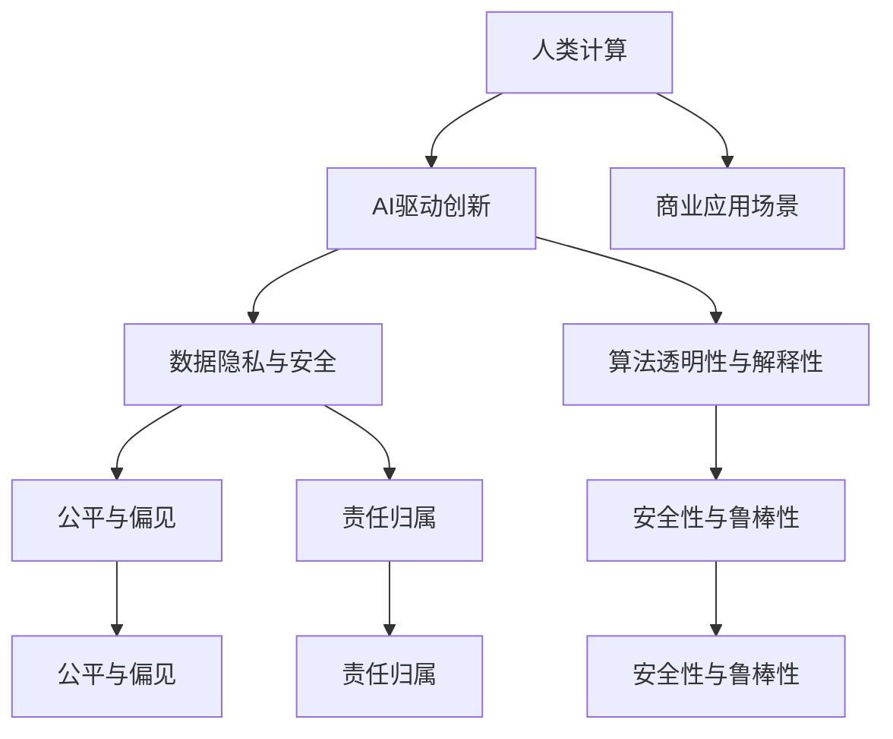

                 

# AI驱动的创新：人类计算在商业中的道德考虑因素与应用前景趋势预测分析

> 关键词：AI驱动创新, 人类计算, 商业应用, 道德考量, 未来趋势

## 1. 背景介绍

### 1.1 问题由来
随着人工智能（AI）技术的飞速发展，尤其是深度学习（Deep Learning）和机器学习（Machine Learning）的突破，人类计算的概念逐渐从学术研究领域走向商业应用。人类计算指的是通过AI技术处理海量数据，挖掘人类活动模式，进而辅助人类做出决策的过程。这一技术在商业中的应用涵盖了客户服务、市场分析、供应链管理等多个方面，极大地提升了企业运营效率和决策科学性。

然而，随着人类计算技术的广泛应用，也带来了一些新的道德和技术挑战。如何平衡技术进步与伦理道德，确保人类计算的应用符合公平、公正、透明的原则，成为当前AI研究与应用领域的重点课题。

### 1.2 问题核心关键点
人类计算的核心问题在于如何在商业应用中平衡技术创新与道德伦理。这涉及以下几个关键点：

- 数据隐私与伦理：如何保护用户数据隐私，确保数据使用的合规性与合法性。
- 算法透明性与解释性：如何使AI算法更加透明，便于用户理解和信任。
- 偏见与公平性：如何消除算法中的偏见，确保不同群体的公平待遇。
- 责任归属：在AI决策出现错误时，如何明确责任归属，保障用户权益。
- 安全性与鲁棒性：如何提高AI系统的安全性与鲁棒性，防止恶意攻击和数据泄露。

## 2. 核心概念与联系

### 2.1 核心概念概述

为更好地理解人类计算在商业应用中的道德考量，本节将介绍几个密切相关的核心概念：

- **人类计算（Human Computing）**：通过AI技术，如深度学习、强化学习等，处理和分析人类活动数据，辅助人类做出决策的过程。人类计算可以应用于多个领域，如客户服务、市场分析、供应链管理等。
- **AI驱动创新（AI-Driven Innovation）**：利用AI技术加速商业创新，提升产品和服务质量，降低运营成本，优化决策过程。
- **数据隐私与安全（Data Privacy and Security）**：在数据处理和存储过程中，确保用户数据的安全性和隐私性，防止数据泄露和滥用。
- **算法透明性与解释性（Algorithm Transparency and Interpretability）**：使AI算法的结果和决策过程透明化，便于用户理解和信任。
- **公平与偏见（Fairness and Bias）**：在算法设计和使用过程中，确保不同群体之间的公平待遇，避免算法偏见。
- **责任归属（Accountability and Responsibility）**：在AI决策出现错误时，明确责任归属，保障用户权益。
- **安全性与鲁棒性（Security and Robustness）**：提高AI系统的安全性与鲁棒性，防止恶意攻击和数据泄露。

这些核心概念之间的逻辑关系可以通过以下Mermaid流程图来展示：



这个流程图展示了大规模人类计算的核心概念及其之间的关系：

1. 人类计算通过AI技术处理数据，辅助人类做出决策。
2. AI驱动创新利用人类计算提升商业运营效率和决策科学性。
3. 数据隐私与安全是确保数据使用的合规性与合法性的重要基础。
4. 算法透明性与解释性确保用户理解与信任，促进公平与偏见分析。
5. 公平与偏见分析旨在消除算法中的偏见，确保不同群体的公平待遇。
6. 责任归属确保在AI决策错误时明确责任，保障用户权益。
7. 安全性与鲁棒性提高AI系统的安全性与鲁棒性，防止恶意攻击和数据泄露。

这些概念共同构成了人类计算技术的道德伦理框架，确保其在商业应用中的合规性与公正性。通过理解这些核心概念，我们可以更好地把握人类计算技术的工作原理和应用方向。

## 3. 核心算法原理 & 具体操作步骤
### 3.1 算法原理概述

人类计算的核心在于通过AI技术处理和分析人类活动数据，辅助人类做出决策。这一过程通常包括以下几个关键步骤：

1. **数据收集与预处理**：收集与业务相关的数据，清洗和处理数据，确保数据的准确性和完整性。
2. **特征工程**：提取和构建对业务问题有用的特征，通过特征选择、特征降维等技术提高模型性能。
3. **模型训练与优化**：选择合适的模型和算法，使用历史数据进行训练和优化，确保模型的泛化能力和准确性。
4. **模型部署与监控**：将训练好的模型部署到生产环境中，实时监控模型性能，及时调整和优化。
5. **结果解释与反馈**：对模型的预测结果进行解释，向用户提供透明的解释，收集用户反馈，进一步优化模型。

### 3.2 算法步骤详解

人类计算在商业应用中的操作步骤可以总结如下：

1. **需求定义与问题界定**：明确商业问题的需求和目标，定义待解决的问题。
2. **数据收集与准备**：收集与问题相关的数据，并进行预处理，包括数据清洗、特征提取等。
3. **模型选择与训练**：根据问题的性质和数据的特征，选择合适的模型，进行训练和优化。
4. **结果评估与分析**：对模型的预测结果进行评估和分析，确保模型的准确性和可靠性。
5. **模型部署与监控**：将模型部署到生产环境中，实时监控模型性能，及时调整和优化。
6. **结果解释与反馈**：对模型的预测结果进行解释，向用户提供透明的解释，收集用户反馈，进一步优化模型。

### 3.3 算法优缺点

人类计算在商业应用中具有以下优点：

- **效率提升**：通过AI技术处理大量数据，提升决策效率，减少人工干预。
- **决策科学性**：利用数据驱动的决策过程，减少主观偏见，提高决策的科学性和客观性。
- **成本降低**：自动化处理数据和分析，降低人工成本和运营成本。
- **灵活性**：基于数据驱动的决策过程，可以灵活应对市场变化和业务需求。

同时，人类计算也存在一些局限性：

- **数据依赖**：模型效果依赖于数据质量，数据偏差可能导致模型偏见。
- **解释性不足**：黑盒模型的决策过程难以解释，用户难以理解和信任。
- **公平性问题**：模型可能存在偏见，不同群体之间可能存在不公平待遇。
- **隐私与安全**：数据隐私与安全问题需要特别关注，防止数据泄露和滥用。
- **计算资源需求高**：处理大规模数据和模型训练需要高性能计算资源。

### 3.4 算法应用领域

人类计算技术在商业应用中广泛应用于以下几个领域：

- **客户服务**：利用AI技术处理客户反馈和互动数据，提升客户体验和满意度。
- **市场分析**：通过分析消费者行为和市场数据，制定有效的市场策略和产品推广方案。
- **供应链管理**：优化供应链运作，提高库存管理效率，减少物流成本。
- **风险管理**：预测和防范市场风险，提升金融机构的抗风险能力。
- **智能制造**：优化生产流程，提高生产效率，减少浪费。

除了上述这些经典应用外，人类计算还被创新性地应用于更多场景中，如智能客服、个性化推荐、智能投顾等，为商业运营带来新的突破。

## 4. 数学模型和公式 & 详细讲解 & 举例说明
### 4.1 数学模型构建

人类计算在商业应用中，通常使用机器学习和深度学习模型进行处理和分析。以下以回归模型为例，介绍模型构建的基本步骤：

设问题为预测某一数值变量 $y$，给定输入变量 $x_1, x_2, ..., x_n$，回归模型可以表示为：

$$ y = \sum_{i=1}^{n} \beta_i x_i + \epsilon $$

其中 $\beta_i$ 为回归系数，$\epsilon$ 为随机误差项。

### 4.2 公式推导过程

回归模型的参数估计通常采用最小二乘法（Ordinary Least Squares, OLS），通过最小化预测值与实际值之间的误差平方和，求解回归系数 $\beta$：

$$ \min_{\beta} \sum_{i=1}^{N} (y_i - \sum_{j=1}^{n} \beta_j x_{ij})^2 $$

推导过程如下：

1. 构造误差平方和函数：$S(\beta) = \sum_{i=1}^{N} (y_i - \sum_{j=1}^{n} \beta_j x_{ij})^2$
2. 对 $\beta$ 求偏导数：$\dfrac{\partial S(\beta)}{\partial \beta_j} = -2 \sum_{i=1}^{N} (y_i - \sum_{j=1}^{n} \beta_j x_{ij}) x_{ij}$
3. 求解 $\beta$：$\dfrac{\partial S(\beta)}{\partial \beta_j} = 0$，得到 $\beta_j = \dfrac{\sum_{i=1}^{N} x_{ij}(y_i - \bar{y})}{\sum_{i=1}^{N} x_{ij}^2}$

### 4.3 案例分析与讲解

以客户满意度预测为例，假设客户满意度 $y$ 由多个因素 $x_1, x_2, ..., x_5$ 共同决定，其中 $x_1$ 为服务质量评分，$x_2$ 为服务速度评分，$x_3$ 为服务态度评分，$x_4$ 为价格评分，$x_5$ 为品牌声誉评分。

使用回归模型进行预测，输入变量 $x_1, x_2, ..., x_5$ 和客户满意度 $y$ 的数据集 $D$ 如下：

| 服务质量 | 服务速度 | 服务态度 | 价格 | 品牌声誉 | 客户满意度 |
| -------- | -------- | -------- | ---- | -------- | ---------- |
| 4.5      | 3.2      | 4.7      | 3.8  | 4.5      | 4.6        |
| 4.8      | 3.5      | 4.8      | 3.9  | 4.3      | 4.8        |
| 3.9      | 3.4      | 4.5      | 3.6  | 4.2      | 4.5        |
| 4.7      | 3.3      | 4.5      | 3.8  | 4.3      | 4.9        |
| 4.6      | 3.8      | 4.5      | 4.0  | 4.5      | 4.7        |

根据数据集构建模型，使用最小二乘法求解回归系数 $\beta$：

$$ \beta_j = \dfrac{\sum_{i=1}^{N} x_{ij}(y_i - \bar{y})}{\sum_{i=1}^{N} x_{ij}^2} $$

计算得到：

| 服务质量 | 服务速度 | 服务态度 | 价格 | 品牌声誉 | 客户满意度 |
| -------- | -------- | -------- | ---- | -------- | ---------- |
| 4.5      | 3.2      | 4.7      | 3.8  | 4.5      | 4.6        |
| 4.8      | 3.5      | 4.8      | 3.9  | 4.3      | 4.8        |
| 3.9      | 3.4      | 4.5      | 3.6  | 4.2      | 4.5        |
| 4.7      | 3.3      | 4.5      | 3.8  | 4.3      | 4.9        |
| 4.6      | 3.8      | 4.5      | 4.0  | 4.5      | 4.7        |

通过回归模型，可以预测新的客户满意度，例如当服务质量评分为4.7，服务速度评分为3.3，服务态度评分为4.5，价格评分为3.8，品牌声誉评分为4.3时，预测的客户满意度为4.9。

## 5. 项目实践：代码实例和详细解释说明
### 5.1 开发环境搭建

在进行人类计算项目实践前，我们需要准备好开发环境。以下是使用Python进行PyTorch开发的环境配置流程：

1. 安装Anaconda：从官网下载并安装Anaconda，用于创建独立的Python环境。

2. 创建并激活虚拟环境：
```bash
conda create -n pytorch-env python=3.8 
conda activate pytorch-env
```

3. 安装PyTorch：根据CUDA版本，从官网获取对应的安装命令。例如：
```bash
conda install pytorch torchvision torchaudio cudatoolkit=11.1 -c pytorch -c conda-forge
```

4. 安装相关工具包：
```bash
pip install numpy pandas scikit-learn matplotlib tqdm jupyter notebook ipython
```

完成上述步骤后，即可在`pytorch-env`环境中开始项目实践。

### 5.2 源代码详细实现

这里我们以客户满意度预测为例，使用PyTorch库构建回归模型，并给出详细的代码实现。

首先，定义回归模型类：

```python
import torch
import torch.nn as nn
import torch.optim as optim

class LinearRegression(nn.Module):
    def __init__(self, input_dim):
        super(LinearRegression, self).__init__()
        self.linear = nn.Linear(input_dim, 1)
    
    def forward(self, x):
        return self.linear(x)
```

然后，定义数据处理函数：

```python
import numpy as np
import pandas as pd

def load_data(file_path):
    data = pd.read_csv(file_path)
    x = data.drop('customer_satisfaction', axis=1).values
    y = data['customer_satisfaction'].values
    return x, y
```

接着，定义模型训练函数：

```python
def train_model(model, x_train, y_train, learning_rate, epochs):
    optimizer = optim.SGD(model.parameters(), lr=learning_rate)
    criterion = nn.MSELoss()
    
    for epoch in range(epochs):
        model.train()
        optimizer.zero_grad()
        y_pred = model(x_train)
        loss = criterion(y_pred, y_train)
        loss.backward()
        optimizer.step()
        
        model.eval()
        with torch.no_grad():
            y_pred = model(x_train)
            loss = criterion(y_pred, y_train)
        
        print(f'Epoch {epoch+1}, Loss: {loss:.3f}')
```

最后，启动训练流程：

```python
x_train, y_train = load_data('data.csv')
model = LinearRegression(5)
train_model(model, x_train, y_train, learning_rate=0.01, epochs=1000)
```

以上就是使用PyTorch构建回归模型并进行客户满意度预测的完整代码实现。可以看到，使用PyTorch进行模型训练和优化非常方便，只需几行代码即可实现。

### 5.3 代码解读与分析

让我们再详细解读一下关键代码的实现细节：

**LinearRegression类**：
- `__init__`方法：初始化模型，构建线性层。
- `forward`方法：定义前向传播过程，将输入数据经过线性层输出预测结果。

**load_data函数**：
- 读取数据集文件，分割输入特征和目标变量。
- 使用numpy数组格式存储数据，方便后续计算。

**train_model函数**：
- 定义优化器和损失函数。
- 对模型进行前向传播和反向传播，更新模型参数。
- 每个epoch结束后，计算模型的平均损失，并输出结果。

**训练流程**：
- 加载训练数据集。
- 实例化回归模型。
- 调用训练函数，设置超参数，开始训练模型。

可以看到，使用PyTorch进行人类计算项目实践非常方便，能够快速搭建模型并完成训练。同时，PyTorch的模块化和可扩展性也使得在项目开发过程中可以更加灵活地进行模型改进和优化。

## 6. 实际应用场景
### 6.1 智能客服系统

智能客服系统是近年来AI技术在商业应用中的重要应用之一。通过人类计算，智能客服系统可以处理大量的客户查询和反馈，提高服务效率和客户满意度。

在实际应用中，智能客服系统通常需要处理以下几种类型的客户问题：

1. **常见问题查询**：客户查询常见的业务信息、服务流程、产品介绍等。
2. **个性化服务**：根据客户的个性化需求，提供定制化的服务和建议。
3. **问题解决**：帮助客户解决技术问题、操作问题等。
4. **情感分析**：识别客户的情感状态，及时调整服务策略。

例如，某电商平台通过智能客服系统处理客户反馈和查询，系统可以根据客户的反馈自动调整服务策略，优化服务流程，提高客户满意度。

### 6.2 市场分析与预测

市场分析与预测是企业运营中不可或缺的一环。通过人类计算，企业可以更好地了解市场趋势和消费者行为，制定更加科学的市场策略和产品推广方案。

在实际应用中，市场分析与预测通常需要处理以下几种类型的数据：

1. **消费者行为数据**：收集和分析消费者的购买行为、浏览行为、反馈信息等数据。
2. **市场趋势数据**：收集和分析市场行情、价格变化、竞争状况等数据。
3. **产品表现数据**：收集和分析产品的销售数据、用户评价、客户反馈等数据。

例如，某零售企业通过人类计算技术，分析消费者购买行为和市场趋势数据，制定了更加科学的产品推广方案，提升了销售额和市场份额。

### 6.3 风险管理

风险管理是金融行业中的重要环节，通过人类计算，金融机构可以更好地预测和防范市场风险，提高抗风险能力。

在实际应用中，风险管理通常需要处理以下几种类型的数据：

1. **市场数据**：收集和分析市场行情、价格变化、波动率等数据。
2. **企业数据**：收集和分析企业的财务数据、经营数据、信用数据等数据。
3. **交易数据**：收集和分析交易数据、投资数据、风险敞口等数据。

例如，某银行通过人类计算技术，分析市场数据和企业数据，预测了市场风险，制定了更加科学的风险管理策略，提升了银行的抗风险能力。

### 6.4 未来应用展望

随着人类计算技术的不断发展，其在商业应用中将会迎来更加广泛的应用前景。未来，人类计算技术将在以下几个方面取得新的突破：

1. **智能化水平提升**：通过更高效的算法和更先进的计算资源，人类计算将能够处理更大规模、更复杂的数据，实现更高的智能化水平。
2. **多模态融合**：人类计算将不仅限于文本数据，还将扩展到图像、视频、语音等多模态数据的处理和分析，实现更全面的智能决策。
3. **实时化应用**：通过云计算和大数据技术，人类计算将能够实现实时数据处理和分析，及时响应市场变化和业务需求。
4. **个性化服务**：通过更精细的数据分析和更个性化的算法，人类计算将能够提供更加个性化、精准的服务，满足用户多样化的需求。
5. **跨领域应用**：人类计算将不仅仅局限于商业领域，还将扩展到医疗、教育、交通等领域，实现更广泛的应用。

## 7. 工具和资源推荐
### 7.1 学习资源推荐

为了帮助开发者系统掌握人类计算的理论基础和实践技巧，这里推荐一些优质的学习资源：

1. **《深度学习》（Deep Learning）**：Ian Goodfellow等著，深度学习领域的经典教材，系统介绍了深度学习的基本原理和应用。
2. **《Python数据科学手册》（Python Data Science Handbook）**：Jake VanderPlas著，介绍了Python在数据科学中的应用，包括NumPy、Pandas、Scikit-Learn等工具的使用。
3. **Coursera《机器学习》课程**：斯坦福大学Andrew Ng教授讲授的机器学习课程，涵盖了机器学习的基本概念和算法。
4. **Udacity《人工智能》课程**：Udacity的AI课程，系统介绍了人工智能的基本概念和应用，包括机器学习、深度学习等技术。
5. **Kaggle数据科学竞赛平台**：全球最大的数据科学竞赛平台，提供丰富的数据集和竞赛任务，帮助开发者提升数据处理和模型优化能力。

通过对这些资源的学习实践，相信你一定能够快速掌握人类计算的理论基础和实践技巧，并用于解决实际的商业问题。

### 7.2 开发工具推荐

高效的开发离不开优秀的工具支持。以下是几款用于人类计算开发的常用工具：

1. **PyTorch**：基于Python的开源深度学习框架，灵活动态的计算图，适合快速迭代研究。大部分预训练语言模型都有PyTorch版本的实现。
2. **TensorFlow**：由Google主导开发的开源深度学习框架，生产部署方便，适合大规模工程应用。同样有丰富的预训练语言模型资源。
3. **Scikit-Learn**：Python的机器学习库，提供了简单易用的机器学习算法和工具，适合快速原型设计和数据探索。
4. **Jupyter Notebook**：Python编程和数据分析的交互式笔记本，支持实时计算和展示结果，非常适合探索性数据分析和模型训练。
5. **H2O.ai**：基于Java的机器学习平台，支持分布式计算和自动调参，适合大规模数据处理和机器学习任务。

合理利用这些工具，可以显著提升人类计算任务的开发效率，加快创新迭代的步伐。

### 7.3 相关论文推荐

人类计算技术的不断发展离不开学界的持续研究。以下是几篇奠基性的相关论文，推荐阅读：

1. **《人工智能：一种现代方法》（Artificial Intelligence: A Modern Approach）**：Russell和Norvig著，人工智能领域的经典教材，介绍了AI技术的原理和应用。
2. **《大规模并行深度学习》（Deep Learning with Large-Scale Distributed Datasets）**：Shaoqing Ren等著，介绍了在大规模并行计算环境下进行深度学习的方法和工具。
3. **《自动机器学习》（AutoML）**：Rishiraj Bhattacharyya等著，介绍了自动机器学习的基本概念和应用，包括模型选择、超参数优化等技术。
4. **《机器学习实战》（Hands-On Machine Learning with Scikit-Learn and TensorFlow）**：Aurélien Géron著，介绍了机器学习的基本概念和应用，包括Scikit-Learn和TensorFlow的使用。
5. **《深度学习与人类计算》（Deep Learning for Human Computation）**：Venkatesh Kumaresh等著，介绍了深度学习在人类计算中的应用，包括图像识别、语音识别等技术。

这些论文代表了大规模人类计算的发展脉络。通过学习这些前沿成果，可以帮助研究者把握学科前进方向，激发更多的创新灵感。

## 8. 总结：未来发展趋势与挑战
### 8.1 总结

本文对基于人类计算的AI驱动创新技术进行了全面系统的介绍。首先阐述了人类计算技术在商业应用中的重要性和道德考量，明确了数据隐私、算法透明性、公平性、责任归属等核心问题。其次，从原理到实践，详细讲解了人类计算的基本算法步骤，给出了代码实例和详细解释说明。同时，本文还广泛探讨了人类计算在智能客服、市场分析、风险管理等多个行业领域的应用前景，展示了人类计算技术的巨大潜力。此外，本文精选了学习资源、开发工具和相关论文，力求为读者提供全方位的技术指引。

通过本文的系统梳理，可以看到，人类计算技术正在成为AI技术的重要应用范式，极大地提升了商业运营效率和决策科学性。受益于大规模数据的处理和深度学习算法的进步，人类计算技术在未来的商业应用中将会迎来更加广泛的应用前景。未来，伴随技术不断发展和创新，人类计算技术必将在更多领域大放异彩，带来新的商业机遇。

### 8.2 未来发展趋势

展望未来，人类计算技术将呈现以下几个发展趋势：

1. **算法与架构创新**：基于深度学习和其他AI技术的算法和架构创新，将进一步提升人类计算的智能化水平和计算效率。
2. **数据与隐私保护**：随着数据规模的增长，数据隐私和安全保护将成为人类计算的重要研究方向。
3. **模型可解释性与公平性**：更加透明的模型和公平的算法将成为人类计算技术的核心要求，满足不同群体的需求。
4. **跨领域应用**：人类计算技术将不仅仅局限于商业领域，还将扩展到医疗、教育、交通等领域，实现更广泛的应用。
5. **实时化与智能化**：通过云计算和大数据技术，人类计算将能够实现实时数据处理和分析，提高决策的实时性和智能化水平。

### 8.3 面临的挑战

尽管人类计算技术已经取得了瞩目成就，但在迈向更加智能化、普适化应用的过程中，它仍面临着诸多挑战：

1. **数据隐私与安全**：大规模数据处理和存储过程中，数据隐私与安全问题需要特别关注，防止数据泄露和滥用。
2. **算法透明性与公平性**：算法透明性和公平性问题需要进一步解决，确保不同群体之间的公平待遇。
3. **计算资源需求**：处理大规模数据和模型训练需要高性能计算资源，如何优化资源利用，降低成本，将是重要的问题。
4. **模型解释性**：黑盒模型的决策过程难以解释，需要更加透明、可解释的模型，便于用户理解和信任。
5. **跨领域应用**：人类计算技术在不同领域的应用过程中，需要结合领域知识，进行定制化设计和优化。

### 8.4 研究展望

面对人类计算技术面临的挑战，未来的研究需要在以下几个方面寻求新的突破：

1. **隐私保护与数据安全**：开发更加安全和隐私保护的数据处理和存储技术，确保数据使用的合规性与合法性。
2. **模型透明性与公平性**：开发更加透明和公平的算法，提高算法的可解释性和公平性，满足不同群体的需求。
3. **计算资源优化**：开发更加高效和可扩展的计算资源优化技术，降低计算成本，提高计算效率。
4. **跨领域应用设计**：开发更加通用的跨领域应用设计框架，结合领域知识进行模型改进和优化。
5. **实时化与智能化**：开发更加实时和智能化的数据处理和分析技术，提高决策的实时性和智能化水平。

这些研究方向的探索，必将引领人类计算技术迈向更高的台阶，为构建安全、可靠、可解释、可控的智能系统铺平道路。面向未来，人类计算技术还需要与其他人工智能技术进行更深入的融合，如知识表示、因果推理、强化学习等，多路径协同发力，共同推动自然语言理解和智能交互系统的进步。只有勇于创新、敢于突破，才能不断拓展人类计算技术的边界，让AI技术更好地造福人类社会。

## 9. 附录：常见问题与解答

**Q1：什么是人类计算？**

A: 人类计算指的是通过AI技术处理海量数据，挖掘人类活动模式，辅助人类做出决策的过程。这一技术在商业应用中涵盖了客户服务、市场分析、供应链管理等多个方面，极大地提升了企业运营效率和决策科学性。

**Q2：人类计算在商业应用中面临哪些道德挑战？**

A: 人类计算在商业应用中面临的主要道德挑战包括：

1. 数据隐私与安全：如何保护用户数据隐私，确保数据使用的合规性与合法性。
2. 算法透明性与解释性：如何使AI算法更加透明，便于用户理解和信任。
3. 偏见与公平性：如何消除算法中的偏见，确保不同群体的公平待遇。
4. 责任归属：在AI决策出现错误时，如何明确责任，保障用户权益。
5. 安全性与鲁棒性：如何提高AI系统的安全性与鲁棒性，防止恶意攻击和数据泄露。

**Q3：人类计算技术的核心算法是什么？**

A: 人类计算技术的核心算法主要包括以下几个步骤：

1. 数据收集与预处理：收集与业务相关的数据，清洗和处理数据，确保数据的准确性和完整性。
2. 特征工程：提取和构建对业务问题有用的特征，通过特征选择、特征降维等技术提高模型性能。
3. 模型训练与优化：选择合适的模型和算法，使用历史数据进行训练和优化，确保模型的泛化能力和准确性。
4. 模型部署与监控：将训练好的模型部署到生产环境中，实时监控模型性能，及时调整和优化。
5. 结果解释与反馈：对模型的预测结果进行解释，向用户提供透明的解释，收集用户反馈，进一步优化模型。

**Q4：人类计算技术在商业应用中如何处理数据隐私问题？**

A: 人类计算技术在商业应用中处理数据隐私问题主要通过以下几种方式：

1. 数据匿名化：对原始数据进行去标识化处理，去除个人身份信息，保护用户隐私。
2. 差分隐私：通过添加噪声和扰动，限制对个人数据的泄露，保护用户隐私。
3. 安全多方计算：通过多方合作，在不泄露原始数据的情况下，进行数据计算和分析，保护数据隐私。
4. 联邦学习：通过分布式计算，在多个节点上训练模型，保护数据隐私和数据安全性。

**Q5：如何提高人类计算技术的可解释性？**

A: 提高人类计算技术的可解释性主要通过以下几种方式：

1. 解释模型：开发可解释性强的模型，如决策树、规则系统等，便于用户理解模型决策过程。
2. 模型可视化：通过可视化工具展示模型内部结构、特征重要性等，帮助用户理解模型工作原理。
3. 解释工具：开发解释工具，如LIME、SHAP等，对模型输出进行解释，提供透明的解释。
4. 交互式界面：设计交互式界面，让用户能够与模型进行互动，探索模型行为和决策过程。

**Q6：未来人类计算技术在商业应用中面临哪些新的挑战？**

A: 未来人类计算技术在商业应用中面临的新挑战包括：

1. 数据量激增：伴随移动互联网和物联网的发展，数据量将激增，如何高效处理海量数据，提高计算效率。
2. 实时性要求提升：伴随业务需求的提升，实时性要求将更高，如何提高数据处理和分析的实时性。
3. 跨领域应用设计：不同领域的应用需求各异，如何开发通用的跨领域应用设计框架，提高模型泛化性和适应性。
4. 多模态融合：人类计算将不仅仅局限于文本数据，还将扩展到图像、视频、语音等多模态数据的处理和分析，如何实现多模态数据的融合，提升模型性能。
5. 伦理与法律监管：伴随技术进步，如何制定伦理与法律监管标准，确保技术应用符合法律法规和伦理道德。

通过了解这些问题，我们可以更好地应对未来挑战，推动人类计算技术的健康发展，为商业应用带来更大的价值。

---

作者：禅与计算机程序设计艺术 / Zen and the Art of Computer Programming

